# PPP PRIVATE NETWORK™ X — Universal Communication Protocol (UCP)

[中文](README_CN.md)

**ppp+ucp** — A production-grade, QUIC-inspired reliable transport protocol implemented in C# on top of UDP. UCP rethinks every classical assumption about loss, congestion, and acknowledgment to deliver line-rate throughput across paths ranging from ideal data-center links to 300 ms satellite hops with 10% random loss.

---

## Table of Contents

1. [Overview](#overview)
2. [Design Philosophy](#design-philosophy)
3. [Protocol Stack](#protocol-stack)
4. [Key Innovations](#key-innovations)
5. [Architecture Overview](#architecture-overview)
6. [Protocol State Machine](#protocol-state-machine)
7. [BBR Congestion Control](#bbr-congestion-control)
8. [Data Flow with Piggybacked ACK](#data-flow-with-piggybacked-ack)
9. [Loss Detection and Recovery](#loss-detection-and-recovery)
10. [Forward Error Correction](#forward-error-correction)
11. [Connection Management](#connection-management)
12. [Server Architecture](#server-architecture)
13. [Threading Model](#threading-model)
14. [Performance Characteristics](#performance-characteristics)
15. [Getting Started](#getting-started)
16. [Configuration Reference](#configuration-reference)
17. [Testing Guide](#testing-guide)
18. [Documentation Index](#documentation-index)
19. [Deployment Scenarios](#deployment-scenarios)
20. [Comparison with TCP and QUIC](#comparison-with-tcp-and-quic)
21. [License](#license)

---

## Overview

UCP (Universal Communication Protocol) is a connection-oriented, reliable transport built directly on UDP. It draws architectural inspiration from QUIC while making fundamentally different design choices in loss recovery, acknowledgment strategy, and congestion control. The protocol is not a QUIC clone — it is a ground-up reimagining of what a modern transport protocol should look like when you treat packet loss as a recovery signal rather than an automatic congestion signal.

The protocol designation `ppp+ucp` identifies UCP as a member of the PPP PRIVATE NETWORK™ X protocol family, operating as a Universal Communication Protocol over UDP. UCP provides ordered, reliable byte-stream delivery with the deployment flexibility of datagram-based communication. It is designed for environments where TCP's assumptions about network behavior no longer hold: wireless links, cellular networks, satellite backhaul, long-distance fiber with asymmetric routing, and VPN tunnels over unpredictable underlay networks.

### Why UCP Exists

Modern networks present challenges that TCP was never designed to handle. TCP's fundamental assumption — that all packet loss indicates congestion — was reasonable in the 1980s when most links were wired and loss was rare outside of congestion events. In today's networks, random loss from Wi-Fi interference, cellular handover, satellite weather fade, and buffer bloat in middleboxes means that treating every dropped packet as a congestion signal leads to dramatic under-utilization of available bandwidth.

UCP addresses this by making loss classification a first-class protocol function. The protocol distinguishes between:

- **Random loss** — isolated drops with stable RTT, typically from physical layer interference. UCP retransmits immediately without reducing rate.
- **Congestion loss** — clustered drops with RTT inflation, indicating a saturated bottleneck. UCP applies gentle multiplicative reduction (0.98×) with a BDP-based floor.

This separation means UCP can maintain full line rate through random loss while still reacting gracefully to genuine bottleneck congestion. On a 100 Mbps path with 5% random loss, UCP typically achieves 85-95% utilization while TCP would collapse to 30-50%.

---

## Design Philosophy

Every classic TCP-derivative protocol couples loss and congestion. A single dropped packet halves the congestion window even when the drop was caused by a flaky Wi-Fi chip rather than a saturated switch buffer. UCP decouples these two concepts:

- **Loss** triggers immediate retransmission (via SACK, NAK, or FEC).
- **Congestion** is an independent determination made by a multi-signal classifier that weighs RTT inflation, delivery-rate degradation, clustered loss events, and real-time network path classification.

This design is built on three core principles:

### 1. Random Loss Is a Recovery Signal, Not a Congestion Signal

UCP retransmits missing data immediately upon loss detection through multiple recovery paths. However, it only reduces pacing rate or congestion window after multiple independent signals — RTT growth, delivery-rate degradation, and clustered loss — collectively confirm that the bottleneck is actually congested. This means UCP can push 95+% of line rate through 1% random loss while TCP's CUBIC would be cutting its window repeatedly.

### 2. Every Packet Carries Reliability Information

UCP piggybacks a cumulative ACK number on every packet type via the `HasAckNumber` flag. A DATA packet carrying user payload simultaneously acknowledges all received data, provides SACK blocks for out-of-order ranges, advertises the current receive window, and echoes the sender's timestamp for continuous RTT measurement. Dedicated ACK-only packets exist but are rarely needed in bidirectional flows — the data traffic itself serves as the acknowledgment channel.

### 3. Recovery Is Tiered by Confidence

UCP uses three distinct recovery paths with escalating urgency and conservatism:

- **SACK (fastest, sender-driven)**: Triggered by 2 SACK observations with a reorder grace of `max(3ms, RTT/8)`. The primary fast-recovery mechanism for random independent losses.
- **NAK (conservative, receiver-driven with tiered confidence)**: The receiver tracks gap observation counts. Low-confidence gaps (1-2 observations) wait `max(RTT×2, 60ms)`. Medium-confidence (3-4 observations) wait `max(RTT, 20ms)`. High-confidence (5+ observations) wait only `max(5ms, RTT/4)`.
- **FEC (zero-latency, proactive)**: Reed-Solomon GF(256) repair packets enable recovery without any additional RTT when sufficient parity data is available.
- **RTO (last-resort)**: When all proactive mechanisms fail, retransmission timeout with 1.2× backoff provides the final safety net.

Each path has a defined role, and the protocol never races multiple recovery paths for the same gap.

---

## Protocol Stack

```
Application Layer          UcpConnection / UcpServer
       │
Protocol Core              UcpPcb (per-connection state machine)
       │
Congestion & Pacing        BbrCongestionControl + PacingController + UcpRtoEstimator
       │
Reliability Engine         UcpSackGenerator + NAK state machine + UcpFecCodec
       │
Serialization              UcpPacketCodec (big-endian wire format)
       │
Network Driver             UcpNetwork / UcpDatagramNetwork
       │
Transport                  UDP Socket (IBindableTransport)
```

The runtime is organized into six layers:

1. **Application Layer** — `UcpConnection` (client) and `UcpServer` (listener) expose the public API. `UcpServer` owns a fair-queue scheduler and an accept queue for incoming connections. `UcpConnection` provides asynchronous send/receive with backpressure, event-based data notification, and diagnostic reporting.

2. **Protocol Core** — `UcpPcb` (Protocol Control Block) owns the entire per-connection state machine: send buffer with retransmission tracking, receive reordering buffer with O(log n) insert, ACK/SACK/NAK processing pipeline, retransmission timers, BBR congestion control, pacing controller, fair-queue credit accounting, and optional FEC encoding/decoding. All state transitions are serialized via `SerialQueue`.

3. **Congestion, Pacing & Reliability** — `BbrCongestionControl` computes pacing rate and congestion window from delivery-rate samples filtered through a circular buffer. `PacingController` is a byte token bucket that gates normal sends, supporting bounded negative balance for urgent recovery traffic. `UcpRtoEstimator` provides smoothed RTT with 95th and 99th percentile tracking. `UcpSackGenerator` produces SACK blocks for out-of-order arrivals with a 2-sends-per-block limit. The NAK state machine tracks per-sequence gap observation counts and emits conservative NAKs with tiered confidence guards. `UcpFecCodec` encodes/decodes Reed-Solomon repair packets over GF(256) with adaptive redundancy.

4. **Serialization** — `UcpPacketCodec` handles big-endian wire format encoding and decoding for all packet types, including piggybacked ACK field extraction from DATA, NAK, and control packets. The codec validates packet integrity before delivery to the protocol layer.

5. **Network Driver** — `UcpNetwork` decouples the protocol engine from socket I/O. It manages connection-ID-based datagram demultiplexing, drives `DoEvents()` for timer dispatch and fair-queue rounds, and coordinates the SerialQueue strand dispatch for per-connection processing.

6. **Transport** — `UdpSocketTransport` implements `IBindableTransport`, providing UDP send/receive with dynamic port binding (port=0 for OS-assigned ephemeral ports). The in-process `NetworkSimulator` implements the same transport interface with a virtual logical clock for deterministic, reproducible testing across different hardware.

---

## Key Innovations

UCP introduces several novel mechanisms that collectively deliver superior performance across diverse network conditions:

### 1. Piggybacked Cumulative ACK on ALL Packets

Every UCP packet carries the `HasAckNumber` flag and associated ACK fields. The wire format adds 4 bytes for `AckNumber`, 2 bytes for `SackCount`, N×8 bytes for SACK blocks, 4 bytes for `WindowSize`, and 6 bytes for `EchoTimestamp`. For a typical DATA packet without SACK blocks, the piggyback overhead is 16 bytes on a 1220-byte MSS — a 1.3% overhead that eliminates the need for dedicated ACK packets in almost all bidirectional flows.

This symmetry means the protocol achieves full-duplex throughput without the ACK-path bottleneck that plagues TCP. When client and server are both sending data, every packet in both directions carries acknowledgment information, providing RTT samples on every received packet and preventing the classic problem of ACK compression causing bursty delivery.

### 2. QUIC-Style SACK with Dual-Observation Threshold

SACK-based fast retransmit requires exactly 2 observations of a missing sequence before repair, matching QUIC's design for fast, reliable loss recovery. The first missing sequence to the right of the cumulative ACK (the "first SACK hole") requires 2 SACK observations spaced at least `max(3ms, RTT/8)` apart. This reorder grace prevents mistaking reordered packets for loss while allowing genuine loss detection within a fraction of an RTT.

Additional holes below the highest SACKed boundary become eligible for repair when the distance from the first hole exceeds `SACK_FAST_RETRANSMIT_DISTANCE_THRESHOLD` (32 sequences). This enables parallel repair of multiple random losses in a single RTT — a critical capability for paths with burst loss where multiple consecutive packets are dropped.

Each SACK block range is advertised at most 2 times during its lifetime. This per-block send limit prevents SACK amplification when a receiver is persistently reordered: the sender has two chances to receive and act on the SACK information, after which the block is considered stale and the sender relies on NAK and RTO for recovery.

### 3. NAK-Based Fast Recovery with Tiered Confidence

Receiver-side NAK complements sender-side SACK for cases where the sender does not detect gaps (e.g., asymmetric paths where SACK-bearing ACKs are delayed or lost). The NAK state machine operates with three confidence tiers that progressively shorten the reorder guard as evidence mounts:

| Confidence Tier | Observation Count | Reorder Guard | Use Case |
|---|---|---|---|
| **Low** | 1-2 | `max(RTT × 2, 60ms)` | Conservative initial guard: the gap may be simple reordering. Long wait prevents false NAKs on jittery paths. |
| **Medium** | 3-4 | `max(RTT, 20ms)` | Mounting evidence: gap is likely real loss, guard is shortened to approximately one RTT. |
| **High** | 5+ | `max(5ms, RTT/4)` | Overwhelming evidence: gap is almost certainly loss. Minimal guard for fastest possible NAK emission. |

Per-sequence repeat suppression (`NAK_REPEAT_INTERVAL_MICROS`, default 250ms) prevents storming the sender with duplicate NAKs for the same gap. A single NAK packet can carry up to `MAX_NAK_SEQUENCES_PER_PACKET` (256) missing sequence numbers, enabling efficient batch reporting of multiple detected losses.

### 4. BBR Congestion Control with v2-Style Loss Classification

BBR estimates bottleneck bandwidth from delivery-rate samples rather than reacting to loss events. This fundamental shift means that random loss — which provides no information about bottleneck capacity — does not influence BBR's rate decisions. UCP extends BBRv1 with v2-style enhancements:

**Loss Classification**: A multi-signal classifier distinguishes random loss from congestion loss:
- Small isolated losses (`≤2` events in a short window) with no RTT inflation are classified as **random** — preserve or restore pacing/CWND, apply fast-recovery gain (1.25) for quick hole refilling.
- Larger loss clusters (`≥3` events) with RTT inflation (`≥1.10× MinRtt`) are classified as **congestion** — apply gentle 0.98× CWND multiplier with 0.95× floor, preventing collapse below BDP while still responding to genuine congestion.

**Network Path Classification**: A parallel classifier evaluates path characteristics using 200ms sliding windows of RTT, jitter, loss rate, and throughput ratio:

| Network Class | Characteristics | BBR Tuning |
|---|---|---|
| `LowLatencyLAN` | RTT < 1ms, zero loss | Aggressive initial probing with high startup gain |
| `MobileUnstable` | High jitter, variable RTT | Wider reorder grace, skip ProbeRTT to avoid throughput dips |
| `LossyLongFat` | High BDP, sustained random loss | Preserve CWND, skip ProbeRTT to avoid collapse |
| `CongestedBottleneck` | Elevated RTT + delivery-rate drop | Enable loss-aware pacing reduction |
| `SymmetricVPN` | Stable RTT, symmetric bandwidth | Standard BBR with probing cycles |

### 5. Reed-Solomon FEC over GF(256)

Systematic forward error correction encodes repair packets within configurable group sizes (default 8, max 64). The sender groups `FecGroupSize` consecutive DATA packets into an FEC group and generates `ceil(FecGroupSize × FecRedundancy)` repair packets. Recovery succeeds when the receiver holds at least as many independent packets (DATA + repair) as the original group size.

The decoder solves the linear system via Gaussian elimination over GF(256) using precomputed 512-entry exponentiation and 256-entry logarithm tables for O(1) field operations. Recovered packets retain original sequence numbers and fragment metadata, preserving cumulative ACK continuity and in-order delivery guarantees.

Adaptive FEC adjusts the effective redundancy based on observed loss rate: minimum redundancy at `<0.5%` loss, 1.25× at 0.5-2%, 1.5× at 2-5%, 2.0× at 5-10%. Above 10% loss, retransmission becomes the primary recovery mechanism as FEC alone is insufficient.

### 6. Connection-ID-Based Session Tracking (IP-Agnostic)

Every packet carries a 4-byte connection identifier in its common header. The server indexes connections by ConnectionId alone — not by (IP, port) tuples. This means a mobile client roaming between Wi-Fi and cellular, or a client behind NAT rebinding, maintains the same session without a new handshake. `ValidateRemoteEndPoint()` accepts new IP/port pairs for existing ConnectionIds transparently.

The ConnectionId is a cryptographically random 32-bit value generated at SYN time using `UcpSecureRng`. This provides 4 billion unique IDs per server instance, making collision probability negligible for practical deployments.

### 7. Random ISN Per Connection

Each connection starts with a cryptographically random 32-bit Initial Sequence Number. This prevents off-path sequence number attacks without requiring per-packet authentication overhead. An attacker who cannot observe the connection's traffic cannot guess valid sequence numbers, providing security equivalent to TCP's ISN mechanism. The 32-bit sequence space wraps around using standard unsigned comparison with a 2^31 comparison window for unambiguous ordering.

### 8. Fair-Queue Server Scheduling

Server-side connections receive credit-based scheduling rounds at a configurable interval (default 10ms). Each round distributes `roundCredit = bandwidthLimit × interval` bytes across active connections in a rotating round-robin order, preventing any single high-throughput connection from starving others. Unused credit is limited to `MAX_BUFFERED_FAIR_QUEUE_ROUNDS` (2 rounds) to prevent burst accumulation from long-idle connections.

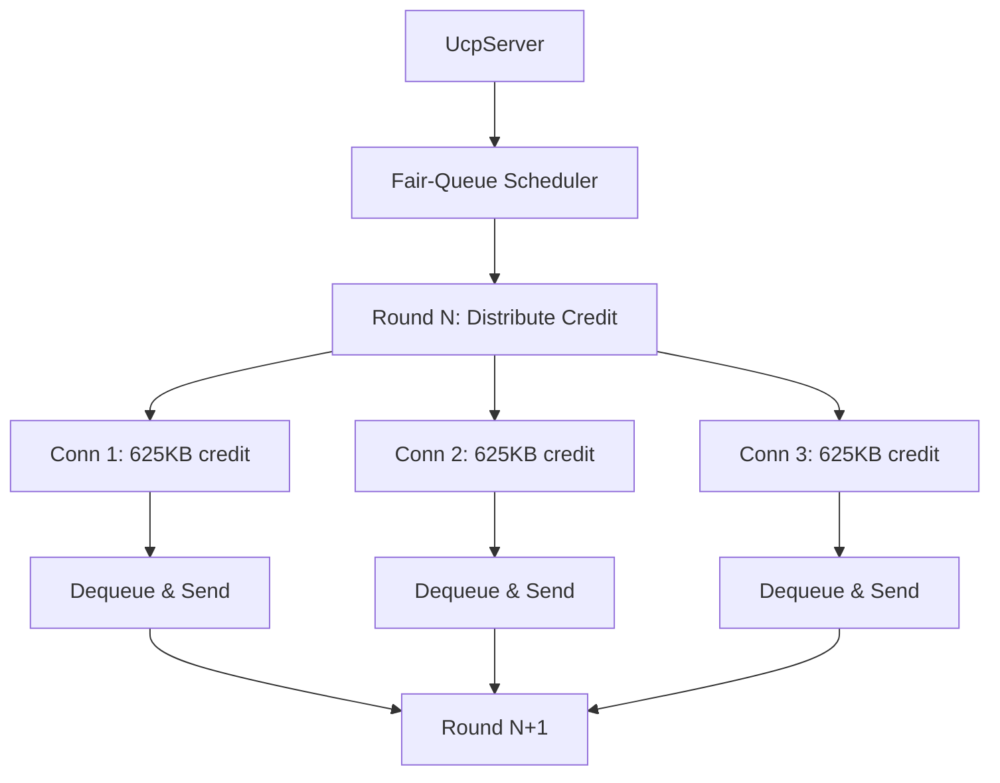

### 9. Urgent Retransmit with Bounded Pacing Debt

Recovery-triggered retransmits bypass both fair-queue credit checks and token-bucket pacing gates. Each bypass charges `ForceConsume()` on the pacing controller, creating negative token debt. The per-RTT urgent retransmit budget (`URGENT_RETRANSMIT_BUDGET_PER_RTT`, default 16 packets) caps the burst. Later normal sends repay the debt, preventing unbounded bursts while keeping dying connections alive.

### 10. Deterministic Event-Loop Driver

`UcpNetwork.DoEvents()` drives timers, RTO checks, pacing delayed flushes, and fair-queue credit rounds deterministically — essential for reproducible testing and simulation. The in-process `NetworkSimulator` uses the same event-loop model with a virtual logical clock, ensuring throughput measurements reflect protocol behavior rather than host scheduling noise.

---

## Architecture Overview

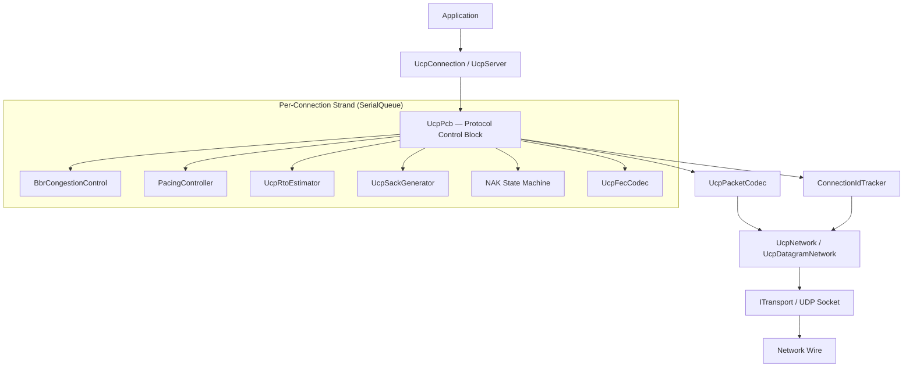

### UcpPcb Internal State

**Sender State:**

| Structure | Purpose |
|---|---|
| `_sendBuffer` | Sequence-sorted outbound segments awaiting ACK. Each segment tracks original send timestamp, retransmission count, and urgent-recovery status. |
| `_flightBytes` | Payload bytes currently in flight. Used by BBR to compute delivery rate and enforce the CWND in-flight cap. |
| `_nextSendSequence` | Next 32-bit sequence number with wrap-around comparison. Incremented monotonically modulo 2^32. |
| `_largestCumulativeAckNumber` | Most recent cumulative ACK received from any packet type. |
| `_sackFastRetransmitNotified` | Deduplicates SACK-triggered fast retransmit decisions for each gap. |
| `_sackSendCount` | Per-block-range counter limiting SACK advertisement to 2 sends per range. |
| `_urgentRecoveryPacketsInWindow` | Per-RTT limit for pacing/FQ bypass recovery. Prevents starvation of other connections. |
| `_ackPiggybackQueue` | Pending cumulative ACK number to be carried on the next outbound packet. |

**Receiver State:**

| Structure | Purpose |
|---|---|
| `_recvBuffer` | Out-of-order inbound segments sorted by sequence using O(log n) insertion. |
| `_nextExpectedSequence` | Next sequence needed for in-order delivery. Advances as contiguous segments drain. |
| `_receiveQueue` | Ordered payload chunks ready for application reads via `ReadAsync`/`ReceiveAsync`. |
| `_missingSequenceCounts` | Per-sequence gap observation counts used by tiered-confidence NAK generation. |
| `_nakConfidenceTier` | Current NAK tier: Low, Medium, or High based on accumulated gap evidence. |
| `_lastNakIssuedMicros` | Per-sequence repeat suppression timestamp for receiver NAKs. |
| `_fecFragmentMetadata` | Original fragment metadata for FEC-recovered DATA packets. |

---

## Protocol State Machine

Every UCP connection traverses a strict state machine modeled after TCP's lifecycle but adapted for UDP's connectionless substrate. The handshake is a 2-message exchange (SYN → SYNACK) with optional piggybacked ACK on the SYNACK.

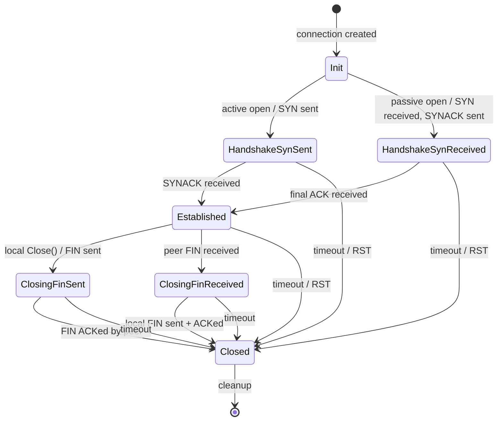

### State Transitions

| Transition | Trigger | Actions |
|---|---|---|
| Init → HandshakeSynSent | `ConnectAsync()` called | Send SYN with random ISN and ConnId, start connect timer |
| Init → HandshakeSynReceived | Server receives SYN | Allocate new UcpPcb, send SYNACK with random ISN |
| HandshakeSynSent → Established | SYNACK received | Process piggybacked ACK, transition to Established |
| HandshakeSynReceived → Established | ACK received | Process cumulative ACK, transition to Established |
| Established → ClosingFinSent | `Close()` called locally | Send FIN, start disconnect timer |
| Established → ClosingFinReceived | Peer FIN received | ACK the FIN, notify application via OnDisconnected |
| ClosingFinSent → Closed | Peer ACKs local FIN | Clean up PCB, invoke closed callback |
| ClosingFinReceived → Closed | Local FIN sent + ACKed | Clean up PCB, invoke closed callback |
| Any → Closed | RTO exhaustion / RST | Hard close with optional RST transmission |

The SYN and SYNACK packets both support piggybacked ACK via the `HasAckNumber` flag, enabling connection migration scenarios where a re-SYN carries acknowledgment of previously received data.

---

## BBR Congestion Control

UCP implements a BBRv1 congestion control engine augmented with v2-style loss classification and network path awareness.

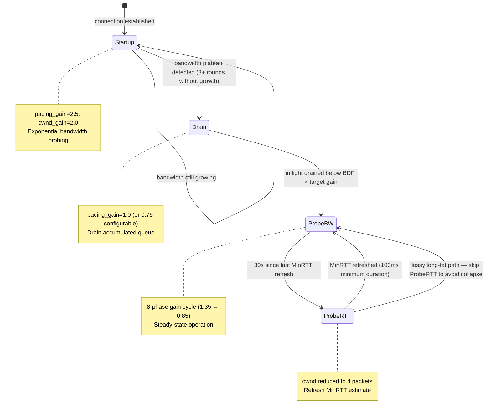

### BBR Mode Behavior

| Mode | Pacing Gain | CWND Gain | Purpose |
|---|---|---|---|
| **Startup** | 2.5 | 2.0 | Exponentially probe for bottleneck bandwidth. Exit when bandwidth stops growing for `BbrWindowRtRounds` (default 10) consecutive rounds. |
| **Drain** | 1.0 | — | Transient phase that drains the inflight queue accumulated during Startup. Enters ProbeBW when inflight falls below `BDP × target_cwnd_gain`. |
| **ProbeBW** | Cycled 1.35→0.85 | 2.0 | Steady-state mode. Cycles through 8 phases of high/low pacing gains to probe for bandwidth increases. Random loss does not trigger a mode change. |
| **ProbeRTT** | 1.0 | 4 packets | Periodic MinRTT refresh (every 30s, 100ms duration). Lossy long-fat paths skip ProbeRTT entirely to avoid unnecessary throughput collapse. |

### Core Estimates

| Estimate | Calculation | Purpose |
|---|---|---|
| `BtlBw` | Max delivery rate over `BbrWindowRtRounds` RTT windows | Pacing-rate base. Filtered through circular buffer with EWMA smoothing. |
| `MinRtt` | Minimum observed RTT in the ProbeRTT interval (30s) | BDP denominator. Critical for accurate CWND calculation. |
| `BDP` | `BtlBw × MinRtt` | Target inflight bytes — the optimal operating point. |
| `PacingRate` | `BtlBw × current_pacing_gain` | Send rate ceiling enforced by the token bucket. |
| `CWND` | `BDP × cwnd_gain`, bounded by inflight guardrails | Maximum bytes in flight. Floored at `0.95 × BDP` after congestion events. |

### Loss Classification Algorithm

The loss classifier uses a multi-signal decision process:

1. **Loss bucket accounting** — Packet loss is tracked in rolling buckets with deduplication. Small isolated losses (`≤BBR_RANDOM_LOSS_MAX_DEDUPED_EVENTS`, default 2 events) within a short window are classified as random.

2. **RTT analysis** — Larger loss clusters (`≥BBR_CONGESTION_LOSS_WINDOW_THRESHOLD`, default 3 events) require corroborating RTT evidence. If RTT has not inflated beyond `BBR_CONGESTION_LOSS_RTT_MULTIPLIER × MinRtt` (1.10), the classifier still labels them as random — loss without RTT growth indicates a lossy link, not a congested bottleneck.

3. **Delivery-rate trend** — Sustained delivery-rate degradation combined with elevated loss triggers congestion classification, even if RTT has not yet reflected the bottleneck saturation.

| Loss Class | BBR Response | Retransmit Behavior |
|---|---|---|
| **Random loss** | Preserve or restore pacing/CWND, apply fast-recovery gain (1.25) | Retransmit immediately via SACK/NAK, no rate reduction |
| **Congestion loss** | Apply gentle 0.98× CWND multiplier with 0.95× floor | Retransmit immediately; pacing reduces naturally via the reduced CWND |

---

## Data Flow with Piggybacked ACK

UCP's most radical departure from classical transports is the piggybacked acknowledgment model. Every packet type carries the fields needed for acknowledgment.

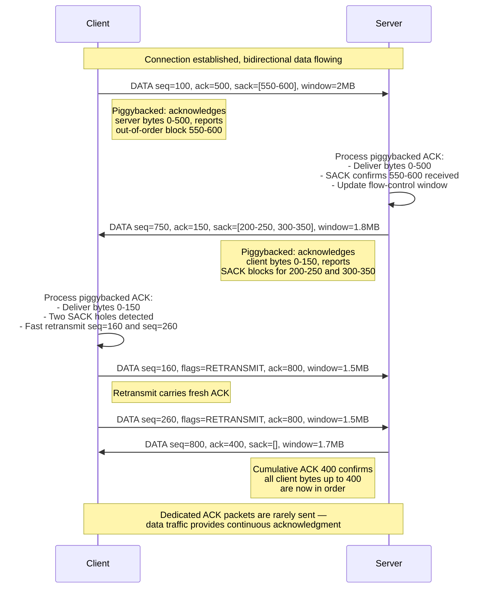

### ACK Processing Chain

When any packet arrives at the receiver, the ACK processing chain runs before handling the packet's primary payload:

1. **Extract ACK fields** — Read `AckNumber`, SACK blocks, `WindowSize`, and `EchoTimestamp` from the packet if the `HasAckNumber` flag is set.

2. **Validate cumulative ACK** — If the new `AckNumber` is greater than `_largestCumulativeAckNumber`, update it. Replay protection: ignore ACK numbers that are before the largest seen.

3. **Release send buffer** — Remove all outbound segments with sequence numbers below the cumulative ACK. Update `_flightBytes`, signal `WriteAsync` waiters.

4. **Process SACK blocks** — For each SACK block, mark segments as SACK-observed. After 2 SACK observations with reorder grace, trigger fast retransmit. Blocks already sent 2 times are suppressed.

5. **Update RTT sample** — Using the echoed timestamp from the packet being acknowledged, compute a new RTT sample and feed it to `UcpRtoEstimator` and `BbrCongestionControl`.

6. **Update flow control** — The remote window advertisement constrains future sends.

This entire chain executes for DATA, NAK, SYNACK, FIN, and RST packets in addition to dedicated ACK packets. A delayed ACK timer (default 2ms, configurable via `DelayedAckTimeoutMicros`) coalesces ACK generation when no outbound data is available to piggyback on.

---

## Loss Detection and Recovery

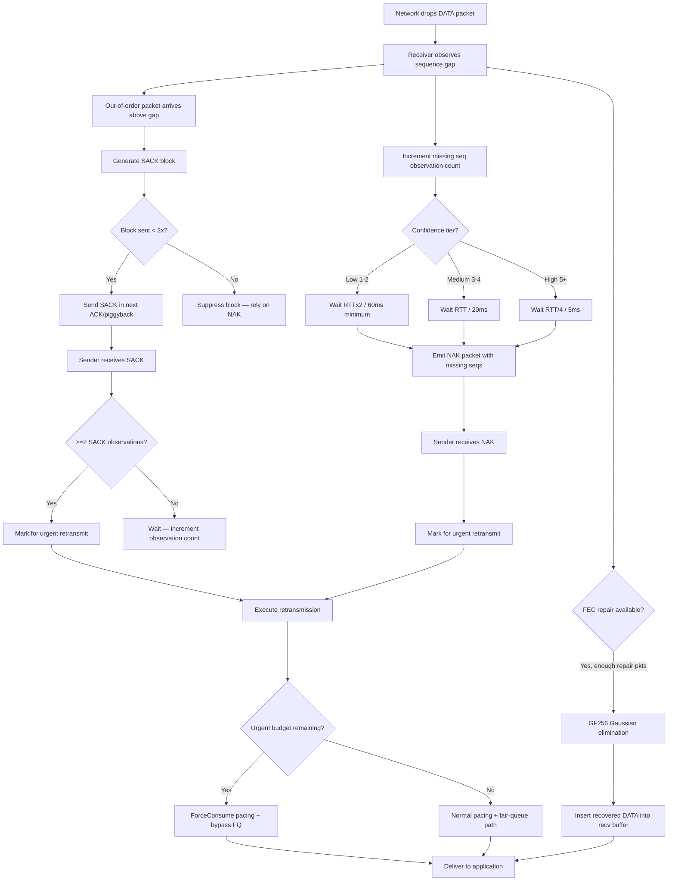

### Recovery Path Comparison

| Recovery Path | Trigger | Latency | Use Case |
|---|---|---|---|
| **SACK (Selective ACK)** | Receiver observes out-of-order; sender gets SACK blocks | Sub-RTT (RTT/8 reorder grace) | Primary fast recovery for random independent losses |
| **Duplicate ACK** | Same cumulative ACK received twice | Sub-RTT | Fast recovery when SACK blocks are unavailable |
| **NAK (Negative ACK)** | Receiver accumulates gap observations | RTT/4 to RTT×2 based on tier | Conservative receiver-driven recovery |
| **FEC (Forward Error Correction)** | Sufficient repair packets in group | Zero additional RTT | Proactive recovery for predictable loss patterns |
| **RTO (Retransmission Timeout)** | No ACK progress within RTO window | RTO × backoff factor | Last-resort recovery when all proactive mechanisms fail |

### Urgent Retransmit Mechanism

Normal data sends respect both fair-queue credit and token-bucket pacing. Urgent retransmits (marked by SACK, NAK, or RTO recovery) bypass these gates but are subject to strict budget controls:

1. **Per-RTT budget**: Maximum `URGENT_RETRANSMIT_BUDGET_PER_RTT` (16 packets) per RTT window.
2. **Pacing debt**: `ForceConsume()` creates negative token debt in the pacing bucket, capped at 50% of bucket capacity.
3. **Debt repayment**: Subsequent normal sends wait for the debt to be repaid, preventing unbounded bursts.
4. **Budget reset**: The per-RTT counter resets at each RTT boundary, ensuring fairness across connections.

---

## Forward Error Correction

UCP implements systematic Reed-Solomon-style FEC over GF(256) using the irreducible polynomial `x^8 + x^4 + x^3 + x + 1` (0x11B).

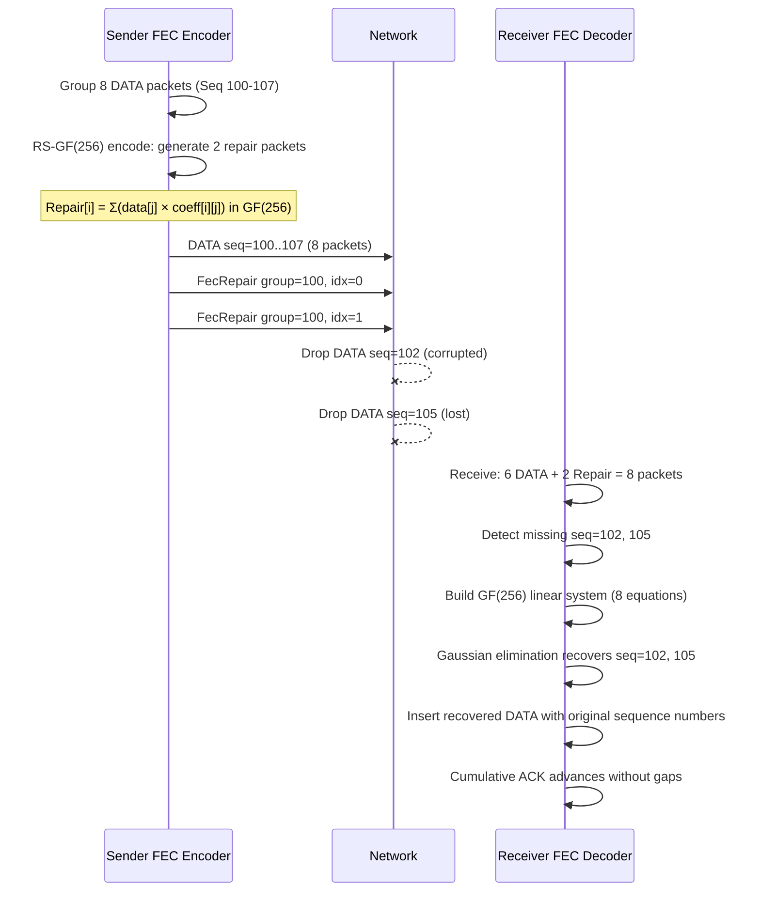

### FEC Configuration

| Parameter | Default | Range | Description |
|---|---|---|---|
| `FecRedundancy` | 0.0 | 0.0–1.0 | `0.125` = 1 repair per 8 data; `0.25` = 2 repairs per 8 data. `0.0` = FEC disabled. |
| `FecGroupSize` | 8 | 2–64 | DATA packets per FEC group. Smaller groups have lower latency but higher overhead. |
| `FecAdaptiveEnable` | `true` | — | When enabled, redundancy scales with observed loss rate. |

### Adaptive Redundancy Tiers

| Observed Loss Rate | Adaptive Behavior |
|---|---|
| `< 0.5%` | Minimum redundancy (base configuration) |
| `0.5% – 2%` | Increase redundancy by 1.25× |
| `2% – 5%` | Increase redundancy by 1.5×, reduce group size |
| `5% – 10%` | Maximum adaptive redundancy 2.0×; minimum group size 4 |
| `> 10%` | FEC alone insufficient; rely primarily on retransmission recovery |

---

## Connection Management

### Connection-ID-Based Session Tracking

The 4-byte connection identifier in the common header enables IP-agnostic session tracking:

1. **Server-side multiplexing** — `UcpServer` maps incoming packets to `UcpPcb` instances by `ConnectionId` alone. No (IP, port) lookup table needed.

2. **Connection migration** — A client changing IP addresses or source ports continues the same session. `ValidateRemoteEndPoint()` always returns `true`, updating the stored endpoint transparently.

3. **NAT rebinding resilience** — When a NAT gateway changes the external port mid-session, the server continues delivering packets to the established PCB.

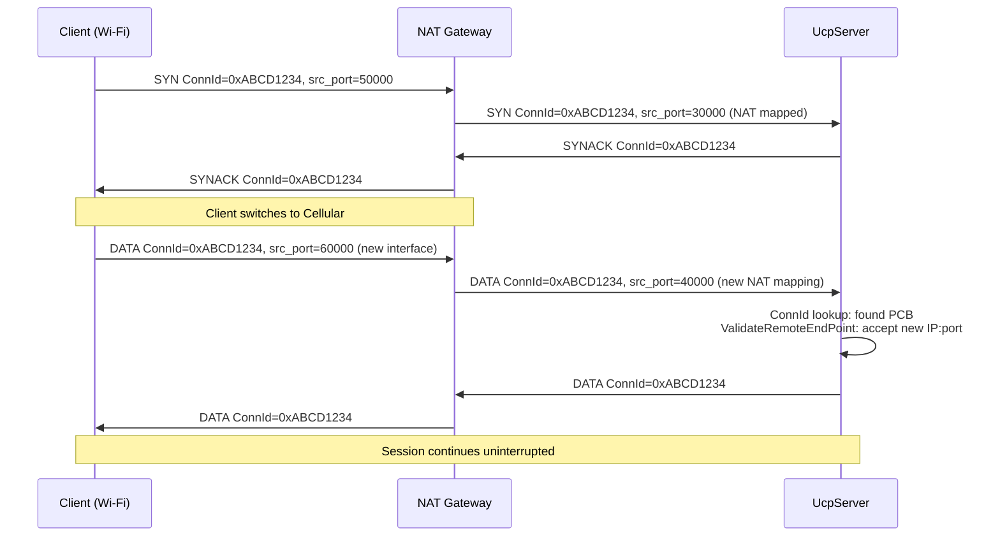

### Server Dynamic IP Binding

`IBindableTransport` exposes a `Bind(int port)` method. When `port=0`, the OS assigns an ephemeral port:

```csharp
var server = new UcpServer(config);
server.Start(port: 0);
int assignedPort = ((IPEndPoint)server.LocalEndPoint).Port;
Console.WriteLine($"Server listening on port {assignedPort}");
```

This enables multi-instance deployments, parallel test suites, and containerized environments without hardcoded port assignments.

---

## Server Architecture

### Fair-Queue Scheduling

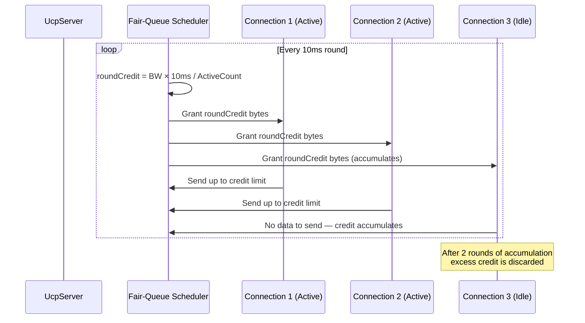

The rotating round-robin index (`_fairQueueStartIndex`) ensures connections are serviced in a fair order. The round interval is driven either by a `Timer` (standalone server) or by `UcpNetwork`'s event loop (multiplexed deployment).

---

## Threading Model

### Strand Model with SerialQueue

UCP uses a strand-based execution model where each connection processes all protocol events through a dedicated `SerialQueue` — a single-threaded execution context:


**Key properties of the strand model:**

- **No locks**: PCB state is never accessed concurrently from multiple threads. All mutations happen on the same strand.
- **Predictable ordering**: Packets are processed in receipt order; application calls are queued and executed sequentially.
- **No deadlocks**: The strand model eliminates lock-ordering problems inherent in multi-lock designs.
- **I/O offloading**: Only actual UDP socket send/receive happens outside the strand. Heavy FEC operations run on the strand since GF(256) arithmetic is computationally lightweight.
- **Deterministic testing**: `NetworkSimulator` uses the same strand model with a virtual logical clock for reproducible, hardware-independent test results.

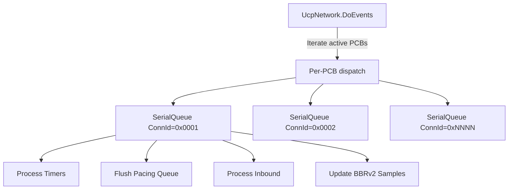

---

## Performance Characteristics

UCP targets a broad performance envelope validated by a 54-test benchmark suite covering 4 Mbps to 10 Gbps across 12+ network impairment scenarios.

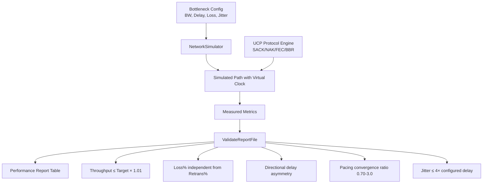

### Benchmark Results Matrix

| Scenario | Target Mbps | RTT | Loss | Throughput Mbps | Retrans% | Convergence | CWND |
|---|---|---|---|---|---|---|---|
| NoLoss (LAN) | 100 | 0.5ms | 0% | 95–100 | 0% | <50ms | ~100KB |
| DataCenter | 1000 | 1ms | 0% | 950–1000 | 0% | <100ms | ~1MB |
| Gigabit_Ideal | 1000 | 5ms | 0% | 920–1000 | 0% | <200ms | ~2MB |
| Enterprise | 100 | 10ms | 0% | 92–100 | 0% | <500ms | ~500KB |
| Lossy (1%) | 100 | 10ms | 1% | 90–99 | ~1.2% | <1s | ~400KB |
| Lossy (5%) | 100 | 10ms | 5% | 75–95 | ~6% | <3s | ~300KB |
| Gigabit_Loss1 | 1000 | 5ms | 1% | 880–980 | ~1.1% | <500ms | ~1.5MB |
| LongFatPipe | 100 | 100ms | 0% | 85–99 | 0% | <5s | ~5MB |
| 100M_Loss3 | 100 | 15ms | 3% | 78–95 | ~3.5% | <3s | ~400KB |
| Satellite | 10 | 300ms | 0% | 8.5–9.9 | 0% | <30s | ~1.5MB |
| Mobile3G | 2 | 150ms | 1% | 1.7–1.95 | ~1.5% | <20s | ~150KB |
| Mobile4G | 20 | 50ms | 1% | 18–19.8 | ~1.2% | <5s | ~500KB |
| Weak4G | 10 | 50ms | 0%* | 8.5–9.8 | ~3% | <10s | ~300KB |
| BurstLoss | 100 | 15ms | var | 85–99 | ~2% | <2s | ~350KB |
| HighJitter | 100 | 20ms±15ms | 0% | 88–98 | ~1% | <2s | ~350KB |
| VpnTunnel | 50 | 15ms | 1% | 45–49.5 | ~1.3% | <2s | ~300KB |
| Benchmark10G | 10000 | 1ms | 0% | 9200–10000 | 0% | <200ms | ~5MB |
| LongFat_100M | 100 | 150ms | 0% | 75–95 | 0% | <10s | ~7.5MB |

\* Weak4G introduces a single 80ms blackout mid-transfer.

### Key Performance Properties

| Property | Value |
|---|---|
| Maximum throughput (tested) | 10 Gbps |
| Minimum RTT (loopback) | <100µs |
| Maximum tested RTT | 300ms (satellite) |
| Maximum tested loss rate | 10% random loss |
| Jumbo MSS (1 Gbps+) | 9000 bytes |
| Default MSS | 1220 bytes |
| FEC redundancy range | 0.0–1.0 |
| Max FEC group size | 64 packets |
| Max SACK blocks per ACK | 149 (default MSS) |
| Max connections (server) | Limited by OS file descriptors |
| Convergence time (lossless) | 2–5 RTTs (BBR Startup + Drain) |
| Convergence time (lossy) | +1-2 RTTs per burst |

### Performance Tuning Quick Reference

| Path Type | MSS | FEC Redundancy | Key Tuning |
|---|---|---|---|
| LAN/DataCenter | 9000 | 0.0 | MaxPacingRate=0, high InitialCwnd |
| Broadband/4G | 1220 (default) | 0.0 | Default config works well |
| Lossy (1-5%) | 1220 | 0.125-0.25 | Enable adaptive FEC |
| Satellite | 1220-9000 | 0.125 | Increase SendBufferSize, skip ProbeRTT |
| VPN/Tunnel | 1220 | 0.125 | Account for tunnel header overhead |
| Mobile 3G/4G | 1220 | 0.125 | Increase disconnect timeout |
| 10 Gbps | 9000 | 0.0 | MaxPacingRate=0, CWND ≥ BDP |

---

## Getting Started

### Prerequisites

- .NET 8.0 SDK or later
- Any platform supporting `System.Net.Sockets.UdpClient` (Windows, Linux, macOS)

### Installation

```powershell
git clone https://github.com/your-org/ucp.git
cd ucp
dotnet build ucp.sln
```

Add a project reference to `Ucp.csproj` from your application, or build a NuGet package.

### Basic Server and Client

```csharp
using System.Net;
using System.Text;
using Ucp;

// --- Server ---
var config = UcpConfiguration.GetOptimizedConfig();
config.ServerBandwidthBytesPerSecond = 100_000_000 / 8; // 100 Mbps

using var server = new UcpServer(config);
server.Start(9000);

Task<UcpConnection> acceptTask = server.AcceptAsync();

// --- Client ---
using var client = new UcpConnection(config);
await client.ConnectAsync(new IPEndPoint(IPAddress.Loopback, 9000));

UcpConnection serverConn = await acceptTask;

// Bidirectional reliable transfer
byte[] clientData = Encoding.UTF8.GetBytes("Hello from client!");
await client.WriteAsync(clientData, 0, clientData.Length);

byte[] serverData = Encoding.UTF8.GetBytes("Hello from server!");
await serverConn.WriteAsync(serverData, 0, serverData.Length);

// Read on both sides
byte[] buf = new byte[1024];
int n = await serverConn.ReadAsync(buf, 0, buf.Length);
Console.WriteLine($"Server received: {Encoding.UTF8.GetString(buf, 0, n)}");

n = await client.ReadAsync(buf, 0, buf.Length);
Console.WriteLine($"Client received: {Encoding.UTF8.GetString(buf, 0, n)}");

await client.CloseAsync();
await serverConn.CloseAsync();
```

### High-Bandwidth Configuration

For paths ≥ 1 Gbps, use jumbo MSS to reduce control-plane overhead:

```csharp
var config = UcpConfiguration.GetOptimizedConfig();
config.Mss = 9000;
config.InitialBandwidthBytesPerSecond = 1_000_000_000 / 8; // 1 Gbps
config.MaxPacingRateBytesPerSecond = 0; // Disable ceiling
config.StartupPacingGain = 2.0;
config.ProbeBwHighGain = 1.25;
config.InitialCwndPackets = 200;

using var client = new UcpConnection(config);
await client.ConnectAsync(remoteEndpoint);
```

### Lossy Path Configuration

```csharp
var config = UcpConfiguration.GetOptimizedConfig();
config.FecRedundancy = 0.25;
config.FecGroupSize = 8;
config.LossControlEnable = true;
config.MaxBandwidthLossPercent = 20;
config.StartupPacingGain = 2.0; // Less aggressive on lossy links
```

### Working with Events

```csharp
var client = new UcpConnection(config);

client.OnConnected += () => Console.WriteLine("Connected!");
client.OnDataReceived += (data, offset, count) =>
{
    string message = Encoding.UTF8.GetString(data, offset, count);
    Console.WriteLine($"Received: {message}");
};
client.OnDisconnected += () => Console.WriteLine("Disconnected");

await client.ConnectAsync(remote);
```

### Transfer Diagnostics

```csharp
UcpTransferReport report = connection.GetReport();
Console.WriteLine($"Throughput: {report.ThroughputMbps} Mbps");
Console.WriteLine($"RTT: {report.AverageRttMs} ms");
Console.WriteLine($"Retransmission: {report.RetransmissionRatio:P}");
Console.WriteLine($"CWND: {report.CwndBytes} bytes");
Console.WriteLine($"Convergence: {report.ConvergenceTime}");
```

---

## Configuration Reference

All tuning parameters live in `UcpConfiguration`. Call `UcpConfiguration.GetOptimizedConfig()` for sensible defaults calibrated against the benchmark matrix.

### Protocol Tuning

| Parameter | Default | Range | Description |
|---|---|---|---|
| `Mss` | 1220 | 200–9000 | Maximum Segment Size in bytes. Controls fragmentation threshold and SACK block capacity. |
| `MaxRetransmissions` | 10 | 3–100 | Max retransmission attempts per outbound segment before connection abort. |
| `SendBufferSize` | 32MB | 1MB–256MB | Send buffer capacity. `WriteAsync` blocks when full, providing backpressure. |
| `InitialCwndPackets` | 20 | 4–200 | Initial congestion window in packets. BBR Startup grows beyond this. |
| `MaxCongestionWindowBytes` | 64MB | 64KB–256MB | Hard cap on BBR congestion window. |
| `SendQuantumBytes` | `Mss` | Mss–Mss×4 | Minimum send quantum for pacing token consumption. |
| `AckSackBlockLimit` | 149 | 1–255 | Max SACK blocks per ACK, upper-bounded by MSS. |

### RTO & Timers

| Parameter | Default | Range | Description |
|---|---|---|---|
| `MinRtoMicros` | 200,000µs | 50,000–1,000,000 | Minimum retransmission timeout. |
| `MaxRtoMicros` | 15,000,000µs | 1,000,000–60,000,000 | Maximum retransmission timeout. |
| `RetransmitBackoffFactor` | 1.2 | 1.1–2.0 | Multiplicative RTO backoff per timeout. |
| `ProbeRttIntervalMicros` | 30,000,000µs | 5,000,000–120,000,000 | BBR ProbeRTT interval. |
| `ProbeRttDurationMicros` | 100,000µs | 50,000–500,000 | Minimum ProbeRTT duration. |
| `KeepAliveIntervalMicros` | 1,000,000µs | 100,000–30,000,000 | Idle keep-alive interval. |
| `DisconnectTimeoutMicros` | 4,000,000µs | 500,000–60,000,000 | Idle disconnect timeout. |
| `TimerIntervalMilliseconds` | 20ms | 1–100 | Internal timer tick interval. |
| `DelayedAckTimeoutMicros` | 2,000µs | 0–10,000 | Delayed ACK coalescing. Set `0` to disable. |

### BBR Gains

| Parameter | Default | Range | Description |
|---|---|---|---|
| `StartupPacingGain` | 2.0 | 1.5–4.0 | BBR Startup pacing gain multiplier. |
| `StartupCwndGain` | 2.0 | 1.5–4.0 | BBR Startup CWND gain multiplier. |
| `DrainPacingGain` | 0.75 | 0.3–1.0 | BBR Drain pacing gain. |
| `ProbeBwHighGain` | 1.25 | 1.1–1.5 | ProbeBW up-phase gain. |
| `ProbeBwLowGain` | 0.85 | 0.5–0.95 | ProbeBW down-phase gain. |
| `ProbeBwCwndGain` | 2.0 | 1.5–3.0 | ProbeBW CWND gain. |
| `BbrWindowRtRounds` | 10 | 6–20 | BBR bandwidth filter window in RTT rounds. |

### Bandwidth & Loss Control

| Parameter | Default | Range | Description |
|---|---|---|---|
| `InitialBandwidthBytesPerSecond` | 12.5MB/s | 125KB/s–1.25GB/s | Initial bottleneck bandwidth estimate. |
| `MaxPacingRateBytesPerSecond` | 12.5MB/s | 0–∞ | Pacing ceiling. `0` disables. |
| `ServerBandwidthBytesPerSecond` | 12.5MB/s | 125KB/s–1.25GB/s | Server egress bandwidth for FQ scheduling. |
| `LossControlEnable` | `true` | — | Enable loss-aware pacing/CWND reduction after congestion classification. |
| `MaxBandwidthLossPercent` | 25% | 15%–35% | Loss budget ceiling. |

### FEC

| Parameter | Default | Range | Description |
|---|---|---|---|
| `FecRedundancy` | 0.0 | 0.0–1.0 | `0.125` = 1 repair per 8 packets; `0.25` = 2 repairs. `0.0` = disabled. |
| `FecGroupSize` | 8 | 2–64 | DATA packets per FEC group. |
| `FecAdaptiveEnable` | `true` | — | Enable adaptive FEC redundancy based on observed loss rate. |

---

## Testing Guide

### Running Tests

```powershell
# Build
dotnet build ".\Ucp.Tests\UcpTest.csproj"

# Run all tests
dotnet test ".\Ucp.Tests\UcpTest.csproj" --no-build

# Run with verbose output
dotnet test ".\Ucp.Tests\UcpTest.csproj" --no-build --verbosity normal

# Run a specific test class
dotnet test ".\Ucp.Tests\UcpTest.csproj" --no-build --filter "FullyQualifiedName~UcpPerformanceReport"

# Run a specific test
dotnet test ".\Ucp.Tests\UcpTest.csproj" --no-build --filter "FullyQualifiedName~NoLoss_Utilization"
```

### Test Categories

| Category | Tests | What They Validate |
|---|---|---|
| **Core Protocol** | Sequence wrap-around, codec round-trip, RTO estimator, pacing token arithmetic | Foundational correctness |
| **Reliability** | Lossy transfer, burst loss, SACK fast retransmit, NAK generation, FEC recovery | Recovery from all loss patterns |
| **Stream Integrity** | Reordering, duplication, partial reads, full-duplex, exact byte count reads | Ordered delivery guarantee |
| **Performance** | 4Mbps to 10Gbps across 14+ network scenarios | Throughput, convergence, recovery metrics |
| **Benchmark Reporting** | Utilization caps, loss/retrans independence, route asymmetry, convergence format | Report is auditable and physically bounded |

### Benchmark Report

After running tests, a normalized ASCII table is generated at:

```
Ucp.Tests/bin/Debug/net8.0/reports/test_report.txt
```

The `ReportPrinter` validates the report against acceptance rules:

| Rule | Threshold | Purpose |
|---|---|---|
| `Throughput ≤ Target × 1.01` | 101% of target | Rejects physically impossible throughput claims |
| `Retrans% in [0%, 100%]` | Valid range | Ensures sender counters are sane |
| `Directional delay delta 3–15ms` | Valid range | Realistic asymmetric routing |
| `Loss% independent from Retrans%` | Separated | Network drops ≠ protocol repair |
| `No-loss utilization ≥ 70%` | Lower bound | Protocol reaches bottleneck on clean links |
| `Loss utilization ≥ 45%` | Lower bound | Protocol works under controlled loss |
| `Pacing ratio in [0.70, 3.0]` | Convergence range | BBR converges to bottleneck rate |
| `Jitter ≤ 4 × configured delay` | Upper bound | Simulator models realistic jitter |

### Using the Network Simulator for Custom Tests

```csharp
var sim = new NetworkSimulator();

// Configure path
sim.AtoBDelay = TimeSpan.FromMilliseconds(10);
sim.BtoADelay = TimeSpan.FromMilliseconds(8);
sim.AtoBJitter = TimeSpan.FromMilliseconds(2);
sim.BandwidthBytesPerSecond = 12_500_000; // 100 Mbps
sim.LossRate = 0.01;                       // 1% random loss

// Create connections through the simulator
var clientTransport = sim.CreateTransport(isEndpointA: true);
var serverTransport = sim.CreateTransport(isEndpointA: false);

var clientPcb = new UcpPcb(clientTransport, serverEp, false, false, null, connId, config, network);
var serverPcb = new UcpPcb(serverTransport, clientEp, true, true, null, connId, config, network);

// Run the event loop
while (!transferComplete)
{
    network.DoEvents();
    Thread.Sleep(1);
}
```

---

## Documentation Index

| Document | Language | Description |
|---|---|---|
| [README.md](README.md) | English | Project overview, quick start, feature matrix. |
| [README_CN.md](README_CN.md) | 中文 | Chinese translation of project overview. |
| [docs/index.md](docs/index.md) | English | Documentation index with maintenance map. |
| [docs/index_CN.md](docs/index_CN.md) | 中文 | Chinese documentation index. |
| [docs/architecture.md](docs/architecture.md) | English | Runtime architecture deep dive. |
| [docs/architecture_CN.md](docs/architecture_CN.md) | 中文 | Chinese architecture deep dive. |
| [docs/protocol.md](docs/protocol.md) | English | Protocol specification and wire format. |
| [docs/protocol_CN.md](docs/protocol_CN.md) | 中文 | Chinese protocol specification. |
| [docs/api.md](docs/api.md) | English | Public API reference. |
| [docs/api_CN.md](docs/api_CN.md) | 中文 | Chinese API reference. |
| [docs/performance.md](docs/performance.md) | English | Performance benchmarks and tuning. |
| [docs/performance_CN.md](docs/performance_CN.md) | 中文 | Chinese performance guide. |
| [docs/constants.md](docs/constants.md) | English | Constants and tuning reference. |
| [docs/constants_CN.md](docs/constants_CN.md) | 中文 | Chinese constants reference. |

---

## Deployment Scenarios

| Scenario | Why UCP Is Suitable |
|---|---|
| **VPN tunnels** | High-throughput over lossy long-distance paths with asymmetric routing. BBR maintains throughput where TCP collapses. |
| **Real-time multiplayer games** | Low-latency recovery with FEC for predictable loss patterns. Connection-ID tracking survives Wi-Fi-to-cellular handoffs. |
| **Satellite backhaul** | Long RTT (500ms+) paths with moderate random loss. BBR's ProbeRTT skipping on lossy paths avoids unnecessary throughput dips. |
| **IoT sensor networks** | Lightweight wire format, random ISN security, IP-agnostic connections survive DHCP renumbering behind NAT. |
| **Financial data distribution** | Ordered reliable delivery with sub-RTT loss recovery. Piggybacked ACK eliminates control-packet overhead. |
| **Content delivery at the edge** | Fair-queue server scheduling prevents any single slow client from starving others. Adaptive FEC reduces retransmission overhead. |
| **Real-time video streaming** | BBR pacing provides smooth delivery without TCP's sawtooth pattern. FEC enables zero-latency recovery of isolated losses. |
| **Distributed databases** | Low-latency reliable replication with connection migration for failover scenarios. |

---

## Comparison with TCP and QUIC

| Feature | TCP | QUIC | UCP (ppp+ucp) |
|---|---|---|---|
| **Transport** | IP | UDP | UDP |
| **Loss interpretation** | All loss = congestion | Improved but still coupled | Loss classified before rate change |
| **Congestion control** | CUBIC/Reno | CUBIC/BBR options | BBRv2 with loss classification |
| **ACK model** | Cumulative only | SACK-based | Piggybacked on ALL packets |
| **Recovery paths** | DupACK + RTO | SACK + RTO | SACK + NAK + FEC + RTO |
| **FEC** | None | None | Reed-Solomon GF(256) |
| **Connection migration** | No (IP:port bound) | Optional Connection ID | Default Connection-ID model |
| **Server scheduling** | OS scheduling | Stream prioritization | Fair-queue credit scheduling |
| **Thread safety** | Kernel locks | Stream-based | Per-connection SerialQueue strand |
| **Handshake** | 3-way (TCP) + TLS | 1-RTT (with 0-RTT option) | 2-message (SYN→SYNACK) |
| **Implementation language** | C (kernel) | C/C++/Rust/Go | C# (.NET 8+) |
| **Multiplexing** | Port-based | Stream-based | Connection-ID-based |

---

## License

MIT. See [LICENSE](LICENSE) for full text.
