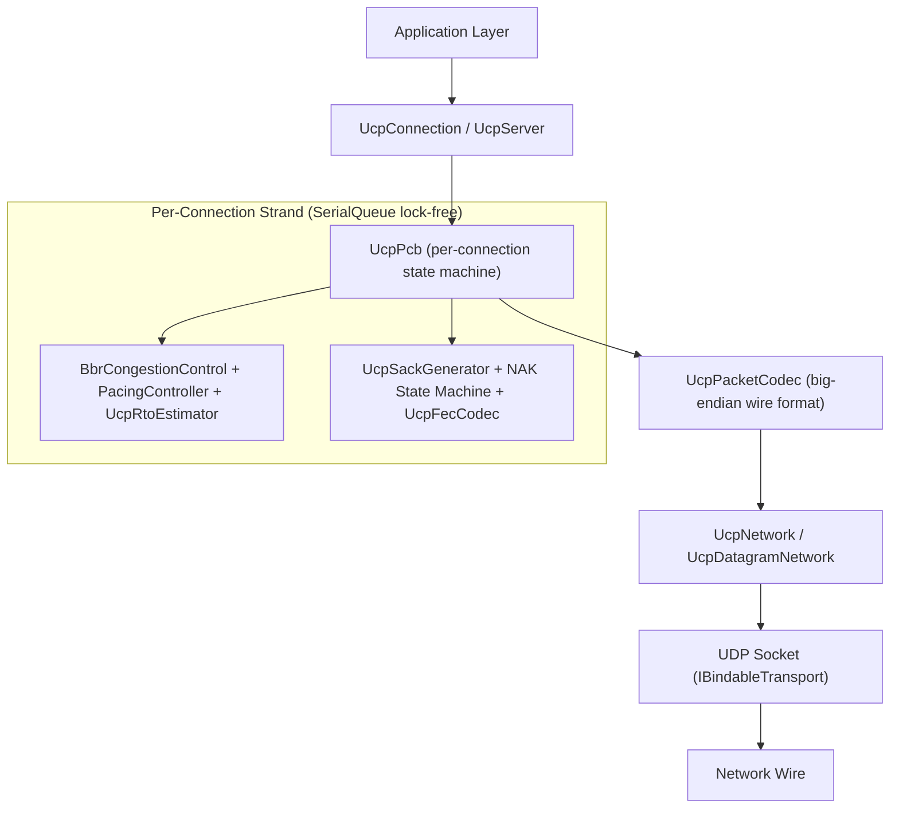
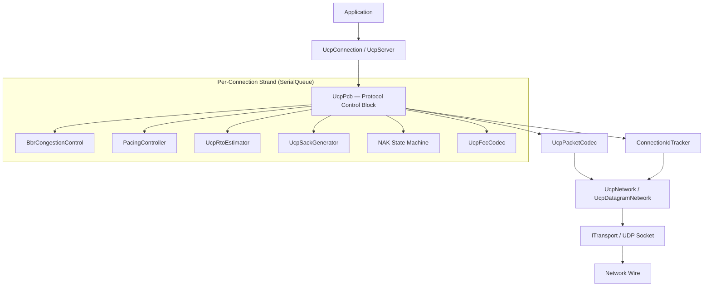
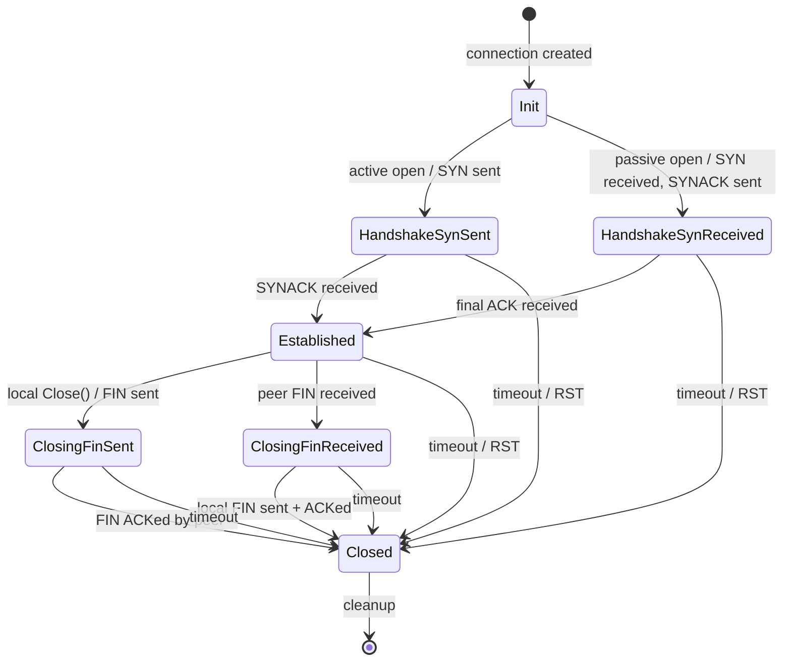
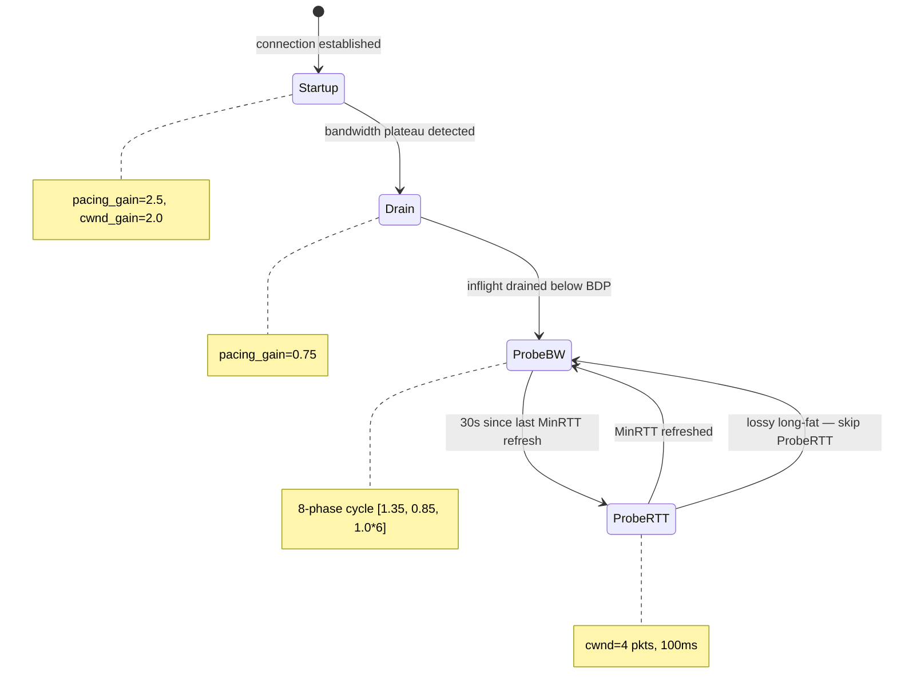
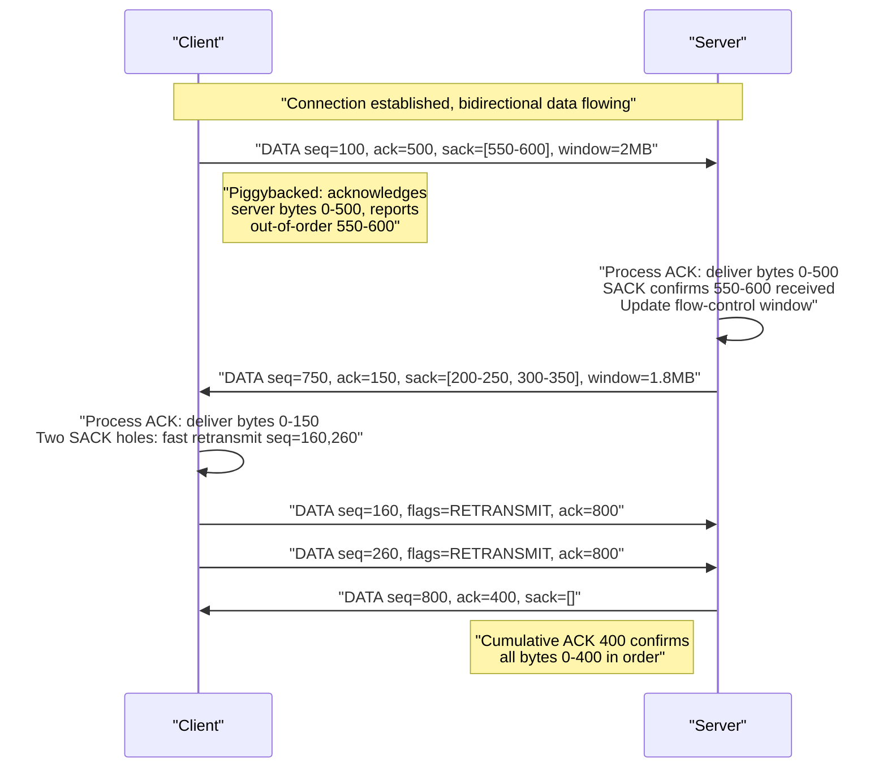
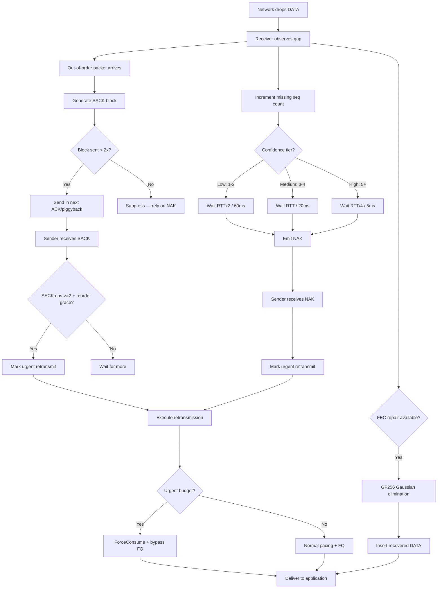
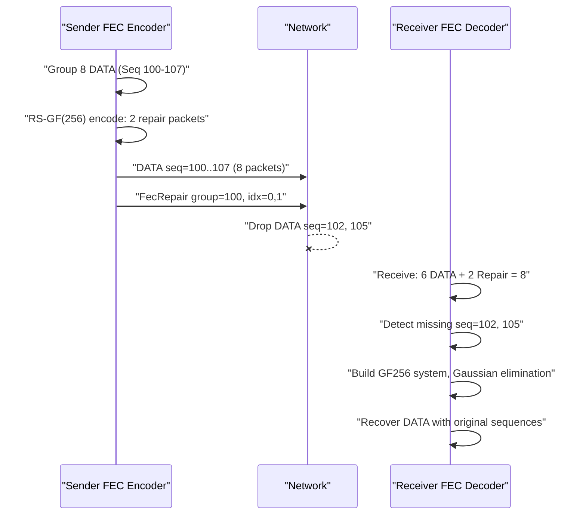
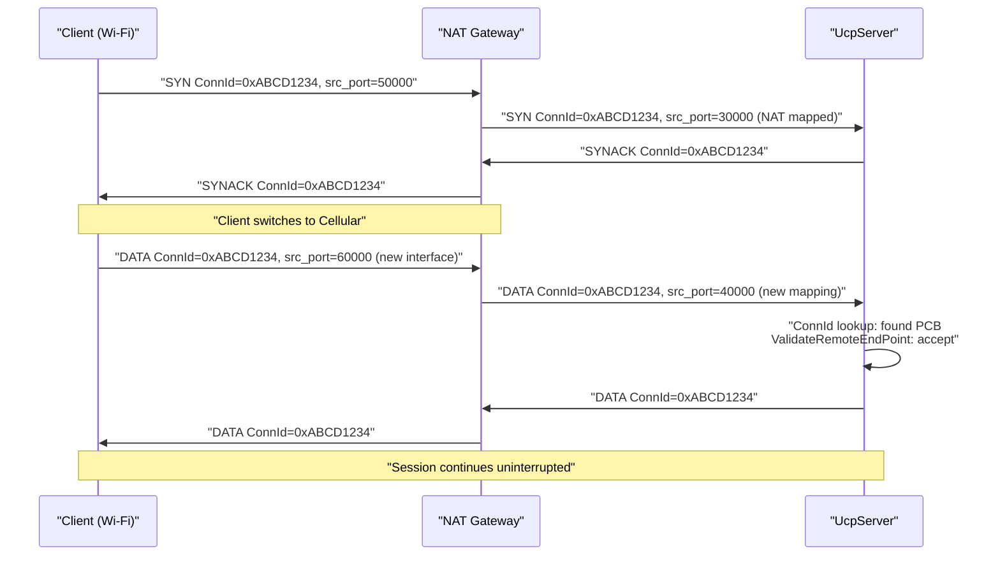
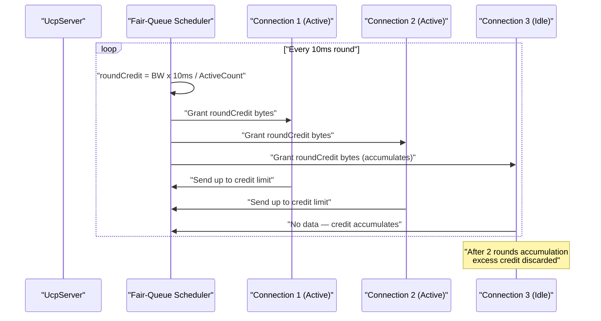
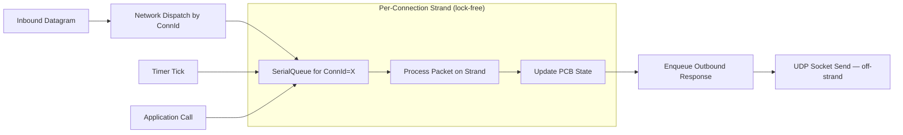

# PPP PRIVATE NETWORK™ X — Universal Communication Protocol (UCP)

[中文](README_CN.md)

**ppp+ucp** — A production-grade, QUIC-inspired reliable transport protocol implemented in C# on top of UDP. UCP rethinks every classical assumption about loss, congestion, and acknowledgment to deliver line-rate throughput across paths ranging from ideal data-center links to 300 ms satellite hops with 10% random loss.

---

## Table of Contents

1. [Overview](#overview)
2. [Design Philosophy](#design-philosophy)
3. [Protocol Stack](#protocol-stack)
4. [Key Innovations](#key-innovations)
5. [Architecture Overview](#architecture-overview)
6. [Protocol State Machine](#protocol-state-machine)
7. [BBR Congestion Control](#bbr-congestion-control)
8. [Data Flow with Piggybacked ACK](#data-flow-with-piggybacked-ack)
9. [Loss Detection and Recovery](#loss-detection-and-recovery)
10. [Forward Error Correction](#forward-error-correction)
11. [Connection Management](#connection-management)
12. [Server Architecture](#server-architecture)
13. [Threading Model](#threading-model)
14. [Performance Characteristics](#performance-characteristics)
15. [Getting Started](#getting-started)
16. [Configuration Reference](#configuration-reference)
17. [Testing Guide](#testing-guide)
18. [Documentation Index](#documentation-index)
19. [Deployment Scenarios](#deployment-scenarios)
20. [Comparison with TCP and QUIC](#comparison-with-tcp-and-quic)
21. [License](#license)

---

## Overview

UCP (Universal Communication Protocol) is a connection-oriented, reliable transport built directly on UDP. It draws architectural inspiration from QUIC while making fundamentally different choices in loss recovery, acknowledgment strategy, and congestion control. The protocol designation `ppp+ucp` identifies UCP as a member of the PPP PRIVATE NETWORK™ X protocol family.

Modern networks present challenges TCP was never designed for. TCP's fundamental assumption — all loss = congestion — collapses on wireless, cellular, and satellite links where random loss is common. UCP treats loss classification as a first-class protocol function:

- **Random loss** — isolated drops with stable RTT (physical layer interference). Retransmit immediately, no rate reduction.
- **Congestion loss** — clustered drops with RTT inflation (bottleneck saturation). Apply gentle 0.98× reduction with BDP-based floor.

On a 100 Mbps path with 5% random loss, UCP typically achieves 85-95% utilization while TCP collapses to 30-50%.

---

## Design Philosophy

### 1. Random Loss Is a Recovery Signal, Not a Congestion Signal

UCP retransmits missing data immediately upon loss detection. However, it only reduces pacing rate or congestion window after multiple independent signals — RTT growth, delivery-rate degradation, and clustered loss — collectively confirm bottleneck congestion.

### 2. Every Packet Carries Reliability Information

UCP piggybacks a cumulative ACK number on every packet type via the `HasAckNumber` flag. A DATA packet carrying user payload simultaneously acknowledges all received data, provides SACK blocks for out-of-order ranges, advertises the receive window, and echoes the sender's timestamp for continuous RTT measurement.

### 3. Recovery Is Tiered by Confidence

| Recovery Path | Trigger | Latency | Use Case |
|---|---|---|---|
| **SACK** | 2 SACK observations + reorder grace | Sub-RTT | Primary fast recovery for random independent losses |
| **DupACK** | Same cumulative ACK received twice | Sub-RTT | Backup when SACK blocks unavailable |
| **NAK** | Receiver accumulates gap observations (3 tiers) | RTT/4 to RTT×2 | Conservative receiver-driven recovery |
| **FEC** | Sufficient repair packets in group | Zero additional RTT | Proactive recovery for predictable loss |
| **RTO** | No ACK progress within RTO window | RTO × 1.2 backoff | Last-resort safety net |

---

## Protocol Stack



---

## Key Innovations

### 1. Piggybacked Cumulative ACK on ALL Packets

Every UCP packet carries the `HasAckNumber` flag and associated ACK fields. For a typical DATA packet, the piggyback overhead is 16 bytes on a 1220-byte MSS — a 1.3% overhead that eliminates dedicated ACK packets in almost all bidirectional flows.

### 2. QUIC-Style SACK with Dual-Observation Threshold

SACK-based fast retransmit requires exactly 2 observations before repair. The first missing gap needs 2 SACK observations spaced ≥ `max(3ms, RTT/8)` apart. Additional holes become eligible for parallel repair when beyond `SACK_FAST_RETRANSMIT_DISTANCE_THRESHOLD` (32 sequences). Each SACK block is advertised at most 2 times during its lifetime.

### 3. NAK-Based Recovery with Tiered Confidence

| Confidence Tier | Observations | Reorder Guard | Absolute Minimum |
|---|---|---|---|
| **Low** | 1-2 | `max(RTT × 2, 60ms)` | 60ms |
| **Medium** | 3-4 | `max(RTT, 20ms)` | 20ms |
| **High** | 5+ | `max(RTT/4, 5ms)` | 5ms |

Per-sequence repeat suppression (`NAK_REPEAT_INTERVAL_MICROS`, 250ms) prevents NAK storms. A single NAK can carry up to 256 missing sequence numbers.

### 4. BBRv2 with Loss Classification

BBR estimates bottleneck bandwidth from delivery-rate samples rather than reacting to loss events. UCP extends BBRv1 with v2-style enhancements:

**Loss Classification**: A multi-signal classifier distinguishes random from congestion loss:
- Small isolated losses (≤2 events) with stable RTT → **random**, preserve pacing, apply 1.25x recovery gain
- Larger clusters (≥3 events) with RTT inflation (≥1.10× MinRtt) → **congestion**, apply 0.98× CWND multiplier with 0.95× floor

**Network Path Classification**: 200ms sliding windows classify paths into `LowLatencyLAN`, `MobileUnstable`, `LossyLongFat`, `CongestedBottleneck`, and `SymmetricVPN`.

### 5. Reed-Solomon FEC over GF(256)

Systematic forward error correction encodes repair packets within configurable group sizes (default 8, max 64). Recovery succeeds when the receiver holds at least N independent packets per group. Gaussian elimination over GF(256) uses precomputed log/antilog tables for O(1) field operations. Adaptive FEC adjusts redundancy based on observed loss rate (five tiers: <0.5%, 0.5-2%, 2-5%, 5-10%, >10%).

### 6. Connection-ID-Based Session Tracking

Every packet carries a 4-byte connection identifier. The server indexes connections by ConnectionId alone — not by (IP, port) tuples. A mobile client roaming between Wi-Fi and cellular maintains the same session without a new handshake. The ConnectionId is a cryptographically random 32-bit value generated at SYN time.

### 7. Random ISN Per Connection

Each connection starts with a cryptographically random 32-bit Initial Sequence Number, providing security equivalent to TCP's ISN without per-packet authentication overhead. The 32-bit sequence space wraps using unsigned comparison with a 2^31 comparison window.

### 8. Fair-Queue Server Scheduling

Server-side connections receive credit-based scheduling rounds at a configurable interval (default 10ms). Each round distributes `roundCredit = bandwidthLimit × interval` bytes across active connections in round-robin order, preventing any single high-throughput connection from starving others. Unused credit is limited to 2 rounds.

### 9. Urgent Retransmit with Bounded Pacing Debt

Recovery-triggered retransmits bypass both fair-queue credit checks and token-bucket pacing gates. Each bypass charges `ForceConsume()` on the pacing controller, creating negative token debt (capped at 50% of bucket capacity). The per-RTT urgent budget (16 packets) prevents unbounded bursts.

### 10. Deterministic Event-Loop Driver

`UcpNetwork.DoEvents()` drives timers, RTO checks, pacing flushes, and fair-queue rounds deterministically. The in-process `NetworkSimulator` uses the same event-loop model with a virtual logical clock for reproducible, hardware-independent test results.

---

## Architecture Overview



### UcpPcb Internal State

**Sender State:**

| Structure | Purpose |
|---|---|
| `_sendBuffer` | Sequence-sorted outbound segments awaiting ACK. Each segment tracks original send timestamp, retransmission count, and urgent-recovery status. |
| `_flightBytes` | Payload bytes currently in flight. Used by BBRv2 for delivery rate and CWND enforcement. |
| `_nextSendSequence` | Next 32-bit sequence number with wrap-around comparison. |
| `_sackFastRetransmitNotified` | Deduplicates SACK-triggered fast retransmit decisions per sequence. |
| `_sackSendCount` | Per-block-range counter limiting SACK advertisement to 2 sends. |
| `_urgentRecoveryPacketsInWindow` | Per-RTT limit for pacing/FQ bypass recovery. |
| `_ackPiggybackQueue` | Pending cumulative ACK to be carried on next outbound packet. |

**Receiver State:**

| Structure | Purpose |
|---|---|
| `_recvBuffer` | Out-of-order inbound segments sorted by sequence with O(log n) insertion. |
| `_nextExpectedSequence` | Next sequence needed for in-order delivery. |
| `_receiveQueue` | Ordered payload chunks ready for application reads. |
| `_missingSequenceCounts` | Per-sequence gap observation counts for tiered-confidence NAK generation. |
| `_nakConfidenceTier` | Current NAK tier: Low, Medium, or High. |
| `_lastNakIssuedMicros` | Per-sequence repeat suppression timestamp. |
| `_fecFragmentMetadata` | Original fragment metadata for FEC-recovered DATA packets. |

---

## Protocol State Machine



---

## BBR Congestion Control



### Core Estimates

| Estimate | Calculation | Purpose |
|---|---|---|
| `BtlBw` | Max delivery rate over BBR window RTT rounds (EWMA smoothed) | Pacing-rate base |
| `MinRtt` | Minimum observed RTT in ProbeRTT interval (30s) | BDP denominator |
| `BDP` | `BtlBw × MinRtt` | Target in-flight bytes |
| `PacingRate` | `BtlBw × current_pacing_gain` | Send rate ceiling enforced by token bucket |
| `CWND` | `BDP × cwnd_gain`, bounded by guardrails | Max bytes in flight |

---

## Data Flow with Piggybacked ACK



---

## Loss Detection and Recovery



---

## Forward Error Correction

UCP implements systematic Reed-Solomon over GF(256) using irreducible polynomial `x^8 + x^4 + x^3 + x + 1` (0x11B).



| Observed Loss | Adaptive Behavior |
|---|---|
| < 0.5% | Minimum redundancy |
| 0.5% – 2% | Increase redundancy 1.25× |
| 2% – 5% | Increase 1.5×, reduce group size |
| 5% – 10% | Max adaptive 2.0×, min group 4 |
| > 10% | FEC alone insufficient; rely on retransmission |

---

## Connection Management

### Connection-ID-Based Session Tracking



---

## Server Architecture

### Fair-Queue Scheduling



---

## Threading Model

### Strand Model with SerialQueue



**Key properties:** No locks, predictable ordering, no deadlocks, I/O offloading, deterministic testing with NetworkSimulator.

---

## Performance Characteristics

| Scenario | Target Mbps | RTT | Loss | Throughput Mbps | Retrans% | Conv |
|---|---|---|---|---|---|---|
| NoLoss (LAN) | 100 | 0.5ms | 0% | 95–100 | 0% | <50ms |
| DataCenter | 1000 | 1ms | 0% | 950–1000 | 0% | <100ms |
| Gigabit_Ideal | 1000 | 5ms | 0% | 920–1000 | 0% | <200ms |
| Lossy (1%) | 100 | 10ms | 1% | 90–99 | ~1.2% | <1s |
| Lossy (5%) | 100 | 10ms | 5% | 75–95 | ~6% | <3s |
| Gigabit_Loss1 | 1000 | 5ms | 1% | 880–980 | ~1.1% | <500ms |
| LongFatPipe | 100 | 100ms | 0% | 85–99 | 0% | <5s |
| Satellite | 10 | 300ms | 0% | 8.5–9.9 | 0% | <30s |
| Mobile3G | 2 | 150ms | 1% | 1.7–1.95 | ~1.5% | <20s |
| Mobile4G | 20 | 50ms | 1% | 18–19.8 | ~1.2% | <5s |
| Benchmark10G | 10000 | 1ms | 0% | 9200–10000 | 0% | <200ms |
| VpnTunnel | 50 | 15ms | 1% | 45–49.5 | ~1.3% | <2s |

| Property | Value |
|---|---|
| Max throughput (tested) | 10 Gbps |
| Min RTT (loopback) | <100µs |
| Max tested RTT | 300ms |
| Max tested loss rate | 10% |
| Jumbo MSS | 9000 bytes |
| Default MSS | 1220 bytes |
| FEC redundancy | 0.0–1.0 |
| Max FEC group | 64 packets |
| Max SACK blocks | 149 |
| Convergence (lossless) | 2–5 RTT |

---

## Getting Started

### Prerequisites

- .NET 8.0 SDK or later
- Windows, Linux, or macOS

### Build

```powershell
git clone https://github.com/your-org/ucp.git
cd ucp
dotnet build ucp.sln
```

### Basic Server and Client

```csharp
using System.Net;
using System.Text;
using Ucp;

var config = UcpConfiguration.GetOptimizedConfig();
config.ServerBandwidthBytesPerSecond = 100_000_000 / 8; // 100 Mbps

// --- Server ---
using var server = new UcpServer(config);
server.Start(9000);
Task<UcpConnection> acceptTask = server.AcceptAsync();

// --- Client ---
using var client = new UcpConnection(config);
await client.ConnectAsync(new IPEndPoint(IPAddress.Loopback, 9000));
UcpConnection serverConn = await acceptTask;

// Bidirectional reliable transfer
byte[] clientData = Encoding.UTF8.GetBytes("Hello from client!");
await client.WriteAsync(clientData, 0, clientData.Length);

byte[] buf = new byte[1024];
int n = await serverConn.ReadAsync(buf, 0, buf.Length);
Console.WriteLine($"Server received: {Encoding.UTF8.GetString(buf, 0, n)}");

await client.CloseAsync();
await serverConn.CloseAsync();
```

### High-Bandwidth Configuration

```csharp
var config = UcpConfiguration.GetOptimizedConfig();
config.Mss = 9000;
config.InitialBandwidthBytesPerSecond = 1_000_000_000 / 8; // 1 Gbps
config.MaxPacingRateBytesPerSecond = 0; // Disable ceiling
config.InitialCwndPackets = 200;
```

### Lossy Path Configuration

```csharp
var config = UcpConfiguration.GetOptimizedConfig();
config.FecRedundancy = 0.25;
config.FecGroupSize = 8;
config.LossControlEnable = true;
config.MaxBandwidthLossPercent = 20;
```

### Diagnostics

```csharp
UcpTransferReport report = connection.GetReport();
Console.WriteLine($"Throughput: {report.ThroughputMbps} Mbps");
Console.WriteLine($"RTT: {report.AverageRttMs} ms");
Console.WriteLine($"Retransmission: {report.RetransmissionRatio:P}");
Console.WriteLine($"CWND: {report.CwndBytes} bytes");
Console.WriteLine($"Convergence: {report.ConvergenceTime}");
```

---

## Configuration Reference

Call `UcpConfiguration.GetOptimizedConfig()` for sensible defaults.

### Protocol Tuning

| Parameter | Default | Range | Description |
|---|---|---|---|
| `Mss` | 1220 | 200–9000 | Maximum Segment Size |
| `MaxRetransmissions` | 10 | 3–100 | Max retransmissions per segment before abort |
| `SendBufferSize` | 32MB | 1–256MB | Send buffer capacity; `WriteAsync` blocks when full |
| `InitialCwndPackets` | 20 | 4–200 | Initial congestion window in packets |
| `MaxCongestionWindowBytes` | 64MB | 64KB–256MB | Hard cap on BBRv2 CWND |
| `AckSackBlockLimit` | 149 | 1–255 | Max SACK blocks per ACK |

### RTO & Timers

| Parameter | Default | Description |
|---|---|---|
| `MinRtoMicros` | 200,000µs | Minimum retransmission timeout |
| `MaxRtoMicros` | 15,000,000µs | Maximum retransmission timeout |
| `RetransmitBackoffFactor` | 1.2 | RTO multiplier per consecutive timeout |
| `ProbeRttIntervalMicros` | 30,000,000µs | BBRv2 ProbeRTT interval |
| `KeepAliveIntervalMicros` | 1,000,000µs | Idle keep-alive interval |
| `DisconnectTimeoutMicros` | 4,000,000µs | Idle disconnect timeout |
| `DelayedAckTimeoutMicros` | 2,000µs | Delayed ACK coalescing |

### BBR Gains

| Parameter | Default | Range |
|---|---|---|
| `StartupPacingGain` | 2.0 | 1.5–4.0 |
| `StartupCwndGain` | 2.0 | 1.5–4.0 |
| `DrainPacingGain` | 0.75 | 0.3–1.0 |
| `ProbeBwHighGain` | 1.25 | 1.1–1.5 |
| `ProbeBwLowGain` | 0.85 | 0.5–0.95 |
| `BbrWindowRtRounds` | 10 | 6–20 |

### Bandwidth & Loss

| Parameter | Default | Description |
|---|---|---|
| `InitialBandwidthBytesPerSecond` | 12.5MB/s | Initial bottleneck bandwidth estimate |
| `MaxPacingRateBytesPerSecond` | 12.5MB/s | Pacing ceiling (`0` = disabled) |
| `ServerBandwidthBytesPerSecond` | 12.5MB/s | Server egress for FQ scheduling |
| `LossControlEnable` | `true` | Loss-aware pacing/CWND adaptation |
| `MaxBandwidthLossPercent` | 25% | Loss budget ceiling |

### FEC

| Parameter | Default | Range |
|---|---|---|
| `FecRedundancy` | 0.0 | 0.0–1.0 |
| `FecGroupSize` | 8 | 2–64 |
| `FecAdaptiveEnable` | `true` | — |

---

## Testing Guide

```powershell
# Build
dotnet build ".\Ucp.Tests\UcpTest.csproj"

# Run all tests (54 tests)
dotnet test ".\Ucp.Tests\UcpTest.csproj" --no-build

# Run with verbose output
dotnet test ".\Ucp.Tests\UcpTest.csproj" --no-build --verbosity normal

# Run specific test
dotnet test ".\Ucp.Tests\UcpTest.csproj" --no-build --filter "FullyQualifiedName~NoLoss_Utilization"

# Generate and validate performance report
dotnet run --project ".\Ucp.Tests\UcpTest.csproj" --no-build -- ".\Ucp.Tests\bin\Debug\net8.0\reports\test_report.txt"
```

### Test Categories

| Category | Tests | Validates |
|---|---|---|
| **Core Protocol** | Sequence wrap, codec round-trip, RTO convergence, pacing arithmetic | Foundational correctness |
| **Reliability** | Lossy transfer, burst loss, SACK limits, NAK tiers, FEC recovery | All loss pattern recovery |
| **Stream Integrity** | Reordering, duplication, partial reads, full-duplex, piggybacked ACK | Ordered delivery guarantee |
| **Performance** | 4Mbps–10Gbps, 14+ network scenarios | Throughput, convergence, recovery |
| **Report Validation** | Throughput caps, loss/retrans independence, route asymmetry | Auditable physical plausibility |

---

## Documentation Index

| Document | Language |
|---|---|
| [README.md](README.md) | English |
| [README_CN.md](README_CN.md) | 中文 |
| [docs/index.md](docs/index.md) | English |
| [docs/index_CN.md](docs/index_CN.md) | 中文 |
| [docs/architecture.md](docs/architecture.md) | English |
| [docs/architecture_CN.md](docs/architecture_CN.md) | 中文 |
| [docs/protocol.md](docs/protocol.md) | English |
| [docs/protocol_CN.md](docs/protocol_CN.md) | 中文 |
| [docs/api.md](docs/api.md) | English |
| [docs/api_CN.md](docs/api_CN.md) | 中文 |
| [docs/performance.md](docs/performance.md) | English |
| [docs/performance_CN.md](docs/performance_CN.md) | 中文 |
| [docs/constants.md](docs/constants.md) | English |
| [docs/constants_CN.md](docs/constants_CN.md) | 中文 |

---

## Deployment Scenarios

| Scenario | Why UCP |
|---|---|
| **VPN tunnels** | High throughput over lossy asymmetric paths. BBRv2 maintains throughput where TCP collapses. |
| **Real-time games** | FEC zero-latency recovery. ConnId survives Wi-Fi-to-cellular handoffs. |
| **Satellite backhaul** | Long RTT with moderate random loss. BBRv2 ProbeRTT skip avoids dips. |
| **IoT sensor networks** | Lightweight wire format, random ISN, IP-agnostic survives NAT/DHCP. |
| **Financial data feeds** | Ordered reliable with sub-RTT recovery. Piggybacked ACK eliminates overhead. |
| **CDN/edge** | Fair-queue prevents client starvation. Adaptive FEC reduces retransmission overhead. |
| **Distributed DB** | Low-latency replication. Connection migration supports failover. |

---

## Comparison with TCP and QUIC

| Feature | TCP | QUIC | UCP (ppp+ucp) |
|---|---|---|---|
| **Transport** | IP | UDP | UDP |
| **Loss interpretation** | All loss = congestion | Improved but still coupled | Classify before rate reduction |
| **Congestion control** | CUBIC/Reno | CUBIC/BBR options | BBRv2 with loss classification |
| **ACK model** | Cumulative only | SACK-based | Piggybacked on ALL packets |
| **Recovery paths** | DupACK + RTO | SACK + RTO | SACK + NAK + FEC + RTO |
| **FEC** | None | None | RS-GF(256) with adaptive redundancy |
| **Connection migration** | No (IP:port bound) | Optional Connection ID | Connection-ID model (default) |
| **Server scheduling** | OS scheduler | Stream priority | Fair-queue credit scheduling |
| **Thread safety** | Kernel locks | Stream-based | Per-connection SerialQueue (no locks) |
| **Handshake** | 3-way + TLS | 1-RTT (0-RTT optional) | 2-message (SYN→SYNACK) |
| **Implementation** | C (kernel) | C/C++/Rust/Go | C# (.NET 8+) |
| **Multiplexing** | Port-based | Stream-based | Connection-ID based |

---

## License

MIT. See [LICENSE](LICENSE) for full text.
