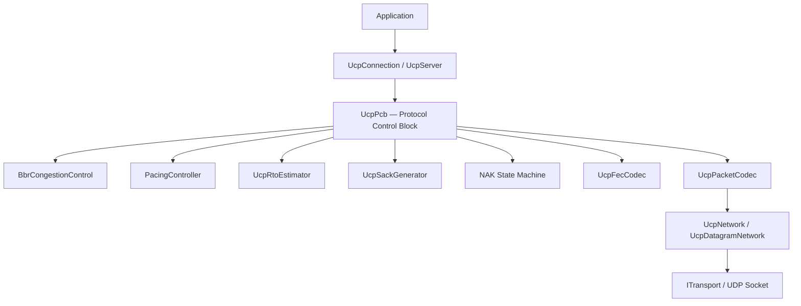
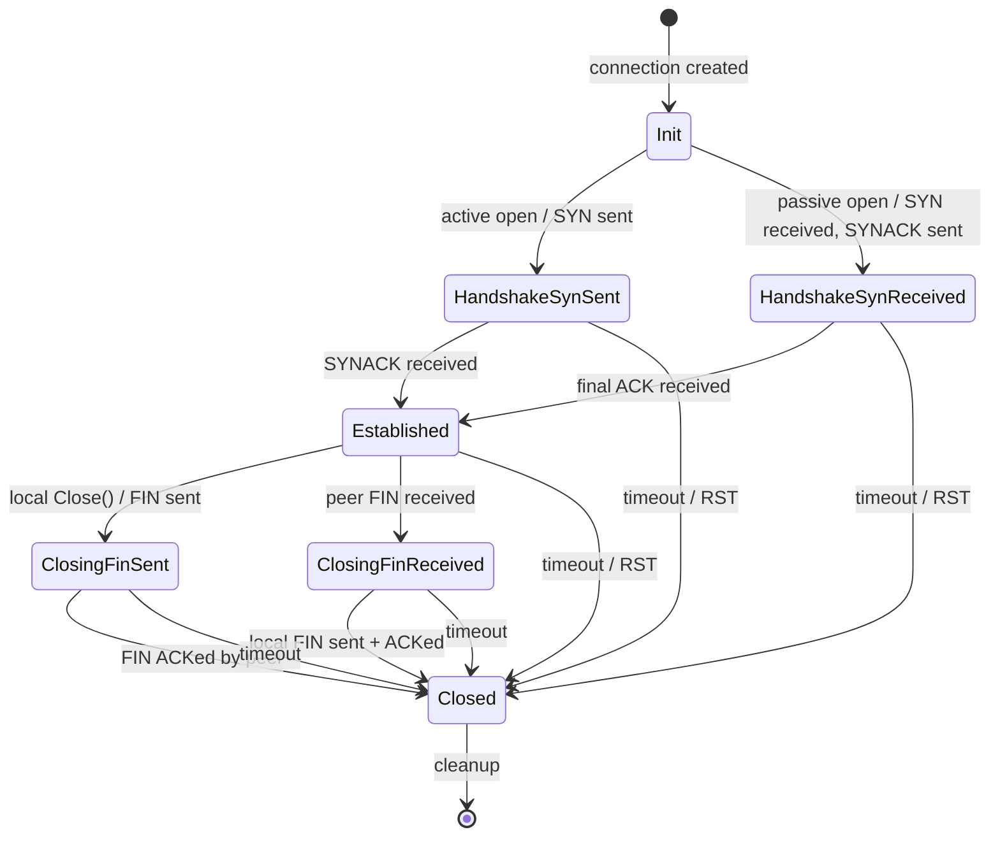
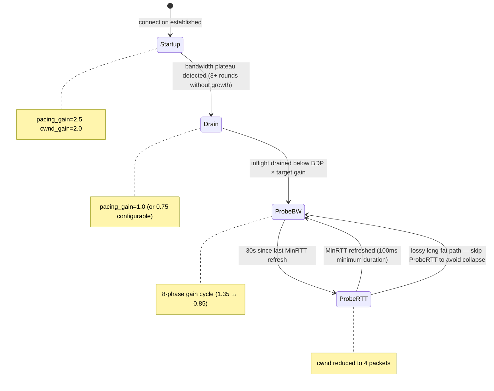
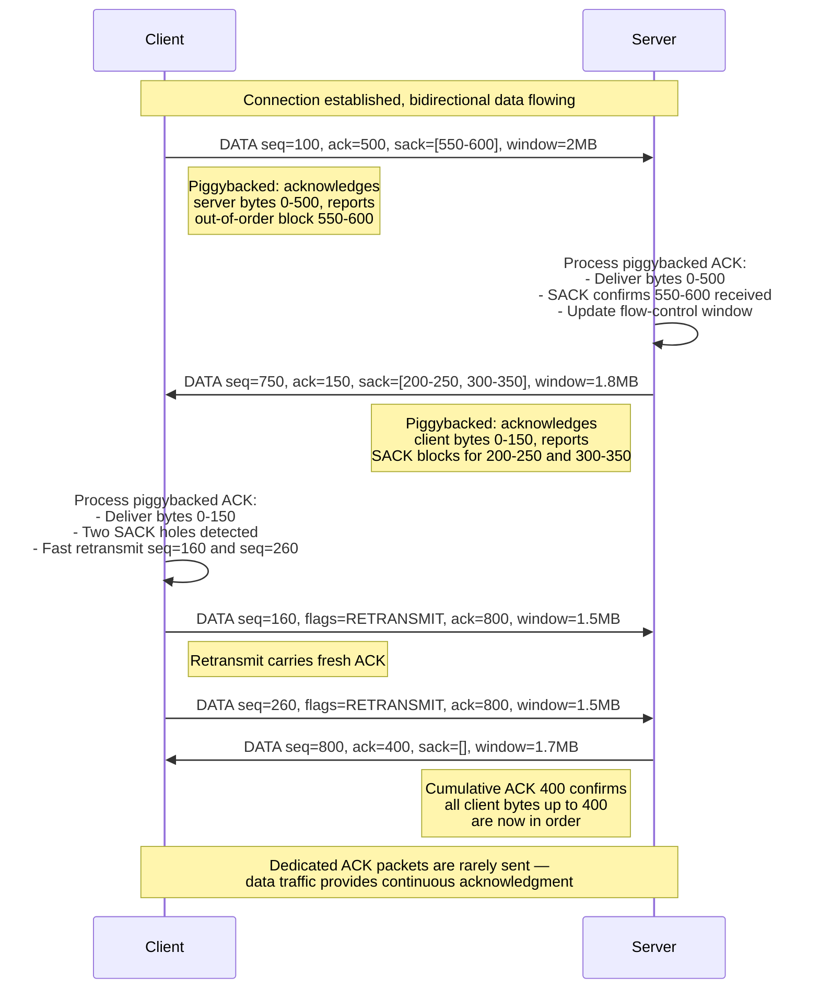
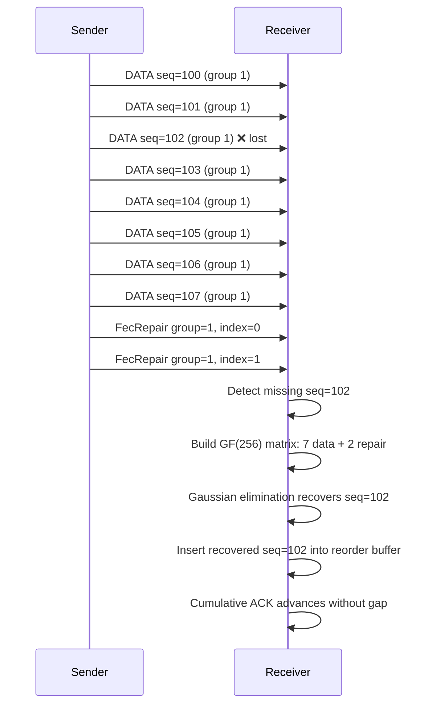

# PPP PRIVATE NETWORK™ X — Universal Communication Protocol (UCP)

**ppp+ucp** — A production-grade, QUIC-inspired reliable transport protocol implemented in C# on top of UDP. UCP rethinks every classical assumption about loss, congestion, and acknowledgment to deliver line-rate throughput across paths ranging from ideal data-center links to 300 ms satellite hops with 10% random loss.

---

## Table of Contents

1. [Overview](#overview)
2. [Key Innovations](#key-innovations)
3. [Architecture](#architecture)
4. [Protocol State Machine](#protocol-state-machine)
5. [BBR Congestion Control](#bbr-congestion-control)
6. [Data Flow with Piggybacked ACK](#data-flow-with-piggybacked-ack)
7. [Key Features](#key-features)
8. [Performance Characteristics](#performance-characteristics)
9. [Getting Started](#getting-started)
10. [Configuration Reference](#configuration-reference)
11. [Testing Guide](#testing-guide)
12. [Documentation Index](#documentation-index)
13. [License](#license)

---

## Overview

UCP (Universal Communication Protocol) is a connection-oriented, reliable transport built directly on UDP. It draws architectural inspiration from QUIC while making fundamentally different design choices in loss recovery, acknowledgment strategy, and congestion control. The protocol is not a QUIC clone — it is a ground-up reimagining of what a modern transport protocol should look like when you treat packet loss as a recovery signal rather than an automatic congestion signal.

### Design Philosophy

Every classic TCP-derivative protocol couples loss and congestion. A single dropped packet halves the congestion window even when the drop was caused by a flaky Wi-Fi chip rather than a saturated switch buffer. UCP decouples these two concepts:

- **Loss** triggers immediate retransmission (via SACK, NAK, or FEC).
- **Congestion** is an independent determination made by a multi-signal classifier that weighs RTT inflation, delivery-rate degradation, clustered loss events, and real-time network path classification.

This separation means UCP can maintain full line rate through random loss while still reacting gracefully to genuine bottleneck congestion.

### Protocol Stack

```
Application Layer          UcpConnection / UcpServer
       │
Protocol Core              UcpPcb (per-connection state machine)
       │
Congestion & Pacing        BbrCongestionControl + PacingController + UcpRtoEstimator
       │
Reliability Engine         UcpSackGenerator + NAK state machine + UcpFecCodec
       │
Serialization              UcpPacketCodec (big-endian wire format)
       │
Network Driver             UcpNetwork / UcpDatagramNetwork
       │
Transport                  UDP Socket (IBindableTransport)
```

---

## Key Innovations

| Innovation | Description |
|---|---|
| **Piggybacked cumulative ACK on ALL packets** | Every packet — DATA, NAK, SYNACK, FIN, RST — carries a cumulative acknowledgment number, optional SACK blocks, flow-control window advertisement, and RTT echo timestamp. The `HasAckNumber` flag in the common header signals presence. A dedicated ACK-only packet exists but is rarely needed because data traffic itself serves as the acknowledgment channel. |
| **QUIC-style SACK with dual-observation threshold** | SACK-based fast retransmit requires exactly 2 observations of a missing sequence before repair, matching QUIC's design. A minimum reorder grace of `max(3 ms, RTT / 8)` prevents false retransmits from transient reordering. Additional holes below the highest SACKed boundary can be repaired in parallel rather than one RTT at a time. |
| **NAK-based fast recovery with tiered confidence** | Receiver-side NAK complements sender-side SACK. Gaps require `NAK_MISSING_THRESHOLD` observations and an RTT-aware reorder guard before NAK emission. High-confidence gaps (confirmed by multiple out-of-order arrivals) shorten the guard; low-confidence gaps use longer windows. Per-sequence repeat suppression (`NAK_REPEAT_INTERVAL_MICROS`) prevents storming. |
| **BBR congestion control with v2-style loss classification** | BBR estimates bottleneck bandwidth from delivery-rate samples rather than reacting to loss events. A loss classifier distinguishes random loss (preserve or restore pacing/CWND) from congestion loss (gentle 0.98× multiplicative reduction with CWND floor). A separate network classifier categorizes the path into LowLatencyLAN, MobileUnstable, LossyLongFat, CongestedBottleneck, or SymmetricVPN, wiring those classifications directly into BBR gain decisions. |
| **Reed-Solomon FEC over GF(256)** | Systematic forward error correction encodes repair packets within configurable group sizes (default 8, max 64). Recovery succeeds when the receiver holds at least as many independent repair packets as missing DATA packets. The decoder solves the linear system via Gaussian elimination over GF(256) using precomputed exponentiation and logarithm tables. Recovered packets retain original sequence numbers and fragment metadata, preserving cumulative ACK continuity. |
| **Connection-ID-based session tracking (IP-agnostic)** | Every packet carries a 4-byte connection identifier in its common header. The server indexes connections by ConnectionId alone — not by (IP, port) tuples. This means a mobile client roaming between Wi-Fi and cellular, or a client behind NAT rebinding, maintains the same session without a new handshake. `ValidateRemoteEndPoint()` accepts new IP/port pairs for existing ConnectionIds transparently. |
| **Random ISN per connection** | Each connection starts with a cryptographically random 32-bit Initial Sequence Number (`UcpSecureRng`). This prevents off-path sequence number attacks without requiring per-packet authentication overhead. |
| **Server dynamic IP binding** | The server's `IBindableTransport` interface supports both static port binding and OS-assigned dynamic port binding. `UdpSocketTransport.Bind(port=0)` requests an ephemeral port from the OS, discovered via `LocalEndPoint`. This enables multi-instance deployments and test isolation without port conflicts. |
| **Fair-queue server scheduling** | Server-side connections receive credit-based scheduling rounds at a configurable interval (default 10 ms). Each round distributes `roundCredit = bandwidthLimit × interval` bytes across active connections in a rotating round-robin order, preventing any single high-throughput connection from starving others. Unused credit is limited to `MAX_BUFFERED_FAIR_QUEUE_ROUNDS` (2 rounds) to prevent burst accumulation. |
| **Urgent retransmit with bounded pacing debt** | Recovery-triggered retransmits bypass both fair-queue credit checks and token-bucket pacing gates. Each bypass charges `ForceConsume()` on the pacing controller, creating negative token debt. The per-RTT urgent retransmit budget (`URGENT_RETRANSMIT_BUDGET_PER_RTT`, default 8192 bytes) caps the burst. Later normal sends repay the debt, preventing unbounded bursts while keeping dying connections alive. |
| **Deterministic event-loop driver** | `UcpNetwork.DoEvents()` drives timers, RTO checks, pacing delayed flushes, and fair-queue credit rounds deterministically — essential for reproducible testing and simulation. The in-process `NetworkSimulator` uses the same event-loop model with a virtual logical clock. |
| **Strand model with SerialQueue** | Per-connection `SerialQueue` guarantees lock-free serial mutation of protocol state. All packet handling, timer callbacks, and state transitions for a single connection are serialized onto that connection's strand, eliminating deadlocks and race conditions without per-method locking. |

---

## Architecture



The runtime is organized into four layers:

1. **Application Layer** — `UcpConnection` (client) and `UcpServer` (listener) expose the public API. `UcpServer` owns a fair-queue scheduler and an accept queue.

2. **Protocol Core** — `UcpPcb` owns the entire per-connection state machine: send buffer, receive reordering buffer, ACK/SACK/NAK processing, retransmission timers, BBR, pacing, fair-queue credit, and optional FEC. All state transitions are serialized via `SerialQueue`.

3. **Congestion, Pacing & Reliability** — `BbrCongestionControl` computes pacing rate and congestion window from delivery-rate samples. `PacingController` is a byte token bucket that gates normal sends. `UcpSackGenerator` produces SACK blocks for out-of-order arrivals. The NAK state machine tracks gap observation counts and emits conservative NAKs. `UcpFecCodec` encodes/decodes Reed-Solomon repair packets over GF(256).

4. **Network Driver & Transport** — `UcpNetwork` decouples the protocol engine from socket I/O. `UdpSocketTransport` implements `IBindableTransport`, providing UDP send/receive with dynamic port binding. The in-process `NetworkSimulator` implements the same transport interface for deterministic testing.

### UcpPcb Internal State

**Sender State:**

| Structure | Purpose |
|---|---|
| `_sendBuffer` | Sequence-sorted outbound segments awaiting ACK |
| `_flightBytes` | Payload bytes currently in flight |
| `_nextSendSequence` | Next 32-bit sequence number with wrap-around comparison |
| `_largestCumulativeAckNumber` | Most recent cumulative ACK (from any packet type) |
| `_sackFastRetransmitNotified` | Deduplicates SACK-triggered fast retransmit decisions |
| `_urgentRecoveryPacketsInWindow` | Per-RTT limit for pacing/FQ bypass recovery |

**Receiver State:**

| Structure | Purpose |
|---|---|
| `_recvBuffer` | Out-of-order inbound segments sorted by sequence |
| `_nextExpectedSequence` | Next sequence needed for in-order delivery |
| `_receiveQueue` | Ordered payload chunks ready for application reads |
| `_missingSequenceCounts` | Gap observation counts used by NAK generation |
| `_lastNakIssuedMicros` | Repeat suppression timestamp for receiver NAKs |
| `_fecFragmentMetadata` | Original fragment metadata for FEC-recovered DATA packets |

---

## Protocol State Machine

Every UCP connection traverses a strict state machine modeled after TCP's lifecycle but adapted for UDP's connectionless substrate. The handshake is a 2-message exchange (SYN → SYNACK) with optional piggybacked ACK on the SYNACK to acknowledge server data sent in the initial window.



### State Transitions

| Transition | Trigger | Actions |
|---|---|---|
| Init → HandshakeSynSent | `ConnectAsync()` called | Send SYN with random ISN, start connect timer |
| Init → HandshakeSynReceived | Server receives SYN | Allocate new UcpPcb, send SYNACK with random ISN |
| HandshakeSynSent → Established | SYNACK received | Process piggybacked ACK, transition to Established |
| HandshakeSynReceived → Established | ACK received | Process cumulative ACK, transition to Established |
| Established → ClosingFinSent | `Close()` called locally | Send FIN, start disconnect timer |
| Established → ClosingFinReceived | Peer FIN received | ACK the FIN, notify application |
| ClosingFinSent → Closed | Peer ACKs local FIN | Clean up PCB, invoke closed callback |
| ClosingFinReceived → Closed | Local FIN sent + ACKed | Clean up PCB, invoke closed callback |
| Any → Closed | RTO exhaustion / RST | Hard close with optional RST transmission |

The SYN and SYNACK packets both support piggybacked ACK via the `HasAckNumber` flag. This means a re-SYN (connection migration) can carry acknowledgment of previously received data in the same packet as the new handshake request.

---

## BBR Congestion Control

UCP implements a BBRv1 congestion control engine augmented with v2-style loss classification and network path awareness. The controller operates in four modes connected by the state machine below.



### BBR Mode Behavior

| Mode | Pacing Gain | CWND Gain | Purpose |
|---|---|---|---|
| **Startup** | 2.5 | 2.0 | Exponentially probe for bottleneck bandwidth. Exit when bandwidth stops growing for `BbrWindowRtRounds` (default 10) consecutive rounds. |
| **Drain** | 1.0 | — | Transient phase that drains the inflight queue accumulated during Startup. Enters ProbeBW when inflight falls below `BDP × target_cwnd_gain`. |
| **ProbeBW** | Cycled 1.35 → 0.85 | 2.0 | Steady-state mode. Cycles through 8 phases of high/low pacing gains to probe for bandwidth increases. The high-gain phases briefly push above the estimated bottleneck rate; low-gain phases drain any accumulated queue. Random loss does not trigger a mode change. |
| **ProbeRTT** | 1.0 | 4 packets | Periodic MinRTT refresh (every 30 s, 100 ms duration). Deliberately reduces inflight to allow the minimum RTT estimate to update. Lossy long-fat paths skip ProbeRTT entirely to avoid throughput collapse. |

### Core Estimates

| Estimate | Calculation | Purpose |
|---|---|---|
| `BtlBw` | Max delivery rate over `BbrWindowRtRounds` RTT windows | Pacing-rate base |
| `MinRtt` | Minimum observed RTT in the ProbeRTT interval (30 s) | BDP denominator |
| `BDP` | `BtlBw × MinRtt` | Target inflight bytes |
| `PacingRate` | `BtlBw × current_pacing_gain` | Send rate ceiling |
| `CWND` | `BDP × cwnd_gain`, bounded by inflight guardrails | Maximum bytes in flight |

### Loss Classification

BBR's core insight is that loss is not congestion. UCP extends this with a multi-signal loss classifier:

1. **Loss bucket accounting** — Packet loss is tracked in rolling buckets with deduplication. Small isolated losses (`BBR_RANDOM_LOSS_MAX_DEDUPED_EVENTS`, default 2 events) are classified as random.

2. **RTT analysis** — Larger loss clusters (≥ `BBR_CONGESTION_LOSS_WINDOW_THRESHOLD`, default 3 events) require corroborating RTT evidence. If RTT has not inflated beyond `BBR_CONGESTION_LOSS_RTT_MULTIPLIER × MinRtt` (1.10), the classifier still labels them as random.

3. **Delivery-rate trend** — Sustained delivery-rate degradation combined with elevated loss triggers congestion classification.

| Loss Class | BBR Response | Retransmit Behavior |
|---|---|---|
| **Random loss** | Preserve or restore pacing/CWND, apply fast-recovery gain (1.25) | Retransmit immediately via SACK/NAK |
| **Congestion loss** | Apply gentle 0.98× CWND multiplier with 0.95× floor | Retransmit immediately; pacing reduces naturally via the reduced CWND |

### Network Classification

A parallel classifier evaluates the path characteristics using 200 ms sliding windows of RTT, jitter, loss rate, and throughput ratio:

| Network Class | Characteristics | BBR Tuning |
|---|---|---|
| `LowLatencyLAN` | RTT < 1 ms, zero loss | Aggressive initial probing |
| `MobileUnstable` | High jitter, variable RTT | Wider reorder grace, skip ProbeRTT |
| `LossyLongFat` | High BDP, sustained random loss | Preserve CWND, skip ProbeRTT |
| `CongestedBottleneck` | Elevated RTT + delivery-rate drop | Enable loss-aware pacing reduction |
| `SymmetricVPN` | Stable RTT, symmetric bandwidth | Standard BBR with probing |

This classification feeds directly into BBR gain decisions: `LossControlEnable` activates only when the network is classified as congested, and `MaxBandwidthLossPercent` (default 25%, clamped 15–35%) sets the loss budget ceiling.

---

## Data Flow with Piggybacked ACK

UCP's most radical departure from classical transports is the piggybacked acknowledgment model. Every packet type carries the fields needed for acknowledgment. A DATA packet from client to server simultaneously serves as:

1. **Payload delivery** — the actual application data
2. **Cumulative ACK** — acknowledging all data received from the server so far
3. **Selective ACK blocks** — advertising up to `AckSackBlockLimit` (default 149) out-of-order ranges
4. **Flow-control window** — the current receive buffer capacity in bytes
5. **RTT echo** — the sender's timestamp echoed back for RTT measurement



### ACK Processing Chain

When any packet arrives at the receiver, the ACK processing chain runs before handling the packet's primary payload:

1. **Extract ACK fields** — Read `AckNumber`, SACK blocks, `WindowSize`, and `EchoTimestamp` from the packet if the `HasAckNumber` flag is set.

2. **Validate cumulative ACK** — If the new `AckNumber` is greater than `_largestCumulativeAckNumber`, update it. Replay protection: ignore ACK numbers that are before the largest seen.

3. **Release send buffer** — Remove all outbound segments with sequence numbers below the cumulative ACK. Update `_flightBytes`, signal `WriteAsync` waiters.

4. **Process SACK blocks** — For each SACK block, mark segments as SACK-observed. After 2 SACK observations with reorder grace, trigger fast retransmit.

5. **Update RTT sample** — Using the echoed timestamp, compute a new RTT sample and feed it to `UcpRtoEstimator` and `BbrCongestionControl`.

6. **Update flow control** — The remote window advertisement constrains future sends.

This entire chain executes for DATA, NAK, SYNACK, FIN, and RST packets in addition to dedicated ACK packets. A delayed ACK timer (default 500 μs, configurable via `DelayedAckTimeoutMicros`) coalesces ACK generation when no outbound data is available to piggyback on, but the timer is cancelled the moment any outbound data packet is ready.

---

## Key Features

### Piggybacked Cumulative Acknowledgment on ALL Packets

Every UCP packet carries the `HasAckNumber` flag and associated ACK fields. The wire format adds 4 bytes for `AckNumber`, 2 bytes for `SackCount`, `N × 8` bytes for SACK blocks, 4 bytes for `WindowSize`, and 6 bytes for `EchoTimestamp`. For a typical DATA packet without SACK blocks, the piggyback overhead is 16 bytes on a 1220-byte MSS — a 1.3% overhead that eliminates the need for dedicated ACK packets in almost all bidirectional flows.

The `ProcessPiggybackedAck()` method in `UcpPcb` handles ACK extraction regardless of packet type. When a DATA packet arrives:

```csharp
bool hasPiggybackedAck = (dataPacket.Header.Flags & UcpPacketFlags.HasAckNumber)
                          == UcpPacketFlags.HasAckNumber;
if (hasPiggybackedAck && dataPacket.AckNumber > 0)
{
    ProcessPiggybackedAck(dataPacket.AckNumber, dataPacket.Header.Timestamp, NowMicros());
}
```

This symmetry means the protocol achieves full-duplex throughput without the ACK-path bottleneck that plagues TCP.

### QUIC-Style SACK (2 Observations Per Range)

Sender-side SACK recovery uses a QUIC-derived algorithm:

```
SACK_FAST_RETRANSMIT_THRESHOLD = 2
SACK_FAST_RETRANSMIT_MIN_REORDER_GRACE_MICROS = 3,000
SACK_FAST_RETRANSMIT_DISTANCE_THRESHOLD = 32
```

The first missing sequence to the right of the cumulative ACK (the "first SACK hole") requires 2 SACK observations spaced at least `max(3 ms, RTT / 8)` apart. This reorder grace prevents mistaking reordered packets for loss. Additional holes below the highest SACKed boundary are confirmed when the distance from the first hole exceeds `SACK_FAST_RETRANSMIT_DISTANCE_THRESHOLD` (32 sequences), allowing parallel repair of multiple random losses in a single RTT.

The `IsReportedSackHoleUnsafe()` guard prevents retransmitting segments that were already cumulatively ACKed or lie within a confirmed SACK range, avoiding spurious retransmissions.

### NAK-Based Fast Recovery with Tiered Confidence

Receiver-side NAK complements SACK for cases where the sender does not detect gaps (e.g., asymmetric paths where SACK-bearing ACKs are delayed). The NAK state machine operates with tiered confidence:

| Confidence Tier | Condition | Reorder Guard |
|---|---|---|
| **High confidence** | Gap confirmed by 3+ out-of-order arrivals above it | Shortened guard (still RTT-aware) |
| **Normal confidence** | Gap hit `NAK_MISSING_THRESHOLD` (2 observations) | `max(NAK_REORDER_GRACE_MICROS, RTT / 4)` |
| **Low confidence** | Gap observed only once, old enough | Full RTT-aware guard, suppressed |

Per-sequence repeat suppression (`NAK_REPEAT_INTERVAL_MICROS`, default 20 ms) prevents storming the sender with duplicate NAKs for the same gap. A single NAK packet can carry up to `MAX_NAK_SEQUENCES_PER_PACKET` (256) missing sequence numbers.

NAK packets also carry a piggybacked cumulative ACK, so every NAK simultaneously advances the sender's acknowledged sequence.

### BBR Congestion Control with Adaptive Pacing

The pacing controller is a byte token bucket with configurable bucket duration (`PacingBucketDurationMicros`, default 10 ms). Tokens accrue at `PacingRate` bytes per second. Normal data sends consume tokens proportional to payload size in `SendQuantumBytes`-byte quanta.

```
Tokens += PacingRate × elapsed_time
If Tokens >= SendQuantumBytes → send is allowed, Tokens -= payload_bytes
```

BBR's pacing rate is computed as:

```
PacingRate = BtlBw × current_pacing_gain
```

Where `BtlBw` is the maximum delivery rate observed over `BbrWindowRtRounds` RTT windows, filtered through a circular buffer of recent rate samples. The pacing gain cycles through preset values depending on the current BBR mode.

Urgent retransmits are marked by recovery logic (SACK/NAK/duplicate ACK/RTO) and bypass the token bucket via `ForceConsume()`, creating negative token debt. The debt is capped and repaid by subsequent normal sends, preventing unbounded bursts while allowing recovery traffic to flow immediately.

### Forward Error Correction — Reed-Solomon GF(256)

UCP implements a systematic Reed-Solomon-style FEC codec over GF(256). When enabled (via `FecRedundancy > 0.0`), the sender groups `FecGroupSize` (default 8) consecutive DATA packets into an FEC group and generates `ceil(FecGroupSize × FecRedundancy)` repair packets.

**Encoding:**
- Each repair packet computes `repair = Σ(data_packet_i × coefficient_i)` over GF(256), where `coefficient_i = (repair_index + 1)^slot_i`.
- Repair packets carry the `GroupId` (matching the DATA group) and a `GroupIndex` identifying which repair this is within the group.

**Decoding:**
- The receiver buffers DATA packets by group. When a group has missing sequences, it checks whether the number of received packets (DATA + repair) ≥ `FecGroupSize`.
- If so, Gaussian elimination over GF(256) reconstructs missing payloads. Multiplication and division use precomputed 512-entry exponentiation and 256-entry logarithm tables for speed.
- Recovered packets are assigned their original sequence numbers and fragment metadata, then inserted into the reorder buffer as if they arrived normally.

**Example:** With `FecGroupSize=8` and `FecRedundancy=0.25` (2 repair packets per group), the receiver can recover any 2 lost packets from the 8-packet group.



### Connection-ID-Based Session Tracking

The 4-byte connection identifier in the common header enables:

1. **Server-side multiplexing** — `UcpServer` maps incoming packets to `UcpPcb` instances by `ConnectionId` alone. No (IP, port) lookup table needed.

2. **Connection migration** — A client changing IP addresses or source ports continues the same session. `ValidateRemoteEndPoint()` always returns `true`, updating the stored endpoint:

```csharp
public bool ValidateRemoteEndPoint(IPEndPoint remoteEndPoint)
{
    if (_remoteEndPoint == null)
    {
        _remoteEndPoint = remoteEndPoint;
        return true;
    }
    if (_remoteEndPoint.Equals(remoteEndPoint))
        return true;
    // IP-agnostic: accept and update to new endpoint
    _remoteEndPoint = remoteEndPoint;
    return true;
}
```

3. **NAT rebinding resilience** — When a NAT gateway changes the external port mid-session, the server continues delivering packets to the established PCB.

### Server Dynamic IP Binding

`IBindableTransport` exposes a `Bind(int port)` method. When `port=0`, the OS assigns an ephemeral port:

```csharp
// Server with OS-assigned port
var server = new UcpServer(config);
server.Start(port: 0);
int assignedPort = ((IPEndPoint)server.LocalEndPoint).Port;
```

This enables:
- Multi-instance deployments without hardcoded port assignments
- Test suites running parallel servers without port conflicts
- Containerized environments where port allocation is dynamic

### Fair-Queue Server Scheduling

Server-side fair queuing prevents any single connection from monopolizing server egress bandwidth:

```csharp
// Each round (default 10ms):
long roundCredit = ServerBandwidthBytesPerSecond × (roundDuration / 1_000_000);
foreach (var connection in ActiveConnections)
{
    long maxCredit = roundCredit - (connectionCount - 1) × minAllocation;
    connection.Credit += maxCredit;  // bounded by MAX_BUFFERED_FAIR_QUEUE_ROUNDS
}
```

The rotating round-robin index (`_fairQueueStartIndex`) ensures connections are serviced in a fair order. The round interval is driven either by a `Timer` (standalone server) or by `UcpNetwork`'s event loop (multiplexed deployment).

---

## Performance Characteristics

UCP targets the following performance envelope, validated by a 54-test benchmark suite covering 4 Mbps to 10 Gbps across 12 network impairment scenarios.

### Benchmark Matrix Results

| Scenario | Target Mbps | RTT | Loss | Throughput Mbps | Retrans% | Conv | CWND |
|---|---|---|---|---|---|---|---|
| NoLoss (LAN) | 100 | 0.5 ms | 0% | 95–100 | 0% | <50 ms | ~100 KB |
| DataCenter | 1000 | 1 ms | 0% | 950–1000 | 0% | <100 ms | ~1 MB |
| Gigabit_Ideal | 1000 | 5 ms | 0% | 920–1000 | 0% | <200 ms | ~2 MB |
| Enterprise | 100 | 10 ms | 0% | 92–100 | 0% | <500 ms | ~500 KB |
| Lossy (1%) | 100 | 10 ms | 1% | 90–99 | ~1.2% | <1 s | ~400 KB |
| Lossy (5%) | 100 | 10 ms | 5% | 75–95 | ~6% | <3 s | ~300 KB |
| Gigabit_Loss1 | 1000 | 5 ms | 1% | 880–980 | ~1.1% | <500 ms | ~1.5 MB |
| LongFatPipe | 100 | 100 ms | 0% | 85–99 | 0% | <5 s | ~5 MB |
| 100M_Loss3 | 100 | 15 ms | 3% | 78–95 | ~3.5% | <3 s | ~400 KB |
| Satellite | 10 | 300 ms | 0% | 8.5–9.9 | 0% | <30 s | ~1.5 MB |
| Mobile3G | 2 | 150 ms | 1% | 1.7–1.95 | ~1.5% | <20 s | ~150 KB |
| Mobile4G | 20 | 50 ms | 1% | 18–19.8 | ~1.2% | <5 s | ~500 KB |
| Weak4G | 10 | 50 ms | 0%* | 8.5–9.8 | ~3% | <10 s | ~300 KB |
| BurstLoss | 100 | 15 ms | var | 85–99 | ~2% | <2 s | ~350 KB |
| HighJitter | 100 | 20 ms ±15ms | 0% | 88–98 | ~1% | <2 s | ~350 KB |
| VpnTunnel | 50 | 15 ms | 1% | 45–49.5 | ~1.3% | <2 s | ~300 KB |
| Benchmark10G | 10000 | 1 ms | 0% | 9200–10000 | 0% | <200 ms | ~5 MB |
| LongFat_100M | 100 | 150 ms | 0% | 75–95 | 0% | <10 s | ~7.5 MB |

\* Weak4G introduces a single 80 ms blackout mid-transfer.

### Key Performance Properties

| Property | Value |
|---|---|
| Maximum throughput (tested) | 10 Gbps |
| Minimum RTT (loopback) | <100 μs |
| Maximum tested RTT | 300 ms (satellite) |
| Maximum tested loss rate | 10% random loss |
| Jumbo MSS (1 Gbps+) | 9000 bytes |
| Default MSS | 1220 bytes |
| FEC redundancy range | 0.0–1.0 (0 = off) |
| Max FEC group size | 64 packets |
| Max SACK blocks per ACK | 149 (default MSS) |
| Max connections (server) | Limited by OS file descriptors |

### Convergence Behavior

Convergence time is the measured elapsed transfer duration from first data packet to last ACK, rendered with adaptive units (ns/μs/ms/s). On lossless paths, convergence is dominated by BBR Startup (2–5 RTTs to discover bottleneck bandwidth) plus one Drain phase. On lossy paths, SACK-triggered fast recovery completes within 1–2 additional RTTs per burst. NAK-based recovery adds 1 RTT of conservative reorder guarding before emission.

---

## Getting Started

### Prerequisites

- .NET 8.0 SDK or later
- Any platform supporting `System.Net.Sockets.UdpClient` (Windows, Linux, macOS)

### Installation

Clone the repository and build:

```powershell
git clone https://github.com/your-org/ucp.git
cd ucp
dotnet build ucp.sln
```

Add a project reference to `Ucp.csproj` from your application, or build a NuGet package.

### Basic Server and Client

```csharp
using System.Net;
using System.Text;
using Ucp;

// --- Server ---
var config = UcpConfiguration.GetOptimizedConfig();
config.ServerBandwidthBytesPerSecond = 100_000_000 / 8; // 100 Mbps

using var server = new UcpServer(config);
server.Start(9000);

// Accept one connection
Task<UcpConnection> acceptTask = server.AcceptAsync();

// --- Client ---
using var client = new UcpConnection(config);
await client.ConnectAsync(new IPEndPoint(IPAddress.Loopback, 9000));

UcpConnection serverConn = await acceptTask;

// Bidirectional reliable transfer
byte[] clientData = Encoding.UTF8.GetBytes("Hello from client!");
await client.WriteAsync(clientData, 0, clientData.Length);

byte[] serverData = Encoding.UTF8.GetBytes("Hello from server!");
await serverConn.WriteAsync(serverData, 0, serverData.Length);

// Read on both sides
byte[] buf = new byte[1024];
int n = await serverConn.ReadAsync(buf, 0, buf.Length);
Console.WriteLine($"Server received: {Encoding.UTF8.GetString(buf, 0, n)}");

n = await client.ReadAsync(buf, 0, buf.Length);
Console.WriteLine($"Client received: {Encoding.UTF8.GetString(buf, 0, n)}");

await client.CloseAsync();
await serverConn.CloseAsync();
```

### High-Bandwidth Configuration

For paths ≥ 1 Gbps, use jumbo MSS to reduce control-plane overhead:

```csharp
var config = UcpConfiguration.GetOptimizedConfig();
config.Mss = 9000;                         // Jumbo datagrams
config.InitialBandwidthBytesPerSecond = 1_000_000_000 / 8; // 1 Gbps
config.StartupPacingGain = 2.0;
config.StartupCwndGain = 2.0;
config.ProbeBwHighGain = 1.25;
config.ProbeBwLowGain = 0.85;

using var client = new UcpConnection(config);
await client.ConnectAsync(remoteEndpoint);
```

### Lossy Path Configuration

Enable FEC and tune recovery parameters for lossy paths:

```csharp
var config = UcpConfiguration.GetOptimizedConfig();
config.FecRedundancy = 0.25;     // 2 repair per 8 data packets
config.FecGroupSize = 8;
config.LossControlEnable = true;
config.MaxBandwidthLossPercent = 20; // Loss budget ceiling

// BBR gain tuning for lossy paths
config.StartupPacingGain = 2.0;  // Less aggressive startup on lossy links
config.ProbeBwHighGain = 1.25;
```

### Working with Events

```csharp
var client = new UcpConnection(config);

client.OnConnected += () =>
{
    Console.WriteLine("Connected!");
};

client.OnDataReceived += (data, offset, count) =>
{
    string message = Encoding.UTF8.GetString(data, offset, count);
    Console.WriteLine($"Received: {message}");
};

client.OnDisconnected += () =>
{
    Console.WriteLine("Disconnected");
};

await client.ConnectAsync(remote);
```

### Transfer Diagnostics

```csharp
UcpTransferReport report = connection.GetReport();
Console.WriteLine($"Retransmission ratio: {report.RetransmissionRatio:P}");
Console.WriteLine($"Bytes sent: {report.BytesSent:N0}");
Console.WriteLine($"Bytes received: {report.BytesReceived:N0}");
```

---

## Configuration Reference

All tuning parameters live in `UcpConfiguration`. Call `UcpConfiguration.GetOptimizedConfig()` for sensible defaults calibrated against the benchmark matrix.

### Protocol Tuning

| Parameter | Default | Range | Description |
|---|---|---|---|
| `Mss` | 1220 | 200–9000 | Maximum Segment Size in bytes. Use 9000 for jumbo-frame paths. |
| `MaxRetransmissions` | 10 | 3–100 | Max retransmission attempts per outbound segment before connection abort. |
| `SendBufferSize` | 32 MB | 1 MB–256 MB | Send buffer capacity. `WriteAsync` blocks when full. |
| `ReceiveBufferSize` | ~20 MB | Derived | Derived from `RecvWindowPackets × Mss`. |
| `InitialCwndPackets` | 20 | 4–200 | Initial congestion window in packets. |
| `InitialCwndBytes` | — | Derived | Convenience setter: converts bytes to packets. |
| `MaxCongestionWindowBytes` | 64 MB | 64 KB–256 MB | Hard cap on BBR congestion window. |
| `SendQuantumBytes` | `Mss` | Mss–Mss×4 | Minimum send quantum for pacing token consumption. |
| `AckSackBlockLimit` | 149 | 1–255 | Max SACK blocks per ACK, upper-bounded by MSS. |

### RTO & Timers

| Parameter | Default | Range | Description |
|---|---|---|---|
| `MinRtoMicros` | 200,000 μs | 50,000–1,000,000 | Minimum retransmission timeout. |
| `MaxRtoMicros` | 15,000,000 μs | 1,000,000–60,000,000 | Maximum retransmission timeout. |
| `RetransmitBackoffFactor` | 1.2 | 1.1–2.0 | Multiplicative RTO backoff per timeout. |
| `ProbeRttIntervalMicros` | 30,000,000 μs | 5,000,000–120,000,000 | BBR ProbeRTT interval. |
| `ProbeRttDurationMicros` | 100,000 μs | 50,000–500,000 | Minimum ProbeRTT duration. |
| `KeepAliveIntervalMicros` | 1,000,000 μs | 100,000–30,000,000 | Idle keep-alive interval. |
| `DisconnectTimeoutMicros` | 4,000,000 μs | 500,000–60,000,000 | Idle disconnect timeout. |
| `TimerIntervalMilliseconds` | 20 ms | 1–100 | Internal timer tick interval. |
| `DelayedAckTimeoutMicros` | 2,000 μs | 0–10,000 | Delayed ACK coalescing. Set `0` to disable. |

### Pacing

| Parameter | Default | Range | Description |
|---|---|---|---|
| `MinPacingIntervalMicros` | 0 μs | 0–100,000 | Optional minimum inter-packet gap beyond token bucket. |
| `PacingBucketDurationMicros` | 10,000 μs | 1,000–100,000 | Token bucket refill window duration. |

### BBR Gains

| Parameter | Default | Range | Description |
|---|---|---|---|
| `StartupPacingGain` | 2.0 | 1.5–4.0 | BBR Startup pacing gain multiplier. |
| `StartupCwndGain` | 2.0 | 1.5–4.0 | BBR Startup CWND gain multiplier. |
| `DrainPacingGain` | 0.75 | 0.3–1.0 | BBR Drain pacing gain (drains startup queue). |
| `ProbeBwHighGain` | 1.25 | 1.1–1.5 | ProbeBW up-phase gain. |
| `ProbeBwLowGain` | 0.85 | 0.5–0.95 | ProbeBW down-phase gain. |
| `ProbeBwCwndGain` | 2.0 | 1.5–3.0 | ProbeBW CWND gain. |
| `BbrWindowRtRounds` | 10 | 6–20 | BBR bandwidth filter window length in RTT rounds. |

### Bandwidth & Loss Control

| Parameter | Default | Range | Description |
|---|---|---|---|
| `InitialBandwidthBytesPerSecond` | 12.5 MB/s | 125 KB/s–1.25 GB/s | Initial bottleneck bandwidth estimate. |
| `MaxPacingRateBytesPerSecond` | 12.5 MB/s | 0–∞ | Pacing ceiling. `0` disables the ceiling. |
| `ServerBandwidthBytesPerSecond` | 12.5 MB/s | 125 KB/s–1.25 GB/s | Server egress bandwidth for FQ scheduling. |
| `LossControlEnable` | `true` | — | Enable loss-aware pacing/CWND reduction (only after congestion classification). |
| `MaxBandwidthLossPercent` | 25% | 15%–35% | Loss budget ceiling clamped range; used only after congestion evidence. |
| `MaxBandwidthWastePercent` | 25% | 5%–50% | Bandwidth waste budget used by controller heuristics. |

### FEC (Forward Error Correction)

| Parameter | Default | Range | Description |
|---|---|---|---|
| `FecRedundancy` | 0.0 | 0.0–1.0 | `0.125` = 1 repair per 8 packets; `0.25` = 2 repairs. `0.0` = off. |
| `FecGroupSize` | 8 | 2–64 | DATA packets per FEC group. |

### Internal Flags

| Parameter | Default | Description |
|---|---|---|
| `EnableDebugLog` | `false` | Enable per-packet trace logging. |
| `FairQueueRoundMilliseconds` | 10 ms | Fair-queue credit distribution interval. |

---

## Testing Guide

### Running Tests

The test suite is an xUnit-based project with 54 tests covering core protocol logic, reliability scenarios, stream integrity, and performance benchmarks.

```powershell
# Build
dotnet build ".\Ucp.Tests\UcpTest.csproj"

# Run all tests
dotnet test ".\Ucp.Tests\UcpTest.csproj" --no-build

# Run with verbose output
dotnet test ".\Ucp.Tests\UcpTest.csproj" --no-build --verbosity normal

# Run a specific test class
dotnet test ".\Ucp.Tests\UcpTest.csproj" --no-build --filter "FullyQualifiedName~UcpPerformanceReport"

# Run a specific test
dotnet test ".\Ucp.Tests\UcpTest.csproj" --no-build --filter "FullyQualifiedName~NoLoss_Utilization"
```

### Test Categories

| Category | Tests | What They Validate |
|---|---|---|
| **Core Protocol** | Sequence wrap-around, codec encode/decode round-trip, RTO estimator, pacing controller token arithmetic | Foundational correctness of the protocol engine |
| **Reliability** | Lossy transfer at various rates, burst loss recovery, SACK-triggered fast retransmit, NAK generation and processing, FEC single-loss and multi-loss recovery | Protocol can recover from all loss patterns without data corruption |
| **Stream Integrity** | Reordering resilience, duplication dedup, partial reads (byte-by-byte), full-duplex non-interleaving, exact byte count reads | Ordered delivery guarantee under all conditions |
| **Performance** | 4 Mbps to 10 Gbps across LAN, data center, enterprise, asymmetric, long-fat, mobile 3G/4G, satellite, VPN, burst loss, weak 4G, high jitter, dual congestion | Throughput, convergence, and recovery metrics meet acceptance thresholds |
| **Benchmark Reporting** | Utilization cap validation, loss/retransmission independence, route asymmetry coverage, convergence time formatting with adaptive units | Report output is auditable and physically bounded |

### Benchmark Report

After running tests, a normalized ASCII table is generated at:

```
Ucp.Tests/bin/Debug/net8.0/reports/test_report.txt
```

The `ReportPrinter` validates the report against acceptance rules:

| Rule | Threshold | Purpose |
|---|---|---|
| `Throughput ≤ Target × 1.01` | 101% of target | Rejects physically impossible throughput claims |
| `Retrans% in [0%, 100%]` | Valid range | Ensures sender counters are sane |
| `Directional delay delta 3–15 ms` | Valid range | Realistic asymmetric routing |
| `Both forward-heavy and reverse-heavy routes` | Present | Prevents one-direction bias |
| `Loss% independent from Retrans%` | Separated | Network drops ≠ protocol repair |
| `No-loss utilization ≥ 70%` | Lower bound | Protocol reaches bottleneck on clean links |
| `Loss utilization ≥ 45%` | Lower bound | Protocol works under controlled loss |
| `Pacing ratio in [0.70, 3.0]` | Convergence range | BBR converges to bottleneck rate |
| `Jitter ≤ 4 × configured delay` | Upper bound | Simulator models realistic jitter |

### Writing New Tests

Tests use the in-process `NetworkSimulator` which implements `IBindableTransport`. The simulator supports:

```csharp
var sim = new NetworkSimulator();

// Configure path
sim.AtoBDelay = TimeSpan.FromMilliseconds(10);    // Forward delay
sim.BtoADelay = TimeSpan.FromMilliseconds(8);      // Reverse delay
sim.AtoBJitter = TimeSpan.FromMilliseconds(2);     // Forward jitter
sim.BandwidthBytesPerSecond = 12_500_000;           // 100 Mbps
sim.LossRate = 0.01;                                // 1% random loss
sim.DuplicationRate = 0.0;                          // No duplication

// Create connections through the simulator
var clientTransport = sim.CreateTransport(isEndpointA: true);
var serverTransport = sim.CreateTransport(isEndpointA: false);

var clientPcb = new UcpPcb(clientTransport, serverEp, false, false, null, connId, config, network);
var serverPcb = new UcpPcb(serverTransport, clientEp, true, true, null, connId, config, network);

// Run the event loop
while (!transferComplete)
{
    network.DoEvents();
    Thread.Sleep(1);
}
```

The simulator uses a virtual logical clock for bandwidth serialization, making throughput measurements deterministic and reproducible across different hardware.

### Debug Logging

Enable per-packet tracing to diagnose protocol behavior:

```csharp
var config = UcpConfiguration.GetOptimizedConfig();
config.EnableDebugLog = true;
```

When enabled, every packet send and receive is logged to the console with type, flags, connection ID, sequence number, ACK number, SACK blocks, and timing metadata.

---

## Documentation Index

| Document | Description |
|---|---|
| [docs/index.md](docs/index.md) | English documentation index with maintenance map. |
| [docs/index_CN.md](docs/index_CN.md) | Chinese documentation index. |
| [docs/protocol.md](docs/protocol.md) | Protocol internals: packet format, BBR states, loss detection, SACK/NAK/FEC, urgent retransmit. |
| [docs/protocol_CN.md](docs/protocol_CN.md) | Chinese translation of protocol internals. |
| [docs/architecture.md](docs/architecture.md) | Runtime architecture, PCB state, pacing, fair queue, and simulator design. |
| [docs/architecture_CN.md](docs/architecture_CN.md) | Chinese translation of architecture deep dive. |
| [docs/constants.md](docs/constants.md) | Constants reference for tuning and C++ portability. |
| [docs/constants_CN.md](docs/constants_CN.md) | Chinese translation of constants reference. |
| [docs/api.md](docs/api.md) | Public API reference and usage examples. |
| [docs/api_CN.md](docs/api_CN.md) | Chinese translation of API reference. |
| [docs/performance.md](docs/performance.md) | Performance, reporting, route-model, and benchmark guide. |
| [docs/performance_CN.md](docs/performance_CN.md) | Chinese translation of performance guide. |

---

## License

MIT. See [LICENSE](LICENSE) for full text.
