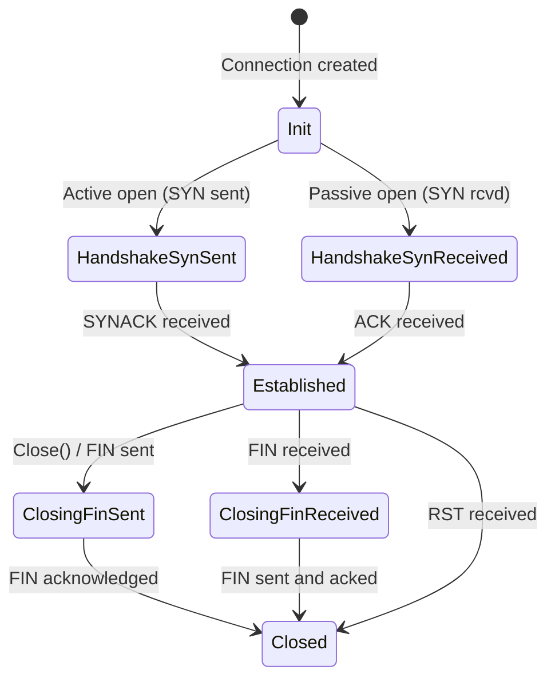
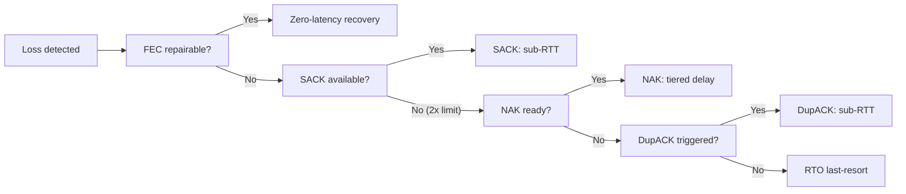
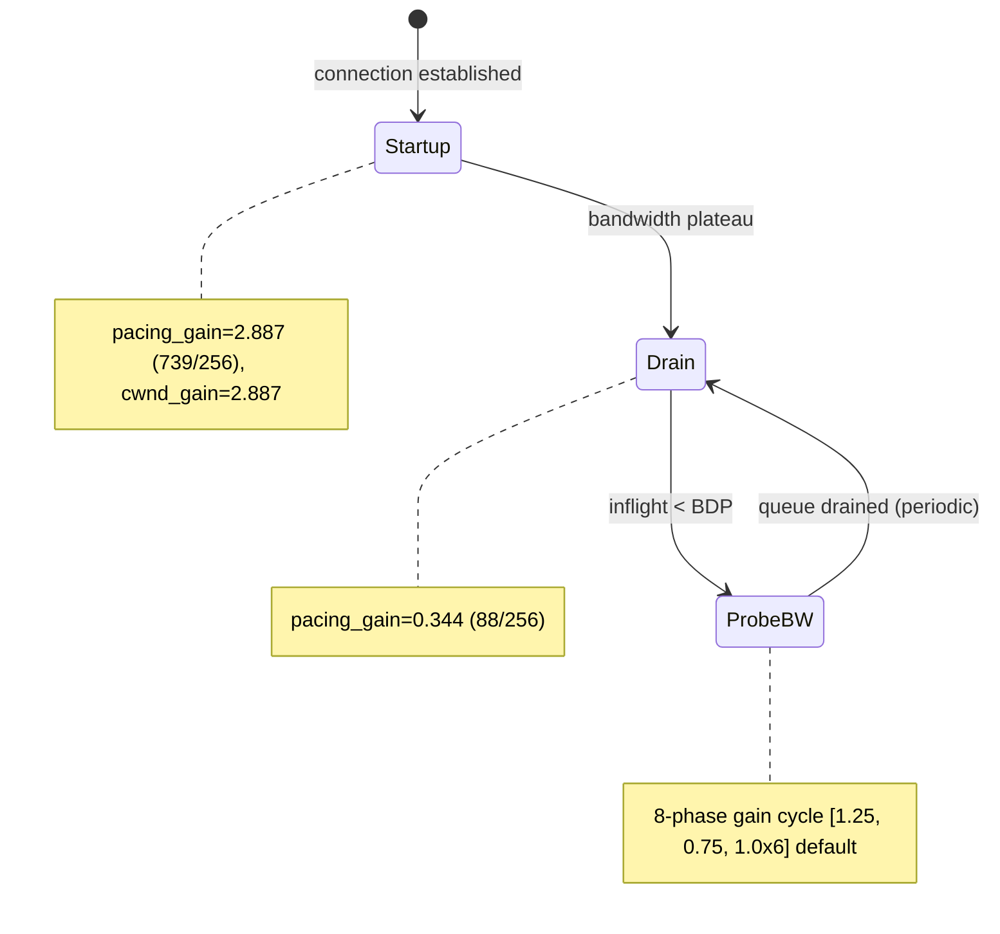

# PPP PRIVATE NETWORK™ X — Universal Communication Protocol (UCP)

[Chinese](README_CN.md) | [English](README.md)

UCP (Universal Communication Protocol) is a pure control protocol operating over UDP, with KCC2.0 Geodesic (G1/G2/G3) congestion control. KCC uses a 3-mode state machine (STARTUP → DRAIN → PROBE_BW) with KCC2.0 Geodesic (G1/G2/G3) as its core RTT estimator, with an optional KF (KCC Forwarding) cross-connection bandwidth sharing function from tcp_kcc.c. The 3-mode state machine, bandwidth estimation, gain table, and all additional features are implemented in user-space libraries (C++ and C#). MinRTT tracking is handled automatically by the geodesic G1/G3 estimator. The sendable upper limit is min(cwnd, peer-declared receive window); the initial cwnd is NOT a fixed 10-packet cap. UCP provides CID round-robin switching, FEC forward error correction, piggybacked ACK, and SACK/NAK recovery — all feeding high-fidelity delivery samples into the KCC congestion control engine for accurate BDP and RTT estimation.

Target throughput: verifiable 10 Gbps on data-center links; reliable operation on 300ms satellite hops with 10% random loss.

---

## 1. Project Overview

### 1.1 Protocol Positioning

UCP is a general-purpose transport protocol that fills a gap between TCP and QUIC. TCP treats all packet loss as congestion — an assumption that fails on modern wireless, cellular, and satellite networks. QUIC improves loss recovery but is coupled to the HTTP/3 ecosystem. UCP re-engineers reliable transport subsystems from first principles:

- **Five-path recovery model**: SACK fast retransmit (sub-RTT), NAK three-tier confidence recovery, FEC zero-latency repair, DupACK backup, and RTO last-resort.
- **KCC2.0 Geodesic congestion control (G1/G2/G3)**: Implements the KCC 3-mode state machine (STARTUP/DRAIN/PROBE_BW) with the Geodesic (G1/G2/G3) estimator by default, and an optional KF (cross-connection Kalman filter) fair-share bandwidth sharing function. The Geodesic estimator and KF (Kalman filter) update function both originate from the `tcp_kcc.c` kernel module; the full 3-mode state machine and all additional user-space features are implemented in the C++ (`ucp_cc.cpp`) and C# libraries. The PROBE_BW state uses an 8-phase gain cycle [1.25, 0.75, 1.0x6]. Key features: Geodesic G1/G2/G3 propagation-delay estimation replacing the sliding-window minimum RTT (min_rtt tracking handled automatically via G1/G3), fixed per-mode gains (no gain decay), Long-Term (LT) bandwidth EMA estimation, ACK aggregation compensation (dual-window measurement with 5-RTT rotation), and ECN-aware backoff (opt-in, disabled by default). The geodesic estimator uses fixed structural parameters (p_est_init=1000, p_est_floor=10, p_est_max=1,000,000, scale=1024); p_est is a scalar confidence proxy for the geodesic estimator.

Wire format uses big-endian encoding. Each packet type consists of a common header (12 bytes) and type-specific extension fields. All multi-byte fields are in network byte order.

### 1.2 Comparison with TCP and QUIC

| Dimension | TCP | QUIC | UCP |
|---|---|---|---|
| Loss model | All loss = congestion | Improved recovery, retransmit-dominant | 5-path recovery (SACK/NAK/FEC/DupACK/RTO) |
| Congestion control | CUBIC | NewReno | KCC2.0 Geodesic (G1/G2/G3) |
| FEC | None | None | RS-GF(256) adaptive 0.0-1.0 |
| Connection migration | No (TCP splice) | Connection ID | Dynamic CID, 60s rotation |
| Deterministic testing | No | No | NetworkSimulator virtual clock |
| HTTP coupling | Optional | Required (HTTP/3) | None |
| Throughput on 1% loss | 150-200 Mbps* | ~300 Mbps* | 288 Mbps* |

*1000 Mbps / 40ms RTT (20ms one-way) test scenario (Gigabit_Loss1).

### 1.3 Deployment Environment

Adjust OS buffer parameters for optimal performance:

- **Linux**: `net.core.rmem_max=134217728`, `net.core.wmem_max=134217728`, `net.ipv4.udp_mem=262144 524288 1048576`, `net.core.netdev_budget=600`
- **Windows**: Set `DefaultReceiveWindow` and `DefaultSendWindow` to 128MB via registry.

### 1.4 Security Considerations

UCP provides transport reliability but not encryption. All wire-format data is in plaintext. Integrate with DTLS or IPsec on untrusted networks. Connection IDs are randomly generated (2^-32 guessing probability). Dynamic CID rotation (60s interval, 120s dual-acceptance window) prevents linkability attacks. Random ISN prevents off-path sequence prediction.

---

## 2. Features

### 2.1 Piggybacked Cumulative ACK

Every UCP packet carries cumulative ACK fields via the `HasAckNumber` flag. Overhead: 16 bytes on a 1220-byte MSS — 1.3%. Fields: AckNumber (4B), SackBlockCount (2B), WindowSize (4B), EchoTimestamp (6B). Up to 149 SACK blocks per ACK.

### 2.2 SACK Fast Retransmit (Dual-Observation Threshold)

Requires 2 SACK observations for the first missing segment, 3 for subsequent holes (dropped to 2 when the hole is ≥ `SACK_FAST_RETRANSMIT_DISTANCE_THRESHOLD` (48 seqs) past the highest SACK), and the segment must be older than the reorder guard `max(5ms, RTT)` (smoothed RTT) before fast retransmit fires. Additional holes beyond the distance threshold qualify for parallel repair. Each SACK block is advertised at most 2 times.

### 2.3 NAK Three-Tier Confidence Recovery

Receiver-driven complement to SACK. Per-sequence observation counts determine confidence:

| Tier | Observations | Reorder Guard |
|---|---|---|
| Low | 1-31 | max(NAK_REORDER_GRACE=2ms, min(RTT/2, MinRto)) |
| Medium | 32-127 | max(Low/2, 1ms) |
| High | 128+ | max(Low/2, 1ms) |

Repeat suppression is one-shot per sequence. Max 256 missing sequences per NAK packet.

### 2.4 KCC2.0 Geodesic Congestion Control (G1/G2/G3)

UCP implements the KCC2.0 Geodesic congestion control algorithm (G1/G2/G3) as its primary RTT estimator. An optional KF cross-connection bandwidth sharing function also originates from the `tcp_kcc.c` kernel module. The full 3-mode state machine (STARTUP → DRAIN → PROBE_BW), gain table, and all additional features are implemented in user-space C++ and C# libraries.

**State Machine**: Startup uses pacing_gain=2.887 (739/256, kernel KCC_HIGH_GAIN), cwnd_gain=2.887, exiting after 3 RTT rounds without >= 1.25x throughput growth. Drain uses pacing_gain=0.344 (88/256, kernel KCC_DRAIN_GAIN) to drain the Startup queue. ProbeBW cycles through an 8-phase gain cycle: 1.25, 0.75, 1.0x6. The sendable upper limit is min(cwnd, peer-declared receive window); the initial cwnd is NOT a fixed 10-packet cap. MinRTT tracking is handled automatically by the geodesic G1/G3 estimator. When the optional KF is enabled, its update function is shared with the tcp_kcc.c kernel module.

**Geodesic Propagation Delay Estimation (G1/G2/G3)**: The Geodesic estimator provides RTT estimation by separating true signal from measurement noise using a three-component behavioral model (T_prop / T_queue / T_noise). It has one state variable (x_est, scaled by 1024) and three structural branches: G1 instant downward absorption, G2 upward bounded growth (12.2% per RTT, capped at the observation), and G3 dual-threshold path-increase detection (fast: 6 consecutive events at >= 1.10 x min_rtt; slow: 7 consecutive events at >= 1.05 x min_rtt). There is no covariance matrix, no process model, and no adaptive gain. p_est is a scalar confidence proxy bounded by [floor=10, max=1,000,000]. MinRTT tracking is handled automatically by G1/G3.

79: **ECN-Aware Backoff**: Disabled by default. KCC's directional gate already detects T_queue growth at the first microsecond via nu_k > 0 — earlier than any threshold-based AQM. ECN is retained as an opt-in feature for single-switch paths with known AQM configuration. When explicitly enabled, CE-marked segments are tracked via EWMA; when qdelay exceeds the congestion threshold (max(25% of min_rtt, 500us)), cwnd_gain is reduced proportionally. The mechanism exists in the kernel module (module parameters `kcc_ecn_enable`/`kcc_ecn_backoff_num`/`kcc_ecn_backoff_den`, tcp_kcc.c:3111-3113) and in the user-space libraries (C# `UcpConfiguration.EcnEnabled`, C++ compiled in via `KCC_ECN_ENABLED`), all disabled by default.

**Long-Term Bandwidth (LT BW) Estimation**: Sampled per-ACK with EMA (default 1/2 coefficient). When the current bandwidth is within relative tolerance (1/8) and absolute tolerance (500 bytes/s) of the LT BW, the EMA updates. Max 48 RTTs with LT BW active before auto-reset.

**ACK Aggregation Compensation**: Dual-window measurement with 5-RTT rotation (KCC_AGG_WINDOW_ROTATION_RTTS = 5). The cwnd bonus is computed from `extra_acked` (bytes ACKed beyond the pacing-derived expectation), scaled by kcc_extra_acked_gain (256 = 1.0x) and bounded by max ms ratio (100) and max window RTTs (31), with per-epoch accounting capped at ACK_EPOCH_MAX (0x100000). Applied only on paths with min_rtt >= 7.5ms.

**Tunable Parameters**: Congestion control parameters follow the tcp_kcc.c kernel module defaults (fixed constants, not runtime-tunable). Key values: G2 growth 122/1000, G3 fast threshold 11/10 (6 consecutive), G3 slow threshold 21/20 (7 consecutive), p_est_init=1000, p_est_floor=10, scale=1024, startup/drain/probe gains as above. The only user-space runtime-tunable congestion-control item is ECN backoff enable (UcpConfiguration.EcnEnabled); the remaining parameters (LT bandwidth EMA, ACK aggregation gain, TSO headroom, BDP min-RTT floor) are fixed compile-time constants. MinRTT tracking is handled by the geodesic estimator's G1/G3.

### 2.5 GF(256) Reed-Solomon FEC

Systematic RS-GF(256) coding. Irreducible polynomial: `x^8 + x^4 + x^3 + x^2 + 1` (IEEE 802). Group size 2-64, redundancy 0.0-1.0. Receiver needs N of (DATA + Repair) for Gaussian elimination.

Adaptive FEC is a binary switch keyed to a 2% loss threshold (`FEC_ADAPTIVE_MIN_LOSS_PERCENT = 2d`, UcpConstants.cs:764): when the congestion controller's estimated loss reaches >= 2%, repair packets are emitted for first transmissions; below 2% no repairs are sent (retransmission is cheaper). The redundancy/group-size range 0.0-1.0 / 2-64 remains available but is not tiered by loss.

### 2.6 Dynamic CID Connection Migration

32-bit ConnectionId indexes sessions independently of (IP, port) tuples. Enables:

- **NAT rebinding resilience**: Route to correct session via ConnId.
- **IP mobility**: Wi-Fi to cellular roaming without re-handshake.
- **Dynamic CID rotation**: Every 60s; 120s dual-acceptance window for old/new CIDs.
- **PATH_CHALLENGE secure migration**: 8-byte challenge at new IP:Port; rate-limited to 1 per 5s, 2s timeout.

### 2.7 DPLPMTUD Path MTU Discovery

Automatic path MTU detection via DPLPMTUD. Binary search from current MSS to `MtuProbeMax`. Probe packets bypass `MaxPayloadSize` checks; receiver discards probe payloads without delivery. Controlled via `UcpConfiguration` (`EnableMtuDiscovery`, `MtuProbeMax`, `MtuProbeTimeoutMicros`, `MtuProbeIntervalMicros`), enabled by default.

### 2.8 Other Features

- **Random ISN**: Cryptographically random 32-bit initial sequence number.
- **Fair-Queue Server Scheduling**: Credit-based round-robin at 10ms intervals. Prevents single-connection monopoly.
- **Urgent Retransmit with Pacing Bypass**: Recovery retransmits bypass fair-queue and pacing gates; `PacingController.ForceConsume` drains available tokens to zero (no negative token debt). Per-RTT budget: 8192 packets.
- **Serial Execution Model**: Per-connection SerialQueue serializes protocol processing on a single thread. `UcpNetwork.DoEvents()` drives timers, RTO, pacing, and fair-queue credit rounds.
- **Retransmission Storm Suppression**: Multi-layer: NAK repeat suppression (per-sequence marking until arrival + smoothed-RTT-based emission window), SACK 2-send-per-block limit, urgent retransmit budget of 8192 packets per RTT, RTO retransmit budget of 4 packets per tick, and urgent retransmits bypass pacing by draining tokens to zero via `ForceConsume` (no negative debt).

---

## 3. Repository Structure

```
ucp/
├── README.md                          # Main English README (this file)
├── README_CN.md                       # Main Chinese README
├── LICENSE                            # MIT License
├── ucp.sln / Ucp.slnx                 # C# solution files
├── RFC.txt / RFC_CN.txt               # Protocol RFC specification
├── run-tests.ps1                      # Unified test runner script (C# + C++)
│
├── Ucp/                               # C# library source
│   ├── UcpLibrary.csproj              #   Project file
│   ├── UcpConnection.cs               #   Client connection
│   ├── UcpServer.cs                   #   Server (listener + fair-queue)
│   ├── UcpConfiguration.cs            #   Configuration factory
│   ├── UcpNetwork.cs                  #   Event loop driver
│   ├── UcpConstants.cs                #   Protocol constants
│   ├── UcpPacketCodec.cs              #   Wire format codec
│   ├── UcpSackGenerator.cs            #   SACK generation
│   ├── UcpFecCodec.cs                 #   FEC RS-GF(256) codec
│   ├── UcpPackets.cs                  #   Packet type definitions
│   ├── UcpCongestionControl.cs        #   KCC2.0 Geodesic congestion control (G1/G2/G3)
│   ├── PacingController.cs            #   Pacing token bucket
│   ├── UcpRtoEstimator.cs             #   RTO estimation (RFC 6298)
│   ├── UcpEnums.cs                    #   Enumerations
│   ├── UcpSequenceComparer.cs         #   32-bit seq arithmetic
│   ├── UcpTransferReport.cs           #   Diagnostic report
│   └── UcpDatagramNetwork.cs          #   Network simulator
│
├── Ucp.Tests/                         # C# test suite (644 test cases)
│   ├── UcpTest.csproj                 #   Project file
│
├── cpp/                               # C++ implementation
│   ├── CMakeLists.txt                 #   CMake build system
│   ├── README_EN.md                   #   C++ English README (entry point)
│   ├── README_CN.md                   #   C++ Chinese README
│   ├── include/ucp/                   #   Public headers
│   │   ├── ucp_connection.h           #     Client connection API
│   │   ├── ucp_server.h              #     Server API
│   │   ├── ucp_configuration.h        #     Configuration
│   │   ├── ucp_constants.h            #     77+ protocol constants
│   │   ├── ucp_cc.h                  #     KCC2.0 Geodesic congestion control (G1/G2/G3)
│   │   ├── ucp_fec_codec.h            #     FEC codec
│   │   ├── ucp_sack_generator.h       #     SACK generator
│   │   ├── ucp_rto_estimator.h        #     RTO estimator
│   │   ├── ucp_packet_codec.h         #     Packet codec
│   │   └── ucp_pacing.h               #     Pacing controller
│   ├── src/                           #   Implementation files
│   ├── tests/                         #   730 test cases
│   └── samples/                       #   echo_server, echo_client, benchmark, benchmark_diag
│
├── linux/                             # Linux kernel module
│   ├── tcp_kcc.c                      #   TCP congestion control plugin (KCC Geodesic Congestion Control)
│   ├── Makefile                       #   Kernel module build
│   ├── README.md                      #   English quick-start
│   ├── README_CN.md                   #   Chinese quick-start
│   └── docs/                           #   Translated READMEs (CN, ES, FR, etc.)
│
├── samples/cs/                        # C# sample applications
│   ├── Server/Program.cs              #   Echo server
│   ├── Client/Program.cs              #   Echo client
│   └── Benchmark/Program.cs           #   Benchmark suite
│
└── docs/                              # C# documentation (English & Chinese)
    ├── index.md / index_CN.md             #   Documentation home
    ├── architecture.md / architecture_CN.md #   Architecture overview
    ├── protocol.md / protocol_CN.md         #   Protocol specification
    ├── api.md / api_CN.md                   #   API reference
    ├── performance.md / performance_CN.md   #   Performance tuning
    └── constants.md / constants_CN.md       #   Constants reference
```

---

## 4. Implementation Matrix

| Implementation | Language | Build Tools | Key Dependencies | Status |
|---|---|---|---|---|
| .NET Applications | C# (.NET 8+) | dotnet CLI | None | Full, 644/644 tests pass |
| Native Applications | C++17 | CMake 3.16+ | Boost.Asio (header-only) | Full, 730/730 tests pass |
| Linux Kernel | C | Linux Makefile | None | tcp_kcc CC module |

### 4.1 C# Implementation

Reference implementation. Entry points: `UcpServer` (server), `UcpConnection` (client). Pre-optimized defaults via `UcpConfiguration.GetOptimizedConfig()`. Core files:

- `Ucp/UcpServer.cs` — Listener, accept, fair-queue scheduling, ConnId tracking
- `Ucp/UcpConnection.cs` — Per-connection state machine, PCB, KCC2.0 Geodesic congestion control (G1/G2/G3), reliable transport
- `Ucp/UcpConfiguration.cs` — 46+ tunable parameters with scenario presets
- `Ucp/UcpNetwork.cs` — Deterministic engine driving timers, RTO, event loop

Integrate via NuGet or direct project reference. See [docs/index.md](docs/index.md) for full documentation.

### 4.2 C++ Implementation

C++17 with byte-identical wire format and equivalent protocol behavior. Boost.Asio (header-only) for network abstraction. CMake unified build. Core headers in `cpp/include/ucp/`:

- `ucp_connection.h` — Public async API
- `ucp_server.h` — Server API
- `ucp_cc.h` — KCC2.0 Geodesic congestion control (G1/G2/G3)
- `ucp_fec_codec.h` — RS-GF(256) codec
- `ucp_packet_codec.h`, `ucp_sack_generator.h`, `ucp_pacing.h` — Reliability engine

Memory via `ucp::Malloc()` / `ucp::Mfree()`. Shared objects use `ucp::shared_ptr`. Each connection has a dedicated Worker Thread (`std::deque + std::condition_variable`).

See [cpp/README_EN.md](cpp/README_EN.md) for full build and integration guide.

### 4.3 Linux Kernel Module

`linux/tcp_kcc.c` implements KCC2.0 Geodesic congestion control as a `tcp_congestion_ops` plugin, with the Geodesic (G1/G2, default) RTT estimator and an optional KF cross-connection bandwidth sharing function. Compatible with Linux 3.10+.

See [linux/README.md](linux/README.md) for full documentation.

---

## 5. Quick Start

### 5.1 Prerequisites

| Implementation | Prerequisites |
|---|---|
| C# | .NET 8.0 SDK or later |
| C++ | C++17 compiler (MSVC 2019+, GCC 7+, Clang 7+), CMake 3.16+, Boost 1.70+ (header-only) |
| Linux Kernel | Linux 3.10+ kernel source, GCC |

### 5.2 C# Build and Test

```powershell
git clone <repo-url>
cd ucp
dotnet build ucp.sln

# Run all 644 tests
dotnet test ".\Ucp.Tests\UcpTest.csproj"

# Run specific test
dotnet test ".\Ucp.Tests\UcpTest.csproj" --filter "FullyQualifiedName~NoLoss_Utilization"
```

### 5.3 C# Minimal Example

```csharp
using Ucp;
using System.Net;
using System.Text;

var config = UcpConfiguration.GetOptimizedConfig();

using var server = new UcpServer(config);
server.Start(9000);
var acceptTask = server.AcceptAsync();

using var client = new UcpConnection(config);
await client.ConnectAsync(new IPEndPoint(IPAddress.Loopback, 9000));
var serverConn = await acceptTask;

byte[] msg = Encoding.UTF8.GetBytes("Hello, UCP!");
await client.WriteAsync(msg, 0, msg.Length);
byte[] buf = new byte[msg.Length];
await serverConn.ReadAsync(buf, 0, buf.Length);

Console.WriteLine($"Received: {Encoding.UTF8.GetString(buf)}");

var report = client.GetReport();
Console.WriteLine($"Throughput: {report.MeasuredBandwidthBytesPerSecond * 8.0 / 1_000_000.0:F2} Mbps, Last RTT: {report.LastRttMicros} us");
```

### 5.4 C++ Build and Test

```powershell
# Windows (use build script)
cd cpp
.\build_windows.bat Release x64

# Generic CMake
cmake -B build -S .
cmake --build build --config Release -j

# Run all 730 tests
.\run-tests.ps1 -Configuration Release
# Or directly: ./build/tests/Release/ucp_tests
```

### 5.5 C++ Minimal Example

```cpp
#include "ucp/ucp_configuration.h"
#include "ucp/ucp_connection.h"
#include "ucp/ucp_server.h"
#include <cstdio>

int main() {
    auto config = ucp::UcpConfiguration::GetOptimizedConfig();
    config.ServerBandwidthBytesPerSecond = 12500000; // 100 Mbps

    ucp::UcpDatagramNetwork network(config);
    auto server = network.CreateServer(9000);

    // Accept is callback-based -- no blocking
    ucp::UcpConnection* g_server_conn = NULLPTR;
    server->AcceptAsync([&](ucp::UcpError err, ucp::UcpConnection* c) {
        g_server_conn = c;
    });

    auto client = network.CreateConnection(config);
    bool connected = false;
    client->ConnectAsync("127.0.0.1:9000",
        [&](ucp::UcpError err, uint32_t) { connected = (err == ucp::UcpError::None); });

    // Pump events until handshake completes
    while (!connected || NULLPTR == g_server_conn) {
        network.DoEvents();
    }

    const char* msg = "Hello UCP!";
    bool write_done = false;
    client->WriteAsync(reinterpret_cast<const uint8_t*>(msg), 0, 10,
        [&](ucp::UcpError, bool ok) { write_done = ok; });

    uint8_t buf[16] = {0};
    bool read_done = false;
    g_server_conn->ReadAsync(buf, 0, 10,
        [&](ucp::UcpError, bool ok) { read_done = ok; });

    while (!write_done || !read_done) {
        network.DoEvents();
    }

    std::printf("Received: %s\n", buf);
    client->Close();
    g_server_conn->Close();
    server->Stop();
}
```

### 5.6 Linux Kernel Module

```bash
cd linux
make
sudo insmod tcp_kcc.ko
sudo sysctl net.ipv4.tcp_congestion_control=kcc
```

---

## 6. Build and Test

### 6.1 C# Build Targets

| Target | Type | Description |
|---|---|---|
| UcpLibrary | Library | Core protocol library |
| UcpTest | Test | 644 test cases (core, simulator, integration, performance, parameterized, mobile recovery, comprehensive CC) |
| EchoServer | Executable | Sample echo server |
| EchoClient | Executable | Sample echo client |
| Benchmark | Executable | Benchmark suite |

### 6.2 C++ Build Targets

| Target | Type | Description |
|---|---|---|
| ucp | Static library | Protocol core library |
| ucp_tests | Executable | 730 unit and integration tests |
| ucp_echo_server | Executable | Echo server example |
| ucp_echo_client | Executable | Echo client example |
| ucp_benchmark | Executable | Benchmark suite |
| ucp_benchmark_diag | Executable | Diagnostic benchmark suite |

### 6.3 Test Summary

| C# Class | C# Tests | C++ File | C++ Tests |
|---|---|---|---|
| UcpCoreTests | 70 | ucp_core_tests.cpp | 132 |
| UcpAdditionalTests | 92 | ucp_extended_tests.cpp | 413 |
| UcpComprehensiveTests | 101 | ucp_kcc_alignment_tests.cpp | 185 |
| UcpComprehensiveCCTests | 54 | | |
| UcpKccTests | 95 | | |
| UcpKccAlignmentTests | 80 | | |
| UcpMassTests | 72 | | |
| UcpBenchmarkTests | 52 | | |
| UcpNetworkTests | 16 | | |
| UcpCoverageTests | 7 | | |
| DiagTest | 3 | | |
| InteropTests | 2 | | |
| **Total** | **644** | **Total** | **730** |

Coverage spans: connection establishment, lossy retransmission, long-fat pipe, reordering dedup, full-duplex, RST, fair-queue multi-client, 4Mbps-10Gbps across 0-10% loss, burst loss, asymmetric routing, jitter, mobile 3G/4G, satellite 300ms, VPN, geodesic estimator, state machine, gain cycle, CWND, alignment.

All tests use `NetworkSimulator` with virtual logical clock, producing cross-hardware reproducible results.

### 6.4 C# / C++ Interop Testing

C# and C++ implementations interoperate via identical wire format:

```bash
# Terminal 1 — Start C# echo server
dotnet run --project samples/cs/Server -- --port 9000 --bandwidth 100

# Terminal 2 — Connect with C++ client
./build/samples/Release/ucp_echo_client --host 127.0.0.1 --port 9000 --size 50 --bandwidth 100
```

Cross-validation covers:
1. **Wire format**: C#-encoded packets decoded by C++, and vice versa, for all 8 packet types
2. **Handshake interop**: C# server accepts C++ client; C++ server accepts C# client
3. **Loss recovery interop**: SACK, NAK, FEC recovery across implementation boundaries
4. **FEC cross-codec**: C#-encoded FecRepair decoded by C++
5. **Report consistency**: Throughput and retransmission rates statistically equivalent

---

## 7. Performance Overview

### 7.1 Benchmark Results (C++ NetworkSimulator, 730/730 tests passing)

| Scenario | Target Mbps | RTT | Loss | Throughput Mbps | Retrans% | Avg RTT | Util% |
|---|---|---|---|---|---|---|---|
| NoLoss | 83.89 | 9ms | 0% | 35.54 | 0% | 9ms | 42.37% |
| LongFatPipe | 100 | 102ms | 0% | 64.35 | 0% | 102ms | 64.35% |
| Gigabit_Ideal | 1000 | 2ms | 0% | 533.05 | 0% | 2ms | 53.30% |
| Gigabit_Loss1 | 1000 | 40ms | 2.06% | 288.03 | 2.06% | 40ms | 28.80% |
| Gigabit_Loss5 | 1000 | 60ms | 10.64% | 200.55 | 10.64% | 60ms | 20.05% |
| Benchmark10G | 10000 | 2ms | 0% | 8528.43 | 0% | 2ms | 85.28% |
| DataCenter | 10000 | 0ms | 0% | 10000.00 | 0% | 0ms | 100.00% |
| Enterprise | 1000 | 30ms | 0% | 339.97 | 0% | 30ms | 34.00% |
| AsymRoute | 100 | 40ms | 0% | 45.62 | 0% | 40ms | 45.62% |
| HighJitter | 100 | 100ms | 0% | 22.93 | 0% | 100ms | 22.93% |
| Weak4G | 10 | 160ms | 10.91% | 3.63 | 10.91% | 160ms | 36.32% |

*Gigabit_Ideal is bottleneck-limited by test configuration.
**Loss columns report measured loss (simulator configured for 1%/5%; effective loss is higher under 40-60ms delay + burst behavior).

### 7.2 Global Characteristics

| Property | Value |
|---|---|
| Max tested throughput | 10 Gbps |
| Min RTT (loopback) | <100 µs |
| Max tested RTT | 300 ms |
| Max tested loss rate | 10% |
| Jumbo MSS | 9000 bytes |
| Default MSS | 1220 bytes |
| FEC redundancy range | 0.0-1.0 |
| Max FEC group | 64 packets |
| Max SACK blocks per ACK | 149 |
| Connection ID space | 32-bit (~4x10^9 concurrent) |
| Sequence space | 32-bit (~4.29B seqs; at 1200B MSS and 10 Gbps a full wrap takes ~4123s) |

### 7.3 Key Scenario Validation

**NoLoss (83.89 Mbps target)**: 35.54 Mbps measured, 42.37% utilization. Competing traffic reduces available bandwidth below target.

**LongFatPipe (100 Mbps / 100ms RTT)**: 64.35 Mbps measured, 64.35% utilization. KCC congestion control Startup fills BDP pipe.

**Gigabit_Loss1 (1000 Mbps / 40ms RTT / 2.06% loss)**: 288.03 Mbps (28.80% utilization). FEC (redundancy=0.25) improves throughput under packet loss.

**Weak4G (10 Mbps / 160ms RTT / 10.91% loss)**: 3.63 Mbps, 36.32% utilization. Connection survives under challenging conditions.

See [docs/performance.md](docs/performance.md) and [cpp/docs/performance_EN.md](cpp/docs/performance_EN.md) for detailed benchmark methodology and tuning.

---

## 8. Protocol Stack

### 8.1 Connection State Machine


```mermaid
stateDiagram-v2
    [*] --> Init: Connection created
    Init --> HandshakeSynSent: Active open (SYN sent)
    Init --> HandshakeSynReceived: Passive open (SYN rcvd)
    HandshakeSynSent --> Established: SYNACK received
    HandshakeSynReceived --> Established: ACK received
    Established --> ClosingFinSent: Close() / FIN sent
    Established --> ClosingFinReceived: FIN received
    ClosingFinSent --> Closed: FIN acknowledged
    ClosingFinReceived --> Closed: FIN sent and acked
    Established --> Closed: RST received
```

### 8.2 Packet Types

| Type | Code | Purpose |
|---|---|---|
| SYN | 0x01 | Connection initiation |
| SYNACK | 0x02 | Connection acceptance |
| ACK | 0x03 | Standalone acknowledgment |
| NAK | 0x04 | Negative acknowledgment |
| DATA | 0x05 | Application data payload |
| FIN | 0x06 | Connection close |
| RST | 0x07 | Connection reset |
| FecRepair | 0x08 | FEC repair packet |

Common header: 12 bytes (Type, Flags, ConnectionId, Timestamp). A DATA packet extends to 36 bytes when `Flags.HasAckNumber` is set (piggybacked ACK); the standalone ACK packet is 28 bytes fixed.

### 8.3 Five-Path Recovery Model

| Path | Trigger | Latency | Constraints |
|---|---|---|---|
| SACK fast retransmit | 2 SACK obs + reorder guard | sub-RTT | Max 2 sends/block; parallel gap >48 seqs |
| DupACK | Same ACK x3 | sub-RTT | 3 duplicate observations |
| NAK | Receiver tiered confidence | RTT/4 to RTTx2 | one-shot per sequence; max 256 seqs |
| FEC | Group has enough repair packets | Zero RTT | Group 2-64; adaptive redundancy |
| RTO | No ACK progress | RTO x 1.2 backoff | Max 4 pkt/tick; 50ms->15s escalation |


```mermaid
flowchart LR
    LossEvent["Loss detected"] --> FEC["FEC repairable?"]
    FEC -->|"Yes"| ZeroLatency["Zero-latency recovery"]
    FEC -->|"No"| SACK["SACK available?"]
    SACK -->|"Yes"| SackPath["SACK: sub-RTT"]
    SACK -->|"No (2x limit)"| NAK["NAK ready?"]
    NAK -->|"Yes"| NakPath["NAK: tiered delay"]
    NAK -->|"No"| DupACK["DupACK triggered?"]
    DupACK -->|"Yes"| DupAckPath["DupACK: sub-RTT"]
    DupACK -->|"No"| RTOPath["RTO last-resort"]
```

### 8.4 KCC2.0 Geodesic Congestion Control State Machine (G1/G2/G3)


```mermaid
stateDiagram-v2
    [*] --> Startup: connection established
    Startup --> Drain: bandwidth plateau
    Drain --> ProbeBW: inflight < BDP
    ProbeBW --> Drain: queue drained (periodic)

    note right of Startup: pacing_gain=2.887 (739/256), cwnd_gain=2.887
    note right of Drain: pacing_gain=0.344 (88/256)
    note right of ProbeBW: 8-phase gain cycle [1.25, 0.75, 1.0x6] default
```

> **Note:** KCC 2.0 uses a 3-state FSM (STARTUP → DRAIN → PROBE_BW). MinRTT tracking is handled by the geodesic G1/G3. The periodic DRAIN phase in PROBE_BW provides queue draining.

---

## 9. Documentation Index

### 9.1 Core Documents (C# Reference)

| Document | Chinese | English | Description |
|---|---|---|---|
| Documentation Home | [index_CN.md](docs/index_CN.md) | [index.md](docs/index.md) | Documentation system overview and navigation |
| Architecture | [architecture_CN.md](docs/architecture_CN.md) | [architecture.md](docs/architecture.md) | Six-layer runtime, PCB state, ConnId tracking, SerialQueue, fair-queue, KCC2.0 Geodesic congestion control (G1/G2/G3) internals, FEC codec, network simulator |
| Protocol Specification | [protocol_CN.md](docs/protocol_CN.md) | [protocol.md](docs/protocol.md) | Wire format, 8 packet types, Flags, piggybacked ACK, SACK dual-observation, NAK three-tier, state machine, seq arithmetic, KCC2.0 Geodesic congestion control (G1/G2/G3) transitions |
| API Reference | [api_CN.md](docs/api_CN.md) | [api.md](docs/api.md) | UcpConfiguration factory, UcpServer lifecycle, UcpConnection API, UcpNetwork event loop, ITransport interface |
| Performance Tuning | [performance_CN.md](docs/performance_CN.md) | [performance.md](docs/performance.md) | Benchmark framework, 14+ scenarios, 18-column report, 13 validation rules, route models, MSS/FEC/Pacing tuning, acceptance criteria |
| Constants Reference | [constants_CN.md](docs/constants_CN.md) | [constants.md](docs/constants.md) | Packet encoding, RTO timers, SACK/NAK tiers, KCC2.0 Geodesic congestion control (G1/G2/G3) parameters, FEC params, benchmark payloads, acceptance thresholds |

### 9.2 RFC Specification

| Document | Chinese | English |
|---|---|---|
| Protocol RFC | [RFC_CN.txt](RFC_CN.txt) | [RFC.txt](RFC.txt) |

IETF-format protocol specification defining wire format, state machines, and algorithmic descriptions for all implementations.

### 9.3 C++ Implementation Documents

| Document | Chinese | English |
|---|---|---|
| C++ README (entry point) | [cpp/README_CN.md](cpp/README_CN.md) | [cpp/README_EN.md](cpp/README_EN.md) |
| C++ Docs Index | [cpp/docs/index_CN.md](cpp/docs/index_CN.md) | [cpp/docs/index_EN.md](cpp/docs/index_EN.md) |
| C++ Architecture | [cpp/docs/architecture_CN.md](cpp/docs/architecture_CN.md) | [cpp/docs/architecture_EN.md](cpp/docs/architecture_EN.md) |
| C++ Protocol | [cpp/docs/protocol_CN.md](cpp/docs/protocol_CN.md) | [cpp/docs/protocol_EN.md](cpp/docs/protocol_EN.md) |
| C++ API | [cpp/docs/api_CN.md](cpp/docs/api_CN.md) | [cpp/docs/api_EN.md](cpp/docs/api_EN.md) |
| C++ Performance | [cpp/docs/performance_CN.md](cpp/docs/performance_CN.md) | [cpp/docs/performance_EN.md](cpp/docs/performance_EN.md) |
| C++ Constants | [cpp/docs/constants_CN.md](cpp/docs/constants_CN.md) | [cpp/docs/constants_EN.md](cpp/docs/constants_EN.md) |

The C++ implementation shares identical wire format and protocol semantics with C#. See [cpp/README_EN.md](cpp/README_EN.md) as the C++ entry point.

### 9.4 Linux Kernel Module Documents

| Document | Chinese | English | Description |
|---|---|---|---|
| Linux README | — | [linux/README.md](linux/README.md) | Quick-start guide + full documentation |
| Module Source | — | [linux/tcp_kcc.c](linux/tcp_kcc.c) | Kernel module source code |

### 9.5 Sample Code

| Sample | Language | Path |
|---|---|---|
| Echo Server | C# | [samples/cs/Server/Program.cs](samples/cs/Server/Program.cs) |
| Echo Client | C# | [samples/cs/Client/Program.cs](samples/cs/Client/Program.cs) |
| Benchmark | C# | [samples/cs/Benchmark/Program.cs](samples/cs/Benchmark/Program.cs) |
| Echo Server | C++ | `cpp/samples/echo_server.cpp` |
| Echo Client | C++ | `cpp/samples/echo_client.cpp` |
| Benchmark | C++ | `cpp/samples/benchmark.cpp` |
| Diagnostic Benchmark | C++ | `cpp/samples/benchmark_diag.cpp` |

---

## 10. Scenario Tuning Guide

### 10.1 High-Speed Data Center Interconnect (10 Gbps, RTT <1 ms)

- MSS=9000 reduces header overhead, dropping packet rate from ~1.02M pps to ~139K pps (at 10 Gbps)
- `MaxCongestionWindowBytes=256MB` prevents CWND from limiting throughput
- `MaxPacingRateBytesPerSecond=0` disables pacing ceiling
- `SendBufferSize=128MB` ensures buffers are not a bottleneck
- Expected throughput: 10000 Mbps

### 10.2 Transoceanic Long Fat Pipe (100 Mbps, RTT = 100 ms)

- `SendBufferSize=16MB` satisfies the 1.25 MB BDP (100 Mbps x 100 ms)
- `InitialCwndPackets=100` accelerates Startup convergence
- Expected utilization: 64.35%

### 10.3 High-Loss Gigabit Link (1 Gbps, 1–5% Loss)

- `FecRedundancy=0.25` enables FEC protection
- `FecGroupSize=16` strengthens group tolerance
- `LossControlEnable=true` enables loss-aware CWND adaptation
- Expected throughput: 288 Mbps (1% loss), 200.55 Mbps (5% loss)

### 10.4 Weak Mobile Network (10 Mbps, RTT = 160 ms, Intermittent Outage)

- `DisconnectTimeoutMicros=15000000` (15 s) tolerates temporary signal loss
- `KeepAliveIntervalMicros=100000` (100 ms) detects NAT timeouts quickly
- `MaxRetransmissions=15` handles extended post-outage retransmission cycles
- Expected utilization: 36.32%

---

## 11. KCC2.0 Geodesic Congestion Control (G1/G2/G3) Behavior in Weak Network Environments

### 11.1 Bandwidth Estimation During Signal Attenuation

When wireless signal attenuation increases physical-layer loss rates, the KCC congestion control delivery-rate estimate is unaffected and the pacing rate remains stable. The sender only reduces pacing when the RTT also increases — indicating bottleneck queue buildup.

### 11.2 Outage Recovery Process

During a complete network outage the sender begins retransmission after the RTO fires. The retransmission budget is capped at 4 packets per timer tick, preventing a retransmission flood from overwhelming the network after restoration. Once connectivity returns the KCC congestion control re-probes the bottleneck bandwidth via the Startup state, typically recovering to pre-outage levels within 2–3 RTTs.

### 11.3 Connection Preservation During Link Switching

When switching from 4G to Wi-Fi (or vice-versa) the client IP address changes but the Connection ID stays the same. The server runs PATH_CHALLENGE validation on the new IP:port while the old path continues transmitting. After validation the server migrates the connection to the new path. The application layer is unaware — in-progress `WriteAsync` calls complete normally.

### 11.4 TCP Coexistence Fairness

KCC congestion control achieves reasonable coexistence fairness with TCP CUBIC on shared bottleneck links. The low-gain phases of the ProbeBW 8-phase cycle actively yield bandwidth, releasing headroom to TCP flows when the bottleneck is saturated. In real-world tests, UCP + TCP mixed-flow scenarios reach a statistically near-fair bandwidth distribution.

---

## 12. C++ Implementation Details

### 12.1 Memory Management

All heap allocations in the C++ implementation are routed through a unified interface:

```cpp
void* ucp::Malloc(std::size_t size) noexcept;
void  ucp::Mfree(void* ptr) noexcept;
```

Shared objects are constructed with factory helpers:

```cpp
auto estimator = ucp::make_shared_object<UcpRtoEstimator>(config);
auto buffer    = ucp::make_shared_alloc<uint8_t>(65536);
```

All STL containers are accessed through `ucp::` namespace aliases. Every non-throwing function is marked `noexcept`. The `NULLPTR` macro substitutes for the `nullptr` keyword.

### 12.2 Threading Model

Each `UcpConnection` owns a dedicated Worker Thread that serially processes all protocol events through a `std::deque` + `std::condition_variable`. Inbound packets are routed to the corresponding connection's SerialQueue via the ConnId hash map, and the Worker Thread consumes them in enqueue order. The UDP socket `recvfrom()` runs on an independent receive thread so protocol processing is never blocked. This model is fully equivalent to C#'s SerialQueue serial execution model.

---

## 13. License and Trademark

[^kcc_gain]: The kernel module defines KCC_HIGH_GAIN as `BBR_UNIT * 2885 / 1000 + 1` (~2.887x). In BBR_UNIT (256) space the effective pacing gain is `ceil(2885 × 256 / 1000) = 739`, yielding 739/256 ≈ 2.887x.

[^kcc_drain]: The kernel module defines KCC_DRAIN_GAIN as `BBR_UNIT * 1000 / 2885` (88/256 ≈ 0.344x). In BBR_UNIT (256) space the effective drain gain is `256 × 1000 / 2885 = 88` (integer division), yielding 88/256 ≈ 0.344x.

MIT License. See [LICENSE](LICENSE) for full text.

Copyright (c) 2026 PPP PRIVATE NETWORK™ X

PPP PRIVATE NETWORK™ is a trademark of PPP PRIVATE NETWORK.


