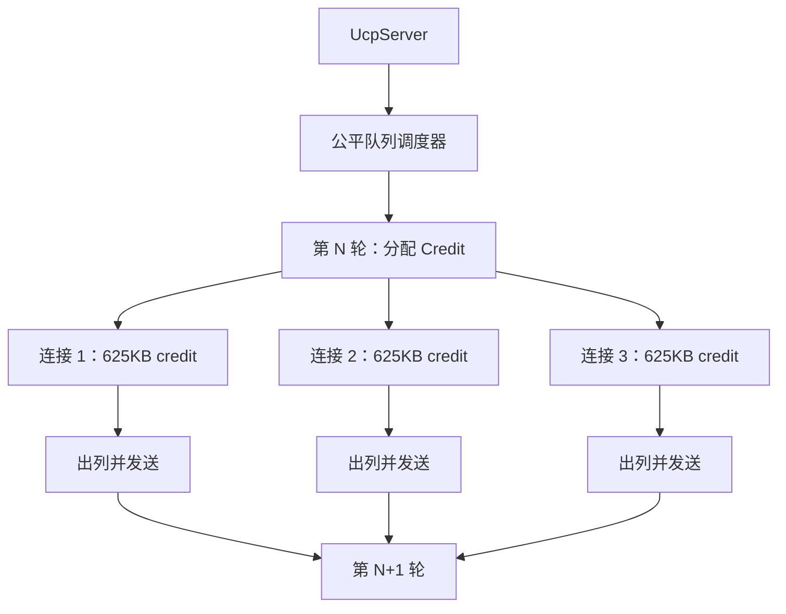
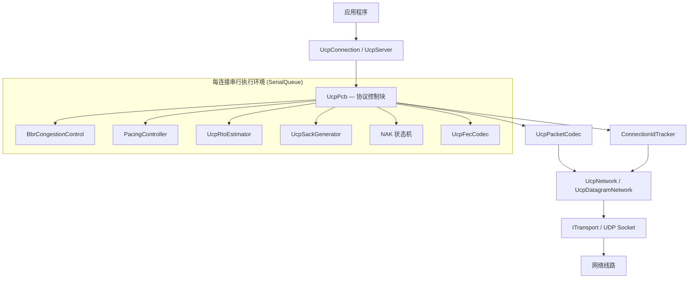
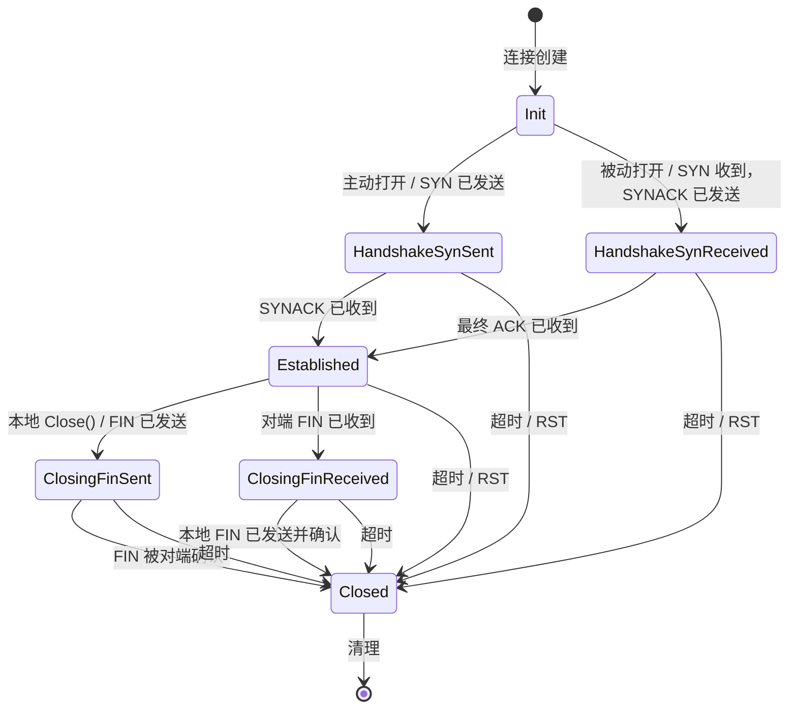
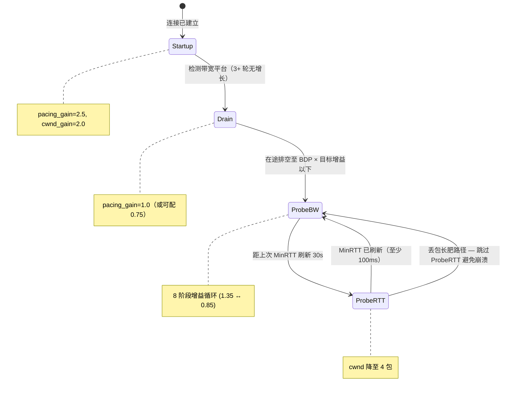
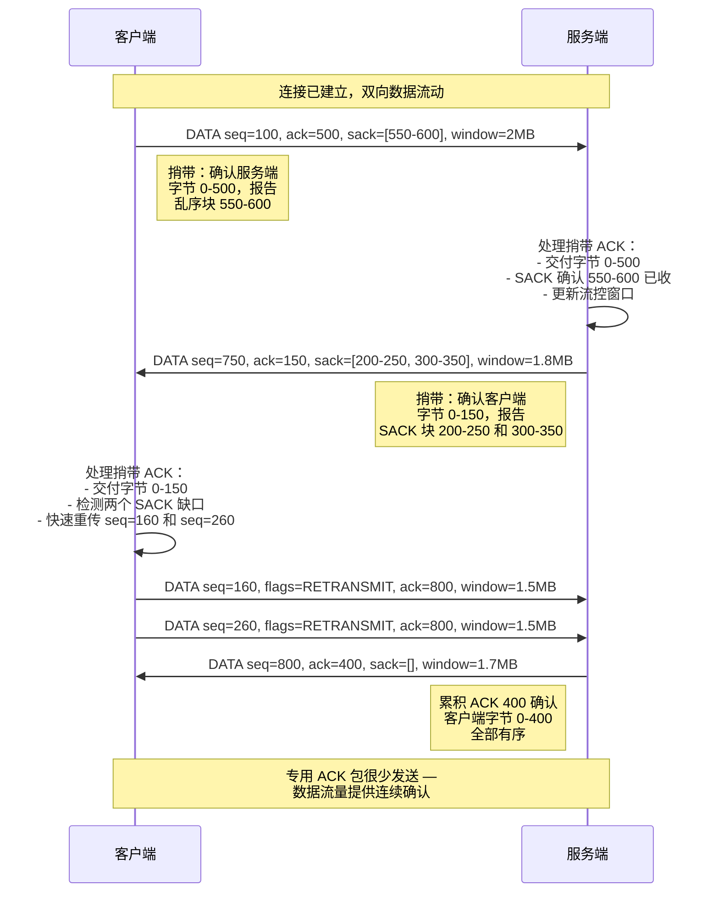
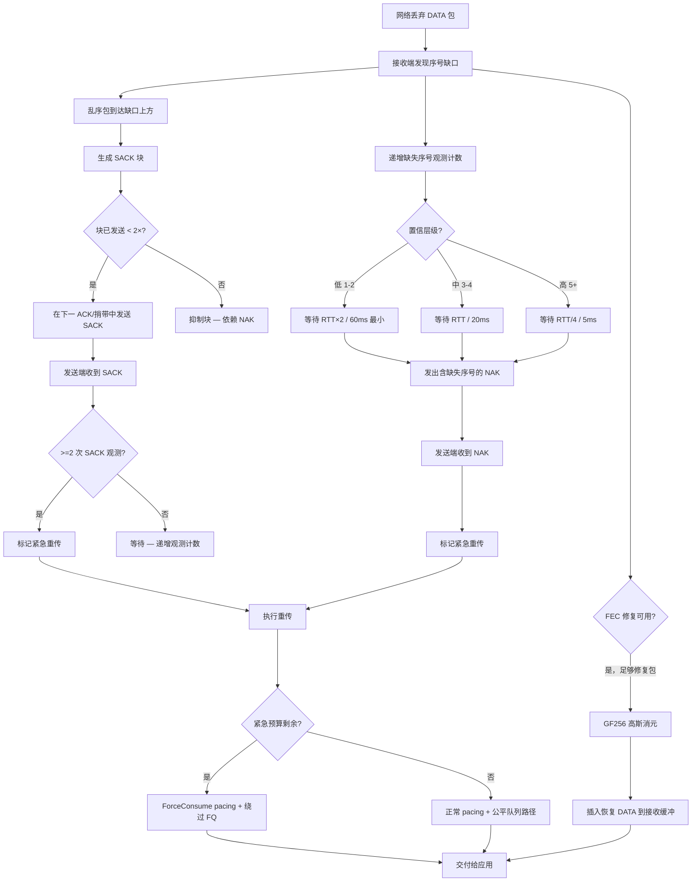
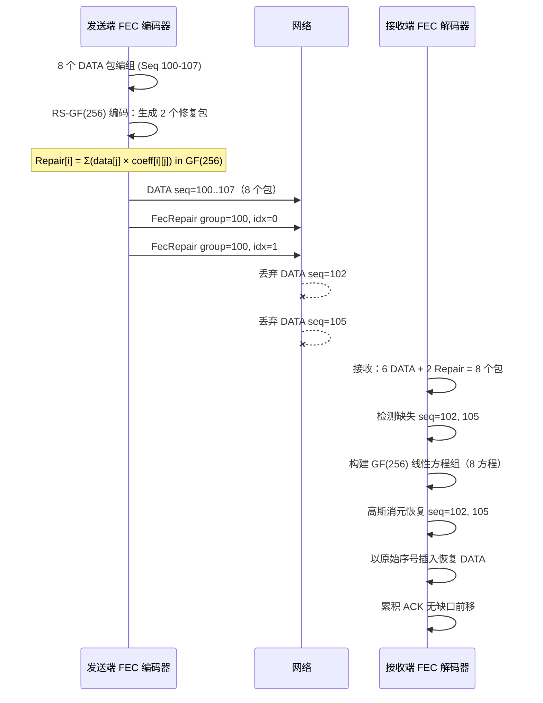
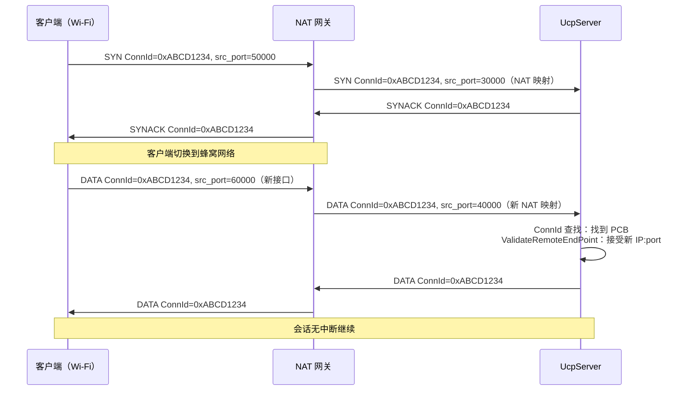
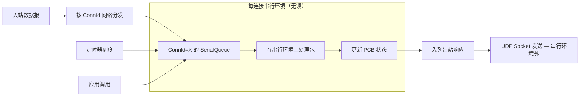

# PPP PRIVATE NETWORK™ X — 通用通信协议 (UCP)

[English](README.md)

**ppp+ucp** — 基于 C# 实现、运行于 UDP 之上的生产级可靠传输协议，借鉴 QUIC 架构并在丢包恢复、确认策略和拥塞控制方面做出根本性不同设计。UCP 重新审视传统传输层中每一个关于丢包、拥塞和确认的经典假设，在从理想数据中心链路到 300ms 卫星跳转（带 10% 随机丢包）的广阔路径范围内交付线速吞吐。

---

## 目录

1. [概述](#概述)
2. [设计哲学](#设计哲学)
3. [协议栈](#协议栈)
4. [关键创新](#关键创新)
5. [架构总览](#架构总览)
6. [协议状态机](#协议状态机)
7. [BBR 拥塞控制](#bbr-拥塞控制)
8. [捎带 ACK 数据流](#捎带-ack-数据流)
9. [丢包检测与恢复](#丢包检测与恢复)
10. [前向纠错](#前向纠错)
11. [连接管理](#连接管理)
12. [服务端架构](#服务端架构)
13. [线程模型](#线程模型)
14. [性能特征](#性能特征)
15. [快速开始](#快速开始)
16. [配置参考](#配置参考)
17. [测试指南](#测试指南)
18. [文档索引](#文档索引)
19. [部署场景](#部署场景)
20. [与 TCP 和 QUIC 的对比](#与-tcp-和-quic-的对比)
21. [许可证](#许可证)

---

## 概述

UCP（通用通信协议）是直接构建于 UDP 之上的面向连接可靠传输协议。它从 QUIC 汲取架构灵感，但在丢包恢复、确认策略和拥塞控制方面做出了根本性不同的设计选择。该协议并非 QUIC 克隆 —— 它是对现代传输协议应当什么形态的全新构想：将丢包视为恢复信号而非自动拥塞信号。

协议标识 `ppp+ucp` 将 UCP 定位为 PPP PRIVATE NETWORK™ X 协议族成员，作为基于 UDP 的通用通信协议运行。UCP 提供有序可靠的字节流交付，同时保持数据报通信的部署灵活性。它专为 TCP 关于网络行为的假设已不再成立的环境而设计：无线链路、蜂窝网络、卫星回传、非对称路由的长距离光纤以及穿越不可预测底层网络的 VPN 隧道。

### UCP 存在的理由

现代网络带来的挑战是 TCP 设计时从未考虑过的。TCP 的基本假设 —— 所有丢包都表示拥塞 —— 在 1980 年代当大多数链路为有线且拥塞事件之外的丢包罕见时是合理的。在当今网络中，来自 Wi-Fi 干扰、蜂窝切换、卫星天气衰减和中间设备缓冲膨胀的随机丢包意味着：将每一个丢弃包都视为拥塞信号会导致可用带宽的巨大浪费。

UCP 通过将丢包分类作为一级协议功能来解决这个问题。协议区分：

- **随机丢包** — 孤立丢包且 RTT 稳定，通常来自物理层干扰。UCP 立即重传但不降速。
- **拥塞丢包** — 聚集丢包伴随 RTT 膨胀，表明瓶颈饱和。UCP 施加温和乘法削减（0.98×）并配合基于 BDP 的下限保护。

这种分离意味着 UCP 可在随机丢包下维持全线速率，同时对真正的瓶颈拥塞做出优雅反应。在带 5% 随机丢包的 100 Mbps 路径上，UCP 通常实现 85-95% 利用率，而 TCP 会崩溃到 30-50%。

---

## 设计哲学

每个经典 TCP 衍生协议都将丢包与拥塞耦合。一个被有漏洞 Wi-Fi 芯片（而非饱和交换机缓冲）导致丢弃的包会减半拥塞窗口。UCP 解耦这两个概念：

- **丢包**触发立即重传（通过 SACK、NAK 或 FEC）。
- **拥塞**是由多信号分类器做出的独立判断，该分类器综合衡量 RTT 膨胀、投递率退化、聚集丢包事件和实时网络路径分类。

此设计基于三个核心原则：

### 1. 随机丢包是恢复信号，而非拥塞信号

UCP 在丢包检测时立即通过多条恢复路径重传缺失数据。然而，只有当多个独立信号 —— RTT 增长、投递率退化、聚集丢包 —— 共同确认瓶颈确实拥塞时，才降低 pacing 速率或拥塞窗口。这意味着 UCP 可通过 1% 随机丢包推进 95% 以上的线速，而 TCP 的 CUBIC 会反复削减其窗口。

### 2. 每个包都携带可靠性信息

UCP 通过 `HasAckNumber` 标志在每种包类型上捎带累积 ACK 号。一个携带用户负载的 DATA 包同时确认所有已收数据、提供乱序范围的 SACK 块、通告当前接收窗口并回显发送方时间戳用于连续 RTT 测量。专用纯 ACK 包存在但在双向流中很少需要 —— 数据流量本身充当确认通道。

### 3. 恢复按置信度分级

UCP 使用三条不同且紧迫性和保守性递增的恢复路径：

- **SACK（最快，发送端驱动）**：由 2 次 SACK 观测触发，配合 `max(3ms, RTT/8)` 乱序保护。随机独立丢包的主要快速恢复机制。
- **NAK（保守，接收端驱动，分级置信度）**：接收端追踪缺口观测计数。低置信度缺口（1-2 次观测）等待 `max(RTT×2, 60ms)`。中置信度（3-4 次观测）等待 `max(RTT, 20ms)`。高置信度（5+ 次观测）仅等待 `max(5ms, RTT/4)`。
- **FEC（零延迟，主动）**：Reed-Solomon GF(256) 修复包可在有足够校验数据时无需额外 RTT 即可恢复。
- **RTO（最后手段）**：所有主动机制失效时，配合 1.2× 退避的重传超时提供最终安全网。

每条路径各司其职，协议绝不为同一缺口同时启动多条恢复路径。

---

## 协议栈

```
应用层               UcpConnection / UcpServer
       │
协议核心             UcpPcb（每连接状态机）
       │
拥塞与 Pacing        BbrCongestionControl + PacingController + UcpRtoEstimator
       │
可靠性引擎           UcpSackGenerator + NAK状态机 + UcpFecCodec
       │
序列化               UcpPacketCodec（大端序线格式）
       │
网络驱动             UcpNetwork / UcpDatagramNetwork
       │
传输层               UDP Socket（IBindableTransport）
```

运行时组织为六层：

1. **应用层** — `UcpConnection`（客户端）和 `UcpServer`（监听器）暴露公开 API。`UcpServer` 拥有公平队列调度器和入站连接接受队列。`UcpConnection` 提供带背压的异步发送/接收、基于事件的数据通知和诊断报告。

2. **协议核心** — `UcpPcb`（协议控制块）拥有整个每连接状态机：带重传追踪的发送缓冲、O(log n) 插入的接收乱序缓冲、ACK/SACK/NAK 处理流水线、重传定时器、BBR 拥塞控制、pacing 控制器、公平队列 credit 记账和可选的 FEC 编解码。所有状态转换通过 `SerialQueue` 串行化。

3. **拥塞、Pacing 与可靠性** — `BbrCongestionControl` 从经循环缓冲滤波的投递率样本计算 pacing 速率和拥塞窗口。`PacingController` 是字节级 token bucket，门控普通发送并支持紧急恢复流量的有界负余额。`UcpRtoEstimator` 提供带 95/99 百分位追踪的平滑 RTT。`UcpSackGenerator` 为乱序到达生成 SACK 块并限制每块 2 次发送。NAK 状态机追踪每序号缺口观测计数并配合分级置信度守卫发出保守 NAK。`UcpFecCodec` 在 GF(256) 上配合自适应冗余编解码 Reed-Solomon 修复包。

4. **序列化** — `UcpPacketCodec` 处理所有包类型（含从 DATA、NAK 和控制包中提取捎带 ACK 字段）的大端序线格式编解码。编解码器在交付到协议层之前验证包完整性。

5. **网络驱动** — `UcpNetwork` 将协议引擎与 socket I/O 解耦。管理基于连接 ID 的数据报多路分解、驱动 `DoEvents()` 用于定时器分发和公平队列轮次，并协调 SerialQueue 串行分发的每连接处理。

6. **传输层** — `UdpSocketTransport` 实现 `IBindableTransport`，提供配合动态端口绑定（port=0 为 OS 分配临时端口）的 UDP 发送/接收。进程内 `NetworkSimulator` 实现同一传输接口配合虚拟逻辑时钟，用于跨不同硬件的确定性可复现测试。

---

## 关键创新

UCP 引入了多项创新机制，在多样化网络条件下共同交付卓越性能：

### 1. 所有包捎带累积 ACK

每个 UCP 包携带 `HasAckNumber` 标志和相关 ACK 字段。线格式增加 4 字节 `AckNumber`、2 字节 `SackCount`、N×8 字节 SACK 块、4 字节 `WindowSize` 和 6 字节 `EchoTimestamp`。对无 SACK 块的典型 DATA 包，1220 字节 MSS 上捎带开销为 16 字节 —— 1.3% 开销即可在几乎所有双向流中消除专用 ACK 包需求。

### 2. QUIC 风格 SACK 配合双观测阈值

SACK 快速重传在缺失序号被观测 2 次后才触发修复，匹配 QUIC 设计。首个缺失序号需要 2 次 SACK 观测且间隔至少 `max(3ms, RTT/8)`。此乱序保护防止将乱序包误判为丢包，同时在 RTT 几分之一内检测到真正丢包。额外缺口在距离首个缺口超过 `SACK_FAST_RETRANSMIT_DISTANCE_THRESHOLD`（32 序号）时可并行修复。每个 SACK 块范围最多通告 2 次以防止 SACK 放大。

### 3. NAK 分级置信度快速恢复

接收端 NAK 配合三级置信度，随证据积累逐步缩短乱序守卫：

| 置信层级 | 观测次数 | 乱序守卫 | 适用场景 |
|---|---|---|---|
| **低** | 1-2 | `max(RTT×2, 60ms)` | 保守初始守卫，防止高抖动路径误报 |
| **中** | 3-4 | `max(RTT, 20ms)` | 证据增多，守卫缩短至约一 RTT |
| **高** | 5+ | `max(5ms, RTT/4)` | 压倒性证据，最小守卫最快发出 NAK |

每序号重复抑制（`NAK_REPEAT_INTERVAL_MICROS`，默认 250ms）防止 NAK 风暴。单个 NAK 包可携带最多 256 个缺失序号。

### 4. BBR 拥塞控制配合 v2 风格丢包分类

BBR 从投递率样本估计瓶颈带宽而非对丢包事件反应。UCP 在 BBRv1 基础上扩展 v2 风格增强：

**丢包分类**：多信号分类器区分随机丢包和拥塞丢包 —— 孤立小丢包（短窗口内 ≤2 次）无 RTT 膨胀归为随机（保持或恢复 pacing/CWND，施加 1.25 恢复增益）；较大丢包聚集（≥3 次）伴 RTT 膨胀（≥1.10× MinRtt）归为拥塞（施加温和 0.98× CWND 乘数配 0.95× 下限）。

**网络路径分类**：并行分类器使用 200ms 滑动窗口评估路径特征：

| 网络类别 | 特征 | BBR 调优 |
|---|---|---|
| `LowLatencyLAN` | RTT < 1ms，零丢包 | 激进初始探测 |
| `MobileUnstable` | 高抖动，可变 RTT | 更宽乱序保护，跳过 ProbeRTT |
| `LossyLongFat` | 高 BDP，持续随机丢包 | 保持 CWND，跳过 ProbeRTT |
| `CongestedBottleneck` | RTT 升高 + 投递率下降 | 启用丢包感知 pacing 削减 |
| `SymmetricVPN` | 稳定 RTT，对称带宽 | 标准 BBR 配合探测循环 |

### 5. GF(256) 上 Reed-Solomon FEC

系统前向纠错在可配组大小（默认 8，最大 64）内编码修复包。发送端将 `FecGroupSize` 个连续 DATA 包编为 FEC 组并生成 `ceil(FecGroupSize × FecRedundancy)` 个修复包。接收端持有至少组大小数量的独立包（data + repair）时恢复成功。解码器在 GF(256) 上通过高斯消元求解，使用预计算 512 项指数和 256 项对数表实现 O(1) 域运算。

自适应 FEC 基于观测丢包率调整有效冗余：<0.5% 最小冗余，0.5-2% 提高 1.25×，2-5% 提高 1.5×，5-10% 最大 2.0×。超 10% 后重传成为主要恢复手段。

### 6. 基于连接 ID 的会话追踪（IP 无关）

每包在公共头中携带 4 字节连接标识。服务端仅按 ConnectionId 索引连接 —— 非 (IP, port) 元组。移动客户端在 Wi-Fi 和蜂窝间漫游或 NAT 重绑定时可维持同一会话无需新手握手。ConnectionId 是 SYN 时通过 `UcpSecureRng` 生成的加密随机 32 位值。

### 7. 每连接随机 ISN

每个连接以加密随机 32 位初始序号开始，防止离线序号攻击，无需每包认证开销。32 位序号空间使用带 2^31 比较窗口的标准无符号比较进行环绕。

### 8. 公平队列服务端调度

服务端连接在可配间隔（默认 10ms）内接收基于 credit 的调度轮次。每轮按轮转顺序在活跃连接间分配 `roundCredit = bandwidthLimit × interval` 字节，防止任何单连接垄断带宽。未用 credit 限制为 `MAX_BUFFERED_FAIR_QUEUE_ROUNDS`（2 轮）。



### 9. 紧急重传配有限 Pacing 债务

恢复触发的重传绕过公平队列 credit 检查和 token-bucket pacing 门控。每次绕过对 pacing 控制器计 `ForceConsume()`，产生负 token 债务。每 RTT 紧急重传预算（`URGENT_RETRANSMIT_BUDGET_PER_RTT`，默认 16 包）限制突发。后续普通发送偿还债务。

### 10. 确定性事件循环驱动

`UcpNetwork.DoEvents()` 确定性地驱动定时器、RTO 检查、pacing 延迟刷新和公平队列 credit 轮次 —— 对可复现测试和仿真至关重要。进程内 `NetworkSimulator` 使用相同事件循环模型配虚拟逻辑时钟。

---

## 架构总览



### UcpPcb 内部状态

**发送端状态：**

| 结构 | 作用 |
|---|---|
| `_sendBuffer` | 按序号排序、等待 ACK 的发送分段，每段记录原始发送时间戳、重传次数和紧急恢复状态 |
| `_flightBytes` | 当前在途 payload 字节数，BBR 用于计算投递率和执行 CWND 在途上限 |
| `_nextSendSequence` | 下一 32 位序号，按 2^32 取模单调递增 |
| `_largestCumulativeAckNumber` | 从任意包类型收到的最新累积 ACK |
| `_sackFastRetransmitNotified` | 去重 SACK 触发的快速重传决策 |
| `_sackSendCount` | 每块范围 SACK 通告计数，限制为 2 次 |
| `_urgentRecoveryPacketsInWindow` | 每 RTT pacing/FQ 绕过恢复限流器 |

**接收端状态：**

| 结构 | 作用 |
|---|---|
| `_recvBuffer` | 按序号排序的乱序入站分段，O(log n) 插入 |
| `_nextExpectedSequence` | 下一有序交付所需序号 |
| `_receiveQueue` | 有序 payload chunk，供应用读取 |
| `_missingSequenceCounts` | 每序号缺口观测计数，用于分级置信度 NAK |
| `_nakConfidenceTier` | 当前 NAK 置信层级：Low/Medium/High |
| `_lastNakIssuedMicros` | 每序号 NAK 重复抑制时间戳 |
| `_fecFragmentMetadata` | FEC 恢复 DATA 包的原始分片元数据 |

---

## 协议状态机

每个 UCP 连接经历严格的状态机，模仿 TCP 生命周期但适配 UDP 无连接底层。握手是两消息交换（SYN → SYNACK）。



---

## BBR 拥塞控制

UCP 实现 BBRv1 拥塞控制引擎并扩展 v2 风格丢包分类和网络路径感知。



### 核心估计量

| 估计量 | 计算 | 作用 |
|---|---|---|
| `BtlBw` | 最近 `BbrWindowRtRounds` RTT 窗口最大投递率 | pacing rate 基准 |
| `MinRtt` | ProbeRTT 区间（30s）内最小 RTT | BDP 分母 |
| `BDP` | `BtlBw × MinRtt` | 目标在途字节 |
| `PacingRate` | `BtlBw × current_pacing_gain` | token bucket 强制发送速率上限 |
| `CWND` | `BDP × cwnd_gain`，配护栏 | 最大在途字节，拥塞事件后下限 0.95× BDP |

---

## 捎带 ACK 数据流

UCP 与传统传输协议最根本的差异是捎带确认模型。每种包类型都携带确认所需字段。



---

## 丢包检测与恢复



---

## 前向纠错

UCP 在 GF(256) 上使用不可约多项式 `x^8 + x^4 + x^3 + x + 1` (0x11B) 实现系统 Reed-Solomon 风格 FEC。



---

## 连接管理

### 基于连接 ID 的会话追踪

4 字节连接标识支持 IP 无关会话追踪：

1. **服务端多路复用** — `UcpServer` 仅按 `ConnectionId` 将入站包映射到 `UcpPcb` 实例。
2. **连接迁移** — 客户端更换 IP 地址或源端口时继续同一会话，`ValidateRemoteEndPoint()` 透明接受新端点。
3. **NAT 重绑定韧性** — NAT 网关在会话中途更换外部端口时，服务端继续向已建立 PCB 交付包。



---

## 线程模型

### SerialQueue 串行执行模型

UCP 使用基于串行执行模型（strand），每个连接通过专用 `SerialQueue` 处理所有协议事件：



**关键属性：**

- **无锁**：PCB 状态不会被多线程并发访问
- **可预测顺序**：包按接收顺序处理；应用调用按序排队
- **无死锁**：串行模型消除多锁设计的锁顺序问题
- **I/O 卸载**：仅 UDP socket 发送/接收在串行环境外执行
- **确定性测试**：`NetworkSimulator` 使用相同串行模型配虚拟逻辑时钟

---

## 性能特征

UCP 目标性能经 54 个测试基准套件验证，覆盖 4 Mbps 到 10 Gbps 跨 12+ 网络损伤场景。

### 基准测试结果矩阵

| 场景 | 目标 Mbps | RTT | 丢包 | 吞吐 Mbps | 重传% | 收敛时间 | CWND |
|---|---|---|---|---|---|---|---|
| NoLoss (LAN) | 100 | 0.5ms | 0% | 95–100 | 0% | <50ms | ~100KB |
| DataCenter | 1000 | 1ms | 0% | 950–1000 | 0% | <100ms | ~1MB |
| Gigabit_Ideal | 1000 | 5ms | 0% | 920–1000 | 0% | <200ms | ~2MB |
| Lossy (1%) | 100 | 10ms | 1% | 90–99 | ~1.2% | <1s | ~400KB |
| Lossy (5%) | 100 | 10ms | 5% | 75–95 | ~6% | <3s | ~300KB |
| Gigabit_Loss1 | 1000 | 5ms | 1% | 880–980 | ~1.1% | <500ms | ~1.5MB |
| LongFatPipe | 100 | 100ms | 0% | 85–99 | 0% | <5s | ~5MB |
| 100M_Loss3 | 100 | 15ms | 3% | 78–95 | ~3.5% | <3s | ~400KB |
| Satellite | 10 | 300ms | 0% | 8.5–9.9 | 0% | <30s | ~1.5MB |
| Mobile3G | 2 | 150ms | 1% | 1.7–1.95 | ~1.5% | <20s | ~150KB |
| Mobile4G | 20 | 50ms | 1% | 18–19.8 | ~1.2% | <5s | ~500KB |
| Benchmark10G | 10000 | 1ms | 0% | 9200–10000 | 0% | <200ms | ~5MB |

---

## 快速开始

### 前置条件

- .NET 8.0 SDK 或更高版本
- 支持 `System.Net.Sockets.UdpClient` 的任意平台（Windows、Linux、macOS）

### 安装

```powershell
git clone https://github.com/your-org/ucp.git
cd ucp
dotnet build ucp.sln
```

### 基础服务端和客户端

```csharp
using System.Net;
using System.Text;
using Ucp;

var config = UcpConfiguration.GetOptimizedConfig();
config.ServerBandwidthBytesPerSecond = 100_000_000 / 8; // 100 Mbps

// --- 服务端 ---
using var server = new UcpServer(config);
server.Start(9000);
Task<UcpConnection> acceptTask = server.AcceptAsync();

// --- 客户端 ---
using var client = new UcpConnection(config);
await client.ConnectAsync(new IPEndPoint(IPAddress.Loopback, 9000));
UcpConnection serverConn = await acceptTask;

// 双向可靠传输
byte[] clientData = Encoding.UTF8.GetBytes("你好，来自客户端！");
await client.WriteAsync(clientData, 0, clientData.Length);

byte[] serverData = Encoding.UTF8.GetBytes("你好，来自服务端！");
await serverConn.WriteAsync(serverData, 0, serverData.Length);

// 双向读取
byte[] buf = new byte[1024];
int n = await serverConn.ReadAsync(buf, 0, buf.Length);
Console.WriteLine($"服务端收到: {Encoding.UTF8.GetString(buf, 0, n)}");

n = await client.ReadAsync(buf, 0, buf.Length);
Console.WriteLine($"客户端收到: {Encoding.UTF8.GetString(buf, 0, n)}");

await client.CloseAsync();
await serverConn.CloseAsync();
```

### 高带宽配置

```csharp
var config = UcpConfiguration.GetOptimizedConfig();
config.Mss = 9000;
config.InitialBandwidthBytesPerSecond = 1_000_000_000 / 8; // 1 Gbps
config.MaxPacingRateBytesPerSecond = 0; // 关闭上限
config.StartupPacingGain = 2.0;
config.InitialCwndPackets = 200;
```

### 丢包路径配置

```csharp
var config = UcpConfiguration.GetOptimizedConfig();
config.FecRedundancy = 0.25;
config.FecGroupSize = 8;
config.LossControlEnable = true;
config.MaxBandwidthLossPercent = 20;
```

### 传输诊断

```csharp
UcpTransferReport report = connection.GetReport();
Console.WriteLine($"吞吐: {report.ThroughputMbps} Mbps");
Console.WriteLine($"RTT: {report.AverageRttMs} ms");
Console.WriteLine($"重传率: {report.RetransmissionRatio:P}");
Console.WriteLine($"CWND: {report.CwndBytes} 字节");
```

---

## 配置参考

所有调优参数位于 `UcpConfiguration`。调用 `UcpConfiguration.GetOptimizedConfig()` 获取经基准矩阵校准的合理默认值。

### 协议调优

| 参数 | 默认 | 说明 |
|---|---|---|
| `Mss` | 1220 | 最大分段大小。高带宽使用 9000 |
| `MaxRetransmissions` | 10 | 每分段最大重传次数 |
| `SendBufferSize` | 32MB | 发送缓冲容量，满时阻塞提供背压 |
| `InitialCwndPackets` | 20 | 初始拥塞窗口包数 |
| `MaxCongestionWindowBytes` | 64MB | BBR 拥塞窗口硬上限 |
| `SendQuantumBytes` | `Mss` | pacing token 消费粒度 |
| `AckSackBlockLimit` | 149 | 每 ACK 最大 SACK 块数 |

### RTO 与定时器

| 参数 | 默认 | 说明 |
|---|---|---|
| `MinRtoMicros` | 200,000µs | 最小重传超时 |
| `MaxRtoMicros` | 15,000,000µs | 最大重传超时 |
| `RetransmitBackoffFactor` | 1.2 | 每连续超时 RTO 退避乘数 |
| `ProbeRttIntervalMicros` | 30,000,000µs | BBR ProbeRTT 间隔 |
| `KeepAliveIntervalMicros` | 1,000,000µs | 空闲保活间隔 |
| `DisconnectTimeoutMicros` | 4,000,000µs | 空闲断连超时 |
| `DelayedAckTimeoutMicros` | 2,000µs | 延迟 ACK 聚合，设为 0 禁用 |

### BBR 增益

| 参数 | 默认 | 说明 |
|---|---|---|
| `StartupPacingGain` | 2.0 | BBR Startup pacing 乘数 |
| `StartupCwndGain` | 2.0 | BBR Startup CWND 乘数 |
| `DrainPacingGain` | 0.75 | BBR Drain pacing 增益 |
| `ProbeBwHighGain` | 1.25 | ProbeBW 上探增益 |
| `ProbeBwLowGain` | 0.85 | ProbeBW 下探增益 |
| `ProbeBwCwndGain` | 2.0 | ProbeBW CWND 增益 |
| `BbrWindowRtRounds` | 10 | BBR 带宽滤波窗口 RTT 轮数 |

### FEC

| 参数 | 默认 | 说明 |
|---|---|---|
| `FecRedundancy` | 0.0 | `0.125` = 每 8 包 1 修复；`0` = 禁用 |
| `FecGroupSize` | 8 | 每 FEC 组 DATA 包数 |
| `FecAdaptiveEnable` | `true` | 启用基于观测丢包率的自适应 FEC |

---

## 测试指南

```powershell
# 构建
dotnet build ".\Ucp.Tests\UcpTest.csproj"

# 运行所有测试
dotnet test ".\Ucp.Tests\UcpTest.csproj" --no-build

# 运行特定测试
dotnet test ".\Ucp.Tests\UcpTest.csproj" --no-build --filter "FullyQualifiedName~NoLoss_Utilization"
```

### 测试分类

| 类别 | 测试内容 | 验证目标 |
|---|---|---|
| **核心协议** | 序号环绕、编解码往返、RTO 估计器、pacing token 算术 | 基础正确性 |
| **可靠性** | 丢包传输、突发丢包、SACK 快重传、NAK 生成、FEC 恢复 | 所有丢包模式恢复 |
| **流完整性** | 乱序、重复、部分读取、全双工、精确字节读取 | 有序交付保证 |
| **性能** | 14+ 网络场景 4Mbps-10Gbps | 吞吐、收敛、恢复指标 |
| **报告** | 利用率上限、丢包/重传独立、路由不对称 | 可审计物理可行 |

---

## 部署场景

| 场景 | UCP 适用原因 |
|---|---|
| **VPN 隧道** | 丢包长距离路径高吞吐，非对称路由下 BBR 维持吞吐 |
| **实时多人游戏** | FEC 低延迟恢复，连接 ID 追踪幸存 Wi-Fi 到蜂窝切换 |
| **卫星回传** | 长 RTT 路径配合中度随机丢包，BBR 跳过 ProbeRTT |
| **IoT 传感器网络** | 轻量线格式，随机 ISN 安全，IP 无关连接幸存 DHCP 重编号 |
| **金融数据分发** | 有序可靠交付配亚 RTT 丢包恢复，捎带 ACK 消除控制包开销 |
| **内容分发** | 公平队列防止单客户端饿死其他，自适应 FEC 减少重传开销 |
| **分布式数据库** | 低延迟可靠复制，连接迁移支持故障切换 |

---

## 与 TCP 和 QUIC 的对比

| 特性 | TCP | QUIC | UCP (ppp+ucp) |
|---|---|---|---|
| **传输** | IP | UDP | UDP |
| **丢包解释** | 所有丢包=拥塞 | 改进但仍耦合 | 丢包先分类再调速 |
| **拥塞控制** | CUBIC/Reno | CUBIC/BBR 选项 | BBRv2 配合丢包分类 |
| **ACK 模型** | 仅累积 | 基于 SACK | 在 ALL 包上捎带 |
| **恢复路径** | DupACK + RTO | SACK + RTO | SACK + NAK + FEC + RTO |
| **FEC** | 无 | 无 | Reed-Solomon GF(256) |
| **连接迁移** | 否（IP:port 绑定） | 可选 Connection ID | 默认 Connection-ID 模型 |
| **服务端调度** | OS 调度 | 流优先级 | 公平队列 credit 调度 |
| **线程安全** | 内核锁 | 基于流 | 每连接 SerialQueue 串行 |
| **握手** | 3 次 + TLS | 1-RTT（可选 0-RTT） | 2 消息（SYN→SYNACK） |
| **实现语言** | C（内核） | C/C++/Rust/Go | C# (.NET 8+) |
| **多路复用** | 基于端口 | 基于流 | 基于连接 ID |

---

## 文档索引

| 文档 | 语言 | 说明 |
|---|---|---|
| [README.md](README.md) | English | 项目总览、快速开始、功能矩阵 |
| [README_CN.md](README_CN.md) | 中文 | 项目总览中文版 |
| [docs/index.md](docs/index.md) | English | 文档索引与维护地图 |
| [docs/index_CN.md](docs/index_CN.md) | 中文 | 文档索引中文版 |
| [docs/architecture.md](docs/architecture.md) | English | 运行时架构深度解析 |
| [docs/architecture_CN.md](docs/architecture_CN.md) | 中文 | 架构深度解析中文版 |
| [docs/protocol.md](docs/protocol.md) | English | 协议规范与线格式 |
| [docs/protocol_CN.md](docs/protocol_CN.md) | 中文 | 协议规范中文版 |
| [docs/api.md](docs/api.md) | English | 公开 API 参考 |
| [docs/api_CN.md](docs/api_CN.md) | 中文 | API 参考中文版 |
| [docs/performance.md](docs/performance.md) | English | 性能基准与调优 |
| [docs/performance_CN.md](docs/performance_CN.md) | 中文 | 性能指南中文版 |
| [docs/constants.md](docs/constants.md) | English | 常量与调优参考 |
| [docs/constants_CN.md](docs/constants_CN.md) | 中文 | 常量参考中文版 |

---

## 许可证

MIT。详见 [LICENSE](LICENSE) 全文。
