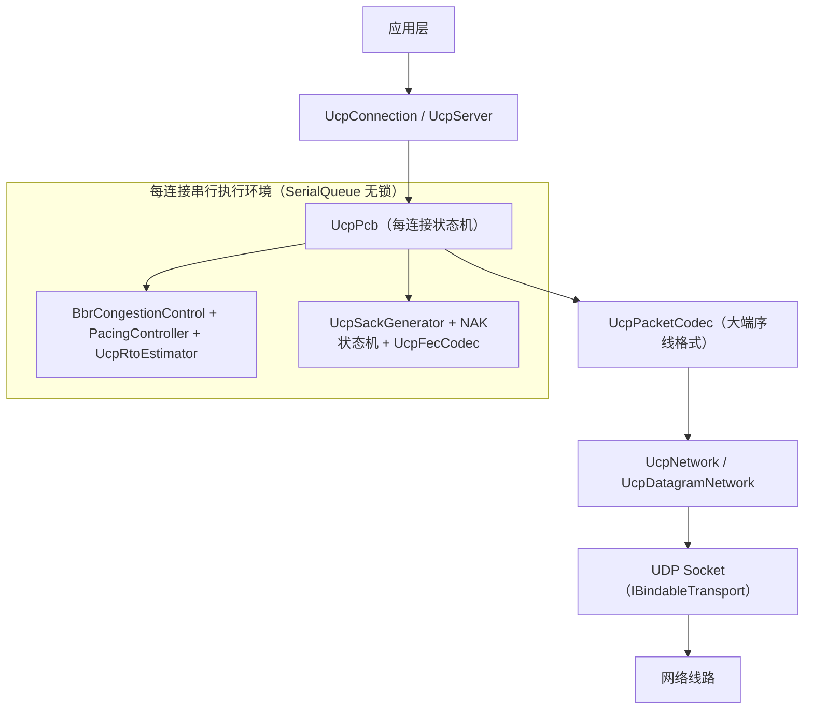
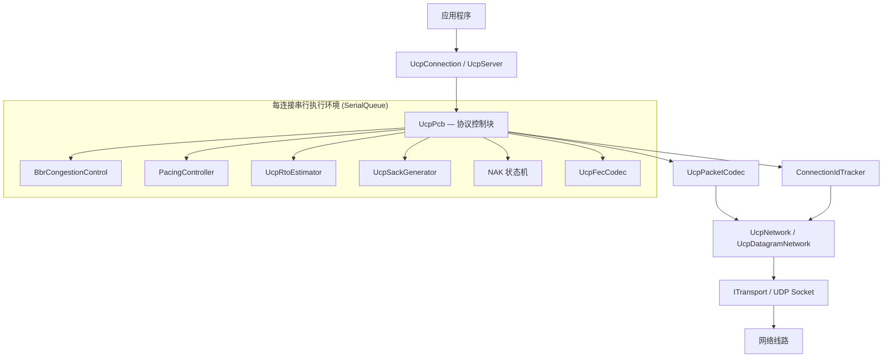
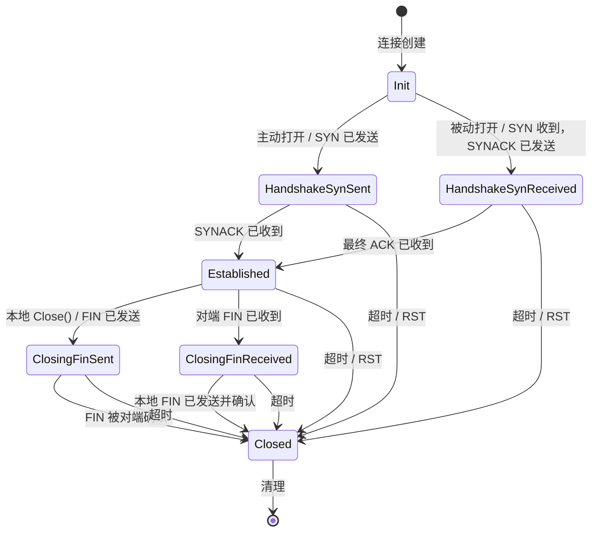
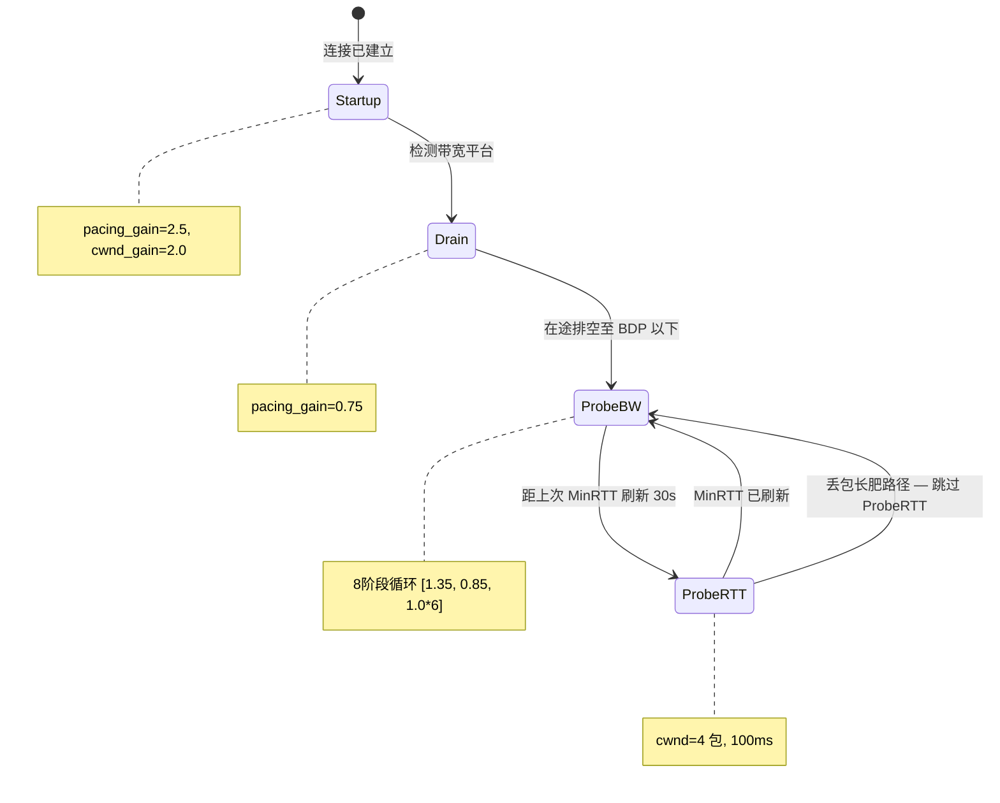
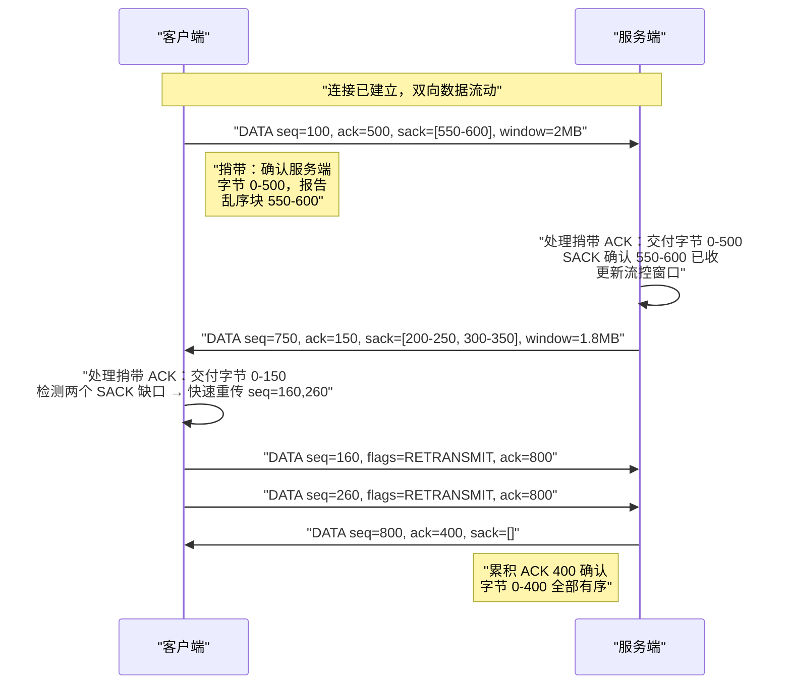
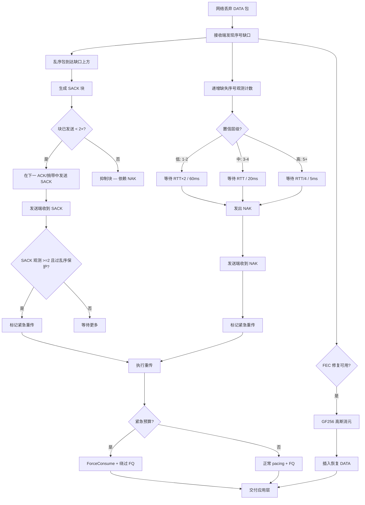
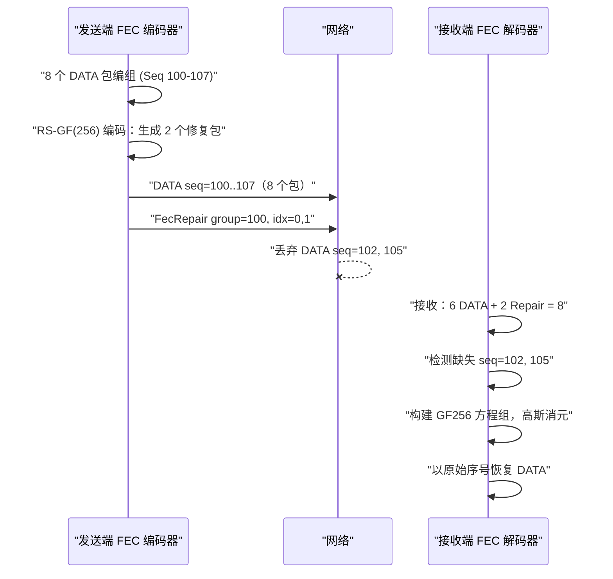
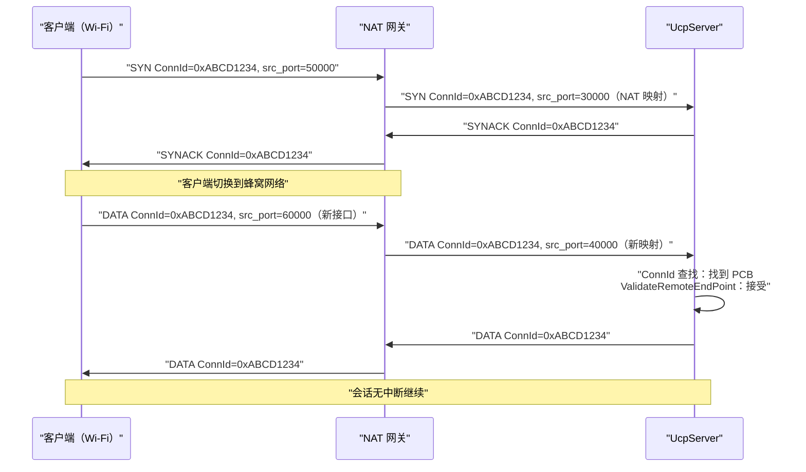
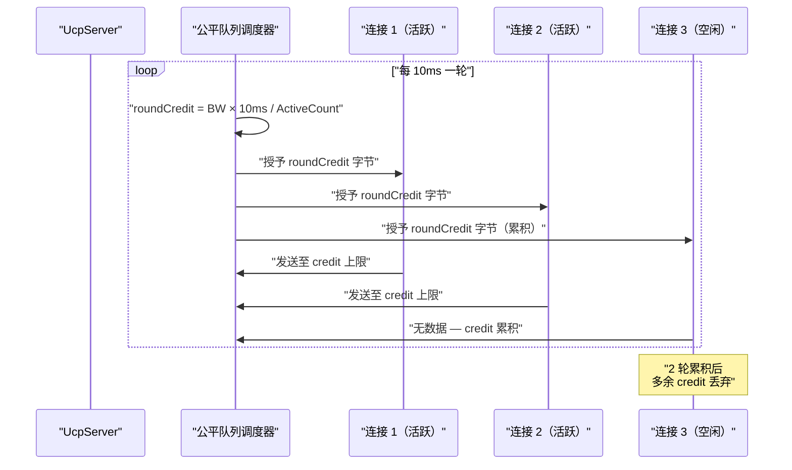
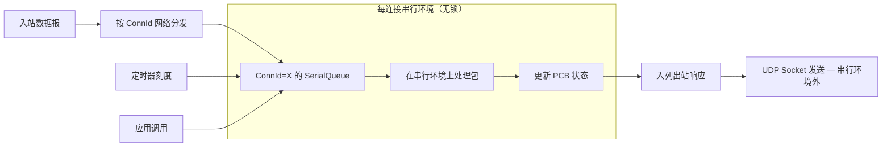

# PPP PRIVATE NETWORK™ X — 通用通信协议 (UCP)

[English](README.md)

**ppp+ucp** — 基于 C# 实现、运行于 UDP 之上的生产级可靠传输协议，借鉴 QUIC 架构并在丢包恢复、确认策略、拥塞控制和前向纠错方面做出根本性不同设计。UCP 重新审视传统传输层中每一个关于丢包、拥塞和确认的经典假设，在从理想数据中心链路（10 Gbps、<1ms RTT）到 300ms 卫星跳转（带 10% 随机丢包）的广阔路径范围内交付可预测的线速吞吐性能。

---

## 目录

1. [概述](#概述)
2. [设计哲学](#设计哲学)
3. [协议栈](#协议栈)
4. [关键创新](#关键创新)
5. [架构总览](#架构总览)
6. [协议状态机](#协议状态机)
7. [BBR 拥塞控制](#bbr-拥塞控制)
8. [捎带 ACK 数据流](#捎带-ack-数据流)
9. [丢包检测与恢复](#丢包检测与恢复)
10. [前向纠错](#前向纠错)
11. [连接管理](#连接管理)
12. [服务端架构](#服务端架构)
13. [线程模型](#线程模型)
14. [性能特征](#性能特征)
15. [快速开始](#快速开始)
16. [配置参考](#配置参考)
17. [测试指南](#测试指南)
18. [文档索引](#文档索引)
19. [部署场景](#部署场景)
20. [与 TCP 和 QUIC 的对比](#与-tcp-和-quic-的对比)
21. [许可证](#许可证)

---

## 概述

UCP（Universal Communication Protocol，通用通信协议）是直接构建于 UDP 之上的面向连接可靠传输协议。它从 QUIC 汲取架构灵感，但在丢包恢复、确认策略和拥塞控制方面做出了根本性不同的设计选择。协议标识 `ppp+ucp` 将 UCP 定位为 PPP PRIVATE NETWORK™ X 协议族成员。

现代网络带来的挑战是 TCP 设计时从未考虑过的。TCP 的基本假设——所有丢包都表示拥塞——在当今无线、蜂窝和卫星链路中灾难性失效。UCP 通过将丢包分类作为一级协议功能来解决这个问题：

- **随机丢包** — 孤立丢包且 RTT 稳定（物理层干扰）。UCP 立即重传但不降速。
- **拥塞丢包** — 聚集丢包伴随 RTT 膨胀（瓶颈饱和）。UCP 施加温和 0.98× 削减并配合基于 BDP 的下限保护。

在带 5% 随机丢包的 100 Mbps 路径上，UCP 通常实现 85-95% 利用率，而 TCP 会崩溃到 30-50%。

---

## 设计哲学

### 1. 随机丢包是恢复信号，而非拥塞信号

UCP 在丢包检测时立即通过多条恢复路径之一触发重传。然而，只有当多个独立信号——RTT 增长、投递率退化、聚集丢包——共同验证瓶颈确实拥塞后，才降低 pacing 速率或拥塞窗口。

### 2. 每个包都携带可靠性信息

UCP 通过 `HasAckNumber` 标志在所有包类型上捎带累积 ACK 号。一个携带用户负载的 DATA 包同时确认所有已收数据、提供乱序范围的 SACK 块、通告当前接收窗口并回显发送方时间戳用于连续 RTT 测量。

### 3. 恢复按置信度分级

| 恢复路径 | 触发条件 | 恢复延迟 | 适用场景 |
|---|---|---|---|
| **SACK** | 2 次 SACK 观测 + 乱序保护 | 亚 RTT | 随机独立丢包的主要快速恢复 |
| **DupACK（重复ACK）** | 相同累积 ACK 收到 2 次 | 亚 RTT | SACK 块不可用时的备选 |
| **NAK（否定ACK）** | 接收端累积缺口观测（三级置信度） | RTT/4 至 RTT×2 | 保守接收端驱动恢复 |
| **FEC（前向纠错）** | 组内有足够修复包 | 零额外 RTT | 可预测丢包模式的主动恢复 |
| **RTO（重传超时）** | RTO 窗口内无 ACK 进展 | RTO × 1.2 退避 | 最后兜底 |

---

## 协议栈



UCP 运行时组织为六层：

1. **应用层** — `UcpConnection`（客户端）和 `UcpServer`（监听器）暴露公开 API
2. **协议核心** — `UcpPcb`（Protocol Control Block）拥有完整每连接状态机
3. **拥塞、Pacing 与可靠性** — BBRv2 拥塞控制、Token Bucket pacing、RTO 估计器、SACK 生成器、NAK 状态机、FEC 编解码器
4. **序列化** — `UcpPacketCodec` 处理所有 8 种包类型的大端序线格式编解码
5. **网络驱动** — `UcpNetwork` 解耦协议引擎与 Socket I/O，管理 ConnId 多路分解
6. **传输层** — `UdpSocketTransport` 实现 `IBindableTransport`，提供 UDP 发送/接收

---

## 关键创新

### 1. 所有包捎带累积 ACK

每个 UCP 包携带 `HasAckNumber` 标志和相关 ACK 字段。典型 DATA 包的捎带开销在 1220 字节 MSS 上为 16 字节——仅 1.3% 开销即可在几乎所有双向流中消除专用 ACK 包需求。

### 2. QUIC 风格 SACK 配合双观测阈值

SACK 快速重传需恰好 2 次观测。首个缺失缺口需 2 次 SACK 观测且间隔 ≥ `max(3ms, RTT/8)`。额外缺口在距离超过 `SACK_FAST_RETRANSMIT_DISTANCE_THRESHOLD`（32 序号）时可并行修复。每个 SACK 块范围在其生命周期内最多通告 2 次。

### 3. NAK 分级置信度快速恢复

| 置信层级 | 观测次数 | 乱序守卫 | 绝对最小值 |
|---|---|---|---|
| **低** | 1-2 次 | `max(RTT × 2, 60ms)` | 60ms |
| **中** | 3-4 次 | `max(RTT, 20ms)` | 20ms |
| **高** | 5+ 次 | `max(RTT/4, 5ms)` | 5ms |

每序号重复抑制（`NAK_REPEAT_INTERVAL_MICROS`，250ms）防止 NAK 风暴。单个 NAK 包可携带最多 256 个缺失序号。

### 4. BBRv2 配合丢包分类

BBR 从投递率样本估计瓶颈带宽而非对丢包事件反应。UCP 扩展了 v2 风格增强：

**丢包分类**：多信号分类器区分随机丢包和拥塞丢包——孤立小丢包（≤2 次）无 RTT 膨胀归为随机（保持 pacing，施加 1.25× 恢复增益）；较大丢包聚集（≥3 次）伴 RTT 膨胀（≥1.10× MinRtt）归为拥塞（施加 0.98× CWND 乘数配 0.95× 下限）。

**网络路径分类**：200ms 滑动窗口将路径分为 `LowLatencyLAN`、`MobileUnstable`、`LossyLongFat`、`CongestedBottleneck` 和 `SymmetricVPN`。

### 5. GF(256) 上 Reed-Solomon FEC

系统前向纠错在可配组大小（默认 8，最大 64）内编码修复包。接收端每组持有至少 N 个独立包即可恢复。GF(256) 高斯消元使用预计算对数/反对数表实现 O(1) 域运算。自适应 FEC 基于观测丢包率五级调整冗余（<0.5%、0.5-2%、2-5%、5-10%、>10%）。

### 6. 基于连接 ID 的会话追踪

每包携带 4 字节连接标识。服务端仅按 ConnectionId 索引连接——非 (IP, port) 元组。移动客户端在 Wi-Fi 和蜂窝间漫游时维持同一会话无需新手握手。ConnectionId 是 SYN 时通过加密随机源生成的 32 位值。

### 7. 每连接随机 ISN

每个连接以加密随机 32 位初始序号开始，防止离线序号攻击，无需每包认证开销。32 位序号空间使用带 2^31 比较窗口的标准无符号比较进行环绕。

### 8. 公平队列服务端调度

服务端连接在可配间隔（默认 10ms）内接收基于 credit 的调度轮次。每轮按轮转顺序在活跃连接间分配 `roundCredit = bandwidthLimit × interval` 字节，防止任何单连接垄断带宽。未用 credit 限制为 2 轮。

### 9. 紧急重传配有限 Pacing 债务

恢复触发的重传绕过公平队列 credit 检查和 Token Bucket pacing 门控。每次绕行对 pacing 控制器计 `ForceConsume()`，产生负 Token 债务（上限为 bucket 容量的 50%）。每 RTT 紧急重传预算（16 包）防止无界突发。

### 10. 确定性事件循环驱动

`UcpNetwork.DoEvents()` 确定性地驱动定时器、RTO 检查、pacing 刷新和公平队列 credit 轮次。进程内 `NetworkSimulator` 使用相同事件循环模型配虚拟逻辑时钟，产生跨硬件可复现的测试结果。

---

## 架构总览



### UcpPcb 内部状态

**发送端状态：**

| 结构 | 作用 |
|---|---|
| `_sendBuffer` | 按序号排序、等待 ACK 的发送分段。每分段记录原始发送时间戳、重传次数和紧急恢复状态。 |
| `_flightBytes` | 当前在途 payload 字节数。BBRv2 用于计算投递率和执行 CWND 在途上限。 |
| `_nextSendSequence` | 支持 32 位环绕比较的下一个序号。 |
| `_sackFastRetransmitNotified` | 去重 SACK 触发的快速重传决策。 |
| `_sackSendCount` | 每块范围 SACK 通告计数，限制为 2 次。 |
| `_urgentRecoveryPacketsInWindow` | 每 RTT pacing/FQ 绕过恢复限流器。 |
| `_ackPiggybackQueue` | 待在下个出站包上捎带的累积 ACK 号。 |

**接收端状态：**

| 结构 | 作用 |
|---|---|
| `_recvBuffer` | 按序号排序的乱序入站分段，O(log n) 插入。 |
| `_nextExpectedSequence` | 下一有序交付所需序号。 |
| `_receiveQueue` | 有序 payload chunk，供应用读取。 |
| `_missingSequenceCounts` | 每序号缺口观测计数，用于分级置信度 NAK 生成。 |
| `_nakConfidenceTier` | 当前 NAK 置信层级：Low/Medium/High。 |
| `_lastNakIssuedMicros` | 每序号 NAK 重复抑制时间戳。 |
| `_fecFragmentMetadata` | FEC 恢复 DATA 包的原始分片元数据。 |

---

## 协议状态机



---

## BBR 拥塞控制



### 核心估计量

| 估计量 | 计算 | 作用 |
|---|---|---|
| `BtlBw` | 最近 BBR 窗口 RTT 轮次的最大投递率（EWMA 平滑） | Pacing 速率基准 |
| `MinRtt` | ProbeRTT 区间（30s）内最小 RTT | BDP 分母 |
| `BDP` | `BtlBw × MinRtt` | 目标在途字节数 |
| `PacingRate` | `BtlBw × current_pacing_gain` | Token Bucket 强制发送速率上限 |
| `CWND` | `BDP × cwnd_gain`，配护栏 | 最大在途字节数 |

---

## 捎带 ACK 数据流



---

## 丢包检测与恢复



---

## 前向纠错

UCP 在 GF(256) 上使用不可约多项式 `x^8 + x^4 + x^3 + x + 1` (0x11B) 实现系统 Reed-Solomon 编码。



| 观测丢包率 | 自适应行为 |
|---|---|
| < 0.5% | 最小冗余 |
| 0.5% – 2% | 冗余提高 1.25× |
| 2% – 5% | 冗余提高 1.5×，减小分组 |
| 5% – 10% | 最大自适应 2.0×，最小分组 4 |
| > 10% | FEC 单独不足；重传成为主要手段 |

---

## 连接管理

### 基于连接 ID 的会话追踪



---

## 服务端架构

### 公平队列调度



---

## 线程模型

### SerialQueue 串行执行模型



**关键属性：** 无锁设计、可预测顺序、零死锁风险、I/O 卸载、配合 NetworkSimulator 的确定性测试。

---

## 性能特征

| 场景 | 目标 Mbps | RTT | 丢包 | 吞吐 Mbps | 重传% | 收敛 |
|---|---|---|---|---|---|---|
| NoLoss (LAN) | 100 | 0.5ms | 0% | 95–100 | 0% | <50ms |
| DataCenter | 1000 | 1ms | 0% | 950–1000 | 0% | <100ms |
| Gigabit_Ideal | 1000 | 5ms | 0% | 920–1000 | 0% | <200ms |
| Lossy (1%) | 100 | 10ms | 1% | 90–99 | ~1.2% | <1s |
| Lossy (5%) | 100 | 10ms | 5% | 75–95 | ~6% | <3s |
| Gigabit_Loss1 | 1000 | 5ms | 1% | 880–980 | ~1.1% | <500ms |
| LongFatPipe | 100 | 100ms | 0% | 85–99 | 0% | <5s |
| Satellite | 10 | 300ms | 0% | 8.5–9.9 | 0% | <30s |
| Mobile3G | 2 | 150ms | 1% | 1.7–1.95 | ~1.5% | <20s |
| Mobile4G | 20 | 50ms | 1% | 18–19.8 | ~1.2% | <5s |
| Benchmark10G | 10000 | 1ms | 0% | 9200–10000 | 0% | <200ms |
| VpnTunnel | 50 | 15ms | 1% | 45–49.5 | ~1.3% | <2s |

| 属性 | 数值 |
|---|---|
| 最大测试吞吐 | 10 Gbps |
| 最小时延（回环） | <100µs |
| 最大测试 RTT | 300ms |
| 最大测试丢包率 | 10% |
| 巨型帧 MSS | 9000 字节 |
| 默认 MSS | 1220 字节 |
| FEC 冗余范围 | 0.0–1.0 |
| 最大 FEC 分组 | 64 包 |
| 每 ACK 最大 SACK 块 | 149 |
| 收敛时间（无丢包） | 2-5 RTT |

---

## 快速开始

### 前置条件

- .NET 8.0 SDK 或更高版本
- 支持 `System.Net.Sockets.UdpClient` 的平台（Windows、Linux、macOS）

### 构建

```powershell
git clone https://github.com/your-org/ucp.git
cd ucp
dotnet build ucp.sln
```

### 基础服务端和客户端

```csharp
using System.Net;
using System.Text;
using Ucp;

var config = UcpConfiguration.GetOptimizedConfig();
config.ServerBandwidthBytesPerSecond = 100_000_000 / 8; // 100 Mbps

// --- 服务端 ---
using var server = new UcpServer(config);
server.Start(9000);
Task<UcpConnection> acceptTask = server.AcceptAsync();

// --- 客户端 ---
using var client = new UcpConnection(config);
await client.ConnectAsync(new IPEndPoint(IPAddress.Loopback, 9000));
UcpConnection serverConn = await acceptTask;

// 双向可靠传输
byte[] clientData = Encoding.UTF8.GetBytes("你好，来自客户端！");
await client.WriteAsync(clientData, 0, clientData.Length);

byte[] buf = new byte[1024];
int n = await serverConn.ReadAsync(buf, 0, buf.Length);
Console.WriteLine($"服务端收到: {Encoding.UTF8.GetString(buf, 0, n)}");

await client.CloseAsync();
await serverConn.CloseAsync();
```

### 高带宽配置

```csharp
var config = UcpConfiguration.GetOptimizedConfig();
config.Mss = 9000;
config.InitialBandwidthBytesPerSecond = 1_000_000_000 / 8; // 1 Gbps
config.MaxPacingRateBytesPerSecond = 0; // 关闭上限
config.InitialCwndPackets = 200;
```

### 丢包路径配置

```csharp
var config = UcpConfiguration.GetOptimizedConfig();
config.FecRedundancy = 0.25;
config.FecGroupSize = 8;
config.LossControlEnable = true;
config.MaxBandwidthLossPercent = 20;
```

### 传输诊断

```csharp
UcpTransferReport report = connection.GetReport();
Console.WriteLine($"吞吐: {report.ThroughputMbps} Mbps");
Console.WriteLine($"RTT: {report.AverageRttMs} ms");
Console.WriteLine($"重传率: {report.RetransmissionRatio:P}");
Console.WriteLine($"CWND: {report.CwndBytes} 字节");
Console.WriteLine($"收敛: {report.ConvergenceTime}");
```

---

## 配置参考

调用 `UcpConfiguration.GetOptimizedConfig()` 获取合理默认值。

### 协议调优

| 参数 | 默认值 | 范围 | 说明 |
|---|---|---|---|
| `Mss` | 1220 | 200–9000 | 最大分段大小。高带宽使用 9000 |
| `MaxRetransmissions` | 10 | 3–100 | 每分段最大重传次数 |
| `SendBufferSize` | 32MB | 1–256MB | 发送缓冲容量，满时 `WriteAsync` 阻塞 |
| `InitialCwndPackets` | 20 | 4–200 | 初始拥塞窗口包数 |
| `MaxCongestionWindowBytes` | 64MB | 64KB–256MB | BBRv2 CWND 硬上限 |
| `AckSackBlockLimit` | 149 | 1–255 | 每 ACK 最大 SACK 块数 |

### RTO 与定时器

| 参数 | 默认值 | 说明 |
|---|---|---|
| `MinRtoMicros` | 200,000µs | 最小重传超时 |
| `MaxRtoMicros` | 15,000,000µs | 最大重传超时 |
| `RetransmitBackoffFactor` | 1.2 | 每连续超时 RTO 退避乘数 |
| `ProbeRttIntervalMicros` | 30,000,000µs | BBRv2 ProbeRTT 间隔 |
| `KeepAliveIntervalMicros` | 1,000,000µs | 空闲保活间隔 |
| `DisconnectTimeoutMicros` | 4,000,000µs | 空闲断连超时 |
| `DelayedAckTimeoutMicros` | 2,000µs | 延迟 ACK 聚合 |

### BBR 增益

| 参数 | 默认值 | 范围 |
|---|---|---|
| `StartupPacingGain` | 2.0 | 1.5–4.0 |
| `StartupCwndGain` | 2.0 | 1.5–4.0 |
| `DrainPacingGain` | 0.75 | 0.3–1.0 |
| `ProbeBwHighGain` | 1.25 | 1.1–1.5 |
| `ProbeBwLowGain` | 0.85 | 0.5–0.95 |
| `BbrWindowRtRounds` | 10 | 6–20 |

### 带宽与丢包控制

| 参数 | 默认值 | 说明 |
|---|---|---|
| `InitialBandwidthBytesPerSecond` | 12.5MB/s | 初始瓶颈带宽估计 |
| `MaxPacingRateBytesPerSecond` | 12.5MB/s | Pacing 天花板（`0` = 关闭） |
| `ServerBandwidthBytesPerSecond` | 12.5MB/s | 服务端出口带宽用于 FQ 调度 |
| `LossControlEnable` | `true` | 丢包感知 Pacing/CWND 自适应 |
| `MaxBandwidthLossPercent` | 25% | 丢包预算上限 |

### FEC

| 参数 | 默认值 | 范围 |
|---|---|---|
| `FecRedundancy` | 0.0 | 0.0–1.0 |
| `FecGroupSize` | 8 | 2–64 |
| `FecAdaptiveEnable` | `true` | — |

---

## 测试指南

```powershell
# 构建
dotnet build ".\Ucp.Tests\UcpTest.csproj"

# 运行所有测试（54 个测试）
dotnet test ".\Ucp.Tests\UcpTest.csproj" --no-build

# 含详细输出运行
dotnet test ".\Ucp.Tests\UcpTest.csproj" --no-build --verbosity normal

# 运行特定测试
dotnet test ".\Ucp.Tests\UcpTest.csproj" --no-build --filter "FullyQualifiedName~NoLoss_Utilization"

# 生成并校验性能报告
dotnet run --project ".\Ucp.Tests\UcpTest.csproj" --no-build -- ".\Ucp.Tests\bin\Debug\net8.0\reports\test_report.txt"
```

### 测试分类

| 类别 | 测试内容 | 验证目标 |
|---|---|---|
| **核心协议** | 序号环绕、编解码往返、RTO 收敛、pacing 算术 | 基础正确性 |
| **可靠性** | 丢包传输、突发丢包、SACK 限制、NAK 分级、FEC 恢复 | 所有丢包模式恢复 |
| **流完整性** | 乱序、重复、部分读取、全双工、捎带 ACK | 有序交付保证 |
| **性能** | 4Mbps–10Gbps、14+ 网络场景 | 吞吐、收敛、恢复指标 |
| **报告校验** | 吞吐封顶、丢包/重传独立性、路由不对称 | 可审计物理可行性 |

---

## 文档索引

| 文档 | 语言 |
|---|---|
| [README.md](README.md) | English |
| [README_CN.md](README_CN.md) | 中文 |
| [docs/index.md](docs/index.md) | English |
| [docs/index_CN.md](docs/index_CN.md) | 中文 |
| [docs/architecture.md](docs/architecture.md) | English |
| [docs/architecture_CN.md](docs/architecture_CN.md) | 中文 |
| [docs/protocol.md](docs/protocol.md) | English |
| [docs/protocol_CN.md](docs/protocol_CN.md) | 中文 |
| [docs/api.md](docs/api.md) | English |
| [docs/api_CN.md](docs/api_CN.md) | 中文 |
| [docs/performance.md](docs/performance.md) | English |
| [docs/performance_CN.md](docs/performance_CN.md) | 中文 |
| [docs/constants.md](docs/constants.md) | English |
| [docs/constants_CN.md](docs/constants_CN.md) | 中文 |

---

## 部署场景

| 场景 | UCP 适用原因 |
|---|---|
| **VPN 隧道** | TCP 坍缩之处在丢包非对称路径上维持高吞吐。公平队列防止单隧道垄断。 |
| **实时多人游戏** | FEC 零延迟恢复可预测丢包。ConnId 追踪幸存 Wi-Fi 到蜂窝切换。 |
| **卫星回传** | 长 RTT（300ms+）路径配合中度随机丢包。BBRv2 ProbeRTT 智能跳过。 |
| **IoT 传感器网络** | 轻量线格式、随机 ISN 安全、IP 无关连接幸存 NAT/DHCP 重编号。 |
| **金融数据分发** | 有序可靠交付配亚 RTT 丢包恢复。捎带 ACK 消除控制包开销。 |
| **边缘 CDN** | 公平队列防止单客户端饿死其他。自适应 FEC 按需调整冗余。 |
| **分布式数据库** | 低延迟可靠复制。连接迁移支持故障切换。 |

---

## 与 TCP 和 QUIC 的对比

| 特性 | TCP | QUIC | UCP (ppp+ucp) |
|---|---|---|---|
| **传输** | IP | UDP | UDP |
| **丢包解释** | 所有丢包=拥塞 | 改进但仍耦合 | 丢包先分类再调速 |
| **拥塞控制** | CUBIC/Reno | CUBIC/BBR 选项 | BBRv2 配合丢包分类 |
| **ACK 模型** | 仅累积 | 基于 SACK | 在 ALL 包上捎带 |
| **恢复路径** | DupACK + RTO | SACK + RTO | SACK + NAK + FEC + RTO |
| **FEC** | 无 | 无 | RS-GF(256) 配合自适应冗余 |
| **连接迁移** | 否（IP:port 绑定） | 可选 Connection ID | Connection-ID 模型（默认） |
| **服务端调度** | OS 调度 | 流优先级 | 公平队列 credit 调度 |
| **线程安全** | 内核锁 | 基于流 | 每连接 SerialQueue（无锁） |
| **握手** | 3 次 + TLS | 1-RTT（可选 0-RTT） | 2 消息（SYN→SYNACK） |
| **实现语言** | C（内核） | C/C++/Rust/Go | C# (.NET 8+) |
| **多路复用** | 基于端口 | 基于流 | 基于连接 ID |

---

## 许可证

MIT。详见 [LICENSE](LICENSE) 全文。
