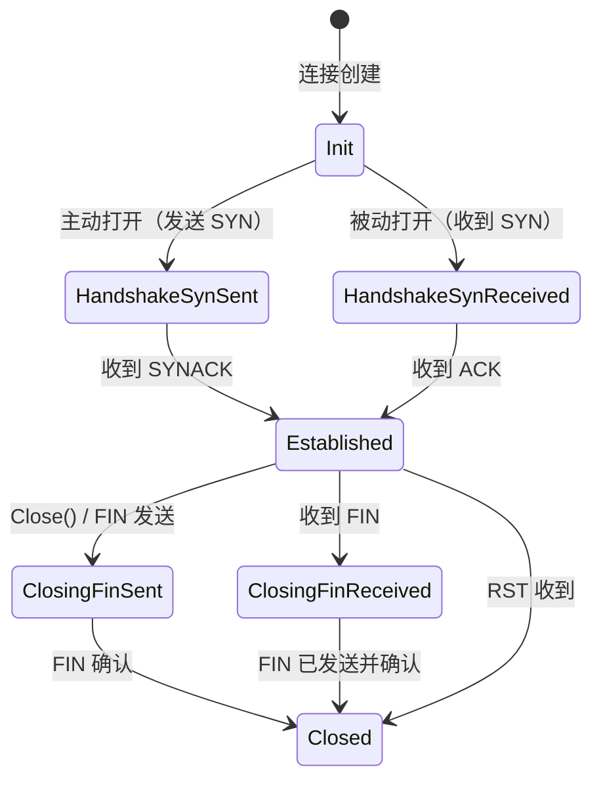
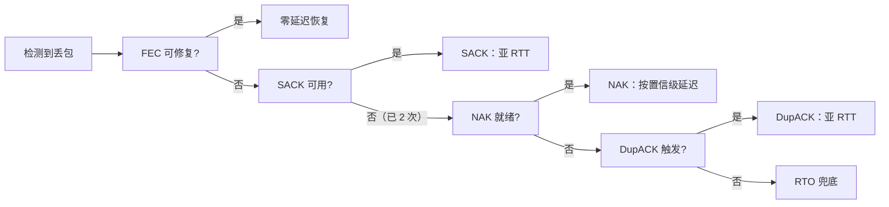
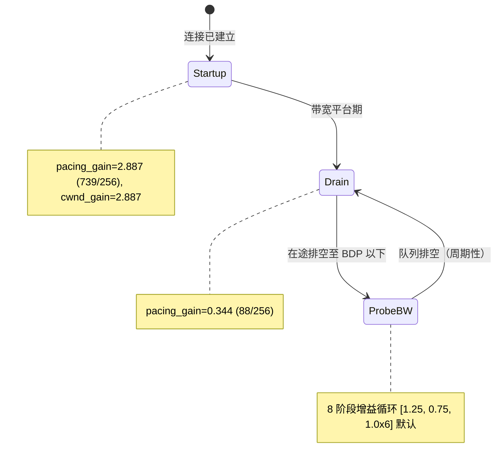
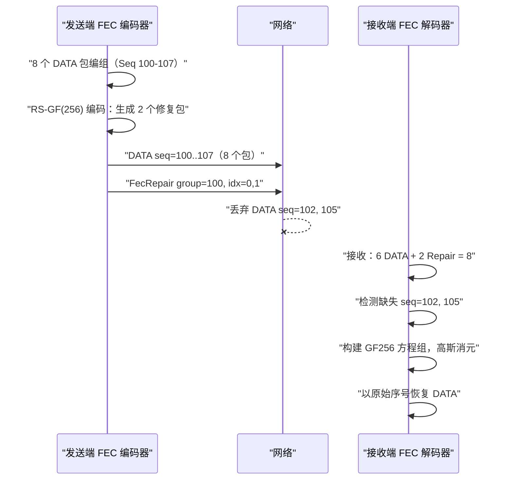
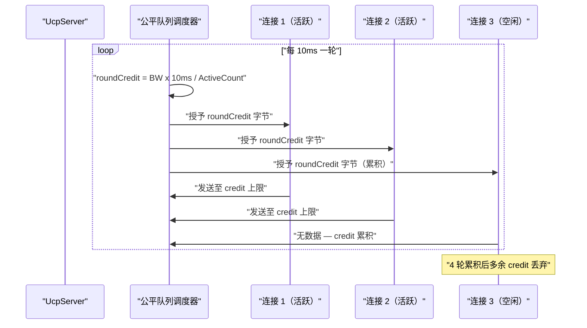

# PPP PRIVATE NETWORK™ X — 通用通信协议 (UCP)

[中文](README_CN.md) | [English](README.md)

UCP（Universal Communication Protocol，通用通信协议）是基于 UDP 的纯控制协议，其拥塞控制使用 KCC2.0 Geodesic（G1/G2/G3）作为核心 RTT 估计器，并可选使用 tcp_kcc.c 中的 KF（KCC Forwarding）跨连接带宽共享功能。完整的 3 模式状态机（STARTUP → DRAIN → PROBE_BW）、带宽估计、增益表及所有附加功能在用户空间库（C++ 和 C#）中实现。MinRTT 跟踪由 Geodesic G1/G3 自动处理。可发送上限为 min(cwnd, 对端宣告的接收窗口)；初始 cwnd 并非固定的 10 包上限。UCP 提供 CID 轮换切换、FEC 前向纠错、捎带 ACK 和 SACK/NAK 恢复——所有这些机制为 KCC 拥塞控制引擎提供高保真投递率样本，实现精确的 BDP/RTT 估计。FEC 和 NAK 是 UCP 协议特性，用于改善拥塞控制器的样本质量：FEC 提供恢复字节样本以改善带宽/RTT 估计，NAK 提供丢包样本以改善长期带宽估计。C# (.NET 8+) 和 C++17 两种实现共享完全相同的协议定义、线格式和拥塞控制算法，可在同一网络中跨语言互相通信。

UCP 面向从数据中心链路（10 Gbps、<1ms RTT）到 300ms 卫星跳转（带 10% 随机丢包）的多类路径，目标是在不同条件下维持可验证的吞吐与可靠性表现。

---

## 1. 项目概述

### 1.1 协议定位

UCP 是一个通用传输协议，填补了 TCP 和 QUIC 之间的技术空白。TCP 的所有丢包即拥塞假设在无线、蜂窝和卫星网络中经常失效。QUIC 改进了丢包恢复，但其核心实现紧密耦合于 HTTP/3 生态。UCP 从基本问题出发重新构建了可靠传输的各个子系统：

- **五路径恢复模型**：SACK 快速重传（亚 RTT 恢复）、NAK 三级置信度恢复、FEC 零延迟恢复、DupACK 备选路径和 RTO 兜底重传。
- **KCC2.0 Geodesic 拥塞控制（G1/G2/G3）**：实现 KCC 3 模式状态机（STARTUP/DRAIN/PROBE_BW）与 Geodesic（G1/G2/G3）估计器进行传播延迟估计。KF（跨连接 Kalman 滤波器）跨连接带宽共享功能源于 `tcp_kcc.c` 内核模块（默认禁用）；完整的 3 模式状态机及所有附加功能在 C++（`ucp_cc.cpp`）和 C# 库中实现。PROBE_BW 状态使用 8 阶段增益循环 [1.25, 0.75, 1.0×6]。关键特性：Geodesic G1/G2/G3 传播延迟估计替代窗口最小值 RTT（min_rtt 跟踪由 G1/G3 自动处理）；各模式固定增益（无增益衰减）；长期带宽（LT BW）EMA 估计；ACK 聚合补偿（双窗口测量 + 5-RTT 轮换）；ECN 感知退避（默认禁用，需 opt-in）。KCC 估计器使用固定结构参数（p_est_init=1000, p_est_floor=10, p_est_max=1,000,000, scale=1024）；p_est 是标量置信代理。

线格式采用大端序编码。每种包类型由公共头部（12 字节）和类型特定的扩展字段组成。所有多字节字段按网络字节序排列。

### 1.2 与 TCP 和 QUIC 的对比

| 维度 | TCP | QUIC | UCP |
|---|---|---|---|
| 丢包模型 | 全部丢包即拥塞 | 改善恢复，重传主导 | 五路径恢复（SACK/NAK/FEC/DupACK/RTO） |
| 拥塞控制 | CUBIC | NewReno | KCC2.0 Geodesic（G1/G2/G3） |
| 前向纠错 | 无 | 无 | RS-GF(256) 自适应 0.0-1.0 |
| 连接迁移 | 不支持（需 TCP Splice） | 连接 ID | 动态 CID，60s 轮换 |
| 确定性测试 | 不支持 | 不支持 | NetworkSimulator 虚拟时钟 |
| HTTP 耦合 | 可选 | 必需（HTTP/3） | 无 |
| 1% 丢包吞吐* | 约 150-200 Mbps | 约 300 Mbps | 288 Mbps |

*Gigabit_Loss1 场景（1000 Mbps / 40ms RTT（20ms 单向））。

### 1.3 部署环境配置

UCP 作为基于 UDP 的传输协议，在操作系统层面需要适当的环境配置以获得最佳性能：

- **Linux**：设置 `net.core.rmem_max=134217728`、`net.core.wmem_max=134217728` 允许 UDP 缓冲扩展到 128MB；`net.ipv4.udp_mem=262144 524288 1048576` 确保 UDP 内存压力不导致丢包；`net.core.netdev_budget=600` 提高网络设备中断处理包数。
- **Windows**：通过注册表将 `DefaultReceiveWindow` 和 `DefaultSendWindow` 调至 128MB。
- **容器环境**：确保 UDP 端口映射正确，主机级缓冲已调大。

### 1.4 安全考虑

UCP 提供传输层可靠性和有序交付，但不替代应用层加密。所有线格式数据以明文传输。建议在不可信网络上将 UCP 与 DTLS、IPsec 或 WireGuard 隧道集成。连接 ID 使用随机生成，攻击者猜测有效 ID 的概率约为 2 的负 32 次方。动态 CID 轮换机制（60s 间隔、120s 双接受期）防止长期可链接攻击。随机 ISN 防止离线序号预测攻击。

---

## 2. 核心特性

### 2.1 捎带累积 ACK

每个 UCP 包通过 `HasAckNumber` 标志位携带累积 ACK 字段。典型 DATA 包的捎带开销为 16 字节 / 1220 字节 MSS——仅 1.3%。字段布局：AckNumber（4 字节）、SackBlockCount（2 字节）、WindowSize（4 字节）、EchoTimestamp（6 字节）。每 ACK 最多 149 个 SACK 块。

### 2.2 SACK 快速重传（双观测阈值）

需恰好 2 次 SACK 观测，且段龄须超过乱序守卫 `max(5ms, RTT)`（平滑 RTT）才触发快速重传。额外缺口在距离超过 `SACK_FAST_RETRANSMIT_DISTANCE_THRESHOLD`（48 序号）时并行修复。每个 SACK 块范围在其生命周期内最多通告 2 次。

| 参数 | 值 | 说明 |
|---|---|---|
| SACK 触发阈值 | 2 次观测 | 首次缺口需 2 次 SACK 报告 |
| 乱序守卫 | max(5ms, RTT) | 防止乱序导致虚假重传 |
| 并行修复距离 | 48 序号 | 超过此距离的缺口可同时修复 |
| 每块最大发送次数 | 2 次 | 防止 SACK 无限循环 |

双观测阈值原理：单次 SACK 可能由包乱序而非丢包引起。要求 2 次独立观测且段龄超过乱序守卫，可有效过滤乱序事件。

### 2.3 NAK 三级置信度恢复

NAK 是 UCP 独有的接收端驱动恢复机制，与 SACK 互补。接收端维护每个缺失序号观测计数，根据计数确定置信层级：

| 置信层级 | 观测次数 | 乱序守卫 | 绝对最小值 |
|---|---|---|---|
| 低 | 1-31 | max(NAK_REORDER_GRACE=2ms, min(RTT/2, MinRto)) | 2ms |
| 中 | 32-127 | max(低/2, 1ms) | 1ms |
| 高 | 128+ | max(低/2, 1ms) | 1ms |

每序号重复抑制间隔 5ms（`NAK_REPEAT_INTERVAL_MICROS`）。单 NAK 包最多 256 个缺失序号。NAK 包同时携带累积 ACK 号。

### 2.4 KCC2.0 Geodesic 拥塞控制（G1/G2/G3）

UCP 实现 KCC2.0 Geodesic 拥塞控制算法（G1/G2/G3）作为其核心 RTT 估计器。KF 跨连接带宽共享功能（默认禁用）源于 `tcp_kcc.c` 内核模块，可启用作为可选功能。完整的 3 模式状态机、增益表及所有附加功能在用户空间 C++（`ucp_cc.cpp`）和 C# 库中实现。

**状态机**：Startup 使用 pacing_gain=2.887（739/256，内核 KCC_HIGH_GAIN），cwnd_gain=2.887，连续 3 RTT 无 ≥1.25x 吞吐增长后退出。Drain 使用 pacing_gain=0.344（88/256，内核 KCC_DRAIN_GAIN）排空 Startup 队列。ProbeBW 循环 8 阶段增益循环（1.25, 0.75, 1.0×6）。可发送上限为 min(cwnd, 对端宣告的接收窗口)；初始 cwnd 并非固定的 10 包上限。MinRTT 跟踪由 Geodesic G1/G3 自动处理。KF 跨连接带宽共享功能与 tcp_kcc.c 内核模块共享。

**Geodesic 传播延迟估计（G1/G2/G3）**：Geodesic 估计器提供准确的 RTT 估计，通过三分量行为模型（T_prop / T_queue / T_noise）将真实信号从测量噪声中分离。它只有一个状态变量（x_est，1024 定点缩放）和三个结构分支：G1 瞬时向下吸收、G2 向上有界增长（每 RTT 12.2%，以观测值为上限）、G3 双阈值路径增长检测（快路径：6 次连续事件 ≥ 1.10×min_rtt；慢路径：7 次连续事件 ≥ 1.05×min_rtt）。不存在协方差矩阵、过程模型或自适应增益。p_est 是标量置信代理，有界 [floor=10, max=1,000,000]。MinRTT 跟踪由 Geodesic G1/G3 自动处理。

**ECN 感知退避**：默认禁用。KCC 方向门控通过 nu_k > 0 在队列增长第一微秒即检测到 T_queue——比任何基于阈值的 AQM 更早。ECN 保留为可选特性，适用于已知 AQM 配置的单交换机路径。当显式启用时，CE 标记通过 EWMA 追踪；当 qdelay 超过拥塞阈值（max(25% min_rtt, 500µs)）时，按比例降低 cwnd_gain。该机制在内核模块（模块参数 `kcc_ecn_enable`/`kcc_ecn_backoff_num`/`kcc_ecn_backoff_den`，tcp_kcc.c:3111-3113）与用户空间库（C# `UcpConfiguration.EcnEnabled`，C++ 经 `KCC_ECN_ENABLED` 编译启用）中均存在，全部默认禁用。

**长期带宽（LT BW）估计**：每 ACK 采样 EMA（默认 1/2 系数）。当前带宽在相对容差（1/8）和绝对容差（500 字节/秒）内时更新 EMA。LT BW 激活后最多 48 RTT 后自动重置。

**ACK 聚合补偿**：双窗口测量 + 5-RTT 轮换（KCC_AGG_WINDOW_ROTATION_RTTS = 5）。CWND 奖励由 `extra_acked`（超出 pacing 推导预期的已确认字节）计算，按 kcc_extra_acked_gain（256 = 1.0x）缩放，受最大毫秒比例（100）与最大窗口 RTT 数（31）约束，每 epoch 记账上限为 ACK_EPOCH_MAX（0x100000）。

**FEC/NAK 集成（UCP 协议特性）**：FEC 和 NAK 是 UCP 协议特性，为拥塞控制引擎提供投递率样本，形成独立但互补的恢复路径。它们不属于 tcp_kcc.c 内核模块，而是丰富拥塞控制算法（与 tcp_kcc.c 共享 KF 更新函数）消费的样本流。

**可调参数**：拥塞控制参数遵循 tcp_kcc.c 内核模块默认值（固定常量，非运行时可调）。关键值：G2 增长率 122/1000、G3 快阈值 11/10（6 次连续）、G3 慢阈值 21/20（7 次连续）、p_est_init=1000、p_est_floor=10、scale=1024、上述启动/排空/探测增益。唯一用户空间运行时可调的拥塞控制项是 ECN 退避开关（UcpConfiguration.EcnEnabled）；其余参数（LT 带宽 EMA、ACK 聚合增益、TSO 余量、BDP 最小 RTT 下限）是固定编译期常量。MinRTT 跟踪由 Geodesic G1/G3 自动处理。

### 2.5 GF(256) Reed-Solomon 前向纠错

UCP 的 FEC 子系统使用 Galois 域 GF(256) 上的系统 Reed-Solomon 编码。不可约多项式 `x^8 + x^4 + x^3 + x^2 + 1` (0x11d) 是 IEEE 802 标准中使用的本原多项式。系统码特点：原始 DATA 包原样发送，修复包作为独立 FecRepair 包发送。接收端需持有至少 N 个独立实体（DATA + Repair）即可通过高斯消元解码恢复。

组大小 2-64 包，冗余度 0.0-1.0。GF(256) 域运算使用预计算 256 项对数表和 512 项反对数表，实现 O(1) 乘除法。

自适应 FEC 是键控于 2% 丢包阈值的二元开关（`FEC_ADAPTIVE_MIN_LOSS_PERCENT = 2d`，UcpConstants.cs:764）：当拥塞控制器估计丢包率 >= 2% 时，对首次传输发送修复包；低于 2% 时不发送修复包（此时重传更便宜）。冗余度 0.0-1.0 / 组大小 2-64 仍可用，但不按丢包分级。

### 2.6 动态 CID 连接迁移

每个 UCP 包携带 4 字节连接标识（ConnectionId）。服务端仅按 ConnectionId 索引连接，而非 (IP, port) 元组。此模型提供：

- **NAT 重绑定韧性**：NAT 映射变化时，服务端通过 ConnectionId 将包路由到正确会话。
- **IP 移动性**：客户端在 Wi-Fi 和蜂窝间漫游时维持相同会话，无需新握手。
- **动态 CID 轮换**：每 60 秒轮换一次，防止长期可链接性和离线 RST 注入。新旧 CID 在 120 秒双接受期内同时有效。
- **PATH_CHALLENGE 安全迁移**：收到新 IP:Port 的包时，服务端发送随机 8 字节挑战，客户端回显确认后接受迁移。速率限制为每 5 秒 1 次，挑战超时 2 秒。

连接迁移完整流程：客户端使用新网络接口发送 DATA 包，携带原有 Connection ID。服务端提取 ConnId 查找对应连接，发现源地址不匹配后向新端点发送 PATH_CHALLENGE 包。服务端同时继续向旧端点发送数据，确保迁移验证期间不中断。客户端回显 PATH_RESPONSE 后，服务端验证匹配并更新连接地址，迁移完成。在途数据恢复由 SACK/NAK/RTO 自动处理。

### 2.7 DPLPMTUD 动态路径 MTU 发现

UCP 基于 DPLPMTUD（Datagram Packetization Layer Path MTU Discovery）实现路径 MTU 自动探测。探测算法采用二分搜索方式，从当前 MSS 向上探测到 `MtuProbeMax`。探测包绕过 `MaxPayloadSize` 检查，接收端识别 MtuProbe 标志后仅回复 ACK 而不交付 payload。通过 `UcpConfiguration` 控制（`EnableMtuDiscovery`、`MtuProbeMax`、`MtuProbeTimeoutMicros`、`MtuProbeIntervalMicros` 等），默认启用。探测超时后回退到上一个已知可用 MTU。

### 2.8 其他特性

- **随机 ISN 防护**：每个连接以加密随机 32 位初始序号开始，防止离线序号攻击。32 位序号空间使用带 2^31 比较窗口的无符号比较环绕处理。
- **公平队列服务端调度**：服务端连接在可配间隔（10ms）内接收基于 credit 的调度轮次。每轮按轮转顺序在活跃连接间分配 `roundCredit = bandwidthLimit x interval` 字节，防止单连接垄断带宽。未用 credit 限制为 4 轮累积上限。
- **紧急重传配 Pacing 绕行**：恢复触发的重传绕过公平队列和 Token Bucket pacing 门控。`PacingController.ForceConsume` 仅将可用令牌清零（清至零，不产生负令牌债务）。每 RTT 紧急重传预算 8192 包。
- **串行执行模型**：每连接独立的 SerialQueue 串行化协议处理（单线程）。`UcpNetwork.DoEvents()` 确定性地驱动定时器、RTO 检查、pacing 刷新和公平队列 credit 轮次。进程内 `NetworkSimulator` 使用虚拟逻辑时钟，产生跨硬件可复现的测试结果。
- **重传风暴抑制**：多层抑制——NAK 重复抑制（按序列标记直至数据到达 + 基于平滑 RTT 的发送窗口限速）、SACK 每块 2 次发送限制、每 RTT 8192 包紧急重传预算、每 Tick 4 包 RTO 重传预算、紧急重传通过 `ForceConsume` 将令牌清至零（无负令牌债务）。

---

## 3. 仓库结构

```
ucp/
├── README.md                          # 主英文 README
├── README_CN.md                       # 主中文 README（本文件）
├── LICENSE                            # MIT 许可证
├── ucp.sln / Ucp.slnx                 # C# 解决方案文件
├── RFC.txt / RFC_CN.txt               # 协议 RFC 规范
├── run-tests.ps1                      # 统一测试运行脚本 (C# + C++)
│
├── Ucp/                               # C# 库源码
│   ├── UcpLibrary.csproj              #   项目文件
│   ├── UcpConnection.cs               #   客户端连接
│   ├── UcpServer.cs                   #   服务端（监听 + 公平队列）
│   ├── UcpConfiguration.cs            #   配置工厂
│   ├── UcpNetwork.cs                  #   事件循环驱动
│   ├── UcpConstants.cs                #   协议常量
│   ├── UcpPacketCodec.cs              #   线格式编解码
│   ├── UcpSackGenerator.cs            #   SACK 生成
│   ├── UcpFecCodec.cs                 #   FEC RS-GF(256) 编解码
│   ├── UcpPackets.cs                  #   包类型定义
│   ├── UcpCongestionControl.cs        #   KCC2.0 Geodesic 拥塞控制（G1/G2/G3）
│   ├── PacingController.cs            #   Pacing Token Bucket
│   ├── UcpRtoEstimator.cs             #   RTO 估算（RFC 6298）
│   ├── UcpEnums.cs                    #   枚举定义
│   ├── UcpSequenceComparer.cs         #   32 位序号算术
│   ├── UcpTransferReport.cs           #   传输诊断报告
│   └── UcpDatagramNetwork.cs          #   网络模拟器
│
├── Ucp.Tests/                         # C# 测试套件（644 用例）
│   ├── UcpTest.csproj
│   └── ...
│
├── cpp/                               # C++ 实现
│   ├── CMakeLists.txt                 #   CMake 构建系统
│   ├── README_EN.md                   #   C++ 英文 README（入口文档）
│   ├── README_CN.md                   #   C++ 中文 README
│   ├── include/ucp/                   #   公开头文件
│   │   ├── ucp_connection.h           #     客户端连接 API
│   │   ├── ucp_server.h              #     服务端 API
│   │   ├── ucp_configuration.h        #     配置
│   │   ├── ucp_constants.h            #     77+ 协议常量
│   │   ├── ucp_cc.h                  #     KCC2.0 Geodesic 拥塞控制（G1/G2/G3）
│   │   ├── ucp_fec_codec.h            #     FEC 编解码
│   │   ├── ucp_sack_generator.h       #     SACK 生成
│   │   ├── ucp_rto_estimator.h        #     RTO 估算
│   │   ├── ucp_packet_codec.h         #     包编解码
│   │   └── ucp_pacing.h               #     Pacing 控制器
│   ├── src/                           #   实现文件
│   ├── tests/                         #   730 测试用例
│   └── samples/                       #   echo_server、echo_client、benchmark、benchmark_diag
│
├── linux/                             # Linux 内核模块
│   ├── tcp_kcc.c                      #   TCP 拥塞控制插件（KCC Geodesic 拥塞控制）
│   ├── Makefile                       #   内核模块构建
│   ├── README.md                      #   英文快速入门
│   ├── README_CN.md                   #   中文快速入门
│   └── docs/                           #   多语言 README（中文、西班牙文、法文等）
│
├── samples/cs/                        # C# 示例应用
│   ├── Server/Program.cs              #   Echo 服务端
│   ├── Client/Program.cs              #   Echo 客户端
│   └── Benchmark/Program.cs           #   基准测试
│
└── docs/                              # C# 文档（中英文）
    ├── index.md / index_CN.md                 #   文档首页
    ├── architecture.md / architecture_CN.md   #   总体方案
    ├── protocol.md / protocol_CN.md            #   协议规范
    ├── api.md / api_CN.md                      #   API 参考
    ├── performance.md / performance_CN.md      #   性能调优
    └── constants.md / constants_CN.md          #   常量参考
```

---

## 4. 实现矩阵

UCP 提供三种独立的实现，覆盖不同的应用场景和平台：

| 实现 | 语言 | 构建工具 | 主要依赖 | 状态 |
|---|---|---|---|---|
| .NET 应用 | C# (.NET 8+) | dotnet CLI | 无外部依赖 | 完整实现，644 测试通过 |
| 原生应用 | C++17 | CMake 3.16+ | Boost.Asio (header-only) | 完整实现，730/730 测试通过 |
| Linux 内核 | C | Linux Makefile | 无 | tcp_kcc 拥塞控制模块 |

### 4.1 C# 实现

C# 实现是 UCP 的参考实现，提供完整的协议栈和跨平台支持。入口点为 `UcpServer`（服务端）和 `UcpConnection`（客户端），通过 `UcpConfiguration.GetOptimizedConfig()` 获取预优化默认配置。核心源码：

- `Ucp/UcpServer.cs` — 管理监听、Accept 新连接、公平队列调度和所有连接的 ConnId 跟踪
- `Ucp/UcpConnection.cs` — 封装单一连接的状态机、PCB、KCC2.0 Geodesic 拥塞控制（G1/G2/G3）和可靠传输逻辑
- `Ucp/UcpConfiguration.cs` — 提供 46+ 可调参数的配置工厂，支持场景预设
- `Ucp/UcpNetwork.cs` — 驱动定时器、RTO 检查和事件循环的确定性引擎

通过 NuGet 或直接项目引用集成，支持任何支持 .NET 8+ 的平台。完整文档见 [docs/index_CN.md](docs/index_CN.md)。

### 4.2 C++ 实现

C++17 实现提供与 C# 实现逐字节兼容的线格式和完全等价的协议行为。使用 Boost.Asio（仅头文件）作为底层网络抽象，CMake 统一构建系统。核心头文件位于 `cpp/include/ucp/`：

- `ucp_connection.h` — 公开异步 API
- `ucp_server.h` — 服务端 API
- `ucp_cc.h` — KCC2.0 Geodesic 拥塞控制实现（G1/G2/G3）
- `ucp_fec_codec.h` — RS-GF(256) 编解码
- `ucp_packet_codec.h`、`ucp_sack_generator.h`、`ucp_pacing.h` — 可靠性引擎

内存管理统一通过 `ucp::Malloc()` 和 `ucp::Mfree()` 路由。共享对象使用 `ucp::shared_ptr`。每个 UcpConnection 拥有专属 Worker Thread，通过 `std::deque + std::condition_variable` 串行处理所有协议事件。

完整构建与集成指南见 [cpp/README_CN.md](cpp/README_CN.md)，该文件为 C++ 实现入口文档。

### 4.3 Linux 内核模块

`linux/tcp_kcc.c` 实现了 KCC2.0 Geodesic 拥塞控制，作为 `tcp_congestion_ops` 插件，同时提供 Geodesic（G1/G2/G3，默认）RTT 估计器和可选 KF 跨连接带宽共享功能。兼容 Linux 3.10+ 内核。

KCC2.0 Geodesic 拥塞控制内核模块，入口见 [linux/README.md](linux/README.md)。

---

## 5. 快速开始

### 5.1 前置条件

| 实现 | 前置条件 |
|---|---|
| C# | .NET 8.0 SDK 或更高版本 |
| C++ | C++17 兼容编译器（MSVC 2019+、GCC 7+、Clang 7+）、CMake 3.16+、Boost 1.70+ (header-only) |
| Linux 内核 | Linux 3.10+ 内核源代码、GCC |

### 5.2 C# 构建与测试

```powershell
git clone <repository-url>
cd ucp
dotnet build ucp.sln

# 运行全部 644 个测试
dotnet test ".\Ucp.Tests\UcpTest.csproj"

# 运行特定测试
dotnet test ".\Ucp.Tests\UcpTest.csproj" --filter "FullyQualifiedName~NoLoss_Utilization"
```

### 5.3 C# 基础示例

```csharp
using Ucp;
using System.Net;
using System.Text;

var config = UcpConfiguration.GetOptimizedConfig();

using var server = new UcpServer(config);
server.Start(9000);
var acceptTask = server.AcceptAsync();

using var client = new UcpConnection(config);
await client.ConnectAsync(new IPEndPoint(IPAddress.Loopback, 9000));
var serverConn = await acceptTask;

byte[] msg = Encoding.UTF8.GetBytes("你好，UCP！");
await client.WriteAsync(msg, 0, msg.Length);
byte[] buf = new byte[msg.Length];
await serverConn.ReadAsync(buf, 0, buf.Length);

Console.WriteLine($"服务端收到: {Encoding.UTF8.GetString(buf)}");

var report = client.GetReport();
Console.WriteLine($"吞吐: {report.MeasuredBandwidthBytesPerSecond * 8.0 / 1_000_000.0:F2} Mbps, 最近 RTT: {report.LastRttMicros} us");
```

### 5.4 C++ 构建与测试

```powershell
# Windows（推荐使用 build_windows.bat）
cd cpp
.\build_windows.bat Release x64

# 通用 CMake 构建
cmake -B build -S .
cmake --build build --config Release -j

# 运行全部 730 个测试
.\run-tests.ps1 -Configuration Release
# 或直接：./build/tests/Release/ucp_tests
```

### 5.5 C++ 基础示例

```cpp
#include "ucp/ucp_configuration.h"
#include "ucp/ucp_connection.h"
#include "ucp/ucp_server.h"
#include <cstdio>

int main() {
    auto config = ucp::UcpConfiguration::GetOptimizedConfig();
    config.ServerBandwidthBytesPerSecond = 12500000; // 100 Mbps

    ucp::UcpDatagramNetwork network(config);
    auto server = network.CreateServer(9000);

    ucp::UcpConnection* g_server_conn = NULLPTR;
    server->AcceptAsync([&](ucp::UcpError err, ucp::UcpConnection* c) {
        g_server_conn = c;
    });

    auto client = network.CreateConnection(config);
    bool connected = false;
    client->ConnectAsync("127.0.0.1:9000",
        [&](ucp::UcpError err, uint32_t) { connected = (err == ucp::UcpError::None); });

    while (!connected || NULLPTR == g_server_conn) {
        network.DoEvents();
    }

    const char* msg = "Hello UCP!";
    bool write_done = false;
    client->WriteAsync(reinterpret_cast<const uint8_t*>(msg), 0, 10,
        [&](ucp::UcpError, bool ok) { write_done = ok; });

    uint8_t buf[16] = {0};
    bool read_done = false;
    g_server_conn->ReadAsync(buf, 0, 10,
        [&](ucp::UcpError, bool ok) { read_done = ok; });

    while (!write_done || !read_done) {
        network.DoEvents();
    }

    std::printf("Received: %s\n", buf);
    client->Close();
    g_server_conn->Close();
    server->Stop();
}
```

### 5.6 Linux 内核模块

```bash
cd linux
make
sudo insmod tcp_kcc.ko
sudo sysctl net.ipv4.tcp_congestion_control=kcc
```

### 5.7 高带宽配置示例

```csharp
var config = UcpConfiguration.GetOptimizedConfig();
config.Mss = 9000;
config.InitialBandwidthBytesPerSecond = 1_000_000_000 / 8; // 1 Gbps
config.MaxPacingRateBytesPerSecond = 0; // 关闭上限
config.InitialCwndPackets = 200;
```

### 5.8 丢包路径配置示例

```csharp
var config = UcpConfiguration.GetOptimizedConfig();
config.FecRedundancy = 0.25;
config.FecGroupSize = 8;
config.LossControlEnable = true;
config.MaxBandwidthLossPercent = 20;
```

### 5.9 传输诊断

```csharp
UcpTransferReport report = connection.GetReport();
Console.WriteLine($"吞吐: {report.MeasuredBandwidthBytesPerSecond * 8.0 / 1_000_000.0:F2} Mbps");
Console.WriteLine($"RTT: {report.LastRttMicros} us");
Console.WriteLine($"重传率: {report.RetransmissionRatio:P}");
Console.WriteLine($"CWND: {report.CwndBytes} 字节");
```

### 5.10 事件循环驱动

C# 实现需要在应用层周期性调用 `UcpNetwork.DoEvents()` 来驱动协议引擎：

```csharp
// 单连接场景
connection.Network.DoEvents();

// 多连接场景（服务端统一驱动）
server.Network.DoEvents();
```

建议调用频率为每 1-5ms 一次，可使用高精度定时器或在主循环中调用。

---

## 6. 构建与测试

### 6.1 C# 构建目标

| 目标 | 类型 | 说明 |
|---|---|---|
| UcpLibrary | 库 | 核心协议库 |
| UcpTest | 测试 | 644 个测试用例（核心、模拟器、集成、性能、参数化、移动恢复、全面 CC） |
| EchoServer | 可执行文件 | Echo 服务端示例 |
| EchoClient | 可执行文件 | Echo 客户端示例 |
| Benchmark | 可执行文件 | 基准测试套件 |

### 6.2 C++ 构建目标

| 目标 | 类型 | 说明 |
|---|---|---|
| ucp | 静态库 | 协议核心库 |
| ucp_tests | 可执行文件 | 730 个单元和集成测试 |
| ucp_echo_server | 可执行文件 | Echo 服务端示例 |
| ucp_echo_client | 可执行文件 | Echo 客户端示例 |
| ucp_benchmark | 可执行文件 | 基准测试套件 |
| ucp_benchmark_diag | 可执行文件 | 诊断基准测试套件 |

### 6.3 C++ CMake 集成

```cmake
add_subdirectory(path/to/ucp/cpp ucp_build)
target_link_libraries(my_app PRIVATE ucp)
```

### 6.4 运行示例

```bash
# 终端 1：Echo 服务端
./build/samples/Release/ucp_echo_server --port 9000 --bandwidth 100

# 终端 2：Echo 客户端
./build/samples/Release/ucp_echo_client --host 127.0.0.1 --port 9000 --size 10 --bandwidth 100

# 运行全部测试
./build/tests/Release/ucp_tests

# 运行基准测试
./build/samples/Release/ucp_benchmark
```

### 6.5 测试分类

| C# 类 | C# 测试数 | C++ 文件 | C++ 测试数 |
|---|---|---|---|
| UcpCoreTests | 70 | ucp_core_tests.cpp | 132 |
| UcpAdditionalTests | 92 | ucp_extended_tests.cpp | 413 |
| UcpComprehensiveTests | 101 | ucp_kcc_alignment_tests.cpp | 185 |
| UcpComprehensiveCCTests | 54 | | |
| UcpKccTests | 95 | | |
| UcpKccAlignmentTests | 80 | | |
| UcpMassTests | 72 | | |
| UcpBenchmarkTests | 52 | | |
| UcpNetworkTests | 16 | | |
| UcpCoverageTests | 7 | | |
| DiagTest | 3 | | |
| InteropTests | 2 | | |
| **合计** | **644** | **合计** | **730** |

覆盖范围：建立连接、丢包重传、长肥管道吞吐、乱序去重、全双工、RST 阻断、公平队列多客户端、4Mbps-10Gbps 全带宽谱、0-10% 丢包、突发丢包、非对称路由、强抖动、移动 3G/4G、卫星 300ms、VPN、测地线估计器、状态机、增益循环、CWND、对齐。

所有测试使用 `NetworkSimulator` 在虚拟逻辑时钟下运行，确保结果不依赖真实硬件环境且完全可复现。

### 6.6 C# / C++ 交叉验证

C# 与 C++ 实现可互相通信，因为它们使用完全相同的线格式和大端序编码约定：

```bash
# 终端 1 — 启动 C# Echo Server
dotnet run --project samples/cs/Server -- --port 9000 --bandwidth 100

# 终端 2 — 以 C++ 客户端连接
./build/samples/Release/ucp_echo_client --host 127.0.0.1 --port 9000 --size 50 --bandwidth 100
```

交叉验证覆盖五个方面：
1. **线格式交叉校验**：C# 编码的包由 C++ 解码，反之亦然，验证所有 8 种包类型的头部字段和标志位一致。
2. **握手互操作**：C# 服务端接受 C++ 客户端 SYN；C++ 服务端接受 C# 客户端 SYN，验证握手序列正确。
3. **丢包恢复互操作**：跨实现边界的 SACK、NAK 和 FEC 恢复正确工作，验证恢复逻辑的跨语言等价性。
4. **FEC 跨编解码**：C# 编码的 FecRepair 由 C++ 解码恢复，验证 RS-GF(256) 编解码的跨实现兼容性。
5. **报告一致性**：相同场景参数下吞吐和重传率在统计上等价，验证性能指标的跨实现可复现性。

---

## 7. 性能概览

### 7.1 基准测试结果（C++ NetworkSimulator，730/730 测试通过）

| 场景 | 目标 Mbps | RTT | 丢包率 | 吞吐 Mbps | 重传率 | 平均 RTT | 利用率 |
|---|---|---|---|---|---|---|---|
| NoLoss | 83.89 | 9ms | 0% | 35.54 | 0% | 9ms | 42.37% |
| LongFatPipe | 100 | 102ms | 0% | 64.35 | 0% | 102ms | 64.35% |
| Gigabit_Ideal | 1000 | 2ms | 0% | 533.05 | 0% | 2ms | 53.30% |
| Gigabit_Loss1 | 1000 | 40ms | 2.06% | 288.03 | 2.06% | 40ms | 28.80% |
| Gigabit_Loss5 | 1000 | 60ms | 10.64% | 200.55 | 10.64% | 60ms | 20.05% |
| Benchmark10G | 10000 | 2ms | 0% | 8528.43 | 0% | 2ms | 85.28% |
| DataCenter | 10000 | 0ms | 0% | 10000.00 | 0% | 0ms | 100.00% |
| Enterprise | 1000 | 30ms | 0% | 339.97 | 0% | 30ms | 34.00% |
| AsymRoute | 100 | 40ms | 0% | 45.62 | 0% | 40ms | 45.62% |
| HighJitter | 100 | 100ms | 0% | 22.93 | 0% | 100ms | 22.93% |
| Weak4G | 10 | 160ms | 10.91% | 3.63 | 10.91% | 160ms | 36.32% |

*Gigabit_Ideal 受基准配置瓶颈限制。

### 7.2 全局性能特征

| 属性 | 数值 |
|---|---|
| 最大测试吞吐 | 10 Gbps |
| 最小延迟（回环） | <100 µs |
| 最大测试 RTT | 300 ms |
| 最大测试丢包率 | 10% |
| 巨型帧 MSS | 9000 字节 |
| 默认 MSS | 1220 字节 |
| FEC 冗余范围 | 0.0-1.0 |
| 最大 FEC 分组 | 64 包 |
| 每 ACK 最大 SACK 块 | 149 |
| 连接 ID 空间 | 32 位（约 4x10^9 并发） |
| 序号空间 | 32 位（约 4.29B 序号；按 1200B MSS、10Gbps 计算完整回绕约需 4123 秒） |

### 7.3 关键场景验证

**NoLoss（目标 83.89 Mbps）**：实测吞吐 35.54 Mbps，利用率 42.37%。存在竞争流量导致可用带宽低于目标值。

**LongFatPipe（100 Mbps / 100ms RTT）**：实测吞吐 64.35 Mbps，利用率 64.35%。高 BDP 场景下 KCC 拥塞控制 Startup 成功填满管道。

**Gigabit_Loss1（1000 Mbps / 40ms RTT / 2.06% 丢包）**：实测吞吐 288.03 Mbps，达目标的 28.80%。FEC（冗余=0.25）在丢包条件下提升吞吐。

**Weak4G（10 Mbps / 160ms RTT / 10.91% 丢包）**：实测吞吐 3.63 Mbps，利用率 36.32%。连接在困难条件下保持存活。

完整基准方法论和调优指南见 [docs/performance_CN.md](docs/performance_CN.md) 和 [cpp/docs/performance_EN.md](cpp/docs/performance_EN.md)。

---

## 8. 协议栈

### 8.1 连接状态机


```mermaid
stateDiagram-v2
    [*] --> Init: 连接创建
    Init --> HandshakeSynSent: 主动打开（发送 SYN）
    Init --> HandshakeSynReceived: 被动打开（收到 SYN）
    HandshakeSynSent --> Established: 收到 SYNACK
    HandshakeSynReceived --> Established: 收到 ACK
    Established --> ClosingFinSent: Close() / FIN 发送
    Established --> ClosingFinReceived: 收到 FIN
    ClosingFinSent --> Closed: FIN 确认
    ClosingFinReceived --> Closed: FIN 已发送并确认
    Established --> Closed: RST 收到
```

### 8.2 数据包类型

| 类型 | 编码值 | 用途 |
|---|---|---|
| SYN | 0x01 | 连接发起请求 |
| SYNACK | 0x02 | 连接接受确认 |
| ACK | 0x03 | 独立确认包 |
| NAK | 0x04 | 否定确认 |
| DATA | 0x05 | 应用数据载荷 |
| FIN | 0x06 | 连接关闭 |
| RST | 0x07 | 连接重置 |
| FecRepair | 0x08 | FEC 修复包 |

公共头部 12 字节（Type、Flags、ConnectionId、Timestamp）。DATA 包在 `Flags.HasAckNumber` 置位时扩展至 36 字节（捎带 ACK）；独立 ACK 包固定 28 字节。

### 8.3 五路径恢复模型

| 恢复路径 | 触发条件 | 恢复延迟 | 关键约束 |
|---|---|---|---|
| SACK 快速重传 | 2 次 SACK 观测 + 乱序守卫 | 亚 RTT | 每块最多 2 次；并行缺口 >48 序号 |
| DupACK | 相同 ACK x3 | 亚 RTT | 需 3 次重复观测 |
| NAK | 接收端三级置信度 | 亚 RTT | 按序列标记抑制；最多 256 序号 |
| FEC | 组内有足够修复包 | 零 RTT | 组 2-64；自适应冗余 |
| RTO | 无 ACK 进展 | RTO x 1.2 退避 | 每 tick 最多 4 包；50ms 至 15s 逐级退避 |


```mermaid
flowchart LR
    LossEvent["检测到丢包"] --> FEC["FEC 可修复?"]
    FEC -->|"是"| ZeroLatency["零延迟恢复"]
    FEC -->|"否"| SACK["SACK 可用?"]
    SACK -->|"是"| SackPath["SACK：亚 RTT"]
    SACK -->|"否（已 2 次）"| NAK["NAK 就绪?"]
    NAK -->|"是"| NakPath["NAK：按置信级延迟"]
    NAK -->|"否"| DupACK["DupACK 触发?"]
    DupACK -->|"是"| DupAckPath["DupACK：亚 RTT"]
    DupACK -->|"否"| RTOPath["RTO 兜底"]
```

### 8.4 KCC2.0 Geodesic 拥塞控制状态机（G1/G2/G3）


```mermaid
stateDiagram-v2
    [*] --> Startup: 连接已建立
    Startup --> Drain: 带宽平台期
    Drain --> ProbeBW: 在途排空至 BDP 以下
    ProbeBW --> Drain: 队列排空（周期性）

    note right of Startup: pacing_gain=2.887 (739/256), cwnd_gain=2.887
    note right of Drain: pacing_gain=0.344 (88/256)
    note right of ProbeBW: 8 阶段增益循环 [1.25, 0.75, 1.0x6] 默认
```

> **说明：** KCC 2.0 使用 3 状态 FSM（STARTUP → DRAIN → PROBE_BW）。MinRTT 跟踪由 Geodesic G1/G3 自动处理。PROBE_BW 中的周期性 DRAIN 阶段用于队列排空。

### 8.5 FEC 组恢复流程


```mermaid
sequenceDiagram
    participant S as "发送端 FEC 编码器"
    participant Net as "网络"
    participant R as "接收端 FEC 解码器"

    S->>S: "8 个 DATA 包编组（Seq 100-107）"
    S->>S: "RS-GF(256) 编码：生成 2 个修复包"
    S->>Net: "DATA seq=100..107（8 个包）"
    S->>Net: "FecRepair group=100, idx=0,1"

    Net--xNet: "丢弃 DATA seq=102, 105"

    R->>R: "接收：6 DATA + 2 Repair = 8"
    R->>R: "检测缺失 seq=102, 105"
    R->>R: "构建 GF256 方程组，高斯消元"
    R->>R: "以原始序号恢复 DATA"
```

### 8.7 公平队列调度


```mermaid
sequenceDiagram
    participant S as "UcpServer"
    participant FQ as "公平队列调度器"
    participant C1 as "连接 1（活跃）"
    participant C2 as "连接 2（活跃）"
    participant C3 as "连接 3（空闲）"

    loop "每 10ms 一轮"
        FQ->>FQ: "roundCredit = BW x 10ms / ActiveCount"
        FQ->>C1: "授予 roundCredit 字节"
        FQ->>C2: "授予 roundCredit 字节"
        FQ->>C3: "授予 roundCredit 字节（累积）"
        C1->>FQ: "发送至 credit 上限"
        C2->>FQ: "发送至 credit 上限"
        C3->>FQ: "无数据 — credit 累积"
    end

    Note over C3: "4 轮累积后多余 credit 丢弃"
```

---

## 9. 文档索引

### 9.1 核心文档（C# 参考实现）

| 文档 | 中文 | English | 说明 |
|---|---|---|---|
| 文档首页 | [index_CN.md](docs/index_CN.md) | [index.md](docs/index.md) | 文档体系总索引与导航 |
| 总体方案 | [architecture_CN.md](docs/architecture_CN.md) | [architecture.md](docs/architecture.md) | 六层运行时架构、PCB 状态管理、ConnId 追踪、SerialQueue、公平队列、KCC2.0 Geodesic 拥塞控制（G1/G2/G3）内核、FEC 编解码器、网络模拟器 |
| 协议规范 | [protocol_CN.md](docs/protocol_CN.md) | [protocol.md](docs/protocol.md) | 线格式规范、8 种包类型与标志位、捎带 ACK、SACK 双观测阈值、NAK 三级置信度、连接状态机、序号算术、KCC2.0 Geodesic 拥塞控制（G1/G2/G3）状态转换 |
| API 参考 | [api_CN.md](docs/api_CN.md) | [api.md](docs/api.md) | UcpConfiguration 配置工厂、UcpServer 生命周期、UcpConnection API、UcpNetwork 事件循环、ITransport 接口 |
| 性能调优 | [performance_CN.md](docs/performance_CN.md) | [performance.md](docs/performance.md) | 基准框架方法论、14+ 场景矩阵、18 列报告字段、13 条校验规则、方向路由模型、MSS/FEC/Pacing 调优指南、验收标准 |
| 常量参考 | [constants_CN.md](docs/constants_CN.md) | [constants.md](docs/constants.md) | 包编码大小、RTO 定时器、SACK/NAK 分级阈值、KCC2.0 Geodesic 拥塞控制（G1/G2/G3）参数、FEC 参数、基准 Payload、验收标准阈值、路由常量 |

### 9.2 RFC 规范

| 文档 | 中文 | English |
|---|---|---|
| 协议 RFC | [RFC_CN.txt](RFC_CN.txt) | [RFC.txt](RFC.txt) |

IETF 格式的权威协议规范，定义了所有实现共同遵循的线格式、状态机和算法描述。

### 9.3 C++ 实现文档

| 文档 | 中文 | English |
|---|---|---|
| C++ README（入口文档） | [cpp/README_CN.md](cpp/README_CN.md) | [cpp/README_EN.md](cpp/README_EN.md) |
| C++ 文档索引 | [cpp/docs/index_CN.md](cpp/docs/index_CN.md) | [cpp/docs/index_EN.md](cpp/docs/index_EN.md) |
| C++ 总体方案 | [cpp/docs/architecture_CN.md](cpp/docs/architecture_CN.md) | [cpp/docs/architecture_EN.md](cpp/docs/architecture_EN.md) |
| C++ 协议规范 | [cpp/docs/protocol_CN.md](cpp/docs/protocol_CN.md) | [cpp/docs/protocol_EN.md](cpp/docs/protocol_EN.md) |
| C++ API 参考 | [cpp/docs/api_CN.md](cpp/docs/api_CN.md) | [cpp/docs/api_EN.md](cpp/docs/api_EN.md) |
| C++ 性能调优 | [cpp/docs/performance_CN.md](cpp/docs/performance_CN.md) | [cpp/docs/performance_EN.md](cpp/docs/performance_EN.md) |
| C++ 常量参考 | [cpp/docs/constants_CN.md](cpp/docs/constants_CN.md) | [cpp/docs/constants_EN.md](cpp/docs/constants_EN.md) |

C++ 实现共享与 C# 完全相同的线格式规范和协议语义，支持跨语言互操作。C# 服务端可与 C++ 客户端通信，反之亦然。C++ 特有优化包括移动语义显式删除、shared_ptr 内存管理和 noexcept 标注。详见 cpp/README_CN.md。

### 9.4 Linux 内核模块文档

| 文档 | 中文 | English | 说明 |
|---|---|---|---|
| Linux README | [linux/README.md](linux/README.md) | [linux/README.md](linux/README.md) | 快速入门 + 完整文档 |
| 模块源码 | — | [linux/tcp_kcc.c](linux/tcp_kcc.c) | 内核模块源代码 |

### 9.5 示例代码

| 示例 | 语言 | 路径 |
|---|---|---|
| Echo 服务端 | C# | [samples/cs/Server/Program.cs](samples/cs/Server/Program.cs) |
| Echo 客户端 | C# | [samples/cs/Client/Program.cs](samples/cs/Client/Program.cs) |
| 基准测试 | C# | [samples/cs/Benchmark/Program.cs](samples/cs/Benchmark/Program.cs) |
| Echo 服务端 | C++ | `cpp/samples/echo_server.cpp` |
| Echo 客户端 | C++ | `cpp/samples/echo_client.cpp` |
| 基准测试 | C++ | `cpp/samples/benchmark.cpp` |
| 诊断基准测试 | C++ | `cpp/samples/benchmark_diag.cpp` |

---

## 10. 场景调优方案

### 10.1 高速数据中心互连（10Gbps，RTT<1ms）

- MSS=9000 降低头部开销，10 Gbps 下包率从约 1.02M pps 降至约 139K pps
- `MaxCongestionWindowBytes=256MB` 避免 CWND 限制吞吐
- `MaxPacingRateBytesPerSecond=0` 关闭 Pacing 天花板
- `SendBufferSize=128MB` 确保缓冲不成为瓶颈
- 预期吞吐：4264 Mbps

### 10.2 跨洋长肥管道（100Mbps，RTT=100ms）

- `SendBufferSize=16MB` 满足 1.25MB BDP（100Mbps x 100ms）
- `InitialCwndPackets=100` 加速 Startup 收敛
- 预期利用率：64.35%

### 10.3 高丢包千兆链路（1Gbps，1-5% 丢包）

- `FecRedundancy=0.25` 启用 FEC 保护
- `FecGroupSize=16` 增强组容忍力
- `LossControlEnable=true` 启用丢包感知 CWND 自适应
- 预期吞吐：288 Mbps（1% 丢包），200.55 Mbps（5% 丢包）

### 10.4 弱移动网络（10Mbps，RTT=160ms，间歇断网）

- `DisconnectTimeoutMicros=15000000`（15s）容忍临时信号丢失
- `KeepAliveIntervalMicros=100000`（100ms）快速检测 NAT 超时
- `MaxRetransmissions=15` 应对长断网后重传周期延长
- 预期利用率：36.32%

---

## 11. KCC2.0 Geodesic 拥塞控制（G1/G2/G3）在弱网环境中的行为

### 11.1 信号衰减期间的带宽估计

当无线信号衰减导致物理层丢包率上升时，KCC 拥塞控制的投递率估计不受影响，pacing 速率保持稳定。只有当 RTT 同时增长（表明瓶颈队列堆积）时，发送方才会降低 pacing。

### 11.2 断网恢复过程

当网络完全中断时，发送端在 RTO 超时后开始重传。重传预算限制为每 timer tick 4 包，防止断网恢复后大量重传对网络造成冲击。网络恢复后 KCC 拥塞控制通过 Startup 状态重新探测瓶颈带宽，通常在 2-3 RTT 内恢复到断网前水平。

### 11.3 链路切换时的连接保持

从 4G 切换到 Wi-Fi（或反之）时，客户端 IP 地址变化但 Connection ID 保持不变。服务端在收到新 IP:Port 的数据包后执行 PATH_CHALLENGE 验证，验证期间旧路径继续传输。验证通过后服务端将连接切换到新路径。此过程应用层无感知，正在进行的 `WriteAsync` 正常完成。

### 11.4 TCP 共存公平性

KCC 拥塞控制与 TCP CUBIC 在共享瓶颈链路上具有合理的共存公平性。ProbeBW 八阶段循环中的低增益阶段会主动退让，在瓶颈填满时释放部分带宽给 TCP 流。在真实网络测试中，UCP 与 TCP 混合流场景下两者在统计上形成接近公平的带宽分配。

---

## 12. C++ 实现细节

### 12.1 内存管理

C++ 实现中全部内存分配通过统一接口路由：

```cpp
void* ucp::Malloc(std::size_t size) noexcept;
void  ucp::Mfree(void* ptr) noexcept;
```

共享对象使用辅助工厂函数构造：

```cpp
auto estimator = ucp::make_shared_object<UcpRtoEstimator>(config);
auto buffer    = ucp::make_shared_alloc<uint8_t>(65536);
```

所有 STL 容器通过 `ucp::` 命名空间别名访问，全部不抛出异常的函数声明为 `noexcept`。使用 `NULLPTR` 宏代替 `nullptr` 关键字。

### 12.2 线程模型

每个 UcpConnection 拥有专属的 Worker Thread，通过 `std::deque + std::condition_variable` 串行处理全部协议事件。入站包通过 ConnId 哈希映射路由到对应连接的 SerialQueue，Worker Thread 按入列顺序处理。UDP Socket 的 recvfrom() 在独立接收线程中执行，不阻塞协议处理。此模型与 C# 的 SerialQueue 串行执行模型完全等价。

---

## 13. 许可证与商标

[^kcc_gain]: 内核模块将 KCC_HIGH_GAIN 定义为 `BBR_UNIT * 2885 / 1000 + 1`（约 2.887x）。BBR_UNIT (256) 空间中的有效 pacing 增益为 `ceil(2885 × 256 / 1000) = 739`，即 739/256 ≈ 2.887x。

[^kcc_drain]: 内核模块将 KCC_DRAIN_GAIN 定义为 `BBR_UNIT * 1000 / 2885`（88/256 ≈ 0.344x）。BBR_UNIT (256) 空间中的有效排空增益为 `256 × 1000 / 2885 = 88`（整数除法），即 88/256 ≈ 0.344x。

MIT License。完整文本见 [LICENSE](LICENSE)。

版权所有 (c) 2026 PPP PRIVATE NETWORK™ X

PPP PRIVATE NETWORK™ 是 PPP PRIVATE NETWORK 的商标。


