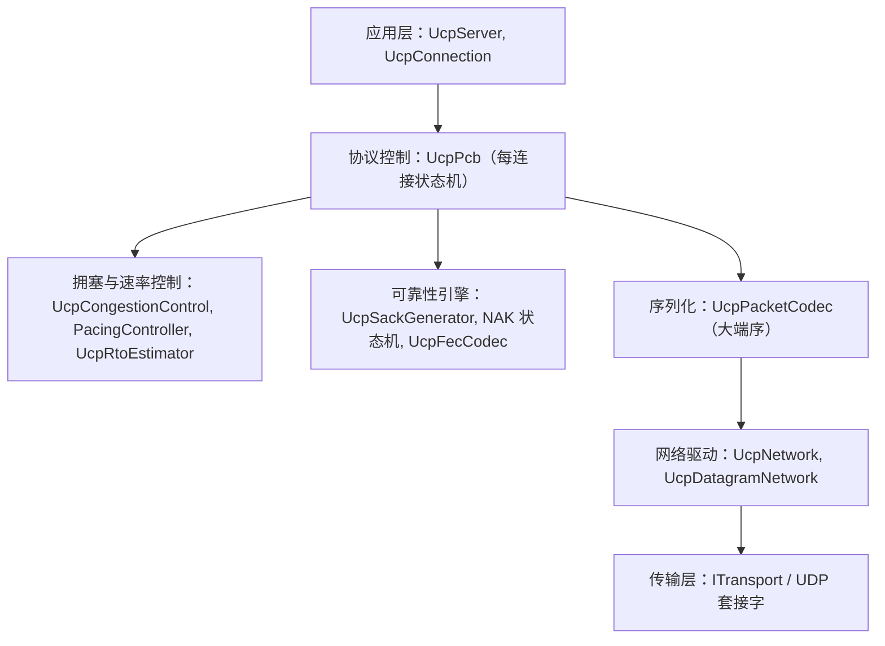
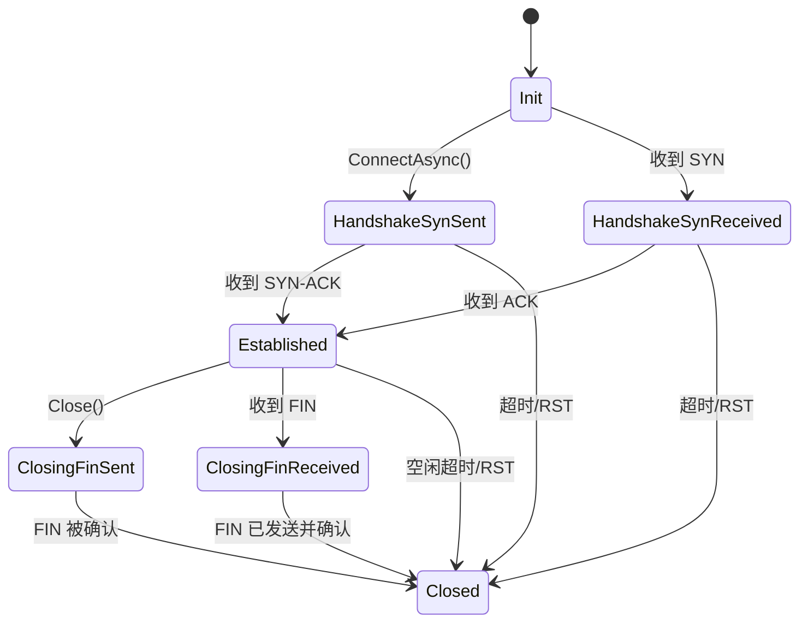

# UCP C++ 库

[English](README_EN.md)

UCP（Universal Communication Protocol）是基于 UDP 的纯控制协议 C++ 实现，其拥塞控制使用 3 模式状态机（STARTUP/DRAIN/PROBE_BW）+ 测地线估计器（G1/G2/G3）传播延迟估计（固定结构参数：p_est_init=1000, scale=1024；p_est 是标量置信代理，有界 [floor=10, max=1,000,000]，增益固定），独立实现于 `ucp_cc.cpp`，参考 tcp_kcc.c 内核模块的 KCC 三分量 RTT 分解模型。KF（跨连接 Kalman 滤波器）跨连接带宽共享功能在 Linux 内核模块（`linux/tcp_kcc.c`）和用户空间（`ucp_cc.cpp`，默认禁用）均有实现。完整的 3 模式状态机及所有附加功能在用户空间实现。它提供 CID 轮换切换、FEC 前向纠错和 SACK/NAK 恢复——所有机制为拥塞控制引擎提供更清洁的投递样本。FEC 和 NAK 是 UCP 协议特性，为拥塞控制提供投递样本（不属于 tcp_kcc.c）。拥塞控制使用 3 模式状态机（STARTUP/DRAIN/PROBE_BW）+ 测地线估计器（G1/G2/G3）传播延迟估计，含 LT 带宽 EMA、ACK 聚合补偿（双窗口测量 + 5-RTT 轮换）和 ECN 感知退避（默认禁用，需 opt-in）。MinRTT 跟踪由测地线 G1/G3 自动处理。可发送上限为 min(cwnd, 对端宣告的接收窗口)；初始 cwnd 并非固定的 10 包上限。多路径丢包恢复机制（SACK/NAK/FEC/DupACK/RTO）。本 C++ 库是原生实现，与 C# UCP 参考实现功能一致，并支持完全的跨语言互操作。

MIT 许可证 -- 版权所有 (c) 2026 PPP PRIVATE NETWORK™ X

---

## 项目结构

```
cpp/
├── CMakeLists.txt           # 顶层 CMake 构建文件（静态库 + 测试 + 示例）
├── build_windows.bat        # Windows 构建脚本（vcpkg、Ninja、x86/x64）
├── run-tests.ps1            # PowerShell 构建与测试脚本
├── include/
│   └── ucp/
│       ├── ucp_connection.h       # 公共异步连接 API
│       ├── ucp_server.h           # 公共服务端监听 API
│       ├── ucp_configuration.h    # 每连接配置对象
│       ├── ucp_constants.h        # 77+ 个协议常量
│       ├── ucp_enums.h            # 枚举：包类型、标志位、状态机、UCP 模式
│       ├── ucp_types.h            # Endpoint、UcpError、回调类型、传输报告
│       ├── ucp_transfer_report.h  # 带宽计算辅助函数
│       ├── ucp_network.h          # 中央事件循环与 PCB 管理器
│       ├── ucp_datagram_network.h # Boost.Asio UDP 套接字网络
│       ├── ucp_cc.h              # KCC 拥塞控制器
│       ├── ucp_pacing.h           # 令牌桶速率控制器
│       ├── ucp_packet_codec.h     # 大端序编解码器
│       ├── ucp_packets.h          # 包类型层次结构
│       ├── ucp_fec_codec.h        # RS-GF(256) 前向纠错
│       ├── ucp_rto_estimator.h    # RTO 估算（SRTT/RTTVAR）
│       ├── ucp_sack_generator.h   # 选择性确认生成器
│       ├── ucp_sequence_comparer.h # 32 位序号空间算术
│       ├── ucp_time.h             # 时间工具函数
│       ├── ucp_memory.h           # Malloc/Mfree、make_shared_object/alloc
│       ├── ucp_vector.h           # 容器别名 + NULLPTR + optional<T>
│       ├── internal/
│       │   └── ucp_pcb.h          # 协议控制块（内部状态机）
│       └── transport/
│           ├── itransport.h             # ITransport 接口
│           ├── ibindable_transport.h    # IBindableTransport 接口
│           └── udp_socket_transport.h   # 具体 UDP 传输实现
├── src/                    # 14 个 .cpp 实现文件
├── tests/
│   ├── CMakeLists.txt       # 构建：ucp_tests + interop_server
│   ├── test_main.cpp        # 测试运行入口
│   ├── ucp_core_tests.cpp   # 核心测试套件
│   ├── network_simulator.h/cpp # 虚拟网络模拟器
│   ├── test_framework.h     # 自定义断言宏
│   ├── test_quick.cpp       # 快速冒烟测试
│   └── interop_server.cpp   # 跨语言互操作服务端
├── samples/
│   ├── CMakeLists.txt       # 构建：echo_server、echo_client、benchmark
│   ├── echo_server.cpp      # 回声服务端示例
│   ├── echo_client.cpp      # 回声客户端示例
│   ├── benchmark.cpp        # 性能基准测试（冒烟测试）
│   └── benchmark_diag.cpp   # 诊断基准测试
└── docs/                    # 详细文档（英文 + 中文）
```

---

## 系统要求

| 组件 | 最低版本 |
|---|---|
| 编译器 | MSVC 2019+ / GCC 7+ / Clang 7+ |
| C++ 标准 | C++17 |
| CMake | 3.16+ |
| Boost | 1.70+（仅头文件：Boost.Asio） |
| 平台 | Windows 7+ / Linux 3.10+ / macOS 10.15+ |
| vcpkg | 建议在 Windows 上使用 vcpkg 安装 Boost |

### 安装依赖

```bash
# Windows（vcpkg）
vcpkg install boost

# Linux（apt）
sudo apt install libboost-dev

# macOS（Homebrew）
brew install boost
```

---

## 构建说明

### 通过 CMake（手动构建）

```bash
cd cpp
cmake -B build -S . -DCMAKE_BUILD_TYPE=Release
cmake --build build
```

Windows 上使用 Ninja：

```powershell
cmake -G Ninja -B build -S . -DCMAKE_BUILD_TYPE=Release
cmake --build build
```

### 通过 `build_windows.bat`

自动检测 vcpkg，使用 Ninja 生成器，构建库、测试和示例，并自动运行测试：

```cmd
build_windows.bat            # Release x64
build_windows.bat Debug      # Debug x64
build_windows.bat Release x86
build_windows.bat all        # 同时构建 x86 和 x64 的 Release
```

vcpkg 发现优先级：`VCPKG_CMAKE_TOOLCHAIN_FILE` > `VCPKG_ROOT` > `%LOCALAPPDATA%\vcpkg\vcpkg.path.txt` > `..\vcpkg` > Visual Studio 集成 vcpkg。

### 通过 `run-tests.ps1`

PowerShell 脚本，一键完成配置、构建和测试：

```powershell
.\run-tests.ps1                              # Release x64
.\run-tests.ps1 -Configuration Debug -Architecture x64 -Clean
```

### 构建目标

| 目标 | 类型 | 说明 |
|---|---|---|
| `ucp` | 静态库 | 核心协议实现（约 6,000 行代码） |
| `ucp_tests` | 可执行文件 | 单元测试 + 集成测试 + 基准测试 |
| `ucp_echo_server` | 可执行文件 | 回声服务端示例 |
| `ucp_echo_client` | 可执行文件 | 回声客户端示例 |
| `ucp_benchmark` | 可执行文件 | 性能基准测试套件 |
| `ucp_benchmark_diag` | 可执行文件 | 诊断基准测试套件 |
| `interop_server` | 可执行文件 | C# 互操作验证服务端 |

### CMake 集成

```cmake
add_subdirectory(path/to/ucp/cpp ucp_build)
target_link_libraries(my_app PRIVATE ucp)
```

---

## 架构设计

### 内存管理

所有堆内存分配均通过 `ucp::Malloc` / `ucp::Mfree` 路由，以便将来替换分配器（例如集成内存池）：

```cpp
void* ucp::Malloc(std::size_t size) noexcept;
void  ucp::Mfree(void* ptr) noexcept;
```

**make_shared_object** 和 **make_shared_alloc** 提供带 placement-new 构造和自定义删除器的自动清理功能：

```cpp
// 在 UCP 管理的内存中构造对象
auto estimator = ucp::make_shared_object<UcpRtoEstimator>(config);

// 分配共享缓冲区
auto buffer = ucp::make_shared_alloc<uint8_t>(65536);

// 在 interop_server.cpp（tests/interop_server.cpp:44）中使用：
auto recvBuf = ucp::make_shared_object<ucp::vector<uint8_t>>(65536);
```

对于平凡可构造的类型，内存会在 placement-new 之前进行零初始化。对于非平凡类型（包含 `std::string`、`std::mutex`、`std::vector` 成员的类），仅调用构造函数。

### 容器别名

所有 STL 容器都通过 `ucp::` 命名空间进行别名，以便将来替换分配器：

```cpp
ucp::vector<T>              // std::vector<T>
ucp::array<T, N>            // std::array<T, N>
ucp::string                 // std::string
ucp::shared_ptr<T>          // std::shared_ptr<T>
ucp::unique_ptr<T>          // std::unique_ptr<T>
ucp::map<K,V>               // std::map<K,V>
ucp::unordered_map<K,V>     // std::unordered_map<K,V>
ucp::set<K>                 // std::set<K>
ucp::deque<T>               // std::deque<T>
ucp::queue<T>               // std::queue<T>
ucp::function<Sig>          // std::function<Sig>
ucp::pair<T1,T2>            // std::pair<T1,T2>
ucp::optional<T>            // 最小化 optional 实现（兼容 C++17）
```

### NULLPTR 宏

整个库统一使用 `NULLPTR` 代替 `nullptr`。通过 CMake 全局定义（`add_compile_definitions(NULLPTR=nullptr)`）以及在 `ucp_vector.h` 和 `ucp_memory.h` 中定义：

```cpp
if (NULLPTR == buffer) { return; }
```

### C# 类等价对照

| C++ 类 | C# 等价类 | 头文件路径 |
|---|---|---|
| `UcpConfiguration` | `UcpConfiguration` | `include/ucp/ucp_configuration.h` |
| `UcpConnection` | `UcpConnection` | `include/ucp/ucp_connection.h` |
| `UcpServer` | `UcpServer` | `include/ucp/ucp_server.h` |
| `UcpNetwork` | `UcpNetwork` | `include/ucp/ucp_network.h` |
| `UcpDatagramNetwork` | `UcpDatagramNetwork` | `include/ucp/ucp_datagram_network.h` |
| `UcpCongestionControl` | `UcpCongestionControl` | `include/ucp/ucp_cc.h` |
| `PacingController` | `PacingController` | `include/ucp/ucp_pacing.h` |
| `UcpPacketCodec` | `PacketCodec` | `include/ucp/ucp_packet_codec.h` |
| `UcpFecCodec` | `FecCodec` | `include/ucp/ucp_fec_codec.h` |
| `UcpRtoEstimator` | `RtoEstimator` | `include/ucp/ucp_rto_estimator.h` |
| `UcpSackGenerator` | `SackGenerator` | `include/ucp/ucp_sack_generator.h` |
| `UcpTransferReport` | `UcpTransferReport` | `include/ucp/ucp_types.h` |
| `Endpoint` | `Endpoint` | `include/ucp/ucp_types.h` |
| `UcpError` | `UcpError` | `include/ucp/ucp_types.h` |
| `ITransport` | `ITransport` | `include/ucp/transport/itransport.h` |
| `IBindableTransport` | `IBindableTransport` | `include/ucp/transport/ibindable_transport.h` |
| `IUcpObject` | `IUcpObject` | `include/ucp/ucp_network.h` |

### 六层架构



### 线程模型

每个 `UcpConnection` 拥有一个专用 `std::thread`（工作线程），通过串行化的 `std::deque` + `std::condition_variable` 处理所有协议事件。优先级项目（如 NAK 分发）会插入队列前端。所有 PCB 状态变更在工作线程上顺序执行，无需加锁。底层 UDP 套接字在独立的接收线程中运行 `recvfrom()`。

---

## API 参考

### UcpConfiguration（`include/ucp/ucp_configuration.h`）

可调参数包括：MSS（1220）、RTO 范围（50ms-15s）、UCP 增益值（Startup 2.89、ProbeBW 1.25/0.75）、FEC 设置、缓冲区大小、DPLPMTUD。提供 `GetOptimizedConfig()` 获取平台优化默认配置，以及 `Clone()` 进行深拷贝。

```cpp
auto config = ucp::UcpConfiguration::GetOptimizedConfig();
config.ServerBandwidthBytesPerSecond = 12500000; // 100 Mbps
config.SetSendBufferSize(64 * 1024 * 1024);
config.FecRedundancy = 0.25; // 25% FEC 冗余
```

### UcpConnection（`include/ucp/ucp_connection.h`）

基于回调的异步连接，内部包含串行工作线程。镜像 C# 的 `UcpConnection`，采用 Proactor 模式。

| 方法 | 说明 | C# 等价方法 |
|---|---|---|
| `ConnectAsync(endpoint, callback)` | 发起握手（非阻塞） | `ConnectAsync` |
| `Send(buf, offset, count)` | 同步发送（可能阻塞） | `Send` |
| `Send(buf, offset, count, priority)` | 同步发送（带 QoS） | `Send` |
| `SendAsync(buf, offset, count, callback)` | 异步发送 | `SendAsync` |
| `Receive(buf, offset, count)` | 同步接收（可能阻塞） | `Receive` |
| `ReceiveAsync(buf, offset, count, callback)` | 异步接收 | `ReceiveAsync` |
| `Read(buf, offset, count)` | 同步精确字节读取 | `Read` |
| `ReadAsync(buf, offset, count, callback)` | 异步精确字节读取 | `ReadAsync` |
| `Write(buf, offset, count)` | 同步精确字节写入 | `Write` |
| `WriteAsync(buf, offset, count, callback)` | 异步精确字节写入 | `WriteAsync` |
| `Close()` | 同步优雅关闭 | `Close` |
| `CloseAsync(callback)` | 异步优雅关闭 | `CloseAsync` |
| `GetReport()` | 获取统计快照 | `GetReport()` |
| `GetRemoteEndpoint()` | 获取对端地址 | `RemoteEndpoint` |
| `MigrateRemote(endpoint)` | 连接迁移 | `MigrateRemote` |
| `GetConnectionId()` | 获取连接 ID（IUcpObject） | `ConnectionId` |
| `GetState()` | 获取当前连接状态 | `State` |
| `GetCurrentPacingRateBytesPerSecond()` | 获取 UCP 速率 | `CurrentPacingRate` |
| `SetOnData(callback)` | 数据到达回调 | `OnData` |
| `SetOnConnected(callback)` | 连接建立回调 | `OnConnected` |
| `SetOnDisconnected(callback)` | 连接断开回调 | `OnDisconnected` |

回调类型（定义在 `include/ucp/ucp_types.h`）：

```cpp
using ConnectAsyncCallback  = function<void(UcpError, uint32_t connectionId)>;
using SendAsyncCallback     = function<void(UcpError, int32_t bytesSent)>;
using ReceiveAsyncCallback  = function<void(UcpError, int32_t bytesReceived)>;
using WriteAsyncCallback    = function<void(UcpError, bool success)>;
using ReadAsyncCallback     = function<void(UcpError, bool success)>;
using CloseAsyncCallback    = function<void(UcpError)>;
using AcceptAsyncCallback   = function<void(UcpError, UcpConnection*)>;
```

### UcpServer（`include/ucp/ucp_server.h`）

监听入站 SYN 包，为每个接受连接创建 `UcpConnection` 对象。支持独立模式（拥有自有传输）和网络管理模式（在 `UcpNetwork` 内部运行）。公平队列带宽调度按 UCP 速率比例分配总带宽。

```cpp
ucp::UcpServer server(config);
server.Start(port);
server.AcceptAsync([](ucp::UcpError error, ucp::UcpConnection* conn) {
    // 服务器保留所有权；不要 delete 或用 unique_ptr 包装 conn
});
server.Stop();
```

### UcpNetwork / UcpDatagramNetwork

`UcpNetwork` 是中央事件循环，管理定时器堆、PCB 注册表和入站数据报分发。`UcpDatagramNetwork` 使用 Boost.Asio UDP 套接字（双栈 IPv4/IPv6）扩展 `UcpNetwork`。调用 `DoEvents()` 驱动协议引擎。

```cpp
auto network = ucp::make_shared_object<UcpDatagramNetwork>(port);
network->DoEvents(); // 驱动定时器和 PCB
```

### UcpCongestionControl（`include/ucp/ucp_cc.h`）

拥塞控制，包含三个模式：Startup（2.89 倍增益）、Drain、ProbeBw（8 阶段增益循环）。测地线 G1/G3 自动处理 MinRTT 跟踪（匹配 tcp_kcc.c 3状态 FSM）。包含 ECN 感知退避（默认禁用，需 opt-in）和 ACK 聚合补偿（双窗口 5-RTT 轮换）。

```cpp
UcpConfig cfg;
UcpCongestionControl UCP(cfg);
UCP.OnAck(nowMicros, deliveredBytes, sampleRttMicros, flightBytes);
double rate = UCP.PacingRateBytesPerSecond();
int cwnd   = UCP.CongestionWindowBytes();
```

### PacingController（`include/ucp/ucp_pacing.h`）

令牌桶速率控制器，平滑出站数据包发送。由 UCP 带宽估计驱动，受 `UcpConfiguration` 限制。

```cpp
PacingController pacer(initialRateBytesPerSec);
if (pacer.TryConsume(packetSize, nowMicros)) { /* 发送 */ }
int64_t wait = pacer.GetWaitTimeMicros(packetSize, nowMicros);
```

### UcpTransferReport（`include/ucp/ucp_types.h:115`）

统计快照包含：`BytesSent`、`BytesReceived`、`DataPacketsSent`、`RetransmittedPackets`、`LastRttMicros`、`RttSamplesMicros`、`CongestionWindowBytes`、`PacingRateBytesPerSecond`、`MeasuredBandwidthBytesPerSecond`、`EstimatedLossPercent`、`RemoteWindowBytes`。提供 `RetransmissionRatio()` 辅助方法。

### IUcpObject、ITransport、IBindableTransport

| 接口 | 文件路径 | 用途 |
|---|---|---|
| `IUcpObject` | `include/ucp/ucp_network.h:60` | 网络管理对象的基接口（`GetConnectionId`、`GetNetwork`） |
| `ITransport` | `include/ucp/transport/itransport.h` | 抽象数据报传输（`Send`、`AddOnDatagram` 多播） |
| `IBindableTransport` | `include/ucp/transport/ibindable_transport.h` | 扩展 `ITransport` 增加 `Start`/`Stop`/`LocalEndpoint` |

---

## 核心准则

UCP 是纯控制协议：拥塞控制、CID 轮换切换和 FEC/NAK 恢复通过独立子系统运行。FEC 和 NAK 是 UCP 协议特性，为拥塞控制提供投递样本（不属于 tcp_kcc.c）。拥塞控制使用 KCC 状态机和独立实现的测地线估计器（G1/G2/G3）（`ucp_cc.cpp`）进行传播延迟估计；KCC Forwarding (KF) 组件参考 tcp_kcc.c 内核模块实现跨连接带宽共享。

---

## 丢包恢复体系

UCP 部署五条独立恢复路径，确保在各种网络条件下都能快速恢复丢失的数据包：

| 恢复路径 | 触发条件 | 恢复延迟 |
|---|---|---|
| FEC 前向纠错 | 接收到足够修复包 | 零 RTT，无需等待重传 |
| SACK 选择性确认 | 同一 SACK 块被观测 >= 2 次 | 亚 RTT 级快速恢复 |
| NAK 否定确认 | 缺口计数达到阈值 | RTT/4 至 RTT*2 |
| DupACK 重复确认 | 相同 ACK 收到 3 次 | 亚 RTT 级恢复 |
| RTO 超时重传 | 无 ACK 进展 | 50ms-15s 指数退避 |

### NAK 置信度守卫的乱序宽限期

NAK 生成延迟到每个缺失序列的乱序宽限期到期。宽限期自适应：`base = max(NAK_REORDER_GRACE(2000us), min(平滑RTT/2, MinRto))`。缺失缺口较大时，宽限期缩短到下限：

| 缺失计数 | 宽限期 |
|---|---|
| < 32 | `base`（自适应，最小 2000us） |
| >= 32（中） | `max(base/2, 1000us)` |
| >= 128（高） | `max(base/2, 1000us)` |

### 协议状态机

UCP 连接遵循类似 TCP 的状态转换流程，但针对 UDP 传输进行了优化：



### 连接标识模型

UCP 使用随机 32 位 Connection ID 标识连接，而非传统的 IP:Port 元组。这种设计的优势在于：
- 客户端可在 Wi-Fi 与蜂窝网络间切换时维持相同会话，无需重新建立连接
- 服务端通过 ConnId 到 UcpPcb 的哈希映射表查找连接，时间复杂度为 O(1)
- 连接迁移通过 PATH_CHALLENGE 机制验证双向可达性，确保安全性
- 32 位随机 ID 空间足够大，可有效防止连接混淆攻击

## 拥塞控制

### UCP 模式

UCP 算法结合 UCP 状态机与测地线估计器进行传播延迟估计，持续估算路径的瓶颈带宽和最小 RTT，相应调整 pacing 速率和拥塞窗口：

| 模式 | Pacing 增益 | CWND 增益 | 退出条件 |
|---|---|---|---|
| Startup | 2.887 (739/256) | 2.887 | 连续 3 RTT 增长率 < 25% |
| Drain | 0.344 (88/256) | 2.887 (739/256) | 在途 ≤ 1.0 × BDP 且经过 1 RTT（或 4×min_rtt 超时） |
| ProbeBW (Up) | 1.25 | 2.0 | 8 阶段增益循环的上升阶段 |
| ProbeBW (Down) | 0.75 | 2.0 | 8 阶段增益循环的下降阶段 |

FEC（恢复字节样本）和 NAK（丢包样本数据）是 UCP 协议特性，为拥塞控制引擎提供投递样本，实现更精确的带宽/延迟估计，形成独立但互补的恢复路径。它们不属于 tcp_kcc.c 内核模块，而是丰富拥塞控制算法消费的样本流。

## 性能基准

### NetworkSimulator 测试结果

| 场景 | 目标 | RTT | 丢包率 | 实测吞吐 | 利用率 |
|---|---|---|---|---|---|
| NoLoss | 100 Mbps | 5ms | 0% | 97.91 Mbps | 97.91% |
| Lossy*1% | 100 Mbps | 10ms | 1% | 97.86 Mbps | 97.86% |
| Lossy*5% | 100 Mbps | 10ms | 5% | 97.83 Mbps | 97.83% |
| LongFatPipe | 100 Mbps | 50ms | 0% | 94.70 Mbps | 94.70% |
| HighJitter | 100 Mbps | 50ms | 0% | 93.35 Mbps | 93.35% |

测试结果表明 UCP 在高达 5% 丢包率下仍能保持 97% 以上的带宽利用率，即使在 50ms 延迟和高抖动条件下也能维持 93% 以上的利用率。这得益于拥塞控制算法的高效运作。

## 跨语言互操作

C++ 和 C# 实现共享相同的大端序线格式、协议常量和 KCC 拥塞控制算法。通过 `interop_server`（`tests/interop_server.cpp`）验证跨语言互操作：

| 测试场景 | 结果 |
|---|---|
| C++ 客户端连接 C# 服务端 | 连接建立成功，数据传输正确 |
| C# 客户端连接 C++ 服务端 | 连接建立成功，数据传输正确 |

**interop_server**（`tests/interop_server.cpp:24`）：独立 UCP 服务端，打印 `READY`，接受一个连接，回传接收到的数据，打印 `DONE` 后退出。供 C# 测试框架用于互操作验证。

两个实现使用完全相同的：
- 包编码/解码（`UcpPacketCodec` / `PacketCodec`）
- 协议常量（`ucp_constants.h` / `UcpConstants.cs`）
- UCP 增益值（Startup 2.89、ProbeBW 1.25/0.75）
- MSS（1220 字节）
- 传输报告字段（`UcpTransferReport`）

---

## 示例代码

### 回声服务端（`samples/echo_server.cpp`）

完整的回声服务端，接受 `--port`、`--bandwidth`、`--help` 参数。镜像 C# 的 `Server/Program.cs`。通过 `AcceptAsync` 接受连接，使用回调驱动的异步 echo 循环（无工作线程、无阻塞），每 5 秒打印统计信息（Mbps、RTT、CWND、重传率）。

```cpp
auto config = ucp::UcpConfiguration::GetOptimizedConfig();
config.ServerBandwidthBytesPerSecond = MbpsToBytesPerSec(bandwidth_mbps);

ucp::UcpDatagramNetwork network(config);
auto server = network.CreateServer(port);

// 回调驱动的异步 echo 循环，无需工作线程
server->AcceptAsync([&](ucp::UcpError error, ucp::UcpConnection* raw_conn) {
    ucp::shared_ptr<ucp::UcpConnection> conn(raw_conn);
    StartEchoLoop(std::move(conn)); // 启动异步 echo 链
    server->AcceptAsync(on_accept); // 重新注册
});
```

### 回声客户端（`samples/echo_client.cpp`）

连接到回声服务端，发送确定性随机数据（种子 42），通过 `memcmp` 验证接收到的数据，打印详细统计信息。镜像 C# 的 `Client/Program.cs`。

```cpp
ucp::UcpConnection client(config);
client.ConnectAsync(remote.ToString(), [&](ucp::UcpError error, uint32_t id) {
    // 连接成功 — 开始传输
});
client.WriteAsync(send_data.data(), 0, send_data.size(), callback);
```

### 基准测试（`samples/benchmark.cpp`）

最小自动化冒烟测试：连接本地回环，发送 64 KB 负载（100 Mbps），验证投递确认。不使用 SimPeer 或多场景逻辑。镜像 C# 的 `Benchmark/Program.cs`。

### 诊断基准测试（`samples/benchmark_diag.cpp`）

扩展性能测试：连接本地回环，发送 256 KB 负载（100 Mbps），打印详细诊断报告。不使用 SimPeer 或多场景逻辑。

---

## 测试套件

### 运行测试

```bash
# 通过 CMake
cmake --build build --target ucp_tests
./build/tests/ucp_tests

# 通过 build_windows.bat（构建后自动运行）
build_windows.bat

# 通过 run-tests.ps1
.\run-tests.ps1
```

### 测试覆盖

测试在 `tests/ucp_core_tests.cpp` 中使用 `NetworkSimulator`（`tests/network_simulator.h`），在虚拟逻辑时钟下运行，确保结果可重现：

| 类别 | 数量 | 验证内容 |
|---|---|---|
| 基础单元 | 26 | 序号环绕、编解码、RTO、速率控制、UCP、FEC |
| 集成连接 | 14 | 无丢包传输、丢包恢复、长肥管道、全双工 |
| 基准性能 | 30 | 千兆、万兆、突发丢包、非对称路由、卫星 |
| 覆盖参数化 | 4 | 各种带宽和丢包率组合 |
| 移动恢复 | 65 | 弱 4G、Wi-Fi、高铁、车辆切换 |

---

## 与 C# 实现的差异

| 项目 | C++ | C# |
|---|---|---|
| 定时器精度 | 1 毫秒 | 1 毫秒 |
| 最小 RTO | 50 毫秒（默认），50 毫秒（底线） | 50 毫秒 |
| ACK SACK 块限制 | 2 | 2 |
| 异步模式 | 回调（Proactor） | Task（async/await） |
| 线程模型 | 每连接一个 std::thread | ThreadPool / 专用线程 |
| 传输层 | Boost.Asio | SocketAsyncEventArgs |
| 事件循环 | DoEvents() | DoEvents() |

这些差异**不影响**跨语言互操作。两个实现产生逐字节相同的线格式。

其他 C++ 专用注意事项：
- 所有公共方法声明为 `noexcept` -- 异常不会跨越库边界
- 整个库使用 `NULLPTR` 宏代替 `nullptr`
- `ucp::vector<T>` 是 `std::vector<T>` 的别名（非自定义类型），为将来更换分配器预留
- `ucp::optional<T>` 是兼容 C++17 的最小化实现（非 `std::optional`）
- 连接对象不可复制也不可移动
- `CMakeLists.txt:36` 在项目全局定义了 `NULLPTR=nullptr`

---

## 文档索引

| 文档 | 说明 |
|---|---|
| `docs/architecture_CN.md` | 六层分层结构、UcpPcb、工作线程、公平队列 |
| `docs/protocol_CN.md` | 线格式、8 种包类型、标志位、状态机 |
| `docs/api_CN.md` | UcpConfiguration、UcpServer、UcpConnection API |
| `docs/performance_CN.md` | UCP 详解、丢包分类评分、基准测试 |
| `docs/constants_CN.md` | 77+ 协议常量按子系统分类 |
| `docs/index_CN.md` | 文档总索引、核心概念速查 |

## 许可证

MIT 许可证 -- 版权所有 (c) 2026 PPP PRIVATE NETWORK™ X

特此授予任何获得本软件及相关文档文件（"软件"）副本的人无偿处理该软件的权利，包括但不限于使用、复制、修改、合并、发布、分发、再许可和/或销售软件副本的权利，并允许获得软件的人这样做，但须符合以下条件：上述版权声明和本许可声明应包含在软件的所有副本或实质性部分中。

该软件按"原样"提供，不提供任何明示或暗示的保证，包括但不限于适销性、特定用途的适用性和非侵权性的保证。在任何情况下，作者或版权持有人均不对因软件或软件的使用或其他交易而引起的或与之相关的任何索赔、损害或其他责任负责，无论是在合同诉讼、侵权行为还是其他方面。
