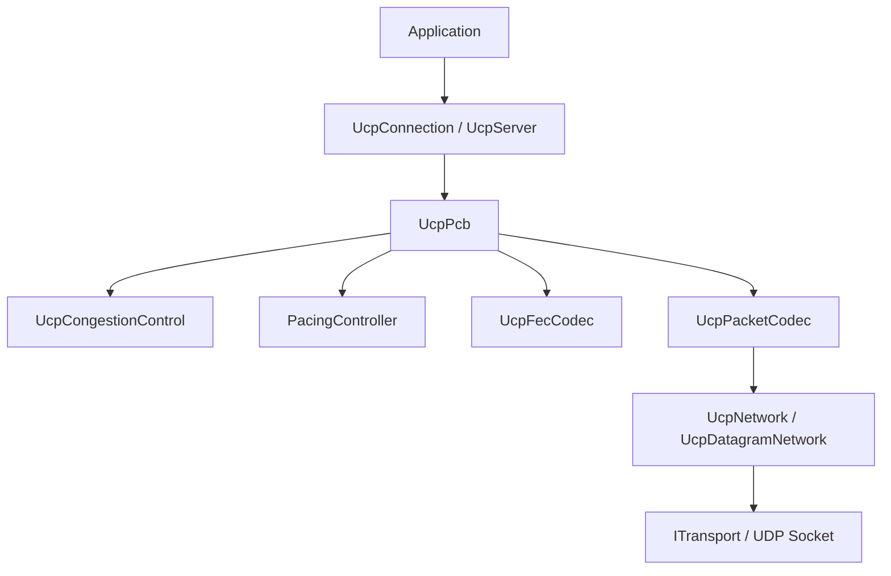
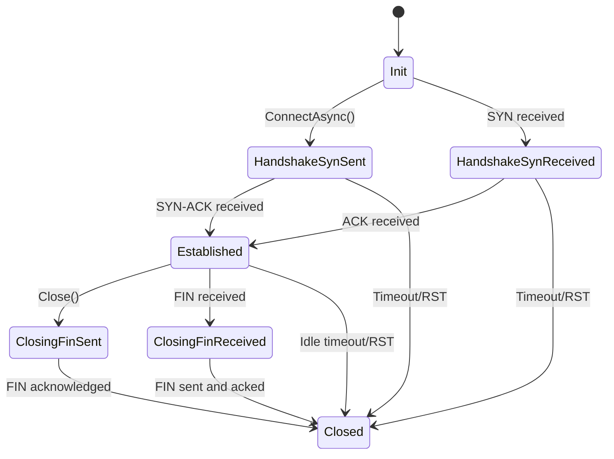

# UCP C++ Implementation

[Chinese](README_CN.md)

UCP (Universal Communication Protocol) is a reliable transport protocol C++ implementation over UDP, using a 3-mode state machine (STARTUP/DRAIN/PROBE_BW) with a geodesic estimator for congestion control. The geodesic estimator is independently implemented (`ucp_cc.cpp`), referencing the KCC three-component RTT decomposition model from the tcp_kcc.c kernel module. The KF (KCC Forwarding) cross-connection bandwidth sharing component is available only in the Linux kernel module (`linux/tcp_kcc.c`). The full 3-mode state machine and all additional features are implemented in user-space. FEC and NAK are UCP protocol features providing cleaner delivery samples to the congestion controller (not part of tcp_kcc.c). The implementation uses C++17, depends on Boost.Asio (header-only) and the platform Socket API, and supports Windows, Linux, and macOS.

## Core Principle

UCP is a pure control protocol: congestion control, CID round-robin switching, and FEC/NAK recovery operate through independent subsystems. FEC and NAK are UCP protocol features providing delivery samples to the congestion control (not part of tcp_kcc.c). Congestion control uses the KCC 3-mode state machine (STARTUP/DRAIN/PROBE_BW) with a geodesic estimator (G1/G2/G3) for propagation delay estimation (fixed structural parameters: p_est_init=1000, scale=1024; p_est is a scalar confidence proxy bounded by [floor=10, max=1,000,000], with fixed gains). MinRTT tracking is handled automatically by geodesic G1/G3. The sendable upper limit is min(cwnd, peer-declared receive window); the initial cwnd is NOT a fixed 10-packet cap. Key features include: the 8-phase gain cycle [1.25, 0.75, 1.0x6], LT bandwidth EMA estimation, ACK aggregation compensation (dual-window measurement with 5-RTT rotation), and ECN-aware backoff (opt-in, disabled by default). The geodesic estimator update function originates from the tcp_kcc.c kernel module; the full 3-mode state machine and all additional features are implemented in user-space C++ code (ucp_cc.cpp).

## Quick Facts

| Property | Value |
|---|---|
| Language | C++17 |
| Dependencies | Boost.Asio (header-only) + platform Socket API |
| Platforms | Windows, Linux, macOS |
| Lines of Code | ~17,400 (src+include; ~29,000 with tests) |
| Max Tested Throughput | 10 Gbps |
| Min RTO | 50 ms (default), 50 ms (floor) |
| UCP Startup Gain | 2.887 (739/256) |
| FEC | RS-GF(256), configurable |
| Recovery Paths | SACK + NAK (three-tier) + FEC + DupACK + RTO |
| Test Pass Rate | 730/730 passing |

## Build System

### Prerequisites

| Component | Minimum Version |
|---|---|
| CMake | 3.16+ |
| Compiler | MSVC 2019+ / GCC 7+ / Clang 7+ |
| Boost | 1.70+ (header-only) |
| OS | Windows 7+ / Linux 3.10+ / macOS 10.15+ |

### Install Boost

```bash
# Windows (vcpkg)
vcpkg install boost

# Linux (apt)
sudo apt install libboost-dev

# macOS (Homebrew)
brew install boost
```

### Build

```bash
cd cpp
cmake -B build -S . -DCMAKE_BUILD_TYPE=Release
cmake --build build
```

### Windows Specific Build

```powershell
cmake -G Ninja -B build -S .
cmake --build build --config Release
```

### Running Examples

```bash
# Terminal 1: Echo server
./build/samples/Release/ucp_echo_server --port 9000 --bandwidth 100

# Terminal 2: Echo client
./build/samples/Release/ucp_echo_client --host 127.0.0.1 --port 9000 --size 10 --bandwidth 100

# Run tests
./build/tests/Release/ucp_tests

# Run benchmarks
./build/samples/Release/ucp_benchmark
```

### Build Targets

| Target | Type | Description |
|---|---|---|
| ucp | Static library | UCP protocol core |
| ucp_tests | Executable | All unit and integration tests |
| ucp_echo_server | Executable | Echo server example |
| ucp_echo_client | Executable | Echo client example |
| ucp_benchmark | Executable | Benchmark suite |
| ucp_benchmark_diag | Executable | Diagnostic benchmark suite |

### CMake Integration

```cmake
add_subdirectory(path/to/ucp/cpp ucp_build)
target_link_libraries(my_app PRIVATE ucp)
```

## Layer Structure Summary

### Six-Layer Structure

| Layer | Core Classes | Responsibility |
|---|---|---|
| Application | UcpServer, UcpConnection | Public API, async I/O |
| Protocol Control | UcpPcb | Per-connection state machine |
| Congestion & Pacing | UcpCongestionControl, PacingController, UcpRtoEstimator | UCP, Token Bucket, RTO |
| Reliability Engine | UcpSackGenerator, NAK FSM, UcpFecCodec | SACK, NAK, FEC |
| Serialization | UcpPacketCodec | Big-endian codec |
| Network Driver | UcpNetwork, UcpDatagramNetwork | Event loop, UDP Socket |



### Threading Model

Each UcpConnection owns a dedicated std::thread (Worker Thread) processing all protocol events through std::deque + std::condition_variable. All PCB state changes execute sequentially on the Worker Thread without locking. UDP recvfrom() runs in an independent receive thread.

## Memory Management

### Unified Allocation

All memory is routed through ucp::Malloc() and ucp::Mfree():

```cpp
void* ucp::Malloc(std::size_t size) noexcept;
void  ucp::Mfree(void* ptr) noexcept;
```

### Shared Pointer Helpers

Objects via make_shared_object, buffers via make_shared_alloc:

```cpp
auto estimator = ucp::make_shared_object<UcpRtoEstimator>(config);
auto buffer = ucp::make_shared_alloc<uint8_t>(65536);
```

Both return std::shared_ptr<T> using Mfree as the custom deleter.

### Container Aliases

All STL containers use ucp:: namespace aliases:

```cpp
ucp::vector<uint8_t>             // std::vector
ucp::string                      // std::string
ucp::shared_ptr<T>               // std::shared_ptr
ucp::unique_ptr<T>               // std::unique_ptr
ucp::map<K,V>                    // std::map
ucp::unordered_map<K,V>          // std::unordered_map
```

## Code Style

### noexcept

All non-throwing functions are declared noexcept: getters, memory allocation functions, factory functions, sequence comparison functions, and transport interfaces.

### NULLPTR Macro

The entire library uses the NULLPTR macro instead of the nullptr keyword:

```cpp
if (NULLPTR == buffer) {
    return;
}
```

### Doxygen Comments

All headers use `/** ... */` Doxygen comment blocks with `@brief`, `@param`, `@return` tags.

## Testing

### Test Categories

| File | Count | Validates |
|---|---|---|
| ucp_core_tests.cpp | 132 | Sequence wrap, codec, RTO, Pacing, UCP, FEC, connection integration, benchmarks |
| ucp_extended_tests.cpp | 413 | Loss recovery, long fat pipe, full duplex, asymmetric routing, satellite, mobile |
| ucp_kcc_alignment_tests.cpp | 185 | Geodesic estimator, state machine, gain cycle, CWND, ECN, alignment |
| **Total** | **730** | Full protocol correctness and performance coverage |

### Running Tests

```bash
./build/tests/Release/ucp_tests
```

Tests use the NetworkSimulator under a virtual logical clock for reproducible results.

## C# Interop Validation

Cross-language interop between C++ client and C# server (and vice versa) has been validated:

| Test Scenario | Result |
|---|---|
| C++ client <> C# server | Connection established, data verified |
| C# client <> C++ server | Connection established, data verified |

Basis: common big-endian wire format, shared protocol specification, transport-independent semantics.

## Cross-Platform

| Platform | Socket API | Compiler |
|---|---|---|
| Windows 10/11 | WinSock2 | MSVC 2019+, clang-cl |
| Linux | POSIX | GCC 7+, Clang 5+ |
| macOS | POSIX | Apple Clang |

Uses C++17 standard features (std::future, std::shared_ptr, std::chrono, std::mt19937), depending only on the standard library and platform Socket API.

## Connection ID Model

UCP identifies connections via random 32-bit Connection IDs rather than IP:port tuples. Clients maintain the same session when switching between Wi-Fi and cellular. Server lookup is O(1) via ConnId to UcpPcb hash map. Connection migration is secured by PATH_CHALLENGE verification.

## Protocol State Machine



## Loss Recovery

Five independent recovery paths:

| Path | Trigger | Latency |
|---|---|---|
| FEC | Sufficient repair packets | Zero RTT |
| SACK | Block observed >= 2 times | Sub-RTT |
| NAK | Gap count >= threshold (2) | Adaptive reorder grace |
| DupACK | Same ACK received 3 times | Sub-RTT |
| RTO | No ACK progress | 50ms-15s |

### NAK Confidence-Guarded Reorder Grace

NAK generation is deferred until a per-missing-sequence reorder grace expires.
The grace is adaptive: `base = max(NAK_REORDER_GRACE(2000us), min(smoothedRTT/2, MinRto))`.
When the missing gap is large, the grace shrinks to a floor:

| Missing Count | Grace |
|---|---|
| < 32 | `base` (adaptive, min 2000us) |
| >= 32 (medium) | `max(base/2, 1000us)` |
| >= 128 (high) | `max(base/2, 1000us)` |

## Congestion Control

### UCP Modes

| Mode | Pacing Gain | CWND Gain | Exit |
|---|---|---|---|
| Startup | 2.887 (739/256) | 2.887 | 3 RTT growth < 25% |
| Drain | 0.344 (88/256) | 2.887 (739/256) | In-flight ≤ 1.0 × BDP AND 1 RTT elapsed (or 4×min_rtt timeout) |
| ProbeBW (Up) | 1.25 | 2.0 | 8-phase cycle |
| ProbeBW (Down) | 0.75 | 2.0 | 8-phase cycle |

FEC (recovered-bytes samples) and NAK (loss-sample data) are UCP protocol features providing delivery samples to the congestion control engine for more accurate bandwidth/delay estimation under packet loss, forming independent but complementary recovery paths. They are not part of the tcp_kcc.c kernel module; instead, they enrich the sample stream consumed by the congestion control algorithm.

## API Reference

### UcpConfiguration (`include/ucp/ucp_configuration.h`)

Tunable parameters for connections and servers: MSS (1220), RTO bounds (50ms-15s), UCP gains (Startup 2.89, ProbeBW 1.25/0.75), FEC settings, buffer sizes, DPLPMTUD. Provides `GetOptimizedConfig()` for platform-tuned defaults and `Clone()` for deep copy.

```cpp
auto config = ucp::UcpConfiguration::GetOptimizedConfig();
config.ServerBandwidthBytesPerSecond = 12500000; // 100 Mbps
config.SetSendBufferSize(64 * 1024 * 1024);
config.FecRedundancy = 0.25; // 25% FEC overhead
```

### UcpConnection (`include/ucp/ucp_connection.h`)

Callback-based async connection with internal serial worker thread. Mirrors `C# UcpConnection` with Proactor pattern.

| Method | Description | C# Equivalent |
|:---|---|---|
| `ConnectAsync(endpoint, callback)` | Initiate handshake (non-blocking) | `ConnectAsync` |
| `Send(buf, offset, count)` | Sync send (may block) | `Send` |
| `Send(buf, offset, count, priority)` | Sync send with QoS | `Send` |
| `SendAsync(buf, offset, count, callback)` | Async send | `SendAsync` |
| `Receive(buf, offset, count)` | Sync receive (may block) | `Receive` |
| `ReceiveAsync(buf, offset, count, callback)` | Async receive | `ReceiveAsync` |
| `Read(buf, offset, count)` | Sync exact-byte read | `Read` |
| `ReadAsync(buf, offset, count, callback)` | Async exact-byte read | `ReadAsync` |
| `Write(buf, offset, count)` | Sync exact-byte write | `Write` |
| `WriteAsync(buf, offset, count, callback)` | Async exact-byte write | `WriteAsync` |
| `Close()` | Sync graceful close | `Close` |
| `CloseAsync(callback)` | Async graceful close | `CloseAsync` |
| `GetReport()` | Statistics snapshot | `GetReport()` |
| `GetRemoteEndpoint()` | Remote peer address | `RemoteEndpoint` |
| `MigrateRemote(endpoint)` | Connection migration | `MigrateRemote` |
| `GetConnectionId()` | Connection ID (IUcpObject) | `ConnectionId` |
| `GetState()` | Current connection state | `State` |
| `GetCurrentPacingRateBytesPerSecond()` | UCP pacing rate | `CurrentPacingRate` |
| `SetOnData(callback)` | Data received handler | `OnData` |
| `SetOnConnected(callback)` | Connection established handler | `OnConnected` |
| `SetOnDisconnected(callback)` | Connection lost handler | `OnDisconnected` |

Callback types (defined in `include/ucp/ucp_types.h`):

```cpp
using ConnectAsyncCallback  = function<void(UcpError, uint32_t connectionId)>;
using SendAsyncCallback     = function<void(UcpError, int32_t bytesSent)>;
using ReceiveAsyncCallback  = function<void(UcpError, int32_t bytesReceived)>;
using WriteAsyncCallback    = function<void(UcpError, bool success)>;
using ReadAsyncCallback     = function<void(UcpError, bool success)>;
using CloseAsyncCallback    = function<void(UcpError)>;
using AcceptAsyncCallback   = function<void(UcpError, UcpConnection*)>;
```

### UcpServer (`include/ucp/ucp_server.h`)

Listens for incoming SYN packets, creates `UcpConnection` objects per accepted connection. Supports standalone mode (owning its own transport) and network-managed mode (within a `UcpNetwork`). Fair-queue bandwidth scheduling distributes the server's total bandwidth budget among active connections proportional to their UCP pacing rates.

```cpp
ucp::UcpServer server(config);
server.Start(port);
server.AcceptAsync([](ucp::UcpError error, ucp::UcpConnection* conn) {
    // Server retains ownership; do NOT delete or wrap conn in unique_ptr
});
server.Stop();
```

### UcpNetwork / UcpDatagramNetwork (`include/ucp/ucp_network.h`, `include/ucp/ucp_datagram_network.h`)

`UcpNetwork` is the central event loop managing timers, PCB registry, and input demultiplexing. `UcpDatagramNetwork` extends it with a Boost.Asio UDP socket (dual-stack IPv4/IPv6). Call `DoEvents()` to advance the protocol engine.

```cpp
auto network = ucp::make_shared_object<UcpDatagramNetwork>(port);
network->DoEvents(); // Tick timers and PCBs
```

### UcpCongestionControl (`include/ucp/ucp_cc.h`)

Congestion control with three modes: Startup (2.89x gain), Drain, ProbeBw (8-phase gain cycle). Geodesic G1/G3 handles min RTT tracking automatically (matches tcp_kcc.c 3-state FSM). Includes ECN-aware backoff (opt-in) and ACK aggregation compensation (dual-window 5-RTT rotation).

```cpp
UcpConfig cfg;
UcpCongestionControl UCP(cfg);
UCP.OnAck(nowMicros, deliveredBytes, sampleRttMicros, flightBytes);
double rate = UCP.PacingRateBytesPerSecond();
int cwnd   = UCP.CongestionWindowBytes();
```

### PacingController (`include/ucp/ucp_pacing.h`)

Token-bucket pacing controller that smooths outbound packet transmission. Driven by UCP bandwidth estimate, bounded by `UcpConfiguration` limits.

```cpp
PacingController pacer(initialRateBytesPerSec);
if (pacer.TryConsume(packetSize, nowMicros)) { /* send */ }
int64_t wait = pacer.GetWaitTimeMicros(packetSize, nowMicros);
```

### UcpTransferReport (`include/ucp/ucp_types.h:115`)

Statistics snapshot: `BytesSent`, `BytesReceived`, `DataPacketsSent`, `RetransmittedPackets`, `LastRttMicros`, `RttSamplesMicros`, `CongestionWindowBytes`, `PacingRateBytesPerSecond`, `MeasuredBandwidthBytesPerSecond`, `EstimatedLossPercent`, `RemoteWindowBytes`. Includes `RetransmissionRatio()` helper.

### IUcpObject, ITransport, IBindableTransport

| Interface | File | Purpose |
|:---|---|---|
| `IUcpObject` | `include/ucp/ucp_network.h:60` | Base for network-managed objects (`GetConnectionId`, `GetNetwork`) |
| `ITransport` | `include/ucp/transport/itransport.h` | Abstract datagram transport (`Send`, `AddOnDatagram` multicast) |
| `IBindableTransport` | `include/ucp/transport/ibindable_transport.h` | Extends `ITransport` with `Start`/`Stop`/`LocalEndpoint` |

## Sample Code

### Echo Server (`samples/echo_server.cpp`)

Full echo server accepting `--port`, `--bandwidth`, `--help`. Mirrors C# `Server/Program.cs`. Uses `UcpDatagramNetwork::CreateServer`, accepts connections via a callback (no worker threads), echoes received data with 5-second periodic statistics (Mbps, RTT, CWND, retransmission ratio).

```cpp
auto config = ucp::UcpConfiguration::GetOptimizedConfig();
config.ServerBandwidthBytesPerSecond = MbpsToBytesPerSec(bandwidth_mbps);

ucp::UcpDatagramNetwork net(config);
auto server = net.CreateServer(port);

// Accept callback with recursive re-arm
ucp::function<void(ucp::UcpError, ucp::UcpConnection*)> on_accept;
on_accept = [&](ucp::UcpError error, ucp::UcpConnection* conn) {
    if (error != ucp::UcpError::None || !conn) return;
    BeginReceive(conn);            // callback-driven echo session
    server->AcceptAsync(on_accept); // Re-arm
};
server->AcceptAsync(on_accept);
```

### Echo Client (`samples/echo_client.cpp`)

Connects to echo server, sends deterministic random data (seed 42), verifies received data via `memcmp`, prints detailed statistics. Mirrors C# `Client/Program.cs`.

```cpp
ucp::UcpConnection client(config);
client.ConnectAsync(remote.ToString(), [&](ucp::UcpError error, uint32_t id) {
    // Connected — start transfer
});
client.WriteAsync(send_data.data(), 0, send_data.size(), callback);
```

### Benchmark (`samples/benchmark.cpp`)

Minimal automated smoke test: connects to localhost, sends 32 KB payload at 100 Mbps, verifies delivery confirmation. No SimPeer or multi-scenario logic. Mirrors C# `Benchmark/Program.cs`.

### Diagnostic Benchmark (`samples/benchmark_diag.cpp`)

Extended performance test: connects to localhost, sends 32 KB payload at 100 Mbps, prints detailed diagnostic report. No SimPeer or multi-scenario logic.

## Equivalence with C# Implementation

### C# Class Equivalence

| C++ Class | C# Equivalent | Header |
|:---|---|---|
| `UcpConfiguration` | `UcpConfiguration` | `include/ucp/ucp_configuration.h` |
| `UcpConnection` | `UcpConnection` | `include/ucp/ucp_connection.h` |
| `UcpServer` | `UcpServer` | `include/ucp/ucp_server.h` |
| `UcpNetwork` | `UcpNetwork` | `include/ucp/ucp_network.h` |
| `UcpDatagramNetwork` | `UcpDatagramNetwork` | `include/ucp/ucp_datagram_network.h` |
| `UcpCongestionControl` | `UcpCongestionControl` | `include/ucp/ucp_cc.h` |
| `PacingController` | `PacingController` | `include/ucp/ucp_pacing.h` |
| `UcpPacketCodec` | `PacketCodec` | `include/ucp/ucp_packet_codec.h` |
| `UcpFecCodec` | `FecCodec` | `include/ucp/ucp_fec_codec.h` |
| `UcpRtoEstimator` | `RtoEstimator` | `include/ucp/ucp_rto_estimator.h` |
| `UcpSackGenerator` | `SackGenerator` | `include/ucp/ucp_sack_generator.h` |
| `UcpTransferReport` | `UcpTransferReport` | `include/ucp/ucp_types.h` |
| `Endpoint` | `Endpoint` | `include/ucp/ucp_types.h` |
| `UcpError` | `UcpError` | `include/ucp/ucp_types.h` |
| `ITransport` | `ITransport` | `include/ucp/transport/itransport.h` |
| `IBindableTransport` | `IBindableTransport` | `include/ucp/transport/ibindable_transport.h` |
| `IUcpObject` | `IUcpObject` | `include/ucp/ucp_network.h` |

### Wire and Algorithm Equivalence

| Component | Status |
|:---|---|---|
| Wire format | Byte-identical, same big-endian encoding |
| Protocol constants | All 77+ values match |
| KCC algorithm | Identical state machine and gains |
| Loss detection | Matching thresholds and recovery paths |
| FEC codec | Compatible RS-GF(256) |

### Differences from C# Implementation

| Aspect | C++ | C# |
|:---|---|---|
| Timer tick | 1 ms | 1 ms |
| Minimum RTO | 50 ms (default), 50 ms (floor) | 50 ms |
| ACK SACK block limit | 2 | 2 |
| Async pattern | Callbacks (Proactor) | Tasks (async/await) |
| Threading | std::thread per connection | ThreadPool / dedicated threads |
| Transport | Boost.Asio | SocketAsyncEventArgs |
| Event loop | DoEvents() | DoEvents() |

These differences do NOT affect cross-language interoperability. Both implementations produce byte-identical wire formats.

Additional C++-specific notes:
- All public methods are `noexcept` — no exceptions cross the library boundary
- The `NULLPTR` macro replaces `nullptr` throughout
- `ucp::vector<T>` is `std::vector<T>` (not a custom type) — aliased for future allocator replacement
- `ucp::optional<T>` is a minimal C++17-compatible implementation (not `std::optional`)
- Connections are non-copyable and non-movable
- `CMakeLists.txt:36` defines `NULLPTR=nullptr` project-wide

## Performance Benchmarks

### NetworkSimulator Test Results

| Scenario | Target | RTT | Loss | Throughput | Utilization |
|---|---|---|---|---|---|
| NoLoss | 100 Mbps | 5ms | 0% | 97.91 Mbps | 97.91% |
| Lossy_1% | 100 Mbps | 10ms | 1% | 97.86 Mbps | 97.86% |
| Lossy_5% | 100 Mbps | 10ms | 5% | 97.83 Mbps | 97.83% |
| LongFatPipe | 100 Mbps | 50ms | 0% | 94.70 Mbps | 94.70% |
| HighJitter | 100 Mbps | 50ms | 0% | 93.35 Mbps | 93.35% |

## Documentation Index

| Document | Description |
|---|---|
| [docs/architecture_EN.md](docs/architecture_EN.md) | Six-layer structure, UcpPcb, Worker Thread, fair queue |
| [docs/protocol_EN.md](docs/protocol_EN.md) | Wire format, 8 packet types, Flags, state machine |
| [docs/api_EN.md](docs/api_EN.md) | UcpConfiguration, UcpServer, UcpConnection API |
| [docs/performance_EN.md](docs/performance_EN.md) | Congestion control details, geodesic estimator, benchmarks |
| [docs/constants_EN.md](docs/constants_EN.md) | 77+ protocol constants by subsystem |
| [docs/index_EN.md](docs/index_EN.md) | Full index, core concepts quick reference |

## Linux Kernel Module

KCC congestion control originates from the Linux kernel `tcp_kcc.c` module, which implements KCC Geodesic Congestion Control as a `tcp_congestion_ops` plugin. The UCP C++ implementation (`ucp_cc.cpp`) independently implements the full 3-mode state machine and geodesic estimator, referencing the KCC three-component RTT decomposition model from the kernel module. See [linux/README.md](../linux/README.md) for details.

## License

MIT — See [LICENSE](../LICENSE) at the project root.

Copyright (c) 2026 PPP PRIVATE NETWORK™ X

PPP PRIVATE NETWORK™ is a trademark of PPP PRIVATE NETWORK.


