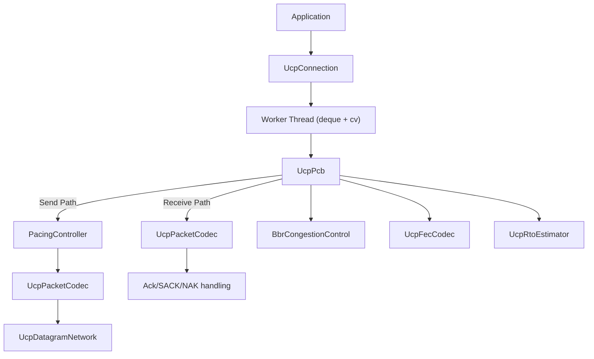

# PPP PRIVATE NETWORK™ X — Universal Communication Protocol (UCP) — C++ Documentation

**Protocol Identifier: `ppp+ucp`**

Welcome to the UCP C++ documentation. This index points to the complete English documentation set.

---

## Documentation Map

| Document | Description |
|---|---|
| [index_EN.md](index_EN.md) | Master index with navigation maps, core concepts overview, BBRv2 gain quick reference, loss classification rules, source file listing, platform support, and protocol feature panorama |
| [architecture_EN.md](architecture_EN.md) | Runtime 6-layer architecture (Application API → UDP Socket), UcpPcb Protocol Control Block, Worker Thread per-connection serial model, Fair Queue server scheduling, PacingController Token Bucket design, BBRv2 congestion control kernel, UcpFecCodec RS-GF(256) codec, UcpDatagramNetwork driver, connection state machine, ISN/ConnId random generation, sequence arithmetic |
| [api_EN.md](api_EN.md) | Complete public API reference: UcpConfiguration (all fields with getters/setters), UcpServer lifecycle (Start/AcceptAsync/Stop), UcpConnection (ConnectAsync/Close/Dispose, Send/SendAsync/Write/WriteAsync, Receive/ReceiveAsync/Read/ReadAsync), event callbacks (SetOnData/SetOnConnected/SetOnDisconnected), UcpTransferReport/UcpConnectionDiagnostics, UcpNetwork/UcpDatagramNetwork event loop, Endpoint/UcpTime utilities, full C++ end-to-end example with CMake |
| [constants_EN.md](constants_EN.md) | Complete constants catalog: Packet encoding (8 constants), RTO & timers (14 constants), Pacing & queue (5 constants), BBRv2 (25+ constants in 6 groups), FEC GF256 (6 constants), Connection & session (5 constants), UcpConfiguration defaults quick reference (30+ fields), recommended configuration rationale, per-scenario tuning |
| [performance_EN.md](performance_EN.md) | BBRv2 congestion control complete details: all internal constants, loss classification mechanism with scoring flowchart, network path classifier, Pacing controller performance, RTO estimator with TCP comparison table, FEC complexity analysis, performance benchmark expectations (15 scenarios), convergence characteristics, TCP/QUIC comparison, performance tuning guide with common pitfalls |
| [protocol_EN.md](protocol_EN.md) | Wire format specification: common header layout, 8 packet types, Flags bit layout, HasAckNumber piggybacked ACK model, detailed packet layouts (DATA/ACK/NAK/FecRepair/Control), big-endian encoding (UcpPacketCodec), sequence arithmetic (UcpSequenceComparer), connection state machine, three-way handshake, loss detection & recovery multi-path decision tree, NAK three-tier confidence, BBRv2 state machine with exact C++ gain values, congestion scoring system, FEC mathematical foundation & Gaussian elimination |

---

## Quick Links

### Core Concepts



### BBRv2 Gains (C++ Values)

| Mode | Pacing Gain | CWND Gain |
|---|---|---|
| Startup | 2.89 | 2.0 |
| Drain | 1.0 | — |
| ProbeBW (Up) | 1.35 | 2.0 |
| ProbeBW (Down) | 0.85 | 2.0 |
| ProbeBW (Cruise) | 1.0 | 2.0 |
| ProbeRTT | 0.85 | 4 packets |

### Loss Classification

| Signal | Threshold | Score |
|---|---|---|
| Delivery Rate Drop | ≥ 15% | +1 |
| RTT Increase | ≥ 50% | +1 |
| Loss Rate | ≥ 10% | +1 |
| **Total ≥ 2** | → | **Congestion (Pacing ×0.98)** |
| RTT Increase < 20% | → | **Random Loss (Pacing ×1.25)** |

---

## Key Implementation Features

| Feature | Implementation |
|---|---|
| Random Numbers | `std::mt19937_64` + `std::random_device` |
| Serial Model | `std::deque` + `std::condition_variable` + `std::thread` |
| Big-Endian | `ReadUInt32`/`WriteUInt32` manual bit ops |
| Network Layer | Cross-platform WinSock2/POSIX UDP |
| Time | `std::chrono::steady_clock` |
| GF(256) FEC | 256-entry log + 512-entry antilog precomputed tables |
| Language Standard | C++17, zero external dependencies |

---

## Build

```powershell
cmake -B build -S .
cmake --build build --config Release
```

### Platform Support

| Platform | Socket API | Compiler |
|---|---|---|
| Windows | WinSock2 | MSVC / clang-cl |
| Linux | POSIX | GCC / Clang |
| macOS | POSIX | Apple Clang |

---

## Performance Summary

| Property | Value |
|---|---|
| Max Throughput | 10 Gbps |
| Min Latency | <100µs |
| Max Tested RTT | 300ms |
| Max Tested Loss | 10% |
| Initial RTO | 100ms |
| Min RTO | 20ms |
| CWND Floor | 0.95 × BDP |
| Congestion Response | 0.98× |
| Recovery Step | 0.08/ACK (0.15 Mobile) |
| FEC Field | GF(256) |
| Convergence (No Loss) | 2-5 RTT |
| Convergence (With Loss) | +1-2 RTT/burst |
