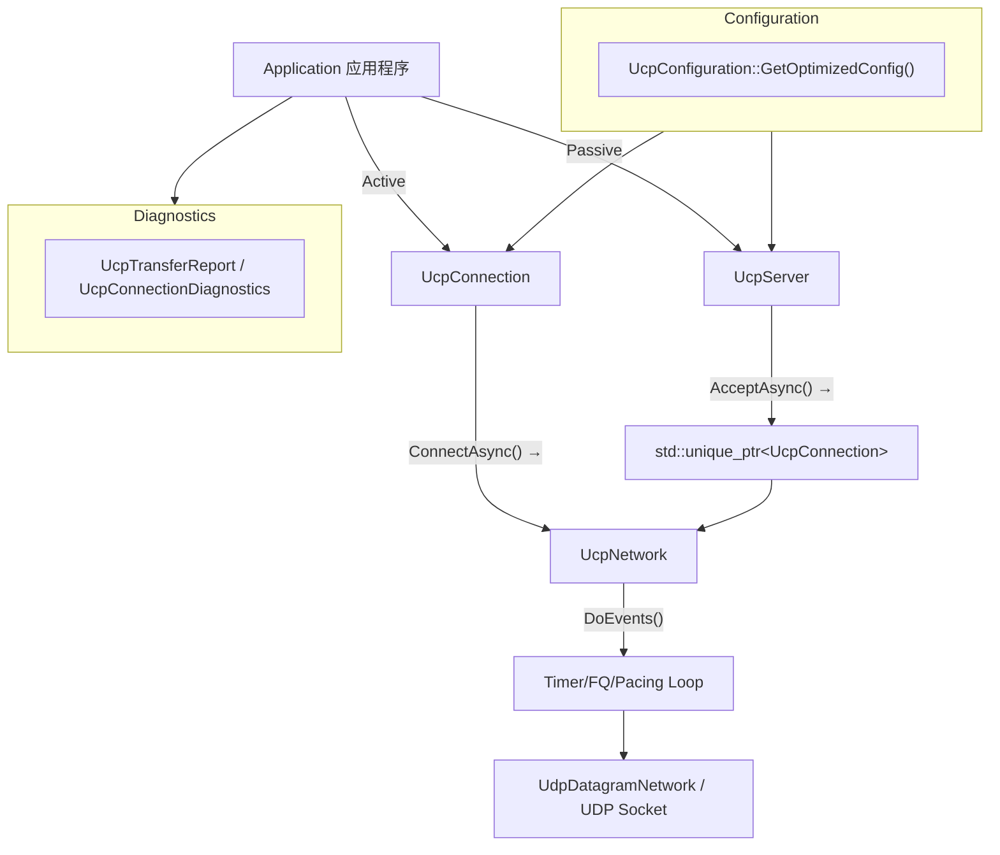

# PPP PRIVATE NETWORK™ X — 通用通信协议 (UCP) — C++ API 参考

**协议标识: `ppp+ucp`** — 本文档详尽描述 UCP C++ 库的公开 API 接口，覆盖 UcpConfiguration 全部可配参数、UcpServer 被动连接生命周期、UcpConnection 双向数据传输与诊断、UcpNetwork 事件循环驱动、以及 UcpDatagramNetwork 跨平台传输层集成。所有 API 与 `cpp/include/ucp/` 中头文件精确匹配。

---

## API 架构总览

UCP C++ 暴露三大入口类和一组配置工厂：



---

## UcpConfiguration — 配置结构体

`UcpConfiguration` 定义在 `ucp_configuration.h`。静态方法 `GetOptimizedConfig()` 返回推荐默认配置。

### 公开成员字段

| 字段 | 类型 | C++ 默认值 | 说明 |
|---|---|---|---|
| `Mss` | `int` | 1220 | 最大分段大小（字节）。200–9000 可配置。 |
| `MaxRetransmissions` | `int` | 10 | 每个出站分段最大重传次数。超限后连接判定死亡。 |
| `MinRtoMicros` | `int64_t` | 50000 (50ms) | 最小重传超时（微秒）。 |
| `MaxRtoMicros` | `int64_t` | 15000000 (15s) | 最大重传超时（微秒）。 |
| `RetransmitBackoffFactor` | `double` | 1.2 | 连续超时 RTO 乘数。 |
| `ProbeRttIntervalMicros` | `int64_t` | 30000000 (30s) | BBRv2 ProbeRTT 触发间隔。 |
| `ProbeRttDurationMicros` | `int64_t` | 100000 (100ms) | ProbeRTT 最短持续时间。 |
| `KeepAliveIntervalMicros` | `int64_t` | 1000000 (1s) | 空闲连接保活间隔。 |
| `DisconnectTimeoutMicros` | `int64_t` | 4000000 (4s) | 空闲断连超时。 |
| `TimerIntervalMilliseconds` | `int` | 1 | 内部定时器刻度间隔（毫秒）。 |
| `FairQueueRoundMilliseconds` | `int` | 10 | 公平队列每轮时长（毫秒）。 |
| `ServerBandwidthBytesPerSecond` | `int` | 12500000 (100Mbps) | 服务端出口带宽。 |
| `ConnectTimeoutMilliseconds` | `int` | 5000 | 连接超时（毫秒）。 |
| `InitialBandwidthBytesPerSecond` | `int64_t` | 12500000 (100Mbps) | 初始带宽估计。 |
| `MaxPacingRateBytesPerSecond` | `int64_t` | 12500000 (100Mbps) | Pacing 速率天花板。设为 0 关闭上限。 |
| `MaxCongestionWindowBytes` | `int` | 64 MB | BBRv2 拥塞窗口硬上限。 |
| `InitialCwndPackets` | `int` | 20 | 初始拥塞窗口（包数）。 |
| `RecvWindowPackets` | `int` | 16384 | 接收窗口（包数）。 |
| `SendQuantumBytes` | `int` | 1220 | Pacing Token 单次消费粒度。 |
| `AckSackBlockLimit` | `int` | 2 | 每 ACK 包最大 SACK 块数。 |
| `LossControlEnable` | `bool` | `true` | 启用丢包感知 Pacing/CWND 自适应。 |
| `EnableDebugLog` | `bool` | `false` | 启用调试日志输出。 |
| `EnableAggressiveSackRecovery` | `bool` | `true` | 启用激进 SACK 恢复策略。 |
| `FecRedundancy` | `double` | 0.0 | 基础 RS-GF(256) 冗余比例。0.0 = FEC 禁用。 |
| `FecGroupSize` | `int` | 8 | 每 FEC 组 DATA 包数量。2–64。 |

### Getter/Setter 方法

| 方法 | 返回类型 | 对应字段 |
|---|---|---|
| `SendBufferSize()` / `SetSendBufferSize(int)` | `int` | 发送缓冲大小（默认 32 MB） |
| `ReceiveBufferSize()` / `SetReceiveBufferSize(int)` | `int` | 接收缓冲大小 |
| `InitialCwndBytes()` / `SetInitialCwndBytes(uint32_t)` | `uint32_t` | 以字节指定初始 CWND |
| `MinRtoUs()` / `SetMinRtoUs(int64_t)` | `int64_t` | 最小 RTO（微秒） |
| `MaxRtoUs()` / `SetMaxRtoUs(int64_t)` | `int64_t` | 最大 RTO（微秒） |
| `RtoBackoffFactor()` / `SetRtoBackoffFactor(double)` | `double` | RTO 退避因子 |
| `DelayedAckTimeoutMicros()` / `SetDelayedAckTimeoutMicros(int64_t)` | `int64_t` | 延迟 ACK 超时（默认 100µs） |
| `MaxBandwidthWastePercent()` / `SetMaxBandwidthWastePercent(double)` | `double` | 带宽浪费预算（默认 0.25） |
| `MaxBandwidthLossPercent()` / `SetMaxBandwidthLossPercent(double)` | `double` | 丢包预算百分比（默认 25.0） |
| `MinPacingIntervalMicros()` / `SetMinPacingIntervalMicros(int64_t)` | `int64_t` | 最小 Pacing 间隔（默认 0） |
| `PacingBucketDurationMicros()` / `SetPacingBucketDurationMicros(int64_t)` | `int64_t` | Bucket 时间窗口（默认 10000µs） |
| `BbrWindowRtRounds()` / `SetBbrWindowRtRounds(int)` | `int` | BtlBw 滤波窗口 RTT 轮数（默认 10） |
| `BbrMinRttWindowMicros()` / `SetBbrMinRttWindowMicros(int64_t)` | `int64_t` | MinRtt 窗口（同 ProbeRttIntervalMicros） |

### BBRv2 增益 Getter/Setter

| 方法 | 默认值 | 说明 |
|---|---|---|
| `StartupPacingGain()` / `SetStartupPacingGain(double)` | **2.89** | BBRv2 Startup Pacing 增益 |
| `StartupCwndGain()` / `SetStartupCwndGain(double)` | 2.0 | BBRv2 Startup CWND 增益 |
| `DrainPacingGain()` / `SetDrainPacingGain(double)` | **1.0** | BBRv2 Drain Pacing 增益 |
| `ProbeBwHighGain()` / `SetProbeBwHighGain(double)` | **1.35** | ProbeBW 上探增益 |
| `ProbeBwLowGain()` / `SetProbeBwLowGain(double)` | 0.85 | ProbeBW 下探增益 |
| `ProbeBwCwndGain()` / `SetProbeBwCwndGain(double)` | 2.0 | ProbeBW CWND 增益 |

### 传递参数

| 方法 | 说明 |
|---|---|
| `MaxPayloadSize()` | 返回 `Mss - 20` = 1200（每个 DATA 包最大应用负载） |
| `MaxAckSackBlocks()` | 返回每 ACK 最大 SACK 块数 |
| `ReceiveWindowBytes()` | 返回接收窗口字节数 |
| `InitialCongestionWindowBytes()` | 返回初始 CWND 字节数 |
| `EffectiveMinRtoMicros()` | 返回有效最小 RTO |
| `EffectiveMaxRtoMicros()` | 返回有效最大 RTO |
| `EffectiveRetransmitBackoffFactor()` | 返回有效退避因子 |
| `EffectiveMaxBandwidthLossPercent()` | 返回有效丢包预算 |
| `Clone()` | 深拷贝配置 |
| `CopyTo(UcpConfiguration& target)` | 复制到目标配置 |
| `GetOptimizedConfig()` | **静态方法**，返回推荐默认值 |

---

## UcpConnection — 连接 API

定义在 `ucp_connection.h`，代表单个 UCP 会话端点。

```mermaid
flowchart TD
    Conn["UcpConnection"] --> Mgmt["Connection Management"]
    Conn --> Send["Sending Data"]
    Conn --> Recv["Receiving Data"]
    Conn --> Events["Event Callbacks"]
    Conn --> Diag["Diagnostics"]
    
    Mgmt --> Connect["ConnectAsync(remoteEndpoint)"]
    Mgmt --> ConnectEx["ConnectAsync(network, remoteEndpoint)"]
    Mgmt --> Close["Close() / CloseAsync()"]
    Mgmt --> Dispose["Dispose()"]
    
    Send --> SendApi["Send / SendAsync<br/>(with optional UcpPriority)"]
    Send --> WriteApi["Write / WriteAsync<br/>(with optional UcpPriority)"]
    
    Recv --> RecvApi["Receive / ReceiveAsync"]
    Recv --> ReadApi["Read / ReadAsync"]
    
    Events --> OnData["SetOnData(DataCallback)"]
    Events --> OnConn["SetOnConnected(StateCallback)"]
    Events --> OnDisc["SetOnDisconnected(StateCallback)"]
    
    Diag --> GetReport["GetReport()"]
    Diag --> GetRTT["通过 PCB 访问"]
    Diag --> GetCWND["通过 PCB 访问"]
```



### 回调类型定义

```cpp
using DataCallback = std::function<void(const uint8_t* data, size_t offset, size_t length)>;
using StateCallback = std::function<void()>;
```

### 连接管理方法

| 方法 | 返回值/签名 | 说明 |
|---|---|---|
| `ConnectAsync(const std::string& remoteEndpoint)` | `std::future<bool>` | 发起连接。`remoteEndpoint` 格式为 `"host:port"`（通过 `Endpoint::Parse` 说明）。触发 Worker Thread 启动，随机生成 ISN（`mt19937_64`）和 ConnId。future 在握手完成时 resolve。 |
| `ConnectAsync(UcpNetwork* network, const std::string& remoteEndpoint)` | `std::future<bool>` | 通过指定网络实例发起连接。用于与 `UcpServer` 共享网络层。 |
| `Close()` | `void` | 同步发起 FIN 优雅关闭。 |
| `CloseAsync()` | `std::future<void>` | 异步发起优雅关闭，发送 FIN 后等待。 |
| `Dispose()` | `void` | 释放所有资源，停止 Worker Thread，清理 PCB。 |

### 发送数据方法

| 方法 | 签名 | 说明 |
|---|---|---|
| `Send(buf, offset, count)` | `int` | 同步发送。返回实际入列字节数。 |
| `Send(buf, offset, count, priority)` | `int` | 带优先级同步发送。`UcpPriority`: Background(0)/Normal(1)/Interactive(2)/Urgent(3)。 |
| `SendAsync(buf, offset, count)` | `std::future<int>` | 异步发送。future 返回入列字节数。 |
| `SendAsync(buf, offset, count, priority)` | `std::future<int>` | 带优先级异步发送。 |
| `Write(buf, off, count)` | `bool` | 同步可靠写入。缓冲满时阻塞等待。 |
| `Write(buf, off, count, priority)` | `bool` | 带优先级可靠写入。 |
| `WriteAsync(buf, off, count)` | `std::future<bool>` | 异步可靠写入。缓冲满时 await。 |
| `WriteAsync(buf, off, count, priority)` | `std::future<bool>` | 带优先级异步可靠写入。 |

优先级编码在 `ucp_enums.h`:

```cpp
enum class UcpPriority : uint8_t {
    Background  = 0,  // 0x00 in PriorityMask
    Normal      = 1,  // 0x10 in PriorityMask
    Interactive = 2,  // 0x20 in PriorityMask
    Urgent      = 3,  // 0x30 in PriorityMask
};
```

`Send`/`SendAsync` 是非阻塞的：立即将数据入列到发送缓冲，不等待远端确认。`Write`/`WriteAsync` 是可靠写入：发送缓冲满时阻塞/等待直到空间可用，保证数据被发送缓冲接受。

### 接收数据方法

| 方法 | 签名 | 说明 |
|---|---|---|
| `Receive(buf, offset, count)` | `int` | 同步从有序交付队列读取。返回实际读取字节数（可能 < count）。 |
| `ReceiveAsync(buf, offset, count)` | `std::future<int>` | 异步读取。至少 1 字节可用时完成。 |
| `Read(buf, off, count)` | `bool` | 同步精读。内部循环调用 Receive 直到 count 字节读取完毕。 |
| `ReadAsync(buf, off, count)` | `std::future<bool>` | 异步精读。所有 count 字节到达后完成。适用固定长度协议。 |

### 事件回调

| 方法 | 回调类型 | 触发时机 |
|---|---|---|
| `SetOnData(DataCallback cb)` | `(const uint8_t*, size_t, size_t)` | 有序 payload 字节到达，在 Worker Thread 上调用 |
| `SetOnConnected(StateCallback cb)` | `void()` | 三次握手完成，连接进入 Established |
| `SetOnDisconnected(StateCallback cb)` | `void()` | 连接关闭（FIN 完成或超时/RST） |

### 诊断 API

| 方法/属性 | 返回类型 | 说明 |
|---|---|---|
| `GetReport()` | `UcpTransferReport` | 当前传输统计完整快照（见 `ucp_types.h`） |
| `GetConnectionId()` | `uint32_t` | 本会话的 32 位随机连接标识 |
| `GetRemoteEndPoint()` | `std::string` | 远端端点字符串（格式 `"host:port"`） |
| `GetState()` | `UcpConnectionState` | 当前连接状态枚举值 |
| `GetNetwork()` | `UcpNetwork*` | 关联网络实例 |

```cpp
// UcpTransferReport (ucp_types.h)
struct UcpTransferReport {
    int64_t BytesSent;
    int64_t BytesReceived;
    int32_t DataPacketsSent;
    int32_t RetransmittedPackets;
    int32_t AckPacketsSent;
    int32_t NakPacketsSent;
    int32_t FastRetransmissions;
    int32_t TimeoutRetransmissions;
    int64_t LastRttMicros;
    std::vector<int64_t> RttSamplesMicros;
    int32_t CongestionWindowBytes;
    double PacingRateBytesPerSecond;
    double EstimatedLossPercent;
    uint32_t RemoteWindowBytes;

    double RetransmissionRatio() const {
        return DataPacketsSent == 0 ? 0.0
            : static_cast<double>(RetransmittedPackets) / DataPacketsSent;
    }
};
```

### UcpConnectionDiagnostics (ucp_types.h)

用于内部诊断的详细快照，包含完整的连接状态视图：

```cpp
struct UcpConnectionDiagnostics {
    int State;
    int32_t FlightBytes;
    uint32_t RemoteWindowBytes;
    int32_t BufferedReceiveBytes;
    int64_t BytesSent;
    int64_t BytesReceived;
    int32_t SentDataPackets;
    int32_t RetransmittedPackets;
    int32_t SentAckPackets;
    int32_t SentNakPackets;
    int32_t SentRstPackets;
    int32_t FastRetransmissions;
    int32_t TimeoutRetransmissions;
    int32_t CongestionWindowBytes;
    double PacingRateBytesPerSecond;
    double EstimatedLossPercent;
    int64_t LastRttMicros;
    std::vector<int64_t> RttSamplesMicros;
    bool ReceivedReset;
    int32_t CurrentNetworkClass;
};
```

---

## UcpServer — 服务端 API

定义在 `ucp_server.h`:

```cpp
class UcpServer {
public:
    UcpServer();
    explicit UcpServer(const UcpConfiguration& config);
    ~UcpServer();

    void Start(int port);
    void Start(UcpNetwork* network, int port, const UcpConfiguration& config);
    std::future<std::unique_ptr<UcpConnection>> AcceptAsync();
    void Stop();
    void Dispose();

    uint32_t GetConnectionId() const;
    UcpNetwork* GetNetwork() const;
};
```

### 服务端生命周期

```mermaid
sequenceDiagram
    participant App as "Application"
    participant Svr as "UcpServer"
    participant Cli as "Remote Client"
    
    App->>Svr: "new UcpServer(config)"
    App->>Svr: "Start(port)"
    
    Cli->>Svr: "SYN (ConnId=X, ISN)"
    Svr->>Svr: "GetOrCreateConnection()<br/>Validate ConnId"
    Svr->>Cli: "SYNACK (ConnId=X, ServerISN, HasAckNumber)"
    
    Cli->>Svr: "ACK"
    Svr->>Svr: "State → Established<br/>Push to accept_queue_"
    Svr->>App: "AcceptAsync() returns unique_ptr&lt;UcpConnection&gt;"
    
    App->>Svr: "Stop()"
    Svr->>Svr: "Graceful shutdown of all connections<br/>Clear accept queue"
```

### 方法列表

| 方法 | 返回值 | 说明 |
|---|---|---|
| `Start(int port)` | `void` | 在指定 UDP 端口开始监听。自动创建内部 `UcpDatagramNetwork`。 |
| `Start(UcpNetwork* network, int port, const UcpConfiguration& config)` | `void` | 通过已有网络实例监听，支持多路复用。 |
| `AcceptAsync()` | `std::future<std::unique_ptr<UcpConnection>>` | 等待新客户端连接，返回已完成握手的连接。在独立线程中阻塞等待 accept_queue_。若无挂起连接则等待。 |
| `Stop()` | `void` | 停止监听并优雅关闭所有托管连接。每个连接排空在途数据后关闭。设置 `stopped_` 标志。 |
| `Dispose()` | `void` | 释放所有资源。 |

### 公平队列内部结构

`UcpServer` 内部维护：

```cpp
std::map<uint32_t, std::unique_ptr<ConnectionEntry>> connections_;
std::queue<UcpConnection*> accept_queue_;
std::condition_variable accept_cv_;
int fair_queue_start_index_ = 0;
int64_t last_fair_queue_round_micros_ = 0;
uint32_t fair_queue_timer_id_ = 0;
```

`ConnectionEntry` 结构：

```cpp
struct ConnectionEntry {
    std::unique_ptr<UcpConnection> connection;
    UcpPcb* pcb = nullptr;
    bool accepted = false;
};
```

`ScheduleFairQueueRound()` 使用 `UcpNetwork::AddTimer()` 注册 10ms 间隔的信用轮转。`OnFairQueueRoundCore()` 遍历 `connections_` 分配信用。

---

## UcpNetwork — 网络驱动 API

定义在 `ucp_network.h`:

```cpp
class UcpNetwork {
public:
    explicit UcpNetwork(const UcpConfiguration& config);
    UcpNetwork();
    virtual ~UcpNetwork();

    UcpConfiguration& GetConfiguration();
    virtual int DoEvents();

    void Input(const uint8_t* data, size_t length, const Endpoint& remote);
    virtual void Start(int port);
    virtual void Stop();
    virtual void Output(const uint8_t* data, size_t length,
                        const Endpoint& remote, IUcpObject* sender) = 0;

    uint32_t AddTimer(int64_t expireUs, std::function<void()> callback);
    bool CancelTimer(uint32_t timerId);

    std::unique_ptr<UcpServer> CreateServer(int port);
    std::unique_ptr<UcpConnection> CreateConnection();
    std::unique_ptr<UcpConnection> CreateConnection(const UcpConfiguration& config);

    int64_t GetNowMicroseconds() const;
    int64_t GetCurrentTimeUs() const;
    virtual Endpoint GetLocalEndPoint() const;
    virtual void Dispose();
};
```

### IUcpObject 接口

```cpp
class IUcpObject {
public:
    virtual ~IUcpObject() = default;
    virtual uint32_t GetConnectionId() const = 0;
    virtual UcpNetwork* GetNetwork() const = 0;
};
```

### DoEvents — 事件循环心跳

`DoEvents()` 是 UCP 网络层的心跳。执行以下操作：

- 从 `recv_thread_` 缓冲处理入站数据报
- 分发定时器到期回调（`timer_heap_`）
- 执行公平队列 credit 轮次
- 刷新由 Pacing 排队的出站数据报

### UcpDatagramNetwork — UDP 传输实现

定义在 `ucp_datagram_network.h`，继承 `UcpNetwork`:

```cpp
class UcpDatagramNetwork : public UcpNetwork {
public:
    UcpDatagramNetwork();
    explicit UcpDatagramNetwork(int port);
    explicit UcpDatagramNetwork(const UcpConfiguration& config);
    UcpDatagramNetwork(const std::string& localAddress, int port);
    UcpDatagramNetwork(const std::string& localAddress, int port, const UcpConfiguration& config);

    ~UcpDatagramNetwork() override;
    void Output(const uint8_t* data, size_t length, const Endpoint& remote,
                IUcpObject* sender) override;
    void Start(int port) override;
    void Start(const std::string& localAddress, int port);
    void Stop() override;
    Endpoint GetLocalEndPoint() const override;
    void Dispose() override;
};
```

内部维护 `SOCKET socket_` 和 `std::thread recv_thread_`。`Start(int port)` 调用 `EnsureSocket()` + `StartReceiveLoop()`。`CreateSocket()` 使用 `bind()` 绑定指定端口。

跨平台兼容：
- Windows: WinSock2 (`winsock2.h`, `ws2tcpip.h`)
- Linux/macOS: POSIX socket (`sys/socket.h`, `arpa/inet.h`)


---

## Endpoint 类型

定义在 `ucp_types.h`:

```cpp
struct Endpoint {
    std::string address;
    uint16_t port;

    Endpoint();
    Endpoint(const std::string& addr, uint16_t p);
    static Endpoint Parse(const std::string& str);
    std::string ToString() const;
};
```

`Endpoint::Parse("host:port")` 说明字符串格式端点为地址+端口。`ToString()` 返回 `"address:port"` 格式字符串。

---

## UcpTime — 时间工具

```cpp
class UcpTime {
public:
    UcpTime() = delete;
    static int64_t ReadStopwatchMicroseconds();
    static int64_t NowMicroseconds();
};
```

提供独立于连接的微秒精度时间工具。

---

## 完整端到端 C++ 示例

```cpp
#include "ucp/ucp_configuration.h"
#include "ucp/ucp_connection.h"
#include "ucp/ucp_server.h"
#include <iostream>
#include <string>
#include <thread>
#include <chrono>

int main() {
    ucp::UcpConfiguration config = ucp::UcpConfiguration::GetOptimizedConfig();
    config.ServerBandwidthBytesPerSecond = 12500000; // 100 Mbps
    config.FecRedundancy = 0.125;
    config.Mss = 1220;

    // ========== Server ==========
    ucp::UcpServer server(config);
    server.Start(9000);
    auto accept_future = server.AcceptAsync();

    // ========== Client ==========
    auto client = std::make_unique<ucp::UcpConnection>(config);
    client->SetOnConnected([]() { std::cout << "[Client] Connected!" << std::endl; });
    client->SetOnData([](const uint8_t* data, size_t offset, size_t length) {
        std::string msg(reinterpret_cast<const char*>(data + offset), length);
        std::cout << "[Client] Received: " << msg << std::endl;
    });

    auto connect_future = client->ConnectAsync("127.0.0.1:9000");
    connect_future.wait();
    auto server_conn = accept_future.get();

    // ========== Bidirectional Data ==========
    const char* msg = "Hello PPP PRIVATE NETWORK X - UCP (ppp+ucp)!";
    auto write_future = client->WriteAsync(
        reinterpret_cast<const uint8_t*>(msg), 0, strlen(msg));
    write_future.wait();

    std::vector<uint8_t> buf(strlen(msg));
    auto read_future = server_conn->ReadAsync(buf.data(), 0, buf.size());
    read_future.wait();
    std::cout << "Server received: " 
              << std::string(buf.begin(), buf.end()) << std::endl;

    // ========== Diagnostics ==========
    ucp::UcpTransferReport report = client->GetReport();
    std::cout << "Bytes Sent: " << report.BytesSent << std::endl;
    std::cout << "Retrans Ratio: " << report.RetransmissionRatio() << std::endl;
    std::cout << "CWND Bytes: " << report.CongestionWindowBytes << std::endl;
    std::cout << "Pacing Rate: " << report.PacingRateBytesPerSecond << " B/s" << std::endl;

    // ========== Cleanup ==========
    client->Close();
    server_conn->Close();
    server.Stop();

    return 0;
}
```

---

## 错误处理

| 异常/错误 | 触发条件 | 恢复建议 |
|---|---|---|
| `UcpException` | 协议级失败：握手超时、重传超限、连接被拒绝 | 重试连接（合理退避）、检查可达性 |
| `std::future` 返回 `false` | `ConnectAsync` 失败，`WriteAsync` 被取消 | 检查连接状态，在断开后重新连接 |
| `std::future` 返回 `nullptr` | `AcceptAsync` 在服务端停止后返回 | 检查服务端生命周期 |
| Socket 错误 | UDP Socket 绑定失败、网络不可达 | 端口冲突时更换端口、检查网络配置 |

`SetOnDisconnected` 回调对优雅关闭和错误关闭均触发。回调在工作线程上调用，因此回调内部调用连接方法是安全的（但需避免在回调中同步等待 future）。

---

## 构建与集成

```cmake
# CMakeLists.txt
add_library(ucp STATIC
    src/ucp_bbr.cpp
    src/ucp_configuration.cpp
    src/ucp_connection.cpp
    src/ucp_datagram_network.cpp
    src/ucp_fec_codec.cpp
    src/ucp_network.cpp
    src/ucp_pacing.cpp
    src/ucp_packet_codec.cpp
    src/ucp_pcb.cpp
    src/ucp_rto_estimator.cpp
    src/ucp_sack_generator.cpp
    src/ucp_server.cpp
    src/ucp_time.cpp
)
target_include_directories(ucp PUBLIC include)
target_link_libraries(ucp PUBLIC ws2_32)  # Windows only
```

UCP C++ 库为 header-only 配置结构体 + 编译库源文件。整个协议引擎零外部依赖，仅需 C++17 标准库 + 平台 Socket API。
