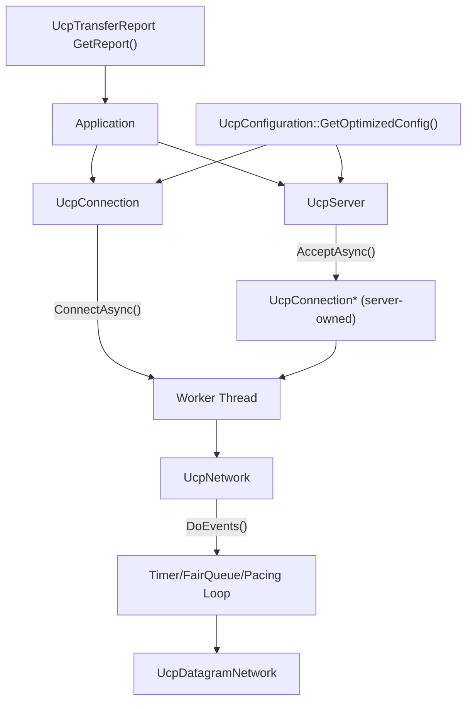

# UCP C++ API 参考

[English](api_EN.md)

本文档详尽描述 UCP C++ 库的全部公开 API，涵盖 UcpConfiguration、UcpServer、UcpConnection、UcpNetwork/UcpDatagramNetwork 和 UcpTransferReport。所有接口与 `cpp/include/ucp/` 中头文件精确匹配。

## API 概览

UCP C++ API 围绕三大核心类组织：UcpConfiguration 提供全部可调参数的一站式配置入口，UcpServer 管理服务端连接接受和公平队列带宽调度，UcpConnection 代表单个 UCP 会话端点，内置专属 Worker Thread 处理所有协议事件。

API 支持同步和异步两种调用模式。Send/Receive 系列为非阻塞方法，入列后立即返回，结果通过回调交付。Write/Read 系列在缓冲满时阻塞调用方线程，适用于对时延敏感的场景。ConnectAsync/AcceptAsync 接受一个回调，握手完成后回调被调用（基于回调的 Proactor 模式；不分配 std::future）。

UcpTransferReport 结构体提供完整的连接诊断信息，包括发送和接收字节数、重传包数、当前拥塞窗口大小、Pacing 速率和实时吞吐量估算。UcpPriority 枚举支持四级优先级（Background、Normal、Interactive、Urgent），编码在 Flags 字节的高 2 位。紧急重传通过 ForceConsume 机制绕过令牌桶检查，确保极限条件下的低延迟交付。

全部公开接口均为线程安全实现，ConnectAsync、Send、Write、Close 和 Dispose 可从任意线程安全调用。回调方法（OnData、OnConnected、OnDisconnected）由 Worker Thread 触发执行，回调内部不应执行阻塞操作以避免延迟协议事件处理。


```mermaid
flowchart TD
    App["Application"] --> Server["UcpServer"]
    App --> Client["UcpConnection"]
    Server -->|"AcceptAsync()"| ServerConn["UcpConnection* (server-owned)"]
    Client -->|"ConnectAsync()"| Worker["Worker Thread"]
    ServerConn --> Worker
    Worker --> Net["UcpNetwork"]
    Net -->|"DoEvents()"| Loop["Timer/FairQueue/Pacing Loop"]
    Loop --> Socket["UcpDatagramNetwork"]
    Factory["UcpConfiguration::GetOptimizedConfig()"] --> Server
    Factory --> Client
    Report["UcpTransferReport GetReport()"] --> App
```

## UcpConfiguration

定义在 `ucp_configuration.h`。使用 `GetOptimizedConfig()` 工厂方法获取推荐默认值。

### 公开字段

| 字段 | 类型 | C++ 默认值 | 范围 | 说明 |
|---|---|---|---|---|
| Mss | int | 1220 | 200-9000 | 最大分段大小 |
| MaxRetransmissions | int | 10 | 3-100 | 最大重传尝试次数 |
| MinRtoMicros | int64_t | 50000 (50ms) | 50000-1000000 | 默认 RTO (50ms)；绝对最小值为 50ms（MIN_RTO_MICROS） |
| MaxRtoMicros | int64_t | 15000000 (15s) | 1M-60M | 最大 RTO |
| RetransmitBackoffFactor | double | 1.2 | 1.1-2.0 | RTO 退避乘数 |
| KeepAliveIntervalMicros | int64_t | 1000000 (1s) | 100K-30M | 保活间隔 |
| DisconnectTimeoutMicros | int64_t | 4000000 (4s) | 500K-60M | 断连超时 |
| TimerIntervalMilliseconds | int | 1 | 1-100 | 定时器刻度 |
| FairQueueRoundMilliseconds | int | 10 | -- | 公平队列轮次间隔 |
| ServerBandwidthBytesPerSecond | int | 12500000 | -- | 服务端出口带宽 |
| ConnectTimeoutMilliseconds | int | 5000 | -- | 连接超时 |
| InitialBandwidthBytesPerSecond | int64_t | 12500000 | 125K-1.25G | UCP 初始带宽 |
| MaxPacingRateBytesPerSecond | int64_t | 12500000 | 0=无上限 | Pacing 速率上限 |
| MaxCongestionWindowBytes | int | 64 MB | 64K-256M | CWND 硬上限 |
| InitialCwndPackets | int | **10** | 4-200 | 初始 CWND (包) |
| RecvWindowPackets | int | 4096 | -- | 接收窗口 (包) |
| SendQuantumBytes | int | 1220 | MSS-MSS*4 | Pacing 单次消费粒度 |
| AckSackBlockLimit | int | 2 | 1-255 | 每 ACK 最大 SACK 块数 |
| LossControlEnable | bool | true | -- | 启用丢包感知控制 |
| EnableDebugLog | bool | false | -- | 调试日志 |
| EnableAggressiveSackRecovery | bool | true | -- | 激进 SACK 快速重传 |
| EnableMtuDiscovery | bool | true | -- | DPLPMTUD 探测 |
| MtuProbeMax | int | 1500 | -- | MTU 探测最大值 |
| FecRedundancy | double | 0.0 | 0.0-1.0 | FEC 冗余比例 |
| FecGroupSize | int | 8 | 2-64 | FEC 组大小 |

### 缓冲区与计算属性

| 方法 | 说明 |
|---|---|
| SendBufferSize() / SetSendBufferSize() | 发送缓冲大小（默认 32 MB） |
| ReceiveBufferSize() / SetReceiveBufferSize() | 接收缓冲大小 |
| InitialCwndBytes() / SetInitialCwndBytes() | 初始 CWND（字节） |
| DelayedAckTimeoutMicros() / SetDelayedAckTimeoutMicros() | 延迟 ACK 超时（默认 100us） |
| MaxBandwidthWastePercent() / SetMaxBandwidthWastePercent() | 最大带宽浪费比例（0.25） |
| MaxBandwidthLossPercent() / SetMaxBandwidthLossPercent() | 最大带宽损失百分比（25%） |
| MinPacingIntervalMicros() / SetMinPacingIntervalMicros() | 最小包间隔（0=无最小） |
| PacingBucketDurationMicros() / SetPacingBucketDurationMicros() | Token Bucket 窗口（10ms） |
| MaxPayloadSize() | 最大应用负载（1200） |
| MaxAckSackBlocks() | 最大 SACK 块数 |
| ReceiveWindowBytes() | 接收窗口（字节） |
| InitialCongestionWindowBytes() | 初始 CWND（字节） |
| EffectiveMinRtoMicros() / EffectiveMaxRtoMicros() | 有效 RTO 边界 |
| Clone() | 深拷贝配置 |
| CopyTo() | 复制到另一个配置 |

可发送上限为 min(cwnd, 对端宣告的接收窗口)；初始 cwnd 并非固定的 10 包上限。初始拥塞窗口设定控制器的起始目标值，但对端宣告的 `WindowSize` 才是在途字节的权威硬上限（标准 TCP/QUIC 流量控制）。

### GetOptimizedConfig() 工厂方法

```cpp
static UcpConfiguration GetOptimizedConfig() noexcept;
```

返回平台优化的配置实例。在 Windows 上自动配置 WinSock2，在 POSIX 上使用标准 Socket API。

## UcpServer

定义在 `ucp_server.h`，管理服务端连接接受和公平队列调度。

```cpp
class UcpServer : public IUcpObject {
public:
    UcpServer();
    explicit UcpServer(const UcpConfiguration& config);
    ~UcpServer();

    void Start(int port);
    void Start(UcpNetwork* network, int port, const UcpConfiguration& config);
    void AcceptAsync(AcceptAsyncCallback callback);
    void Stop();
    void Dispose();

    uint32_t GetConnectionId() const override;    // 返回 0
    UcpNetwork* GetNetwork() const override;      // 返回 network_
};
```

### 服务端生命周期

1. 构造：UcpServer(config)
2. Start(port)：绑定 UDP Socket，启动接收线程
3. AcceptAsync(callback)：握手完成后调用回调
4. 公平队列：DoEvents() 中每 10ms 自动调度
5. Stop()：关闭活跃连接，释放 Socket
6. Dispose()：释放内部资源

AcceptAsync() 的回调在 Stop() 后以 UcpError::ShuttingDown 和 NULLPTR 连接调用。

## UcpConnection

定义在 `ucp_connection.h`，代表单个 UCP 会话端点。每个连接拥有专属 Worker Thread。

```cpp
class UcpConnection : public IUcpObject {
public:
    using DataCallback = std::function<void(const uint8_t*, size_t, size_t)>;
    using StateCallback = std::function<void()>;

    // 构造函数（8 种公开重载）
    UcpConnection();
    explicit UcpConnection(const UcpConfiguration& config);
    explicit UcpConnection(ITransport* transport);
    UcpConnection(ITransport* transport, bool ownsTransport);
    UcpConnection(ITransport* transport, bool ownsTransport,
                  const UcpConfiguration& config, UcpNetwork* network);
    UcpConnection(ITransport* transport, bool ownsTransport, bool serverManaged,
                  const UcpConfiguration& config, UcpNetwork* network);
    UcpConnection(UcpPcb* pcb, ITransport* transport, const UcpConfiguration& config);
    UcpConnection(UcpPcb* pcb, ITransport* transport,
                  const UcpConfiguration& config, UcpNetwork* network);
    ~UcpConnection();

    // 连接管理
    void ConnectAsync(const ucp::string& remoteEndpoint, ConnectAsyncCallback callback);
    void ConnectAsync(UcpNetwork* network, const ucp::string& remoteEndpoint, ConnectAsyncCallback callback);
    void Close();
    void CloseAsync(CloseAsyncCallback callback);
    void Dispose();

    // 发送（支持 UcpPriority）
    int  Send(const uint8_t* buf, size_t offset, size_t count);
    int  Send(const uint8_t* buf, size_t offset, size_t count, UcpPriority priority);
    void SendAsync(const uint8_t* buf, size_t offset, size_t count, SendAsyncCallback callback);
    void SendAsync(const uint8_t* buf, size_t offset, size_t count, UcpPriority priority, SendAsyncCallback callback);
    bool Write(const uint8_t* buf, size_t off, size_t count);
    bool Write(const uint8_t* buf, size_t off, size_t count, UcpPriority priority);
    void WriteAsync(const uint8_t* buf, size_t off, size_t count, WriteAsyncCallback callback);
    void WriteAsync(const uint8_t* buf, size_t off, size_t count, UcpPriority priority, WriteAsyncCallback callback);

    // 接收
    int  Receive(uint8_t* buf, size_t offset, size_t count);
    void ReceiveAsync(uint8_t* buf, size_t offset, size_t count, ReceiveAsyncCallback callback);
    bool Read(uint8_t* buf, size_t off, size_t count);
    void ReadAsync(uint8_t* buf, size_t off, size_t count, ReadAsyncCallback callback);

    // 事件回调
    void SetOnData(DataCallback cb);
    void SetOnConnected(StateCallback cb);
    void SetOnDisconnected(StateCallback cb);

    // 诊断
    UcpTransferReport GetReport() const;
    ucp::string GetRemoteEndpoint() const noexcept;
    uint32_t GetConnectionId() const override;
    UcpNetwork* GetNetwork() const override;
    UcpConnectionState GetState() const;
    double GetCurrentPacingRateBytesPerSecond() const;
    bool HasPendingSendData() const;
};
```

### 发送/接收 API 区别

| 方法 | 行为 |
|---|---|
| Send / SendAsync | 非阻塞，入列到发送缓冲 |
| Write / WriteAsync | 缓冲满时阻塞调用方线程 |

### UcpPriority 优先级

```cpp
enum class UcpPriority : uint8_t {
    Background  = 0,  // 批量数据
    Normal      = 1,  // 默认
    Interactive = 2,  // 聊天、RPC
    Urgent      = 3,  // 时间关键数据
};
```

优先级编码在 Flags 字节的 Bits 4-5。紧急重传的 ForceConsume 优先级高于任何 UcpPriority。

### 线程安全保证

| 方法 | 线程安全 |
|---|---|
| ConnectAsync / Send / Write / Close / Dispose | 任意线程安全 |
| Receive / Read | 阻塞调用方线程 |
| SetOnData / SetOnConnected / SetOnDisconnected | 在 Worker Thread 触发 |
| GetReport / GetState / GetConnectionId | 只读，安全 |

回调内部不应执行阻塞操作，否则阻塞该连接的所有协议处理。

## UcpTransferReport

```cpp
struct UcpTransferReport {
    int64_t  BytesSent;
    int64_t  BytesReceived;
    int32_t  DataPacketsSent;
    int32_t  RetransmittedPackets;
    int32_t  AckPacketsSent;
    int32_t  NakPacketsSent;
    int32_t  FastRetransmissions;
    int32_t  TimeoutRetransmissions;
    int64_t  LastRttMicros;
    std::vector<int64_t> RttSamplesMicros;
    int32_t  CongestionWindowBytes;
    double   PacingRateBytesPerSecond;
    double   MeasuredBandwidthBytesPerSecond;
    double   EstimatedLossPercent;
    uint32_t RemoteWindowBytes;

    double RetransmissionRatio() const;
};
```

## UcpNetwork / UcpDatagramNetwork

```cpp
class UcpNetwork {
public:
    explicit UcpNetwork(const UcpConfiguration& config);
    virtual ~UcpNetwork();

    UcpConfiguration& GetConfiguration();
    virtual int DoEvents();
    void Input(const uint8_t* data, size_t length, const Endpoint& remote);
    virtual void Start(int port);
    virtual void Stop();
    virtual void Output(const uint8_t* data, size_t length,
                        const Endpoint& remote, IUcpObject* sender) = 0;

    uint32_t AddTimer(int64_t expireUs, std::function<void()> callback);
    bool CancelTimer(uint32_t timerId);

    ucp::shared_ptr<UcpServer> CreateServer(int port);
    ucp::shared_ptr<UcpConnection> CreateConnection();
};

class UcpDatagramNetwork : public UcpNetwork {
public:
    void Output(...) override;
    void Start(int port) override;
    void Stop() override;
    void Dispose() override;
};
```

## 完整端到端示例

```cpp
#include "ucp/ucp_configuration.h"
#include "ucp/ucp_connection.h"
#include "ucp/ucp_server.h"
#include <iostream>
#include <vector>
#include <cstring>

int main() {
    auto config = ucp::UcpConfiguration::GetOptimizedConfig();
    config.ServerBandwidthBytesPerSecond = 12500000;

    ucp::UcpServer server(config);
    server.Start(9000);
    ucp::UcpConnection* server_conn = nullptr;
    server.AcceptAsync([&](ucp::UcpError e, ucp::UcpConnection* c) {
        if (e == ucp::UcpError::None && c != nullptr) { server_conn = c; }
    });

    auto client = std::make_unique<ucp::UcpConnection>(config);
    client->SetOnConnected([]() { std::cout << "Connected!" << std::endl; });
    bool connected = false;
    client->ConnectAsync("127.0.0.1:9000",
        [&connected](ucp::UcpError e, uint32_t) { connected = (e == ucp::UcpError::None); });

    const char* msg = "Hello UCP!";
    bool wrote = false;
    client->WriteAsync(reinterpret_cast<const uint8_t*>(msg), 0, static_cast<int>(strlen(msg)),
        [&wrote](ucp::UcpError, bool ok) { wrote = ok; });

    std::vector<uint8_t> buf(strlen(msg));
    bool readOk = false;
    if (server_conn) {
        server_conn->ReadAsync(buf.data(), 0, static_cast<int>(buf.size()),
            [&readOk](ucp::UcpError, bool ok) { readOk = ok; });
    }
    std::cout << "Server received: " << std::string(buf.begin(), buf.end()) << std::endl;

    auto report = client->GetReport();
    std::cout << "Throughput: " << report.MeasuredBandwidthBytesPerSecond * 8 / 1e6
              << " Mbps, Retrans: " << report.RetransmissionRatio() * 100 << "%" << std::endl;

    client->Close();
    server_conn->Close();
    server.Stop();
    return 0;
}
```

## CMake 构建集成

```cmake
cmake_minimum_required(VERSION 3.14)
project(ucp_sample LANGUAGES CXX)
set(CMAKE_CXX_STANDARD 17)

add_subdirectory(path/to/ucp/cpp ucp_build)
target_link_libraries(my_app PRIVATE ucp)
```

| 目标 | 类型 | 说明 |
|---|---|---|
| ucp | 静态库 | 核心协议库 |
| ucp_tests | 可执行文件 | 单元/集成测试 |
| ucp_echo_server | 可执行文件 | Echo 服务端 |
| ucp_echo_client | 可执行文件 | Echo 客户端 |
| ucp_benchmark | 可执行文件 | 基准测试 |
| ucp_benchmark_diag | 可执行文件 | 含诊断输出的基准测试 |

## 错误处理

| 错误类型 | 触发条件 | 建议 |
|---|---|---|
| callback(UcpError::ConnectTimeout, ...) | ConnectAsync 握手失败 | 检查远端可达性 |
| callback(UcpError::ShuttingDown, nullptr) | Stop() 后调用 AcceptAsync | 检查服务端生命周期 |
| callback(UcpError::InternalError, ...) | 协议违规、超 MaxRetransmissions | 监听 OnDisconnected |
| Socket 错误 | 端口被占用 | 更换端口 |

## 自定义传输集成

继承 UcpNetwork 并重写 Output() 纯虚函数，或使用 UcpConnection(ITransport* transport, ...) 构造函数。ownsTransport 参数控制传输对象生命周期。

## 相关文档

- [architecture_CN.md](architecture_CN.md) — 运行时层次结构
- [protocol_CN.md](protocol_CN.md) — 协议规范
- [performance_CN.md](performance_CN.md) — 性能特征
- [constants_CN.md](constants_CN.md) — 协议常量
- [README_CN.md](../README_CN.md) — 项目介绍
- [Linux 内核模块](../../linux/README.md) — KCC Geodesic Congestion Control 内核模块（tcp_kcc.c v2.0，含 KCC Forwarding (KF) 跨连接带宽共享组件）

---

## 许可证与商标

MIT 许可证。完整文本见 [LICENSE](../../LICENSE)。

版权所有 (c) 2026 PPP PRIVATE NETWORK™ X

PPP PRIVATE NETWORK™ 是 PPP PRIVATE NETWORK 的商标。
