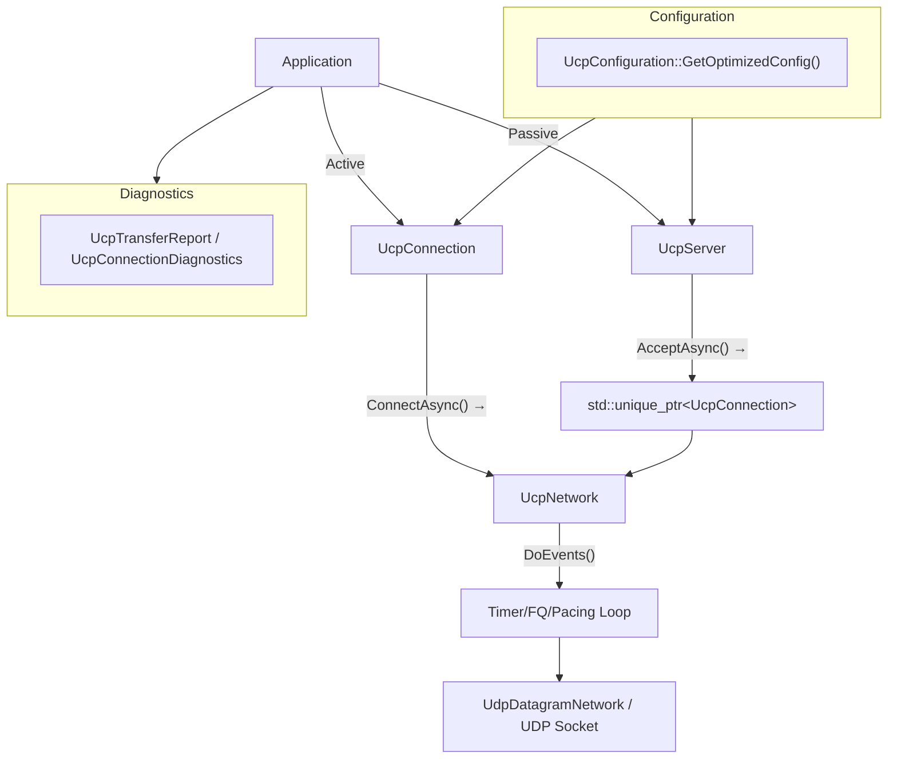

# PPP PRIVATE NETWORK™ X — Universal Communication Protocol (UCP) — C++ API Reference

**Protocol Identifier: `ppp+ucp`** — This document provides a comprehensive description of the UCP C++ library's public API interfaces, covering all configurable parameters of UcpConfiguration, the UcpServer passive connection lifecycle, UcpConnection bidirectional data transfer and diagnostics, UcpNetwork event loop driving, and UcpDatagramNetwork cross-platform transport layer integration. All APIs match the header files in `cpp/include/ucp/` exactly.

---

## API Architecture Overview

UCP C++ exposes three primary entry classes and a configuration factory:



---

## UcpConfiguration — Configuration Structure

`UcpConfiguration` is defined in `ucp_configuration.h`. The static method `GetOptimizedConfig()` returns recommended default configuration.

### Public Member Fields

| Field | Type | C++ Default | Description |
|---|---|---|---|
| `Mss` | `int` | 1220 | Maximum segment size (bytes). Configurable 200–9000. |
| `MaxRetransmissions` | `int` | 10 | Maximum retransmissions per outbound segment. Connection declared dead on exceed. |
| `MinRtoMicros` | `int64_t` | 50000 (50ms) | Minimum retransmission timeout (microseconds). |
| `MaxRtoMicros` | `int64_t` | 15000000 (15s) | Maximum retransmission timeout (microseconds). |
| `RetransmitBackoffFactor` | `double` | 1.2 | Consecutive timeout RTO multiplier. |
| `ProbeRttIntervalMicros` | `int64_t` | 30000000 (30s) | BBRv2 ProbeRTT trigger interval. |
| `ProbeRttDurationMicros` | `int64_t` | 100000 (100ms) | ProbeRTT minimum duration. |
| `KeepAliveIntervalMicros` | `int64_t` | 1000000 (1s) | Idle connection keep-alive interval. |
| `DisconnectTimeoutMicros` | `int64_t` | 4000000 (4s) | Idle disconnect timeout. |
| `TimerIntervalMilliseconds` | `int` | 1 | Internal timer tick interval (milliseconds). |
| `FairQueueRoundMilliseconds` | `int` | 10 | Fair queue per-round duration (milliseconds). |
| `ServerBandwidthBytesPerSecond` | `int` | 12500000 (100Mbps) | Server egress bandwidth. |
| `ConnectTimeoutMilliseconds` | `int` | 5000 | Connection timeout (milliseconds). |
| `InitialBandwidthBytesPerSecond` | `int64_t` | 12500000 (100Mbps) | Initial bandwidth estimate. |
| `MaxPacingRateBytesPerSecond` | `int64_t` | 12500000 (100Mbps) | Pacing rate ceiling. Set to 0 to disable cap. |
| `MaxCongestionWindowBytes` | `int` | 64 MB | BBRv2 congestion window hard ceiling. |
| `InitialCwndPackets` | `int` | 20 | Initial congestion window (packets). |
| `RecvWindowPackets` | `int` | 16384 | Receive window (packets). |
| `SendQuantumBytes` | `int` | 1220 | Pacing Token per-consumption granularity. |
| `AckSackBlockLimit` | `int` | 2 | Maximum SACK blocks per ACK packet. |
| `LossControlEnable` | `bool` | `true` | Enable loss-aware Pacing/CWND adaptation. |
| `EnableDebugLog` | `bool` | `false` | Enable debug log output. |
| `EnableAggressiveSackRecovery` | `bool` | `true` | Enable aggressive SACK recovery strategy. |
| `FecRedundancy` | `double` | 0.0 | Base RS-GF(256) redundancy ratio. 0.0 = FEC disabled. |
| `FecGroupSize` | `int` | 8 | DATA packets per FEC group. 2–64. |

### Getter/Setter Methods

| Method | Return Type | Corresponding Field |
|---|---|---|
| `SendBufferSize()` / `SetSendBufferSize(int)` | `int` | Send buffer size (default 32 MB) |
| `ReceiveBufferSize()` / `SetReceiveBufferSize(int)` | `int` | Receive buffer size |
| `InitialCwndBytes()` / `SetInitialCwndBytes(uint32_t)` | `uint32_t` | Specify initial CWND in bytes |
| `MinRtoUs()` / `SetMinRtoUs(int64_t)` | `int64_t` | Minimum RTO (microseconds) |
| `MaxRtoUs()` / `SetMaxRtoUs(int64_t)` | `int64_t` | Maximum RTO (microseconds) |
| `RtoBackoffFactor()` / `SetRtoBackoffFactor(double)` | `double` | RTO backoff factor |
| `DelayedAckTimeoutMicros()` / `SetDelayedAckTimeoutMicros(int64_t)` | `int64_t` | Delayed ACK timeout (default 100µs) |
| `MaxBandwidthWastePercent()` / `SetMaxBandwidthWastePercent(double)` | `double` | Bandwidth waste budget (default 0.25) |
| `MaxBandwidthLossPercent()` / `SetMaxBandwidthLossPercent(double)` | `double` | Loss budget percent (default 25.0) |
| `MinPacingIntervalMicros()` / `SetMinPacingIntervalMicros(int64_t)` | `int64_t` | Minimum pacing interval (default 0) |
| `PacingBucketDurationMicros()` / `SetPacingBucketDurationMicros(int64_t)` | `int64_t` | Bucket time window (default 10000µs) |
| `BbrWindowRtRounds()` / `SetBbrWindowRtRounds(int)` | `int` | BtlBw filter window RTT rounds (default 10) |
| `BbrMinRttWindowMicros()` / `SetBbrMinRttWindowMicros(int64_t)` | `int64_t` | MinRtt window (same as ProbeRttIntervalMicros) |

### BBRv2 Gain Getters/Setters

| Method | Default Value | Description |
|---|---|---|
| `StartupPacingGain()` / `SetStartupPacingGain(double)` | **2.89** | BBRv2 Startup Pacing gain |
| `StartupCwndGain()` / `SetStartupCwndGain(double)` | 2.0 | BBRv2 Startup CWND gain |
| `DrainPacingGain()` / `SetDrainPacingGain(double)` | **1.0** | BBRv2 Drain Pacing gain |
| `ProbeBwHighGain()` / `SetProbeBwHighGain(double)` | **1.35** | ProbeBW probe-up gain |
| `ProbeBwLowGain()` / `SetProbeBwLowGain(double)` | 0.85 | ProbeBW probe-down gain |
| `ProbeBwCwndGain()` / `SetProbeBwCwndGain(double)` | 2.0 | ProbeBW CWND gain |

### Derived Parameters

| Method | Description |
|---|---|
| `MaxPayloadSize()` | Returns `Mss - 20` = 1200 (maximum application payload per DATA packet) |
| `MaxAckSackBlocks()` | Returns maximum SACK blocks per ACK |
| `ReceiveWindowBytes()` | Returns receive window in bytes |
| `InitialCongestionWindowBytes()` | Returns initial CWND in bytes |
| `EffectiveMinRtoMicros()` | Returns effective minimum RTO |
| `EffectiveMaxRtoMicros()` | Returns effective maximum RTO |
| `EffectiveRetransmitBackoffFactor()` | Returns effective backoff factor |
| `EffectiveMaxBandwidthLossPercent()` | Returns effective loss budget |
| `Clone()` | Thoroughly copies the configuration |
| `CopyTo(UcpConfiguration& target)` | Copies to a target configuration |
| `GetOptimizedConfig()` | **Static method**, returns recommended defaults |

---

## UcpConnection — Connection API

Defined in `ucp_connection.h`, represents a single UCP session endpoint.

```mermaid
flowchart TD
    Conn["UcpConnection"] --> Mgmt["Connection Management"]
    Conn --> Send["Sending Data"]
    Conn --> Recv["Receiving Data"]
    Conn --> Events["Event Callbacks"]
    Conn --> Diag["Diagnostics"]
    
    Mgmt --> Connect["ConnectAsync(remoteEndpoint)"]
    Mgmt --> ConnectEx["ConnectAsync(network, remoteEndpoint)"]
    Mgmt --> Close["Close() / CloseAsync()"]
    Mgmt --> Dispose["Dispose()"]
    
    Send --> SendApi["Send / SendAsync<br/>(with optional UcpPriority)"]
    Send --> WriteApi["Write / WriteAsync<br/>(with optional UcpPriority)"]
    
    Recv --> RecvApi["Receive / ReceiveAsync"]
    Recv --> ReadApi["Read / ReadAsync"]
    
    Events --> OnData["SetOnData(DataCallback)"]
    Events --> OnConn["SetOnConnected(StateCallback)"]
    Events --> OnDisc["SetOnDisconnected(StateCallback)"]
    
    Diag --> GetReport["GetReport()"]
    Diag --> GetRTT["Via PCB access"]
    Diag --> GetCWND["Via PCB access"]
```



### Callback Type Definitions

```cpp
using DataCallback = std::function<void(const uint8_t* data, size_t offset, size_t length)>;
using StateCallback = std::function<void()>;
```

### Connection Management Methods

| Method | Return/Signature | Description |
|---|---|---|
| `ConnectAsync(const std::string& remoteEndpoint)` | `std::future<bool>` | Initiates a connection. `remoteEndpoint` format is `"host:port"` (parsed via `Endpoint::Parse`). Triggers Worker Thread startup, random ISN (`mt19937_64`) and ConnId generation. Future resolves on handshake completion. |
| `ConnectAsync(UcpNetwork* network, const std::string& remoteEndpoint)` | `std::future<bool>` | Initiates connection through a specified network instance. Used for sharing the network layer with `UcpServer`. |
| `Close()` | `void` | Synchronously initiate FIN graceful close. |
| `CloseAsync()` | `std::future<void>` | Asynchronously initiate graceful close; sends FIN then waits. |
| `Dispose()` | `void` | Release all resources, stop Worker Thread, clean up PCB. |

### Send Data Methods

| Method | Signature | Description |
|---|---|---|
| `Send(buf, offset, count)` | `int` | Synchronous send. Returns actual number of bytes enqueued. |
| `Send(buf, offset, count, priority)` | `int` | Synchronous send with priority. `UcpPriority`: Background(0)/Normal(1)/Interactive(2)/Urgent(3). |
| `SendAsync(buf, offset, count)` | `std::future<int>` | Asynchronous send. Future returns number of bytes enqueued. |
| `SendAsync(buf, offset, count, priority)` | `std::future<int>` | Asynchronous send with priority. |
| `Write(buf, off, count)` | `bool` | Synchronous reliable write. Blocks/wait when buffer is full. |
| `Write(buf, off, count, priority)` | `bool` | Reliable write with priority. |
| `WriteAsync(buf, off, count)` | `std::future<bool>` | Asynchronous reliable write. Awaits when buffer is full. |
| `WriteAsync(buf, off, count, priority)` | `std::future<bool>` | Asynchronous reliable write with priority. |

Priority encoding in `ucp_enums.h`:

```cpp
enum class UcpPriority : uint8_t {
    Background  = 0,  // 0x00 in PriorityMask
    Normal      = 1,  // 0x10 in PriorityMask
    Interactive = 2,  // 0x20 in PriorityMask
    Urgent      = 3,  // 0x30 in PriorityMask
};
```

`Send`/`SendAsync` are non-blocking: data is immediately enqueued to the send buffer without waiting for remote acknowledgment. `Write`/`WriteAsync` are reliable writes: they block/wait when the send buffer is full until space becomes available, guaranteeing that data is accepted by the send buffer.

### Receive Data Methods

| Method | Signature | Description |
|---|---|---|
| `Receive(buf, offset, count)` | `int` | Synchronous read from ordered delivery queue. Returns actual bytes read (may be < count). |
| `ReceiveAsync(buf, offset, count)` | `std::future<int>` | Asynchronous read. Completes when at least 1 byte is available. |
| `Read(buf, off, count)` | `bool` | Synchronous exact read. Internally loops calling Receive until count bytes are read. |
| `ReadAsync(buf, off, count)` | `std::future<bool>` | Asynchronous exact read. Completes when all count bytes arrive. Suitable for fixed-length protocols. |

### Event Callbacks

| Method | Callback Type | Trigger |
|---|---|---|
| `SetOnData(DataCallback cb)` | `(const uint8_t*, size_t, size_t)` | Ordered payload bytes arrive, invoked on the Worker Thread |
| `SetOnConnected(StateCallback cb)` | `void()` | Three-way handshake completes, connection enters Established |
| `SetOnDisconnected(StateCallback cb)` | `void()` | Connection closes (FIN complete or timeout/RST) |

### Diagnostics API

| Method/Property | Return Type | Description |
|---|---|---|
| `GetReport()` | `UcpTransferReport` | Complete snapshot of current transfer statistics (see `ucp_types.h`) |
| `GetConnectionId()` | `uint32_t` | 32-bit random connection identifier for this session |
| `GetRemoteEndPoint()` | `std::string` | Remote endpoint string (format `"host:port"`) |
| `GetState()` | `UcpConnectionState` | Current connection state enum value |
| `GetNetwork()` | `UcpNetwork*` | Associated network instance |

```cpp
// UcpTransferReport (ucp_types.h)
struct UcpTransferReport {
    int64_t BytesSent;
    int64_t BytesReceived;
    int32_t DataPacketsSent;
    int32_t RetransmittedPackets;
    int32_t AckPacketsSent;
    int32_t NakPacketsSent;
    int32_t FastRetransmissions;
    int32_t TimeoutRetransmissions;
    int64_t LastRttMicros;
    std::vector<int64_t> RttSamplesMicros;
    int32_t CongestionWindowBytes;
    double PacingRateBytesPerSecond;
    double EstimatedLossPercent;
    uint32_t RemoteWindowBytes;

    double RetransmissionRatio() const {
        return DataPacketsSent == 0 ? 0.0
            : static_cast<double>(RetransmittedPackets) / DataPacketsSent;
    }
};
```

### UcpConnectionDiagnostics (ucp_types.h)

Detailed snapshot for internal diagnostics with a complete view of connection state:

```cpp
struct UcpConnectionDiagnostics {
    int State;
    int32_t FlightBytes;
    uint32_t RemoteWindowBytes;
    int32_t BufferedReceiveBytes;
    int64_t BytesSent;
    int64_t BytesReceived;
    int32_t SentDataPackets;
    int32_t RetransmittedPackets;
    int32_t SentAckPackets;
    int32_t SentNakPackets;
    int32_t SentRstPackets;
    int32_t FastRetransmissions;
    int32_t TimeoutRetransmissions;
    int32_t CongestionWindowBytes;
    double PacingRateBytesPerSecond;
    double EstimatedLossPercent;
    int64_t LastRttMicros;
    std::vector<int64_t> RttSamplesMicros;
    bool ReceivedReset;
    int32_t CurrentNetworkClass;
};
```

---

## UcpServer — Server API

Defined in `ucp_server.h`:

```cpp
class UcpServer {
public:
    UcpServer();
    explicit UcpServer(const UcpConfiguration& config);
    ~UcpServer();

    void Start(int port);
    void Start(UcpNetwork* network, int port, const UcpConfiguration& config);
    std::future<std::unique_ptr<UcpConnection>> AcceptAsync();
    void Stop();
    void Dispose();

    uint32_t GetConnectionId() const;
    UcpNetwork* GetNetwork() const;
};
```

### Server Lifecycle

```mermaid
sequenceDiagram
    participant App as "Application"
    participant Svr as "UcpServer"
    participant Cli as "Remote Client"
    
    App->>Svr: "new UcpServer(config)"
    App->>Svr: "Start(port)"
    
    Cli->>Svr: "SYN (ConnId=X, ISN)"
    Svr->>Svr: "GetOrCreateConnection()<br/>Validate ConnId"
    Svr->>Cli: "SYNACK (ConnId=X, ServerISN, HasAckNumber)"
    
    Cli->>Svr: "ACK"
    Svr->>Svr: "State → Established<br/>Push to accept_queue_"
    Svr->>App: "AcceptAsync() returns unique_ptr&lt;UcpConnection&gt;"
    
    App->>Svr: "Stop()"
    Svr->>Svr: "Graceful shutdown of all connections<br/>Clear accept queue"
```

### Method List

| Method | Return Value | Description |
|---|---|---|
| `Start(int port)` | `void` | Begin listening on the specified UDP port. Auto-creates an internal `UcpDatagramNetwork`. |
| `Start(UcpNetwork* network, int port, const UcpConfiguration& config)` | `void` | Listen through an existing network instance, enabling multiplexing. |
| `AcceptAsync()` | `std::future<std::unique_ptr<UcpConnection>>` | Wait for a new client connection, returning a handshake-completed connection. Blocks on accept_queue_ in a separate thread. Waits if no pending connections. |
| `Stop()` | `void` | Stop listening and gracefully shut down all managed connections. Each connection drains in-flight data then closes. Sets the `stopped_` flag. |
| `Dispose()` | `void` | Release all resources. |

### Fair Queue Internal Structure

`UcpServer` internally maintains:

```cpp
std::map<uint32_t, std::unique_ptr<ConnectionEntry>> connections_;
std::queue<UcpConnection*> accept_queue_;
std::condition_variable accept_cv_;
int fair_queue_start_index_ = 0;
int64_t last_fair_queue_round_micros_ = 0;
uint32_t fair_queue_timer_id_ = 0;
```

`ConnectionEntry` structure:

```cpp
struct ConnectionEntry {
    std::unique_ptr<UcpConnection> connection;
    UcpPcb* pcb = nullptr;
    bool accepted = false;
};
```

`ScheduleFairQueueRound()` uses `UcpNetwork::AddTimer()` to register a 10ms-interval credit round-robin. `OnFairQueueRoundCore()` iterates `connections_` to allocate credits.

---

## UcpNetwork — Network Driver API

Defined in `ucp_network.h`:

```cpp
class UcpNetwork {
public:
    explicit UcpNetwork(const UcpConfiguration& config);
    UcpNetwork();
    virtual ~UcpNetwork();

    UcpConfiguration& GetConfiguration();
    virtual int DoEvents();

    void Input(const uint8_t* data, size_t length, const Endpoint& remote);
    virtual void Start(int port);
    virtual void Stop();
    virtual void Output(const uint8_t* data, size_t length,
                        const Endpoint& remote, IUcpObject* sender) = 0;

    uint32_t AddTimer(int64_t expireUs, std::function<void()> callback);
    bool CancelTimer(uint32_t timerId);

    std::unique_ptr<UcpServer> CreateServer(int port);
    std::unique_ptr<UcpConnection> CreateConnection();
    std::unique_ptr<UcpConnection> CreateConnection(const UcpConfiguration& config);

    int64_t GetNowMicroseconds() const;
    int64_t GetCurrentTimeUs() const;
    virtual Endpoint GetLocalEndPoint() const;
    virtual void Dispose();
};
```

### IUcpObject Interface

```cpp
class IUcpObject {
public:
    virtual ~IUcpObject() = default;
    virtual uint32_t GetConnectionId() const = 0;
    virtual UcpNetwork* GetNetwork() const = 0;
};
```

### DoEvents — Event Loop Heartbeat

`DoEvents()` is the heartbeat of the UCP network layer. It performs:

- Processing inbound datagrams from the `recv_thread_` buffer
- Dispatching timer expiration callbacks (`timer_heap_`)
- Executing fair queue credit rounds
- Flushing Pacing-queued outbound datagrams

### UcpDatagramNetwork — UDP Transport Implementation

Defined in `ucp_datagram_network.h`, extending `UcpNetwork`:

```cpp
class UcpDatagramNetwork : public UcpNetwork {
public:
    UcpDatagramNetwork();
    explicit UcpDatagramNetwork(int port);
    explicit UcpDatagramNetwork(const UcpConfiguration& config);
    UcpDatagramNetwork(const std::string& localAddress, int port);
    UcpDatagramNetwork(const std::string& localAddress, int port, const UcpConfiguration& config);

    ~UcpDatagramNetwork() override;
    void Output(const uint8_t* data, size_t length, const Endpoint& remote,
                IUcpObject* sender) override;
    void Start(int port) override;
    void Start(const std::string& localAddress, int port);
    void Stop() override;
    Endpoint GetLocalEndPoint() const override;
    void Dispose() override;
};
```

Internally maintains `SOCKET socket_` and `std::thread recv_thread_`. `Start(int port)` calls `EnsureSocket()` + `StartReceiveLoop()`. `CreateSocket()` uses `bind()` to bind the specified port.

Cross-platform compatibility:
- Windows: WinSock2 (`winsock2.h`, `ws2tcpip.h`)
- Linux/macOS: POSIX socket (`sys/socket.h`, `arpa/inet.h`)


---

## Endpoint Type

Defined in `ucp_types.h`:

```cpp
struct Endpoint {
    std::string address;
    uint16_t port;

    Endpoint();
    Endpoint(const std::string& addr, uint16_t p);
    static Endpoint Parse(const std::string& str);
    std::string ToString() const;
};
```

`Endpoint::Parse("host:port")` converts a string-format endpoint to address+port. `ToString()` returns a `"address:port"` formatted string.

---

## UcpTime — Time Utility

```cpp
class UcpTime {
public:
    UcpTime() = delete;
    static int64_t ReadStopwatchMicroseconds();
    static int64_t NowMicroseconds();
};
```

Provides connection-independent microsecond-precision time utilities.

---

## Complete End-to-End C++ Example

```cpp
#include "ucp/ucp_configuration.h"
#include "ucp/ucp_connection.h"
#include "ucp/ucp_server.h"
#include <iostream>
#include <string>
#include <thread>
#include <chrono>

int main() {
    ucp::UcpConfiguration config = ucp::UcpConfiguration::GetOptimizedConfig();
    config.ServerBandwidthBytesPerSecond = 12500000; // 100 Mbps
    config.FecRedundancy = 0.125;
    config.Mss = 1220;

    // ========== Server ==========
    ucp::UcpServer server(config);
    server.Start(9000);
    auto accept_future = server.AcceptAsync();

    // ========== Client ==========
    auto client = std::make_unique<ucp::UcpConnection>(config);
    client->SetOnConnected([]() { std::cout << "[Client] Connected!" << std::endl; });
    client->SetOnData([](const uint8_t* data, size_t offset, size_t length) {
        std::string msg(reinterpret_cast<const char*>(data + offset), length);
        std::cout << "[Client] Received: " << msg << std::endl;
    });

    auto connect_future = client->ConnectAsync("127.0.0.1:9000");
    connect_future.wait();
    auto server_conn = accept_future.get();

    // ========== Bidirectional Data ==========
    const char* msg = "Hello PPP PRIVATE NETWORK X - UCP (ppp+ucp)!";
    auto write_future = client->WriteAsync(
        reinterpret_cast<const uint8_t*>(msg), 0, strlen(msg));
    write_future.wait();

    std::vector<uint8_t> buf(strlen(msg));
    auto read_future = server_conn->ReadAsync(buf.data(), 0, buf.size());
    read_future.wait();
    std::cout << "Server received: " 
              << std::string(buf.begin(), buf.end()) << std::endl;

    // ========== Diagnostics ==========
    ucp::UcpTransferReport report = client->GetReport();
    std::cout << "Bytes Sent: " << report.BytesSent << std::endl;
    std::cout << "Retrans Ratio: " << report.RetransmissionRatio() << std::endl;
    std::cout << "CWND Bytes: " << report.CongestionWindowBytes << std::endl;
    std::cout << "Pacing Rate: " << report.PacingRateBytesPerSecond << " B/s" << std::endl;

    // ========== Cleanup ==========
    client->Close();
    server_conn->Close();
    server.Stop();

    return 0;
}
```

---

## Error Handling

| Exception/Error | Trigger Condition | Recovery Suggestion |
|---|---|---|
| `UcpException` | Protocol-level failure: handshake timeout, retransmission limit exceeded, connection refused | Retry connection (with reasonable backoff), check reachability |
| `std::future` returns `false` | `ConnectAsync` failure, `WriteAsync` cancelled | Check connection state, reconnect after disconnect |
| `std::future` returns `nullptr` | `AcceptAsync` returns after server stopped | Check server lifecycle |
| Socket error | UDP Socket bind failure, network unreachable | Change port on conflict, check network configuration |

`SetOnDisconnected` callback fires for both graceful and error closures. The callback is invoked on the Worker Thread, so calling connection methods from within the callback is safe (but avoid synchronously waiting on futures inside the callback).

---

## Build & Integration

```cmake
# CMakeLists.txt
add_library(ucp STATIC
    src/ucp_bbr.cpp
    src/ucp_configuration.cpp
    src/ucp_connection.cpp
    src/ucp_datagram_network.cpp
    src/ucp_fec_codec.cpp
    src/ucp_network.cpp
    src/ucp_pacing.cpp
    src/ucp_packet_codec.cpp
    src/ucp_pcb.cpp
    src/ucp_rto_estimator.cpp
    src/ucp_sack_generator.cpp
    src/ucp_server.cpp
    src/ucp_time.cpp
)
target_include_directories(ucp PUBLIC include)
target_link_libraries(ucp PUBLIC ws2_32)  # Windows only
```

The UCP C++ library consists of header-only configuration structures plus compiled library source files. The entire protocol engine has zero external dependencies, requiring only the C++17 standard library + platform Socket API.
