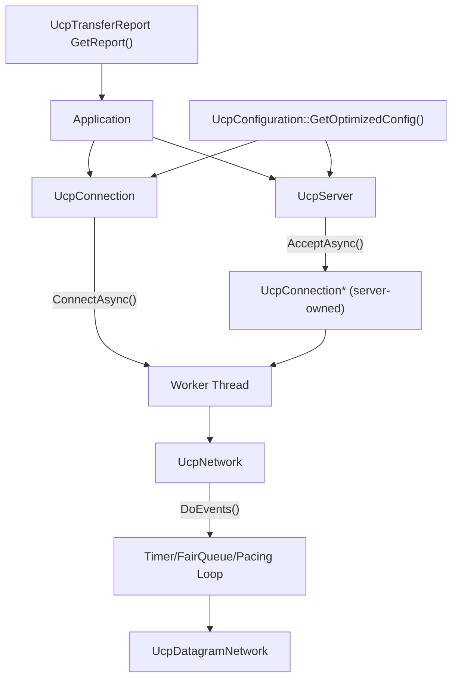

# UCP C++ API Reference

[Chinese](api_CN.md)

This document exhaustively describes the complete public API of the UCP C++ library, covering UcpConfiguration, UcpServer, UcpConnection, UcpNetwork/UcpDatagramNetwork, and UcpTransferReport. All interfaces precisely match the header files in `cpp/include/ucp/`.

## API Overview

UCP C++ API is organized around three core classes: UcpConfiguration provides a one-stop configuration entry for all tunable parameters, UcpServer manages server-side connection acceptance and fair queue bandwidth scheduling, and UcpConnection represents a single UCP session endpoint with a built-in dedicated Worker Thread processing all protocol events.

The API supports both synchronous and asynchronous calling modes. The Send/Receive series are non-blocking methods that return immediately after enqueuing, with results delivered through callbacks. The Write/Read series block the calling thread when buffers are full, suitable for latency-sensitive scenarios. ConnectAsync/AcceptAsync take a callback that is invoked when the handshake completes (callback-based Proactor pattern; no std::future is allocated).

UcpTransferReport provides complete connection diagnostic information including bytes sent and received, retransmitted packet count, current congestion window size, Pacing rate, and real-time throughput estimate. The UcpPriority enum supports four priority levels (Background, Normal, Interactive, Urgent), encoded in the upper 2 bits of the Flags byte. Urgent retransmissions bypass token bucket checks through the ForceConsume mechanism, ensuring low-latency delivery under extreme conditions.

All public interfaces are thread-safe: ConnectAsync, Send, Write, Close, and Dispose can be safely called from any thread. Callback methods (OnData, OnConnected, OnDisconnected) are triggered by the Worker Thread; callbacks must not perform blocking operations to avoid delaying protocol event processing.


```mermaid
flowchart TD
    App["Application"] --> Server["UcpServer"]
    App --> Client["UcpConnection"]
    Server -->|"AcceptAsync()"| ServerConn["UcpConnection* (server-owned)"]
    Client -->|"ConnectAsync()"| Worker["Worker Thread"]
    ServerConn --> Worker
    Worker --> Net["UcpNetwork"]
    Net -->|"DoEvents()"| Loop["Timer/FairQueue/Pacing Loop"]
    Loop --> Socket["UcpDatagramNetwork"]
    Factory["UcpConfiguration::GetOptimizedConfig()"] --> Server
    Factory --> Client
    Report["UcpTransferReport GetReport()"] --> App
```

## UcpConfiguration

Defined in `ucp_configuration.h`. Use `GetOptimizedConfig()` factory method for recommended defaults.

### Public Fields

| Field | Type | C++ Default | Range | Description |
|---|---|---|---|---|
| Mss | int | 1220 | 200-9000 | Maximum segment size |
| MaxRetransmissions | int | 10 | 3-100 | Max retransmission attempts |
| MinRtoMicros | int64_t | 50000 (50ms) | 50000-1000000 | Default RTO (50ms); absolute minimum is 50ms (MIN_RTO_MICROS) |
| MaxRtoMicros | int64_t | 15000000 (15s) | 1M-60M | Maximum RTO |
| RetransmitBackoffFactor | double | 1.2 | 1.1-2.0 | RTO backoff multiplier |
| KeepAliveIntervalMicros | int64_t | 1000000 (1s) | 100K-30M | Keepalive interval |
| DisconnectTimeoutMicros | int64_t | 4000000 (4s) | 500K-60M | Disconnect timeout |
| TimerIntervalMilliseconds | int | 1 | 1-100 | Timer tick |
| FairQueueRoundMilliseconds | int | 10 | -- | Fair queue round interval |
| ServerBandwidthBytesPerSecond | int | 12500000 | -- | Server egress bandwidth |
| ConnectTimeoutMilliseconds | int | 5000 | -- | Connection timeout |
| InitialBandwidthBytesPerSecond | int64_t | 12500000 | 125K-1.25G | UCP initial bandwidth |
| MaxPacingRateBytesPerSecond | int64_t | 12500000 | 0=unlimited | Pacing rate ceiling |
| MaxCongestionWindowBytes | int | 64 MB | 64K-256M | CWND hard cap |
| InitialCwndPackets | int | **10** | 4-200 | Initial CWND (packets) |
| RecvWindowPackets | int | 4096 | -- | Receive window (packets) |
| SendQuantumBytes | int | 1220 | MSS-MSS*4 | Pacing consume granularity |
| AckSackBlockLimit | int | 2 | 1-255 | Max SACK blocks per ACK |
| LossControlEnable | bool | true | -- | Enable loss-aware control |
| EcnEnabled | bool | false | -- | Enable ECN CE-mark feedback (KCC 2.0 default: disabled) |
| EnableDebugLog | bool | false | -- | Debug logging |
| EnableAggressiveSackRecovery | bool | true | -- | Aggressive SACK fast retransmit |
| EnableMtuDiscovery | bool | true | -- | DPLPMTUD probing |
| MtuProbeMax | int | 1500 | -- | MTU probe max value |
| MtuProbeTimeoutMicros | long | 10,000,000 | -- | MTU probe timeout (10 s) |
| MtuProbeIntervalMicros | long | 600,000,000 | -- | MTU probe interval (10 min) |
| FecRedundancy | double | 0.0 | 0.0-1.0 | FEC redundancy ratio |
| FecGroupSize | int | 8 | 2-64 | FEC group size |

### Buffer and Computed Properties

| Method | Description |
|---|---|
| SendBufferSize() / SetSendBufferSize() | Send buffer size (default 32 MB) |
| ReceiveBufferSize() / SetReceiveBufferSize() | Receive buffer size |
| InitialCwndBytes() / SetInitialCwndBytes() | Initial CWND (bytes) |
| DelayedAckTimeoutMicros() / SetDelayedAckTimeoutMicros() | Delayed ACK timeout (default 100us) |
| MaxBandwidthWastePercent() / SetMaxBandwidthWastePercent() | Max bandwidth waste ratio (0.25) |
| MaxBandwidthLossPercent() / SetMaxBandwidthLossPercent() | Max bandwidth loss percent (25%) |
| MinPacingIntervalMicros() / SetMinPacingIntervalMicros() | Min inter-packet gap (0=unlimited) |
| PacingBucketDurationMicros() / SetPacingBucketDurationMicros() | Token Bucket window (10ms) |
| MaxPayloadSize() | Max application payload (1200) |
| MaxAckSackBlocks() | Max SACK block count |
| ReceiveWindowBytes() | Receive window (bytes) |
| InitialCongestionWindowBytes() | Initial CWND (bytes) |
| EffectiveMinRtoMicros() / EffectiveMaxRtoMicros() | Effective RTO bounds |
| Clone() | Deep copy configuration |
| CopyTo() | Copy to another configuration |

The sendable upper limit is min(cwnd, peer-declared receive window); the initial cwnd is NOT a fixed 10-packet cap. The initial congestion window sets the controller's starting target, but the peer-advertised `WindowSize` is the authoritative hard cap on bytes in flight (standard TCP/QUIC flow control).

### GetOptimizedConfig() Factory

```cpp
static UcpConfiguration GetOptimizedConfig() noexcept;
```

Returns a platform-optimized configuration. On Windows it auto-configures WinSock2; on POSIX it uses standard Socket API.

## UcpServer

Defined in `ucp_server.h`, manages server-side connection acceptance and fair queue scheduling.

```cpp
class UcpServer : public IUcpObject {
public:
    UcpServer();
    explicit UcpServer(const UcpConfiguration& config);
    ~UcpServer();

    void Start(int port);
    void Start(UcpNetwork* network, int port, const UcpConfiguration& config);
    void AcceptAsync(AcceptAsyncCallback callback);
    void Stop();
    void Dispose();

    uint32_t GetConnectionId() const override;    // Returns 0
    UcpNetwork* GetNetwork() const override;      // Returns network_
};
```

### Server Lifecycle

1. Construct: UcpServer(config)
2. Start(port): Bind UDP Socket, start receive thread
3. AcceptAsync(callback): Invokes callback after handshake completes
4. Fair queue: Automatically scheduled every 10ms in DoEvents()
5. Stop(): Close active connections, release Socket
6. Dispose(): Release internal resources

AcceptAsync() callbacks are invoked with UcpError::ShuttingDown and a NULLPTR connection after Stop().

## UcpConnection

Defined in `ucp_connection.h`, represents a single UCP session endpoint. Each connection has a dedicated Worker Thread.

```cpp
class UcpConnection : public IUcpObject {
public:
    using DataCallback = std::function<void(const uint8_t*, size_t, size_t)>;
    using StateCallback = std::function<void()>;

    // Constructors (8 public overloads)
    UcpConnection();
    explicit UcpConnection(const UcpConfiguration& config);
    explicit UcpConnection(ITransport* transport);
    UcpConnection(ITransport* transport, bool ownsTransport);
    UcpConnection(ITransport* transport, bool ownsTransport,
                  const UcpConfiguration& config, UcpNetwork* network);
    UcpConnection(ITransport* transport, bool ownsTransport, bool serverManaged,
                  const UcpConfiguration& config, UcpNetwork* network);
    UcpConnection(UcpPcb* pcb, ITransport* transport, const UcpConfiguration& config);
    UcpConnection(UcpPcb* pcb, ITransport* transport,
                  const UcpConfiguration& config, UcpNetwork* network);
    ~UcpConnection();

    // Connection management
    void ConnectAsync(const ucp::string& remoteEndpoint, ConnectAsyncCallback callback);
    void ConnectAsync(UcpNetwork* network, const ucp::string& remoteEndpoint, ConnectAsyncCallback callback);
    void Close();
    void CloseAsync(CloseAsyncCallback callback);
    void Dispose();

    // Send (supports UcpPriority)
    int  Send(const uint8_t* buf, size_t offset, size_t count);
    int  Send(const uint8_t* buf, size_t offset, size_t count, UcpPriority priority);
    void SendAsync(const uint8_t* buf, size_t offset, size_t count, SendAsyncCallback callback);
    void SendAsync(const uint8_t* buf, size_t offset, size_t count, UcpPriority priority, SendAsyncCallback callback);
    bool Write(const uint8_t* buf, size_t off, size_t count);
    bool Write(const uint8_t* buf, size_t off, size_t count, UcpPriority priority);
    void WriteAsync(const uint8_t* buf, size_t off, size_t count, WriteAsyncCallback callback);
    void WriteAsync(const uint8_t* buf, size_t off, size_t count, UcpPriority priority, WriteAsyncCallback callback);

    // Receive
    int  Receive(uint8_t* buf, size_t offset, size_t count);
    void ReceiveAsync(uint8_t* buf, size_t offset, size_t count, ReceiveAsyncCallback callback);
    bool Read(uint8_t* buf, size_t off, size_t count);
    void ReadAsync(uint8_t* buf, size_t off, size_t count, ReadAsyncCallback callback);

    // Event callbacks
    void SetOnData(DataCallback cb);
    void SetOnConnected(StateCallback cb);
    void SetOnDisconnected(StateCallback cb);

    // Diagnostics
    UcpTransferReport GetReport() const;
    ucp::string GetRemoteEndpoint() const noexcept;
    uint32_t GetConnectionId() const override;
    UcpNetwork* GetNetwork() const override;
    UcpConnectionState GetState() const;
    double GetCurrentPacingRateBytesPerSecond() const;
    bool HasPendingSendData() const;
};
```

### Send/Receive API Differences

| Method | Behavior |
|---|---|
| Send / SendAsync | Non-blocking, enqueues to send buffer |
| Write / WriteAsync | Blocks caller when buffer full |

### UcpPriority

```cpp
enum class UcpPriority : uint8_t {
    Background  = 0,  // Bulk data
    Normal      = 1,  // Default
    Interactive = 2,  // Chat, RPC
    Urgent      = 3,  // Time-critical data
};
```

Priority is encoded in Flags byte bits 4-5. ForceConsume for urgent retransmits takes precedence over any UcpPriority.

### Thread Safety

| Method | Thread Safety |
|---|---|
| ConnectAsync / Send / Write / Close / Dispose | Safe from any thread |
| Receive / Read | Blocks calling thread |
| SetOnData / SetOnConnected / SetOnDisconnected | Fires on Worker Thread |
| GetReport / GetState / GetConnectionId | Read-only, safe |

Callbacks must not perform blocking operations (would block all protocol processing).

## UcpTransferReport

```cpp
struct UcpTransferReport {
    int64_t  BytesSent;
    int64_t  BytesReceived;
    int32_t  DataPacketsSent;
    int32_t  RetransmittedPackets;
    int32_t  AckPacketsSent;
    int32_t  NakPacketsSent;
    int32_t  FastRetransmissions;
    int32_t  TimeoutRetransmissions;
    int64_t  LastRttMicros;
    std::vector<int64_t> RttSamplesMicros;
    int32_t  CongestionWindowBytes;
    double   PacingRateBytesPerSecond;
    double   MeasuredBandwidthBytesPerSecond;
    double   EstimatedLossPercent;
    uint32_t RemoteWindowBytes;

    double RetransmissionRatio() const;
};
```

## UcpNetwork / UcpDatagramNetwork

```cpp
class UcpNetwork {
public:
    explicit UcpNetwork(const UcpConfiguration& config);
    virtual ~UcpNetwork();

    UcpConfiguration& GetConfiguration();
    virtual int DoEvents();
    void Input(const uint8_t* data, size_t length, const Endpoint& remote);
    virtual void Start(int port);
    virtual void Stop();
    virtual void Output(const uint8_t* data, size_t length,
                        const Endpoint& remote, IUcpObject* sender) = 0;

    uint32_t AddTimer(int64_t expireUs, std::function<void()> callback);
    bool CancelTimer(uint32_t timerId);

    ucp::shared_ptr<UcpServer> CreateServer(int port);
    ucp::shared_ptr<UcpConnection> CreateConnection();
};

class UcpDatagramNetwork : public UcpNetwork {
public:
    void Output(...) override;
    void Start(int port) override;
    void Stop() override;
    void Dispose() override;
};
```

## Complete End-to-End Example

```cpp
#include "ucp/ucp_configuration.h"
#include "ucp/ucp_connection.h"
#include "ucp/ucp_server.h"
#include <iostream>
#include <vector>
#include <cstring>

int main() {
    auto config = ucp::UcpConfiguration::GetOptimizedConfig();
    config.ServerBandwidthBytesPerSecond = 12500000;

    ucp::UcpServer server(config);
    server.Start(9000);
    ucp::UcpConnection* server_conn = nullptr;
    server.AcceptAsync([&](ucp::UcpError e, ucp::UcpConnection* c) {
        if (e == ucp::UcpError::None && c != nullptr) { server_conn = c; }
    });

    auto client = std::make_unique<ucp::UcpConnection>(config);
    client->SetOnConnected([]() { std::cout << "Connected!" << std::endl; });
    bool connected = false;
    client->ConnectAsync("127.0.0.1:9000",
        [&connected](ucp::UcpError e, uint32_t) { connected = (e == ucp::UcpError::None); });

    const char* msg = "Hello UCP!";
    bool wrote = false;
    client->WriteAsync(reinterpret_cast<const uint8_t*>(msg), 0, static_cast<int>(strlen(msg)),
        [&wrote](ucp::UcpError, bool ok) { wrote = ok; });

    std::vector<uint8_t> buf(strlen(msg));
    bool readOk = false;
    if (server_conn) {
        server_conn->ReadAsync(buf.data(), 0, static_cast<int>(buf.size()),
            [&readOk](ucp::UcpError, bool ok) { readOk = ok; });
    }
    std::cout << "Server received: " << std::string(buf.begin(), buf.end()) << std::endl;

    auto report = client->GetReport();
    std::cout << "Throughput: " << report.MeasuredBandwidthBytesPerSecond * 8 / 1e6
              << " Mbps, Retrans: " << report.RetransmissionRatio() * 100 << "%" << std::endl;

    client->Close();
    server_conn->Close();
    server.Stop();
    return 0;
}
```

## CMake Build Integration

```cmake
cmake_minimum_required(VERSION 3.14)
project(ucp_sample LANGUAGES CXX)
set(CMAKE_CXX_STANDARD 17)

add_subdirectory(path/to/ucp/cpp ucp_build)
target_link_libraries(my_app PRIVATE ucp)
```

| Target | Type | Description |
|---|---|---|
| ucp | Static library | Protocol core |
| ucp_tests | Executable | Unit/integration tests |
| ucp_echo_server | Executable | Echo server |
| ucp_echo_client | Executable | Echo client |
| ucp_benchmark | Executable | Benchmark suite |
| ucp_benchmark_diag | Executable | Benchmark with diagnosis output |

## Error Handling

| Error Type | Trigger | Suggestion |
|---|---|---|
| callback(UcpError::ConnectTimeout, ...) | ConnectAsync handshake failed | Check remote reachability |
| callback(UcpError::ShuttingDown, nullptr) | AcceptAsync after Stop() | Check server lifecycle |
| callback(UcpError::InternalError, ...) | Protocol violation, MaxRetransmissions | Listen for OnDisconnected |
| Socket error | Port in use | Change port |

## Custom Transport Integration

Inherit UcpNetwork and override the Output() pure virtual function, or use the UcpConnection(ITransport* transport, ...) constructor. The ownsTransport parameter controls transport object lifetime.

## Related Documents

- [architecture_EN.md](architecture_EN.md) — Runtime layer structure
- [protocol_EN.md](protocol_EN.md) — Protocol specification
- [performance_EN.md](performance_EN.md) — Performance characteristics
- [constants_EN.md](constants_EN.md) — Protocol constants
- [README_EN.md](../README_EN.md) — Project overview
- [Linux Kernel Module](../../linux/README.md) — KCC Geodesic Congestion Control module (tcp_kcc.c v2.0, with KCC Forwarding (KF) for cross-connection bandwidth sharing)

---

## License and Trademark

MIT License. See [LICENSE](../../LICENSE) for full text.

Copyright (c) 2026 PPP PRIVATE NETWORK™ X

PPP PRIVATE NETWORK™ is a trademark of PPP PRIVATE NETWORK.
