# PPP PRIVATE NETWORK™ X — 通用通信协议 (UCP) — C++ 架构

**协议标识: `ppp+ucp`** — 本文档解析 UCP 协议引擎的 C++ 运行时架构，涵盖分层设计、UcpPcb 状态管理、SerialQueue Worker Thread 串行模型、公平队列服务端调度、PacingController Token Bucket 设计、BBRv2 拥塞控制内核、UcpFecCodec Reed-Solomon GF(256) 编解码器、入站/出站路径完整数据流、以及 UcpDatagramNetwork 网路驱动模型。

---

## 运行时分层架构

UCP C++ 实现从应用层 API 到 UDP Socket 组织为六层分层架构，每层封装明确定义的职责：

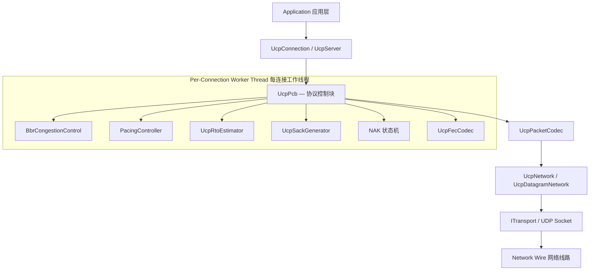

### 各层职责详解

| 层级 | 核心组件 | 职责范围 |
|---|---|---|
| **应用层** | `UcpServer`, `UcpConnection` | 面向应用的公开 API。`UcpServer` 管理被动连接接受和公平队列调度。`UcpConnection` 提供带背压的异步 Send/Receive/Read/Write、基于回调的事件通知和传输诊断。 |
| **协议控制** | `UcpPcb` (Protocol Control Block) | 完整每连接状态机：发送缓冲（带重传追踪）、接收乱序缓冲、ACK/SACK/NAK 处理、重传定时器管理、BBR 拥塞控制、Pacing 控制器、公平队列 credit 记账和可选 FEC 编解码。所有状态变更在 Worker Thread 上串行执行。 |
| **拥塞与 Pacing** | `BbrCongestionControl`, `PacingController`, `UcpRtoEstimator` | BBRv2 从投递率样本计算 pacing 速率和 CWND。`PacingController` 是字节级 Token Bucket，支持 ForceConsume 负余额紧急恢复。`UcpRtoEstimator` 提供平滑 RTT 估计。 |
| **可靠性引擎** | `UcpSackGenerator`, NAK 状态机, `UcpFecCodec` | SACK 块生成。NAK 状态机追踪每序号缺口观测计数。`UcpFecCodec` 使用预计算 GF(256) 对数/反对数表实现 RS 编解码。 |
| **序列化** | `UcpPacketCodec` | 处理所有包类型的大端序线格式编解码。从 DATA/NAK/控制包中提取捎带 ACK 字段。 |
| **网络驱动** | `UcpNetwork`, `UcpDatagramNetwork` | 将协议引擎与 Socket I/O 解耦。管理 Connection-ID 数据报多路分解、驱动 `DoEvents()` 定时器分发。 |

### 分层数据流

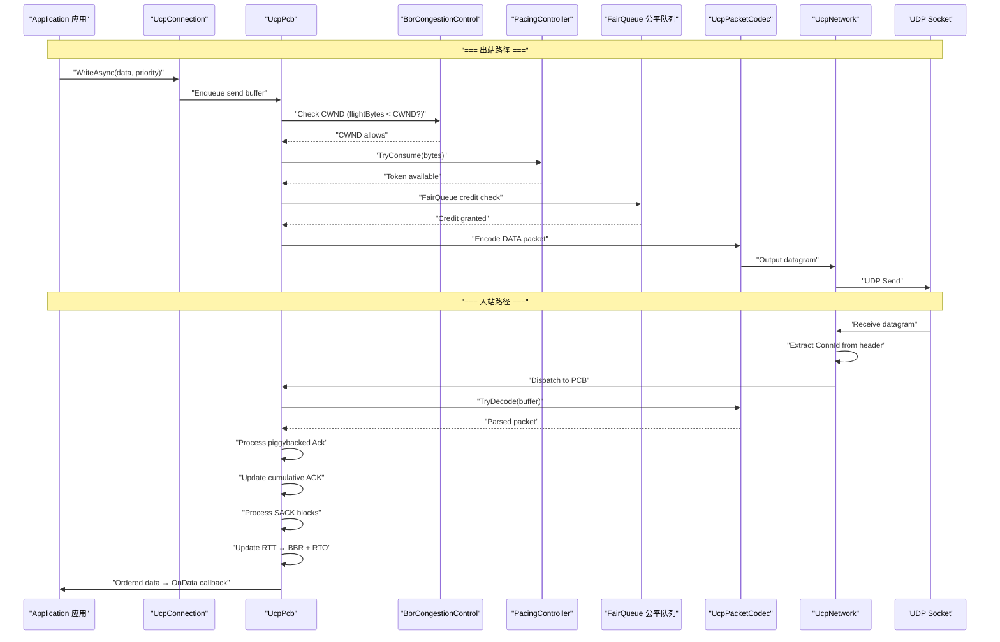

---

## UcpPcb — 协议控制块

`UcpPcb` 是 UCP 架构的中枢。每个活跃连接拥有一个独立的 PCB 实例，管理协议状态机的所有维度。

### PCB 组件关系全景图

```mermaid
flowchart TD
    PCB["UcpPcb 协议控制块"] --> Sender["Sender State 发送端"]
    PCB --> Receiver["Receiver State 接收端"]
    PCB --> Timers["Timer Management 定时器"]
    PCB --> Recovery["Recovery System 恢复系统"]
    PCB --> Config["UcpConfiguration 配置引用"]
    
    Sender --> SendBuf["m_sendBuffer<br/>Outbound Segment Map"]
    Sender --> Flight["m_flightBytes<br/>Flight Bytes Counter"]
    Sender --> NextSeq["m_nextSendSequence<br/>Next Sequence Number"]
    Sender --> UrgBudget["m_urgentRecoveryPacketsInWindow<br/>Urgent Budget"]
    
    Receiver --> RecvBuf["m_recvBuffer<br/>Reordering Buffer"]
    Receiver --> NextExp["m_nextExpectedSequence<br/>Expected Sequence"]
    Receiver --> RecvQueue["m_receiveQueue<br/>Ordered Delivery Queue"]
    Receiver --> MissCounts["m_missingSequenceCounts<br/>Gap Observation Counts"]
    Receiver --> NakTier["Nak Confidence Tier<br/>NAK 置信层级"]
    Receiver --> LastNak["m_lastNakIssuedMicros<br/>NAK Suppression Timestamps"]
    
    Timers --> RtoTimer["RTO Timer<br/>Retransmit Timeout"]
    Timers --> KeepAlive["KeepAlive Timer<br/>Keep-Alive"]
    Timers --> Disconnect["Disconnect Timer<br/>Disconnect Timeout"]
    Timers --> DelAck["Delayed ACK Timer<br/>Delayed Acknowledgment"]
    Timers --> ProbeRTT["ProbeRTT Timer<br/>MinRTT Probe"]
    
    Recovery --> BBR["BbrCongestionControl<br/>BBRv2"]
    Recovery --> SACK["UcpSackGenerator<br/>SACK Generator"]
    Recovery --> NAK["NAK StateMachine<br/>NAK FSM"]
    Recovery --> FEC["UcpFecCodec<br/>FEC Codec"]
    Recovery --> RTO["UcpRtoEstimator<br/>RTO Estimator"]
```

### 发送端状态详解

| 数据结构 | 类型 | 作用 |
|---|---|---|
| `m_sendBuffer` | `map<uint32_t, OutboundSegment>` | 按序号排序的待确认发送分段。累积 ACK 到达时移除已确认分段释放缓冲。每分段跟踪原始发送时间戳、重传次数和紧急恢复标志。 |
| `m_flightBytes` | `int32_t` | 当前在途的 payload 总字节数。BBRv2 用于计算投递率（`delivered_bytes / elapsed_time`）并强制执行 CWND 在途上限。 |
| `m_nextSendSequence` | `uint32_t` | 下一待发送的 32 位序号，按 2^32 取模单调递增。使用 `UcpSequenceComparer` 配合 2^31 比较窗口实现正确环绕。 |
| `m_urgentRecoveryPacketsInWindow` | `int` | 当前 RTT 窗口内已使用的紧急重传包数。每个新 RTT 估计时重置清零。 |
| `m_sentDataPackets` | `int32_t` | 已发送 DATA 包总数（含首次和重传），用于 `RetransmissionRatio` 计算。 |
| `m_retransmittedPackets` | `int32_t` | 重传 DATA 包计数。与 `m_sentDataPackets` 一起计算重传率。 |
| `m_pacing` | `PacingController*` | Pacing 控制器实例，控制包发送速率。支持 `TryConsume`（普通发送）和 `ForceConsume`（紧急重传）两种模式。 |

### 接收端状态详解

| 数据结构 | 类型 | 作用 |
|---|---|---|
| `m_recvBuffer` | `map<uint32_t, InboundSegment>` | 按序号排序的乱序入站分段缓冲。O(log n) 插入。累积 ACK 号左侧连续分段被取出移入 `m_receiveQueue`。 |
| `m_nextExpectedSequence` | `uint32_t` | 下一个有序交付所需的序号。当 `m_recvBuffer` 中存在从该序号开始的连续分段时，前移该指针。 |
| `m_receiveQueue` | `queue<ReceiveChunk>` | 已有序的就绪 payload chunk 队列，供应用层通过 `ReceiveAsync`/`ReadAsync` 消费。每次 chunk 包含数据缓冲和长度信息。 |
| `m_missingSequenceCounts` | `map<uint32_t, int>` | 每序号缺口的观测次数字典。每次有包在某一缺口之上到达时该计数器递增。用于 NAK 置信层级判定。 |
| `m_lastNakIssuedMicros` | `map<uint32_t, int64_t>` | 每序号最后一次 NAK 发出的时间戳。配合 250ms 重复抑制防止同一缺口的 NAK 风暴。 |
| `m_bytesReceived` | `int64_t` | 已接收 payload 字节总数，用于传输报告。 |
| `m_rstReceived` | `bool` | 是否收到对端 RST 包，用于诊断报告。 |

---

## Worker Thread 每连接串行执行模型

C++ UCP 实现使用 **Worker Thread**（工作线程）作为每连接的串行执行环境。每个 `UcpConnection` 通过其专用的 `deque` + `condition_variable` 处理所有协议事件，从根本上消除锁竞争：

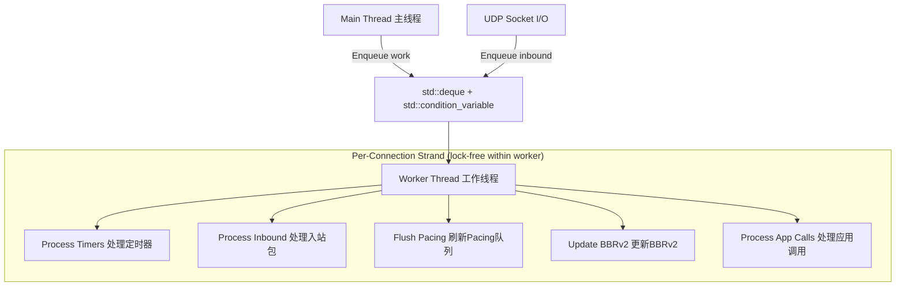

### 串行模型关键属性

| 属性 | 说明 |
|---|---|
| **无锁设计** | PCB 状态不会被多线程并发访问。所有变更在 Worker Thread 上顺序发生。`std::mutex` + `std::condition_variable` 仅用于工作项入列同步，非状态保护。 |
| **可预测顺序** | 包按 Enqueue 顺序处理；应用级调用（Send/Receive/Close）按入列顺序排队执行。 |
| **零死锁风险** | 串行模型消除了多锁设计中固有的锁顺序问题和 ABBA 死锁。 |
| **I/O 卸载** | UDP Socket 的 `Send()` 和 `Receive()` 在独立 recv_thread 中执行，FEC 解码在 Worker Thread 内执行。 |

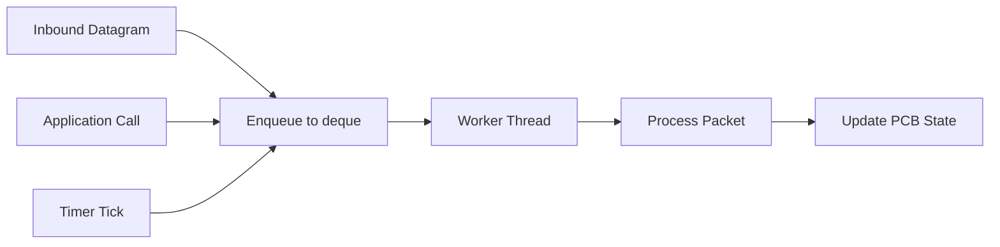

### UcpConnection 工作线程声明周期

`UcpConnection` 内部维护一个 `std::thread worker_thread_`、一个 `std::deque<std::function<void()>> queue_` 和 `std::condition_variable cv_`。所有公开方法（`Send`, `SendAsync`, `Receive`, `ReceiveAsync`, `Read`, `ReadAsync`, `Write`, `WriteAsync`, `Close`, `CloseAsync`）通过 `Enqueue()` 将实际操作注入队列，Worker Thread 在 `WorkerLoop()` 中串行消费。

```cpp
// 核心模型 (简化自 ucp_connection.h)
std::deque<std::function<void()>> queue_;
std::condition_variable cv_;
std::thread worker_thread_;
std::atomic<bool> stopped_{false};
std::atomic<bool> worker_should_start_{false};
```

Worker Thread 在首次 `ConnectAsync` 或 `EnsureWorkerStarted()` 调用时通过 `StartWorker()` 启动。`StopWorker()` 设置 `stopped_` 标志并通知 condition_variable，然后 join 线程。`Dispose()` 确保资源清理。

---

## 公平队列服务端调度

服务端 `UcpServer` 采用信用制轮转公平队列调度器，确保各连接公平共享出口带宽：

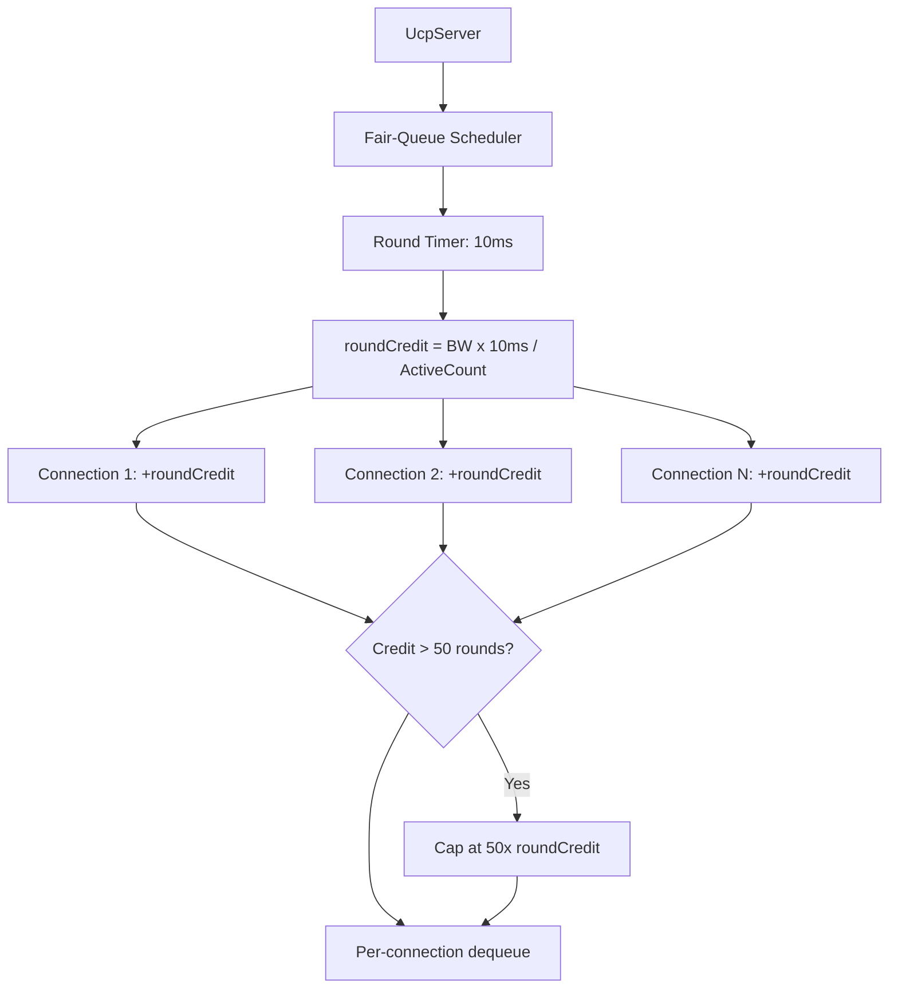

### 公平队列设计参数

| 参数 | 值 | 含义 |
|---|---|---|
| `FAIR_QUEUE_ROUND_MILLISECONDS` | 10ms | 每轮公平队列调度间隔。由 `fair_queue_timer_id_` 定时器驱动。 |
| `MAX_BUFFERED_FAIR_QUEUE_ROUNDS` | 50 轮 | 最大 credit 累积轮数。空闲连接最多积累 50 轮 credit，超出部分丢弃。 |

服务端 `UcpServer` 内部维护 `std::map<uint32_t, std::unique_ptr<ConnectionEntry>> connections_` 追踪所有活跃连接。`OnFairQueueRound()` 通过 cycle over connections 分配 credit。`ScheduleFairQueueRound()` 使用 `UcpNetwork::AddTimer()` 注册周期性定时器。

---

## PacingController Token Bucket 设计

`PacingController` 实现字节级 Token Bucket：

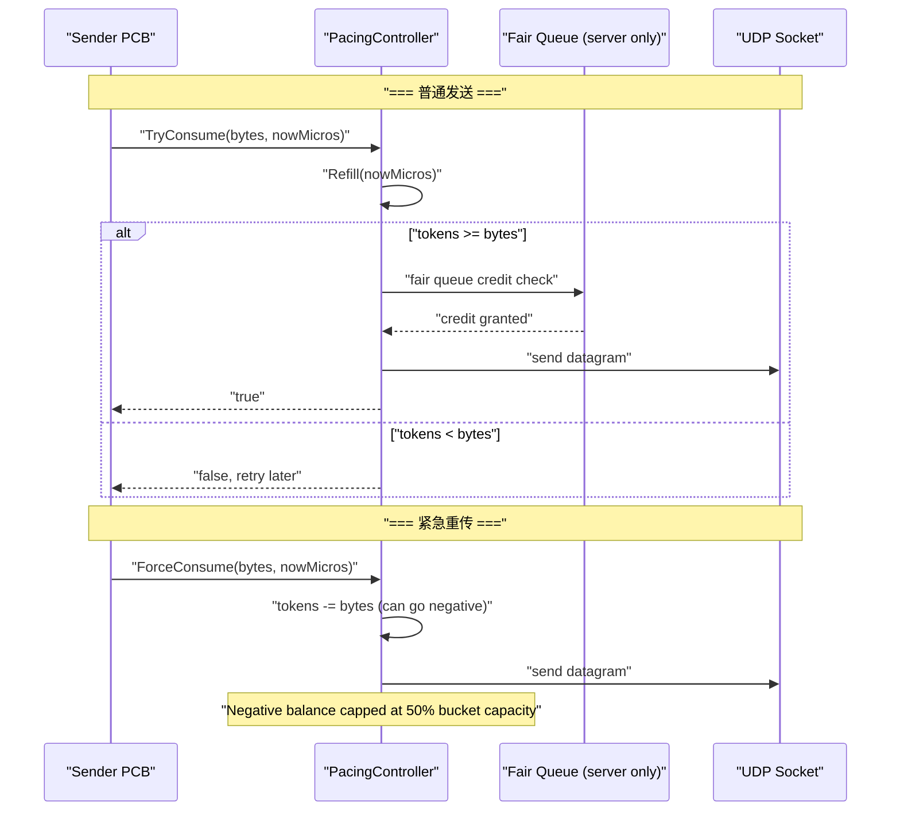

| 参数 | 默认值 | 含义 |
|---|---|---|
| Token 填充速率 | `PacingRateBytesPerSecond` | BBRv2 实时计算的瓶颈带宽估计 × 当前增益系数 |
| Bucket 容量 | `PacingRate × PacingBucketDurationMicros` (10ms) | 承载 10ms 字节量 |
| `_sendQuantumBytes` | `Mss` (1220) | 每次发送尝试消耗量 |
| `ForceConsume` | 立即消费 → bucket 可为负 | 负余额上限 50% bucket 容量 |
| `TryConsume` | 仅在 Token 充足时成功 | 不足时返回 false，调用方推迟重试 |

---

## BBRv2 拥塞控制内核

### 核心估计量流水线

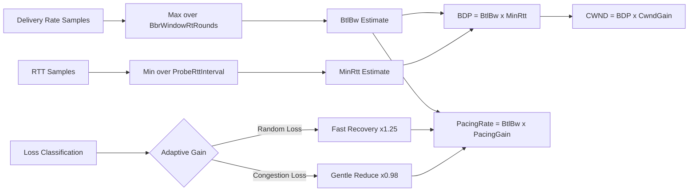

### BBRv2 模式行为表 (C++ 实现值)

| 模式 | Pacing 增益 | CWND 增益 | 持续时间 | 目的 |
|---|---|---|---|---|
| **Startup** | 2.89 | 2.0 | 至带宽平台出现（3 RTT 窗口吞吐不增长） | 指数探测瓶颈带宽 |
| **Drain** | 1.0 | — | 约 1 BBR 周期 | 排空 Startup 期间累积的瓶颈队列 |
| **ProbeBW** | 循环 [1.35, 0.85, 1.0×6] | 2.0 | 稳态运行 | 8 阶段增益循环 |
| **ProbeRTT** | 0.85 | 4 包 | 100ms（每 30s） | 刷新 MinRTT 估计 |

### BBR 内部关键实现

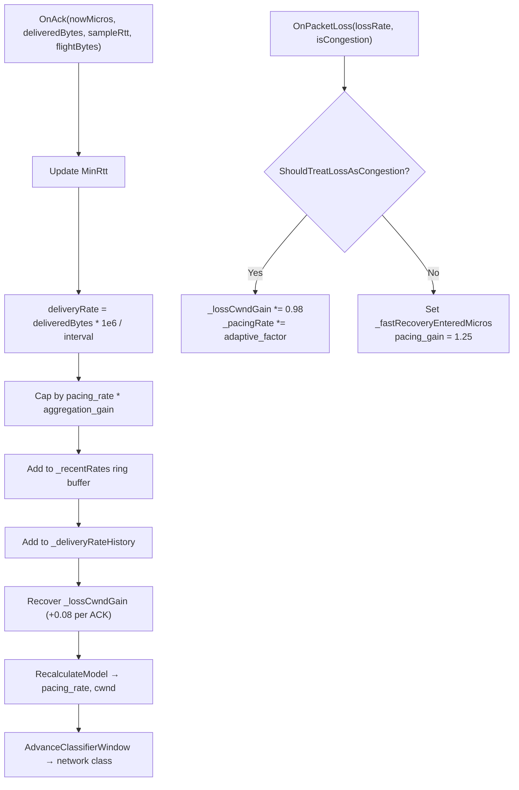

### 网络路径分类器 (C++ 实现)

BBRv2 使用 200ms 滑动窗口（`kNetworkClassifierWindowDurationMicros = 200000`）分析 RTT、抖动和丢包率特征：

| 网络类型 | C++ 阈值条件 | BBR 自适应行为 |
|---|---|---|
| `LowLatencyLAN` | RTT < 5ms, 抖动 < 3ms | 激进探测，高 Startup 增益 2.89 |
| `MobileUnstable` | 丢包率 > 3%, 抖动 > 20ms | `kLossCwndRecoveryStepFast = 0.15`，加速 CWND 恢复 |
| `LossyLongFat` | RTT > 80ms, 持续随机丢包 | 跳过 ProbeRTT，保持 CWND 不因丢包缩减 |
| `CongestedBottleneck` | RTT 升高 + 投递率下降 | 启用 `CongestionLossReduction 0.98×` 乘数 |
| `SymmetricVPN` | 稳定 RTT, 对称带宽 | 标准 BBR 探测循环 |

### 拥塞分类评分系统

```cpp
// C++ BBR 实现的关键分类参数
kCongestionRateDropRatio  = -0.15;  // 投递率下降 ≥15% → +1 拥塞分
kCongestionRttIncreaseRatio = 0.50; // RTT 增长 ≥50% → +1 拥塞分
kCongestionLossRatio       = 0.10;  // 丢包率 ≥10% → +1 拥塞分
kCongestionClassifierScoreThreshold = 2; // 总分 ≥2 → 确认为拥塞
kRandomLossMaxRttIncreaseRatio = 0.20; // RTT 增长 <20% → 随机丢包
```

---

## UcpFecCodec — Reed-Solomon GF(256) 编解码器

### 数学基础 (C++ 实现)

| 参数 | C++ 值 |
|---|---|
| 不可约多项式 | `x^8 + x^4 + x^3 + x + 1` → 生成器 `0x11d` |
| 本原元 α | `0x02`（多项式 x） |
| 对数表 | 256 项 `gf_log_[256]` |
| 反对数表 | 512 项 `gf_exp_[512]` |
| 加法 | 按位 XOR |
| 乘法 | `gf_exp_[(gf_log_[a] + gf_log_[b]) % 255]` — O(1) |
| 除法 | `gf_exp_[(gf_log_[a] - gf_log_[b] + 255) % 255]` — O(1) |

### 编解码流程

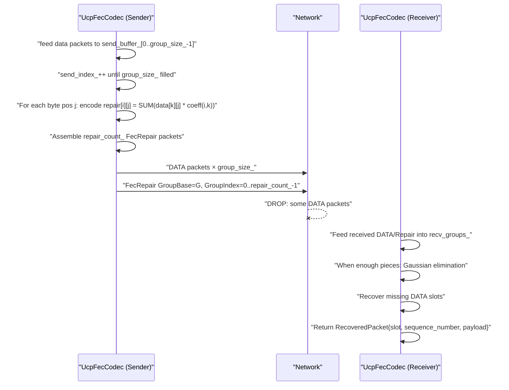

### C++ 内部实现

| 成员 | 含义 |
|---|---|
| `group_size_` | 每 FEC 组 DATA 包数（2–64，默认 8） |
| `repair_count_` | 每组修复包数（1 至 group_size_） |
| `send_buffer_` | `vector<optional<vector<uint8_t>>>` — 发送端编组缓冲，长度为 group_size_ |
| `send_index_` | 当前写入位置，到达 group_size_ 后触发编码 |
| `recv_groups_` | `unordered_map<uint32_t, vector<optional<vector<uint8_t>>>>` — 接收端按 GroupBase 存储 |
| `recv_repairs_` | `unordered_map<uint32_t, map<int, vector<uint8_t>>>` — 按 GroupBase 存储修复包 |

`GetGroupBase(sequence_number)` 返回 `(seq / group_size_) * group_size_`，`GetSlot(seq)` 返回 `seq % group_size_`。

`TryEncodeRepairs()` 在 `send_index_` 达到 `group_size_` 时触发：遍历每字节位置，计算 `repair[i][j] = Σ(data[k][j] × α^(i×k))`（截断至 `MAX_FEC_SLOT_LENGTH = 1200`）。

`TryRecoverFromRepair()` 实现高斯消元：从 `recv_groups_[group_base]` 和 `recv_repairs_[group_base]` 收集已知实体，构建 GF(256) 矩阵方程，通过 `TrySolve()` 高斯消元求解缺失 slot。

---

## UcpDatagramNetwork 网络驱动

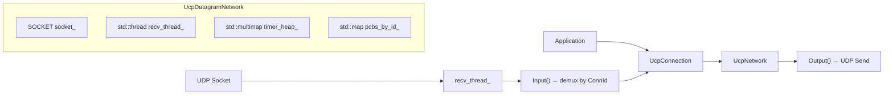

### DoEvents — 事件循环心跳

```cpp
// UcpNetwork 核心方法 (简化)
virtual int DoEvents();
```

`DoEvents()` 执行：
- 处理定时器到期回调（`timer_heap_`）
- 分发入站数据报到对应 PCB
- 驱动公平队列轮次
- 刷新出站队列

### `UcpNetwork` 核心 API

| 方法 | 说明 |
|---|---|
| `Input(data, length, remote)` | 入站数据报入口 — 提取 ConnId，查找 PCB 分发 |
| `Output(data, length, remote, sender)` | 出站数据报 — 通过 UDP Socket 发送 |
| `AddTimer(expireUs, callback)` | 注册定时器，返回 timer_id |
| `CancelTimer(timerId)` | 取消定时器 |
| `GetNowMicroseconds()` / `GetCurrentTimeUs()` | 当前时间（微秒），缓存时钟减少 syscall |
| `RegisterPcb(pcb)` / `UnregisterPcb(pcb)` | PCB 生命周期管理 |

`UcpDatagramNetwork` 继承 `UcpNetwork`，实现实际 UDP Socket 绑定（`socket_`）、接收线程（`recv_thread_`）和发送（`Output()` 重写）。支持跨平台 WinSock2 / POSIX socket。

---

## 连接状态机

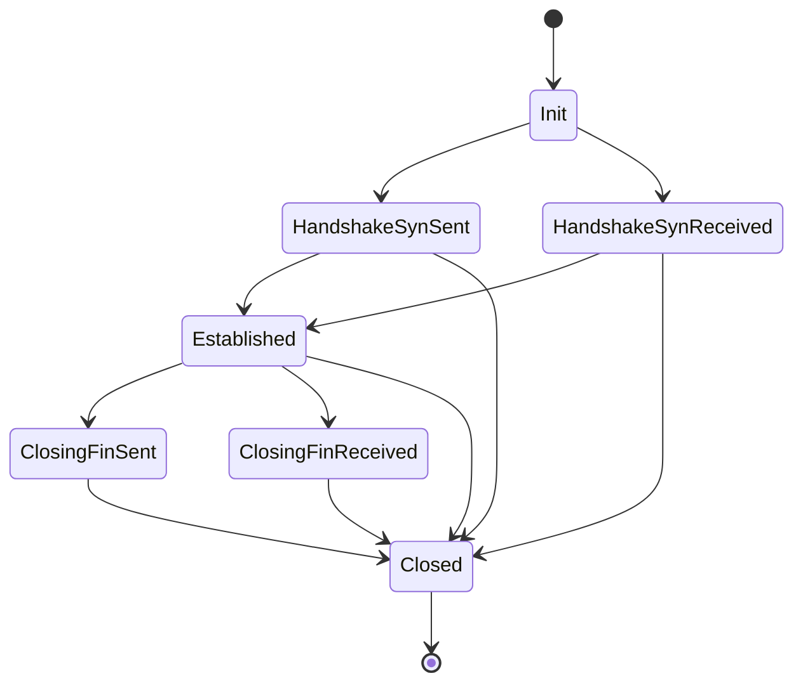

状态枚举定义在 `ucp_enums.h:UcpConnectionState`：`Init → HandshakeSynSent → HandshakeSynReceived → Established → ClosingFinSent → ClosingFinReceived → Closed`。

| 转换 | 触发条件 | 出站动作 | 定时器 |
|---|---|---|---|
| Init → HandshakeSynSent | 客户端 `ConnectAsync()` | 发送 SYN（随机 ISN + ConnId） | connectTimer |
| Init → HandshakeSynReceived | 服务端收到 SYN | 发送 SYNACK（捎带 ACK） | connectTimer |
| → Established | 握手完成 | ACK 确认 | 停止 connectTimer |
| Established → ClosingFinSent | 本地 `CloseAsync()` | 发送 FIN | disconnectTimer |
| Established → ClosingFinReceived | 收到对端 FIN | 发送 FIN ACK (FinAck flag) | disconnectTimer |
| → Closed | FIN 交换完成 / 超时 / RST | 可选 RST | 全部停止 |

---

## ISN 与 Connection ID 随机生成

C++ 实现使用 `std::mt19937_64` 梅森旋转引擎配合 `std::random_device{}()` 种子：

```cpp
// ucp_pcb.cpp
static std::mt19937_64 g_connectionRng(std::random_device{}());
static std::mt19937_64 g_sequenceRng(std::random_device{}());

uint32_t UcpPcb::NextConnectionId() {
    uint32_t id;
    do { id = (uint32_t)(g_connectionRng() & 0xFFFFFFFFULL); } while (id == 0);
    return id;
}

uint32_t UcpPcb::NextSequence() {
    return (uint32_t)(g_sequenceRng() & 0xFFFFFFFFULL);
}
```

`NextConnectionId()` 确保非零值，`NextSequence()` 返回随机 ISN。两者由全局 mt19937_64 引擎生成，提供加密级防碰撞保证。

---

## 序号算术 (UcpSequenceComparer)

```cpp
// ucp_sequence_comer.h — 关键实现
static bool IsAfter(uint32_t left, uint32_t right) {
    if (left == right) return false;
    return (left - right) < Constants::HALF_SEQUENCE_SPACE; // 0x80000000
}

static bool IsBefore(uint32_t left, uint32_t right) {
    return left != right && !IsAfter(left, right);
}
```

使用标准 2^31 比较窗口实现无歧义序号环绕。`IsInForwardRange()` 和 `IsForwardDistanceAtMost()` 提供扩展范围查询。

---

## 确定性测试支持

C++ 实现通过 `UcpNetwork` 的可替换传输层支持确定性的进程内网络模拟。`UcpDatagramNetwork` 的 `Output()` 方法是 virtual abstract，允许替代实现注入丢包、延迟和乱序。

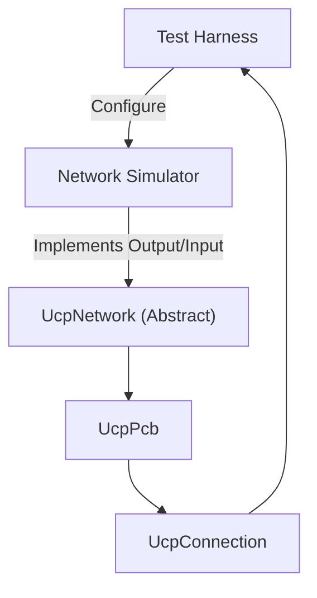

---

## 构建与开发

```powershell
# C++ 构建 (CMake / MSBuild)
cmake -B build -S .
cmake --build build --config Release
```

UCP C++ 实现跨平台：Windows (WinSock2)、Linux/macOS (POSIX socket)。使用标准 C++17，无第三方依赖。所有协议常量在 `ucp_constants.h` 和 `ucp_configuration.h` 中集中管理，配置通过 `UcpConfiguration::GetOptimizedConfig()` 工厂方法提供推荐默认值。
