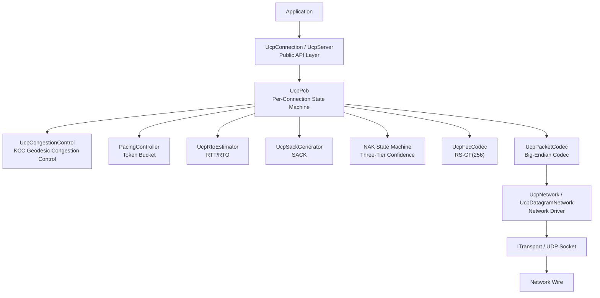
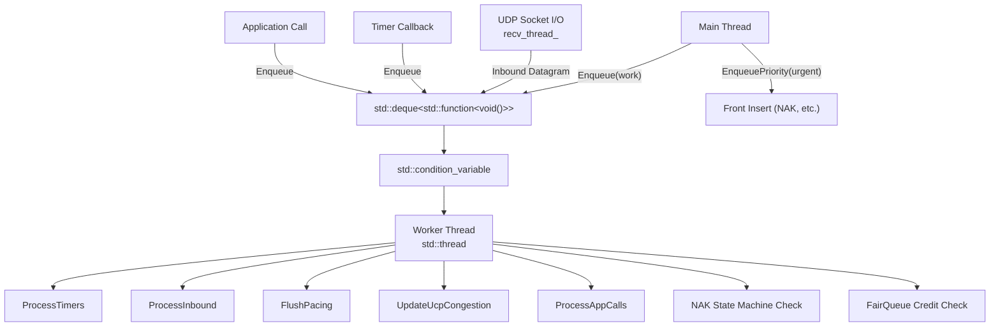
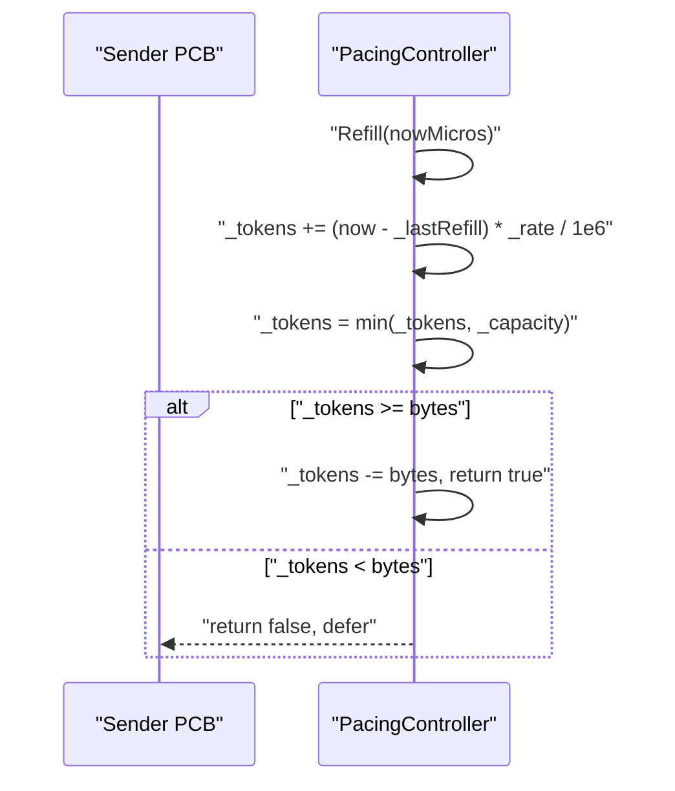
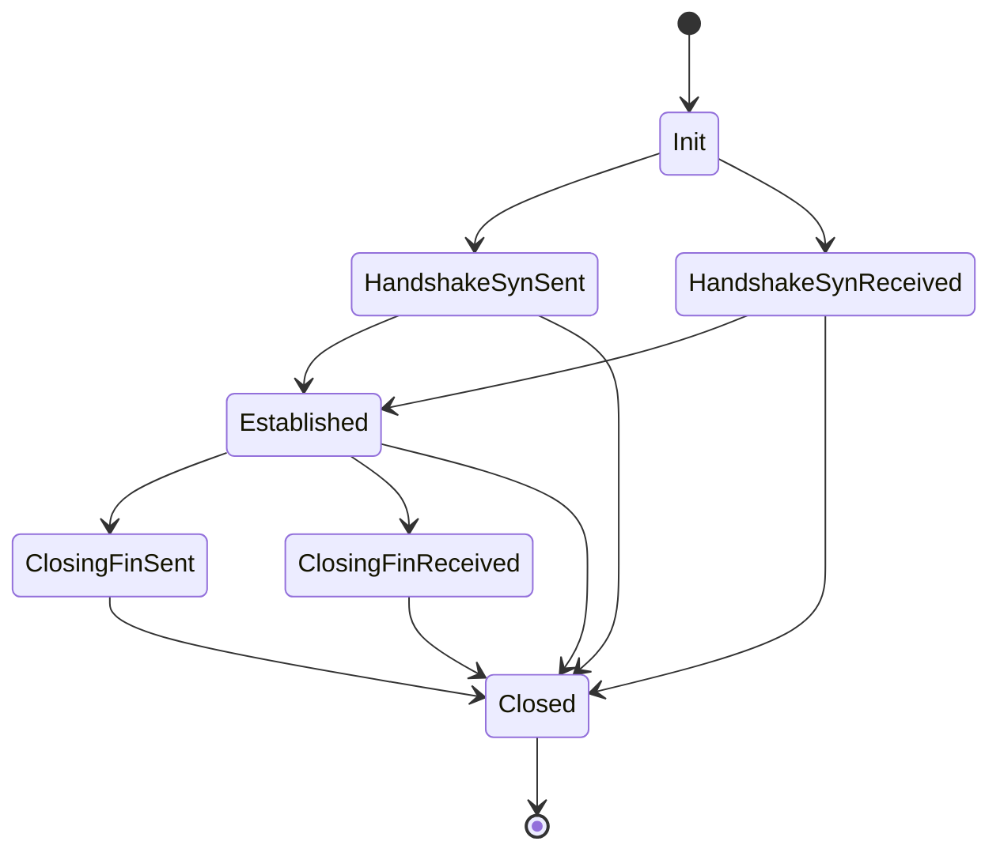

# UCP C++ 运行时层次结构

[English](architecture_EN.md)

本文档详述 UCP C++ 实现的运行时层次结构，覆盖六层分层、Worker Thread 串行模型、UcpPcb 协议控制块、公平队列、Pacing 控制器、KCC 拥塞控制（含 KF 组件源于 tcp_kcc.c v2.0，FEC/NAK 投递样本馈入 CC）、FEC 编解码器和连接状态机。

## 六层分层结构

UCP C++ 从应用层到 UDP Socket 分为六层，下层对上层透明：

| 层级 | 核心类 | 职责 |
|---|---|---|
| 应用层 | UcpServer / UcpConnection | 公开 API，异步 IO |
| 协议控制 | UcpPcb | 每连接状态机，发送/接收缓冲管理 |
| 拥塞与 Pacing | UcpCongestionControl / PacingController / UcpRtoEstimator | KCC Geodesic Congestion Control（KF 组件源于 tcp_kcc.c v2.0）、令牌桶、RTO 估计 |
| 可靠性引擎 | UcpSackGenerator / NAK 状态机 / UcpFecCodec | SACK、NAK、FEC 恢复 |
| 序列化 | UcpPacketCodec | 大端序包编解码 |
| 网络驱动 | UcpNetwork / UcpDatagramNetwork | 事件循环、UDP Socket |


```mermaid
flowchart TD
    App["Application"] --> Conn["UcpConnection / UcpServer<br/>Public API Layer"]
    Conn --> PCB["UcpPcb<br/>Per-Connection State Machine"]
    PCB --> CC["UcpCongestionControl<br/>KCC Geodesic Congestion Control"]
    PCB --> Pacing["PacingController<br/>Token Bucket"]
    PCB --> RTO["UcpRtoEstimator<br/>RTT/RTO"]
    PCB --> Sack["UcpSackGenerator<br/>SACK"]
    PCB --> Nak["NAK State Machine<br/>Three-Tier Confidence"]
    PCB --> FEC["UcpFecCodec<br/>RS-GF(256)"]
    PCB --> Codec["UcpPacketCodec<br/>Big-Endian Codec"]
    Codec --> Net["UcpNetwork / UcpDatagramNetwork<br/>Network Driver"]
    Net --> Transport["ITransport / UDP Socket"]
    Transport --> Wire["Network Wire"]
```

## Worker Thread 串行模型

每个 UcpConnection 拥有专属的 std::thread（Worker Thread），通过 std::deque + std::condition_variable 串行处理所有协议事件。此模型不同于 C# 的 SerialQueue（基于线程池的 Strand 模型）。


```mermaid
flowchart TD
    Main["Main Thread"] -->|"Enqueue(work)"| Queue["std::deque&lt;std::function&lt;void()&gt;&gt;"]
    Main -->|"EnqueuePriority(urgent)"| QueueFront["Front Insert (NAK, etc.)"]
    Queue --> CV["std::condition_variable"]
    CV --> Worker["Worker Thread<br/>std::thread"]
    Worker --> T1["ProcessTimers"]
    Worker --> T2["ProcessInbound"]
    Worker --> T3["FlushPacing"]
    Worker --> T4["UpdateUcpCongestion"]
    Worker --> T5["ProcessAppCalls"]
    Worker --> T6["NAK State Machine Check"]
    Worker --> T7["FairQueue Credit Check"]
    IO["UDP Socket I/O<br/>recv_thread_"] -->|"Inbound Datagram"| Queue
    Timer["Timer Callback"] -->|"Enqueue"| Queue
    App["Application Call"] -->|"Enqueue"| Queue
```

### 串行模型关键属性

| 属性 | C++ 实现 | 说明 |
|---|---|---|
| 无锁结构 | std::mutex 仅保护 queue_ 的 push/pop | PCB 状态不会被多线程并发访问 |
| 可预测顺序 | FIFO + 前端优先级 | 包按入列顺序处理 |
| 零死锁风险 | 单消费者模型 | 消除 ABBA 死锁问题 |
| I/O 卸载 | recv_thread_ 独立于 Worker | 仅 sendto/recvfrom 在 Worker 外执行 |
| 确定性测试 | 可替换 Output() 纯虚方法 | NetworkSimulator 可注入丢包/延迟 |

### Worker Thread 生命周期

```cpp
// ucp_connection.h — 核心数据结构（简化）
std::deque<std::function<void()>> queue_;
std::condition_variable cv_;
std::thread worker_thread_;
std::atomic<bool> stopped_{false};
std::atomic<bool> joining_{false};                 // 外部 StopWorker 在 join 前设置
std::shared_ptr<std::atomic<bool>> alive_flag_;    // 自持；生命周期超出本对象
```

Worker Thread 在 WorkerLoop() 中串行消费队列。它在循环外持有 `alive_flag_` 的局部副本；每次
`work()` 之后**先**检查该标志——如果连接是在 `work()` 内部被销毁的（例如服务器侧连接，其 entry
是唯一所有者），析构函数已 detach 线程，循环立即返回而不触碰任何其它成员（避免 use-after-free）。
`StopWorker()` 将 `joining_` 排在 `stopped_` 之前，使观察到 `stopped_` 的 worker 不会与外部
`join()` 并发 self-detach；当 `StopWorker` 由 worker 线程自身调用时，它直接 detach。
`EnqueuePriority` 将 NAK 等紧急工作项插入队列前端。

## UcpPcb 协议控制块

UcpPcb 是每连接的状态机中枢，管理发送缓冲、接收缓冲、定时器和全部恢复子系统。

### PCB 组件

| 组件 | 类型 | 用途 |
|---|---|---|
| m_sendBuffer | std::map<uint32_t, OutboundSegment> | 按序号排序的发送缓冲 |
| m_flightBytes | int32_t | 当前在途字节数 |
| m_nextSendSequence | uint32_t | 下一发送序号 |
| m_recvBuffer | std::map<uint32_t, InboundSegment> | 乱序接收缓冲 |
| m_nextExpectedSequence | uint32_t | 期望下一序号 |
| m_receiveQueue | std::queue<ReceiveChunk> | 有序交付队列 |
| m_missingSequenceCounts | std::map<uint32_t, int> | 缺口观测计数 |
| m_lastNakIssuedMicros | std::map<uint32_t, int64_t> | NAK 抑制时间戳 |

### 发送路径

```cpp
void UcpPcb::SendData() {
    if (m_flightBytes >= UCP_->CongestionWindowBytes()) return;
    if (!m_pacing->TryConsume(mss_, nowMicros)) return;
    UcpDataPacket packet;
    packet.sequence_number = m_nextSendSequence;
    auto encoded = UcpPacketCodec::Encode(packet);
    network_->Output(encoded.data(), encoded.size(), m_remote, nullptr);
    m_sendBuffer[m_nextSendSequence] = OutboundSegment{...};
    m_flightBytes += payloadSize;
    m_nextSendSequence = UcpSequenceComparer::Increment(m_nextSendSequence);
}
```

### 定时器管理

UcpNetwork 使用 std::multimap<int64_t, std::function<void()>> 实现基于到期时间的定时器堆。DoEvents() 在每次调用时触发所有到期定时器回调。

```cpp
uint32_t AddTimer(int64_t expireUs, std::function<void()> callback);
std::multimap<int64_t, std::function<void()>> timer_heap_;
std::map<uint32_t, shared_ptr<TimerEntry>> active_timers_;
```

## 公平队列服务端调度

服务端 UcpServer 采用信用轮转公平队列，各连接按比例共享出口带宽：

| 参数 | C++ 值 | C# 值 |
|---|---|---|
| FAIR_QUEUE_ROUND_MILLISECONDS | 10ms | 10ms |
| MAX_BUFFERED_FAIR_QUEUE_ROUNDS | 4 | 4 |
| bandwidth_limit_bytes_per_sec_ | 12.5 MB/s | 12.5 MB/s |

```cpp
void UcpServer::OnFairQueueRoundCore() {
    std::vector<shared_ptr<UcpConnection>> active;
    lock_guard<mutex> lock(mutex_);
    for (auto& [connId, entry] : connections_) {
        if (NULLPTR == entry || false == entry->accepted) continue;
        auto connection = entry->connection
            ? entry->connection : entry->acceptedConnection;
        if (NULLPTR == connection) continue;
        auto state = connection->GetState();
        if ((Established == state || ClosingFinSent == state ||
             ClosingFinReceived == state) &&
            connection->HasPendingSendData())
            active.push_back(connection);
    }
    if (active.empty()) return;
    double roundCredit = bandwidth_limit_bytes_per_sec_ * 0.01 / active.size();
    for (auto& connection : active) connection->AddFairQueueCredit(roundCredit);
    ScheduleFairQueueRound();
}
```

## PacingController 令牌桶

PacingController 实现字节级令牌桶，通过 TryConsume 和 ForceConsume 控制出站速率：

| 参数 | 默认值 | 含义 |
|---|---|---|
| _sendQuantumBytes | 1220 (MSS) | 单次消费粒度 |
| _bucketDurationMicros | 10000 (10ms) | 桶容量窗口 |
| _capacity | PacingRate * 10ms | 最大令牌容量 |
| _tokens | 初始 = _capacity | 当前令牌余额 |

### Token Bucket 流程


```mermaid
sequenceDiagram
    participant S as "Sender PCB"
    participant P as "PacingController"
    P->>P: "Refill(nowMicros)"
    P->>P: "_tokens += (now - _lastRefill) * _rate / 1e6"
    P->>P: "_tokens = min(_tokens, _capacity)"
    alt "_tokens >= bytes"
        P->>P: "_tokens -= bytes, return true"
    else "_tokens < bytes"
        P-->>S: "return false, defer"
    end
```

ForceConsume 用于紧急重传，跳过令牌检查允许发送（将剩余令牌清零，不产生负令牌债务）。

## KCC（Geodesic Congestion Control）拥塞控制内核

### KCC（Geodesic Congestion Control）模式与增益

| 模式 | Pacing 增益 | CWND 增益 | 退出条件 |
|---|---|---|---|
| Startup | 2.887 (739/256) | 2.887 | 连续 3 RTT 增长 < 25% |
| Drain | 0.344 (88/256) | 2.887 (739/256) | 在途 ≤ 1.0 × BDP 且经过 1 RTT（或 4×min_rtt 超时） |
| ProbeBW | 循环 [1.25, 0.75, 1.0x6] | 2.0 | 8 阶段循环 |

可发送上限为 min(cwnd, 对端宣告的接收窗口)；初始 cwnd 并非固定的 10 包上限。初始拥塞窗口设定控制器的起始目标值，但对端宣告的 `WindowSize` 才是在途字节的权威硬上限（标准 TCP/QUIC 流量控制）。

### FEC/NAK 与拥塞控制集成

FEC 恢复和 NAK 观测为拥塞控制引擎提供高保真投递率样本。FEC 恢复的字节作为带宽样本计入投递率样本，改善吞吐估计。NAK 观测提供丢包样本数据，改善长期带宽 EWMA 估计。这些样本源独立但互补，即使在显著丢包下也能实现精确的带宽/延迟估计。

## UcpFecCodec RS-GF(256) 编解码器

FEC 使用 GF(256) 有限域上的系统 Reed-Solomon 编码。数据包按组组织（默认 8 包/组），每组生成 repair_count 个修复包。

### GF(256) 表初始化

```cpp
bool UcpFecCodec::tables_initialized_ = []() {
    int value = 1;
    for (int i = 0; i < 255; i++) {
        gf_exp_[i] = static_cast<uint8_t>(value);
        gf_log_[value] = static_cast<uint8_t>(i);
        value <<= 1;
        if (value & 0x100) value ^= 0x11d;
    }
    for (int i = 255; i < 512; i++)
        gf_exp_[i] = gf_exp_[i - 255];
    return true;
}();
```

| 运算 | 复杂度 | 实现 |
|---|---|---|
| 加法 | O(1) | XOR |
| 乘法 | O(1) | 2 查表 + 1 加法 + 1 取模 |
| 除法 | O(1) | 2 查表 + 1 减法 |
| 求逆 | O(1) | 1 查表 + 1 减法 |

## ECN 支持与分级退避

UCP 支持基于排队延迟的类 ECN（显式拥塞通知）分级退避机制，在丢包发生之前降低注入速率。这不是线协议 ECN（无 IP ECN 字段）——它是一种延迟驱动的拥塞避免机制。C++ 中通过 `#if KCC_ECN_ENABLED != 0`（ucp_constants.h 中宏为 0）在编译期关闭，需重新编译才能启用；运行时显式启用仅限 C#（`UcpConfiguration.EcnEnabled`）。

ECN 退避逻辑（`kcc_ecn_enable = 1`）监视测地线滤波后的排队延迟。当排队延迟超过拥塞阈值（max(25% × min_rtt, 500us)）时，cwnd_gain 降低 `kcc_ecn_backoff_num/kcc_ecn_backoff_den`（20%）。EWMA 滤波器（`kcc_ecn_ewma_retained/kcc_ecn_ewma_total = 3/4`）平滑瞬时排队延迟信号。在空闲期间，EWMA 每轮衰减 `kcc_ecn_idle_decay_num/kcc_ecn_idle_decay_den`（31/32）。

这种分级退避在缓冲膨胀或丢包发生前提供平滑的拥塞响应，补充基于丢包和基于模型的拥塞信号。

## ACK 聚合补偿

UCP 使用双窗口（5-RTT 轮换）测量检测 ACK 压缩/集群：`extra_acked`（超出带宽预期 epoch 总量的 ACK 字节数）在两个滑动窗口槽中取最大值：

| 参数 | 默认值 | 描述 |
|---|---|---|
| `kcc_agg_window_rotation_rtts` | 5 | 双窗口轮换周期（RTT） |
| `kcc_extra_acked_gain` | 256（1.0x） | 补偿增益 |
| `KCC_EXTRA_ACKED_MAX_MS_RATIO` | 100 | extra_acked 上限窗口（ms） |
| `kcc_extra_acked_win_rtts_max` | 31 | 最大轮换 RTT 数 |
| `kcc_ack_epoch_max` | 0x100000 | ACK epoch 累加器上限（字节） |

补偿仅在 min_rtt ≥ 7.5ms 的路径上应用，cwnd 加成 = extra_acked × gain，上限为 bw × 100ms，防止 ACK 压缩伪影夸大带宽估计。

## LT 带宽估计

长期（LT）带宽估计使用 EWMA 滤波器在较长时间尺度上维护平滑带宽估计，补充捕获峰值带宽的 UCP 最大值滤波器（BtlBw）。

LT 带宽在至少 `kcc_lt_intvl_min_rtts`（4）个 RTT 的间隔更新。当当前投递率在存储 LT 带宽的 `kcc_lt_bw_ratio_num/kcc_lt_bw_ratio_den`（1/8）范围内时，EWMA 更新应用权重 `kcc_lt_bw_ema_num/kcc_lt_bw_ema_den`（1/2）。如果差异较大，则更激进地更新估计。如果在 `kcc_lt_bw_max_rtts`（48）个 RTT 内无更新，LT 估计被重置。

当有损/投递率超过 `kcc_lt_loss_thresh`（50/256，约 20%）时，间隔被判定为有损；若两个连续间隔带宽一致（相对 1/8 或绝对 500B/s 容差），LT 估计启用。

## 连接状态机


```mermaid
stateDiagram-v2
    [*] --> Init
    Init --> HandshakeSynSent
    Init --> HandshakeSynReceived
    HandshakeSynSent --> Established
    HandshakeSynReceived --> Established
    Established --> ClosingFinSent
    Established --> ClosingFinReceived
    ClosingFinSent --> Closed
    ClosingFinReceived --> Closed
    Closed --> [*]
    HandshakeSynSent --> Closed
    HandshakeSynReceived --> Closed
    Established --> Closed
```

UcpConnectionState 枚举包含 7 个状态值：Init、HandshakeSynSent、HandshakeSynReceived、Established、ClosingFinSent、ClosingFinReceived、Closed。

## ISN 与 Connection ID 生成

使用两个独立的 std::mt19937_64 引擎分别生成 ConnId 和 ISN：

```cpp
static std::mt19937_64 g_connectionRng(std::random_device{}());
static std::mt19937_64 g_sequenceRng(std::random_device{}());

uint32_t UcpPcb::NextConnectionId() {
    uint32_t id;
    do { id = (uint32_t)(g_connectionRng() & 0xFFFFFFFFULL); } while (id == 0);
    return id;
}

uint32_t UcpPcb::NextSequence() {
    return (uint32_t)(g_sequenceRng() & 0xFFFFFFFFULL);
}
```

## 确定性测试

UCP C++ 通过 UcpNetwork 的虚方法 Output() 支持可替换传输层。NetworkSimulator 继承 UcpNetwork 并重写 Output() 以注入丢包、延迟和乱序。

虚拟逻辑时钟独立于系统 steady_clock，以字节粒度推进时间。传输速率等于配置的瓶颈带宽，消除 OS 调度抖动对测量的干扰。

## UcpSequenceComparer 序号算术

32 位循环序号空间，使用 2^31 比较窗口：

```cpp
static constexpr uint32_t HALF_SEQUENCE_SPACE = 0x80000000U;

static bool IsAfter(uint32_t left, uint32_t right) {
    if (left == right) return false;
    return (left - right) < HALF_SEQUENCE_SPACE;
}

static bool IsBefore(uint32_t left, uint32_t right) {
    return left != right && !IsAfter(left, right);
}
```

## 平台抽象层

UcpDatagramNetwork 封装 Windows 和 POSIX 平台差异。差异通过 #ifdef _WIN32 隔离在约 150 行条件代码中：

| 功能 | Windows | POSIX |
|---|---|---|
| Socket 创建 | socket(AF_INET, SOCK_DGRAM, IPPROTO_UDP) | socket(AF_INET, SOCK_DGRAM, 0) |
| 非阻塞 | ioctlsocket(socket_, FIONBIO, &nb) | fcntl(socket_, F_SETFL, O_NONBLOCK) |
| 错误码 | WSAGetLastError() / WSAEWOULDBLOCK | errno / EAGAIN |
| 地址结构 | SOCKADDR_IN | struct sockaddr_in |

## CMake 构建

```bash
# Release 构建
cmake -B build -S . -DCMAKE_BUILD_TYPE=Release
cmake --build build

# Debug 构建
cmake -B build_debug -S . -DCMAKE_BUILD_TYPE=Debug
cmake --build build_debug
```

| 目标 | 类型 | 说明 |
|---|---|---|
| ucp | 静态库 | 协议核心库 |
| ucp_tests | 可执行文件 | 单元测试和集成测试 |
| ucp_echo_server | 可执行文件 | Echo 服务端示例 |
| ucp_echo_client | 可执行文件 | Echo 客户端示例 |
| ucp_benchmark | 可执行文件 | 基准测试套件 |
| ucp_benchmark_diag | 可执行文件 | 含诊断输出的基准测试 |

## 相关文档

- [protocol_CN.md](protocol_CN.md) — 协议线格式和包类型
- [api_CN.md](api_CN.md) — API 参考
- [performance_CN.md](performance_CN.md) — UCP 和性能特征
- [constants_CN.md](constants_CN.md) — 协议常量
- [README_CN.md](../README_CN.md) — 项目介绍
- [Linux 内核模块](../../linux/README.md) — KCC Geodesic Congestion Control 内核模块（tcp_kcc.c v2.0，含 KCC Forwarding (KF) 跨连接带宽共享组件）

---

## 许可证与商标

MIT 许可证。完整文本见 [LICENSE](../../LICENSE)。

版权所有 (c) 2026 PPP PRIVATE NETWORK™ X

PPP PRIVATE NETWORK™ 是 PPP PRIVATE NETWORK 的商标。
