# PPP PRIVATE NETWORK™ X — Universal Communication Protocol (UCP) — C++ Architecture

**Protocol Identifier: `ppp+ucp`** — This document covers the C++ runtime architecture of the UCP protocol engine, including layered design, UcpPcb state management, SerialQueue Worker Thread serial model, fair queue server scheduling, PacingController Token Bucket design, BBRv2 congestion control kernel, UcpFecCodec Reed-Solomon GF(256) codec, complete inbound/outbound path data flow, and UcpDatagramNetwork network driver model.

---

## Runtime Layered Architecture

The UCP C++ implementation is organized into a six-layer architecture from the application API down to the UDP Socket, with each layer encapsulating well-defined responsibilities:

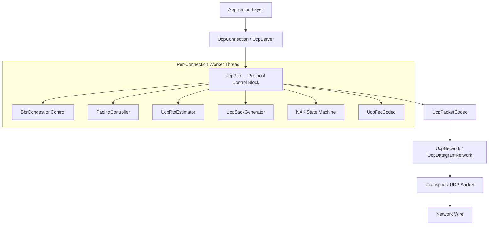

### Layer Responsibilities

| Layer | Core Components | Scope |
|---|---|---|
| **Application Layer** | `UcpServer`, `UcpConnection` | Application-facing public API. `UcpServer` manages passive connection acceptance and fair queue scheduling. `UcpConnection` provides asynchronous Send/Receive/Read/Write with backpressure, callback-based event notification, and transfer diagnostics. |
| **Protocol Control** | `UcpPcb` (Protocol Control Block) | Complete per-connection state machine: send buffer (with retransmission tracking), receive out-of-order buffer, ACK/SACK/NAK handling, retransmission timer management, BBR congestion control, Pacing controller, fair queue credit accounting, and optional FEC codec. All state mutations execute serially on the Worker Thread. |
| **Congestion & Pacing** | `BbrCongestionControl`, `PacingController`, `UcpRtoEstimator` | BBRv2 computes pacing rate and CWND from delivery rate samples. `PacingController` is a byte-level Token Bucket supporting ForceConsume negative balance emergency recovery. `UcpRtoEstimator` provides smoothed RTT estimates. |
| **Reliability Engine** | `UcpSackGenerator`, NAK State Machine, `UcpFecCodec` | SACK block generation. NAK state machine tracks per-sequence-number gap observation counts. `UcpFecCodec` implements RS encode/decode using precomputed GF(256) log/antilog tables. |
| **Serialization** | `UcpPacketCodec` | Handles big-endian wire format encoding/decoding for all packet types. Extracts piggybacked ACK fields from DATA/NAK/control packets. |
| **Network Driver** | `UcpNetwork`, `UcpDatagramNetwork` | Decouples the protocol engine from socket I/O. Manages Connection-ID datagram demultiplexing and drives `DoEvents()` timer dispatch. |

### Layered Data Flow

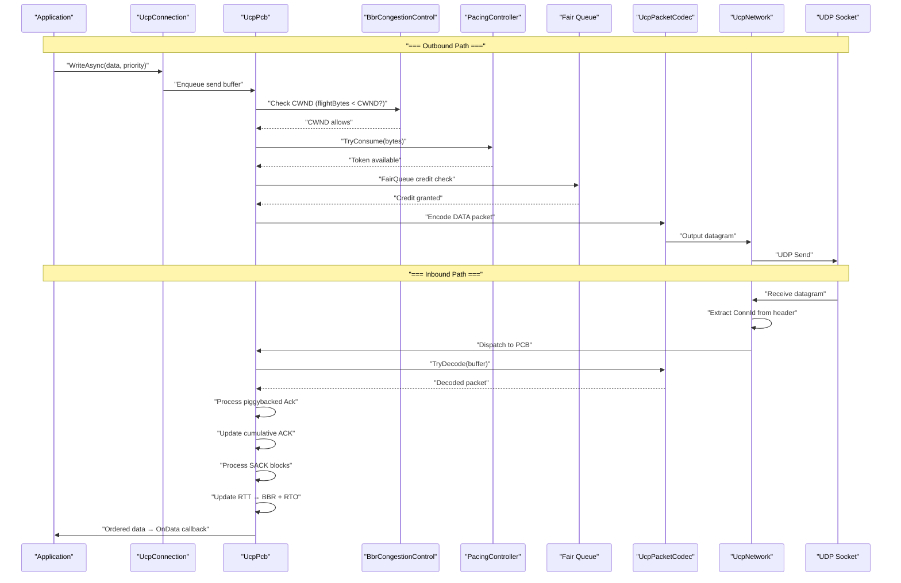

---

## UcpPcb — Protocol Control Block

`UcpPcb` is the central hub of the UCP architecture. Each active connection owns an independent PCB instance that manages every dimension of the protocol state machine.

### PCB Component Relationship Panorama

```mermaid
flowchart TD
    PCB["UcpPcb Protocol Control Block"] --> Sender["Sender State"]
    PCB --> Receiver["Receiver State"]
    PCB --> Timers["Timer Management"]
    PCB --> Recovery["Recovery System"]
    PCB --> Config["UcpConfiguration Reference"]
    
    Sender --> SendBuf["m_sendBuffer<br/>Outbound Segment Map"]
    Sender --> Flight["m_flightBytes<br/>Flight Bytes Counter"]
    Sender --> NextSeq["m_nextSendSequence<br/>Next Sequence Number"]
    Sender --> UrgBudget["m_urgentRecoveryPacketsInWindow<br/>Urgent Budget"]
    
    Receiver --> RecvBuf["m_recvBuffer<br/>Reordering Buffer"]
    Receiver --> NextExp["m_nextExpectedSequence<br/>Expected Sequence"]
    Receiver --> RecvQueue["m_receiveQueue<br/>Ordered Delivery Queue"]
    Receiver --> MissCounts["m_missingSequenceCounts<br/>Gap Observation Counts"]
    Receiver --> NakTier["Nak Confidence Tier"]
    Receiver --> LastNak["m_lastNakIssuedMicros<br/>NAK Suppression Timestamps"]
    
    Timers --> RtoTimer["RTO Timer<br/>Retransmit Timeout"]
    Timers --> KeepAlive["KeepAlive Timer<br/>Keep-Alive"]
    Timers --> Disconnect["Disconnect Timer<br/>Disconnect Timeout"]
    Timers --> DelAck["Delayed ACK Timer<br/>Delayed Acknowledgment"]
    Timers --> ProbeRTT["ProbeRTT Timer<br/>MinRTT Probe"]
    
    Recovery --> BBR["BbrCongestionControl<br/>BBRv2"]
    Recovery --> SACK["UcpSackGenerator<br/>SACK Generator"]
    Recovery --> NAK["NAK StateMachine<br/>NAK FSM"]
    Recovery --> FEC["UcpFecCodec<br/>FEC Codec"]
    Recovery --> RTO["UcpRtoEstimator<br/>RTO Estimator"]
```

### Sender State Details

| Data Structure | Type | Purpose |
|---|---|---|
| `m_sendBuffer` | `map<uint32_t, OutboundSegment>` | Sequence-ordered map of unacknowledged outbound segments. Cumulative ACKs remove acknowledged segments, freeing buffer memory. Each segment tracks its original send timestamp, retransmit count, and urgent recovery flag. |
| `m_flightBytes` | `int32_t` | Total payload bytes currently in flight. Used by BBRv2 to compute delivery rate (`delivered_bytes / elapsed_time`) and enforce the CWND in-flight cap. |
| `m_nextSendSequence` | `uint32_t` | Next 32-bit sequence number to send, incrementing monotonically modulo 2^32. Uses `UcpSequenceComparer` with a 2^31 comparison window for correct wrap-around. |
| `m_urgentRecoveryPacketsInWindow` | `int` | Number of urgent retransmissions used within the current RTT window. Reset to zero on each new RTT estimate. |
| `m_sentDataPackets` | `int32_t` | Total DATA packets sent (including initial and retransmissions), used for `RetransmissionRatio` calculation. |
| `m_retransmittedPackets` | `int32_t` | Count of retransmitted DATA packets. Together with `m_sentDataPackets` computes the retransmission ratio. |
| `m_pacing` | `PacingController*` | Pacing controller instance governing packet send rate. Supports `TryConsume` (normal send) and `ForceConsume` (urgent retransmission) modes. |

### Receiver State Details

| Data Structure | Type | Purpose |
|---|---|---|
| `m_recvBuffer` | `map<uint32_t, InboundSegment>` | Sequence-ordered map of out-of-order inbound segments. O(log n) insertion. Contiguous segments left of the cumulative ACK number are extracted and moved to `m_receiveQueue`. |
| `m_nextExpectedSequence` | `uint32_t` | The next sequence number required for ordered delivery. Advances when a contiguous run of segments starting at this number is available in `m_recvBuffer`. |
| `m_receiveQueue` | `queue<ReceiveChunk>` | Ordered, ready-to-deliver payload chunks consumed by the application via `ReceiveAsync`/`ReadAsync`. Each chunk carries a data buffer and length. |
| `m_missingSequenceCounts` | `map<uint32_t, int>` | Dictionary tracking per-sequence-number gap observation counts. Incremented each time a packet arrives above a gap. Used for NAK confidence tier determination. |
| `m_lastNakIssuedMicros` | `map<uint32_t, int64_t>` | Per-sequence-number timestamp of the last NAK issued. Combined with 250ms repeat suppression to prevent NAK storms for the same gap. |
| `m_bytesReceived` | `int64_t` | Total payload bytes received, exposed in transfer reports. |
| `m_rstReceived` | `bool` | Whether a peer RST packet was received, surfaced in diagnostic reports. |

---

## Worker Thread Per-Connection Serial Execution Model

The C++ UCP implementation uses a **Worker Thread** as the per-connection serial execution environment. Each `UcpConnection` processes all protocol events through its dedicated `deque` + `condition_variable`, fundamentally eliminating lock contention:

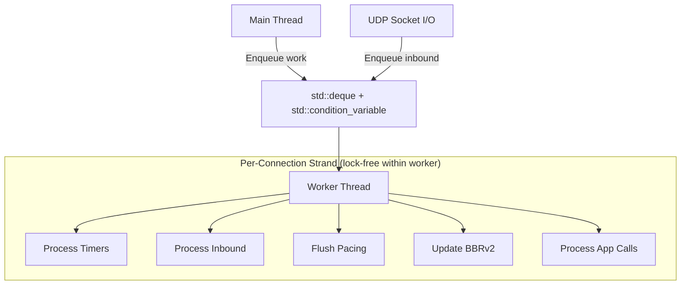

### Serial Model Key Properties

| Property | Description |
|---|---|
| **Lock-Free Design** | PCB state is never accessed concurrently by multiple threads. All mutations occur sequentially on the Worker Thread. `std::mutex` + `std::condition_variable` are used only for work item enqueue synchronization, not state protection. |
| **Predictable Ordering** | Packets are processed in enqueue order; application-level calls (Send/Receive/Close) execute in enqueue order. |
| **Zero Deadlock Risk** | The serial model eliminates lock ordering problems and ABBA deadlocks inherent in multi-lock designs. |
| **I/O Offloading** | UDP Socket `Send()` and `Receive()` run in a separate recv_thread; FEC decoding runs within the Worker Thread. |

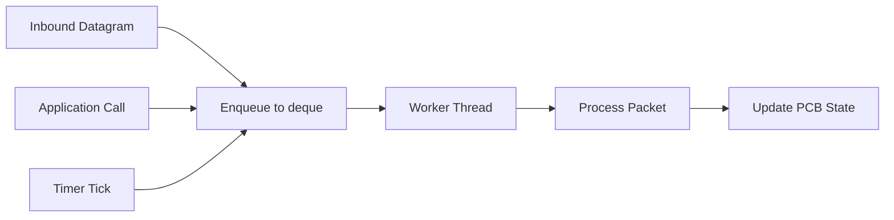

### UcpConnection Worker Thread Lifecycle

`UcpConnection` internally maintains a `std::thread worker_thread_`, a `std::deque<std::function<void()>> queue_`, and `std::condition_variable cv_`. All public methods (`Send`, `SendAsync`, `Receive`, `ReceiveAsync`, `Read`, `ReadAsync`, `Write`, `WriteAsync`, `Close`, `CloseAsync`) inject the actual operation into the queue via `Enqueue()`, which the Worker Thread serially consumes in `WorkerLoop()`.

```cpp
// Core model (simplified from ucp_connection.h)
std::deque<std::function<void()>> queue_;
std::condition_variable cv_;
std::thread worker_thread_;
std::atomic<bool> stopped_{false};
std::atomic<bool> worker_should_start_{false};
```

The Worker Thread starts via `StartWorker()` on the first `ConnectAsync` or `EnsureWorkerStarted()` call. `StopWorker()` sets the `stopped_` flag, notifies the condition_variable, and joins the thread. `Dispose()` ensures resource cleanup.

---

## Fair Queue Server Scheduling

The server `UcpServer` employs a credit-based round-robin fair queue scheduler ensuring fair egress bandwidth sharing across connections:

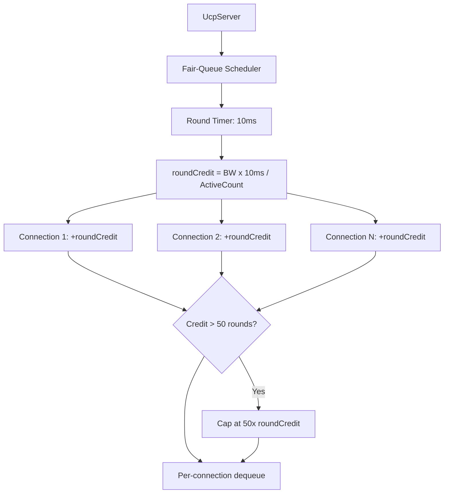

### Fair Queue Design Parameters

| Parameter | Value | Meaning |
|---|---|---|
| `FAIR_QUEUE_ROUND_MILLISECONDS` | 10ms | Per-round fair queue scheduling interval. Driven by `fair_queue_timer_id_` timer. |
| `MAX_BUFFERED_FAIR_QUEUE_ROUNDS` | 50 rounds | Maximum credit accumulation rounds. Idle connections accumulate at most 50 rounds of credit; excess is discarded. |

The server `UcpServer` internally maintains `std::map<uint32_t, std::unique_ptr<ConnectionEntry>> connections_` tracking all active connections. `OnFairQueueRound()` cycles over connections to allocate credit. `ScheduleFairQueueRound()` registers a periodic timer using `UcpNetwork::AddTimer()`.

---

## PacingController Token Bucket Design

`PacingController` implements a byte-level Token Bucket:

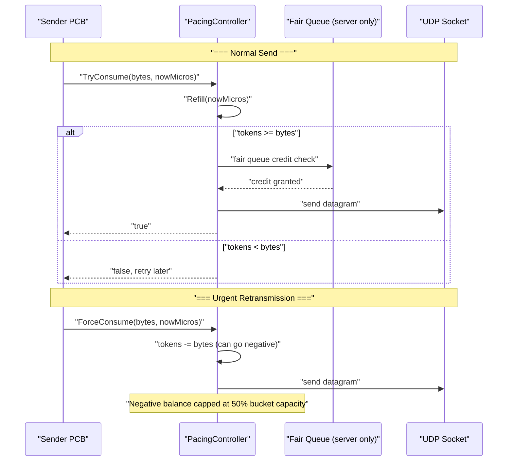

| Parameter | Default Value | Meaning |
|---|---|---|
| Token Fill Rate | `PacingRateBytesPerSecond` | BBRv2 real-time bottleneck bandwidth estimate × current gain factor |
| Bucket Capacity | `PacingRate × PacingBucketDurationMicros` (10ms) | Holds 10ms worth of bytes |
| `_sendQuantumBytes` | `Mss` (1220) | Consumption granularity per send attempt |
| `ForceConsume` | Immediate consumption → bucket can go negative | Negative balance capped at 50% of bucket capacity |
| `TryConsume` | Succeeds only when tokens are sufficient | Returns false on insufficiency; caller defers retry |

---

## BBRv2 Congestion Control Kernel

### Core Estimator Pipeline

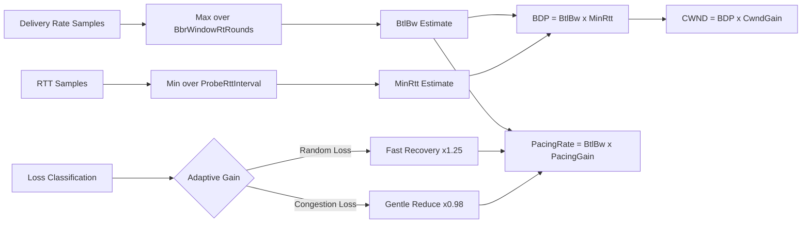

### BBRv2 Mode Behavior Table (C++ Implementation Values)

| Mode | Pacing Gain | CWND Gain | Duration | Purpose |
|---|---|---|---|---|
| **Startup** | 2.89 | 2.0 | Until bandwidth plateau appears (3 RTT windows without throughput growth) | Exponential bottleneck bandwidth probing |
| **Drain** | 1.0 | — | Approx. 1 BBR cycle | Drain bottleneck queue accumulated during Startup |
| **ProbeBW** | Cycle [1.35, 0.85, 1.0×6] | 2.0 | Steady state | 8-phase gain cycle |
| **ProbeRTT** | 0.85 | 4 packets | 100ms (every 30s) | Refresh MinRTT estimate |

### BBR Internal Key Implementation

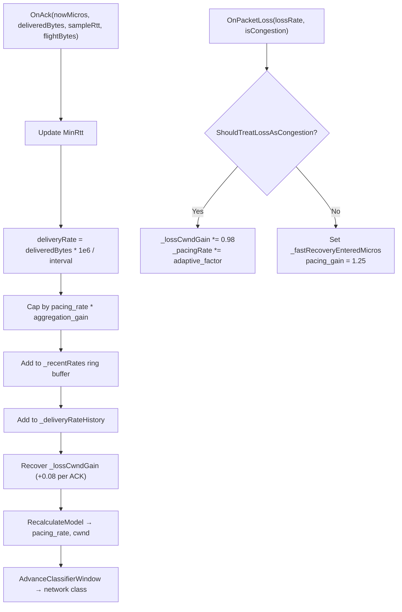

### Network Path Classifier (C++ Implementation)

BBRv2 uses a 200ms sliding window (`kNetworkClassifierWindowDurationMicros = 200000`) to examine RTT, jitter, and loss rate characteristics:

| Network Type | C++ Threshold Conditions | BBR Adaptive Behavior |
|---|---|---|
| `LowLatencyLAN` | RTT < 5ms, jitter < 3ms | Aggressive probing, high Startup gain 2.89 |
| `MobileUnstable` | Loss rate > 3%, jitter > 20ms | `kLossCwndRecoveryStepFast = 0.15`, accelerated CWND recovery |
| `LossyLongFat` | RTT > 80ms, persistent random loss | Skip ProbeRTT, maintain CWND against loss |
| `CongestedBottleneck` | Rising RTT + delivery rate drop | Enable `CongestionLossReduction 0.98×` multiplier |
| `SymmetricVPN` | Stable RTT, symmetric bandwidth | Standard BBR probing cycle |

### Congestion Classification Scoring System

```cpp
// C++ BBR implementation key classification parameters
kCongestionRateDropRatio  = -0.15;  // Delivery rate drop ≥15% → +1 congestion score
kCongestionRttIncreaseRatio = 0.50; // RTT increase ≥50% → +1 congestion score
kCongestionLossRatio       = 0.10;  // Loss rate ≥10% → +1 congestion score
kCongestionClassifierScoreThreshold = 2; // Total ≥2 → confirmed congestion
kRandomLossMaxRttIncreaseRatio = 0.20; // RTT increase <20% → random loss
```

---

## UcpFecCodec — Reed-Solomon GF(256) Codec

### Mathematical Foundation (C++ Implementation)

| Parameter | C++ Value |
|---|---|
| Irreducible Polynomial | `x^8 + x^4 + x^3 + x + 1` → generator `0x11d` |
| Primitive Element α | `0x02` (polynomial x) |
| Log Table | 256 entries `gf_log_[256]` |
| Antilog Table | 512 entries `gf_exp_[512]` |
| Addition | Bitwise XOR |
| Multiplication | `gf_exp_[(gf_log_[a] + gf_log_[b]) % 255]` — O(1) |
| Division | `gf_exp_[(gf_log_[a] - gf_log_[b] + 255) % 255]` — O(1) |

### Encode/Decode Flow

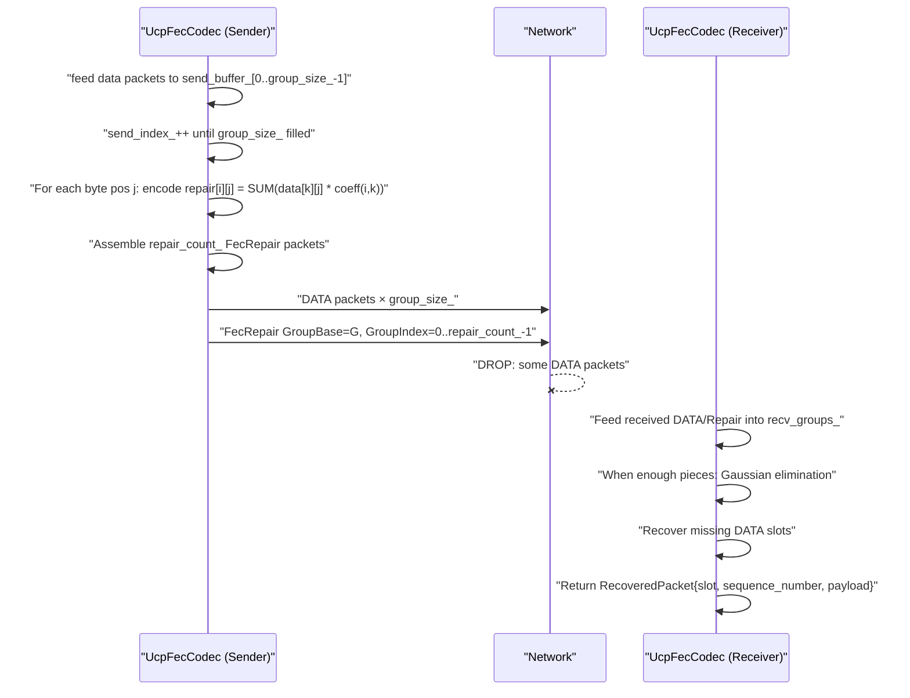

### C++ Internal Implementation

| Member | Meaning |
|---|---|
| `group_size_` | DATA packets per FEC group (2–64, default 8) |
| `repair_count_` | Repair packets per group (1 to group_size_) |
| `send_buffer_` | `vector<optional<vector<uint8_t>>>` — sender-side grouping buffer, length group_size_ |
| `send_index_` | Current write position; triggers encoding when reaching group_size_ |
| `recv_groups_` | `unordered_map<uint32_t, vector<optional<vector<uint8_t>>>>` — receiver-side storage by GroupBase |
| `recv_repairs_` | `unordered_map<uint32_t, map<int, vector<uint8_t>>>` — repair packets stored by GroupBase |

`GetGroupBase(sequence_number)` returns `(seq / group_size_) * group_size_`, `GetSlot(seq)` returns `seq % group_size_`.

`TryEncodeRepairs()` triggers when `send_index_` reaches `group_size_`: iterates each byte position, computes `repair[i][j] = Σ(data[k][j] × α^(i×k))` (truncated to `MAX_FEC_SLOT_LENGTH = 1200`).

`TryRecoverFromRepair()` implements Gaussian elimination: collects known entities from `recv_groups_[group_base]` and `recv_repairs_[group_base]`, builds a GF(256) matrix equation, and solves for missing slots via `TrySolve()`.

---

## UcpDatagramNetwork Network Driver

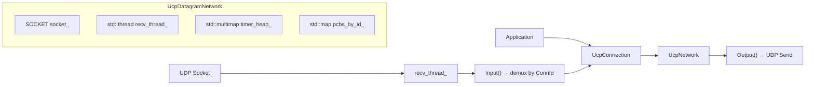

### DoEvents — Event Loop Heartbeat

```cpp
// UcpNetwork core method (simplified)
virtual int DoEvents();
```

`DoEvents()` performs:
- Processing timer expiration callbacks (`timer_heap_`)
- Dispatching inbound datagrams to corresponding PCBs
- Driving fair queue rounds
- Flushing outbound queues

### `UcpNetwork` Core API

| Method | Description |
|---|---|
| `Input(data, length, remote)` | Inbound datagram entry — extracts ConnId, looks up PCB for dispatch |
| `Output(data, length, remote, sender)` | Outbound datagram — sends via UDP Socket |
| `AddTimer(expireUs, callback)` | Registers a timer, returns timer_id |
| `CancelTimer(timerId)` | Cancels a timer |
| `GetNowMicroseconds()` / `GetCurrentTimeUs()` | Current time (microseconds), cached clock to reduce syscalls |
| `RegisterPcb(pcb)` / `UnregisterPcb(pcb)` | PCB lifecycle management |

`UcpDatagramNetwork` extends `UcpNetwork` and implements actual UDP Socket binding (`socket_`), receive thread (`recv_thread_`), and send (`Output()` override). Supports cross-platform WinSock2 / POSIX socket.

---

## Connection State Machine

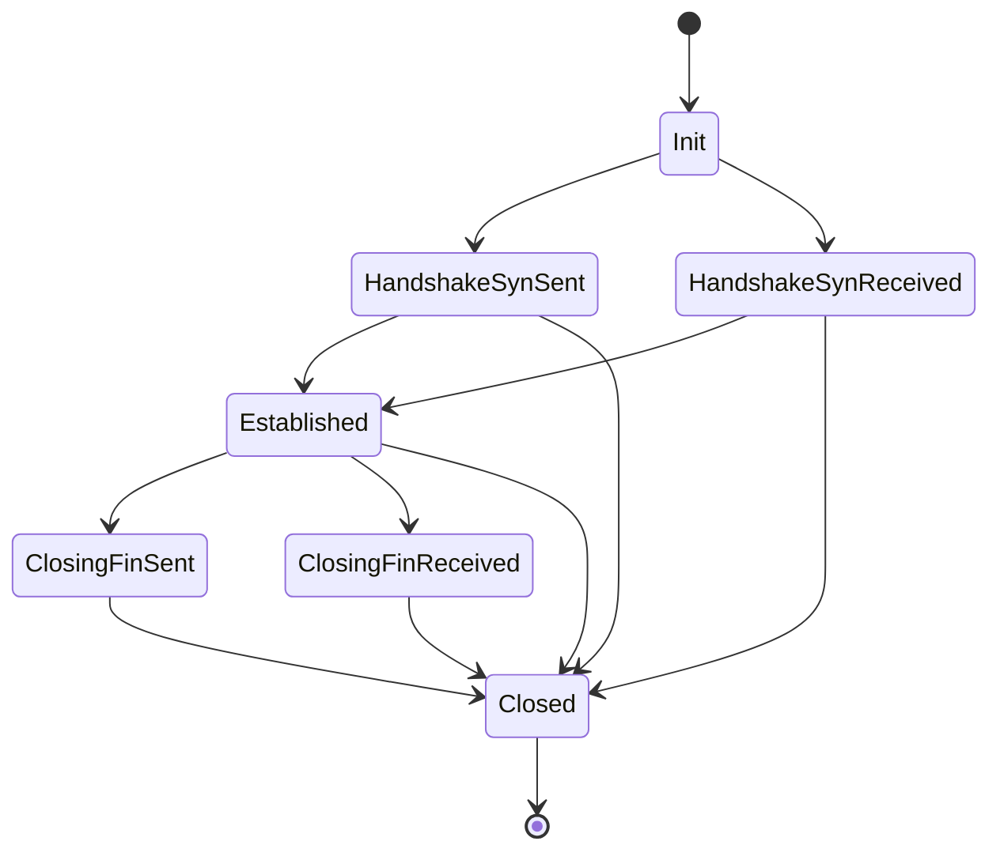

State enumeration defined in `ucp_enums.h:UcpConnectionState`: `Init → HandshakeSynSent → HandshakeSynReceived → Established → ClosingFinSent → ClosingFinReceived → Closed`.

| Transition | Trigger | Outbound Action | Timer |
|---|---|---|---|
| Init → HandshakeSynSent | Client `ConnectAsync()` | Send SYN (random ISN + ConnId) | connectTimer |
| Init → HandshakeSynReceived | Server receives SYN | Send SYNACK (piggybacked ACK) | connectTimer |
| → Established | Handshake completes | ACK confirmation | Stop connectTimer |
| Established → ClosingFinSent | Local `CloseAsync()` | Send FIN | disconnectTimer |
| Established → ClosingFinReceived | Peer FIN received | Send FIN ACK (FinAck flag) | disconnectTimer |
| → Closed | FIN exchange complete / timeout / RST | Optional RST | All stopped |

---

## ISN and Connection ID Random Generation

The C++ implementation uses `std::mt19937_64` Mersenne Twister engine seeded with `std::random_device{}()`:

```cpp
// ucp_pcb.cpp
static std::mt19937_64 g_connectionRng(std::random_device{}());
static std::mt19937_64 g_sequenceRng(std::random_device{}());

uint32_t UcpPcb::NextConnectionId() {
    uint32_t id;
    do { id = (uint32_t)(g_connectionRng() & 0xFFFFFFFFULL); } while (id == 0);
    return id;
}

uint32_t UcpPcb::NextSequence() {
    return (uint32_t)(g_sequenceRng() & 0xFFFFFFFFULL);
}
```

`NextConnectionId()` ensures a non-zero value; `NextSequence()` returns a random ISN. Both are generated from global mt19937_64 engines, providing cryptographic-level collision resistance.

---

## Sequence Arithmetic (UcpSequenceComparer)

```cpp
// ucp_sequence_comparer.h — key implementation
static bool IsAfter(uint32_t left, uint32_t right) {
    if (left == right) return false;
    return (left - right) < Constants::HALF_SEQUENCE_SPACE; // 0x80000000
}

static bool IsBefore(uint32_t left, uint32_t right) {
    return left != right && !IsAfter(left, right);
}
```

Uses the standard 2^31 comparison window for unambiguous sequence number wrap-around. `IsInForwardRange()` and `IsForwardDistanceAtMost()` provide extended range queries.

---

## Deterministic Testing Support

The C++ implementation supports deterministic in-process network simulation via `UcpNetwork`'s replaceable transport layer. `UcpDatagramNetwork`'s `Output()` method is virtual abstract, allowing substitute implementations to inject loss, delay, and reordering.

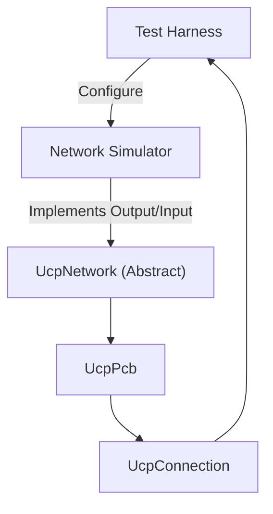

---

## Build & Development

```powershell
# C++ Build (CMake / MSBuild)
cmake -B build -S .
cmake --build build --config Release
```

The UCP C++ implementation is cross-platform: Windows (WinSock2), Linux/macOS (POSIX socket). Uses standard C++17 with zero third-party dependencies. All protocol constants are centrally managed in `ucp_constants.h` and `ucp_configuration.h`; configuration provides recommended defaults via the `UcpConfiguration::GetOptimizedConfig()` factory method.
