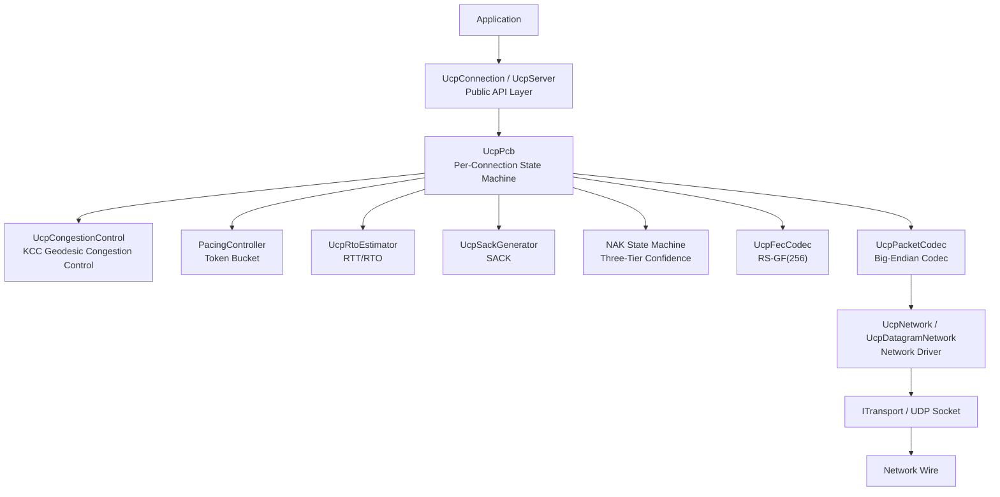
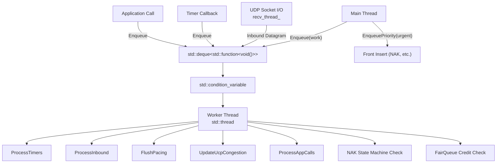
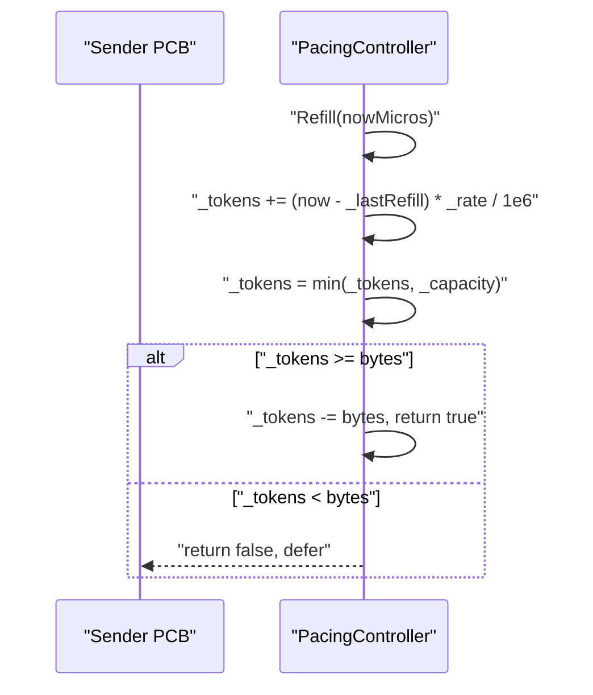
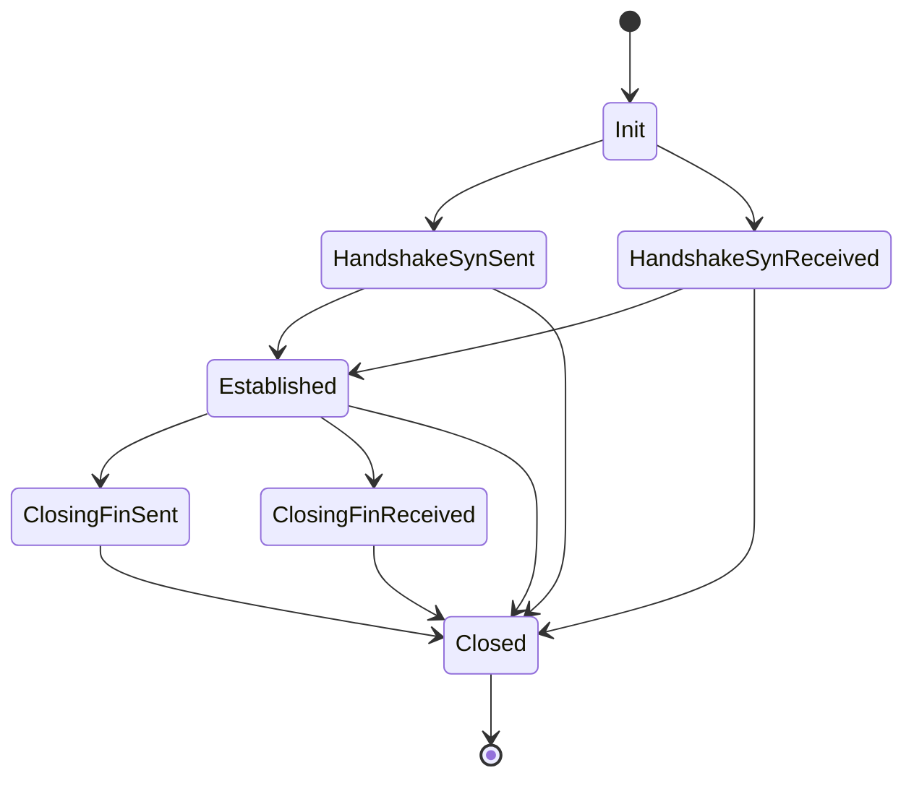

# UCP C++ Runtime Layer Structure

[Chinese](architecture_CN.md)

This document details the runtime layer structure of the UCP C++ implementation, covering the six-layer structure, Worker Thread serial model, UcpPcb protocol control block, fair queue, Pacing controller, KCC congestion control (FEC/NAK delivery samples feeding into CC), FEC codec, and connection state machine.

## Six-Layer Structure

UCP C++ is organized into six layers from application to UDP Socket:

| Layer | Core Classes | Responsibility |
|---|---|---|
| Application | UcpServer / UcpConnection | Public API, async I/O |
| Protocol Control | UcpPcb | Per-connection state machine, send/receive buffer |
| Congestion & Pacing | UcpCongestionControl / PacingController / UcpRtoEstimator | KCC Geodesic Congestion Control, Token Bucket, RTO |
| Reliability Engine | UcpSackGenerator / NAK FSM / UcpFecCodec | SACK, NAK, FEC recovery |
| Serialization | UcpPacketCodec | Big-endian packet codec |
| Network Driver | UcpNetwork / UcpDatagramNetwork | Event loop, UDP socket |


```mermaid
flowchart TD
    App["Application"] --> Conn["UcpConnection / UcpServer<br/>Public API Layer"]
    Conn --> PCB["UcpPcb<br/>Per-Connection State Machine"]
    PCB --> UCP["UcpCongestionControl<br/>KCC Geodesic Congestion Control"]
    PCB --> Pacing["PacingController<br/>Token Bucket"]
    PCB --> RTO["UcpRtoEstimator<br/>RTT/RTO"]
    PCB --> Sack["UcpSackGenerator<br/>SACK"]
    PCB --> Nak["NAK State Machine<br/>Three-Tier Confidence"]
    PCB --> FEC["UcpFecCodec<br/>RS-GF(256)"]
    PCB --> Codec["UcpPacketCodec<br/>Big-Endian Codec"]
    Codec --> Net["UcpNetwork / UcpDatagramNetwork<br/>Network Driver"]
    Net --> Transport["ITransport / UDP Socket"]
    Transport --> Wire["Network Wire"]
```

## Worker Thread Serial Model

Each UcpConnection owns a dedicated std::thread (Worker Thread) that processes all protocol events through a std::deque + std::condition_variable. This differs from C#'s SerialQueue (thread-pool-based Strand model).


```mermaid
flowchart TD
    Main["Main Thread"] -->|"Enqueue(work)"| Queue["std::deque&lt;std::function&lt;void()&gt;&gt;"]
    Main -->|"EnqueuePriority(urgent)"| QueueFront["Front Insert (NAK, etc.)"]
    Queue --> CV["std::condition_variable"]
    CV --> Worker["Worker Thread<br/>std::thread"]
    Worker --> T1["ProcessTimers"]
    Worker --> T2["ProcessInbound"]
    Worker --> T3["FlushPacing"]
    Worker --> T4["UpdateUcpCongestion"]
    Worker --> T5["ProcessAppCalls"]
    Worker --> T6["NAK State Machine Check"]
    Worker --> T7["FairQueue Credit Check"]
    IO["UDP Socket I/O<br/>recv_thread_"] -->|"Inbound Datagram"| Queue
    Timer["Timer Callback"] -->|"Enqueue"| Queue
    App["Application Call"] -->|"Enqueue"| Queue
```

### Serial Model Key Properties

| Property | C++ Implementation | Notes |
|---|---|---|
| Lock-free structure | std::mutex only protects queue_ push/pop | PCB state never accessed concurrently |
| Predictable order | FIFO + front priority | Packets processed in enqueue order |
| Zero deadlock risk | Single consumer model | Eliminates ABBA deadlock |
| I/O offload | recv_thread_ independent of Worker | Only sendto/recvfrom outside Worker |
| Deterministic testing | Overridable Output() pure virtual | NetworkSimulator injects loss/delay |

### Worker Thread Lifecycle

```cpp
// ucp_connection.h — Core data structures (simplified)
std::deque<std::function<void()>> queue_;
std::condition_variable cv_;
std::thread worker_thread_;
std::atomic<bool> stopped_{false};
std::atomic<bool> joining_{false};                 // set by external StopWorker before join
std::shared_ptr<std::atomic<bool>> alive_flag_;    // self-held; outlives this object
```

The Worker Thread serially consumes the queue in WorkerLoop().  It holds a LOCAL
copy of `alive_flag_` across the loop; after each `work()` it checks that flag
FIRST — if the connection was destroyed from within `work()` (e.g. a server-side
connection whose entry is the sole owner), the destructor already detached the
thread, and the loop returns without touching any other member (use-after-free
avoidance).  `StopWorker()` orders `joining_` before `stopped_` so a worker that
observes `stopped_` never self-detaches concurrently with an external `join()`;
when `StopWorker` is called on the worker thread itself it detaches directly.
`EnqueuePriority` inserts urgent items like NAK at the front of the queue.

## UcpPcb Protocol Control Block

UcpPcb is the per-connection state machine hub managing send/receive buffers, timers, and all recovery subsystems.

### PCB Components

| Component | Type | Purpose |
|---|---|---|
| m_sendBuffer | std::map<uint32_t, OutboundSegment> | Send buffer sorted by seq no |
| m_flightBytes | int32_t | Current in-flight bytes |
| m_nextSendSequence | uint32_t | Next send sequence number |
| m_recvBuffer | std::map<uint32_t, InboundSegment> | Out-of-order receive buffer |
| m_nextExpectedSequence | uint32_t | Expected next sequence |
| m_receiveQueue | std::queue<ReceiveChunk> | In-order delivery queue |
| m_missingSequenceCounts | std::map<uint32_t, int> | Gap observation counts |
| m_lastNakIssuedMicros | std::map<uint32_t, int64_t> | NAK suppression timestamps |

### Send Path

```cpp
void UcpPcb::SendData() {
    if (m_flightBytes >= CC_->CongestionWindowBytes()) return;
    if (!m_pacing->TryConsume(mss_, nowMicros)) return;
    UcpDataPacket packet;
    packet.sequence_number = m_nextSendSequence;
    auto encoded = UcpPacketCodec::Encode(packet);
    network_->Output(encoded.data(), encoded.size(), m_remote, nullptr);
    m_sendBuffer[m_nextSendSequence] = OutboundSegment{...};
    m_flightBytes += payloadSize;
    m_nextSendSequence = UcpSequenceComparer::Increment(m_nextSendSequence);
}
```

### Timer Management

UcpNetwork uses std::multimap<int64_t, std::function<void()>> for expiry-ordered timers. DoEvents() fires all expired timer callbacks on each call.

```cpp
uint32_t AddTimer(int64_t expireUs, std::function<void()> callback);
std::multimap<int64_t, std::function<void()>> timer_heap_;
std::map<uint32_t, shared_ptr<TimerEntry>> active_timers_;
```

## Fair Queue Server Scheduling

UcpServer uses credit-based round-robin fair queue scheduling, proportionally sharing egress bandwidth among connections:

| Parameter | C++ Value | C# Value |
|---|---|---|
| FAIR_QUEUE_ROUND_MILLISECONDS | 10ms | 10ms |
| MAX_BUFFERED_FAIR_QUEUE_ROUNDS | 4 | 4 |
| bandwidth_limit_bytes_per_sec_ | 12.5 MB/s | 12.5 MB/s |

```cpp
void UcpServer::OnFairQueueRoundCore() {
    std::vector<shared_ptr<UcpConnection>> active;
    lock_guard<mutex> lock(mutex_);
    for (auto& [connId, entry] : connections_) {
        if (NULLPTR == entry || false == entry->accepted) continue;
        auto connection = entry->connection
            ? entry->connection : entry->acceptedConnection;
        if (NULLPTR == connection) continue;
        auto state = connection->GetState();
        if ((Established == state || ClosingFinSent == state ||
             ClosingFinReceived == state) &&
            connection->HasPendingSendData())
            active.push_back(connection);
    }
    if (active.empty()) return;
    double roundCredit = bandwidth_limit_bytes_per_sec_ * 0.01 / active.size();
    for (auto& connection : active) connection->AddFairQueueCredit(roundCredit);
    ScheduleFairQueueRound();
}
```

## PacingController Token Bucket

PacingController implements a byte-level token bucket, controlling outbound rate through TryConsume and ForceConsume:

| Parameter | Default | Meaning |
|---|---|---|
| _sendQuantumBytes | 1220 (MSS) | Minimum consume granularity |
| _bucketDurationMicros | 10000 (10ms) | Bucket capacity window |
| _capacity | PacingRate * 10ms | Max token capacity |
| _tokens | Initial = _capacity | Current token balance |

### Token Bucket Flow


```mermaid
sequenceDiagram
    participant S as "Sender PCB"
    participant P as "PacingController"
    P->>P: "Refill(nowMicros)"
    P->>P: "_tokens += (now - _lastRefill) * _rate / 1e6"
    P->>P: "_tokens = min(_tokens, _capacity)"
    alt "_tokens >= bytes"
        P->>P: "_tokens -= bytes, return true"
    else "_tokens < bytes"
        P-->>S: "return false, defer"
    end
```

ForceConsume allows urgent retransmissions to bypass token checks (drains remaining tokens to zero; no negative token debt).

## KCC (Geodesic Congestion Control) Congestion Control

### KCC (Geodesic Congestion Control) Modes and Gains

| Mode | Pacing Gain | CWND Gain | Exit Condition |
|---|---|---|---|
| Startup | 2.887 (739/256) | 2.887 | 3 consecutive RTT growth < 25% |
| Drain | 0.344 (88/256) | 2.887 (739/256) | In-flight ≤ 1.0 × BDP AND 1 RTT elapsed (or 4×min_rtt timeout) |
| ProbeBW | Cycle [1.25, 0.75, 1.0x6] | 2.0 | 8-phase cycle |

### Geodesic Estimator for Propagation Delay Estimation

A single-state geodesic estimator (G1/G2/G3) provides noise-robust propagation delay estimation, separating true signal from measurement noise via a three-component behavioral model (T_prop / T_queue / T_noise). There is no covariance matrix, no process model, and no adaptive gain. The UCP geodesic estimator is independently implemented (ucp_cc.cpp), referencing the KCC three-component RTT decomposition model from tcp_kcc.c. The filtered RTT feeds into:
- MinRtt tracking (G1/G3 handles automatically)

The sendable upper limit is min(cwnd, peer-declared receive window); the initial cwnd is NOT a fixed 10-packet cap.

### FEC/NAK Integration with Congestion Control

FEC recovery and NAK observations provide high-fidelity delivery samples to the congestion control engine. FEC-recovered bytes contribute to the delivery-rate sample as bandwidth samples, improving throughput estimation. NAK observations provide loss-sample data that improves long-term bandwidth EWMA estimation. These sample sources are independent but complementary, enabling accurate bandwidth/delay estimation even under significant packet loss.

## UcpFecCodec RS-GF(256)

FEC uses systematic Reed-Solomon coding over GF(256). Packets organized into groups (default 8), each group generates repair_count repair packets.

### GF(256) Table Initialization

```cpp
bool UcpFecCodec::tables_initialized_ = []() {
    int value = 1;
    for (int i = 0; i < 255; i++) {
        gf_exp_[i] = static_cast<uint8_t>(value);
        gf_log_[value] = static_cast<uint8_t>(i);
        value <<= 1;
        if (value & 0x100) value ^= 0x11d;
    }
    for (int i = 255; i < 512; i++)
        gf_exp_[i] = gf_exp_[i - 255];
    return true;
}();
```

| Operation | Complexity | Implementation |
|---|---|---|
| Addition | O(1) | XOR |
| Multiplication | O(1) | 2 lookups + 1 add + 1 mod |
| Division | O(1) | 2 lookups + 1 sub |
| Inversion | O(1) | 1 lookup + 1 sub |

## ECN Support and Graduated Backoff

UCP supports Explicit Congestion Notification (ECN)-style graduated backoff based on queuing delay, reducing the injection rate before packet loss occurs. This is not wire-protocol ECN (no IP ECN field) -- it is a delay-driven congestion avoidance mechanism. In C++ it is compiled out (`#if KCC_ECN_ENABLED != 0` with the macro at 0 in ucp_constants.h), so a rebuild is required to enable it; runtime opt-in is C#-only (`UcpConfiguration.EcnEnabled`).

The ECN backoff logic (`kcc_ecn_enable = 1`) monitors the geodesic-filtered queuing delay. When queuing delay exceeds the congestion threshold (max(25% of min_rtt, 500 us)), cwnd_gain is reduced by `kcc_ecn_backoff_num/kcc_ecn_backoff_den` (20%). An EWMA filter (`kcc_ecn_ewma_retained/kcc_ecn_ewma_total = 3/4`) smooths the instant queuing delay signal. During idle periods, the EWMA decays by `kcc_ecn_idle_decay_num/kcc_ecn_idle_decay_den` (31/32) per round.

This graduated backoff provides a smooth congestion response that activates before bufferbloat or packet loss, complementing the loss-based and model-based congestion signals.

## ACK Aggregation Compensation

UCP detects ACK compression/clustering through a dual-window measurement: `extra_acked` (bytes ACKed beyond the bandwidth-expected epoch total) is tracked in two sliding window slots rotating every 5 RTTs (`kcc_agg_window_rotation_rtts = 5`):

| Parameter | Default | Description |
|---|---|---|
| `kcc_agg_window_rotation_rtts` | 5 | Dual-window rotation period (RTTs) |
| `kcc_extra_acked_gain` | 256 (1.0x) | Compensation gain |
| `KCC_EXTRA_ACKED_MAX_MS_RATIO` | 100 | extra_acked cap window (ms) |
| `kcc_extra_acked_win_rtts_max` | 31 | Max rotation RTTs |
| `kcc_ack_epoch_max` | 0x100000 | ACK epoch accumulator cap (bytes) |

The compensation is applied only on paths with min_rtt >= 7.5ms; the cwnd bonus = extra_acked x gain, capped at bw x 100ms, preventing ACK compression artifacts from inflating bandwidth estimates.

## LT Bandwidth Estimation

Long-Term (LT) bandwidth estimation maintains a smoothed bandwidth estimate over extended timescales using an EWMA filter, supplementing the UCP max-filter (BtlBw) which captures peak bandwidth.

The LT bandwidth is updated at intervals of at least `kcc_lt_intvl_min_rtts` (4) RTTs. The EWMA update applies a weight of `kcc_lt_bw_ema_num/kcc_lt_bw_ema_den` (1/2) when the current delivery rate is within `kcc_lt_bw_ratio_num/kcc_lt_bw_ratio_den` (1/8) of the stored LT bandwidth. If the difference is larger, the estimate is updated more aggressively. The LT estimate is reset if no update occurs within `kcc_lt_bw_max_rtts` (48) RTTs.

During loss events exceeding `kcc_lt_loss_thresh` (50, ~20%), the LT estimate is preserved (not updated with lossy samples), preventing loss-induced bandwidth reduction from persisting.

## Connection State Machine


```mermaid
stateDiagram-v2
    [*] --> Init
    Init --> HandshakeSynSent
    Init --> HandshakeSynReceived
    HandshakeSynSent --> Established
    HandshakeSynReceived --> Established
    Established --> ClosingFinSent
    Established --> ClosingFinReceived
    ClosingFinSent --> Closed
    ClosingFinReceived --> Closed
    Closed --> [*]
    HandshakeSynSent --> Closed
    HandshakeSynReceived --> Closed
    Established --> Closed
```

UcpConnectionState enum contains 7 values: Init, HandshakeSynSent, HandshakeSynReceived, Established, ClosingFinSent, ClosingFinReceived, Closed.

## ISN and Connection ID Generation

Two independent std::mt19937_64 engines generate ConnId and ISN:

```cpp
static std::mt19937_64 g_connectionRng(std::random_device{}());
static std::mt19937_64 g_sequenceRng(std::random_device{}());

uint32_t UcpPcb::NextConnectionId() {
    uint32_t id;
    do { id = (uint32_t)(g_connectionRng() & 0xFFFFFFFFULL); } while (id == 0);
    return id;
}

uint32_t UcpPcb::NextSequence() {
    return (uint32_t)(g_sequenceRng() & 0xFFFFFFFFULL);
}
```

## Deterministic Test Architecture

UCP C++ supports replaceable transport layers through UcpNetwork's virtual method Output(). NetworkSimulator inherits UcpNetwork and overrides Output() to inject loss, delay, and reordering.

A virtual logical clock advances at byte granularity independent of the system steady_clock. The transmission rate equals the configured bottleneck bandwidth, eliminating OS scheduling jitter from measurements.

## UcpSequenceComparer Sequence Arithmetic

32-bit circular sequence space with 2^31 comparison window:

```cpp
static constexpr uint32_t HALF_SEQUENCE_SPACE = 0x80000000U;

static bool IsAfter(uint32_t left, uint32_t right) {
    if (left == right) return false;
    return (left - right) < HALF_SEQUENCE_SPACE;
}

static bool IsBefore(uint32_t left, uint32_t right) {
    return left != right && !IsAfter(left, right);
}
```

## Platform Abstraction

UcpDatagramNetwork encapsulates Windows and POSIX platform differences isolated in ~150 lines of conditional code via #ifdef _WIN32:

| Feature | Windows | POSIX |
|---|---|---|
| Socket create | socket(AF_INET, SOCK_DGRAM, IPPROTO_UDP) | socket(AF_INET, SOCK_DGRAM, 0) |
| Non-blocking | ioctlsocket(socket_, FIONBIO, &nb) | fcntl(socket_, F_SETFL, O_NONBLOCK) |
| Error code | WSAGetLastError() / WSAEWOULDBLOCK | errno / EAGAIN |
| Address struct | SOCKADDR_IN | struct sockaddr_in |

## CMake Build

```bash
# Release build
cmake -B build -S . -DCMAKE_BUILD_TYPE=Release
cmake --build build

# Debug build
cmake -B build_debug -S . -DCMAKE_BUILD_TYPE=Debug
cmake --build build_debug
```

| Target | Type | Description |
|---|---|---|
| ucp | Static library | Protocol core |
| ucp_tests | Executable | Unit and integration tests |
| ucp_echo_server | Executable | Echo server example |
| ucp_echo_client | Executable | Echo client example |
| ucp_benchmark | Executable | Benchmark suite |
| ucp_benchmark_diag | Executable | Benchmark with diagnosis output |

## Related Documents

- [protocol_EN.md](protocol_EN.md) — Wire format and packet types
- [api_EN.md](api_EN.md) — API reference
- [performance_EN.md](performance_EN.md) — Performance characteristics
- [constants_EN.md](constants_EN.md) — Protocol constants
- [README_EN.md](../README_EN.md) — Project overview
- [Linux Kernel Module](../../linux/README.md) — KCC Geodesic Congestion Control module (tcp_kcc.c v2.0, with KCC Forwarding (KF) for cross-connection bandwidth sharing)

---

## License and Trademark

MIT License. See [LICENSE](../../LICENSE) for full text.

Copyright (c) 2026 PPP PRIVATE NETWORK™ X

PPP PRIVATE NETWORK™ is a trademark of PPP PRIVATE NETWORK.
