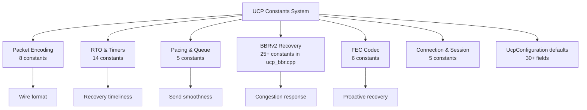

# PPP PRIVATE NETWORK™ X — 通用通信协议 (UCP) — C++ 协议常量

**协议标识: `ppp+ucp`** — 本文档按子系统分类详尽记录 UCP C++ 实现中的全部常量。所有常量定义在 `ucp_constants.h` 命名空间 `Constants` 中，BBR 相关常量在 `ucp_bbr.cpp` 中，配置默认值在 `ucp_configuration.h` 中。除显式命名外（如 `*Micros`），时间值以微秒（µs）为单位，大小以字节为单位。

---

## 常量体系全景图



---

## 1. 包编码常量 (`ucp_constants.h`)

| 常量 | 值 | 含义与设计理由 |
|---|---|---|
| `MSS` | 1220 | 默认最大分段大小（含头部）。适配多数互联网路径 MTU（1500 − UDP 头(8) − IP 头(20) = 1472），留有安全余量避免 IP 分片。 |
| `COMMON_HEADER_SIZE` | 12 | Type(1) + Flags(1) + ConnId(4) + Timestamp(6) = 12 字节。所有包类型固定前缀。 |
| `DATA_HEADER_SIZE` | `COMMON_HEADER_SIZE + 8` = 20 | 公共头(12) + SeqNum(4) + FragTotal(2) + FragIndex(2)。不含可选捎带 ACK。 |
| `DATA_HEADER_SIZE_WITH_ACK` | `DATA_HEADER_SIZE + 20` | 含捎带 ACK: +AckNumber(4) + SackCount(2) + WindowSize(4) + EchoTimestamp(6) = 40。 |
| `ACK_FIXED_SIZE` | 26 | AckNumber(4) + SackCount(2) + WindowSize(4) + EchoTimestamp(6) + 公共头(12)。 |
| `SACK_BLOCK_SIZE` | 8 | StartSequence(4) + EndSequence(4)。每个范围最多在 SACK 生成器中生成 1 次。 |
| `DEFAULT_ACK_SACK_BLOCK_LIMIT` | **2** | 每个 ACK 包最大 SACK 块数。值为 2 限制 SACK 信息密度，减轻 ACK 包体积。 |
| `HALF_SEQUENCE_SPACE` | `0x80000000U` | 2^31，`UcpSequenceComparer` 使用的比较窗口边界。32 位序号环绕无歧义比较。 |
| `PIGGYBACK_ACK_SIZE` | 4 | HasAckNumber (0x08) 置位时紧随公共头的 AckNumber 字段大小。 |

### 包编解码中的大端序常量 (`ucp_packet_codec.h`)

| 常量 | 值 | 含义 |
|---|---|---|
| `BYTE_BITS` | 8 | 大端移位常量 |
| `UINT16_BITS` | 16 | ReadUInt16/WriteUInt16 移位 |
| `UINT24_BITS` | 24 | ReadUInt32/WriteUInt32 偏移 |
| `UINT32_BITS` | 32 | ReadUInt48/WriteUInt48 偏移 |
| `UINT40_BITS` | 40 | ReadUInt48/WriteUInt48 偏移 |
| `UINT48_MASK` | `0x0000FFFFFFFFFFFFULL` | WriteUInt48 掩码 |
| `MAX_ACK_SACK_BLOCKS` | `(MSS - ACK_FIXED_SIZE) / SACK_BLOCK_SIZE` | 基于 MSS 计算的理论最大 SACK 块数 |

---

## 2. RTO 与定时器常量 (`ucp_constants.h`)

| 常量 | C++ 值 | 含义与设计理由 |
|---|---|---|
| `INITIAL_RTO_MICROS` | **100,000** (100ms) | 初始 RTO（无 RTT 样本时）。首次 RTT 样本到达后切换为基于 SRTT 的计算。 |
| `MIN_RTO_MICROS` | **20,000** (20ms) | 绝对最小 RTO。在低延迟路径上可快至 20ms 检测丢包，远低于 TCP 的 200ms。 |
| `DEFAULT_RTO_MICROS` | **50,000** (50ms) | 默认 RTO（配置参数）。比 MIN_RTO 略高，提供平衡的默认值。 |
| `DEFAULT_MAX_RTO_MICROS` | 15,000,000 (15s) | 配置默认最大 RTO。TCP 通常 ≥60s，UCP 选择 15s 以更快检测死路径。 |
| `MAX_RTO_MICROS` | **60,000,000** (60s) | 绝对最大 RTO 硬限制。 |
| `RTO_BACKOFF_FACTOR` | **1.2** | 连续超时 RTO 乘数。TCP 用 2.0×（指数增长迅速），UCP 用 1.2× 更温和增长。序列：100ms → 120ms → 144ms → ... → 60s。 |
| `MAX_RETRANSMISSIONS` | 10 | 最大重传次数。超限后触发连接关闭。 |
| `RTT_VAR_DENOM` | 4 | RTTVAR 更新分母：`rttvar += (|srtt - sample| - rttvar)/4` |
| `RTT_SMOOTHING_DENOM` | 8 | SRTT 平滑分母：`srtt += (sample - srtt)/8` |
| `RTT_SMOOTHING_PREVIOUS_WEIGHT` | 7 | SRTT 历史权重：7/8 |
| `RTT_VAR_PREVIOUS_WEIGHT` | 3 | RTTVAR 历史权重：3/4 |
| `RTO_GAIN_MULTIPLIER` | 4 | RTO 计算：`rto = srtt + 4 × rttvar`。与 TCP 相同。 |
| `RTO_MAX_BACKOFF_MIN_RTO_MULTIPLIER` | 2 | RTO 退避时相对于 MIN_RTO 的上限倍率。 |
| `MICROS_PER_MILLI` | 1000 | 单位换算 |
| `MICROS_PER_SECOND` | 1000000 | 单位换算 |

---

## 3. Pacing 与队列常量 (`ucp_constants.h` + `ucp_configuration.h`)

| 常量 | 值 | 含义与设计理由 |
|---|---|---|
| `DEFAULT_MIN_PACING_INTERVAL_MICROS` | 0 | 无人工最小包间隔。Token Bucket 全权控制 Pacing 时序。 |
| `DEFAULT_PACING_BUCKET_DURATION_MICROS` | 10,000 (10ms) | Token Bucket 容量窗口。容量 = PacingRate × 10ms。 |
| `DEFAULT_PACING_WAIT_MICROS` | 1000 (1ms) | Pacing Token 不足时的等待间隔。 |
| `FAIR_QUEUE_ROUND_MILLISECONDS` | 10 | 服务端公平队列每轮时长（毫秒）。 |
| `TIMER_INTERVAL_MILLISECONDS` | **1** | 内部定时器刻度间隔（毫秒）。比 C# 版本的 20ms 更细腻，提供更快响应。 |
| `CONNECT_TIMEOUT_MILLISECONDS` | 5000 | 连接超时（毫秒）。 |

### 缓冲与窗口默认值

| 常量 | 值 | 含义 |
|---|---|---|
| `DEFAULT_SEND_BUFFER_BYTES` | 32 MB | 发送缓冲默认大小 |
| `DEFAULT_SERVER_BANDWIDTH_BYTES_PER_SECOND` | 12,500,000 (100Mbps) | 服务端带宽默认值 |
| `DEFAULT_INITIAL_BANDWIDTH_BYTES_PER_SECOND` | 12,500,000 (100Mbps) | BBR 初始带宽估计 |
| `DEFAULT_MAX_PACING_RATE_BYTES_PER_SECOND` | 12,500,000 (100Mbps) | 配置默认 Pacing 上限 |
| `DEFAULT_MAX_CONGESTION_WINDOW_BYTES` | 64 MB | CWND 硬上限 |
| `INITIAL_CWND_PACKETS` | 20 | 初始拥塞窗口（包数） |
| `DEFAULT_ACK_SACK_BLOCK_LIMIT` | 2 | 每 ACK 包最大 SACK 块数 |
| `DEFAULT_DELAYED_ACK_TIMEOUT_MICROS` | **100** (100µs) | 延迟 ACK 聚合超时 |
| `DEFAULT_MAX_BANDWIDTH_WASTE_RATIO` | 0.25 | 带宽浪费预算比例 |
| `DEFAULT_MAX_BANDWIDTH_LOSS_PERCENT` | 25.0 | 丢包预算百分比 |

### 丢包预算约束

| 常量 | 值 | 含义 |
|---|---|---|
| `MIN_MAX_BANDWIDTH_LOSS_PERCENT` | 15.0 | MaxBandwidthLossPercent 最低下限 |
| `MAX_MAX_BANDWIDTH_LOSS_PERCENT` | 35.0 | MaxBandwidthLossPercent 最高上限 |

---

## 4. BBRv2 常量 (`ucp_bbr.cpp`)

### 4.1 BBR 增益常量

| 常量 | C++ 值 | 含义 |
|---|---|---|
| `BBR_STARTUP_PACING_GAIN` | **2.89** | Startup 阶段 Pacing 增益。C++ 实现的激进值用于快速探测瓶颈带宽。 |
| `BBR_STARTUP_CWND_GAIN` | 2.0 | Startup 阶段 CWND 增益。 |
| `BBR_DRAIN_PACING_GAIN` | **1.0** | Drain 阶段 Pacing 增益。设为 1.0 以中性速率排空队列。 |
| `BBR_PROBE_BW_HIGH_GAIN` | **1.35** | ProbeBW 上探阶段增益。比 C# 的 1.25 更激进。 |
| `BBR_PROBE_BW_LOW_GAIN` | 0.85 | ProbeBW 下探阶段增益。 |
| `BBR_PROBE_BW_CWND_GAIN` | 2.0 | ProbeBW CWND 增益。 |

### 4.2 速率增长与窗口常量

| 常量 | 值 | 含义 |
|---|---|---|
| `kStartupGrowthTarget` | 1.25 | Startup 每轮带宽增长目标 (25%) |
| `kStartupBandwidthGrowthPerRound` | 2.0 | Startup 每轮带宽增长上限 (100%) |
| `kSteadyBandwidthGrowthPerRound` | 1.25 | 稳定态每轮带宽增长上限 (25%) |
| `kStartupAckAggregationRateCapGain` | 4.0 | Startup ACK 聚合速率上限倍率 |
| `kSteadyAckAggregationRateCapGain` | 1.50 | 稳定态 ACK 聚合速率上限倍率 |
| `kMinStartupFullBandwidthRounds` | 3 | Startup 最小满带宽轮数 |
| `kWindowRtRounds` | 10 | BtlBw 最大滤波窗口 RTT 轮数 |
| `kProbeBwGainCount` | 8 | ProbeBW 8 阶段循环 |
| `kMicrosPerSecond` | 1000000 | 微秒/秒 |
| `kMicrosPerMilli` | 1000 | 微秒/毫秒 |
| `kDefaultRateWindowMicros` | 1000000 (1s) | 默认速率窗口 |
| `kBandwidthGrowthFallbackIntervalMicros` | 10000 (10ms) | 带宽增长回退间隔 |
| `kMinRoundDurationMicros` | 1000 (1ms) | 最小 RTT 轮次持续时间 |
| `kRtoMaxBackoffMinRtoMultiplier` | 2 | RTO 最大退避乘数相对于 MinRTO |

### 4.3 丢包响应常量

| 常量 | C++ 值 | 含义 |
|---|---|---|
| `kLossCwndRecoveryStep` | **0.08** | 每 ACK 的 CWND 增益恢复步长（正常） |
| `kLossCwndRecoveryStepFast` | **0.15** | 每 ACK 的 CWND 增益恢复步长（Mobile/RandomLoss） |
| `kCongestionLossReduction` | 0.98 | 拥塞丢包确认后对 pacing 增益的乘数削减 (仅降 2%) |
| `kMinLossCwndGain` | 0.95 | 拥塞后 CWND 增益最低下限 (BDP × 0.95) |
| `kLossBudgetRecoveryRatio` | 0.80 | 丢包预算恢复比例 |
| `kFastRecoveryPacingGain` | 1.25 | 随机丢包快恢复 Pacing 增益 |
| `kHighLossPacingGain` | 1.00 | 高丢包 Pacing 增益（保持基础值） |

### 4.4 丢包率分层常量

| 常量 | 值 | 含义 |
|---|---|---|
| `kLowLossRatio` | 0.01 (1%) | 低丢包界限 |
| `kModerateLossRatio` | 0.03 (3%) | 中丢包界限 |
| `kLightLossRatio` | 0.08 (8%) | 轻度丢包界限 |
| `kMediumLossRatio` | 0.15 (15%) | 中度丢包界限 |
| `kLowRttIncreaseRatio` | 0.10 (10%) | 低 RTT 增长比例 |
| `kModerateRttIncreaseRatio` | 0.20 (20%) | 中度 RTT 增长比例 |
| `kModerateProbeGain` | 1.50 | 中度探测增益 |
| `kLightLossPacingGain` | 1.10 | 轻度丢包 Pacing 增益 |
| `kMediumLossPacingGain` | 1.05 | 中度丢包 Pacing 增益 |

### 4.5 丢包 EWMAA 常量

| 常量 | 值 | 含义 |
|---|---|---|
| `kLossEwmaIdleDecay` | 0.90 | 空闲衰减因子 |
| `kLossEwmaRetainedWeight` | 0.75 | 保留历史权重 (75%) |
| `kLossEwmaSampleWeight` | 0.25 | 新样本权重 (25%) |

### 4.6 拥塞分类器常量

| 常量 | C++ 值 | 含义 |
|---|---|---|
| `kCongestionRateDropRatio` | -0.15 | 投递率下降 ≥15% → +1 拥塞分 |
| `kCongestionRttIncreaseRatio` | 0.50 | RTT 增长 ≥50% → +1 拥塞分 |
| `kCongestionLossRatio` | 0.10 | 丢包率 ≥10% → +1 拥塞分 |
| `kCongestionRateDropScore` | 1 | 投递率下降得分 |
| `kCongestionRttGrowthScore` | 1 | RTT 增长得分 |
| `kCongestionLossScore` | 1 | 丢率得分 |
| `kCongestionClassifierScoreThreshold` | **2** | 总分 ≥2 → 确认拥塞 |
| `kRandomLossMaxRttIncreaseRatio` | 0.20 | RTT 增长 <20% → 随机丢包 |
| `kRateLossHintMaxRatio` | 0.05 | 丢包率 <5% → 非拥塞提示 |

### 4.7 ProbeRTT 常量

| 常量 | C++ 值 | 含义 |
|---|---|---|
| `kProbeRttIntervalMicros` / `BBR_PROBE_RTT_INTERVAL_MICROS` | 30,000,000 (30s) | ProbeRTT 触发间隔 |
| `kProbeRttDurationMicros` / `BBR_PROBE_RTT_DURATION_MICROS` | 100,000 (100ms) | ProbeRTT 最短持续时间 |
| `kProbeRttPacingGain` | 0.85 | ProbeRTT Pacing 增益 |
| `kProbeRttExitRttMultiplier` | 1.05 | ProbeRTT 退出 RTT 倍率 |
| `kProbeRttMaxDurationMultiplier` | 2 | ProbeRTT 最大持续时间倍率 (200ms) |

### 4.8 Inflight 边界

| 常量 | 值 | 含义 |
|---|---|---|
| `kInflightLowGain` | 1.25 | Inflight 下限 = BDP × 1.25 |
| `kInflightHighGain` | 2.00 | Inflight 上限 = BDP × 2.00 |
| `kInflightMobileHighGain` | 2.00 | Mobile 网络 Inflight 上限 |

### 4.9 网络分类器阈值

| 常量 | C++ 值 | 含义 |
|---|---|---|
| `kNetworkClassifierLanRttMs` | 5.0 | LAN RTT 阈值 (ms) |
| `kNetworkClassifierLanJitterMs` | 3.0 | LAN 抖动阈值 (ms) |
| `kNetworkClassifierMobileLossRate` | 0.03 | Mobile 丢包率阈值 (3%) |
| `kNetworkClassifierMobileJitterMs` | 20.0 | Mobile 抖动阈值 (ms) |
| `kNetworkClassifierLongFatRttMs` | 80.0 | LongFat RTT 阈值 (ms) |
| `kNetworkClassifierWindowDurationMicros` | 200,000 (200ms) | 分类窗口时长 |
| `kNetworkClassifierWindowCount` | 8 | 窗口数量 |

### 4.10 内部数据结构大小

| 常量 | 值 | 含义 |
|---|---|---|
| `kRecentRateSampleCount` | 10 | 近期速率样本环形缓冲大小 |
| `kDeliveryRateHistoryCount` | 16 | 投递率历史大小 |
| `kRttHistoryCount` | 32 | RTT 历史大小 |
| `kLossBucketCount` | 10 | 丢包桶数量 |
| `kLossBucketMicros` | 100,000 (100ms) | 每个丢包桶时长 |
| `kClassifierWindowCount` | 8 | 分类窗口数量 |

---

## 5. UcpFecCodec 常量 (`ucp_fec_codec.h`)

| 常量 | 值 | 含义 |
|---|---|---|
| `MAX_FEC_SLOT_LENGTH` | 1200 | FEC 每 slot 最大负载长度。匹配 `MaxPayloadSize()` = `Mss - 20 = 1200`。 |
| `GF_EXP_SIZE` | 512 | GF(256) 反对数表大小（256 × 2 支持溢出） |
| `gf_log_[256]` | 预计算 | GF(256) 对数表 |
| `gf_exp_[512]` | 预计算 | GF(256) 反对数表（双倍长） |
| 不可约多项式 | `0x11d` | `x^8 + x^4 + x^3 + x^2 + 1` (C++ 实现) |
| 本原元 α | `0x02` | 多项式 x |

### GF(256) 预计算表

```cpp
// 静态初始化 (ucp_fec_codec.cpp)
bool tables_initialized_ = []() {
    int value = 1;
    for (int i = 0; i < 255; i++) {
        gf_exp_[i] = static_cast<uint8_t>(value);
        gf_log_[value] = static_cast<uint8_t>(i);
        value <<= 1;
        if (value & 0x100) {
            value ^= 0x11d;  // 不可约多项式
        }
    }
    for (int i = 255; i < GF_EXP_SIZE; i++) {
        gf_exp_[i] = gf_exp_[i - 255];
    }
    return true;
}();
```

---

## 6. 连接与会话常量

| 常量 | 值 | 含义与设计理由 |
|---|---|---|
| `CONNECTION_ID_BITS` | 32 bits | 随机连接标识位数。2^32 ≈ 42.9 亿个唯一 ID，生日悖论下 100 万活跃连接碰撞概率 ≈ 0.01%。 |
| `SEQUENCE_NUMBER_BITS` | 32 bits | 序号空间位数。在高带宽下绕回时间 = 2^32 × 8 / rate。2^31 比较窗口确保 PAWS (Protection Against Wrapped Sequences) 正确性。 |
| `KEEP_ALIVE_INTERVAL_MICROS` | 1,000,000 (1s) | 空闲连接保活间隔。UCP 在空闲时发送保活包防止 NAT/防火墙超时清除会话。 |
| `DISCONNECT_TIMEOUT_MICROS` | 4,000,000 (4s) | 空闲断连超时。此期间无数据交换则连接被自动关闭。 |
| `BBR_PROBE_RTT_INTERVAL_MICROS` | 30,000,000 (30s) | BBRv2 ProbeRTT 触发间隔。 |

---

## 7. UcpConfiguration 全部默认值速查表

| 字段 | 类型 | 默认值 | 范围/约束 |
|---|---|---|---|
| `Mss` | `int` | 1220 | 200–9000 |
| `MaxRetransmissions` | `int` | 10 | 3–100 |
| `MinRtoMicros` | `int64_t` | 50000 (50ms) | 20000–1000000 |
| `MaxRtoMicros` | `int64_t` | 15000000 (15s) | 1000000–60000000 |
| `RetransmitBackoffFactor` | `double` | 1.2 | 1.1–2.0 |
| `ProbeRttIntervalMicros` | `int64_t` | 30000000 (30s) | 5000000–120000000 |
| `ProbeRttDurationMicros` | `int64_t` | 100000 (100ms) | 50000–500000 |
| `KeepAliveIntervalMicros` | `int64_t` | 1000000 (1s) | 100000–30000000 |
| `DisconnectTimeoutMicros` | `int64_t` | 4000000 (4s) | 500000–60000000 |
| `TimerIntervalMilliseconds` | `int` | **1** | 1–100 |
| `FairQueueRoundMilliseconds` | `int` | 10 | — |
| `ServerBandwidthBytesPerSecond` | `int` | 12500000 (100Mbps) | 125000–1250000000 |
| `ConnectTimeoutMilliseconds` | `int` | 5000 | — |
| `InitialBandwidthBytesPerSecond` | `int64_t` | 12500000 (100Mbps) | 125000–1250000000 |
| `MaxPacingRateBytesPerSecond` | `int64_t` | 12500000 (100Mbps) | 0–∞ (0=无上限) |
| `MaxCongestionWindowBytes` | `int` | 67108864 (64MB) | 64KB–256MB |
| `InitialCwndPackets` | `int` | 20 | 4–200 |
| `RecvWindowPackets` | `int` | 16384 | — |
| `SendQuantumBytes` | `int` | 1220 | MSS–MSS×4 |
| `AckSackBlockLimit` | `int` | **2** | 1–255 |
| `LossControlEnable` | `bool` | `true` | — |
| `EnableDebugLog` | `bool` | `false` | — |
| `EnableAggressiveSackRecovery` | `bool` | `true` | — |
| `FecRedundancy` | `double` | 0.0 | 0.0–1.0 |
| `FecGroupSize` | `int` | 8 | 2–64 |

### 私有成员默认值 (通过 Getter/Setter 访问)

| 字段 | 默认值 | 含义 |
|---|---|---|
| `m_send_buffer_size` | 32 MB | 发送缓冲 |
| `m_delayed_ack_timeout_micros` | **100** (100µs) | 延迟 ACK 超时 |
| `m_max_bandwidth_waste_percent` | 0.25 | 带宽浪费预算 |
| `m_max_bandwidth_loss_percent` | 25.0 | 丢包预算 |
| `m_min_pacing_interval_micros` | 0 | Pacing 最小间隔 |
| `m_pacing_bucket_duration_micros` | 10000 (10ms) | Bucket 时窗 |
| `m_bbr_window_rt_rounds` | 10 | BBR 窗口 RTT 轮数 |
| `m_startup_pacing_gain` | **2.89** | BBR Startup Pacing 增益 |
| `m_startup_cwnd_gain` | 2.0 | BBR Startup CWND 增益 |
| `m_drain_pacing_gain` | **1.0** | BBR Drain Pacing 增益 |
| `m_probe_bw_high_gain` | **1.35** | BBR ProbeBW 上探增益 |
| `m_probe_bw_low_gain` | 0.85 | BBR ProbeBW 下探增益 |
| `m_probe_bw_cwnd_gain` | 2.0 | BBR ProbeBW CWND 增益 |

---

## 8. 推荐配置 (GetOptimizedConfig)

`UcpConfiguration::GetOptimizedConfig()` 静态工厂返回面向普适网络条件的调优默认值。关键选择的理由：

| 配置项 | 选择 | 理由 |
|---|---|---|
| `Mss = 1220` | 标准互联网 MTU 安全值 | 避免 IP 分片，适用 99%+ 路径 |
| `TimerIntervalMilliseconds = 1` | 1ms 精度 | 比 C# 的 20ms 更精细，提供亚毫秒级响应 |
| `MinRtoMicros = 50000` (50ms) | 低延迟快速恢复 | 在丢包 LAN 和高抖动路径间平衡 |
| `AckSackBlockLimit = 2` | 低 SACK 密度 | 节省 ACK 包体积，避免 SACK 放大 |
| `DelayedAckTimeoutMicros = 100` (100µs) | 极短延迟 ACK | 快速确认，最小化发送端等待 |
| `StartupPacingGain = 2.89` | 激进 Startup | 快速探测瓶颈，优化高 BDP 路径 |
| `ProbeBwHighGain = 1.35` | 适度上探 | 比保守值 1.25 更自信地探测额外带宽 |
| `DrainPacingGain = 1.0` | 中性排空 | 不在 Drain 期间进一步降速 |
| `FecRedundancy = 0.0` | FEC 默认禁用 | 多数场景重传足够，FEC 按需启用 |
| `EnableAggressiveSackRecovery = true` | 激进 SACK | 最快丢包恢复路径 |

### 按场景调优建议

| 场景 | 关键调优 |
|---|---|
| **高带宽 (>1 Gbps)** | `Mss = 9000`, `MaxCongestionWindowBytes = 256MB`, `MaxPacingRateBytesPerSecond = 0` |
| **高 RTT (>300ms)** | `InitialCwndPackets = 100`, `SendBufferSize = BDP × 1.5`, `ProbeRttIntervalMicros = 120s` |
| **高丢包 (>5%)** | `FecRedundancy = 0.25`, `FecGroupSize = 8`, `MaxRetransmissions = 20` |
| **移动网络** | `Mss = 536`, `DisconnectTimeoutMicros = 15s`, `AckSackBlockLimit = 1` |
| **数据中心** | `Mss = 9000`, `MinRtoMicros = 1000`, `TimerIntervalMilliseconds = 1` |
| **VPN 隧道** | `Mss = 1220`（计入封装开销）, `FecRedundancy = 0.125` |
