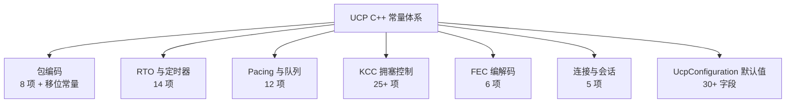

# UCP C++ 协议常量

[English](constants_EN.md)

本文档按子系统分类记录 UCP C++ 实现中的全部常量。常量定义在 `ucp_constants.h`（namespace Constants）、`ucp_cc.cpp`（static constexpr）、`ucp_fec_codec.h` 和 `ucp_configuration.h` 中。时间值以微秒为单位，大小以字节为单位。

## 常量体系

UCP C++ 的常量体系按功能域分为七大子系统：包编码、RTO 与定时器、Pacing 与队列、KCC 拥塞控制、FEC 编解码、连接与会话管理以及 UcpConfiguration 默认配置。所有常量分布在四个源文件中：`ucp_constants.h` 定义命名空间级别的协议常量（MSS、各包类型的固定开销、移位常量等），`ucp_cc.cpp` 以 static constexpr 定义 UCP 内部调参常数，`ucp_fec_codec.h` 包含 GF(256) 有限域的不可约多项式和表大小，`ucp_configuration.h` 提供面向用户的全部可配置默认值。

C++ 实现与 C# 参考实现保持协议层的完全兼容，但在重传参数上针对原生 C++ 的线程模型做了差异化调整。两种实现均使用 1 毫秒定时器刻度（C# 历史上曾为 20 毫秒，后已对齐）。MinRto 从 200 毫秒降低到 50 毫秒，提升低延迟路径的故障检测速度。AckSackBlockLimit 从 149 缩减到 2，依赖 NAK 三级置信度机制处理大规模丢包报告。所有时间值以微秒为单位，大小以字节为单位，确保整数运算的精确性。


```mermaid
flowchart TD
    Constants["UCP C++ 常量体系"] --> Packet["包编码<br/>8 项 + 移位常量"]
    Constants --> RTO["RTO 与定时器<br/>14 项"]
    Constants --> Pacing["Pacing 与队列<br/>12 项"]
    Constants --> UCP["KCC 拥塞控制<br/>25+ 项"]
    Constants --> FEC["FEC 编解码<br/>6 项"]
    Constants --> Session["连接与会话<br/>5 项"]
    Constants --> Config["UcpConfiguration 默认值<br/>30+ 字段"]
```

## 1. 包编码常量

```cpp
namespace Constants {
constexpr int MSS                       = 1220;  // 最大分段大小
constexpr int COMMON_HEADER_SIZE        = 12;    // 公共头
constexpr int DATA_HEADER_SIZE          = 20;    // DATA 头
constexpr int DATA_HEADER_SIZE_WITH_ACK = 36;    // DATA 头(含捎带 ACK)
constexpr int ACK_FIXED_SIZE            = 28;    // ACK 固定部分
constexpr int NAK_FIXED_SIZE            = 18;    // NAK 固定部分
constexpr int MAX_PAYLOAD_SIZE          = 1200;  // 最大负载
constexpr int SACK_BLOCK_SIZE           = 8;     // SACK 块大小
constexpr int CONNECTION_ID_SIZE        = 4;     // ConnId 大小
constexpr int ACK_TIMESTAMP_FIELD_SIZE  = 6;     // 时间戳回显
}
```

## 大端序移位常量

| 常量 | 值 | 说明 |
|---|---|---|
| BYTE_BITS | 8 | 每字节位数 |
| UINT16_BITS | 16 | uint16_t 位数 |
| UINT24_BITS | 24 | 3 字节移位 |
| UINT32_BITS | 32 | uint32_t 位数 |
| UINT40_BITS | 40 | 5 字节移位 |
| UINT48_BITS | 48 | 6 字节 uint48 |
| UINT56_BITS | 56 | 7 字节移位 |
| UINT48_MASK | 0x0000FFFFFFFFFFFF | 48 位掩码 |
| MAX_ACK_SACK_BLOCKS | 149 | 每 ACK 最大 SACK 块数 |

## 2. RTO 与定时器常量

| 常量 | C++ 值 | C# 值 | 含义 |
|---|---|---|---|
| INITIAL_RTO_MICROS | 50ms | 50ms | 初始 RTO |
| MIN_RTO_MICROS | 50ms | 50ms | 最小 RTO |
| UCP_MIN_ROUND_DURATION_MICROS | 1ms | 1ms | 最小 pacing/NAK 轮次时长 |
| DEFAULT_RTO_MICROS | 50ms | 50ms | 默认 RTO |
| DEFAULT_MAX_RTO_MICROS | 15s | 15s | 最大 RTO |
| MAX_RTO_MICROS | 60s | 60s | 绝对硬限制 |
| RTO_BACKOFF_FACTOR | 1.2 | 1.2 | 退避乘数 |
| MAX_RETRANSMISSIONS | 10 | 10 | 最大重传次数 |
| RTO_RETRANSMIT_BUDGET_PER_TICK | 4 | 4 | 每 tick 最大 RTO 重传 |
| URGENT_RETRANSMIT_BUDGET_PER_RTT | 8192 | 8192 | 每 RTT 紧急重传预算 |
| URGENT_RETRANSMIT_DISCONNECT_THRESHOLD_PERCENT | 75 | 75 | 空闲百分比阈值 |
| RTO_ACK_PROGRESS_SUPPRESSION_MICROS | 50ms | 2ms (unused) | ACK 后 RTO 扫描抑制 |
| RTT_VAR_DENOM | 4 | 4 | RTTVAR 分母 |
| RTT_SMOOTHING_DENOM | 8 | 8 | SRTT 分母 |
| RTO_GAIN_MULTIPLIER | 4 | 4 | RTO = SRTT + 4 * RTTVAR |
| RTT_RECOVERY_SAMPLE_MAX_RTO_MULTIPLIER | 4.0 | 4.0 | 恢复期 RTT 采样上限 |

## 3. Pacing 与队列常量

| 常量 | C++ 值 | C# 值 | 含义 |
|---|---|---|---|
| TIMER_INTERVAL_MILLISECONDS | 1 | 1ms | 定时器刻度 |
| FAIR_QUEUE_ROUND_MILLISECONDS | 10 | 10ms | 公平队列轮次 |
| MAX_BUFFERED_FAIR_QUEUE_ROUNDS | 4 | 4 | 最大 credit 累积轮数 |
| CONNECT_TIMEOUT_MILLISECONDS | 5000 | 5000 | 连接超时 |
| DEFAULT_PACING_BUCKET_DURATION_MICROS | 10ms | 10ms | Token Bucket 窗口 |
| DEFAULT_DELAYED_ACK_TIMEOUT_MICROS | 100us | 100us | 延迟 ACK 超时 |
| DEFAULT_ACK_SACK_BLOCK_LIMIT | 2 | 2 | 每 ACK 最大 SACK 块数 |
| DEFAULT_MIN_PACING_INTERVAL_MICROS | 0 | 0 | 最小包间隔 |
| DEFAULT_PACING_WAIT_MICROS | 1ms | -- | 默认 Pacing 等待 |
| MIN_TIMER_WAIT_MILLISECONDS | 1 | -- | 最小定时器等待 |
| MIN_HANDSHAKE_WAIT_MILLISECONDS | 100 | -- | 最小握手等待 |
| CLOSE_WAIT_TIMEOUT_MILLISECONDS | 1000 | -- | FIN 关闭等待 |

### 缓冲与窗口默认值

| 常量 | C++ 值 | 说明 |
|---|---|---|
| DEFAULT_SEND_BUFFER_BYTES | 32 MB | 发送缓冲 |
| DEFAULT_SERVER_BANDWIDTH_BYTES_PER_SECOND | 12500000 (100 Mbps) | 服务端带宽 |
| DEFAULT_INITIAL_BANDWIDTH_BYTES_PER_SECOND | 12500000 | UCP 初始带宽 |
| DEFAULT_MAX_PACING_RATE_BYTES_PER_SECOND | 12500000 | Pacing 上限 |
| DEFAULT_MAX_CONGESTION_WINDOW_BYTES | 64 MB | CWND 上限 |
| INITIAL_CWND_PACKETS | 10 | 初始 CWND |
| DEFAULT_RECV_WINDOW_PACKETS | 4096 | 接收窗口 (~5 MB) |
| DEFAULT_RECV_WINDOW_BYTES | 4096 * 1220 | 接收窗口字节数（C#：UcpConstants.cs） |

可发送上限为 min(cwnd, 对端宣告的接收窗口)；初始 cwnd 并非固定的 10 包上限。`INITIAL_CWND_PACKETS` 设定起始拥塞窗口，但对端宣告的 `WindowSize` 才是在途字节的权威硬上限（标准 TCP/QUIC 流量控制）。

### Geodesic 估计器常量

| 常量 | C++ 值 | C# 值 | 含义 |
|---|---|---|---|
| kcc_p_est_init | 1000 | 1000 | 初始收敛代理 |
| kcc_scale | 1024 | -- | 定点缩放因子 |

p_est 是标量置信代理（init = 1000，floor = 10，max = 1,000,000）；增益固定（无增益衰减）。

## 4. UCP 内部常量

FEC 和 NAK 为拥塞控制引擎提供高保真投递率样本：FEC 提供恢复字节带宽样本（在丢包突发期间维持带宽估计），NAK 提供丢包样本数据改善长期带宽 EWMA 估计。两者均在丢包条件下提升估计精度。

### 4.1 增益常量

| 常量 | C++ 值 | C# 值 | 含义 |
|---|---|---|---|
| UCP_STARTUP_PACING_GAIN | 2.887 | 2.887 | Startup Pacing 增益 (739/256) |
| UCP_STARTUP_CWND_GAIN | 2.887 | 2.887 | Startup CWND 增益 (739/256) |
| UCP_DRAIN_PACING_GAIN | 0.344 | 0.344 | Drain Pacing 增益 (88/256) |
| UCP_PROBE_BW_HIGH_GAIN | 1.25 | 1.25 | ProbeBW 上探增益 |
| UCP_PROBE_BW_LOW_GAIN | 0.75 | 0.75 | ProbeBW 下探增益 |

PROBE_BW 的 CWND 增益是由状态机设置的固定常量（KCC_CWND_GAIN = 2.0x）。

### 4.2 速率增长与窗口

| 常量 | 值 | 含义 |
|---|---|---|
| UCP_BW_RT_CYCLE_LEN | 10 | BtlBw 滤波窗口 RTT 轮数 |

### 4.7 ACK 聚合补偿

ACK 聚合补偿使用双窗口测量与 5-RTT 轮换（AGG_WINDOW_ROTATION_RTTS = 5，匹配 tcp_kcc.c kcc_update_ack_aggregation）。CWND 奖励由 `extra_acked`（超出 pacing 推导预期的已确认字节）计算，按 extra_acked 增益（EXTRA_ACKED_GAIN_NUM/DEN = 1/1，即 BBR_UNIT 中的 kcc_extra_acked_gain = 256）缩放，受 EXTRA_ACKED_MAX_MS（100 毫秒比例）与 EXTRA_ACKED_WIN_RTTS_MAX（31 RTT）约束，每 epoch 记账上限为 ACK_EPOCH_MAX（0x100000）。

### 4.10 长期带宽（LT）估计

LT 带宽在更长时间尺度上跟踪平滑带宽估计，补充 UCP 最大值滤波器以在瞬态波动期间提供稳定带宽预测。

| 常量 | 值 | 含义 |
|---|---|---|
| kcc_lt_intvl_min_rtts | 4 | LT 最小更新间隔（RTT轮数） |
| kcc_lt_intvl_max_mult | 4 | 稀疏更新的最大间隔乘数 |
| kcc_lt_loss_thresh | 50（约 20%） | 绕过 LT 更新的丢包阈值（50/256） |
| kcc_lt_bw_ratio_num | 1 | LT 比率分子 (1/8) |
| kcc_lt_bw_ratio_den | 8 | LT 比率分母 |
| kcc_lt_bw_diff | 500 bps | 触发更新的最小带宽差 |
| kcc_lt_bw_ithresh | 5000 | LT srtt/min_rtt 绝对容差（微秒） |
| kcc_lt_bw_ema_num | 1 | LT EWMA 分子 (1/2) |
| kcc_lt_bw_ema_den | 2 | LT EWMA 分母 |
| kcc_lt_bw_max_rtts | 48 | 重置前无 LT 更新的最大 RTT 轮数 |

### 4.11 ECN 退避

ECN（显式拥塞通知）退避在排队延迟指示可能拥塞时降低 pacing 速率，提供无丢包的分级退避。

| 常量 | 值 | 含义 |
|---|---|---|
| kcc_ecn_enable | 0 | ECN 退避（C++ 中编译期关闭：KCC_ECN_ENABLED=0，需重新编译；运行时显式启用仅限 C#：UcpConfiguration.EcnEnabled） |
| kcc_ecn_backoff_num | 20 | ECN 退避分子（20% 速率降低） |
| kcc_ecn_backoff_den | 100 | ECN 退避分母 |
| kcc_cong_thresh | 动态：max(min_rtt x 2500 / 10000, 500 us) | 触发 ECN 退避的排队延迟阈值（min_rtt 的 25%，下限 500 us） |
| kcc_ecn_ewma_retained | 3 | ECN EWMA 保留权重 (3/4) |
| kcc_ecn_ewma_total | 4 | ECN EWMA 总权重 |
| kcc_ecn_idle_decay_num | 31 | ECN 空闲衰减分子 (31/32) |
| kcc_ecn_idle_decay_den | 32 | ECN 空闲衰减分母 |

### 4.12 MinRTT 滤波间隔（测地线 G1/G3）

测地线估计器通过 G1 瞬时下降收敛和 G3 双阈值路径增长检测自动处理 MinRTT 跟踪。PROBE_BW 阶段的周期性 DRAIN 提供队列排空（匹配 tcp_kcc.c 3状态 FSM）。

| 常量 | 值 | 含义 |
|---|---|---|
| kcc_min_samples | 5 | MinRTT 更新前最小估计器样本数 |

## 5. 丢包检测、NAK 与 SACK

| 常量 | 值 | 含义 |
|---|---|---|
| MAX_NAKS_PER_RTT | 1024 | 每 RTT 最大 NAK 数 |
| EARLY_RETRANSMIT_MAX_INFLIGHT_SEGMENTS | 4 | 早期重传最大在途段 |
| TLP_MAX_INFLIGHT_SEGMENTS | 2 | TLP 最大在途段 |
| TLP_TIMEOUT_RTT_RATIO | 1.5 | TLP 超时 RTT 比例 |
| DUPLICATE_ACK_THRESHOLD | 3 | 重复 ACK 阈值 |
| SACK_FAST_RETRANSMIT_THRESHOLD | 2 | SACK 快速重传阈值 |
| SACK_FAST_RETRANSMIT_DISTANCE_THRESHOLD | 48 | SACK 快速重传距离阈值 |
| SACK_FAST_RETRANSMIT_MIN_REORDER_GRACE_MICROS | 5ms | SACK 最小乱序宽容 |
| NAK_MISSING_THRESHOLD | 2 | NAK 缺失阈值 |
| NAK_REORDER_GRACE_MICROS | 2ms | NAK 乱序宽容 |
| NAK_HIGH_CONFIDENCE_MISSING_THRESHOLD | 128 | NAK 高置信度阈值 |
| NAK_MEDIUM_CONFIDENCE_MISSING_THRESHOLD | 32 | NAK 中置信度阈值 |
| NAK_REPEAT_INTERVAL_MICROS | 5ms | NAK 重复间隔（声明但未使用；实际用 per-sequence 直到数据到达的标记抑制） |
| MAX_NAK_MISSING_SCAN | 16384 | 最大 NAK 缺失扫描槽 |
| MAX_NAK_SEQUENCES_PER_PACKET | 256 | 每 NAK 包最大序号数 |
| IMMEDIATE_ACK_REORDERED_PACKET_THRESHOLD | 4 | 立即 ACK 乱序阈值 |
| REORDERED_ACK_MIN_INTERVAL_MICROS | 250us | 乱序 ACK 最小间隔 |

## 6. FEC 编解码常量

| 常量 | C++ 值 | C# 值 | 含义 |
|---|---|---|---|
| MAX_FEC_SLOT_LENGTH | 1200 | 1200 | FEC slot 最大负载长度 |
| GF_EXP_SIZE | 512 | 512 | 反对数表大小 |
| 不可约多项式 | 0x11d | 0x11d | x^8 + x^4 + x^3 + x^2 + 1 |
| 本原元 alpha | 0x02 | 0x02 | 生成元 |
| gf_log_ 大小 | 256 | 256 | 对数表 |
| gf_exp_ 大小 | 512 | 512 | 反对数表 (双倍长) |

## 7. 连接与会话常量

| 常量 | 值 | 含义 |
|---|---|---|
| CONNECTION_ID_SIZE | 4 | 连接标识字节数（32 位，2^32） |
| KEEP_ALIVE_INTERVAL_MICROS | 1s | 保活间隔 |
| DISCONNECT_TIMEOUT_MICROS | 4s | 空闲断连超时 |
| PAWS_TIMEOUT_MICROS | 60s | PAWS 时间戳超时 |
| MAX_RTT_SAMPLES | 1024 | 最大 RTT 样本数 |

## 8. 序号算术

| 常量 | 值 | 含义 |
|---|---|---|
| HALF_SEQUENCE_SPACE | 0x80000000U | 2^31 序号窗口 |

## 9. UcpConfiguration 全部默认值

| 字段 | C++ 默认值 | C# 默认值 |
|---|---|---|
| Mss | 1220 | 1220 |
| MaxRetransmissions | 10 | 10 |
| MinRtoMicros | 50ms | 50ms |
| MaxRtoMicros | 15s | 15s |
| RetransmitBackoffFactor | 1.2 | 1.2 |
| KeepAliveIntervalMicros | 1s | 1s |
| DisconnectTimeoutMicros | 4s | 4s |
| TimerIntervalMilliseconds | 1 | 1 |
| FairQueueRoundMilliseconds | 10 | 10 |
| ServerBandwidthBytesPerSecond | 12500000 | 12500000 |
| ConnectTimeoutMilliseconds | 5000 | 5000 |
| InitialBandwidthBytesPerSecond | 12500000 | 12500000 |
| MaxPacingRateBytesPerSecond | 12500000 | 12500000 |
| MaxCongestionWindowBytes | 64 MB | 64 MB |
| InitialCwndPackets | **10** | **10** |
| RecvWindowPackets | 4096 | 4096 |
| SendQuantumBytes | 1220 | 1220 |
| AckSackBlockLimit | 2 | 2 |
| LossControlEnable | true | true |
| EnableDebugLog | false | false |
| FecRedundancy | 0.0 | 0.0 |
| FecGroupSize | 8 | 8 |

### 私有成员默认值

| 字段 | C++ 默认值 | 含义 |
|---|---|---|
| m_send_buffer_size | 32 MB | 发送缓冲 |
| m_delayed_ack_timeout_micros | 100 us | 延迟 ACK 超时 |
| m_pacing_bucket_duration_micros | 10ms | Token Bucket 窗口 |
| m_max_bandwidth_waste_percent | 0.25 | 最大带宽浪费比例 |
| m_max_bandwidth_loss_percent | 25.0 | 最大带宽损失百分比 |
| m_min_pacing_interval_micros | 0 | 最小包间隔 |
| m_window_rt_rounds | 10 | UCP 滤波窗口轮数 |
| m_startup_pacing_gain | 2.887 | UCP Startup 增益 (739/256) |
| m_startup_cwnd_gain | 2.887 | UCP Startup CWND 增益 |
| m_drain_pacing_gain | 0.344 | UCP Drain 增益 (88/256) |
| m_probe_bw_high_gain | 1.25 | ProbeBW 上探增益 |
| m_probe_bw_low_gain | 0.75 | ProbeBW 下探增益 |

## 场景调优建议

| 场景 | 关键配置 | 预期效果 |
|---|---|---|
| 高带宽 (> 1 Gbps) | Mss=9000, MaxPacingRate=0 | 减少 ~85% 每包开销 |
| 高 RTT (> 300ms) | InitialCwnd=100, SendBuffer=BDP*1.5 | 加速 Startup 收敛 |
| 高丢包 (> 5%) | FecRedundancy=0.25, MaxRetrans=20 | FEC 覆盖大部分丢包 |
| 移动网络 | Mss=536, DisconnectTimeout=15s | 容忍信号丢失 |
| 数据中心 | Mss=9000, MinRto=1ms | 极低延迟 |
| VPN 隧道 | Mss=1220, FecRedundancy=0.125 | 适度 FEC 保护 |

## 相关文档

- [architecture_CN.md](architecture_CN.md) — 运行时层次结构
- [protocol_CN.md](protocol_CN.md) — 协议规范
- [api_CN.md](api_CN.md) — API 参考
- [performance_CN.md](performance_CN.md) — 性能特征
- [README_CN.md](../README_CN.md) — 项目介绍
- [Linux 内核模块](../../linux/README.md) — KCC Geodesic Congestion Control 内核模块（tcp_kcc.c v2.0，含 KCC Forwarding (KF) 跨连接带宽共享组件）

---

## 许可证与商标

MIT 许可证。完整文本见 [LICENSE](../../LICENSE)。

版权所有 (c) 2026 PPP PRIVATE NETWORK™ X

PPP PRIVATE NETWORK™ 是 PPP PRIVATE NETWORK 的商标。
