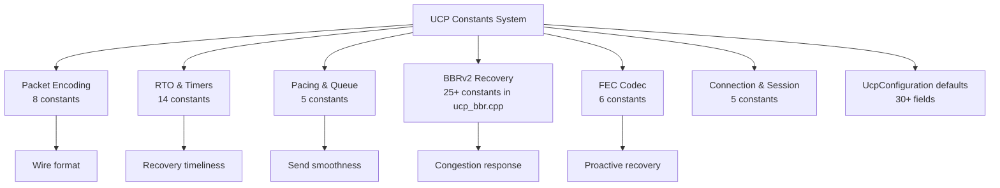

# PPP PRIVATE NETWORK™ X — Universal Communication Protocol (UCP) — C++ Protocol Constants

**Protocol Identifier: `ppp+ucp`** — This document exhaustively catalogs all constants in the UCP C++ implementation, organized by subsystem. All constants are defined in `ucp_constants.h` under namespace `Constants`, BBR-related constants reside in `ucp_bbr.cpp`, and configuration defaults live in `ucp_configuration.h`. Unless explicitly suffixed (e.g., `*Micros`), time values are in microseconds (µs) and sizes are in bytes.

---

## Constants System Panorama



---

## 1. Packet Encoding Constants (`ucp_constants.h`)

| Constant | Value | Meaning & Design Rationale |
|---|---|---|
| `MSS` | 1220 | Default maximum segment size (including header). Fits most internet path MTUs (1500 − UDP header(8) − IP header(20) = 1472), with safety margin to avoid IP fragmentation. |
| `COMMON_HEADER_SIZE` | 12 | Type(1) + Flags(1) + ConnId(4) + Timestamp(6) = 12 bytes. Fixed prefix for all packet types. |
| `DATA_HEADER_SIZE` | `COMMON_HEADER_SIZE + 8` = 20 | Common header(12) + SeqNum(4) + FragTotal(2) + FragIndex(2). Excludes optional piggybacked ACK. |
| `DATA_HEADER_SIZE_WITH_ACK` | `DATA_HEADER_SIZE + 20` | Including piggybacked ACK: +AckNumber(4) + SackCount(2) + WindowSize(4) + EchoTimestamp(6) = 40. |
| `ACK_FIXED_SIZE` | 26 | AckNumber(4) + SackCount(2) + WindowSize(4) + EchoTimestamp(6) + Common header(12). |
| `SACK_BLOCK_SIZE` | 8 | StartSequence(4) + EndSequence(4). Each range is generated at most once in the SACK generator. |
| `DEFAULT_ACK_SACK_BLOCK_LIMIT` | **2** | Maximum SACK blocks per ACK packet. Value of 2 limits SACK information density, reducing ACK packet size. |
| `HALF_SEQUENCE_SPACE` | `0x80000000U` | 2^31, the comparison window boundary used by `UcpSequenceComparer`. Unambiguous 32-bit sequence wrap comparison. |
| `PIGGYBACK_ACK_SIZE` | 4 | Size of the AckNumber field immediately following the common header when HasAckNumber (0x08) is set. |

### Big-Endian Constants in Packet Codec (`ucp_packet_codec.h`)

| Constant | Value | Meaning |
|---|---|---|
| `BYTE_BITS` | 8 | Big-endian shift constant |
| `UINT16_BITS` | 16 | ReadUInt16/WriteUInt16 shift |
| `UINT24_BITS` | 24 | ReadUInt32/WriteUInt32 offset |
| `UINT32_BITS` | 32 | ReadUInt48/WriteUInt48 offset |
| `UINT40_BITS` | 40 | ReadUInt48/WriteUInt48 offset |
| `UINT48_MASK` | `0x0000FFFFFFFFFFFFULL` | WriteUInt48 mask |
| `MAX_ACK_SACK_BLOCKS` | `(MSS - ACK_FIXED_SIZE) / SACK_BLOCK_SIZE` | Theoretically maximum SACK blocks computed from MSS |

---

## 2. RTO & Timer Constants (`ucp_constants.h`)

| Constant | C++ Value | Meaning & Design Rationale |
|---|---|---|
| `INITIAL_RTO_MICROS` | **100,000** (100ms) | Initial RTO (when no RTT samples exist). Switches to SRTT-based computation upon first RTT sample arrival. |
| `MIN_RTO_MICROS` | **20,000** (20ms) | Absolute minimum RTO. On low-latency paths, loss detection can be as fast as 20ms, far below TCP's 200ms. |
| `DEFAULT_RTO_MICROS` | **50,000** (50ms) | Default RTO (configuration parameter). Slightly above MIN_RTO, providing a balanced default. |
| `DEFAULT_MAX_RTO_MICROS` | 15,000,000 (15s) | Configuration default maximum RTO. TCP typically ≥60s; UCP chooses 15s for faster dead-path detection. |
| `MAX_RTO_MICROS` | **60,000,000** (60s) | Absolute maximum RTO hard limit. |
| `RTO_BACKOFF_FACTOR` | **1.2** | Consecutive timeout RTO multiplier. TCP uses 2.0× (rapid exponential growth); UCP uses 1.2× for gentler growth. Sequence: 100ms → 120ms → 144ms → ... → 60s. |
| `MAX_RETRANSMISSIONS` | 10 | Maximum retransmissions. Triggers connection closure on exceed. |
| `RTT_VAR_DENOM` | 4 | RTTVAR update denominator: `rttvar += (|srtt - sample| - rttvar)/4` |
| `RTT_SMOOTHING_DENOM` | 8 | SRTT smoothing denominator: `srtt += (sample - srtt)/8` |
| `RTT_SMOOTHING_PREVIOUS_WEIGHT` | 7 | SRTT history weight: 7/8 |
| `RTT_VAR_PREVIOUS_WEIGHT` | 3 | RTTVAR history weight: 3/4 |
| `RTO_GAIN_MULTIPLIER` | 4 | RTO calculation: `rto = srtt + 4 × rttvar`. Matches TCP. |
| `RTO_MAX_BACKOFF_MIN_RTO_MULTIPLIER` | 2 | Upper bound multiplier relative to MIN_RTO during RTO backoff. |
| `MICROS_PER_MILLI` | 1000 | Unit conversion |
| `MICROS_PER_SECOND` | 1000000 | Unit conversion |

---

## 3. Pacing & Queue Constants (`ucp_constants.h` + `ucp_configuration.h`)

| Constant | Value | Meaning & Design Rationale |
|---|---|---|
| `DEFAULT_MIN_PACING_INTERVAL_MICROS` | 0 | No artificial minimum inter-packet interval. Token Bucket fully controls pacing timing. |
| `DEFAULT_PACING_BUCKET_DURATION_MICROS` | 10,000 (10ms) | Token Bucket capacity window. Capacity = PacingRate × 10ms. |
| `DEFAULT_PACING_WAIT_MICROS` | 1000 (1ms) | Wait interval when pacing tokens are insufficient. |
| `FAIR_QUEUE_ROUND_MILLISECONDS` | 10 | Server fair queue per-round duration (milliseconds). |
| `TIMER_INTERVAL_MILLISECONDS` | **1** | Internal timer tick interval (milliseconds). Finer than the C# version's 20ms, providing faster responsiveness. |
| `CONNECT_TIMEOUT_MILLISECONDS` | 5000 | Connection timeout (milliseconds). |

### Buffer & Window Defaults

| Constant | Value | Meaning |
|---|---|---|
| `DEFAULT_SEND_BUFFER_BYTES` | 32 MB | Send buffer default size |
| `DEFAULT_SERVER_BANDWIDTH_BYTES_PER_SECOND` | 12,500,000 (100Mbps) | Server bandwidth default |
| `DEFAULT_INITIAL_BANDWIDTH_BYTES_PER_SECOND` | 12,500,000 (100Mbps) | BBR initial bandwidth estimate |
| `DEFAULT_MAX_PACING_RATE_BYTES_PER_SECOND` | 12,500,000 (100Mbps) | Configuration default pacing ceiling |
| `DEFAULT_MAX_CONGESTION_WINDOW_BYTES` | 64 MB | CWND hard ceiling |
| `INITIAL_CWND_PACKETS` | 20 | Initial congestion window (packets) |
| `DEFAULT_ACK_SACK_BLOCK_LIMIT` | 2 | Maximum SACK blocks per ACK packet |
| `DEFAULT_DELAYED_ACK_TIMEOUT_MICROS` | **100** (100µs) | Delayed ACK aggregation timeout |
| `DEFAULT_MAX_BANDWIDTH_WASTE_RATIO` | 0.25 | Bandwidth waste budget ratio |
| `DEFAULT_MAX_BANDWIDTH_LOSS_PERCENT` | 25.0 | Loss budget percent |

### Loss Budget Constraints

| Constant | Value | Meaning |
|---|---|---|
| `MIN_MAX_BANDWIDTH_LOSS_PERCENT` | 15.0 | Lowest lower bound for MaxBandwidthLossPercent |
| `MAX_MAX_BANDWIDTH_LOSS_PERCENT` | 35.0 | Highest upper bound for MaxBandwidthLossPercent |

---

## 4. BBRv2 Constants (`ucp_bbr.cpp`)

### 4.1 BBR Gain Constants

| Constant | C++ Value | Meaning |
|---|---|---|
| `BBR_STARTUP_PACING_GAIN` | **2.89** | Startup phase Pacing gain. The C++ implementation's aggressive value for rapid bottleneck bandwidth probing. |
| `BBR_STARTUP_CWND_GAIN` | 2.0 | Startup phase CWND gain. |
| `BBR_DRAIN_PACING_GAIN` | **1.0** | Drain phase Pacing gain. Set to 1.0 to drain queue at neutral rate. |
| `BBR_PROBE_BW_HIGH_GAIN` | **1.35** | ProbeBW probe-up phase gain. More aggressive than C#'s 1.25. |
| `BBR_PROBE_BW_LOW_GAIN` | 0.85 | ProbeBW probe-down phase gain. |
| `BBR_PROBE_BW_CWND_GAIN` | 2.0 | ProbeBW CWND gain. |

### 4.2 Rate Growth & Window Constants

| Constant | Value | Meaning |
|---|---|---|
| `kStartupGrowthTarget` | 1.25 | Startup per-round bandwidth growth target (25%) |
| `kStartupBandwidthGrowthPerRound` | 2.0 | Startup per-round bandwidth growth ceiling (100%) |
| `kSteadyBandwidthGrowthPerRound` | 1.25 | Steady-state per-round bandwidth growth ceiling (25%) |
| `kStartupAckAggregationRateCapGain` | 4.0 | Startup ACK aggregation rate cap multiplier |
| `kSteadyAckAggregationRateCapGain` | 1.50 | Steady-state ACK aggregation rate cap multiplier |
| `kMinStartupFullBandwidthRounds` | 3 | Startup minimum full-bandwidth rounds |
| `kWindowRtRounds` | 10 | BtlBw maximum filter window RTT rounds |
| `kProbeBwGainCount` | 8 | ProbeBW 8-phase cycle |
| `kMicrosPerSecond` | 1000000 | Microseconds per second |
| `kMicrosPerMilli` | 1000 | Microseconds per millisecond |
| `kDefaultRateWindowMicros` | 1000000 (1s) | Default rate window |
| `kBandwidthGrowthFallbackIntervalMicros` | 10000 (10ms) | Bandwidth growth fallback interval |
| `kMinRoundDurationMicros` | 1000 (1ms) | Minimum RTT round duration |
| `kRtoMaxBackoffMinRtoMultiplier` | 2 | RTO max backoff multiplier relative to MinRTO |

### 4.3 Loss Response Constants

| Constant | C++ Value | Meaning |
|---|---|---|
| `kLossCwndRecoveryStep` | **0.08** | CWND gain recovery step per ACK (normal) |
| `kLossCwndRecoveryStepFast` | **0.15** | CWND gain recovery step per ACK (Mobile/RandomLoss) |
| `kCongestionLossReduction` | 0.98 | Multiplier reduction on pacing gain upon confirmed congestion (only 2% drop) |
| `kMinLossCwndGain` | 0.95 | CWND gain lowest floor after congestion (BDP × 0.95) |
| `kLossBudgetRecoveryRatio` | 0.80 | Loss budget recovery ratio |
| `kFastRecoveryPacingGain` | 1.25 | Random loss fast recovery Pacing gain |
| `kHighLossPacingGain` | 1.00 | High-loss Pacing gain (maintains baseline) |

### 4.4 Loss Rate Tier Constants

| Constant | Value | Meaning |
|---|---|---|
| `kLowLossRatio` | 0.01 (1%) | Low loss boundary |
| `kModerateLossRatio` | 0.03 (3%) | Moderate loss boundary |
| `kLightLossRatio` | 0.08 (8%) | Light loss boundary |
| `kMediumLossRatio` | 0.15 (15%) | Medium loss boundary |
| `kLowRttIncreaseRatio` | 0.10 (10%) | Low RTT increase ratio |
| `kModerateRttIncreaseRatio` | 0.20 (20%) | Moderate RTT increase ratio |
| `kModerateProbeGain` | 1.50 | Moderate probe gain |
| `kLightLossPacingGain` | 1.10 | Light loss Pacing gain |
| `kMediumLossPacingGain` | 1.05 | Medium loss Pacing gain |

### 4.5 Loss EWMA Constants

| Constant | Value | Meaning |
|---|---|---|
| `kLossEwmaIdleDecay` | 0.90 | Idle decay factor |
| `kLossEwmaRetainedWeight` | 0.75 | Retained history weight (75%) |
| `kLossEwmaSampleWeight` | 0.25 | New sample weight (25%) |

### 4.6 Congestion Classifier Constants

| Constant | C++ Value | Meaning |
|---|---|---|
| `kCongestionRateDropRatio` | -0.15 | Delivery rate drop ≥15% → +1 congestion score |
| `kCongestionRttIncreaseRatio` | 0.50 | RTT increase ≥50% → +1 congestion score |
| `kCongestionLossRatio` | 0.10 | Loss rate ≥10% → +1 congestion score |
| `kCongestionRateDropScore` | 1 | Delivery rate drop score |
| `kCongestionRttGrowthScore` | 1 | RTT growth score |
| `kCongestionLossScore` | 1 | Loss score |
| `kCongestionClassifierScoreThreshold` | **2** | Total ≥2 → confirmed congestion |
| `kRandomLossMaxRttIncreaseRatio` | 0.20 | RTT increase <20% → random loss |
| `kRateLossHintMaxRatio` | 0.05 | Loss rate <5% → non-congestion hint |

### 4.7 ProbeRTT Constants

| Constant | C++ Value | Meaning |
|---|---|---|
| `kProbeRttIntervalMicros` / `BBR_PROBE_RTT_INTERVAL_MICROS` | 30,000,000 (30s) | ProbeRTT trigger interval |
| `kProbeRttDurationMicros` / `BBR_PROBE_RTT_DURATION_MICROS` | 100,000 (100ms) | ProbeRTT minimum duration |
| `kProbeRttPacingGain` | 0.85 | ProbeRTT Pacing gain |
| `kProbeRttExitRttMultiplier` | 1.05 | ProbeRTT exit RTT multiplier |
| `kProbeRttMaxDurationMultiplier` | 2 | ProbeRTT maximum duration multiplier (200ms) |

### 4.8 Inflight Bounds

| Constant | Value | Meaning |
|---|---|---|
| `kInflightLowGain` | 1.25 | Inflight lower bound = BDP × 1.25 |
| `kInflightHighGain` | 2.00 | Inflight upper bound = BDP × 2.00 |
| `kInflightMobileHighGain` | 2.00 | Mobile network inflight upper bound |

### 4.9 Network Classifier Thresholds

| Constant | C++ Value | Meaning |
|---|---|---|
| `kNetworkClassifierLanRttMs` | 5.0 | LAN RTT threshold (ms) |
| `kNetworkClassifierLanJitterMs` | 3.0 | LAN jitter threshold (ms) |
| `kNetworkClassifierMobileLossRate` | 0.03 | Mobile loss rate threshold (3%) |
| `kNetworkClassifierMobileJitterMs` | 20.0 | Mobile jitter threshold (ms) |
| `kNetworkClassifierLongFatRttMs` | 80.0 | LongFat RTT threshold (ms) |
| `kNetworkClassifierWindowDurationMicros` | 200,000 (200ms) | Classifier window duration |
| `kNetworkClassifierWindowCount` | 8 | Number of windows |

### 4.10 Internal Data Structure Sizes

| Constant | Value | Meaning |
|---|---|---|
| `kRecentRateSampleCount` | 10 | Recent rate sample ring buffer size |
| `kDeliveryRateHistoryCount` | 16 | Delivery rate history size |
| `kRttHistoryCount` | 32 | RTT history size |
| `kLossBucketCount` | 10 | Number of loss buckets |
| `kLossBucketMicros` | 100,000 (100ms) | Duration per loss bucket |
| `kClassifierWindowCount` | 8 | Number of classifier windows |

---

## 5. UcpFecCodec Constants (`ucp_fec_codec.h`)

| Constant | Value | Meaning |
|---|---|---|
| `MAX_FEC_SLOT_LENGTH` | 1200 | Maximum FEC per-slot payload length. Matches `MaxPayloadSize()` = `Mss - 20 = 1200`. |
| `GF_EXP_SIZE` | 512 | GF(256) antilog table size (256 × 2 for overflow support) |
| `gf_log_[256]` | Precomputed | GF(256) log table |
| `gf_exp_[512]` | Precomputed | GF(256) antilog table (double length) |
| Irreducible Polynomial | `0x11d` | `x^8 + x^4 + x^3 + x^2 + 1` (C++ implementation) |
| Primitive Element α | `0x02` | Polynomial x |

### GF(256) Precomputation Tables

```cpp
// Static initialization (ucp_fec_codec.cpp)
bool tables_initialized_ = []() {
    int value = 1;
    for (int i = 0; i < 255; i++) {
        gf_exp_[i] = static_cast<uint8_t>(value);
        gf_log_[value] = static_cast<uint8_t>(i);
        value <<= 1;
        if (value & 0x100) {
            value ^= 0x11d;  // irreducible polynomial
        }
    }
    for (int i = 255; i < GF_EXP_SIZE; i++) {
        gf_exp_[i] = gf_exp_[i - 255];
    }
    return true;
}();
```

---

## 6. Connection & Session Constants

| Constant | Value | Meaning & Design Rationale |
|---|---|---|
| `CONNECTION_ID_BITS` | 32 bits | Random connection identifier bit count. 2^32 ≈ 4.29 billion unique IDs; birthday paradox collision probability ≈ 0.01% for 1 million active connections. |
| `SEQUENCE_NUMBER_BITS` | 32 bits | Sequence number space bit count. Wrap time = 2^32 × 8 / rate at high bandwidth. 2^31 comparison window ensures PAWS (Protection Against Wrapped Sequences) correctness. |
| `KEEP_ALIVE_INTERVAL_MICROS` | 1,000,000 (1s) | Idle connection keep-alive interval. UCP sends keep-alive packets during idle periods to prevent NAT/firewall timeout from clearing the session. |
| `DISCONNECT_TIMEOUT_MICROS` | 4,000,000 (4s) | Idle disconnect timeout. The connection is automatically closed when no data is exchanged within this period. |
| `BBR_PROBE_RTT_INTERVAL_MICROS` | 30,000,000 (30s) | BBRv2 ProbeRTT trigger interval. |

---

## 7. UcpConfiguration Complete Default Quick Reference Table

| Field | Type | Default Value | Range/Constraint |
|---|---|---|---|
| `Mss` | `int` | 1220 | 200–9000 |
| `MaxRetransmissions` | `int` | 10 | 3–100 |
| `MinRtoMicros` | `int64_t` | 50000 (50ms) | 20000–1000000 |
| `MaxRtoMicros` | `int64_t` | 15000000 (15s) | 1000000–60000000 |
| `RetransmitBackoffFactor` | `double` | 1.2 | 1.1–2.0 |
| `ProbeRttIntervalMicros` | `int64_t` | 30000000 (30s) | 5000000–120000000 |
| `ProbeRttDurationMicros` | `int64_t` | 100000 (100ms) | 50000–500000 |
| `KeepAliveIntervalMicros` | `int64_t` | 1000000 (1s) | 100000–30000000 |
| `DisconnectTimeoutMicros` | `int64_t` | 4000000 (4s) | 500000–60000000 |
| `TimerIntervalMilliseconds` | `int` | **1** | 1–100 |
| `FairQueueRoundMilliseconds` | `int` | 10 | — |
| `ServerBandwidthBytesPerSecond` | `int` | 12500000 (100Mbps) | 125000–1250000000 |
| `ConnectTimeoutMilliseconds` | `int` | 5000 | — |
| `InitialBandwidthBytesPerSecond` | `int64_t` | 12500000 (100Mbps) | 125000–1250000000 |
| `MaxPacingRateBytesPerSecond` | `int64_t` | 12500000 (100Mbps) | 0–∞ (0=no cap) |
| `MaxCongestionWindowBytes` | `int` | 67108864 (64MB) | 64KB–256MB |
| `InitialCwndPackets` | `int` | 20 | 4–200 |
| `RecvWindowPackets` | `int` | 16384 | — |
| `SendQuantumBytes` | `int` | 1220 | MSS–MSS×4 |
| `AckSackBlockLimit` | `int` | **2** | 1–255 |
| `LossControlEnable` | `bool` | `true` | — |
| `EnableDebugLog` | `bool` | `false` | — |
| `EnableAggressiveSackRecovery` | `bool` | `true` | — |
| `FecRedundancy` | `double` | 0.0 | 0.0–1.0 |
| `FecGroupSize` | `int` | 8 | 2–64 |

### Private Member Defaults (Accessed via Getter/Setter)

| Field | Default Value | Meaning |
|---|---|---|
| `m_send_buffer_size` | 32 MB | Send buffer |
| `m_delayed_ack_timeout_micros` | **100** (100µs) | Delayed ACK timeout |
| `m_max_bandwidth_waste_percent` | 0.25 | Bandwidth waste budget |
| `m_max_bandwidth_loss_percent` | 25.0 | Loss budget |
| `m_min_pacing_interval_micros` | 0 | Pacing minimum interval |
| `m_pacing_bucket_duration_micros` | 10000 (10ms) | Bucket time window |
| `m_bbr_window_rt_rounds` | 10 | BBR window RTT rounds |
| `m_startup_pacing_gain` | **2.89** | BBR Startup Pacing gain |
| `m_startup_cwnd_gain` | 2.0 | BBR Startup CWND gain |
| `m_drain_pacing_gain` | **1.0** | BBR Drain Pacing gain |
| `m_probe_bw_high_gain` | **1.35** | BBR ProbeBW probe-up gain |
| `m_probe_bw_low_gain` | 0.85 | BBR ProbeBW probe-down gain |
| `m_probe_bw_cwnd_gain` | 2.0 | BBR ProbeBW CWND gain |

---

## 8. Recommended Configuration (GetOptimizedConfig)

`UcpConfiguration::GetOptimizedConfig()` static factory returns tuned defaults for general network conditions. Rationale for key choices:

| Configuration Item | Choice | Rationale |
|---|---|---|
| `Mss = 1220` | Standard internet MTU-safe value | Avoids IP fragmentation, suitable for 99%+ paths |
| `TimerIntervalMilliseconds = 1` | 1ms precision | Finer than C#'s 20ms, providing sub-millisecond response |
| `MinRtoMicros = 50000` (50ms) | Low-latency fast recovery | Balances between lossy LAN and high-jitter paths |
| `AckSackBlockLimit = 2` | Low SACK density | Saves ACK packet size, avoids SACK amplification |
| `DelayedAckTimeoutMicros = 100` (100µs) | Very short delayed ACK | Fast acknowledgment, minimizes sender wait |
| `StartupPacingGain = 2.89` | Aggressive Startup | Rapid bottleneck probing, optimizes high BDP paths |
| `ProbeBwHighGain = 1.35` | Moderate probe-up | More confidently probes extra bandwidth than conservative 1.25 |
| `DrainPacingGain = 1.0` | Neutral drain | Does not further slow down during Drain |
| `FecRedundancy = 0.0` | FEC disabled by default | Retransmission suffices for most scenarios; FEC enabled on demand |
| `EnableAggressiveSackRecovery = true` | Aggressive SACK | Fastest loss recovery path |

### Per-Scenario Tuning Recommendations

| Scenario | Key Tuning |
|---|---|
| **High Bandwidth (>1 Gbps)** | `Mss = 9000`, `MaxCongestionWindowBytes = 256MB`, `MaxPacingRateBytesPerSecond = 0` |
| **High RTT (>300ms)** | `InitialCwndPackets = 100`, `SendBufferSize = BDP × 1.5`, `ProbeRttIntervalMicros = 120s` |
| **High Loss (>5%)** | `FecRedundancy = 0.25`, `FecGroupSize = 8`, `MaxRetransmissions = 20` |
| **Mobile Network** | `Mss = 536`, `DisconnectTimeoutMicros = 15s`, `AckSackBlockLimit = 1` |
| **Data Center** | `Mss = 9000`, `MinRtoMicros = 1000`, `TimerIntervalMilliseconds = 1` |
| **VPN Tunnel** | `Mss = 1220` (accounting for encapsulation overhead), `FecRedundancy = 0.125` |
