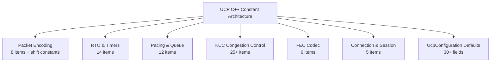

# UCP C++ Protocol Constants

[Chinese](constants_CN.md)

This document catalogs all constants in the UCP C++ implementation organized by subsystem. Constants are defined in `ucp_constants.h` (namespace Constants), `ucp_cc.cpp` (static constexpr), `ucp_fec_codec.h`, and `ucp_configuration.h`. Time values are in microseconds, sizes in bytes.

## Constant Architecture

The UCP C++ constant system is organized into seven functional subsystems: packet encoding, RTO & timers, pacing & queue, KCC congestion control, FEC codec, connection & session management, and UcpConfiguration defaults. All constants are distributed across four source files: `ucp_constants.h` defines namespace-level protocol constants (MSS, fixed overhead per packet type, shift constants, etc.); `ucp_cc.cpp` defines UCP internal tuning constants as static constexpr; `ucp_fec_codec.h` contains the irreducible polynomial and table sizes for GF(256); and `ucp_configuration.h` provides all user-facing configurable defaults.

The C++ implementation maintains full protocol-level compatibility with the C# reference implementation, but makes differentiated adjustments in retransmission parameters tailored to native C++'s thread model. Both implementations use a 1ms timer tick (C# historically used 20ms before aligning). MinRto is lowered from 200ms to 50ms, improving fault detection speed on low-latency paths. AckSackBlockLimit is reduced from 149 to 2, relying on the NAK three-tier confidence mechanism to handle large-scale loss reporting. All time values use microseconds and all sizes use bytes to ensure integer arithmetic precision.


```mermaid
flowchart TD
    Constants["UCP C++ Constant Architecture"] --> Packet["Packet Encoding<br/>8 items + shift constants"]
    Constants --> RTO["RTO & Timers<br/>14 items"]
    Constants --> Pacing["Pacing & Queue<br/>12 items"]
    Constants --> UCP["KCC Congestion Control<br/>25+ items"]
    Constants --> FEC["FEC Codec<br/>6 items"]
    Constants --> Session["Connection & Session<br/>5 items"]
    Constants --> Config["UcpConfiguration Defaults<br/>30+ fields"]
```

## 1. Packet Encoding Constants

```cpp
namespace Constants {
constexpr int MSS                       = 1220;  // Maximum segment size
constexpr int COMMON_HEADER_SIZE        = 12;    // Common header
constexpr int DATA_HEADER_SIZE          = 20;    // DATA header
constexpr int DATA_HEADER_SIZE_WITH_ACK = 36;    // DATA header (with piggyback ACK)
constexpr int ACK_FIXED_SIZE            = 28;    // ACK fixed portion
constexpr int NAK_FIXED_SIZE            = 18;    // NAK fixed portion
constexpr int MAX_PAYLOAD_SIZE          = 1200;  // Max payload
constexpr int SACK_BLOCK_SIZE           = 8;     // SACK block size
constexpr int CONNECTION_ID_SIZE        = 4;     // ConnId size
constexpr int ACK_TIMESTAMP_FIELD_SIZE  = 6;     // Timestamp echo
}
```

## Big-Endian Shift Constants

| Constant | Value | Description |
|---|---|---|
| BYTE_BITS | 8 | Bits per byte |
| UINT16_BITS | 16 | uint16_t bits |
| UINT24_BITS | 24 | 3-byte shift |
| UINT32_BITS | 32 | uint32_t bits |
| UINT40_BITS | 40 | 5-byte shift |
| UINT48_BITS | 48 | 6-byte uint48 |
| UINT56_BITS | 56 | 7-byte shift |
| UINT48_MASK | 0x0000FFFFFFFFFFFF | 48-bit mask |
| MAX_ACK_SACK_BLOCKS | 149 | Max SACK blocks per ACK |

## 2. RTO & Timer Constants

| Constant | C++ Value | C# Value | Meaning |
|---|---|---|---|
| INITIAL_RTO_MICROS | 50ms | 50ms | Initial RTO |
| MIN_RTO_MICROS | 50ms | 50ms | Minimum RTO |
| UCP_MIN_ROUND_DURATION_MICROS | 1ms | 1ms | Minimum pacing/NAK round duration |
| DEFAULT_RTO_MICROS | 50ms | 50ms | Default RTO |
| DEFAULT_MAX_RTO_MICROS | 15s | 15s | Maximum RTO |
| MAX_RTO_MICROS | 60s | 60s | Absolute hard limit |
| RTO_BACKOFF_FACTOR | 1.2 | 1.2 | Backoff multiplier |
| MAX_RETRANSMISSIONS | 10 | 10 | Max retransmissions |
| RTO_RETRANSMIT_BUDGET_PER_TICK | 4 | 4 | Max RTO retransmits per tick |
| URGENT_RETRANSMIT_BUDGET_PER_RTT | 8192 | 8192 | Urgent retransmit budget per RTT |
| URGENT_RETRANSMIT_DISCONNECT_THRESHOLD_PERCENT | 75 | 75 | Idle percentage threshold |
| RTO_ACK_PROGRESS_SUPPRESSION_MICROS | 50ms | 2ms (unused) | Reserved; RTO suppression path removed in both implementations |
| RTT_VAR_DENOM | 4 | 4 | RTTVAR denominator |
| RTT_SMOOTHING_DENOM | 8 | 8 | SRTT denominator |
| RTO_GAIN_MULTIPLIER | 4 | 4 | RTO = SRTT + 4 * RTTVAR |
| RTT_RECOVERY_SAMPLE_MAX_RTO_MULTIPLIER | 4.0 | 4.0 | Max RTT sample multiplier during recovery |

## 3. Pacing & Queue Constants

| Constant | C++ Value | C# Value | Meaning |
|---|---|---|---|
| TIMER_INTERVAL_MILLISECONDS | 1 | 1 | Timer tick |
| FAIR_QUEUE_ROUND_MILLISECONDS | 10 | 10ms | Fair queue round |
| MAX_BUFFERED_FAIR_QUEUE_ROUNDS | 4 | 4 | Max credit accumulation rounds (C#) |
| CONNECT_TIMEOUT_MILLISECONDS | 5000 | 5000 | Connection timeout |
| DEFAULT_PACING_BUCKET_DURATION_MICROS | 10ms | 10ms | Token Bucket window |
| DEFAULT_DELAYED_ACK_TIMEOUT_MICROS | 100us | 100us | Delayed ACK timeout |
| DEFAULT_ACK_SACK_BLOCK_LIMIT | 2 | 2 | Max SACK blocks per ACK |
| DEFAULT_MIN_PACING_INTERVAL_MICROS | 0 | 0 | Min inter-packet gap |
| DEFAULT_PACING_WAIT_MICROS | 1ms | -- | Default pacing wait |
| MIN_TIMER_WAIT_MILLISECONDS | 1 | -- | Min timer wait |
| MIN_HANDSHAKE_WAIT_MILLISECONDS | 100 | -- | Min handshake wait |
| CLOSE_WAIT_TIMEOUT_MILLISECONDS | 1000 | -- | FIN close wait |

### Buffer & Window Defaults

| Constant | C++ Value | Description |
|---|---|---|
| DEFAULT_SEND_BUFFER_BYTES | 32 MB | Send buffer |
| DEFAULT_SERVER_BANDWIDTH_BYTES_PER_SECOND | 12500000 (100 Mbps) | Server bandwidth |
| DEFAULT_INITIAL_BANDWIDTH_BYTES_PER_SECOND | 12500000 | UCP initial bandwidth |
| DEFAULT_MAX_PACING_RATE_BYTES_PER_SECOND | 12500000 | Pacing ceiling |
| DEFAULT_MAX_CONGESTION_WINDOW_BYTES | 64 MB | CWND cap |
| INITIAL_CWND_PACKETS | 10 | Initial CWND |
| DEFAULT_RECV_WINDOW_PACKETS | 4096 | Receive window (~5 MB) |
| DEFAULT_RECV_WINDOW_BYTES | 4096 * 1220 | Receive window in bytes (C#: UcpConstants.cs) |

The sendable upper limit is min(cwnd, peer-declared receive window); the initial cwnd is NOT a fixed 10-packet cap. `INITIAL_CWND_PACKETS` sets the starting congestion window, but the peer-advertised `WindowSize` is the authoritative hard cap on bytes in flight (standard TCP/QUIC flow control).

### Geodesic Estimator Constants

| Constant | C++ Value | C# Value | Meaning |
|---|---|---|---|
| kcc_p_est_init | 1000 | 1000 | Initial convergence proxy |
| kcc_scale | 1024 | -- | Fixed-point scale |

p_est is a scalar confidence proxy (init = 1000, floor = 10, max = 1,000,000); gains are fixed (no gain decay).

## 4. KCC Congestion Control Internal Constants

FEC and NAK feed high-fidelity delivery samples into the congestion control engine: FEC supplies recovered-bytes bandwidth samples (maintaining bandwidth estimate through loss bursts), NAK supplies loss-sample data that improves long-term bandwidth EWMA estimation. Both improve estimation accuracy under packet loss.

### 4.1 Gain Constants

| Constant | C++ Value | C# Value | Meaning |
|---|---|---|---|
| UCP_STARTUP_PACING_GAIN | 2.887 | 2.887 | Startup Pacing gain (739/256) |
| UCP_STARTUP_CWND_GAIN | 2.887 | 2.887 | Startup CWND gain (739/256) |
| UCP_DRAIN_PACING_GAIN | 0.344 | 0.344 | Drain Pacing gain (88/256 BBR_UNIT) |
| UCP_PROBE_BW_HIGH_GAIN | 1.25 | 1.25 | ProbeBW up-probe gain |
| UCP_PROBE_BW_LOW_GAIN | 0.75 | 0.75 | ProbeBW down-probe gain |

The PROBE_BW CWND gain is a fixed constant (KCC_CWND_GAIN = 2.0x) set by the state machine.

### 4.2 Rate Growth & Window

| Constant | Value | Meaning |
|---|---|---|
| UCP_BW_RT_CYCLE_LEN | 10 | BtlBw filter window rounds |

### 4.7 ACK Aggregation Compensation

ACK aggregation compensation uses a dual-window measurement with a 5-RTT rotation (AGG_WINDOW_ROTATION_RTTS = 5, matching tcp_kcc.c kcc_update_ack_aggregation). The cwnd bonus is computed from `extra_acked` (bytes ACKed beyond the pacing-derived expectation), scaled by the extra_acked gain (EXTRA_ACKED_GAIN_NUM/DEN = 1/1, i.e. kcc_extra_acked_gain = 256 in BBR_UNIT), bounded by EXTRA_ACKED_MAX_MS (100 ms ratio) and EXTRA_ACKED_WIN_RTTS_MAX (31 RTTs), with per-epoch accounting capped at ACK_EPOCH_MAX (0x100000).

### 4.10 Long-Term Bandwidth (LT) Estimation

LT bandwidth tracks a smoothed bandwidth estimate over longer timescales, supplementing the UCP max-filter for stable bandwidth prediction during transient fluctuations.

| Constant | Value | Meaning |
|---|---|---|
| kcc_lt_intvl_min_rtts | 4 | Minimum LT update interval (RTTs) |
| kcc_lt_intvl_max_mult | 4 | Max interval multiplier for sparse updates |
| kcc_lt_loss_thresh | 50 (~20%) | Loss threshold to bypass LT update (50/256) |
| kcc_lt_bw_ratio_num | 1 | LT ratio numerator (1/8) |
| kcc_lt_bw_ratio_den | 8 | LT ratio denominator |
| kcc_lt_bw_diff | 500 bps | Min bandwidth difference to trigger update |
| kcc_lt_bw_ithresh | 5000 | LT srtt/min_rtt absolute tolerance (us) |
| kcc_lt_bw_ema_num | 1 | LT EWMA numerator (1/2) |
| kcc_lt_bw_ema_den | 2 | LT EWMA denominator |
| kcc_lt_bw_max_rtts | 48 | Max RTTs without LT update before reset |

### 4.11 ECN Backoff

ECN (Explicit Congestion Notification) backoff reduces pacing rate when queuing delay indicates likely congestion, providing graduated backoff without packet loss.

| Constant | Value | Meaning |
|---|---|---|
| kcc_ecn_enable | 0 | ECN backoff (compiled out in C++: KCC_ECN_ENABLED=0, rebuild required; runtime opt-in is C#-only via UcpConfiguration.EcnEnabled) |
| kcc_ecn_backoff_num | 20 | ECN backoff numerator (20% reduction) |
| kcc_ecn_backoff_den | 100 | ECN backoff denominator |
| kcc_cong_thresh | dynamic: max(min_rtt x 2500 / 10000, 500 us) | Queuing-delay threshold that triggers ECN backoff (25% of min_rtt, floored at 500 us) |
| kcc_ecn_ewma_retained | 3 | ECN EWMA retained weight (3/4) |
| kcc_ecn_ewma_total | 4 | ECN EWMA total weight |
| kcc_ecn_idle_decay_num | 31 | ECN idle decay numerator (31/32) |
| kcc_ecn_idle_decay_den | 32 | ECN idle decay denominator |

### 4.12 MinRTT Filter Interval (Geodesic G1/G3)

The geodesic estimator handles min RTT tracking automatically through G1 instant-down convergence and G3 dual-threshold path-increase detection. The periodic DRAIN phase in PROBE_BW provides queue draining (matches tcp_kcc.c 3-state FSM).

| Constant | Value | Meaning |
|---|---|---|
| kcc_min_samples | 5 | Min estimator samples before minRtt update |

## 5. Loss Detection, NAK & SACK

| Constant | Value | Meaning |
|---|---|---|
| MAX_NAKS_PER_RTT | 1024 | Max NAKs per RTT |
| EARLY_RETRANSMIT_MAX_INFLIGHT_SEGMENTS | 4 | Early retransmit max inflight |
| TLP_MAX_INFLIGHT_SEGMENTS | 2 | TLP max inflight |
| TLP_TIMEOUT_RTT_RATIO | 1.5 | TLP timeout RTT ratio |
| DUPLICATE_ACK_THRESHOLD | 3 | Duplicate ACK threshold |
| SACK_FAST_RETRANSMIT_THRESHOLD | 2 | SACK fast retransmit threshold |
| SACK_FAST_RETRANSMIT_DISTANCE_THRESHOLD | 48 | SACK fast retransmit distance threshold |
| SACK_FAST_RETRANSMIT_MIN_REORDER_GRACE_MICROS | 5ms | SACK min reorder grace |
| NAK_MISSING_THRESHOLD | 2 | NAK missing threshold |
| NAK_REORDER_GRACE_MICROS | 2ms | NAK reorder grace |
| NAK_HIGH_CONFIDENCE_MISSING_THRESHOLD | 128 | NAK high confidence threshold |
| NAK_MEDIUM_CONFIDENCE_MISSING_THRESHOLD | 32 | NAK medium confidence threshold |
| NAK_REPEAT_INTERVAL_MICROS | 5ms | NAK repeat interval (declared; suppression uses per-sequence until-data-arrives marking) |
| MAX_NAK_MISSING_SCAN | 16384 | Max NAK missing scan slots |
| MAX_NAK_SEQUENCES_PER_PACKET | 256 | Max NAK sequences per packet |
| IMMEDIATE_ACK_REORDERED_PACKET_THRESHOLD | 4 | Immediate ACK reorder threshold |
| REORDERED_ACK_MIN_INTERVAL_MICROS | 250us | Reordered ACK min interval |

## 6. FEC Codec Constants

| Constant | C++ Value | C# Value | Meaning |
|---|---|---|---|
| MAX_FEC_SLOT_LENGTH | 1200 | 1200 | Max FEC slot payload |
| GF_EXP_SIZE | 512 | 512 | Anti-log table size |
| Irreducible polynomial | 0x11d | 0x11d | x^8 + x^4 + x^3 + x^2 + 1 |
| Primitive element alpha | 0x02 | 0x02 | Generator |
| gf_log_ size | 256 | 256 | Log table |
| gf_exp_ size | 512 | 512 | Anti-log table (doubled) |

## 7. Connection & Session Constants

| Constant | Value | Meaning |
|---|---|---|
| CONNECTION_ID_SIZE | 4 | Connection identifier bytes (32 bits, 2^32) |
| KEEP_ALIVE_INTERVAL_MICROS | 1s | Keep-alive interval |
| DISCONNECT_TIMEOUT_MICROS | 4s | Idle disconnect timeout |
| PAWS_TIMEOUT_MICROS | 60s | PAWS timestamp timeout |
| MAX_RTT_SAMPLES | 1024 | Max RTT samples stored |

## 8. Sequence Arithmetic

| Constant | Value | Meaning |
|---|---|---|
| HALF_SEQUENCE_SPACE | 0x80000000U | 2^31 sequence window |

## 9. UcpConfiguration Full Defaults

| Field | C++ Default | C# Default |
|---|---|---|
| Mss | 1220 | 1220 |
| MaxRetransmissions | 10 | 10 |
| MinRtoMicros | 50ms | 50ms |
| MaxRtoMicros | 15s | 15s |
| RetransmitBackoffFactor | 1.2 | 1.2 |
| KeepAliveIntervalMicros | 1s | 1s |
| DisconnectTimeoutMicros | 4s | 4s |
| TimerIntervalMilliseconds | 1 | 1 |
| FairQueueRoundMilliseconds | 10 | 10 |
| ServerBandwidthBytesPerSecond | 12500000 | 12500000 |
| ConnectTimeoutMilliseconds | 5000 | 5000 |
| InitialBandwidthBytesPerSecond | 12500000 | 12500000 |
| MaxPacingRateBytesPerSecond | 12500000 | 12500000 |
| MaxCongestionWindowBytes | 64 MB | 64 MB |
| InitialCwndPackets | **10** | **10** |
| RecvWindowPackets | 4096 | 4096 |
| SendQuantumBytes | 1220 | 1220 |
| AckSackBlockLimit | 2 | 2 |
| LossControlEnable | true | true |
| EnableDebugLog | false | false |
| FecRedundancy | 0.0 | 0.0 |
| FecGroupSize | 8 | 8 |

### Private Member Defaults

| Field | C++ Default | Meaning |
|---|---|---|
| m_send_buffer_size | 32 MB | Send buffer |
| m_delayed_ack_timeout_micros | 100 us | Delayed ACK timeout |
| m_pacing_bucket_duration_micros | 10ms | Token Bucket window |
| m_max_bandwidth_waste_percent | 0.25 | Max bandwidth waste ratio |
| m_max_bandwidth_loss_percent | 25.0 | Max bandwidth loss percent |
| m_min_pacing_interval_micros | 0 | Min inter-packet gap |
| m_window_rt_rounds | 10 | UCP filter window rounds |
| m_startup_pacing_gain | 2.887 | UCP Startup gain (739/256) |
| m_startup_cwnd_gain | 2.887 | UCP Startup CWND gain |
| m_drain_pacing_gain | 0.344 | UCP Drain gain (88/256) |
| m_probe_bw_high_gain | 1.25 | ProbeBW up-probe gain |
| m_probe_bw_low_gain | 0.75 | ProbeBW down-probe gain |

## Scenario Tuning Recommendations

| Scenario | Key Config | Expected Effect |
|---|---|---|
| High bandwidth (> 1 Gbps) | Mss=9000, MaxPacingRate=0 | Reduce ~85% per-packet overhead |
| High RTT (> 300ms) | InitialCwnd=100, SendBuffer=BDP*1.5 | Accelerate Startup convergence |
| High loss (> 5%) | FecRedundancy=0.25, MaxRetrans=20 | FEC covers most losses |
| Mobile network | Mss=536, DisconnectTimeout=15s | Tolerate signal loss |
| Data center | Mss=9000, MinRto=1ms | Ultra-low latency |
| VPN tunnel | Mss=1220, FecRedundancy=0.125 | Moderate FEC protection |

## Related Documents

- [architecture_EN.md](architecture_EN.md) — Runtime layer structure
- [protocol_EN.md](protocol_EN.md) — Protocol specification
- [api_EN.md](api_EN.md) — API reference
- [performance_EN.md](performance_EN.md) — Performance characteristics
- [README_EN.md](../README_EN.md) — Project overview
- [Linux Kernel Module](../../linux/README.md) — KCC Geodesic Congestion Control module (tcp_kcc.c v2.0, with KCC Forwarding (KF) for cross-connection bandwidth sharing)

---

## License and Trademark

MIT License. See [LICENSE](../../LICENSE) for full text.

Copyright (c) 2026 PPP PRIVATE NETWORK™ X

PPP PRIVATE NETWORK™ is a trademark of PPP PRIVATE NETWORK.
