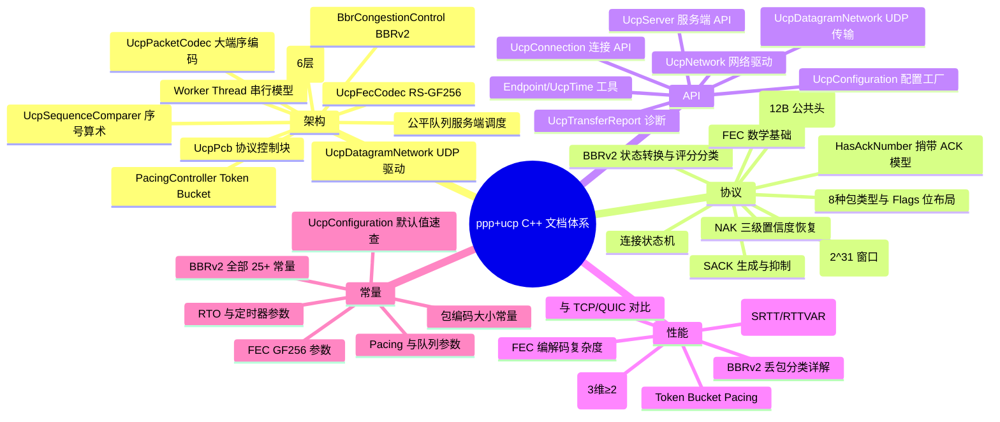
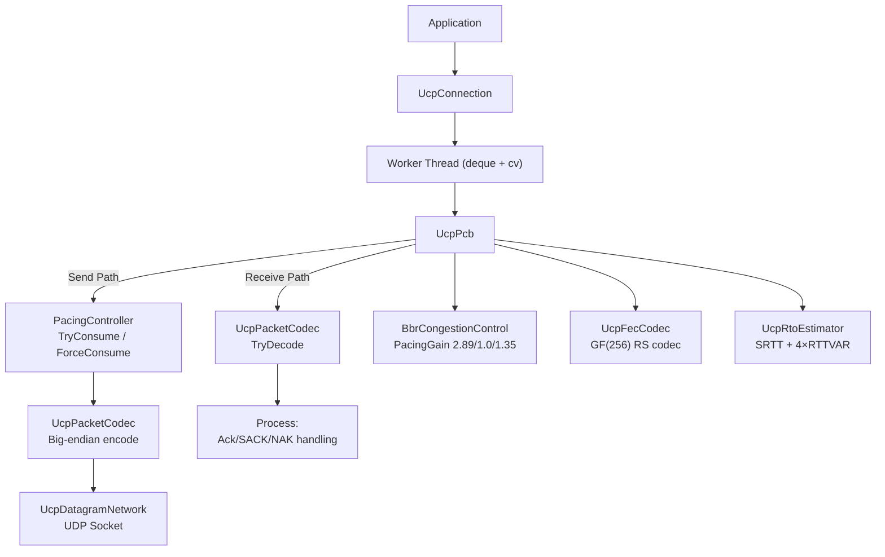
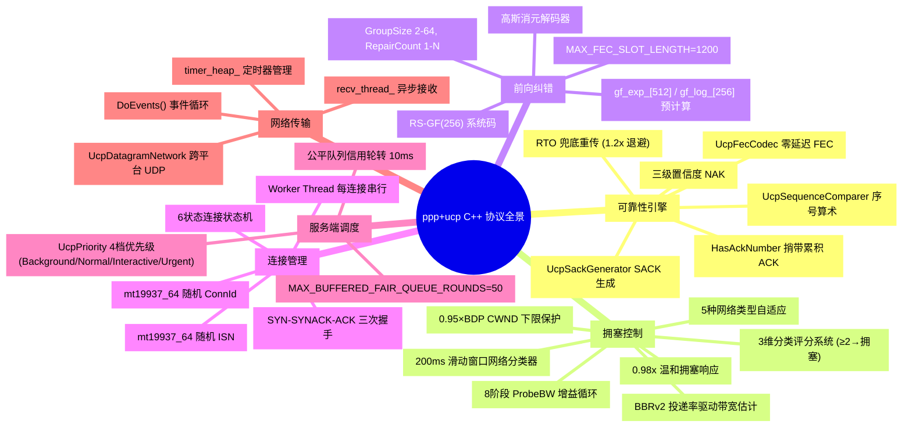

# PPP PRIVATE NETWORK™ X — 通用通信协议 (UCP) — C++ 文档索引

**协议标识: `ppp+ucp`** — UCP（Universal Communication Protocol）是面向下一代异构网络的工业级可靠传输协议 C++ 实现。它直接运行在 UDP 之上，从 QUIC 汲取架构灵感，但在丢包恢复、确认策略、拥塞控制和前向纠错方面做出了根本性不同的设计选择。

UCP 的核心信条是：**丢包分类必须在调速之前完成**。C++ 实现使用 MT19937 随机数据模型、BBRv2 拥塞控制评分系统（3 维分类器 + 总分≥2 确认拥塞）、GF(256) Reed-Solomon 前向纠错以及 Worker Thread 每连接串行模型。

---

## 文档导航地图



---

## 文档列表

| 文档 | 内容概述 |
|---|---|
| [architecture_CN.md](architecture_CN.md) | 运行时分层架构（应用API→UDP Socket）、UcpPcb 状态管理（发送缓冲/接收缓冲/定时器）、Worker Thread 串行执行模型、PacingController Token Bucket 设计、BBRv2 拥塞控制内核、UcpFecCodec RS-GF(256) 编解码器、UcpDatagramNetwork 网络驱动、ISN 随机生成（mt19937_64）、序号算术（UcpSequenceComparer）、连接状态机、公平队列调度 |
| [protocol_CN.md](protocol_CN.md) | 线格式规范：公共头(12B)、8种包类型（UcpPacketType::Syn/SynAck/Ack/Nak/Data/Fin/Rst/FecRepair）、Flags 位布局（NeedAck=0x01, Retransmit=0x02, FinAck=0x04, HasAckNumber=0x08, PriorityMask=0x30）、HasAckNumber 捎带 ACK 扩展、DATA/ACK/NAK/FecRepair 包详细布局（含 C++ 结构体定义）、大端序编码（ReadUInt32/WriteUInt32/ReadUInt48/WriteUInt48）、序号算术（UcpSequenceComparer:IsAfter/IsBefore）、三次握手序列、丢包检测多路径恢复流程、NAK 三级置信度守卫、BBRv2 状态转换（C++ 精确增益值：Startup=2.89, Drain=1.0, ProbeBW_High=1.35）、拥塞分类评分系统（3 维 ≥2 确认）、FEC 编解码流程 |
| [api_CN.md](api_CN.md) | 公开 API 完整参考：UcpConfiguration 全部字段与 Getter/Setter（包括 BBRv2 增益：StartupPacingGain=2.89, ProbeBwHighGain=1.35, DrainPacingGain=1.0）、UcpServer 生命周期（Start/AcceptAsync/Stop）、UcpConnection 连接管理（ConnectAsync/Close/Dispose）、发送方法（Send/SendAsync/Write/WriteAsync 均支持 UcpPriority 四档优先级）、接收方法（Receive/ReceiveAsync/Read/ReadAsync）、事件回调（SetOnData/SetOnConnected/SetOnDisconnected）、诊断（GetReport → UcpTransferReport）、UcpNetwork/UcpDatagramNetwork 事件循环、Endpoint 工具类型、完整端到端 C++ 代码示例、构建集成（CMake） |
| [performance_CN.md](performance_CN.md) | BBRv2 拥塞控制详解：全部 C++ 内部常量（kLossCwndRecoveryStep=0.08, kLossCwndRecoveryStepFast=0.15, kFastRecoveryPacingGain=1.25, kCongestionLossReduction=0.98, kMinLossCwndGain=0.95）、拥塞评分系统（kCongestionRateDropRatio=-0.15, kCongestionRttIncreaseRatio=0.50, kCongestionLossRatio=0.10, 总分≥2→拥塞）、网络路径分类器（kNetworkClassifierWindowDurationMicros=200ms）、BbrConfig 全部参数、Pacing 控制器性能、RTO 估计器（SRTT/RTTVAR 公式）、FEC 编解码复杂度、性能基准预期表（14+ 场景）、收敛特性、与 TCP/QUIC 对比表、性能调优指南（MSS/缓冲/FEC/常见陷阱） |
| [constants_CN.md](constants_CN.md) | 常量全量目录：包编码（8 项 + 编解码移位常量 6 项）、RTO 与定时器（14 项含 INITIAL_RTO=100ms, MIN_RTO=20ms, RTO_BACKOFF=1.2）、Pacing 与队列（5 项含 TIMER_INTERVAL=1ms）、BBRv2（6 组 25+ 常量：增益常量、速率增长、丢包响应、丢包率分层、EWMA、拥塞分类器阈值、ProbeRTT、Inflight 边界、网络分类器、内部缓冲大小）、FEC（6 项含 GF256 多项式 0x11d, MAX_FEC_SLOT_LENGTH=1200）、连接与会话（5 项）、UcpConfiguration 全部默认值速查表（30+ 字段含私有成员）、推荐配置与按场景调优建议 |

---

## 快速入口

### 按角色导航

| 角色 | 推荐阅读顺序 |
|---|---|
| **协议开发者** | protocol_CN → architecture_CN → constants_CN |
| **集成开发者** | api_CN → architecture_CN → performance_CN |
| **性能工程师** | performance_CN → constants_CN → protocol_CN |
| **架构师** | architecture_CN → protocol_CN → performance_CN |

### 核心概念速览



### C++ 实现关键特征

| 特征 | C++ 实现 | 说明 |
|---|---|---|
| 随机数 | `std::mt19937_64` + `std::random_device` | ISN 和 ConnId 生成 |
| 串行模型 | `std::deque` + `std::condition_variable` + `std::thread` | 每连接 Worker Thread |
| 大端序 | `ReadUInt32`/`WriteUInt32` 手工位操作 | 跨平台兼容 |
| 网络层 | `SOCKET` (WinSock2/POSIX) `UcpDatagramNetwork::recv_thread_` | 跨平台 UDP |
| 时间 | `UcpTime::NowMicroseconds()` | `std::chrono::steady_clock` |
| GF(256) | 256 项 `gf_log_` + 512 项 `gf_exp_` 预计算表 | O(1) 乘除法 |
| 路径分类 | 200ms 滑动窗口 × 8，5 种网络类型 | 差异化 BBR 行为 |

### BBRv2 增益速查 (C++ 值)

| 模式 | Pacing 增益 | CWND 增益 |
|---|---|---|
| Startup | 2.89 | 2.0 |
| Drain | 1.0 | — |
| ProbeBW (Up) | 1.35 | 2.0 |
| ProbeBW (Down) | 0.85 | 2.0 |
| ProbeBW (Cruise) | 1.0 | 2.0 |
| ProbeRTT | 0.85 | 4 packets |

### 丢包分类规则 (C++ 评分系统)

| 信号 | 阈值 | 得分 |
|---|---|---|
| 投递率下降 | ≥ 15% | +1 |
| RTT 增长 | ≥ 50% | +1 |
| 丢包率 | ≥ 10% | +1 |
| **总分 ≥ 2** | → | **确认拥塞 (`_lossCwndGain ×= 0.98`)** |
| RTT 增长 < 20% | → | **随机丢包 (PacingGain = 1.25)** |

---

## 构建与集成

### 源文件清单

```
cpp/
├── include/ucp/
│   ├── ucp_bbr.h              # BbrCongestionControl
│   ├── ucp_configuration.h    # UcpConfiguration
│   ├── ucp_connection.h       # UcpConnection
│   ├── ucp_constants.h        # Constants namespace
│   ├── ucp_datagram_network.h # UcpDatagramNetwork
│   ├── ucp_enums.h            # UcpPacketType, UcpPacketFlags, etc.
│   ├── ucp_fec_codec.h        # UcpFecCodec
│   ├── ucp_network.h          # UcpNetwork
│   ├── ucp_pacing.h           # PacingController
│   ├── ucp_packet_codec.h     # UcpPacketCodec
│   ├── ucp_packets.h          # UcpDataPacket, UcpAckPacket, etc.
│   ├── ucp_pcb.h              # UcpPcb (public interface)
│   ├── ucp_rto_estimator.h    # UcpRtoEstimator
│   ├── ucp_sack_generator.h   # UcpSackGenerator
│   ├── ucp_sequence_comparer.h # UcpSequenceComparer
│   ├── ucp_server.h           # UcpServer
│   ├── ucp_time.h             # UcpTime
│   ├── ucp_transfer_report.h  # UcpTransferReport (duplicate)
│   └── ucp_types.h            # Endpoint, UcpTransferReport, etc.
└── src/
    ├── ucp_bbr.cpp
    ├── ucp_configuration.cpp
    ├── ucp_connection.cpp
    ├── ucp_datagram_network.cpp
    ├── ucp_fec_codec.cpp
    ├── ucp_network.cpp
    ├── ucp_pacing.cpp
    ├── ucp_packet_codec.cpp
    ├── ucp_pcb.cpp
    ├── ucp_rto_estimator.cpp
    ├── ucp_sack_generator.cpp
    ├── ucp_server.cpp
    └── ucp_time.cpp
```

### 平台支持

| 平台 | Socket API | 编译器 |
|---|---|---|
| Windows | WinSock2 (`winsock2.h`, `ws2_32.lib`) | MSVC / clang-cl |
| Linux | POSIX (`sys/socket.h`, `arpa/inet.h`) | GCC / Clang |
| macOS | POSIX (同 Linux) | Apple Clang |

### 依赖

零外部依赖 — 仅需 **C++17** 标准库 (`<chrono>`, `<thread>`, `<mutex>`, `<condition_variable>`, `<atomic>`, `<deque>`, `<functional>`, `<random>`, `<vector>`, `<map>`, `<unordered_map>`) + 平台 Socket API。

---

## 协议功能全景图



---

## 性能特征摘要 (C++ 实现)

| 属性 | 数值 |
|---|---|
| 最大测试吞吐 | 10 Gbps |
| 最小时延 | <100µs |
| 最大测试 RTT | 300ms (卫星) |
| 最大测试丢包率 | 10% 随机丢包 |
| BBR Startup 增益 | 2.89 |
| BBR ProbeBW 上探增益 | 1.35 |
| BBR Drain 增益 | 1.0 |
| CWND 下限 | 0.95 × BDP |
| 拥塞削减 | 0.98× (2% per event) |
| CWND 恢复步长 | 0.08/ACK (0.15 Mobile) |
| 初始 RTO | 100ms |
| 最小 RTO | 20ms |
| RTO 退避 | 1.2× |
| FEC 域 | GF(256), 多项式 0x11d |
| FEC 最大组大小 | 64 |
| 默认 MSS | 1220 |
| 定时器间隔 | 1ms |
| 公平队列轮次 | 10ms |
| 收敛时间 (无丢包) | 2-5 RTT |
| 收敛时间 (有丢包) | +1-2 RTT/突发 |
