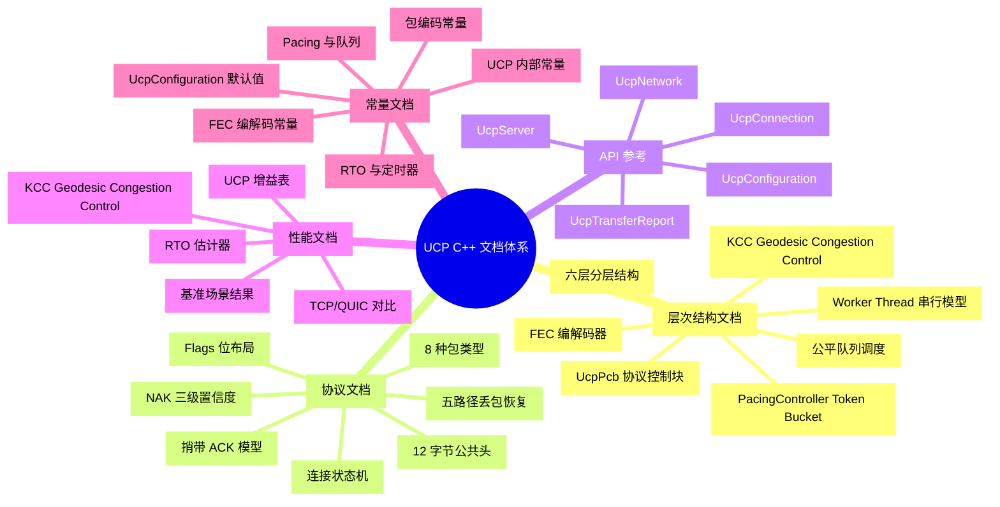

# UCP C++ 文档索引

[English](index_EN.md)

本文档是 UCP C++ 实现全部文档的导航索引，涵盖核心概念、源文件、性能特征和常量体系。UCP 基于 UDP 之上运行，采用 KCC（Geodesic Congestion Control）拥塞控制、GF(256) Reed-Solomon 前向纠错、三级置信度 NAK 和 Worker Thread 每连接串行模型。实现基于 C++17，UDP Socket 层使用 Boost.Asio。

UCP 是纯控制协议：拥塞控制、CID 轮换切换和 FEC/NAK 恢复通过独立子系统运行。拥塞控制使用 KCC 3 模式状态机（STARTUP/DRAIN/PROBE_BW）；测地线估计器自动处理 MinRTT 跟踪。可发送上限为 min(cwnd, 对端宣告的接收窗口)；初始 cwnd 并非固定的 10 包上限。FEC 和 NAK 为拥塞控制提供投递样本，以实现更精确的带宽/延迟估计。

协议实现层面，UCP 部署了五条独立恢复路径：RS-GF(256) 前向纠错提供零延迟恢复，SACK 选择性确认和重复 ACK 快速重传提供亚 RTT 级恢复，NAK 三级置信度否定确认根据缺口持续时长动态调整守卫时长，RTO 超时重传作为最后保障。这些路径互不冲突，同一缺口仅触发最优路径。

KCC 拥塞控制以投递率作为主要拥塞信号，在 Startup 阶段使用 2.89 倍 Pacing 增益快速探测可用带宽，稳定阶段通过 8 阶段 ProbeBW 循环动态调整发送速率。每连接通过专属 Worker Thread 串行处理所有协议事件；共享状态由各组件互斥锁保护（ucp_pcb.h 中 16+ 个），回调保持在锁外执行以最小化持锁时间。

本索引文档整合了 UCP C++ 实现的全部技术文档入口，按主题分类组织层次结构、协议、API、性能和常量五大专题。每个专题均有独立的中英文文档，读者可根据需要选择阅读语言。性能速查表提供关键指标的快速参考，源文件清单列出全部头文件和实现文件的位置与功能说明。核心概念速查表以表格形式提供常用术语与对应文档的快速映射，便于读者在六份专题文档之间高效导航。

## 文档导航图


```mermaid
mindmap
  root(("UCP C++ 文档体系"))
    ["层次结构文档"]
      ["六层分层结构"]
      ["UcpPcb 协议控制块"]
      ["Worker Thread 串行模型"]
      ["公平队列调度"]
      ["PacingController Token Bucket"]
      ["KCC Geodesic Congestion Control"]
      ["FEC 编解码器"]
    ["协议文档"]
      ["12 字节公共头"]
      ["8 种包类型"]
      ["Flags 位布局"]
      ["捎带 ACK 模型"]
      ["连接状态机"]
      ["五路径丢包恢复"]
      ["NAK 三级置信度"]
    ["API 参考"]
      ["UcpConfiguration"]
      ["UcpServer"]
      ["UcpConnection"]
      ["UcpNetwork"]
      ["UcpTransferReport"]
    ["性能文档"]
      ["UCP 增益表"]
      ["KCC Geodesic Congestion Control"]
      ["RTO 估计器"]
      ["基准场景结果"]
      ["TCP/QUIC 对比"]
    ["常量文档"]
      ["包编码常量"]
      ["RTO 与定时器"]
      ["Pacing 与队列"]
      ["UCP 内部常量"]
      ["FEC 编解码常量"]
      ["UcpConfiguration 默认值"]
```

## 核心概念速查

| 概念 | 说明 | 对应文档 |
|---|---|---|
| 六层分层结构 | 应用层到 UDP Socket，每层职责隔离 | [architecture_CN.md](architecture_CN.md) |
| Worker Thread | 每连接专属 std::thread + std::deque | [architecture_CN.md](architecture_CN.md) |
| UcpPcb | 协议控制块，每连接一个实例 | [architecture_CN.md](architecture_CN.md) |
| 12 字节公共头 | Type + Flags + ConnId + Timestamp | [protocol_CN.md](protocol_CN.md) |
| HasAckNumber | 捎带 ACK 标志，所有包类型均可携带 | [protocol_CN.md](protocol_CN.md) |
| UCP | 投递率驱动拥塞控制，Startup=2.887 (739/256) | [performance_CN.md](performance_CN.md) |
| tcp_kcc.c KF | KCC Forwarding (KF) 跨连接带宽共享组件，源于 tcp_kcc.c 内核模块 | [performance_CN.md](performance_CN.md) |
| RS-GF(256) | Reed-Solomon 前向纠错编码 | [architecture_CN.md](architecture_CN.md) |
| NAK 三级置信 | 低/中/高 守卫时长递减 | [protocol_CN.md](protocol_CN.md) |
| NULLPTR | nullptr 的宏替代，全库统一使用 | [README_CN.md](../README_CN.md) |

## 源文件清单

| 文件 | 功能 |
|---|---|
| `include/ucp/ucp_pcb.h` / `src/ucp_pcb.cpp` | 协议控制块，状态机核心 |
| `include/ucp/ucp_connection.h` / `src/ucp_connection.cpp` | 连接 API + Worker Thread |
| `include/ucp/ucp_server.h` / `src/ucp_server.cpp` | 服务端 + 公平队列 |
| `include/ucp/ucp_cc.h` / `src/ucp_cc.cpp` | KCC 拥塞控制 |
| `include/ucp/ucp_pacing.h` / `src/ucp_pacing.cpp` | 令牌桶 Pacing |
| `include/ucp/ucp_fec_codec.h` / `src/ucp_fec_codec.cpp` | GF(256) FEC 编解码 |
| `include/ucp/ucp_packet_codec.h` / `src/ucp_packet_codec.cpp` | 大端序包编解码 |
| `include/ucp/ucp_rto_estimator.h` / `src/ucp_rto_estimator.cpp` | RTT/RTO 估计器 |
| `include/ucp/ucp_sack_generator.h` / `src/ucp_sack_generator.cpp` | SACK 块生成 |
| `include/ucp/ucp_network.h` / `src/ucp_network.cpp` | 网络事件循环 |
| `include/ucp/ucp_datagram_network.h` / `src/ucp_datagram_network.cpp` | UDP Socket 实现 |
| `include/ucp/ucp_configuration.h` / `src/ucp_configuration.cpp` | 配置结构体 |
| `include/ucp/ucp_constants.h` | 协议常量（77+） |
| `include/ucp/ucp_enums.h` | 枚举定义 |
| `include/ucp/ucp_packets.h` | 包类型类 |
| `include/ucp/ucp_types.h` | Endpoint / UcpTransferReport 类型 |
| `include/ucp/ucp_vector.h` | 容器别名 / ucp::optional |
| `include/ucp/ucp_memory.h` | Malloc / Mfree / 共享指针辅助 |
| `include/ucp/ucp_time.h` | 时间工具函数 |
| `include/ucp/ucp_sequence_comparer.h` | 32 位循环序号比较器 |
| `include/ucp/ucp_transfer_report.h` | UcpTransferReport 结构体 |
| `include/ucp/transport/itransport.h` | 抽象传输层接口 |
| `src/udp_socket_transport.cpp` | UDP Socket 传输实现 |

## 性能速查

| 指标 | 值 |
|---|---|
| 最大测试吞吐 | 10 Gbps |
| UCP Startup 增益 | 2.887 (739/256) |
| 最小 RTO | 50 ms |
| RTO 退避因子 | 1.2 |
| 拥塞削减幅度 | 包守恒恢复 + LT-BW EMA（无乘性 cwnd 削减） |
| FEC 有限域 | GF(256) 多项式 0x11d |
| 默认 MSS | 1220 |
| 定时器精度 | 1 ms |
| 无丢包利用率 | 42.37%（实测，见 [performance_CN.md](performance_CN.md)） |
| 5% 丢包利用率 | 20.05%（实测，见 [performance_CN.md](performance_CN.md)） |

## 构建命令速查

```bash
# Release 构建
cmake -B build -S . -DCMAKE_BUILD_TYPE=Release
cmake --build build

# 运行测试
./build/tests/Release/ucp_tests

# 运行基准测试
./build/samples/Release/ucp_benchmark
```

## 相关文档

- [README_CN.md](../README_CN.md) — 项目整体介绍，含快速构建指南和关键参数速查
- [architecture_CN.md](architecture_CN.md) — 运行时层次结构
- [protocol_CN.md](protocol_CN.md) — 协议规范
- [api_CN.md](api_CN.md) — API 参考
- [performance_CN.md](performance_CN.md) — 性能特征
- [constants_CN.md](constants_CN.md) — 协议常量
- [Linux 内核模块](../../linux/README.md) — KCC Geodesic Congestion Control 内核模块（tcp_kcc.c v2.0，含 KCC Forwarding (KF) 跨连接带宽共享组件）

---

## 许可证与商标

MIT 许可证。完整文本见 [LICENSE](../../LICENSE)。

版权所有 (c) 2026 PPP PRIVATE NETWORK™ X

PPP PRIVATE NETWORK™ 是 PPP PRIVATE NETWORK 的商标。
