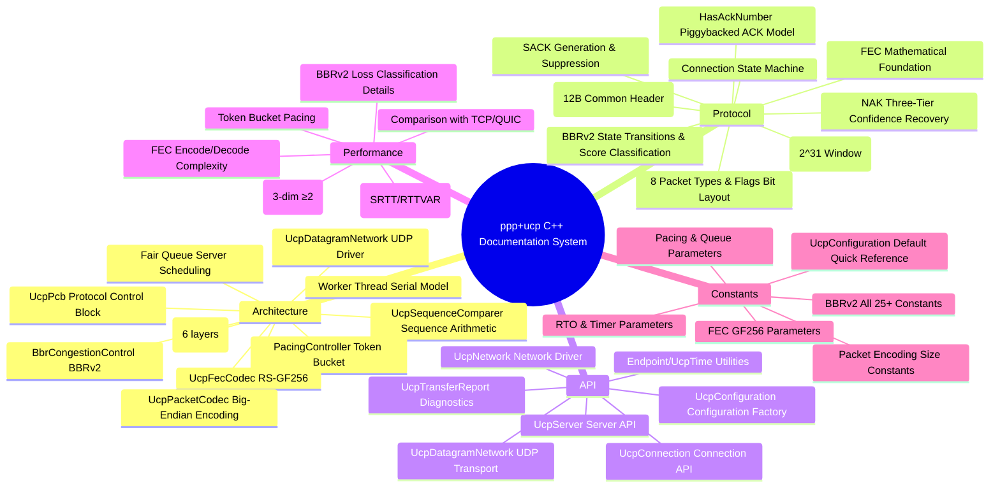
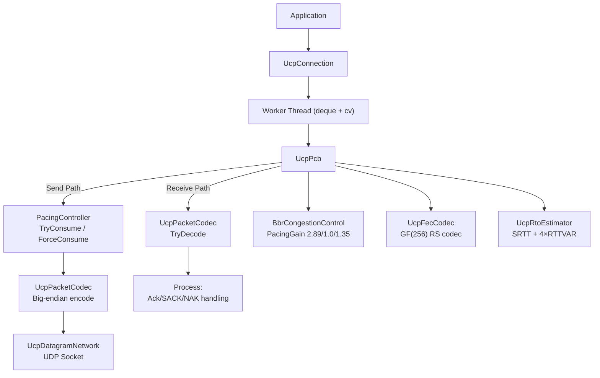
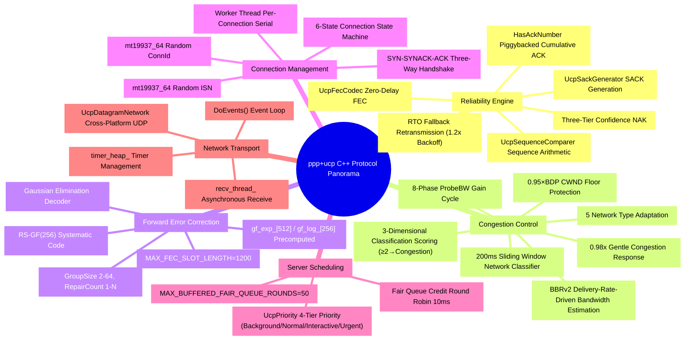

# PPP PRIVATE NETWORK™ X — Universal Communication Protocol (UCP) — C++ Documentation Index

**Protocol Identifier: `ppp+ucp`** — UCP (Universal Communication Protocol) is an industrial-grade reliable transport protocol realized in C++, designed for next-generation heterogeneous networks. It operates directly over UDP, drawing architectural inspiration from QUIC, but making fundamentally different design choices regarding loss recovery, acknowledgment strategies, congestion control, and forward error correction.

The core tenet of UCP is: **loss classification must precede rate adjustment**. The C++ implementation employs an MT19937 random data model, a BBRv2 congestion control scoring system (3-dimensional classifier + total score ≥2 confirms congestion), GF(256) Reed-Solomon forward error correction, and a per-connection Worker Thread serial model.

---

## Documentation Navigation Map



---

## Document List

| Document | Content Overview |
|---|---|
| [architecture_EN.md](architecture_EN.md) | Runtime layered architecture (Application API→UDP Socket), UcpPcb state management (send buffer/receive buffer/timers), Worker Thread serial execution model, PacingController Token Bucket design, BBRv2 congestion control kernel, UcpFecCodec RS-GF(256) codec, UcpDatagramNetwork network driver, ISN random generation (mt19937_64), sequence arithmetic (UcpSequenceComparer), connection state machine, fair queue scheduling |
| [protocol_EN.md](protocol_EN.md) | Wire format specification: common header (12B), 8 packet types (UcpPacketType::Syn/SynAck/Ack/Nak/Data/Fin/Rst/FecRepair), Flags bit layout (NeedAck=0x01, Retransmit=0x02, FinAck=0x04, HasAckNumber=0x08, PriorityMask=0x30), HasAckNumber piggybacked ACK extension, DATA/ACK/NAK/FecRepair packet detailed layout (with C++ struct definitions), big-endian encoding (ReadUInt32/WriteUInt32/ReadUInt48/WriteUInt48), sequence arithmetic (UcpSequenceComparer:IsAfter/IsBefore), three-way handshake sequence, loss detection multi-path recovery flow, NAK three-tier confidence guard, BBRv2 state transitions (C++ exact gain values: Startup=2.89, Drain=1.0, ProbeBW_High=1.35), congestion classification scoring system (3-dim ≥2 confirmation), FEC encode/decode flow |
| [api_EN.md](api_EN.md) | Complete public API reference: UcpConfiguration all fields with Getter/Setter (including BBRv2 gains: StartupPacingGain=2.89, ProbeBwHighGain=1.35, DrainPacingGain=1.0), UcpServer lifecycle (Start/AcceptAsync/Stop), UcpConnection connection management (ConnectAsync/Close/Dispose), send methods (Send/SendAsync/Write/WriteAsync all support UcpPriority four-tier priority), receive methods (Receive/ReceiveAsync/Read/ReadAsync), event callbacks (SetOnData/SetOnConnected/SetOnDisconnected), diagnostics (GetReport → UcpTransferReport), UcpNetwork/UcpDatagramNetwork event loop, Endpoint utility type, complete end-to-end C++ code example, build integration (CMake) |
| [performance_EN.md](performance_EN.md) | BBRv2 congestion control details: all C++ internal constants (kLossCwndRecoveryStep=0.08, kLossCwndRecoveryStepFast=0.15, kFastRecoveryPacingGain=1.25, kCongestionLossReduction=0.98, kMinLossCwndGain=0.95), congestion scoring system (kCongestionRateDropRatio=-0.15, kCongestionRttIncreaseRatio=0.50, kCongestionLossRatio=0.10, total≥2→congestion), network path classifier (kNetworkClassifierWindowDurationMicros=200ms), BbrConfig all parameters, Pacing controller performance, RTO estimator (SRTT/RTTVAR formulas), FEC encode/decode complexity, performance benchmark expectation table (14+ scenarios), convergence characteristics, comparison with TCP/QUIC tables, performance tuning guide (MSS/buffer/FEC/common pitfalls) |
| [constants_EN.md](constants_EN.md) | Complete constants catalog: packet encoding (8 items + codec shift constants 6 items), RTO & timers (14 items including INITIAL_RTO=100ms, MIN_RTO=20ms, RTO_BACKOFF=1.2), Pacing & queue (5 items including TIMER_INTERVAL=1ms), BBRv2 (6 groups 25+ constants: gain constants, rate growth, loss response, loss rate tiers, EWMA, congestion classifier thresholds, ProbeRTT, inflight bounds, network classifier, internal buffer sizes), FEC (6 items including GF256 polynomial 0x11d, MAX_FEC_SLOT_LENGTH=1200), connection & session (5 items), UcpConfiguration complete default quick reference table (30+ fields including private members), recommended configuration and per-scenario tuning advice |

---

## Quick Entry Points

### Navigation by Role

| Role | Recommended Reading Order |
|---|---|
| **Protocol Developer** | protocol_EN → architecture_EN → constants_EN |
| **Integration Developer** | api_EN → architecture_EN → performance_EN |
| **Performance Engineer** | performance_EN → constants_EN → protocol_EN |
| **Architect** | architecture_EN → protocol_EN → performance_EN |

### Core Concepts Overview



### Key C++ Implementation Features

| Feature | C++ Implementation | Description |
|---|---|---|
| Random Numbers | `std::mt19937_64` + `std::random_device` | ISN and ConnId generation |
| Serial Model | `std::deque` + `std::condition_variable` + `std::thread` | Per-connection Worker Thread |
| Big-Endian | `ReadUInt32`/`WriteUInt32` manual bit operations | Cross-platform compatibility |
| Network Layer | `SOCKET` (WinSock2/POSIX) `UcpDatagramNetwork::recv_thread_` | Cross-platform UDP |
| Time | `UcpTime::NowMicroseconds()` | `std::chrono::steady_clock` |
| GF(256) | 256-entry `gf_log_` + 512-entry `gf_exp_` precomputed tables | O(1) multiplication/division |
| Path Classification | 200ms sliding window × 8, 5 network types | Differentiated BBR behavior |

### BBRv2 Gain Quick Reference (C++ Values)

| Mode | Pacing Gain | CWND Gain |
|---|---|---|
| Startup | 2.89 | 2.0 |
| Drain | 1.0 | — |
| ProbeBW (Up) | 1.35 | 2.0 |
| ProbeBW (Down) | 0.85 | 2.0 |
| ProbeBW (Cruise) | 1.0 | 2.0 |
| ProbeRTT | 0.85 | 4 packets |

### Loss Classification Rules (C++ Scoring System)

| Signal | Threshold | Score |
|---|---|---|
| Delivery Rate Drop | ≥ 15% | +1 |
| RTT Increase | ≥ 50% | +1 |
| Loss Rate | ≥ 10% | +1 |
| **Total ≥ 2** | → | **Confirmed Congestion (`_lossCwndGain ×= 0.98`)** |
| RTT Increase < 20% | → | **Random Loss (PacingGain = 1.25)** |

---

## Build & Integration

### Source File Listing

```
cpp/
├── include/ucp/
│   ├── ucp_bbr.h              # BbrCongestionControl
│   ├── ucp_configuration.h    # UcpConfiguration
│   ├── ucp_connection.h       # UcpConnection
│   ├── ucp_constants.h        # Constants namespace
│   ├── ucp_datagram_network.h # UcpDatagramNetwork
│   ├── ucp_enums.h            # UcpPacketType, UcpPacketFlags, etc.
│   ├── ucp_fec_codec.h        # UcpFecCodec
│   ├── ucp_network.h          # UcpNetwork
│   ├── ucp_pacing.h           # PacingController
│   ├── ucp_packet_codec.h     # UcpPacketCodec
│   ├── ucp_packets.h          # UcpDataPacket, UcpAckPacket, etc.
│   ├── ucp_pcb.h              # UcpPcb (public interface)
│   ├── ucp_rto_estimator.h    # UcpRtoEstimator
│   ├── ucp_sack_generator.h   # UcpSackGenerator
│   ├── ucp_sequence_comparer.h # UcpSequenceComparer
│   ├── ucp_server.h           # UcpServer
│   ├── ucp_time.h             # UcpTime
│   ├── ucp_transfer_report.h  # UcpTransferReport (duplicate)
│   └── ucp_types.h            # Endpoint, UcpTransferReport, etc.
└── src/
    ├── ucp_bbr.cpp
    ├── ucp_configuration.cpp
    ├── ucp_connection.cpp
    ├── ucp_datagram_network.cpp
    ├── ucp_fec_codec.cpp
    ├── ucp_network.cpp
    ├── ucp_pacing.cpp
    ├── ucp_packet_codec.cpp
    ├── ucp_pcb.cpp
    ├── ucp_rto_estimator.cpp
    ├── ucp_sack_generator.cpp
    ├── ucp_server.cpp
    └── ucp_time.cpp
```

### Platform Support

| Platform | Socket API | Compiler |
|---|---|---|
| Windows | WinSock2 (`winsock2.h`, `ws2_32.lib`) | MSVC / clang-cl |
| Linux | POSIX (`sys/socket.h`, `arpa/inet.h`) | GCC / Clang |
| macOS | POSIX (same as Linux) | Apple Clang |

### Dependencies

Zero external dependencies — only **C++17** standard library (`<chrono>`, `<thread>`, `<mutex>`, `<condition_variable>`, `<atomic>`, `<deque>`, `<functional>`, `<random>`, `<vector>`, `<map>`, `<unordered_map>`) + platform Socket API.

---

## Protocol Feature Panorama



---

## Performance Characteristics Summary (C++ Implementation)

| Property | Value |
|---|---|
| Maximum Tested Throughput | 10 Gbps |
| Minimum Latency | <100µs |
| Maximum Tested RTT | 300ms (satellite) |
| Maximum Tested Loss Rate | 10% random loss |
| BBR Startup Gain | 2.89 |
| BBR ProbeBW Probe-Up Gain | 1.35 |
| BBR Drain Gain | 1.0 |
| CWND Floor | 0.95 × BDP |
| Congestion Reduction | 0.98× (2% per event) |
| CWND Recovery Step | 0.08/ACK (0.15 Mobile) |
| Initial RTO | 100ms |
| Minimum RTO | 20ms |
| RTO Backoff | 1.2× |
| FEC Field | GF(256), polynomial 0x11d |
| FEC Maximum Group Size | 64 |
| Default MSS | 1220 |
| Timer Interval | 1ms |
| Fair Queue Round | 10ms |
| Convergence Time (No Loss) | 2-5 RTT |
| Convergence Time (With Loss) | +1-2 RTT/burst |
