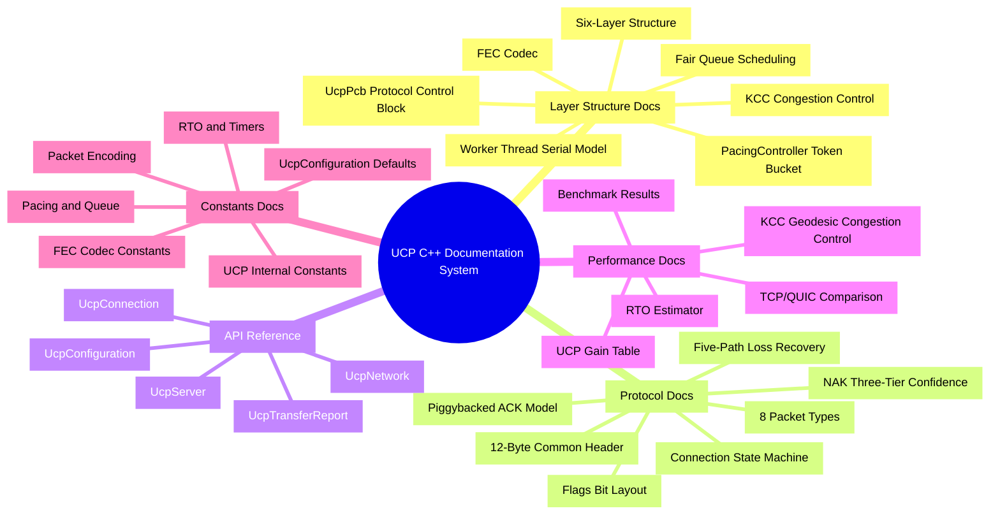

# UCP C++ Documentation Index

[Chinese](index_CN.md)

This document is the navigation index for all UCP C++ implementation documentation, covering core concepts, source files, performance characteristics, and constants. UCP runs over UDP and uses KCC (Geodesic Congestion Control) congestion control, GF(256) Reed-Solomon FEC, three-tier confidence NAK, and a per-connection serial Worker Thread model. Implemented in C++17 with Boost.Asio providing the UDP socket layer.

UCP is a pure control protocol: congestion control, CID round-robin switching, and FEC/NAK recovery operate through independent subsystems. Congestion control uses the KCC 3-mode state machine (STARTUP/DRAIN/PROBE_BW); the geodesic estimator handles minRTT tracking automatically. The sendable upper limit is min(cwnd, peer-declared receive window); the initial cwnd is NOT a fixed 10-packet cap. FEC and NAK provide delivery samples to the congestion control for more accurate bandwidth/delay estimation.

At the protocol implementation level, UCP deploys five independent recovery paths: RS-GF(256) FEC provides zero-latency recovery, SACK selective acknowledgement and duplicate ACK fast retransmit provide sub-RTT recovery, NAK three-tier confidence negative acknowledgment dynamically adjusts guard duration based on gap duration, with RTO timeout retransmission as the final safeguard. These paths do not conflict; the same gap triggers only the optimal path.

KCC congestion control uses delivery rate as the primary congestion signal, using a 2.89x Pacing gain in Startup to rapidly probe available bandwidth, and dynamically adjusting send rate through an 8-phase ProbeBW cycle in steady state. Each connection processes all protocol events serially through a dedicated Worker Thread; shared state is protected by per-component mutexes (16+ in ucp_pcb.h), with callbacks kept out of locked sections to minimize lock hold time.

This index document consolidates all technical documentation entries for the UCP C++ implementation, organized by topic into five major areas: layer structure, protocol, API, performance, and constants. Each topic has standalone Chinese and English documents. The performance quick reference provides rapid access to key metrics, and the source file listing identifies the location and function of all headers and implementation files. The core concepts quick reference provides fast mapping of common terms to their corresponding documents in table format.

## Document Navigation Map


```mermaid
mindmap
  root(("UCP C++ Documentation System"))
    ["Layer Structure Docs"]
      ["Six-Layer Structure"]
      ["UcpPcb Protocol Control Block"]
      ["Worker Thread Serial Model"]
      ["Fair Queue Scheduling"]
      ["PacingController Token Bucket"]
      ["KCC Congestion Control"]
      ["FEC Codec"]
    ["Protocol Docs"]
      ["12-Byte Common Header"]
      ["8 Packet Types"]
      ["Flags Bit Layout"]
      ["Piggybacked ACK Model"]
      ["Connection State Machine"]
      ["Five-Path Loss Recovery"]
      ["NAK Three-Tier Confidence"]
    ["API Reference"]
      ["UcpConfiguration"]
      ["UcpServer"]
      ["UcpConnection"]
      ["UcpNetwork"]
      ["UcpTransferReport"]
    ["Performance Docs"]
      ["UCP Gain Table"]
      ["KCC Geodesic Congestion Control"]
      ["RTO Estimator"]
      ["Benchmark Results"]
      ["TCP/QUIC Comparison"]
    ["Constants Docs"]
      ["Packet Encoding"]
      ["RTO and Timers"]
      ["Pacing and Queue"]
      ["UCP Internal Constants"]
      ["FEC Codec Constants"]
      ["UcpConfiguration Defaults"]
```

## Core Concepts Quick Reference

| Concept | Description | Document |
|---|---|---|
| Six-layer structure | Application layer to UDP Socket | [architecture_EN.md](architecture_EN.md) |
| Worker Thread | Dedicated std::thread + std::deque per connection | [architecture_EN.md](architecture_EN.md) |
| UcpPcb | Protocol control block, one per connection | [architecture_EN.md](architecture_EN.md) |
| 12-byte common header | Type + Flags + ConnId + Timestamp | [protocol_EN.md](protocol_EN.md) |
| HasAckNumber | Piggyback ACK flag on all packet types | [protocol_EN.md](protocol_EN.md) |
| UCP | Delivery-rate-driven congestion control, Startup=2.887 (739/256) | [performance_EN.md](performance_EN.md) |
| tcp_kcc.c KF | KCC Forwarding (KF) cross-connection bandwidth sharing, from the tcp_kcc.c kernel module | [performance_EN.md](performance_EN.md) |
| RS-GF(256) | Reed-Solomon forward error correction | [architecture_EN.md](architecture_EN.md) |
| NAK three-tier | Low/Medium/High confidence with decreasing guard | [protocol_EN.md](protocol_EN.md) |
| NULLPTR | Macro replacement for nullptr | [README_EN.md](../README_EN.md) |

## Source File Listing

| File | Function |
|---|---|
| `include/ucp/ucp_pcb.h` / `src/ucp_pcb.cpp` | Protocol control block, state machine core |
| `include/ucp/ucp_connection.h` / `src/ucp_connection.cpp` | Connection API + Worker Thread |
| `include/ucp/ucp_server.h` / `src/ucp_server.cpp` | Server + fair queue |
| `include/ucp/ucp_cc.h` / `src/ucp_cc.cpp` | KCC congestion control |
| `include/ucp/ucp_pacing.h` / `src/ucp_pacing.cpp` | Token Bucket pacing |
| `include/ucp/ucp_fec_codec.h` / `src/ucp_fec_codec.cpp` | GF(256) FEC codec |
| `include/ucp/ucp_packet_codec.h` / `src/ucp_packet_codec.cpp` | Big-endian packet codec |
| `include/ucp/ucp_rto_estimator.h` / `src/ucp_rto_estimator.cpp` | RTT/RTO estimator |
| `include/ucp/ucp_sack_generator.h` / `src/ucp_sack_generator.cpp` | SACK block generator |
| `include/ucp/ucp_network.h` / `src/ucp_network.cpp` | Network event loop |
| `include/ucp/ucp_datagram_network.h` / `src/ucp_datagram_network.cpp` | UDP socket implementation |
| `include/ucp/ucp_configuration.h` / `src/ucp_configuration.cpp` | Configuration struct |
| `include/ucp/ucp_constants.h` | Protocol constants (77+) |
| `include/ucp/ucp_enums.h` | Enum definitions |
| `include/ucp/ucp_packets.h` | Packet type classes |
| `include/ucp/ucp_types.h` | Endpoint / UcpTransferReport |
| `include/ucp/ucp_vector.h` | Container aliases / ucp::optional |
| `include/ucp/ucp_memory.h` | Malloc / Mfree / shared pointer helpers |
| `include/ucp/ucp_time.h` | Time utility functions |
| `include/ucp/ucp_sequence_comparer.h` | 32-bit circular sequence comparator |
| `include/ucp/ucp_transfer_report.h` | UcpTransferReport struct |
| `include/ucp/transport/itransport.h` | Abstract transport interface |
| `src/udp_socket_transport.cpp` | UDP socket transport implementation |

## Performance Quick Reference

| Metric | Value |
|---|---|
| Max tested throughput | 10 Gbps |
| UCP Startup gain | 2.887 (739/256) |
| Minimum RTO | 50 ms |
| RTO backoff factor | 1.2 |
| Congestion reduction | Packet-conservation recovery + LT-BW EMA (no multiplicative cwnd cut) |
| FEC finite field | GF(256) polynomial 0x11d |
| Default MSS | 1220 |
| Timer precision | 1 ms |
| No-loss utilization | 42.37% (measured, see [performance_EN.md](performance_EN.md)) |
| 5% loss utilization | 20.05% (measured, see [performance_EN.md](performance_EN.md)) |

## Build Command Quick Reference

```bash
# Release build
cmake -B build -S . -DCMAKE_BUILD_TYPE=Release
cmake --build build

# Run tests
./build/tests/Release/ucp_tests

# Run benchmarks
./build/samples/Release/ucp_benchmark
```

## Related Documents

- [README_EN.md](../README_EN.md) — Project overview, with quick build guide and key parameter reference
- [architecture_EN.md](architecture_EN.md) — Runtime layer structure
- [protocol_EN.md](protocol_EN.md) — Protocol specification
- [api_EN.md](api_EN.md) — API reference
- [performance_EN.md](performance_EN.md) — Performance characteristics
- [constants_EN.md](constants_EN.md) — Protocol constants
- [Linux Kernel Module](../../linux/README.md) — KCC Geodesic Congestion Control module (tcp_kcc.c v2.0, with KCC Forwarding (KF) for cross-connection bandwidth sharing)

---

## License and Trademark

MIT License. See [LICENSE](../../LICENSE) for full text.

Copyright (c) 2026 PPP PRIVATE NETWORK™ X

PPP PRIVATE NETWORK™ is a trademark of PPP PRIVATE NETWORK.
