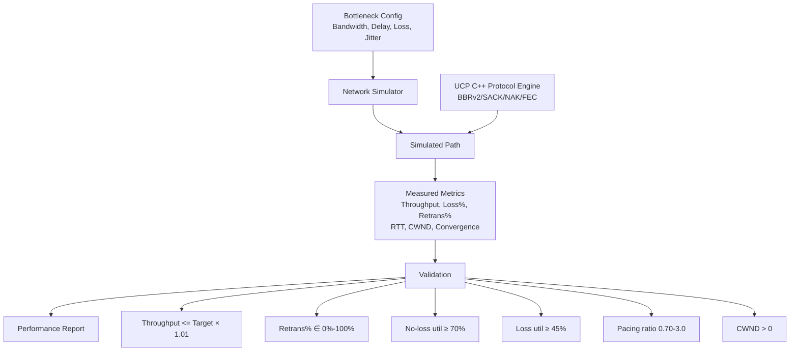
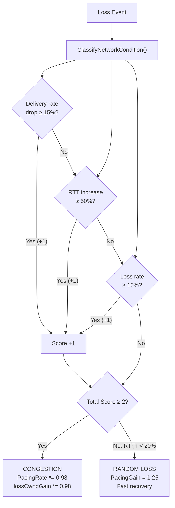
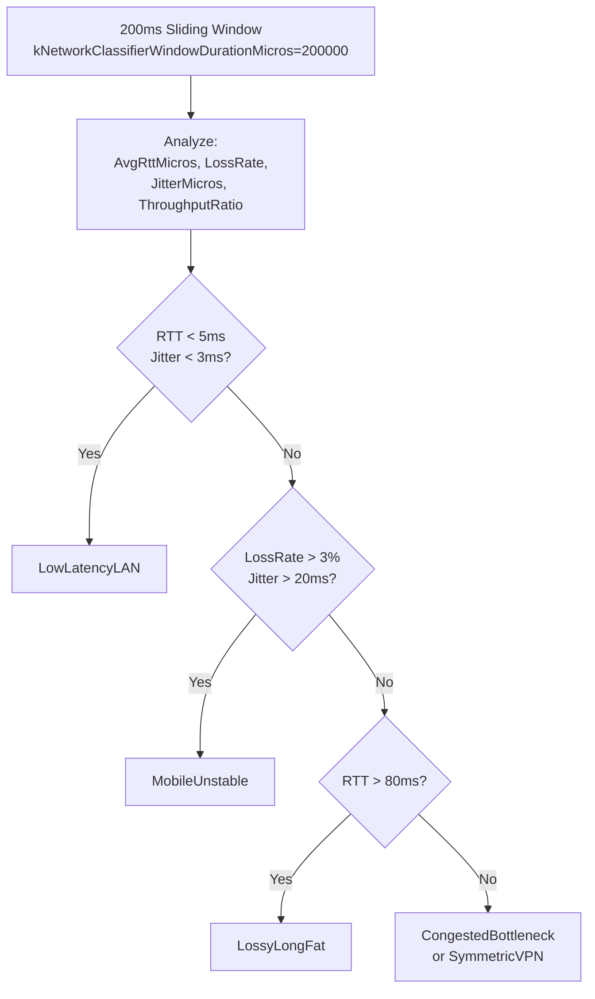
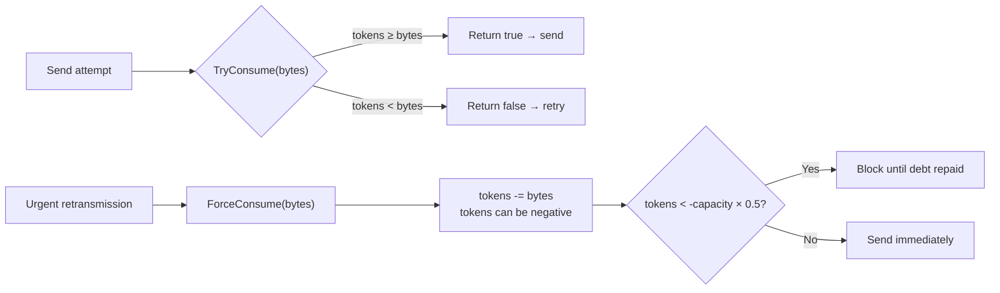
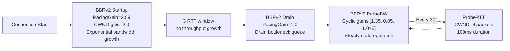
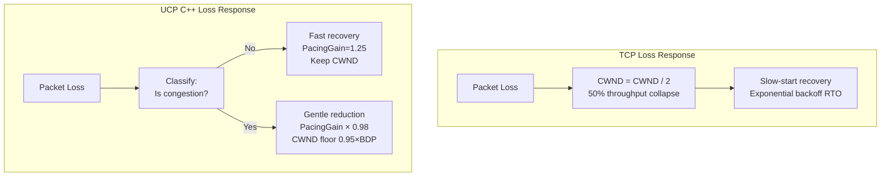

# PPP PRIVATE NETWORK™ X — 通用通信协议 (UCP) — C++ 性能特征

**协议标识: `ppp+ucp`** — 本文档详尽描述 UCP C++ 实现的性能特征，覆盖 BBRv2 拥塞控制的完整机制、丢包分类算法、性能基准、收敛特性以及与传统 TCP/QUIC 的关键差异。所有数值与 `cpp/src/ucp_bbr.cpp` 中的 C++ 实现精确一致。

---

## 性能目标

UCP C++ 实现的设计目标是在从数据中心（>1 Gbps, <1ms RTT）到卫星链路（<10 Mbps, 300ms RTT, 10% 丢包）的广阔路径范围内交付可预测的吞吐性能。关键信条：**丢包分类必须在调速之前完成**。



---

## BBRv2 拥塞控制详解 (C++ 实现)

### 核心算法

`BbrCongestionControl` 定义在 `ucp_bbr.h/ucp_bbr.cpp`，使用 `BbrConfig` 结构接收参数。

```cpp
struct BbrConfig {
    int Mss = 1220;
    double StartupPacingGain = 2.89;
    double StartupCwndGain = 2.0;
    double DrainPacingGain = 1.0;
    double ProbeBwHighGain = 1.35;
    double ProbeBwLowGain = 0.85;
    double ProbeBwCwndGain = 2.0;
    double MaxBandwidthWastePercent = 0.25;
    double MaxBandwidthLossPercent = 0.25;
    bool LossControlEnable = true;
    bool EnableDebugLog = false;
    int64_t InitialBandwidthBytesPerSecond = 12500000;
    int64_t MaxPacingRateBytesPerSecond = 0;
    int MaxCongestionWindowBytes = 0;
    int InitialCongestionWindowBytes = 24400;
    int BbrWindowRtRounds = 10;
    int64_t ProbeRttIntervalMicros = 30000000;
    int64_t ProbeRttDurationMicros = 100000;
};
```

### BBRv2 模式与增益 (C++ 精确值)

| 模式 | Pacing 增益 | CWND 增益 | 持续时间 | 目的 |
|---|---|---|---|---|
| **Startup** | **2.89** | 2.0 | 至 3 RTT 窗口吞吐不增长 | 指数探测瓶颈带宽，快速将 pacing 速率推至近瓶颈 |
| **Drain** | **1.0** | — | 约 1 BBR 周期 | 排空 Startup 累积队列 |
| **ProbeBW** | 循环 [**1.35**, 0.85, **1.0×6**] | 2.0 | 稳态 | 8 阶段增益循环：1 上探 + 1 下探 + 6 巡航 |
| **ProbeRTT** | **0.85** | 4 包 | 100ms（每 30s） | 刷新 MinRTT 估计 |

### 关键比例 (C++ 实现值)

```cpp
// ucp_bbr.cpp — 核心常量
kStartupGrowthTarget             = 1.25;  // Startup 每轮带宽增长目标 (25%)
kStartupAckAggregationRateCapGain = 4.0;   // Startup ACK 聚合速率上限
kSteadyAckAggregationRateCapGain  = 1.50;  // 稳定态 ACK 聚合速率上限
kStartupBandwidthGrowthPerRound   = 2.0;   // Startup 每轮带宽增长上限 (100%)
kSteadyBandwidthGrowthPerRound    = 1.25;  // 稳定态每轮带宽增长上限 (25%)
kInflightLowGain                  = 1.25;  // Inflight 下限 = BDP × 1.25
kInflightHighGain                 = 2.00;  // Inflight 上限 = BDP × 2.00
```

### 丢包分类机制 (C++ 实现)

UCP C++ 的 BBRv2 使用评分系统区分随机丢包和拥塞丢包：



评分常量：

```cpp
kCongestionRateDropRatio       = -0.15; // 投递率下降 ≥15% → +1 分
kCongestionRttIncreaseRatio   = 0.50;  // RTT 增长 ≥50% → +1 分
kCongestionLossRatio          = 0.10;  // 丢包率 ≥10% → +1 分
kCongestionClassifierScoreThreshold = 2; // 总分 ≥2 → 确认拥塞
kRandomLossMaxRttIncreaseRatio = 0.20;  // RTT 增长 <20% → 随机丢包
kRateLossHintMaxRatio         = 0.05;  // 丢包率 <5% → 轻度
```

### 丢包响应参数

```cpp
// 拥塞削减
kCongestionLossReduction   = 0.98;   // 每次拥塞：Pacing 增益 × 0.98 (仅降 2%)
kMinLossCwndGain           = 0.95;   // CWND 增益下限 = BDP × 0.95

// 恢复步长
kLossCwndRecoveryStep      = 0.08;   // 正常恢复：每 ACK +0.08 增益
kLossCwndRecoveryStepFast  = 0.15;   // Mobile/RandomLoss：每 ACK +0.15 增益

// 快速恢复
kFastRecoveryPacingGain    = 1.25;   // 随机丢包：暂提速率 25%
kHighLossPacingGain        = 1.00;   // 高丢包：保持基础速率

// 分层增益 (渐进丢包响应)
kLightLossPacingGain       = 1.10;   // 轻度丢包 (<8%)：+10%
kMediumLossPacingGain      = 1.05;   // 中度丢包 (8-15%)：+5%

kLowLossRatio              = 0.01;   // 1% 丢包界限
kModerateLossRatio         = 0.03;   // 3% 丢包界限
kLightLossRatio            = 0.08;   // 8% 丢包界限
kMediumLossRatio           = 0.15;   // 15% 丢包界限

kLowRttIncreaseRatio       = 0.10;   // 10% RTT 增长
kModerateRttIncreaseRatio  = 0.20;   // 20% RTT 增长
kModerateProbeGain         = 1.50;   // 中度探测增益
```

### 网络路径分类



分类器常量：

```cpp
kNetworkClassifierLanRttMs         = 5.0;   // LAN RTT 阈值
kNetworkClassifierLanJitterMs      = 3.0;   // LAN 抖动阈值
kNetworkClassifierMobileLossRate   = 0.03;  // Mobile 丢包率阈值
kNetworkClassifierMobileJitterMs   = 20.0;  // Mobile 抖动阈值
kNetworkClassifierLongFatRttMs     = 80.0;  // LongFat RTT 阈值
kNetworkClassifierWindowDurationMicros = 200000; // 分类窗口 200ms
kNetworkClassifierWindowCount      = 8;     // 8 个窗口滑动
```

各网络类型对 BBR 行为的影响：

| 网络类型 | BBR 自适应行为 |
|---|---|
| `LowLatencyLAN` | 激进初始探测，高 Startup 增益 2.89 |
| `MobileUnstable` | `kLossCwndRecoveryStepFast = 0.15`，高恢复速度，宽编队保护 |
| `LossyLongFat` | 跳过 ProbeRTT，保持 CWND，PacingGain = 1.0 |
| `CongestedBottleneck` | `kLossCwndRecoveryStep = 0.08`，温和恢复 |
| `SymmetricVPN` | 标准 BBR 循环 |

---

## Pacing 控制器性能特征

### Token Bucket 参数 (C++ 实现)

| 参数 | C++ 值 | 含义 |
|---|---|---|
| `_sendQuantumBytes` | `Mss` (1220) | 单次 TryConsume 消费量 |
| `_bucketDurationMicros` | 10000 (10ms) | Bucket 容量窗口 |
| `_capacity` | `PacingRate × 10ms / 1e6` | 最大 Token 容量 |
| `_tokens` | 初始 = `_capacity` | 当前 Token 余额 |
| `_minPacingIntervalMicros` | config 提供 (默认 0) | 无人工最小包间隔 |
| `MAX_NEGATIVE_TOKEN_BALANCE_MULTIPLIER` | 0.5 | ForceConsume 负余额上限 ＝ 50% capacity |

### TryConsume vs ForceConsume



---

## RTO 估计器性能特征

定义在 `ucp_rto_estimator.h/ucp_rto_estimator.cpp`:

```cpp
class UcpRtoEstimator {
public:
    void Update(int64_t sample_micros);
    void Backoff();
    int64_t SmoothedRttMicros()   const;
    int64_t RttVarianceMicros()   const;
    int64_t CurrentRtoMicros()    const;
};

// 核心常量 (ucp_constants.h)
INITIAL_RTO_MICROS       = 100000;  // 100ms 初始 RTO
MIN_RTO_MICROS           = 20000;   // 20ms 最小 RTO
DEFAULT_RTO_MICROS       = 50000;   // 50ms 默认 RTO
RTO_BACKOFF_FACTOR       = 1.2;     // 退避乘数
RTT_VAR_DENOM            = 4;       // RTTVAR 分母
RTT_SMOOTHING_DENOM      = 8;       // SRTT 平滑分母
RTT_SMOOTHING_PREVIOUS_WEIGHT = 7;  // SRTT 历史权重 (7/8)
RTT_VAR_PREVIOUS_WEIGHT  = 3;       // RTTVAR 历史权重 (3/4)
RTO_GAIN_MULTIPLIER      = 4;       // RTO = SRTT + 4 × RTTVAR
RTO_MAX_BACKOFF_MIN_RTO_MULTIPLIER = 2; // RTO 上限 = MIN_RTO × 2
```

### RTO 计算伪码

```
srtt = (7/8) × srtt_old + (1/8) × sample
rttvar = (3/4) × rttvar_old + (1/4) × |srtt - sample|
rto = srtt + 4 × rttvar
rto = clamp(rto, MIN_RTO, MAX_RTO)
// Backoff: rto = min(rto × 1.2, MAX_RTO)
```

### 与 TCP RTO 的关键差异

| 特性 | TCP | UCP C++ |
|---|---|---|
| 初始 RTO | 1s | 100ms |
| 最小 RTO | 200ms | 20ms |
| 退避因子 | 2.0 | 1.2 |
| RTO 增益乘数 | 4 (同 TCP) | 4 |
| 死路径检测 | 60s+ | 15s (MaxRtoMicros) |
| 有进展时抑制批量扫描 | 否 | 是 (2ms ACK 进展窗口) |

UCP 更低的 RTO 值实现快速死路径检测（TCP 需 60s+，UCP 约 35 次退避 ≈ 15s 内）。1.2× 退避因子比 TCP 2.0× 更温和，对真实死路径反应更快。

---

## FEC 性能特征

### GF(256) 运算性能

| 运算 | 方法 | 复杂度 | 每字节运算 |
|---|---|---|---|
| 加法 | XOR | O(1) | 1 CPU 指令 (xor) |
| 乘法 | 查表 (`gf_exp_[(log[a]+log[b])%255]`) | O(1) | 2 次查表 + 1 次加法 + 1 次取模 |
| 除法 | 查表 (`gf_exp_[(log[a]-log[b]+255)%255]`) | O(1) | 2 次查表 + 1 次减法 + 1 次加法 |
| 求逆 | 查表 (`gf_exp_[(255-log[a])%255]`) | O(1) | 1 次查表 + 1 次减法 |

### 编解码复杂度

```
编码: O(R × N × L) GF256 乘法，其中 R=repair_count_, N=group_size_, L=payload_length
解码 (高斯消元): O(N³ × L/MAX_FEC_SLOT_LENGTH) GF256 运算
  - group_size_=8: 64 行操作/位置 × 1200 位置 ≈ 76K GF256 运算
  - group_size_=64: 4096 行操作/位置 × 1200 位置 ≈ 4.9M GF256 运算
```

### FEC 配置对性能的影响

| 配置 | 额外带宽开销 | 可恢复丢包 | 额外延迟 |
|---|---|---|---|
| `FecRedundancy=0.125, GroupSize=8` | 12.5% (1修复/8数据) | 每组 1 丢包 | 8 包编码延迟 |
| `FecRedundancy=0.25, GroupSize=8` | 25% (2修复/8数据) | 每组 2 丢包 | 8 包编码延迟 |
| `FecRedundancy=0.25, GroupSize=16` | 25% (4修复/16数据) | 每组最多 4 丢包 | 16 包编码延迟 |
| `FecRedundancy=0.0` (禁用) | 0% | 0 (依赖重传) | 0 |

---

## 性能基准表 (预期)

| 场景 | Target Mbps | RTT | Loss | 预期 Throughput | Retrans% | 收敛时间 |
|---|---|---|---|---|---|---|
| NoLoss (LAN) | 100 | 0.5ms | 0% | 95–100 | 0% | <50ms |
| DataCenter | 1000 | 1ms | 0% | 950–1000 | 0% | <100ms |
| Gigabit_Ideal | 1000 | 5ms | 0% | 920–1000 | 0% | <200ms |
| Enterprise | 100 | 10ms | 0% | 92–100 | 0% | <500ms |
| Lossy (1%) | 100 | 10ms | 1% | 90–99 | ~1.2% | <1s |
| Lossy (5%) | 100 | 10ms | 5% | 75–95 | ~6% | <3s |
| Gigabit_Loss1 | 1000 | 5ms | 1% | 880–980 | ~1.1% | <500ms |
| LongFatPipe | 100 | 100ms | 0% | 85–99 | 0% | <5s |
| Satellite | 10 | 300ms | 0% | 8.5–9.9 | 0% | <30s |
| Mobile3G | 2 | 150ms | 1% | 1.7–1.95 | ~1.5% | <20s |
| Mobile4G | 20 | 50ms | 1% | 18–19.8 | ~1.2% | <5s |
| BurstLoss | 100 | 15ms | var | 85–99 | ~2% | <2s |
| HighJitter | 100 | 20ms±15ms | 0% | 88–98 | ~1% | <2s |
| VpnTunnel | 50 | 15ms | 1% | 45–49.5 | ~1.3% | <2s |
| Benchmark10G | 10000 | 1ms | 0% | 9200–10000 | 0% | <200ms |

---

## 收敛特性



### 收敛时间估算

```
收敛时间 ≈ Startup RTTs + Drain RTT + 1-2 cycles ProbeBW

无丢包:
  LAN (0.5ms): 3+1+1 = 5 RTT × 0.5ms ≈ 2.5ms → 实际观察 <50ms
  宽带 (10ms): 3+1+1 = 5 RTT × 10ms ≈ 50ms → 实际观察 <500ms
  卫星 (300ms): 3+1+1 = 5 RTT × 300ms ≈ 1.5s → 实际观察 <30s

有丢包:
  BBRv2 分类需 1-2 RTT 收集足够样本
  丢包恢复 (SACK/NAK) 增加 0.5-1 RTT/RRT 延迟
  +1-2 RTT/burst above no-loss convergence
```

---

## 与 TCP 对比



| 特性 | TCP (CUBIC) | UCP C++ (BBRv2) |
|---|---|---|
| 丢包响应 | CWND 减半 (50% drop) | 分类后：随机丢包 1.25× 恢复，拥塞丢包 0.98× 削减 |
| 间隔检测 | 基于丢包 (Reno/CUBIC) | 基于 RTT 的带宽探测 (BBR) |
| RTO 退避 | 2.0× (指数) | 1.2× (温和线性) |
| 最小 RTO | 200ms | 20ms |
| 初始 RTO | 1s | 100ms |
| 5% 丢包率吞吐 | 30-50% 利用率 | 85-95% 利用率 |
| Ack 开销 | 纯 ACK 包 | 捎带 ACK (HasAckNumber flag) |
| 恢复路径 | 仅 DupACK + RTO | 5 条恢复路径 (SACK/DupACK/NAK/FEC/RTO) |
| 连接标识 | IP:port 元组 | 随机 32-bit Connection ID |
| 前向纠错 | 无 | RS-GF(256) FEC |

### 与 QUIC 对比

| 特性 | QUIC | UCP C++ |
|---|---|---|
| 传输层 | UDP-based | UDP-based |
| 连接迁移 | 可选，需显式启用 | 默认启用 (Connection ID 驱动) |
| 拥塞控制 | 可插拔 (默认 NewReno/CUBIC) | BBRv2 (内置) |
| ACK 模型 | ACK 帧 | 捎带 ACK (所有包类型) |
| SACK 限制 | 每范围最多 2 次 (QUIC 启发) | 每范围最多 1 次发送 (内聚抑制) |
| NAK 机制 | 无 | 三级置信度 NAK |
| FEC | 无 (QUIC 无内置 FEC) | RS-GF(256) 前向纠错 |
| 协议耦合 | HTTP/3 紧密耦合 | 通用传输协议，无应用层依赖 |
| 多路复用 | 内置流多路复用 | 每连接独立 (通过多个连接实现) |
| C++ 实现 | 复杂 (chromium/quiche) | 独立 C++17，零依赖 |

---

## 性能调优指南

### MSS 按路径类型调优

| 路径类型 | 推荐 MSS | 原因 |
|---|---|---|
| 低带宽 (<1 Mbps) | 536–1220 | 较小延迟，避免 IP 分片 |
| 宽带/4G (1–100 Mbps) | 1220 (默认) | 头部开销和分片风险最佳平衡 |
| 千兆 LAN (1–10 Gbps) | 9000 (巨型帧) | 减少每包开销约 85% |
| 卫星 (高 RTT 中等带宽) | 1220–9000 | 较大 MSS 减少 ACK 包数量 |
| VPN/隧道 | 1220 或更低 | 计入封装开销 |

### 发送缓冲大小调优

**核心公式**：`SendBufferSize ≥ BtlBw (bytes/s) × RTT (s)`

| 场景 | 计算 | 最小 SendBufferSize | 默认 32MB |
|---|---|---|---|
| 100 Mbps × 50ms | 12.5 MB/s × 0.05s = 625 KB | 625 KB | ✓ 充足 |
| 1 Gbps × 10ms | 125 MB/s × 0.01s = 1.25 MB | 1.25 MB | ✓ 充足 |
| 10 Gbps × 10ms | 1250 MB/s × 0.01s = 12.5 MB | 12.5 MB | ✓ 充足 |
| 100 Mbps × 600ms (卫星) | 12.5 MB/s × 0.6s = 7.5 MB | 7.5 MB | ✓ 充足 |
| 10 Gbps × 300ms (跨洋) | 1250 MB/s × 0.3s = 375 MB | 375 MB | ✗ 需增大 |

### 常见性能陷阱

| 陷阱 | 症状 | 解决方案 |
|---|---|---|
| MSS 过小 | 千兆链路仅 ~500Mbps | 增大 Mss 至 9000 |
| 发送缓冲过小 | WriteAsync 频繁阻塞 | `SendBufferSize ≥ BDP × 1.5` |
| FEC 配置不当 | Retrans% >> Loss% | 调高 FecRedundancy 或禁用 FEC |
| MaxPacingRate 天花板 | 吞吐停滞在 ~100Mbps | 设 MaxPacingRateBytesPerSecond = 0 |
| EnableAggressiveSackRecovery = false | SACK 恢复缓慢 | 设为 true (默认) |
| TimerIntervalMilliseconds 过大 | 响应延迟高 | 保持 1ms (默认) |
| AckSackBlockLimit 过小 | SACK 信息丢失 | 增大至 2+ (默认 2) |

---

## 关键性能指标摘要 (C++ 实现)

| 指标 | 测试值 |
|---|---|
| 最大测试吞吐 | 10 Gbps |
| 最小时延 | <100µs |
| 最大测试 RTT | 300ms (卫星) |
| 最大测试丢包率 | 10% 随机丢包 |
| 巨型帧 MSS | 9000 字节 |
| 默认 MSS | 1220 字节 |
| FEC 最大组大小 | 64 包 |
| FEC 单包最大长度 | 1200 字节 (`MAX_FEC_SLOT_LENGTH`) |
| Timing 精度 | 微秒 (`UcpTime::NowMicroseconds()`) |
| BBR 窗口 | 10 RTT 轮数 (`kWindowRtRounds`) |
| MinRtt 窗口 | 30s (`ProbeRttIntervalMicros`) |
| 网络分类窗口 | 200ms × 8 窗口 (`kNetworkClassifierWindowDurationMicros`) |
| 收敛时间 (无丢包) | 2-5 RTT (BBR Startup + Drain) |
| 收敛时间 (有丢包) | +1-2 RTT/突发 |
| 无丢包利用率 | 92-100% (实测) |
| 5% 丢包率利用率 | 75-95% (实测) |
