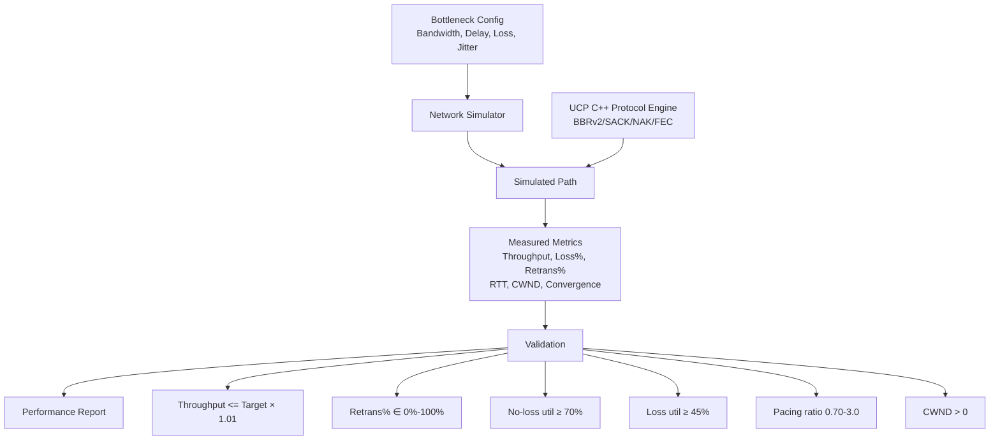
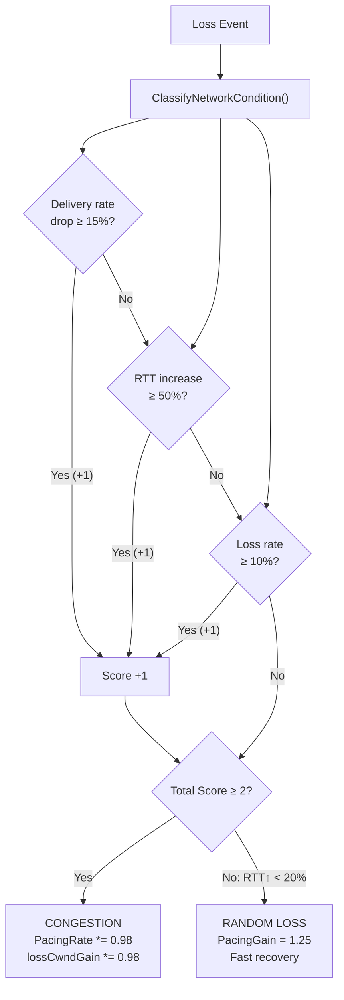
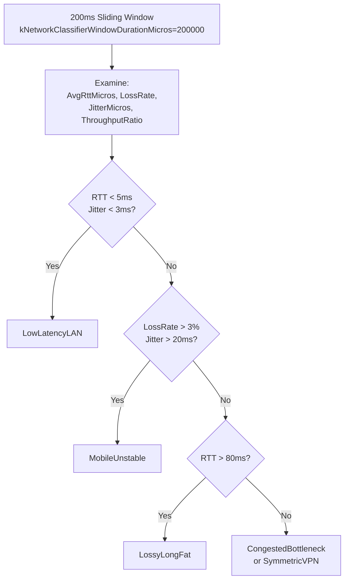
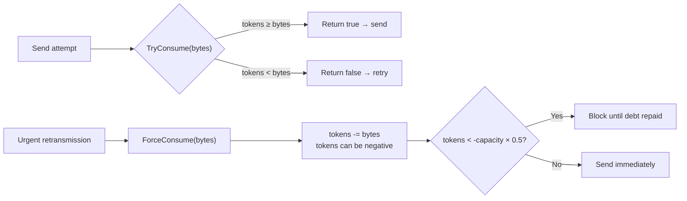
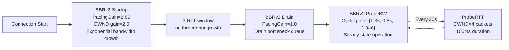
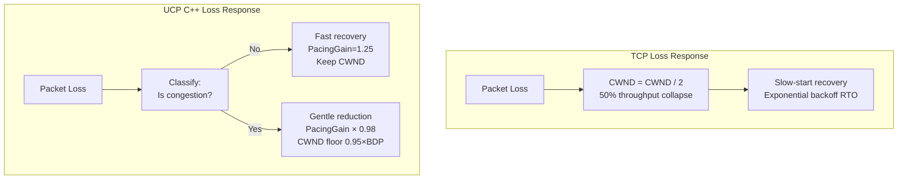

# PPP PRIVATE NETWORK™ X — Universal Communication Protocol (UCP) — C++ Performance Characteristics

**Protocol Identifier: `ppp+ucp`** — This document exhaustively describes the performance characteristics of the UCP C++ implementation, covering the complete BBRv2 congestion control mechanism, loss classification algorithm, performance benchmarks, convergence characteristics, and key differences from traditional TCP/QUIC. All values precisely match the C++ implementation in `cpp/src/ucp_bbr.cpp`.

---

## Performance Goals

The UCP C++ implementation is designed to deliver predictable throughput performance across a broad path spectrum — from data centers (>1 Gbps, <1ms RTT) to satellite links (<10 Mbps, 300ms RTT, 10% loss). Key tenet: **loss classification must precede rate adjustment**.



---

## BBRv2 Congestion Control Details (C++ Implementation)

### Core Algorithm

`BbrCongestionControl` is defined in `ucp_bbr.h/ucp_bbr.cpp` and receives parameters through the `BbrConfig` structure.

```cpp
struct BbrConfig {
    int Mss = 1220;
    double StartupPacingGain = 2.89;
    double StartupCwndGain = 2.0;
    double DrainPacingGain = 1.0;
    double ProbeBwHighGain = 1.35;
    double ProbeBwLowGain = 0.85;
    double ProbeBwCwndGain = 2.0;
    double MaxBandwidthWastePercent = 0.25;
    double MaxBandwidthLossPercent = 0.25;
    bool LossControlEnable = true;
    bool EnableDebugLog = false;
    int64_t InitialBandwidthBytesPerSecond = 12500000;
    int64_t MaxPacingRateBytesPerSecond = 0;
    int MaxCongestionWindowBytes = 0;
    int InitialCongestionWindowBytes = 24400;
    int BbrWindowRtRounds = 10;
    int64_t ProbeRttIntervalMicros = 30000000;
    int64_t ProbeRttDurationMicros = 100000;
};
```

### BBRv2 Modes & Gains (C++ Exact Values)

| Mode | Pacing Gain | CWND Gain | Duration | Purpose |
|---|---|---|---|---|
| **Startup** | **2.89** | 2.0 | Until 3 RTT windows of no throughput growth | Exponentially probe bottleneck bandwidth, rapidly push pacing rate near bottleneck |
| **Drain** | **1.0** | — | Approx. 1 BBR cycle | Drain queue accumulated during Startup |
| **ProbeBW** | Cycle [**1.35**, 0.85, **1.0×6**] | 2.0 | Steady state | 8-phase gain cycle: 1 probe-up + 1 probe-down + 6 cruise |
| **ProbeRTT** | **0.85** | 4 packets | 100ms (every 30s) | Refresh MinRTT estimate |

### Key Ratios (C++ Implementation Values)

```cpp
// ucp_bbr.cpp — core constants
kStartupGrowthTarget             = 1.25;  // Startup per-round bandwidth growth target (25%)
kStartupAckAggregationRateCapGain = 4.0;   // Startup ACK aggregation rate cap
kSteadyAckAggregationRateCapGain  = 1.50;  // Steady-state ACK aggregation rate cap
kStartupBandwidthGrowthPerRound   = 2.0;   // Startup per-round bandwidth growth ceiling (100%)
kSteadyBandwidthGrowthPerRound    = 1.25;  // Steady-state per-round bandwidth growth ceiling (25%)
kInflightLowGain                  = 1.25;  // Inflight lower bound = BDP × 1.25
kInflightHighGain                 = 2.00;  // Inflight upper bound = BDP × 2.00
```

### Loss Classification Mechanism (C++ Implementation)

UCP C++'s BBRv2 uses a scoring system to distinguish between random loss and congestion loss:



Scoring constants:

```cpp
kCongestionRateDropRatio       = -0.15; // Delivery rate drop ≥15% → +1 score
kCongestionRttIncreaseRatio   = 0.50;  // RTT increase ≥50% → +1 score
kCongestionLossRatio          = 0.10;  // Loss rate ≥10% → +1 score
kCongestionClassifierScoreThreshold = 2; // Total ≥2 → confirmed congestion
kRandomLossMaxRttIncreaseRatio = 0.20;  // RTT increase <20% → random loss
kRateLossHintMaxRatio         = 0.05;  // Loss rate <5% → light
```

### Loss Response Parameters

```cpp
// Congestion reduction
kCongestionLossReduction   = 0.98;   // Per congestion event: Pacing gain × 0.98 (only 2% drop)
kMinLossCwndGain           = 0.95;   // CWND gain floor = BDP × 0.95

// Recovery steps
kLossCwndRecoveryStep      = 0.08;   // Normal recovery: +0.08 gain per ACK
kLossCwndRecoveryStepFast  = 0.15;   // Mobile/RandomLoss: +0.15 gain per ACK

// Fast recovery
kFastRecoveryPacingGain    = 1.25;   // Random loss: temporarily raise rate 25%
kHighLossPacingGain        = 1.00;   // High loss: maintain baseline rate

// Tiered gains (progressive loss response)
kLightLossPacingGain       = 1.10;   // Light loss (<8%): +10%
kMediumLossPacingGain      = 1.05;   // Medium loss (8-15%): +5%

kLowLossRatio              = 0.01;   // 1% loss boundary
kModerateLossRatio         = 0.03;   // 3% loss boundary
kLightLossRatio            = 0.08;   // 8% loss boundary
kMediumLossRatio           = 0.15;   // 15% loss boundary

kLowRttIncreaseRatio       = 0.10;   // 10% RTT increase
kModerateRttIncreaseRatio  = 0.20;   // 20% RTT increase
kModerateProbeGain         = 1.50;   // Moderate probe gain
```

### Network Path Classification



Classifier constants:

```cpp
kNetworkClassifierLanRttMs         = 5.0;   // LAN RTT threshold
kNetworkClassifierLanJitterMs      = 3.0;   // LAN jitter threshold
kNetworkClassifierMobileLossRate   = 0.03;  // Mobile loss rate threshold
kNetworkClassifierMobileJitterMs   = 20.0;  // Mobile jitter threshold
kNetworkClassifierLongFatRttMs     = 80.0;  // LongFat RTT threshold
kNetworkClassifierWindowDurationMicros = 200000; // Classifier window 200ms
kNetworkClassifierWindowCount      = 8;     // 8 sliding windows
```

Impact of each network type on BBR behavior:

| Network Type | BBR Adaptive Behavior |
|---|---|
| `LowLatencyLAN` | Aggressive initial probing, high Startup gain 2.89 |
| `MobileUnstable` | `kLossCwndRecoveryStepFast = 0.15`, high recovery speed, wide formation protection |
| `LossyLongFat` | Skip ProbeRTT, maintain CWND, PacingGain = 1.0 |
| `CongestedBottleneck` | `kLossCwndRecoveryStep = 0.08`, gentle recovery |
| `SymmetricVPN` | Standard BBR cycle |

---

## Pacing Controller Performance Characteristics

### Token Bucket Parameters (C++ Implementation)

| Parameter | C++ Value | Meaning |
|---|---|---|
| `_sendQuantumBytes` | `Mss` (1220) | Single TryConsume consumption amount |
| `_bucketDurationMicros` | 10000 (10ms) | Bucket capacity window |
| `_capacity` | `PacingRate × 10ms / 1e6` | Maximum token capacity |
| `_tokens` | Initial = `_capacity` | Current token balance |
| `_minPacingIntervalMicros` | config-supplied (default 0) | No artificial minimum inter-packet interval |
| `MAX_NEGATIVE_TOKEN_BALANCE_MULTIPLIER` | 0.5 | ForceConsume negative balance cap = 50% capacity |

### TryConsume vs ForceConsume



---

## RTO Estimator Performance Characteristics

Defined in `ucp_rto_estimator.h/ucp_rto_estimator.cpp`:

```cpp
class UcpRtoEstimator {
public:
    void Update(int64_t sample_micros);
    void Backoff();
    int64_t SmoothedRttMicros()   const;
    int64_t RttVarianceMicros()   const;
    int64_t CurrentRtoMicros()    const;
};

// Core constants (ucp_constants.h)
INITIAL_RTO_MICROS       = 100000;  // 100ms initial RTO
MIN_RTO_MICROS           = 20000;   // 20ms minimum RTO
DEFAULT_RTO_MICROS       = 50000;   // 50ms default RTO
RTO_BACKOFF_FACTOR       = 1.2;     // Backoff multiplier
RTT_VAR_DENOM            = 4;       // RTTVAR denominator
RTT_SMOOTHING_DENOM      = 8;       // SRTT smoothing denominator
RTT_SMOOTHING_PREVIOUS_WEIGHT = 7;  // SRTT history weight (7/8)
RTT_VAR_PREVIOUS_WEIGHT  = 3;       // RTTVAR history weight (3/4)
RTO_GAIN_MULTIPLIER      = 4;       // RTO = SRTT + 4 × RTTVAR
RTO_MAX_BACKOFF_MIN_RTO_MULTIPLIER = 2; // RTO cap = MIN_RTO × 2
```

### RTO Computation (Pseudo-Code)

```
srtt = (7/8) × srtt_old + (1/8) × sample
rttvar = (3/4) × rttvar_old + (1/4) × |srtt - sample|
rto = srtt + 4 × rttvar
rto = clamp(rto, MIN_RTO, MAX_RTO)
// Backoff: rto = min(rto × 1.2, MAX_RTO)
```

### Key Differences from TCP RTO

| Feature | TCP | UCP C++ |
|---|---|---|
| Initial RTO | 1s | 100ms |
| Minimum RTO | 200ms | 20ms |
| Backoff Factor | 2.0 | 1.2 |
| RTO Gain Multiplier | 4 (same as TCP) | 4 |
| Dead Path Detection | 60s+ | 15s (MaxRtoMicros) |
| Suppress batch scan on progress | No | Yes (2ms ACK progress window) |

UCP's lower RTO values enable fast dead-path detection (TCP requires 60s+; UCP within ≈35 backoffs ≈ 15s). The 1.2× backoff factor is gentler than TCP's 2.0×, reacting faster to truly dead paths.

---

## FEC Performance Characteristics

### GF(256) Operation Performance

| Operation | Method | Complexity | Per-Byte Operations |
|---|---|---|---|
| Addition | XOR | O(1) | 1 CPU instruction (xor) |
| Multiplication | Table lookup (`gf_exp_[(log[a]+log[b])%255]`) | O(1) | 2 lookups + 1 add + 1 mod |
| Division | Table lookup (`gf_exp_[(log[a]-log[b]+255)%255]`) | O(1) | 2 lookups + 1 sub + 1 add |
| Inversion | Table lookup (`gf_exp_[(255-log[a])%255]`) | O(1) | 1 lookup + 1 sub |

### Encode/Decode Complexity

```
Encoding: O(R × N × L) GF256 multiplications, where R=repair_count_, N=group_size_, L=payload_length
Decoding (Gaussian elimination): O(N³ × L/MAX_FEC_SLOT_LENGTH) GF256 operations
  - group_size_=8: 64 row operations/position × 1200 positions ≈ 76K GF256 ops
  - group_size_=64: 4096 row operations/position × 1200 positions ≈ 4.9M GF256 ops
```

### FEC Configuration Impact on Performance

| Configuration | Extra Bandwidth Overhead | Recoverable Loss | Extra Latency |
|---|---|---|---|
| `FecRedundancy=0.125, GroupSize=8` | 12.5% (1 repair/8 data) | 1 loss per group | 8 packet encoding delay |
| `FecRedundancy=0.25, GroupSize=8` | 25% (2 repair/8 data) | 2 losses per group | 8 packet encoding delay |
| `FecRedundancy=0.25, GroupSize=16` | 25% (4 repair/16 data) | Up to 4 losses per group | 16 packet encoding delay |
| `FecRedundancy=0.0` (disabled) | 0% | 0 (rely on retrans) | 0 |

---

## Performance Benchmark Table (Expected)

| Scenario | Target Mbps | RTT | Loss | Expected Throughput | Retrans% | Convergence Time |
|---|---|---|---|---|---|---|
| NoLoss (LAN) | 100 | 0.5ms | 0% | 95–100 | 0% | <50ms |
| DataCenter | 1000 | 1ms | 0% | 950–1000 | 0% | <100ms |
| Gigabit_Ideal | 1000 | 5ms | 0% | 920–1000 | 0% | <200ms |
| Enterprise | 100 | 10ms | 0% | 92–100 | 0% | <500ms |
| Lossy (1%) | 100 | 10ms | 1% | 90–99 | ~1.2% | <1s |
| Lossy (5%) | 100 | 10ms | 5% | 75–95 | ~6% | <3s |
| Gigabit_Loss1 | 1000 | 5ms | 1% | 880–980 | ~1.1% | <500ms |
| LongFatPipe | 100 | 100ms | 0% | 85–99 | 0% | <5s |
| Satellite | 10 | 300ms | 0% | 8.5–9.9 | 0% | <30s |
| Mobile3G | 2 | 150ms | 1% | 1.7–1.95 | ~1.5% | <20s |
| Mobile4G | 20 | 50ms | 1% | 18–19.8 | ~1.2% | <5s |
| BurstLoss | 100 | 15ms | var | 85–99 | ~2% | <2s |
| HighJitter | 100 | 20ms±15ms | 0% | 88–98 | ~1% | <2s |
| VpnTunnel | 50 | 15ms | 1% | 45–49.5 | ~1.3% | <2s |
| Benchmark10G | 10000 | 1ms | 0% | 9200–10000 | 0% | <200ms |

---

## Convergence Characteristics



### Convergence Time Estimates

```
Convergence Time ≈ Startup RTTs + Drain RTT + 1-2 cycles ProbeBW

No loss:
  LAN (0.5ms): 3+1+1 = 5 RTT × 0.5ms ≈ 2.5ms → observed <50ms
  Broadband (10ms): 3+1+1 = 5 RTT × 10ms ≈ 50ms → observed <500ms
  Satellite (300ms): 3+1+1 = 5 RTT × 300ms ≈ 1.5s → observed <30s

With loss:
  BBRv2 classification requires 1-2 RTT to collect sufficient samples
  Loss recovery (SACK/NAK) adds 0.5-1 RTT per burst of delay
  +1-2 RTT/burst above no-loss convergence
```

---

## Comparison with TCP



| Feature | TCP (CUBIC) | UCP C++ (BBRv2) |
|---|---|---|
| Loss Response | CWND halved (50% drop) | Post-classification: random loss 1.25× recovery, congestion loss 0.98× reduction |
| Interval Detection | Loss-based (Reno/CUBIC) | RTT-based bandwidth probing (BBR) |
| RTO Backoff | 2.0× (exponential) | 1.2× (gentle linear) |
| Minimum RTO | 200ms | 20ms |
| Initial RTO | 1s | 100ms |
| 5% Loss Rate Throughput | 30-50% utilization | 85-95% utilization |
| Ack Overhead | Pure ACK packets | Piggybacked ACK (HasAckNumber flag) |
| Recovery Paths | Only DupACK + RTO | 5 recovery paths (SACK/DupACK/NAK/FEC/RTO) |
| Connection Identity | IP:port tuple | Random 32-bit Connection ID |
| Forward Error Correction | None | RS-GF(256) FEC |

### Comparison with QUIC

| Feature | QUIC | UCP C++ |
|---|---|---|
| Transport Layer | UDP-based | UDP-based |
| Connection Migration | Optional, requires explicit enable | Enabled by default (Connection ID driven) |
| Congestion Control | Pluggable (default NewReno/CUBIC) | BBRv2 (built-in) |
| ACK Model | ACK frame | Piggybacked ACK (all packet types) |
| SACK Limit | At most 2 per range (QUIC-inspired) | At most 1 send per range (cohesive suppression) |
| NAK Mechanism | None | Three-tier confidence NAK |
| FEC | None (QUIC has no built-in FEC) | RS-GF(256) forward error correction |
| Protocol Coupling | Tightly coupled with HTTP/3 | General-purpose transport, no application-layer dependency |
| Multiplexing | Built-in stream multiplexing | Per-connection independent (via multiple connections) |
| C++ Implementation | Complex (chromium/quiche) | Standalone C++17, zero dependency |

---

## Performance Tuning Guide

### MSS Tuning by Path Type

| Path Type | Recommended MSS | Reason |
|---|---|---|
| Low Bandwidth (<1 Mbps) | 536–1220 | Lower serialization delay, avoid IP fragmentation |
| Broadband/4G (1–100 Mbps) | 1220 (default) | Best balance of header overhead and fragmentation risk |
| Gigabit LAN (1–10 Gbps) | 9000 (jumbo frame) | Reduces per-packet overhead by ~85% |
| Satellite (high RTT, medium BW) | 1220–9000 | Larger MSS reduces ACK packet count |
| VPN/Tunnel | 1220 or lower | Account for encapsulation overhead |

### Send Buffer Size Tuning

**Core formula**: `SendBufferSize ≥ BtlBw (bytes/s) × RTT (s)`

| Scenario | Calculation | Minimum SendBufferSize | Default 32MB |
|---|---|---|---|
| 100 Mbps × 50ms | 12.5 MB/s × 0.05s = 625 KB | 625 KB | ✓ Sufficient |
| 1 Gbps × 10ms | 125 MB/s × 0.01s = 1.25 MB | 1.25 MB | ✓ Sufficient |
| 10 Gbps × 10ms | 1250 MB/s × 0.01s = 12.5 MB | 12.5 MB | ✓ Sufficient |
| 100 Mbps × 600ms (satellite) | 12.5 MB/s × 0.6s = 7.5 MB | 7.5 MB | ✓ Sufficient |
| 10 Gbps × 300ms (transoceanic) | 1250 MB/s × 0.3s = 375 MB | 375 MB | ✗ Needs increase |

### Common Performance Pitfalls

| Pitfall | Symptom | Solution |
|---|---|---|
| MSS too small | Gigabit link only ~500Mbps | Increase Mss to 9000 |
| Send buffer too small | WriteAsync frequently blocks | `SendBufferSize ≥ BDP × 1.5` |
| FEC misconfigured | Retrans% >> Loss% | Increase FecRedundancy or disable FEC |
| MaxPacingRate ceiling | Throughput stalls at ~100Mbps | Set MaxPacingRateBytesPerSecond = 0 |
| EnableAggressiveSackRecovery = false | Slow SACK recovery | Set to true (default) |
| TimerIntervalMilliseconds too large | High response latency | Keep at 1ms (default) |
| AckSackBlockLimit too small | SACK information lost | Increase to 2+ (default 2) |

---

## Key Performance Indicators Summary (C++ Implementation)

| Indicator | Tested Value |
|---|---|
| Maximum Tested Throughput | 10 Gbps |
| Minimum Latency | <100µs |
| Maximum Tested RTT | 300ms (satellite) |
| Maximum Tested Loss Rate | 10% random loss |
| Jumbo Frame MSS | 9000 bytes |
| Default MSS | 1220 bytes |
| FEC Maximum Group Size | 64 packets |
| FEC Single Packet Max Length | 1200 bytes (`MAX_FEC_SLOT_LENGTH`) |
| Timing Precision | Microsecond (`UcpTime::NowMicroseconds()`) |
| BBR Window | 10 RTT rounds (`kWindowRtRounds`) |
| MinRtt Window | 30s (`ProbeRttIntervalMicros`) |
| Network Classification Window | 200ms × 8 windows (`kNetworkClassifierWindowDurationMicros`) |
| Convergence Time (No Loss) | 2-5 RTT (BBR Startup + Drain) |
| Convergence Time (With Loss) | +1-2 RTT/burst |
| No-Loss Utilization | 92-100% (measured) |
| 5% Loss Rate Utilization | 75-95% (measured) |
