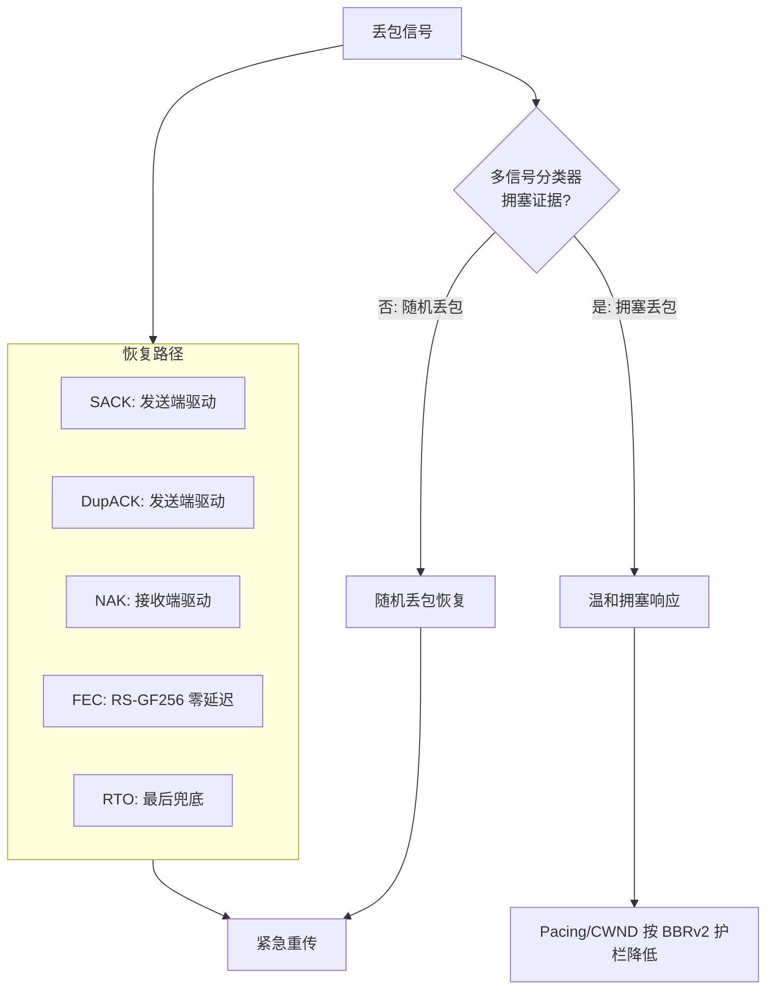
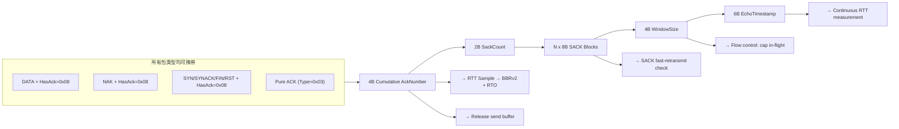
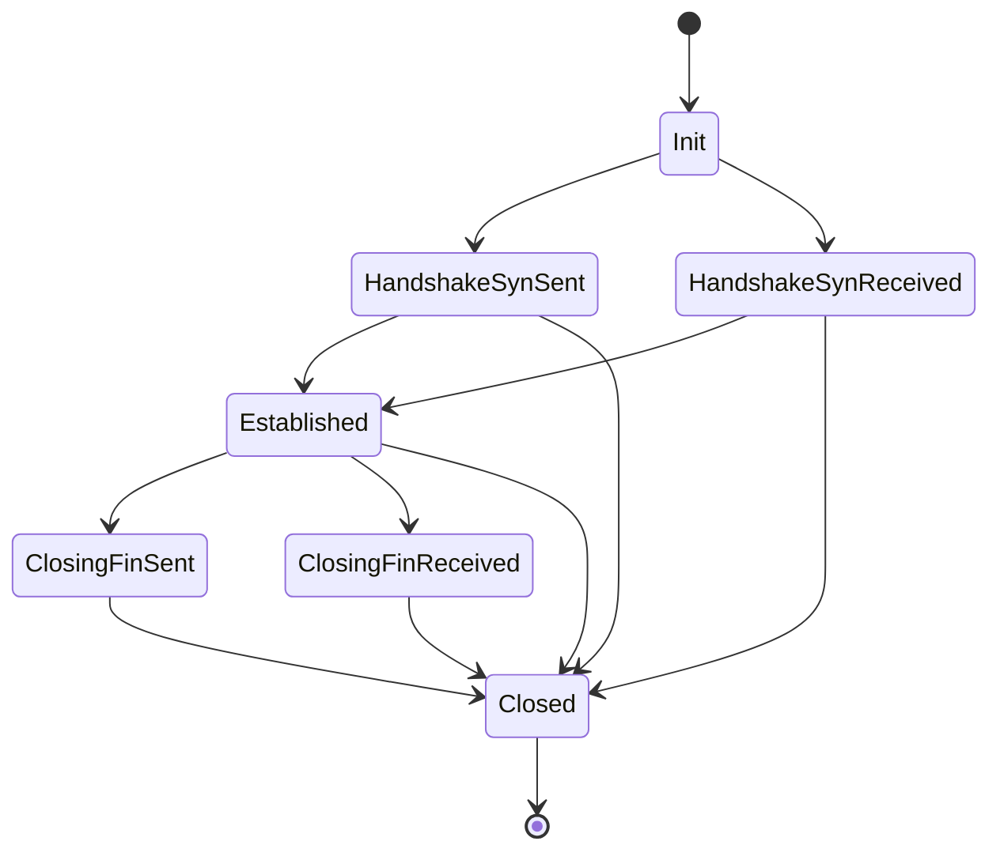
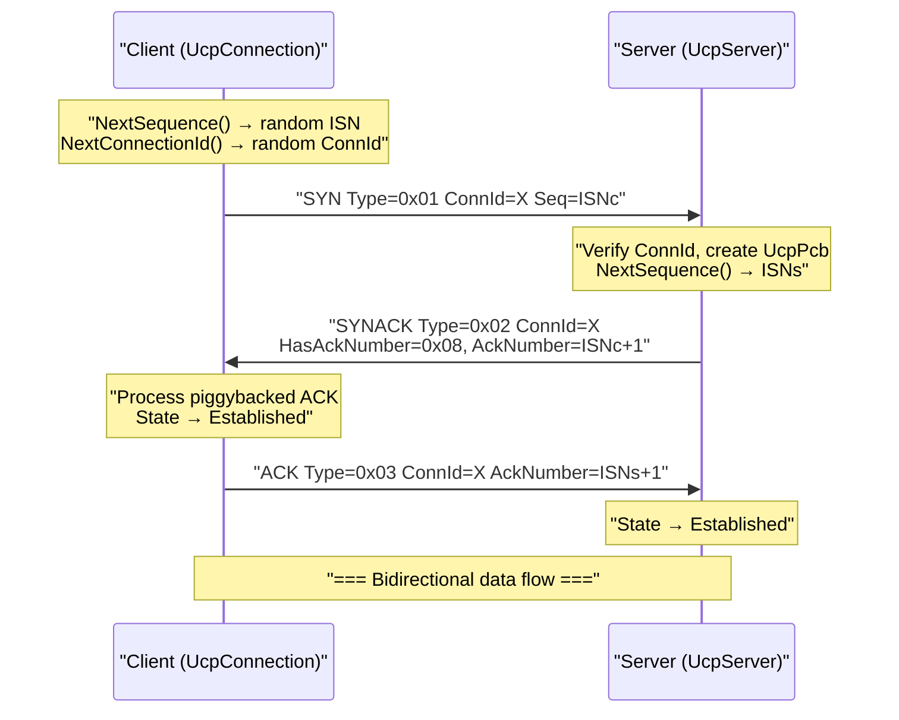
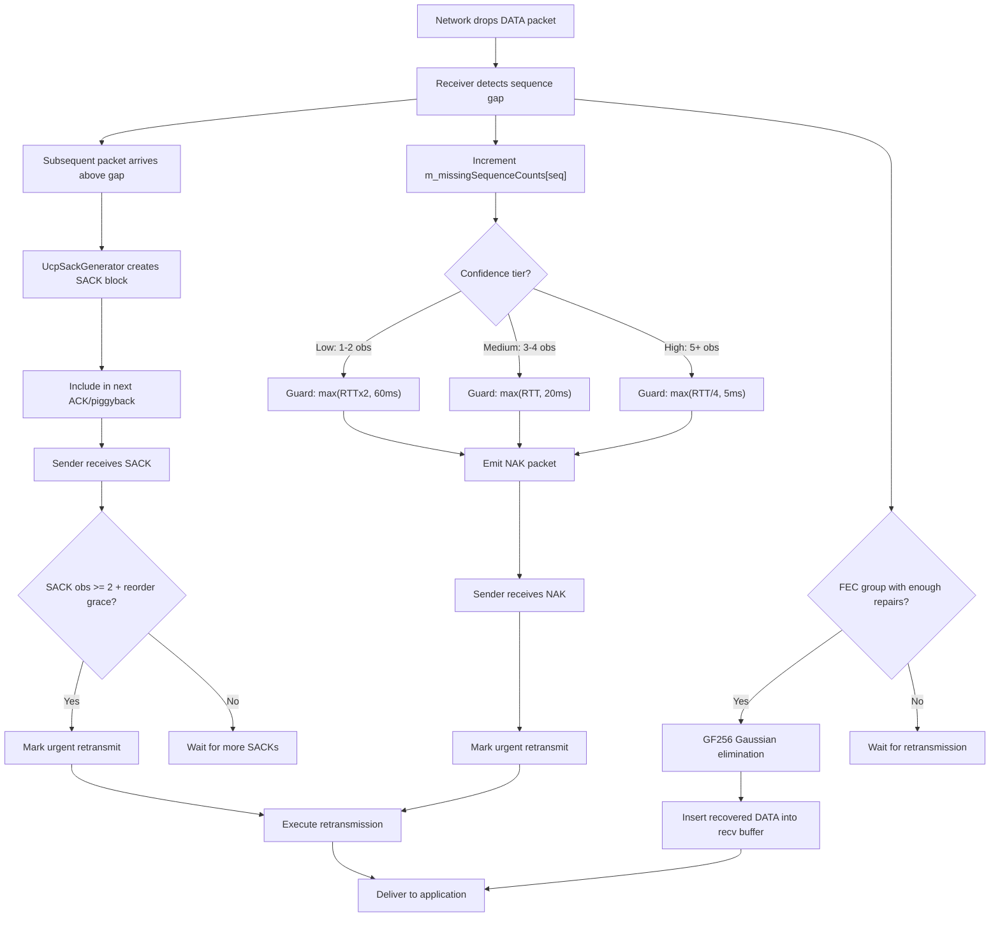
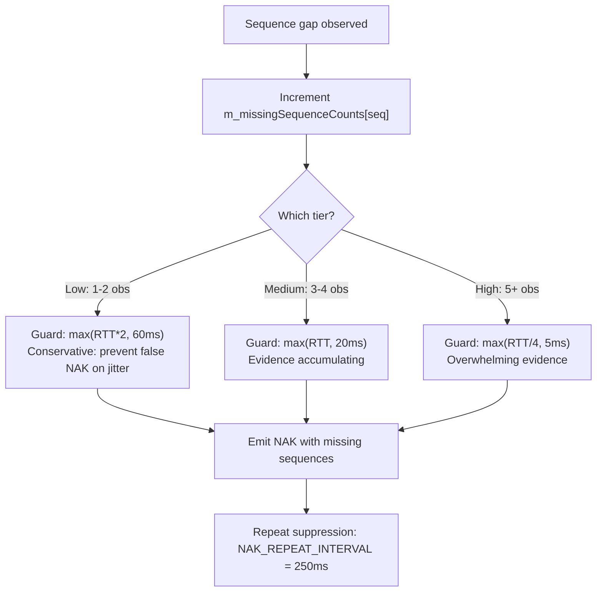
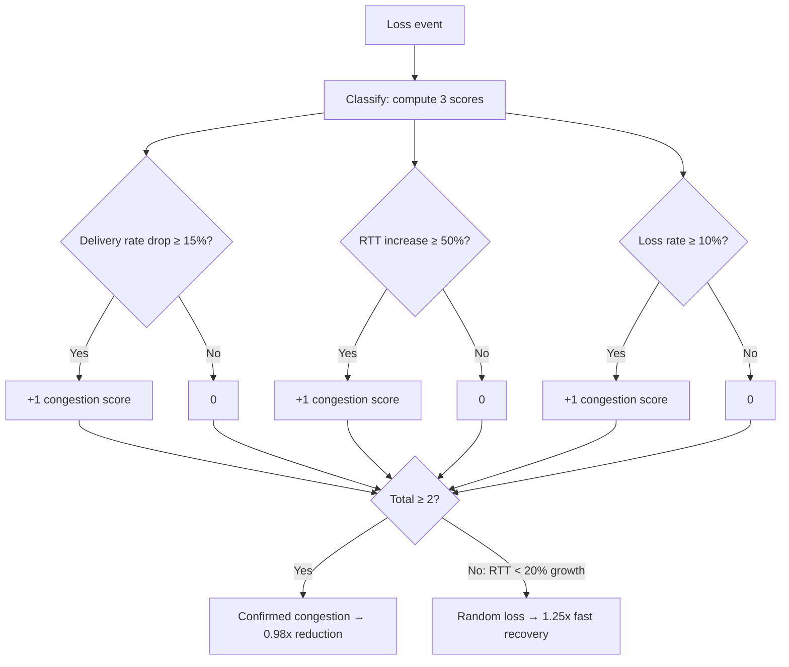

# PPP PRIVATE NETWORK™ X — 通用通信协议 (UCP) — C++ 协议规范

**协议标识: `ppp+ucp`** — 本文档是 UCP 线格式、可靠性机制、丢包恢复策略、拥塞控制算法、前向纠错设计的 C++ 实现权威规范。所有多字节整数字段使用网络字节序（大端序）。本文档内容与 `cpp/include/ucp/` 和 `cpp/src/` 中 C++ 实现精确匹配。

---

## 设计原则

UCP 基于三个核心设计原则：

1. **随机丢包是恢复信号，而非拥塞信号。** UCP 在检测到缺失数据时触发重传，但仅有当 RTT 膨胀、投递率下降和聚集丢包共同验证瓶颈拥塞后才降低 pacing 速率。

2. **每个包都携带可靠性信息。** UCP 通过 `HasAckNumber`（`Flags & 0x08`）标志在 DATA、NAK 和所有控制包中捎带累积 ACK 号，最小化纯 ACK 包开销。

3. **恢复按置信度分级，从不竞速。** UCP 使用多条独立恢复路径（SACK、DupACK、NAK、FEC、RTO），对于同一缺口仅触发最合适路径。



---

## 包格式

### 公共头（12 字节 — 所有包类型强制）

所有 UCP 包共享一个 12 字节公共头：

| 偏移 | 字段 | 大小 | 说明 |
|---|---|---|---|
| 0 | `Type` | 1 字节 | 包类型标识，见 `UcpPacketType` 枚举 |
| 1 | `Flags` | 1 字节 | 位标志，见 `UcpPacketFlags` 枚举 |
| 2 | `ConnId` | 4 字节 | 随机 32 位连接标识 |
| 6 | `Timestamp` | 6 字节 | 发送方本地微秒时间戳（48 位） |

C++ 结构体定义在 `ucp_packets.h`:

```cpp
struct UcpCommonHeader {
    UcpPacketType  type;
    UcpPacketFlags flags;
    uint32_t       connection_id;
    uint64_t       timestamp;  // 48-bit on wire, stored as 64-bit
};
```

### 包类型枚举 (`UcpPacketType`, ucp_enums.h)

| 类型码 | 名称 | 负载含义 |
|---|---|---|
| `0x01` | `Syn` | 连接发起，携带客户端随机 ISN 和随机 ConnId |
| `0x02` | `SynAck` | 连接接受，回显 ConnId，提供服务端随机 ISN |
| `0x03` | `Ack` | 纯确认包，携带累积 ACK、SACK 块、接收窗口和时间戳回显 |
| `0x04` | `Nak` | 否定确认，报告接收端检测到的缺失序号 |
| `0x05` | `Data` | 应用负载数据，携带序号、分片信息和可选捎带 ACK |
| `0x06` | `Fin` | 优雅连接终止请求 |
| `0x07` | `Rst` | 硬连接重置 |
| `0x08` | `FecRepair` | 前向纠错修复包，携带组标识、修复索引和 GF(256) RS 修复数据 |

### Flags 位布局 (`UcpPacketFlags`, ucp_enums.h)

| 位 | 掩码 | 名称 | 说明 |
|---|---|---|---|
| 0 | `0x01` | **NeedAck** | 请求对端立即发送确认，加速特定包确认 |
| 1 | `0x02` | **Retransmit** | 指示此包为重传（非首次发送），用于 Retrans% 统计 |
| 2 | `0x04` | **FinAck** | 确认对端的 FIN |
| 3 | `0x08` | **HasAckNumber** | 若置位，AckNumber 字段紧随公共头之后。UCP 捎带 ACK 模型核心 |
| 4–5 | `0x30` | **PriorityMask** | 2 位优先级字段，编码 `UcpPriority` (Background=0, Normal=1, Interactive=2, Urgent=3) |

```cpp
enum UcpPacketFlags : uint8_t {
    None          = 0x00,
    NeedAck       = 0x01,
    Retransmit    = 0x02,
    FinAck        = 0x04,
    HasAckNumber  = 0x08,
    PriorityMask  = 0x30,
};
```

---

## HasAckNumber — 捎带累积 ACK 模型

`HasAckNumber` 标志（`0x08`）是 UCP 确认效率的基石。当该位置位时，包公共头后紧接 ACK 相关字段：



---

## 详细包布局

### DATA 包布局

C++ 定义 (`ucp_packets.h`):

```cpp
class UcpDataPacket final : public UcpPacket {
public:
    uint32_t              sequence_number = 0;
    uint16_t              fragment_total  = 0;
    uint16_t              fragment_index  = 0;
    std::vector<uint8_t>  payload;
    uint32_t              ack_number     = 0;
    std::vector<SackBlock> sack_blocks;
    uint32_t              window_size     = 0;
    uint64_t              echo_timestamp  = 0;
};
```

| 偏移 | 字段 | 大小 | 说明 |
|---|---|---|---|
| 0 | CommonHeader | 12B | Type=0x05, Flags（可含 HasAckNumber/Retransmit/NeedAck）, ConnId, Timestamp |
| 12 | `[AckNumber]` | 4B | 可选：当 `Flags & 0x08` 置位时出现 |
| 可变 | `SeqNum` | 4B | 数据序号 |
| 可变 | `FragTotal` | 2B | 总分片数（1 = 未分片） |
| 可变 | `FragIndex` | 2B | 分片索引（0 起始） |
| 可变 | `Payload` | ≤ MSS−20 字节 | 应用数据 |

### ACK 包布局

```cpp
class UcpAckPacket final : public UcpPacket {
public:
    uint32_t              ack_number = 0;
    std::vector<SackBlock> sack_blocks;
    uint32_t              window_size    = 0;
    uint64_t              echo_timestamp = 0;
};
```

| 偏移 | 字段 | 大小 | 说明 |
|---|---|---|---|
| 0 | CommonHeader | 12B | Type=0x03, ConnId, Timestamp |
| 12 | `AckNumber` | 4B | 累积 ACK：此序号之前的所有字节已连续收到 |
| 16 | `SackCount` | 2B | 后续 SACK 块数量 |
| 18 | `SackBlocks[]` | N×8B | 每个 SACK 块为 `(StartSequence, EndSequence)` |
| 可变 | `WindowSize` | 4B | 接收窗口通告（字节） |
| 可变 | `EchoTimestamp` | 6B | 时间戳回显 |

### NAK 包布局

```cpp
class UcpNakPacket final : public UcpPacket {
public:
    uint32_t              ack_number = 0;
    std::vector<uint32_t> missing_sequences;
};
```

| 偏移 | 字段 | 大小 | 说明 |
|---|---|---|---|
| 0 | CommonHeader | 12B | Type=0x04, Flags, ConnId, Timestamp |
| 12 | `[AckNumber]` | 4B | 可选：HasAckNumber 置位时出现 |
| 可变 | `MissingCount` | 2B | 缺失序号条目数 |
| 可变 | `MissingSeqs[]` | N×4B | 缺失序号，单调递增排列 |

### FecRepair 包布局

```cpp
class UcpFecRepairPacket final : public UcpPacket {
public:
    uint32_t              group_id    = 0;  // FEC group base sequence
    uint8_t               group_index = 0;  // repair index within group
    std::vector<uint8_t>  payload;
};
```

| 偏移 | 字段 | 大小 | 说明 |
|---|---|---|---|
| 0 | CommonHeader | 12B | Type=0x08, Flags, ConnId, Timestamp |
| 12 | `[AckNumber]` | 4B | 可选 |
| 可变 | `GroupId` | 4B | FEC 组标识（组内首个 DATA 包序号） |
| 可变 | `GroupIndex` | 1B | 组内修复包索引（0 起始） |
| 可变 | `Payload` | 变长 | GF(256) RS 修复数据 |

### ControlPacket (SYN/SYNACK/FIN/RST)

```cpp
class UcpControlPacket final : public UcpPacket {
public:
    bool     has_sequence_number = false;
    uint32_t sequence_number     = 0;
    uint32_t ack_number          = 0;
};
```

控制包用于握手（SYN/SYNACK）和关闭（FIN/RST），携带可选的 `sequence_number` 和 `ack_number`。

---

## 大端序编码 (UcpPacketCodec)

C++ 实现 `ucp_packet_codec.cpp` 中的大端序编码：

```cpp
// Read 32-bit big-endian
uint32_t UcpPacketCodec::ReadUInt32(const uint8_t* buffer, size_t offset) {
    return (static_cast<uint32_t>(buffer[offset])     << 24)
         | (static_cast<uint32_t>(buffer[offset + 1]) << 16)
         | (static_cast<uint32_t>(buffer[offset + 2]) << 8)
         |  buffer[offset + 3];
}

// Write 32-bit big-endian
void UcpPacketCodec::WriteUInt32(uint32_t value, uint8_t* buffer, size_t offset) {
    buffer[offset]     = static_cast<uint8_t>(value >> 24);
    buffer[offset + 1] = static_cast<uint8_t>(value >> 16);
    buffer[offset + 2] = static_cast<uint8_t>(value >> 8);
    buffer[offset + 3] = static_cast<uint8_t>(value);
}
```

时间戳使用 48 位大端序（`ReadUInt48`/`WriteUInt48`），掩码 `0x0000FFFFFFFFFFFF`。

`Encode()` 根据 dynamic_cast 分派到对应包类型的专用编码方法：`EncodeData`, `EncodeAck`, `EncodeNak`, `EncodeFecRepair`, `EncodeControl`。

`TryDecode()` 首先读取 12 字节公共头（`TryReadCommonHeader`），然后根据 `header.type` switch 分派到对应解码方法。

---

## 序号算术 (UcpSequenceComparer)

```cpp
// ucp_sequence_comer.h
static bool IsAfter(uint32_t left, uint32_t right) {
    if (left == right) return false;
    return (left - right) < Constants::HALF_SEQUENCE_SPACE; // 0x80000000U
}
```

使用 32 位序号配 2^31 比较窗口。`HALF_SEQUENCE_SPACE = 0x80000000U`。提供 `IsBefore`, `IsBeforeOrEqual`, `IsAfterOrEqual`, `Increment`, `IsInForwardRange`, `IsForwardDistanceAtMost` 等完整比较 API。

---

## 连接状态机



状态实现：

```cpp
enum class UcpConnectionState {
    Init,
    HandshakeSynSent,
    HandshakeSynReceived,
    Established,
    ClosingFinSent,
    ClosingFinReceived,
    Closed,
};
```

### 三次握手序列 (C++ 实现)



### 状态转换明细

| 转换 | 触发条件 | 出站动作 | 定时器 |
|---|---|---|---|
| Init → HandshakeSynSent | 客户端 `UcpPcb::ConnectAsync()` | 发送 SYN (UcpControlPacket, Type=Syn) | connectTimer |
| Init → HandshakeSynReceived | 服务端收到合法 SYN | 发送 SYNACK (UcpControlPacket, Type=SynAck, HasAckNumber=1) | connectTimer |
| → Established | 收到 SYNACK 的 ACK 或客户端 ACK 的 SYNACK 确认 | — | 停止 connectTimer |
| Established → ClosingFinSent | `UcpPcb::CloseAsync()` | 发送 FIN (UcpControlPacket, Type=Fin) | disconnectTimer |
| Established → ClosingFinReceived | 收到对端 FIN | 发送 FIN ACK (UcpControlPacket, Type=Ack, FinAck=0x04) | disconnectTimer |
| → Closed | FIN 交换完成 / RTO 超 MaxRetransmissions | 可选 RST | 全部停止 |

---

## 丢包检测与恢复流程

### 完整多路径恢复决策树



---

## NAK 三级置信度



| 置信层级 | 观测次数 | 乱序守卫公式 | 绝对最小值 | 设计意图 |
|---|---|---|---|---|
| **低 (Low)** | 1-2 次 | `max(RTT × 2, 60ms)` | 60ms | 保守守卫：防止高抖动路径误报 NAK |
| **中 (Medium)** | 3-4 次 | `max(RTT, 20ms)` | 20ms | 证据增多，缩短至约 1 RTT |
| **高 (High)** | 5+ 次 | `max(RTT/4, 5ms)` | 5ms | 压倒性证据，最小守卫，最快 NAK 发出 |

额外约束：同一序号 NAK 间隔 ≥ `NAK_REPEAT_INTERVAL_MICROS` (250ms)，单 NAK 包最多 256 缺失序号。

---

## BBRv2 拥塞控制 (C++ 实现)

### 状态转换

```
Startup → Drain → ProbeBW ↔ ProbeRTT
```

| 状态 | Pacing 增益 (C++) | CWND 增益 (C++) | 退出条件 |
|---|---|---|---|
| **Startup** | 2.89 | 2.0 | 连续 3 RTT 窗口吞吐不增长 |
| **Drain** | 1.0 | — | 在途 < BDP × target_cwnd_gain |
| **ProbeBW** | 循环 [1.35, 0.85, 1.0×6] | 2.0 | 每 30s 触发 ProbeRTT |
| **ProbeRTT** | 0.85 | 4 包 | 持续 100ms 后返回 ProbeBW |

### 核心估计量

| 估计量 | 计算方式 | 用途 |
|---|---|---|
| `BtlBw` | 最近 `BbrWindowRtRounds` (10) 个 RTT 窗口中最大投递率的 EWMA 平滑值 | Pacing 速率基准 |
| `MinRtt` | 最近 ProbeRttInterval (30s) 内的最小观测 RTT | BDP 分母 |
| `BDP` | `BtlBw × MinRtt` | 目标在途字节数 |
| `PacingRate` | `BtlBw × PacingGain × CongestionFactor` | Token Bucket 强制速率 |
| `CWND` | `BDP × EffectiveCwndGain` (下限 0.95×BDP) | 最大在途字节数 |

### C++ BBR 内部参数 (ucp_bbr.cpp)

```cpp
// 关键常量
kLossCwndRecoveryStep     = 0.08;  // CWND gain recovery per ACK
kLossCwndRecoveryStepFast = 0.15;  // Fast recovery for MobileUnstable/RandomLoss
kCongestionLossReduction  = 0.98;  // Each congestion event reduces gain by 2%
kMinLossCwndGain          = 0.95;  // CWND floor at 95% of BDP
kFastRecoveryPacingGain   = 1.25;  // Random loss recovery gain
kStartupGrowthTarget      = 1.25;  // Startup bandwidth growth target per round
kCongestionRateDropRatio  = -0.15; // Rate drop ≥15% → congestion score +1
kCongestionRttIncreaseRatio = 0.50; // RTT increase ≥50% → congestion score +1
kCongestionLossRatio      = 0.10;  // Loss ≥10% → congestion score +1
kCongestionClassifierScoreThreshold = 2; // Score ≥2 → confirmed congestion
kRandomLossMaxRttIncreaseRatio = 0.20; // RTT increase <20% → random loss
```

### 自适应 Pacing 增益

```cpp
AdaptivePacingGain = BaseGain × _lossCwndGain
// _lossCwndGain default = 1.0
// Congestion event: _lossCwndGain *= 0.98
// Recovery: _lossCwndGain += 0.08 per ACK (0.15 for MobileUnstable)
// Floor: _lossCwndGain ≥ 0.95
```

### 拥塞分类评分系统



---

## 前向纠错 — UcpFecCodec (C++ 实现)

### 数学基础

| 参数 | C++ 值 (ucp_fec_codec.cpp) |
|---|---|
| 不可约多项式 | `0x11d`（`x^8 + x^4 + x^3 + x^2 + 1`） |
| 本原元 α | `0x02` |
| 对数表 | `gf_log_[256]` — 256 项 |
| 反对数表 | `gf_exp_[512]` — 512 项 (支持模 255 溢出) |
| 乘法 | `gf_exp_[(gf_log_[a] + gf_log_[b]) % 255]` — O(1) |
| 除法 | `gf_exp_[(gf_log_[a] - gf_log_[b] + 255) % 255]` — O(1) |
| 最大 FEC slot 长度 | `MAX_FEC_SLOT_LENGTH = 1200` |

### 编码流程

1. `FeedDataPacket(seq, payload)` 或直接 `send_buffer_[send_index_++] = payload`
2. 当 `send_index_ == group_size_` 时，`TryEncodeRepairs()` 触发
3. 对每字节位置 j（0 到 max_len−1），对每个修复索引 i：`repair[i][j] = Σ_{k=0}^{N−1} (data[k][j] × α^{i×k})`，GF(256) 乘法
4. 返回 `vector<vector<uint8_t>>`，长度为 `repair_count_`

### 解码流程

1. `FeedDataPacket(seq, payload)` → 存入 `recv_groups_[group_base][slot]`
2. `TryRecoverFromRepair(repair, group_base, repair_index)` → 存入 `recv_repairs_[group_base][repair_index]`
3. 当 `recv_groups_[group_base]` 中已收 + `recv_repairs_[group_base]` 中修复包数 ≥ `group_size_` 时触发高斯消元
4. `TrySolve()` 构建 GF(256) Vandermonde 矩阵，高斯消元求解缺失 slot 的每字节
5. 返回 `vector<RecoveredPacket>`，每项含 `slot`, `sequence_number`, `payload`

### 高斯消元核心算法

```cpp
// TrySolve: GF(256) Gaussian elimination (简化为伪代码)
for (int col = 0; col < size; col++) {
    // 1. Find pivot row (non-zero element)
    // 2. Swap rows if needed
    // 3. Normalize pivot row: multiply row by GfInverse(pivot_value)
    // 4. Eliminate: for each other row, subtract scaled pivot row
    //    rhs[i][j] = rhs[i][j] - rhs[pivot][j] * matrix[i][pivot]
}
```

每组最多支持 `group_size_` (2–64, 默认 8) 个 DATA 包 + `repair_count_` 个修复包。

### FEC 组编码系数

```cpp
static uint8_t GetCoefficient(int repair_index, int slot) {
    return GfPower(0x02 /* α */, repair_index * slot);
}
```

Vandermonde 矩阵：`A[i][k] = α^{i×k}`，其中 i 为修复索引，k 为 slot 索引。

---

## 报告口径定义

| 指标 | C++ 数据来源 | 语义 |
|---|---|---|
| `BytesSent` | `UcpPcb::m_bytesSent` | 已发送 payload 字节总数 |
| `BytesReceived` | `UcpPcb::m_bytesReceived` | 已接收 payload 字节总数 |
| `DataPacketsSent` | `UcpPcb::m_sentDataPackets` | 已发送 DATA 包总数 |
| `RetransmittedPackets` | `UcpPcb::m_retransmittedPackets` | 重传 DATA 包计数 |
| `RetransmissionRatio()` | `RetransmittedPackets / DataPacketsSent` | 重传率 |
| `CongestionWindowBytes` | `BbrCongestionControl::CongestionWindowBytes()` | 当前 CWND |
| `PacingRateBytesPerSecond` | `BbrCongestionControl::PacingRateBytesPerSecond()` | 当前 Pacing 速率 |
| `EstimatedLossPercent` | `BbrCongestionControl::EstimatedLossPercent()` | BBR 估计丢包率 |
| `RemoteWindowBytes` | `UcpPcb::m_remoteWindowBytes` | 对端通告接收窗口 |
| `LastRttMicros` | `UcpPcb::m_lastRttMicros` | 最近一次 RTT 样本 |
| `RttSamplesMicros` | `UcpPcb::m_rttSamplesMicros` | RTT 样本历史 |
