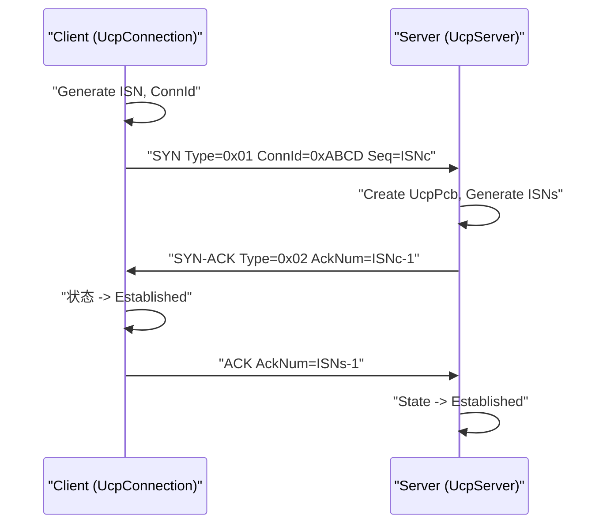

# UCP C++ 协议规范

[English](protocol_EN.md)

本文档是 UCP C++ 实现的线格式、包类型、标志位、连接状态机和丢包恢复的权威规范。所有多字节字段使用网络字节序（大端序）。UCP 是纯控制协议：CID 轮换切换、FEC 前向纠错和 SACK/NAK 恢复为 KCC 拥塞控制提供高保真投递率样本，实现精确的 BDP/RTT 估计。

## 实现原则

UCP 基于三个核心原则：

1. **随机丢包是恢复信号，不是拥塞信号** — 立即重传但不降速；恢复采用包守恒 cwnd 与 LT-BW EMA（无乘性 cwnd 削减）
2. **每个包都携带可靠性信息** — HasAckNumber 标志使 DATA、NAK 和控制包均可捎带累积 ACK
3. **恢复按置信度分级** — 五条独立恢复路径（SACK/NAK/FEC/DupACK/RTO），同一缺口仅触发最优路径

UCP 协议线格式采用严格的大端序编码，所有多字节字段均按网络字节序写入。12 字节公共头确保各包类型之间的互操作性，Type 字段标识 8 种包类型，Flags 字节提供 NeedAck、Retransmit、FinAck、HasAckNumber、MtuProbe、PathChallenge 和 2 位优先级字段。Connection ID 使用随机 32 位值而非 IP:Port 元组，支持客户端在 Wi-Fi 与蜂窝网络之间切换时维持同一会话，服务端通过哈希映射实现 O(1) 查找。连接迁移通过 PATH_CHALLENGE 机制验证双向可达性。

协议实现充分考虑了丢包恢复的多样性和实时性要求。五条恢复路径按延迟从低到高排列：FEC 前向纠错通过 Reed-Solomon 编码实现零 RTT 恢复，适用于对延迟最敏感的场景；SACK 选择性确认利用多次观测确认机制触发快速重传，延迟控制在亚 RTT 级别；NAK 否定确认按三级置信度分级，根据缺口观测次数和持续时间动态选择守卫时长；DupACK 机制与传统 TCP 类似，三次重复 ACK 触发快速重传；RTO 超时重传作为最后兜底，覆盖所有其他路径未能覆盖的丢包事件。

## 12 字节公共头

所有 UCP 包共享 12 字节公共头：

| 偏移 | 字段 | 大小 | 编码 |
|---|---|---|---|
| 0 | Type | 1 字节 | 直接字节 (0x01-0x08) |
| 1 | Flags | 1 字节 | 位标志 |
| 2-5 | Connection ID | 4 字节 | 大端序 uint32 |
| 6-11 | Timestamp | 6 字节 | 大端序 uint48 (微秒) |

```cpp
struct UcpCommonHeader {
    UcpPacketType  type;           // 1 byte
    UcpPacketFlags flags;          // 1 byte
    uint32_t       connection_id;  // 4 bytes big-endian
    int64_t        timestamp;      // 6 bytes uint48, stored as int64_t
};
```

### 大端序编解码

```cpp
uint32_t UcpPacketCodec::ReadUInt32(const uint8_t* buffer, size_t offset) {
    return (static_cast<uint32_t>(buffer[offset])     << 24)
         | (static_cast<uint32_t>(buffer[offset + 1]) << 16)
         | (static_cast<uint32_t>(buffer[offset + 2]) << 8)
         |  buffer[offset + 3];
}

void UcpPacketCodec::WriteUInt32(uint32_t value, uint8_t* buffer, size_t offset) {
    buffer[offset]     = static_cast<uint8_t>(value >> 24);
    buffer[offset + 1] = static_cast<uint8_t>(value >> 16);
    buffer[offset + 2] = static_cast<uint8_t>(value >> 8);
    buffer[offset + 3] = static_cast<uint8_t>(value);
}
```

## 8 种包类型

| 类型 | 值 | 固定开销 | 用途 |
|---|---|---|---|
| SYN | 0x01 | 12 + 可选 | 连接发起，携带初始序号 |
| SYN-ACK | 0x02 | 12 + 可选 | 连接确认，携带分配的 ConnId |
| ACK | 0x03 | 28 + SACK 块 | 累积确认与选 ACK 范围 |
| NAK | 0x04 | 18 + 缺失序号 | 否定确认，接收端请求重传 |
| DATA | 0x05 | 20-36 + 负载 | 应用数据，可选捎带 ACK |
| FIN | 0x06 | 12 + 可选 | 连接关闭 |
| RST | 0x07 | 12 | 连接复位，立即终止 |
| FEC_REPAIR | 0x08 | 17 + 修复数据 | RS-GF(256) 前向纠错修复包 |

## Flags 位布局

| 位 | 掩码 | 名称 | 含义 |
|---|---|---|---|
| 0 | 0x01 | NeedAck | 请求接收端立即回复 ACK |
| 1 | 0x02 | Retransmit | 标记为重传（跳过 RTT 采样） |
| 2 | 0x04 | FinAck | FIN 确认（用于关闭握手） |
| 3 | 0x08 | HasAckNumber | 携带捎带 ACK 字段 |
| 4-5 | 0x30 | PriorityMask | 2 位优先级（0=Background, 1=Normal, 2=Interactive, 3=Urgent） |
| 6 | 0x40 | MtuProbe | MTU 探测包（DPLPMTUD） |
| 7 | 0x80 | PathChallenge | 携带路径质询/响应负载 |

## 包结构定义

### DATA 包

```cpp
class UcpDataPacket final : public UcpPacket {
public:
    uint32_t              sequence_number;   // 4B
    uint16_t              fragment_total;    // 2B
    uint16_t              fragment_index;    // 2B
    ucp::vector<uint8_t>  payload;           // <= 1200B
    uint32_t              ack_number;        // 4B (HasAckNumber)
    ucp::vector<SackBlock> sack_blocks;      // N * 8B
    uint32_t              window_size;       // 4B
    int64_t               echo_timestamp;    // 6B
};
```

### ACK 包

```cpp
class UcpAckPacket final : public UcpPacket {
public:
    uint32_t              ack_number;
    ucp::vector<SackBlock> sack_blocks;
    uint32_t              window_size;
    int64_t               echo_timestamp;
};
```

### NAK 包

```cpp
class UcpNakPacket final : public UcpPacket {
public:
    uint32_t                ack_number;
    ucp::vector<uint32_t>   missing_sequences; // N * 4B
};
```

### FecRepair 包

```cpp
class UcpFecRepairPacket final : public UcpPacket {
public:
    uint32_t              group_id;      // 4B — FEC 组基序号
    uint8_t               group_index;   // 1B — 组内修复包索引
    ucp::vector<uint8_t>  payload;       // 变长
};
```

### Control 包

```cpp
class UcpControlPacket final : public UcpPacket {
public:
    bool     has_sequence_number = false;
    uint32_t sequence_number     = 0;
    uint32_t ack_number          = 0;
    uint64_t session_key         = 0;
};
```

## HasAckNumber 捎带 ACK 模型

当 HasAckNumber 标志置位时，公共头后依次写入：AckNumber(4B) + SackCount(2B) + SACK 块(N*8B) + WindowSize(4B) + EchoTimestamp(6B)。

| 字节偏移 | 字段 | 大小 | 说明 |
|---|---|---|---|
| +0 | AckNumber | 4 字节 | 累积确认序号 |
| +4 | SackCount | 2 字节 | SACK 块数量（上限 MAX_ACK_SACK_BLOCKS=149） |
| +6 | SackBlocks | N * 8 字节 | SACK 块列表 |
| +6+N*8 | WindowSize | 4 字节 | 接收窗口通告 |
| +10+N*8 | EchoTimestamp | 6 字节 | 时间戳回显 |

### 各包类型的 HasAckNumber 置位规则

| 包类型 | 规则 |
|---|---|
| SYN | 始终为 0（尚无数据可确认） |
| SYN-ACK | 始终为 1（捎带确认客户端 ISN） |
| ACK | 隐式携带 |
| NAK | 有累积确认进展时置位 |
| DATA | 双向数据流时几乎总携带 |
| FIN | 有未确认数据时置位 |
| RST | 通常为 0 |
| FecRepair | 有双向捎带机会时置位 |

## 流量控制

可发送上限为 min(cwnd, 对端宣告的接收窗口)；初始 cwnd 并非固定的 10 包上限。KCC 拥塞控制器从 BDP 估计推导 cwnd，但对端宣告的 `WindowSize` 才是在途字节的权威硬上限（标准 TCP/QUIC 流量控制）。

## 连接状态机

| 当前状态 | 事件 | 下一状态 | 出站包 |
|---|---|---|---|
| Init | ConnectAsync() | HandshakeSynSent | SYN |
| Init | 收到 SYN | HandshakeSynReceived | SYN-ACK |
| HandshakeSynSent | 收到 SYN-ACK | Established | ACK |
| HandshakeSynReceived | 收到 ACK | Established | - |
| Established | CloseAsync() | ClosingFinSent | FIN |
| Established | 收到 FIN | ClosingFinReceived | FIN-ACK |
| ClosingFinSent | 收到 FIN-ACK | Closed | - |
| ClosingFinReceived | FIN 已确认 | Closed | - |
| 任意 | 超时/RST | Closed | RST (可选) |

## 三次握手序列


```mermaid
sequenceDiagram
    participant C as "Client (UcpConnection)"
    participant S as "Server (UcpServer)"
    C->>C: "Generate ISN, ConnId"
    C->>S: "SYN Type=0x01 ConnId=0xABCD Seq=ISNc"
    S->>S: "Create UcpPcb, Generate ISNs"
    S->>C: "SYN-ACK Type=0x02 AckNum=ISNc-1"
    C->>C: "状态 -> Established"
    C->>S: "ACK AckNum=ISNs-1"
    S->>S: "State -> Established"
```

## 五路径丢包恢复

| 恢复路径 | 触发条件 | 恢复延迟 |
|---|---|---|
| FEC | 接收端有足够修复包 | 零 RTT |
| SACK | SACK 块观测 >= 2 次 | 亚 RTT |
| NAK | 接收端缺口计数达阈值 | RTT/4 至 RTT*2 |
| DupACK | 相同累积 ACK 收到 3 次 | 亚 RTT |
| RTO | RTO 窗口内无 ACK 进展 | 50ms-15s |

## NAK 三级置信度

缺口观测次数决定 NAK 发送的守卫时长。baseGrace = max(2000, min(RTT/2, MIN_RTO))：

| 级别 | 观测次数 | 守卫时长 | 意图 |
|---|---|---|---|
| 低 | 1-31 次 | baseGrace = max(2000, min(RTT/2, MIN_RTO)) | 防高抖动误报 |
| 中 | 32-127 次 | max(baseGrace/2, 1000) | 证据增多，缩短守卫 |
| 高 | 128+ 次 | max(baseGrace/2, 1000) | 最快 NAK 发出 |

NAK 重复抑制：按缺失序号标记（`m_nakIssued`），外加 `SendNak` 中的 RTT 窗口限速（每个平滑 RTT 一个 NAK 窗口；`NAK_REPEAT_INTERVAL_MICROS` 在 C# 中声明但未使用）。

## SACK 块编码

每个 SACK 块 8 字节：Start(4B) + End(4B)，按起始序号升序排列。每个 SACK 范围最多发送 2 次。

```cpp
struct SackBlock {
    uint32_t Start;  // 包含
    uint32_t End;    // 包含
};
```

## RST 处理

| 触发条件 | 说明 |
|---|---|
| 无效 ConnId | 收到 ConnId 无对应 PCB |
| 状态冲突 | Established 状态收到新 SYN |
| 重传耗尽 | 重传次数超 MaxRetransmissions |
| 应用层调用 | Dispose() 或析构 |

接收 RST 后的清理序列：标记已销毁/已取消，停止所有定时器，清空发送/接收缓冲，强制状态转换到 Closed，回调 OnDisconnected，将 PCB/连接交给后台延迟清理线程立即释放（绝不在 PCB 自身的 worker 线程上）。

## 相关文档

- [architecture_CN.md](architecture_CN.md) — 运行时层次结构
- [api_CN.md](api_CN.md) — API 参考
- [performance_CN.md](performance_CN.md) — UCP 和性能
- [constants_CN.md](constants_CN.md) — 协议常量
- [README_CN.md](../README_CN.md) — 项目介绍
- [Linux 内核模块](../../linux/README.md) — KCC Geodesic Congestion Control 内核模块（tcp_kcc.c v2.0，含 KCC Forwarding (KF) 跨连接带宽共享组件）

---

## 许可证与商标

MIT 许可证。完整文本见 [LICENSE](../../LICENSE)。

版权所有 (c) 2026 PPP PRIVATE NETWORK™ X

PPP PRIVATE NETWORK™ 是 PPP PRIVATE NETWORK 的商标。
