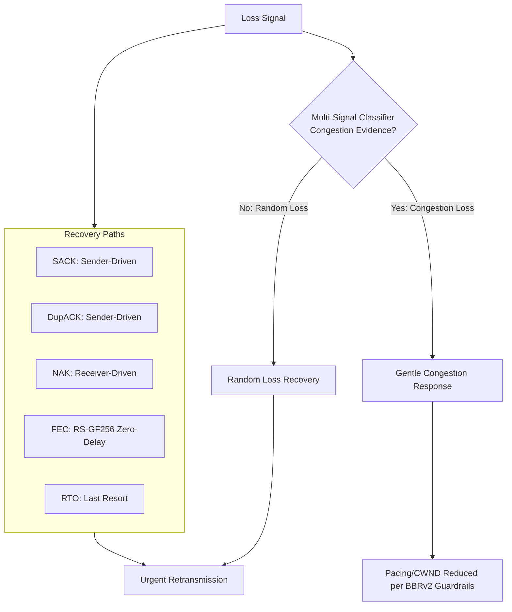
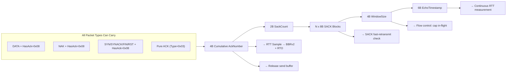
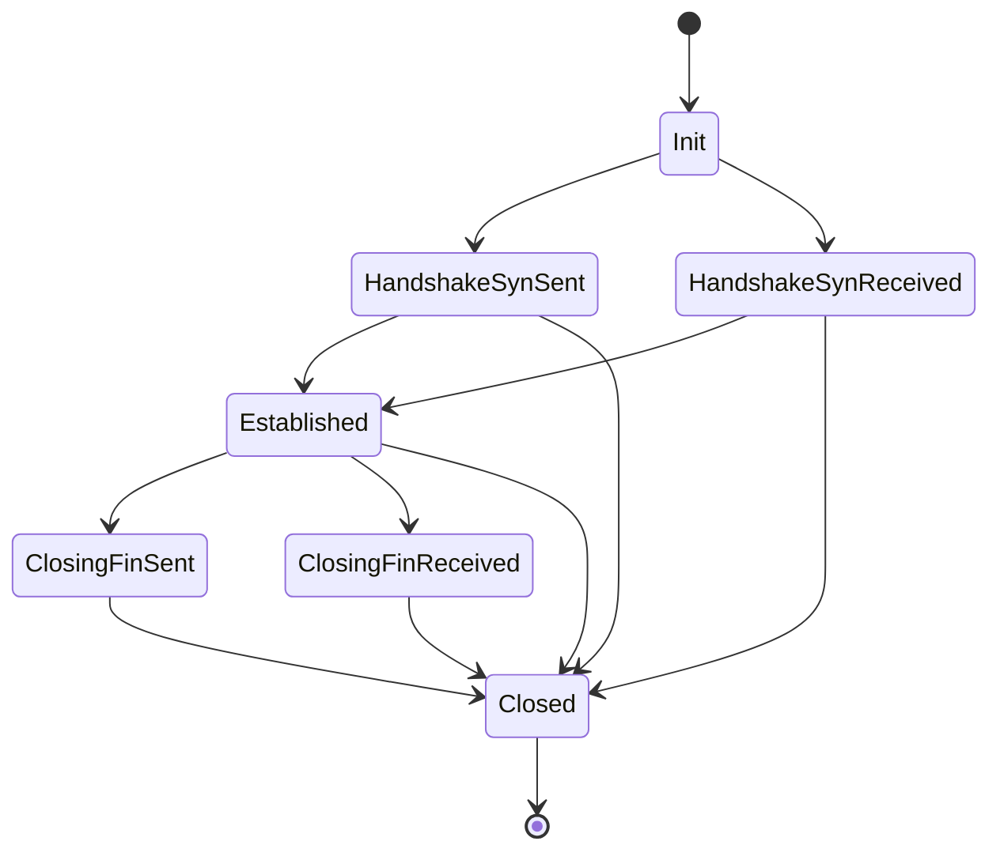
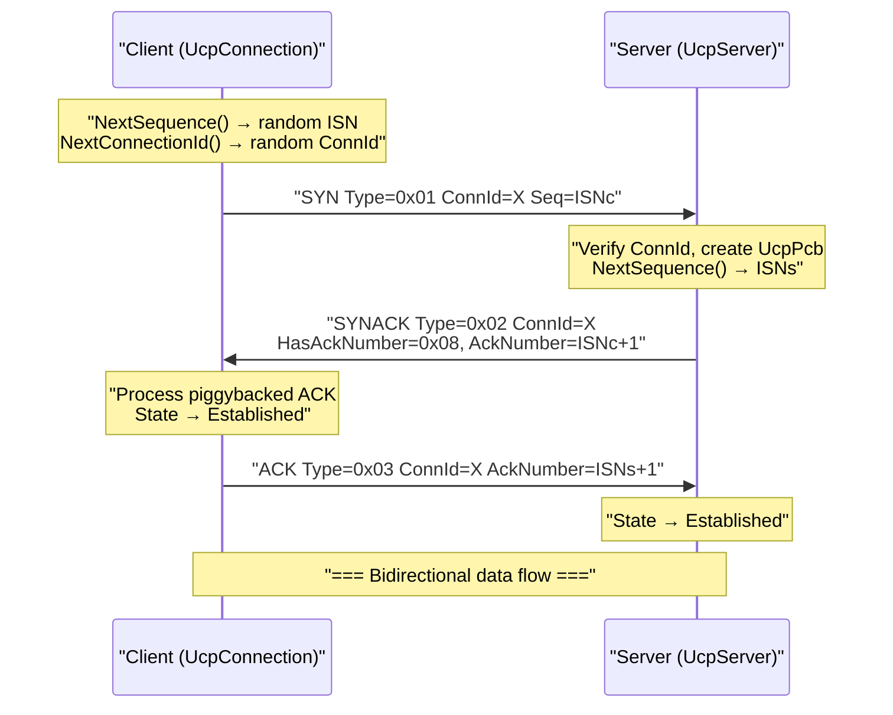
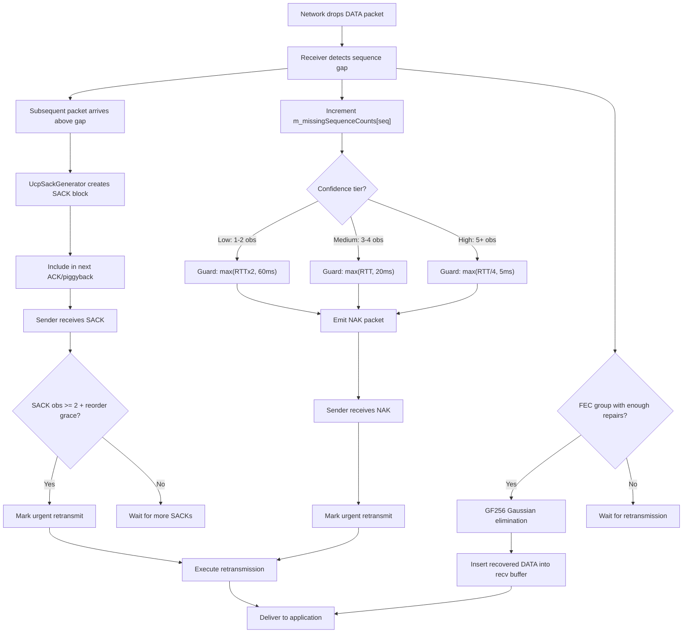
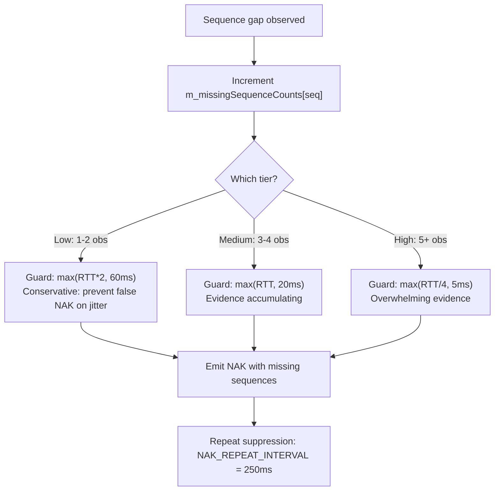
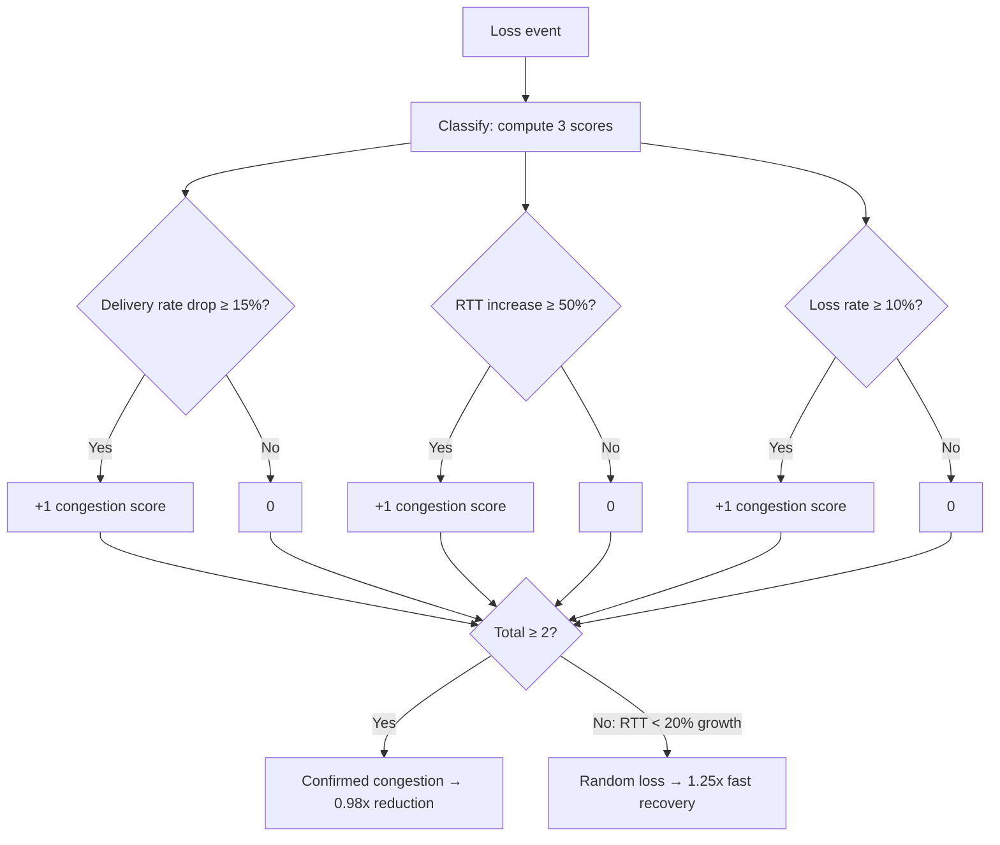

# PPP PRIVATE NETWORK™ X — Universal Communication Protocol (UCP) — C++ Protocol Specification

**Protocol Identifier: `ppp+ucp`** — This document is the authoritative C++ implementation specification for UCP wire format, reliability mechanisms, loss recovery strategies, congestion control algorithms, and forward error correction design. All multi-byte integer fields use network byte order (big-endian). The content of this document exactly matches the C++ implementation in `cpp/include/ucp/` and `cpp/src/`.

---

## Design Principles

UCP is built on three core design principles:

1. **Random loss is a recovery signal, not a congestion signal.** UCP triggers retransmission upon detecting missing data, but only reduces pacing rate when RTT inflation, delivery rate drop, and aggregated loss jointly verify bottleneck congestion.

2. **Every packet carries reliability information.** UCP piggybacks cumulative ACK numbers in DATA, NAK, and all control packets via the `HasAckNumber` (`Flags & 0x08`) flag, minimizing pure ACK packet overhead.

3. **Recovery is tiered by confidence, never races.** UCP uses multiple independent recovery paths (SACK, DupACK, NAK, FEC, RTO), triggering only the most appropriate path for the same gap.



---

## Packet Format

### Common Header (12 Bytes — Mandatory for All Packet Types)

All UCP packets share a 12-byte common header:

| Offset | Field | Size | Description |
|---|---|---|---|
| 0 | `Type` | 1 byte | Packet type identifier, see `UcpPacketType` enum |
| 1 | `Flags` | 1 byte | Bit flags, see `UcpPacketFlags` enum |
| 2 | `ConnId` | 4 bytes | Random 32-bit connection identifier |
| 6 | `Timestamp` | 6 bytes | Sender-local microsecond timestamp (48-bit) |

C++ struct defined in `ucp_packets.h`:

```cpp
struct UcpCommonHeader {
    UcpPacketType  type;
    UcpPacketFlags flags;
    uint32_t       connection_id;
    uint64_t       timestamp;  // 48-bit on wire, stored as 64-bit
};
```

### Packet Type Enumeration (`UcpPacketType`, ucp_enums.h)

| Type Code | Name | Payload Meaning |
|---|---|---|
| `0x01` | `Syn` | Connection initiation, carries client random ISN and random ConnId |
| `0x02` | `SynAck` | Connection acceptance, echoes ConnId, provides server random ISN |
| `0x03` | `Ack` | Pure acknowledgment packet, carries cumulative ACK, SACK blocks, receive window, and timestamp echo |
| `0x04` | `Nak` | Negative acknowledgment, reports missing sequence numbers detected by receiver |
| `0x05` | `Data` | Application payload data, carries sequence number, fragment info, and optional piggybacked ACK |
| `0x06` | `Fin` | Graceful connection termination request |
| `0x07` | `Rst` | Hard connection reset |
| `0x08` | `FecRepair` | Forward error correction repair packet, carries group identifier, repair index, and GF(256) RS repair data |

### Flags Bit Layout (`UcpPacketFlags`, ucp_enums.h)

| Bit | Mask | Name | Description |
|---|---|---|---|
| 0 | `0x01` | **NeedAck** | Requests peer to immediately send acknowledgment, accelerating confirmation for specific packets |
| 1 | `0x02` | **Retransmit** | Indicates this packet is a retransmission (not original send), used for Retrans% statistics |
| 2 | `0x04` | **FinAck** | Acknowledges peer's FIN |
| 3 | `0x08` | **HasAckNumber** | If set, the AckNumber field immediately follows the common header. Core of UCP's piggybacked ACK model |
| 4–5 | `0x30` | **PriorityMask** | 2-bit priority field, encoding `UcpPriority` (Background=0, Normal=1, Interactive=2, Urgent=3) |

```cpp
enum UcpPacketFlags : uint8_t {
    None          = 0x00,
    NeedAck       = 0x01,
    Retransmit    = 0x02,
    FinAck        = 0x04,
    HasAckNumber  = 0x08,
    PriorityMask  = 0x30,
};
```

---

## HasAckNumber — Piggybacked Cumulative ACK Model

The `HasAckNumber` flag (`0x08`) is the cornerstone of UCP acknowledgment efficiency. When this bit is set, ACK-related fields follow immediately after the packet common header:



---

## Detailed Packet Layouts

### DATA Packet Layout

C++ definition (`ucp_packets.h`):

```cpp
class UcpDataPacket final : public UcpPacket {
public:
    uint32_t              sequence_number = 0;
    uint16_t              fragment_total  = 0;
    uint16_t              fragment_index  = 0;
    std::vector<uint8_t>  payload;
    uint32_t              ack_number     = 0;
    std::vector<SackBlock> sack_blocks;
    uint32_t              window_size     = 0;
    uint64_t              echo_timestamp  = 0;
};
```

| Offset | Field | Size | Description |
|---|---|---|---|
| 0 | CommonHeader | 12B | Type=0x05, Flags (may include HasAckNumber/Retransmit/NeedAck), ConnId, Timestamp |
| 12 | `[AckNumber]` | 4B | Optional: present when `Flags & 0x08` is set |
| Variable | `SeqNum` | 4B | Data sequence number |
| Variable | `FragTotal` | 2B | Total fragment count (1 = unfragmented) |
| Variable | `FragIndex` | 2B | Fragment index (0-based) |
| Variable | `Payload` | ≤ MSS−20 bytes | Application data |

### ACK Packet Layout

```cpp
class UcpAckPacket final : public UcpPacket {
public:
    uint32_t              ack_number = 0;
    std::vector<SackBlock> sack_blocks;
    uint32_t              window_size    = 0;
    uint64_t              echo_timestamp = 0;
};
```

| Offset | Field | Size | Description |
|---|---|---|---|
| 0 | CommonHeader | 12B | Type=0x03, ConnId, Timestamp |
| 12 | `AckNumber` | 4B | Cumulative ACK: all bytes up to (but excluding) this sequence number have been received contiguously |
| 16 | `SackCount` | 2B | Number of SACK blocks following |
| 18 | `SackBlocks[]` | N×8B | Each SACK block is `(StartSequence, EndSequence)` |
| Variable | `WindowSize` | 4B | Receive window advertisement (bytes) |
| Variable | `EchoTimestamp` | 6B | Timestamp echo |

### NAK Packet Layout

```cpp
class UcpNakPacket final : public UcpPacket {
public:
    uint32_t              ack_number = 0;
    std::vector<uint32_t> missing_sequences;
};
```

| Offset | Field | Size | Description |
|---|---|---|---|
| 0 | CommonHeader | 12B | Type=0x04, Flags, ConnId, Timestamp |
| 12 | `[AckNumber]` | 4B | Optional: present when HasAckNumber is set |
| Variable | `MissingCount` | 2B | Number of missing sequence entries |
| Variable | `MissingSeqs[]` | N×4B | Missing sequence numbers, in monotonically increasing order |

### FecRepair Packet Layout

```cpp
class UcpFecRepairPacket final : public UcpPacket {
public:
    uint32_t              group_id    = 0;  // FEC group base sequence
    uint8_t               group_index = 0;  // repair index within group
    std::vector<uint8_t>  payload;
};
```

| Offset | Field | Size | Description |
|---|---|---|---|
| 0 | CommonHeader | 12B | Type=0x08, Flags, ConnId, Timestamp |
| 12 | `[AckNumber]` | 4B | Optional |
| Variable | `GroupId` | 4B | FEC group identifier (sequence number of the first DATA packet in the group) |
| Variable | `GroupIndex` | 1B | Repair packet index within the group (0-based) |
| Variable | `Payload` | Variable | GF(256) RS repair data |

### ControlPacket (SYN/SYNACK/FIN/RST)

```cpp
class UcpControlPacket final : public UcpPacket {
public:
    bool     has_sequence_number = false;
    uint32_t sequence_number     = 0;
    uint32_t ack_number          = 0;
};
```

Control packets are used for handshake (SYN/SYNACK) and teardown (FIN/RST), carrying optional `sequence_number` and `ack_number`.

---

## Big-Endian Encoding (UcpPacketCodec)

C++ implementation in `ucp_packet_codec.cpp`:

```cpp
// Read 32-bit big-endian
uint32_t UcpPacketCodec::ReadUInt32(const uint8_t* buffer, size_t offset) {
    return (static_cast<uint32_t>(buffer[offset])     << 24)
         | (static_cast<uint32_t>(buffer[offset + 1]) << 16)
         | (static_cast<uint32_t>(buffer[offset + 2]) << 8)
         |  buffer[offset + 3];
}

// Write 32-bit big-endian
void UcpPacketCodec::WriteUInt32(uint32_t value, uint8_t* buffer, size_t offset) {
    buffer[offset]     = static_cast<uint8_t>(value >> 24);
    buffer[offset + 1] = static_cast<uint8_t>(value >> 16);
    buffer[offset + 2] = static_cast<uint8_t>(value >> 8);
    buffer[offset + 3] = static_cast<uint8_t>(value);
}
```

Timestamps use 48-bit big-endian (`ReadUInt48`/`WriteUInt48`), masked by `0x0000FFFFFFFFFFFF`.

`Encode()` dispatches to the corresponding packet-type-specific encoding method via `dynamic_cast`: `EncodeData`, `EncodeAck`, `EncodeNak`, `EncodeFecRepair`, `EncodeControl`.

`TryDecode()` first reads the 12-byte common header (`TryReadCommonHeader`), then dispatches to the corresponding decode method via a switch on `header.type`.

---

## Sequence Arithmetic (UcpSequenceComparer)

```cpp
// ucp_sequence_comparer.h
static bool IsAfter(uint32_t left, uint32_t right) {
    if (left == right) return false;
    return (left - right) < Constants::HALF_SEQUENCE_SPACE; // 0x80000000U
}
```

Uses 32-bit sequence numbers with a 2^31 comparison window. `HALF_SEQUENCE_SPACE = 0x80000000U`. Provides a complete comparison API including `IsBefore`, `IsBeforeOrEqual`, `IsAfterOrEqual`, `Increment`, `IsInForwardRange`, `IsForwardDistanceAtMost`.

---

## Connection State Machine



State implementation:

```cpp
enum class UcpConnectionState {
    Init,
    HandshakeSynSent,
    HandshakeSynReceived,
    Established,
    ClosingFinSent,
    ClosingFinReceived,
    Closed,
};
```

### Three-Way Handshake Sequence (C++ Implementation)



### State Transition Details

| Transition | Trigger | Outbound Action | Timer |
|---|---|---|---|
| Init → HandshakeSynSent | Client `UcpPcb::ConnectAsync()` | Send SYN (UcpControlPacket, Type=Syn) | connectTimer |
| Init → HandshakeSynReceived | Server receives valid SYN | Send SYNACK (UcpControlPacket, Type=SynAck, HasAckNumber=1) | connectTimer |
| → Established | SYNACK's ACK received or client ACK confirms SYNACK | — | Stop connectTimer |
| Established → ClosingFinSent | `UcpPcb::CloseAsync()` | Send FIN (UcpControlPacket, Type=Fin) | disconnectTimer |
| Established → ClosingFinReceived | Peer FIN received | Send FIN ACK (UcpControlPacket, Type=Ack, FinAck=0x04) | disconnectTimer |
| → Closed | FIN exchange complete / RTO exceeds MaxRetransmissions | Optional RST | All stopped |

---

## Loss Detection & Recovery Flow

### Complete Multi-Path Recovery Decision Tree



---

## NAK Three-Tier Confidence



| Confidence Tier | Observation Count | Reordering Guard Formula | Absolute Minimum | Design Intent |
|---|---|---|---|---|
| **Low** | 1-2 times | `max(RTT × 2, 60ms)` | 60ms | Conservative guard: prevents false NAKs on high-jitter paths |
| **Medium** | 3-4 times | `max(RTT, 20ms)` | 20ms | Evidence mounting, shortened to ~1 RTT |
| **High** | 5+ times | `max(RTT/4, 5ms)` | 5ms | Overwhelming evidence, minimum guard, fastest NAK emission |

Additional constraint: same sequence number NAK interval ≥ `NAK_REPEAT_INTERVAL_MICROS` (250ms), single NAK packet maximum 256 missing sequence numbers.

---

## BBRv2 Congestion Control (C++ Implementation)

### State Transitions

```
Startup → Drain → ProbeBW ↔ ProbeRTT
```

| State | Pacing Gain (C++) | CWND Gain (C++) | Exit Condition |
|---|---|---|---|
| **Startup** | 2.89 | 2.0 | Consecutive 3 RTT windows without throughput growth |
| **Drain** | 1.0 | — | In-flight < BDP × target_cwnd_gain |
| **ProbeBW** | Cycle [1.35, 0.85, 1.0×6] | 2.0 | Trigger ProbeRTT every 30s |
| **ProbeRTT** | 0.85 | 4 packets | After 100ms return to ProbeBW |

### Core Estimators

| Estimator | Computation Method | Purpose |
|---|---|---|
| `BtlBw` | EWMA-smoothed maximum delivery rate over last `BbrWindowRtRounds` (10) RTT windows | Pacing rate baseline |
| `MinRtt` | Minimum observed RTT within last ProbeRttInterval (30s) | BDP denominator |
| `BDP` | `BtlBw × MinRtt` | Target in-flight bytes |
| `PacingRate` | `BtlBw × PacingGain × CongestionFactor` | Token Bucket enforced rate |
| `CWND` | `BDP × EffectiveCwndGain` (floor 0.95×BDP) | Maximum in-flight bytes |

### C++ BBR Internal Parameters (ucp_bbr.cpp)

```cpp
// Key constants
kLossCwndRecoveryStep     = 0.08;  // CWND gain recovery per ACK
kLossCwndRecoveryStepFast = 0.15;  // Fast recovery for MobileUnstable/RandomLoss
kCongestionLossReduction  = 0.98;  // Each congestion event reduces gain by 2%
kMinLossCwndGain          = 0.95;  // CWND floor at 95% of BDP
kFastRecoveryPacingGain   = 1.25;  // Random loss recovery gain
kStartupGrowthTarget      = 1.25;  // Startup bandwidth growth target per round
kCongestionRateDropRatio  = -0.15; // Rate drop ≥15% → congestion score +1
kCongestionRttIncreaseRatio = 0.50; // RTT increase ≥50% → congestion score +1
kCongestionLossRatio      = 0.10;  // Loss ≥10% → congestion score +1
kCongestionClassifierScoreThreshold = 2; // Score ≥2 → confirmed congestion
kRandomLossMaxRttIncreaseRatio = 0.20; // RTT increase <20% → random loss
```

### Adaptive Pacing Gain

```cpp
AdaptivePacingGain = BaseGain × _lossCwndGain
// _lossCwndGain default = 1.0
// Congestion event: _lossCwndGain *= 0.98
// Recovery: _lossCwndGain += 0.08 per ACK (0.15 for MobileUnstable)
// Floor: _lossCwndGain ≥ 0.95
```

### Congestion Classification Scoring System



---

## Forward Error Correction — UcpFecCodec (C++ Implementation)

### Mathematical Foundation

| Parameter | C++ Value (ucp_fec_codec.cpp) |
|---|---|
| Irreducible Polynomial | `0x11d` (`x^8 + x^4 + x^3 + x^2 + 1`) |
| Primitive Element α | `0x02` |
| Log Table | `gf_log_[256]` — 256 entries |
| Antilog Table | `gf_exp_[512]` — 512 entries (supports mod-255 overflow) |
| Multiplication | `gf_exp_[(gf_log_[a] + gf_log_[b]) % 255]` — O(1) |
| Division | `gf_exp_[(gf_log_[a] - gf_log_[b] + 255) % 255]` — O(1) |
| Max FEC Slot Length | `MAX_FEC_SLOT_LENGTH = 1200` |

### Encoding Flow

1. `FeedDataPacket(seq, payload)` or directly `send_buffer_[send_index_++] = payload`
2. When `send_index_ == group_size_`, `TryEncodeRepairs()` triggers
3. For each byte position j (0 to max_len−1), for each repair index i: `repair[i][j] = Σ_{k=0}^{N−1} (data[k][j] × α^{i×k})`, GF(256) multiplication
4. Returns `vector<vector<uint8_t>>`, length `repair_count_`

### Decoding Flow

1. `FeedDataPacket(seq, payload)` → store into `recv_groups_[group_base][slot]`
2. `TryRecoverFromRepair(repair, group_base, repair_index)` → store into `recv_repairs_[group_base][repair_index]`
3. When received count in `recv_groups_[group_base]` + repair count in `recv_repairs_[group_base]` ≥ `group_size_`, Gaussian elimination triggers
4. `TrySolve()` builds a GF(256) Vandermonde matrix, Gaussian elimination solves each byte of missing slots
5. Returns `vector<RecoveredPacket>`, each with `slot`, `sequence_number`, `payload`

### Gaussian Elimination Core Algorithm

```cpp
// TrySolve: GF(256) Gaussian elimination (simplified to pseudo-code)
for (int col = 0; col < size; col++) {
    // 1. Find pivot row (non-zero element)
    // 2. Swap rows if needed
    // 3. Normalize pivot row: multiply row by GfInverse(pivot_value)
    // 4. Eliminate: for each other row, subtract scaled pivot row
    //    rhs[i][j] = rhs[i][j] - rhs[pivot][j] * matrix[i][pivot]
}
```

Each group supports at most `group_size_` (2–64, default 8) DATA packets + `repair_count_` repair packets.

### FEC Group Encoding Coefficients

```cpp
static uint8_t GetCoefficient(int repair_index, int slot) {
    return GfPower(0x02 /* α */, repair_index * slot);
}
```

Vandermonde matrix: `A[i][k] = α^{i×k}`, where i is the repair index and k is the slot index.

---

## Report Metric Definitions

| Metric | C++ Data Source | Semantics |
|---|---|---|
| `BytesSent` | `UcpPcb::m_bytesSent` | Total payload bytes sent |
| `BytesReceived` | `UcpPcb::m_bytesReceived` | Total payload bytes received |
| `DataPacketsSent` | `UcpPcb::m_sentDataPackets` | Total DATA packets sent |
| `RetransmittedPackets` | `UcpPcb::m_retransmittedPackets` | Retransmitted DATA packet count |
| `RetransmissionRatio()` | `RetransmittedPackets / DataPacketsSent` | Retransmission ratio |
| `CongestionWindowBytes` | `BbrCongestionControl::CongestionWindowBytes()` | Current CWND |
| `PacingRateBytesPerSecond` | `BbrCongestionControl::PacingRateBytesPerSecond()` | Current pacing rate |
| `EstimatedLossPercent` | `BbrCongestionControl::EstimatedLossPercent()` | BBR-estimated loss rate |
| `RemoteWindowBytes` | `UcpPcb::m_remoteWindowBytes` | Peer-advertised receive window |
| `LastRttMicros` | `UcpPcb::m_lastRttMicros` | Most recent RTT sample |
| `RttSamplesMicros` | `UcpPcb::m_rttSamplesMicros` | RTT sample history |
