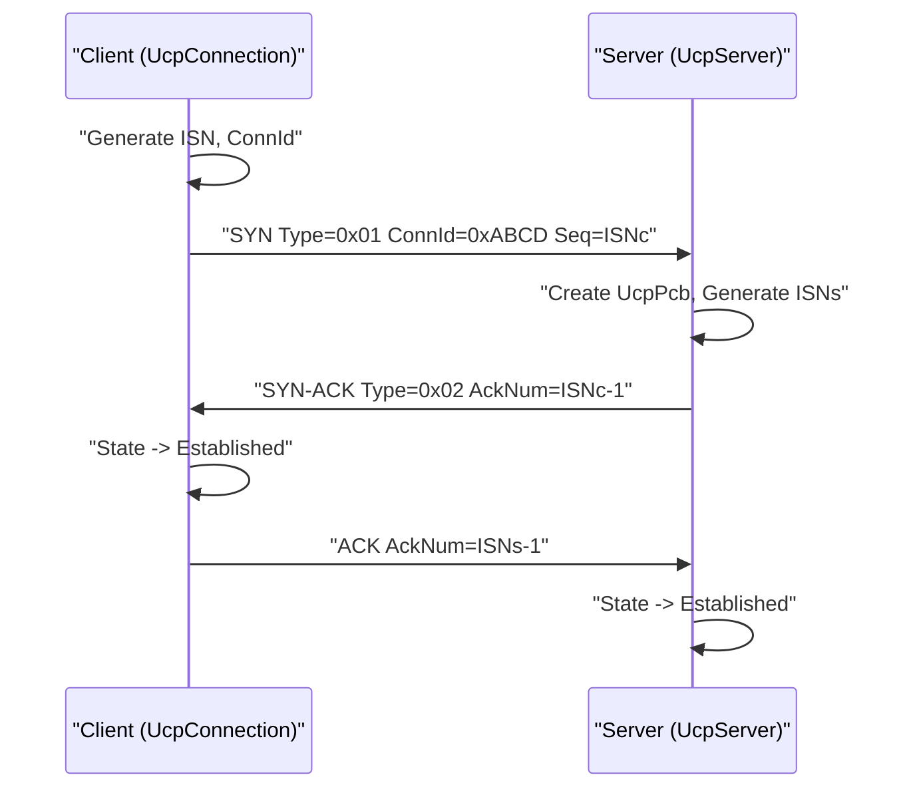

# UCP C++ Protocol Specification

[Chinese](protocol_CN.md)

This document is the authoritative specification of the UCP C++ implementation's wire format, packet types, flags, connection state machine, and loss recovery. All multi-byte fields use network byte order (big-endian). UCP is a pure control protocol: CID round-robin switching, FEC forward error correction, and SACK/NAK recovery feed high-fidelity delivery samples into the KCC congestion control for accurate BDP/RTT estimation.

## Implementation Principles

UCP is built on three core principles:

1. **Random loss is a recovery signal, not a congestion signal** — retransmit immediately without rate reduction; recovery uses packet-conservation cwnd and LT-BW EMA (no multiplicative cwnd cut)
2. **Every packet carries reliability information** — HasAckNumber enables piggybacked cumulative ACK on DATA, NAK, and control packets
3. **Recovery is confidence-graded** — five independent recovery paths (SACK/NAK/FEC/DupACK/RTO), only the optimal path triggers per gap

The UCP protocol wire format uses strict big-endian encoding with all multi-byte fields written in network byte order. The 12-byte common header ensures interoperability across packet types: the Type field identifies 8 packet types, and the Flags byte provides NeedAck, Retransmit, FinAck, HasAckNumber, MtuProbe, PathChallenge, and a 2-bit priority field. Connection ID uses a random 32-bit value rather than IP:Port tuples, enabling clients to maintain the same session when switching between Wi-Fi and cellular networks; server lookup via hash map achieves O(1) complexity. Connection migration is secured by the PATH_CHALLENGE mechanism.

The protocol implementation fully considers the diversity and real-time requirements of loss recovery. Five recovery paths are ordered by latency from low to high: FEC forward error correction via Reed-Solomon coding provides zero-RTT recovery, suitable for latency-sensitive scenarios; SACK selective acknowledgment uses multi-observation confirmation to trigger fast retransmit at sub-RTT latency; NAK negative acknowledgment uses three-tier confidence grading, dynamically selecting guard duration based on gap observation count and duration; DupACK works similarly to traditional TCP, with three duplicate ACKs triggering fast retransmit; RTO timeout retransmission serves as the final fallback, covering loss events not covered by any other path.

## 12-Byte Common Header

All UCP packets share a 12-byte common header:

| Offset | Field | Size | Encoding |
|---|---|---|---|
| 0 | Type | 1 byte | Direct byte (0x01-0x08) |
| 1 | Flags | 1 byte | Bit flags |
| 2-5 | Connection ID | 4 bytes | Big-endian uint32 |
| 6-11 | Timestamp | 6 bytes | Big-endian uint48 (microseconds) |

```cpp
struct UcpCommonHeader {
    UcpPacketType  type;           // 1 byte
    UcpPacketFlags flags;          // 1 byte
    uint32_t       connection_id;  // 4 bytes big-endian
    int64_t        timestamp;      // 6 bytes uint48, stored as int64_t
};
```

### Big-Endian Codec

```cpp
uint32_t UcpPacketCodec::ReadUInt32(const uint8_t* buffer, size_t offset) {
    return (static_cast<uint32_t>(buffer[offset])     << 24)
         | (static_cast<uint32_t>(buffer[offset + 1]) << 16)
         | (static_cast<uint32_t>(buffer[offset + 2]) << 8)
         |  buffer[offset + 3];
}

void UcpPacketCodec::WriteUInt32(uint32_t value, uint8_t* buffer, size_t offset) {
    buffer[offset]     = static_cast<uint8_t>(value >> 24);
    buffer[offset + 1] = static_cast<uint8_t>(value >> 16);
    buffer[offset + 2] = static_cast<uint8_t>(value >> 8);
    buffer[offset + 3] = static_cast<uint8_t>(value);
}
```

## 8 Packet Types

| Type | Value | Fixed Overhead | Purpose |
|---|---|---|---|
| SYN | 0x01 | 12 + optional | Connection initiation, carries initial sequence |
| SYN-ACK | 0x02 | 12 + optional | Connection confirmation, carries assigned ConnId |
| ACK | 0x03 | 28 + SACK blocks | Cumulative + selective ACK |
| NAK | 0x04 | 18 + missing seqs | Negative acknowledgment, receiver requests retransmission |
| DATA | 0x05 | 20-36 + payload | Application data, optional piggybacked ACK |
| FIN | 0x06 | 12 + optional | Connection close |
| RST | 0x07 | 12 | Connection reset, immediate termination |
| FEC_REPAIR | 0x08 | 17 + repair data | RS-GF(256) FEC repair packet |

## Flags Bit Layout

| Bit | Mask | Name | Meaning |
|---|---|---|---|
| 0 | 0x01 | NeedAck | Request immediate ACK from receiver |
| 1 | 0x02 | Retransmit | Marked as retransmission (skip RTT sampling) |
| 2 | 0x04 | FinAck | FIN acknowledgment (for close handshake) |
| 3 | 0x08 | HasAckNumber | Carries piggybacked ACK field |
| 4-5 | 0x30 | PriorityMask | 2-bit priority (0=Background, 1=Normal, 2=Interactive, 3=Urgent) |
| 6 | 0x40 | MtuProbe | MTU probe packet (DPLPMTUD) |
| 7 | 0x80 | PathChallenge | Carries path challenge/response payload |

## Packet Structure Definitions

### DATA Packet

```cpp
class UcpDataPacket final : public UcpPacket {
public:
    uint32_t              sequence_number;   // 4B
    uint16_t              fragment_total;    // 2B
    uint16_t              fragment_index;    // 2B
    ucp::vector<uint8_t>  payload;           // <= 1200B
    uint32_t              ack_number;        // 4B (HasAckNumber)
    ucp::vector<SackBlock> sack_blocks;      // N * 8B
    uint32_t              window_size;       // 4B
    int64_t               echo_timestamp;    // 6B
};
```

### ACK Packet

```cpp
class UcpAckPacket final : public UcpPacket {
public:
    uint32_t              ack_number;
    ucp::vector<SackBlock> sack_blocks;
    uint32_t              window_size;
    int64_t               echo_timestamp;
};
```

### NAK Packet

```cpp
class UcpNakPacket final : public UcpPacket {
public:
    uint32_t                ack_number;
    ucp::vector<uint32_t>   missing_sequences; // N * 4B
};
```

### FecRepair Packet

```cpp
class UcpFecRepairPacket final : public UcpPacket {
public:
    uint32_t              group_id;      // 4B — FEC group base sequence
    uint8_t               group_index;   // 1B — repair packet index within group
    ucp::vector<uint8_t>  payload;       // variable
};
```

### Control Packet

```cpp
class UcpControlPacket final : public UcpPacket {
public:
    bool     has_sequence_number = false;
    uint32_t sequence_number     = 0;
    uint32_t ack_number          = 0;
    uint64_t session_key         = 0;
};
```

## HasAckNumber Piggybacked ACK Model

When HasAckNumber flag is set, the following fields follow the common header: AckNumber(4B) + SackCount(2B) + SACK blocks(N*8B) + WindowSize(4B) + EchoTimestamp(6B).

| Byte Offset | Field | Size | Description |
|---|---|---|---|
| +0 | AckNumber | 4 bytes | Cumulative ACK number |
| +4 | SackCount | 2 bytes | SACK block count (capped at MAX_ACK_SACK_BLOCKS=149) |
| +6 | SackBlocks | N * 8 bytes | SACK block list |
| +6+N*8 | WindowSize | 4 bytes | Receive window advertisement |
| +10+N*8 | EchoTimestamp | 6 bytes | Timestamp echo |

### HasAckNumber Set Rules by Packet Type

| Packet Type | Rule |
|---|---|
| SYN | Always 0 (no data to acknowledge) |
| SYN-ACK | Always 1 (piggybacks client ISN acknowledgment) |
| ACK | Implicitly carries |
| NAK | Set when cumulative ACK has progressed |
| DATA | Almost always set during bidirectional data flow |
| FIN | Set when there is unacknowledged data |
| RST | Usually 0 |
| FecRepair | Set when bidirectional piggyback opportunity exists |

## Flow Control

The sendable upper limit is min(cwnd, peer-declared receive window); the initial cwnd is NOT a fixed 10-packet cap. The KCC congestion controller derives cwnd from the BDP estimate, but the peer's advertised `WindowSize` is the authoritative hard cap on bytes in flight (standard TCP/QUIC flow control).

## Connection State Machine

| Current State | Event | Next State | Outbound |
|---|---|---|---|
| Init | ConnectAsync() | HandshakeSynSent | SYN |
| Init | Received SYN | HandshakeSynReceived | SYN-ACK |
| HandshakeSynSent | Received SYN-ACK | Established | ACK |
| HandshakeSynReceived | Received ACK | Established | - |
| Established | CloseAsync() | ClosingFinSent | FIN |
| Established | Received FIN | ClosingFinReceived | FIN-ACK |
| ClosingFinSent | Received FIN-ACK | Closed | - |
| ClosingFinReceived | FIN acknowledged | Closed | - |
| Any | Timeout/RST | Closed | RST (optional) |

## Three-Way Handshake


```mermaid
sequenceDiagram
    participant C as "Client (UcpConnection)"
    participant S as "Server (UcpServer)"
    C->>C: "Generate ISN, ConnId"
    C->>S: "SYN Type=0x01 ConnId=0xABCD Seq=ISNc"
    S->>S: "Create UcpPcb, Generate ISNs"
    S->>C: "SYN-ACK Type=0x02 AckNum=ISNc-1"
    C->>C: "State -> Established"
    C->>S: "ACK AckNum=ISNs-1"
    S->>S: "State -> Established"
```

## Five-Path Loss Recovery

| Recovery Path | Trigger | Latency |
|---|---|---|
| FEC | Sufficient repair packets | Zero RTT |
| SACK | Block observed >= 2 times | Sub-RTT |
| NAK | Gap count reaches threshold | RTT/4 to RTT*2 |
| DupACK | Same ACK received 3 times | Sub-RTT |
| RTO | No ACK progress in RTO window | 50ms-15s |

## NAK Three-Tier Confidence

Gap observation count determines NAK guard duration. baseGrace = max(2000, min(RTT/2, MIN_RTO)):

| Level | Observations | Guard Duration | Intent |
|---|---|---|---|
| Low | 1-31 | baseGrace = max(2000, min(RTT/2, MIN_RTO)) | Prevent jitter false positives |
| Medium | 32-127 | max(baseGrace/2, 1000) | Increasing evidence, shorter guard |
| High | 128+ | max(baseGrace/2, 1000) | Fastest NAK dispatch |

NAK repeat suppression: per-missing-sequence marking (`m_nakIssued`), plus an RTT-window rate limit in `SendNak` (one NAK window per smoothed RTT; `NAK_REPEAT_INTERVAL_MICROS` is declared in C# but unused).

## SACK Block Encoding

Each SACK block is 8 bytes: Start(4B) + End(4B), sorted ascending by Start. Each SACK range sent at most 2 times.

```cpp
struct SackBlock {
    uint32_t Start;  // inclusive
    uint32_t End;    // inclusive
};
```

## RST Handling

| Trigger | Description |
|---|---|
| Invalid ConnId | No PCB found for received ConnId |
| State conflict | New SYN received in Established state |
| Retransmission exhausted | Exceeded MaxRetransmissions |
| Application call | Dispose() or destructor |

RST cleanup sequence: mark disposed/cancelled, stop all timers, clear send/receive buffers, force state transition to Closed, callback OnDisconnected, hand the PCB/connection to the deferred-cleanup thread for immediate release (never on the PCB's own worker thread).

## Related Documents

- [architecture_EN.md](architecture_EN.md) — Runtime layer structure
- [api_EN.md](api_EN.md) — API reference
- [performance_EN.md](performance_EN.md) — UCP and performance
- [constants_EN.md](constants_EN.md) — Protocol constants
- [README_EN.md](../README_EN.md) — Project overview
- [Linux Kernel Module](../../linux/README.md) — KCC Geodesic Congestion Control module (tcp_kcc.c v2.0, with KCC Forwarding (KF) for cross-connection bandwidth sharing)

---

## License and Trademark

MIT License. See [LICENSE](../../LICENSE) for full text.

Copyright (c) 2026 PPP PRIVATE NETWORK™ X

PPP PRIVATE NETWORK™ is a trademark of PPP PRIVATE NETWORK.
