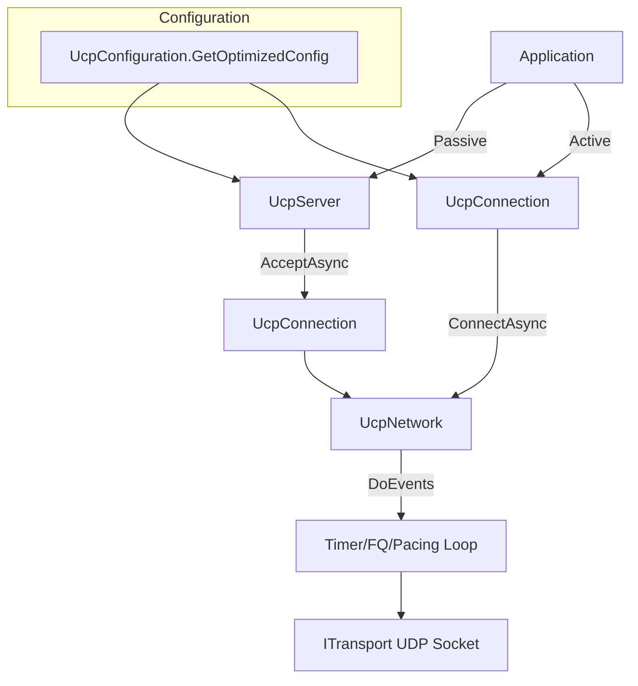
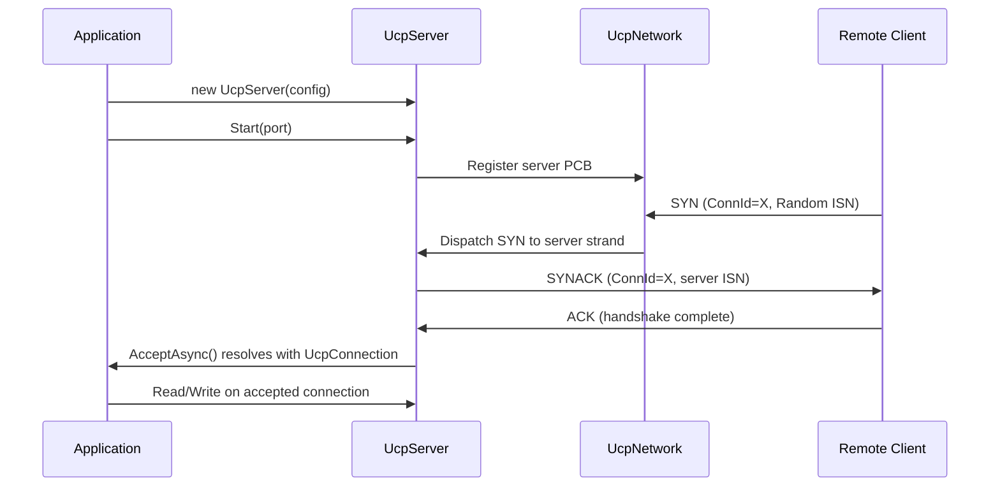
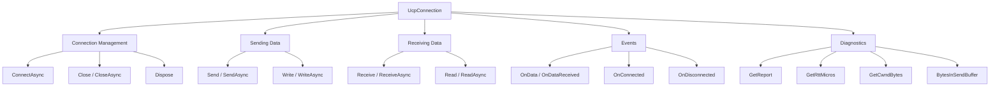
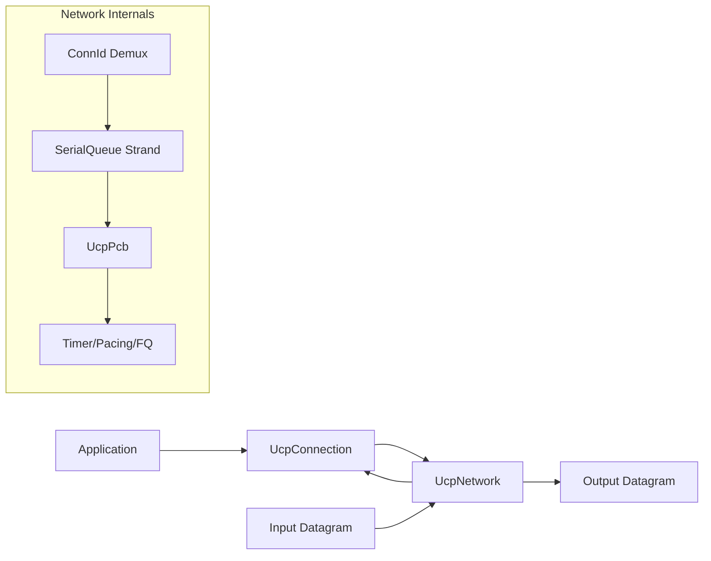

# PPP PRIVATE NETWORK™ X - Universal Communication Protocol (UCP) — API Reference

[中文](api_CN.md) | [Documentation Index](index.md)

**Protocol designation: `ppp+ucp`** — This document describes the public API surface of the UCP library, including configuration, server and connection lifecycle, network driver integration, event model, and diagnostic reporting.

---

## API Overview

UCP exposes three main API entry points: `UcpServer` for passive connection acceptance, `UcpConnection` for active and passive data transfer, and `UcpNetwork` for custom transport integration. All protocol behavior is configured through `UcpConfiguration`, which is instantiated via the factory method `GetOptimizedConfig()`.



---

## UcpConfiguration

Call `UcpConfiguration.GetOptimizedConfig()` for the recommended defaults tuned for a broad range of network conditions.

### Protocol Parameters

| Parameter | Default | Purpose |
|---|---|---:|
| `Mss` | 1220 | Maximum segment size in bytes. High-bandwidth benchmarks use 9000. Controls fragmentation threshold and SACK block capacity. |
| `MaxRetransmissions` | 10 | Maximum retransmission attempts per outbound segment before the connection is declared dead. |
| `SendBufferSize` | 32 MB | Maximum buffered outbound data. `WriteAsync` blocks when the buffer is full, providing backpressure. |
| `ReceiveBufferSize` | ~20 MB | Derived from `RecvWindowPackets x Mss`. Guards against memory exhaustion from a fast sender. |
| `InitialCwndPackets` | 20 | Initial congestion window in packets. BBRv2 Startup rapidly grows beyond this. |
| `InitialCwndBytes` | derived | Convenience setter that converts bytes to packets using current MSS. |
| `MaxCongestionWindowBytes` | 64 MB | Hard cap for BBRv2 congestion window, preventing runaway memory use. |
| `SendQuantumBytes` | `Mss` | Pacing token consumption granularity. Each send attempt consumes this many tokens. |
| `AckSackBlockLimit` | 149 | Maximum SACK blocks per ACK. Bounded by MSS to ensure ACK fits in a single datagram. |

### RTO And Timers

| Parameter | Default | Purpose |
|---|---|---:|
| `MinRtoMicros` | 200,000 (200ms) | Minimum retransmission timeout. Prevents premature RTO on low-latency paths. |
| `MaxRtoMicros` | 15,000,000 (15s) | Maximum retransmission timeout. Upper bound with 1.2x backoff. |
| `RetransmitBackoffFactor` | 1.2 | RTO backoff multiplier per consecutive timeout. Milder than TCP's 2.0. |
| `ProbeRttIntervalMicros` | 30,000,000 (30s) | BBRv2 ProbeRTT interval. How often to attempt refreshing MinRTT. |
| `ProbeRttDurationMicros` | 100,000 (100ms) | Minimum ProbeRTT duration. |
| `KeepAliveIntervalMicros` | 1,000,000 (1s) | Idle keep-alive interval. Prevents NAT/firewall timeout on idle connections. |
| `DisconnectTimeoutMicros` | 4,000,000 (4s) | Idle disconnect timeout. Connection closed if no data within this period. |
| `TimerIntervalMilliseconds` | 20 | Internal timer tick interval driving `DoEvents()` rounds. |
| `DelayedAckTimeoutMicros` | 2,000 (2ms) | Delayed ACK coalescing timeout. Set to `0` to disable delayed ACK. |

### Pacing And BBRv2

| Parameter | Default | Purpose |
|---|---|---:|
| `MinPacingIntervalMicros` | 0 | No artificial minimum packet gap — token bucket handles all pacing. |
| `PacingBucketDurationMicros` | 10,000 (10ms) | Token bucket capacity window. Larger values allow bigger bursts. |
| `StartupPacingGain` | 2.5 | BBRv2 Startup pacing multiplier. Aggressive initial probing. |
| `StartupCwndGain` | 2.0 | BBRv2 Startup CWND multiplier. |
| `DrainPacingGain` | 0.75 | BBRv2 Drain pacing multiplier. Drains Startup queue. |
| `ProbeBwHighGain` | 1.25 | ProbeBW up-phase gain to probe for more bandwidth. |
| `ProbeBwLowGain` | 0.85 | ProbeBW down-phase gain to drain queue. |
| `ProbeBwCwndGain` | 2.0 | ProbeBW CWND gain. |
| `BbrWindowRtRounds` | 10 | Delivery-rate filter length in RTT rounds for `BtlBw` estimation. |

### Bandwidth And Loss Control

| Parameter | Default | Purpose |
|---|---|---:|
| `InitialBandwidthBytesPerSecond` | 12.5 MB/s | Initial bottleneck bandwidth estimate used before delivery-rate samples are available. |
| `MaxPacingRateBytesPerSecond` | 12.5 MB/s | Pacing rate ceiling. Set to `0` to disable the ceiling entirely. |
| `ServerBandwidthBytesPerSecond` | 12.5 MB/s | Server egress bandwidth used by the fair-queue scheduler. |
| `LossControlEnable` | `true` | Enables loss-aware pacing/CWND adaptation after congestion classification. |
| `MaxBandwidthLossPercent` | 25% | Loss budget percentage after congestion evidence. Clamped to 15%-35%. |
| `MaxBandwidthWastePercent` | 25% | Bandwidth waste budget for pacing debt management. |

### FEC (Forward Error Correction)

| Parameter | Default | Purpose |
|---|---|---:|
| `FecRedundancy` | 0.0 | Base redundancy ratio. `0.125` = 1 RS-GF(256) repair per 8 data packets. Under adaptive mode, effective redundancy adjusts. |
| `FecGroupSize` | 8 | DATA packets per FEC group. Smaller groups have lower latency but higher overhead. Max 64. |
| `FecAdaptiveEnable` | `true` | Enable adaptive FEC redundancy. Scales with observed loss rate. |

### Connection And Session

| Parameter | Default | Purpose |
|---|---|---:|
| `UseConnectionIdTracking` | `true` | Connections tracked by random 32-bit ConnId rather than IP:port tuples. Enables NAT rebinding resilience and IP mobility. |
| `DynamicIpBindingEnable` | `true` | Server binds to `IPAddress.Any` and accepts connections on any acquired address. |

---

## UcpServer

```csharp
public class UcpServer : IUcpObject, IDisposable
```

`UcpServer` manages passive connection acceptance with built-in fair-queue scheduling. Each accepted connection automatically participates in the fair-queue credit system.

| Method | Purpose |
|---|---|
| `Start(int port)` | Start listening on the specified UDP port. Binds to `IPAddress.Any` when DynamicIpBinding is enabled. |
| `Start(IPEndPoint endpoint)` | Start listening on a specific IP endpoint for environments with static addressing. |
| `AcceptAsync()` | Wait for a new client connection and return a fully established `UcpConnection`. The connection's handshake is complete when the task resolves. |
| `Stop()` | Stop listening and gracefully close all managed connections. In-flight data is drained over 2xRTO. |

### Server Lifecycle



---

## UcpConnection

```csharp
public class UcpConnection : IUcpObject, IDisposable
```

`UcpConnection` represents a single UCP session. All operations execute on a dedicated `SerialQueue` strand, ensuring thread-safe access without locks.



### Connection Management

| Method | Purpose |
|---|---|
| `ConnectAsync(IPEndPoint remote)` | Initiate a connection to a remote endpoint. Generates a random ISN and ConnId. Returns when the handshake completes. |
| `Close()` | Synchronously initiate graceful close with FIN. |
| `CloseAsync()` | Asynchronously initiate graceful close. Returns when the FIN is acknowledged. |
| `Dispose()` | Release all resources. The connection is force-closed if still active. |

### Sending Data

| Method | Signature | Purpose |
|---|---|---|
| `Send` | `Send(byte[] buffer, int offset, int count)` | Synchronous send into the send buffer. Does not wait for remote acknowledgment. |
| `SendAsync` | `SendAsync(byte[] buffer, int offset, int count)` | Asynchronous send into the send buffer. |
| `Write` | `Write(byte[] buffer, int offset, int count)` | Synchronous reliable write into the send buffer. |
| `WriteAsync` | `WriteAsync(byte[] buffer, int offset, int count)` | Asynchronous reliable write. Returns `true` after all bytes are accepted by the send buffer. Blocks if buffer is full. |

`Write` and `WriteAsync` guarantee send-buffer acceptance, not remote delivery confirmation. For delivery confirmation, implement application-level ACK or use `Receive`/`Read` on the remote side.

### Receiving Data

| Method | Signature | Purpose |
|---|---|---|
| `Receive` | `Receive(byte[] buffer, int offset, int count)` | Synchronous read from the ordered delivery queue. Returns actual bytes read (may be < count). |
| `ReceiveAsync` | `ReceiveAsync(byte[] buffer, int offset, int count)` | Asynchronous read. Resolves when at least 1 byte is available. |
| `Read` | `Read(byte[] buffer, int offset, int count)` | Loop until exactly `count` bytes are read into the buffer. |
| `ReadAsync` | `ReadAsync(byte[] buffer, int offset, int count)` | Async exact-byte-count read. Resolves when all requested bytes are available. |

### Events

| Event | Signature | Raised When |
|---|---|---|
| `OnData` / `OnDataReceived` | `Action<byte[], int, int>` | Ordered payload bytes reach the application layer. Called on the connection's SerialQueue strand. |
| `OnConnected` | `Action` | The handshake completes successfully. |
| `OnDisconnected` | `Action` | The connection closes (FIN exchange complete or timeout). |

### Connection Diagnostics

| Method | Returns | Purpose |
|---|---|---|
| `GetReport()` | `UcpTransferReport` | Snapshot of current transfer statistics: throughput, retransmission ratio, RTT stats, CWND, pacing rate, convergence time. |
| `GetRttMicros()` | `long` | Current smoothed RTT estimate in microseconds. |
| `GetCwndBytes()` | `long` | Current congestion window in bytes. |
| `BytesInSendBuffer` | `long` (property) | Bytes currently buffered awaiting initial transmission (not retransmission). |

### Connection State

| Property | Type | Purpose |
|---|---|---|
| `IsConnected` | `bool` | True when the handshake is complete and the connection is established. |
| `IsDisconnected` | `bool` | True when the connection has been closed or timed out. |
| `ConnectionId` | `uint` | The random 32-bit connection identifier for this session. |
| `RemoteEndPoint` | `IPEndPoint` | The remote peer's current IP endpoint. May change on NAT rebinding. |

---

## UcpNetwork

`UcpNetwork` decouples the protocol engine from the socket implementation, enabling custom transport layers (e.g., WebRTC data channels, in-process testing, encrypted tunnels).



### DoEvents

```csharp
public void DoEvents()
```

`DoEvents()` is the heartbeat of the UCP network layer. It must be called periodically (typically every `TimerIntervalMilliseconds` = 20ms) to:
- Process inbound datagrams from the transport socket.
- Dispatch timer ticks for RTO checking, keep-alive, and disconnect timeout.
- Execute fair-queue credit rounds on the server side.
- Flush outbound datagrams queued by pacing and fair-queue logic.
- Update BBRv2 delivery-rate samples.

Applications using `UcpNetwork` directly must call `DoEvents()` on a recurring timer or integrate it into an event loop.

### Custom Transport

```csharp
public interface ITransport
{
    void Send(byte[] data, int length);
    int Receive(byte[] buffer);
    IPEndPoint RemoteEndPoint { get; }
}
```

Implement `ITransport` to integrate UCP with non-UDP transports. The built-in `UdpTransport` wraps a standard .NET `UdpClient` and handles socket bind, send, and receive.

---

## Full Example

```csharp
using Ucp;
using System.Net;
using System.Text;

var config = UcpConfiguration.GetOptimizedConfig();
config.ServerBandwidthBytesPerSecond = 100_000_000 / 8;
config.FecRedundancy = 0.125;
config.Mss = 9000;

// --- Server ---
using var server = new UcpServer(config);
server.Start(9000);
Task<UcpConnection> acceptTask = server.AcceptAsync();

// --- Client ---
using var client = new UcpConnection(config);
await client.ConnectAsync(new IPEndPoint(IPAddress.Loopback, 9000));
UcpConnection serverConnection = await acceptTask;

// --- Exchange ---
byte[] request = Encoding.UTF8.GetBytes("Hello from PPP PRIVATE NETWORK™ X — UCP (ppp+ucp)");
await client.WriteAsync(request, 0, request.Length);
Console.WriteLine($"Client sent {request.Length} bytes");

byte[] response = new byte[request.Length];
int bytesRead = await serverConnection.ReadAsync(response, 0, response.Length);
Console.WriteLine($"Server received: {Encoding.UTF8.GetString(response, 0, bytesRead)}");

// --- Diagnostics ---
var report = client.GetReport();
Console.WriteLine($"Throughput: {report.ThroughputMbps} Mbps");
Console.WriteLine($"RTT: {report.AverageRttMs} ms");
Console.WriteLine($"Retrans: {report.RetransmissionRatio:P1}");
Console.WriteLine($"CWND: {report.CwndBytes} bytes");
Console.WriteLine($"Pacing: {report.CurrentPacingRateMbps} Mbps");

// --- Cleanup ---
await client.CloseAsync();
await serverConnection.CloseAsync();
server.Stop();
```

---

## Error Handling

UCP throws exceptions for the following error conditions:

| Exception | Condition |
|---|---|
| `UcpException` | Protocol-level failures: handshake timeout, max retransmissions exceeded, connection refused. |
| `ObjectDisposedException` | Operations attempted on a disposed `UcpConnection` or `UcpServer`. |
| `InvalidOperationException` | `Write`/`WriteAsync` called after `Close()` or before connection is established. |
| `SocketException` | Underlying UDP socket errors propagated from the transport layer. |

The `OnDisconnected` event fires for both graceful and error closures. Check `IsConnected` and `IsDisconnected` to determine the connection's terminal state.
