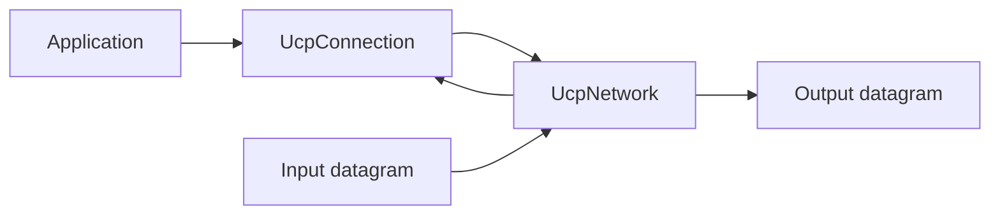

# UCP API Reference

[中文](api_CN.md) | [Documentation Index](index.md)

## Overview

UCP exposes three main API entry points: `UcpServer`, `UcpConnection`, and `UcpNetwork`. Protocol behavior is configured through `UcpConfiguration`.

## UcpConfiguration

Call `UcpConfiguration.GetOptimizedConfig()` for the recommended defaults.

### Protocol Parameters

| Parameter | Default | Purpose |
|---|---:|---|
| `Mss` | 1220 | Maximum segment size in bytes. High-bandwidth benchmarks use 9000. |
| `MaxRetransmissions` | 10 | Maximum retransmission attempts per outbound segment. |
| `SendBufferSize` | 32 MB | Maximum buffered outbound data. `WriteAsync` waits when full. |
| `ReceiveBufferSize` | about 20 MB | Derived from `RecvWindowPackets * Mss`. |
| `InitialCwndPackets` | 20 | Initial congestion window in packets. |
| `InitialCwndBytes` | derived | Convenience setter that converts bytes to packets. |
| `MaxCongestionWindowBytes` | 64 MB | Hard cap for BBR congestion window. |
| `SendQuantumBytes` | `Mss` | Send quantum used by pacing token consumption. |
| `AckSackBlockLimit` | 149 | Maximum SACK blocks per ACK, still bounded by MSS. |

### RTO And Timers

| Parameter | Default | Purpose |
|---|---:|---|
| `MinRtoMicros` | 200,000 | Minimum retransmission timeout. |
| `MaxRtoMicros` | 15,000,000 | Maximum retransmission timeout. |
| `RetransmitBackoffFactor` | 1.2 | RTO backoff multiplier. |
| `ProbeRttIntervalMicros` | 30,000,000 | BBR ProbeRTT interval. |
| `ProbeRttDurationMicros` | 100,000 | Minimum ProbeRTT duration. |
| `KeepAliveIntervalMicros` | 1,000,000 | Idle keep-alive interval. |
| `DisconnectTimeoutMicros` | 4,000,000 | Idle disconnect timeout. |
| `TimerIntervalMilliseconds` | 20 | Internal timer tick interval. |
| `DelayedAckTimeoutMicros` | 2,000 | Delayed ACK coalescing timeout. Use `0` to disable. |

### Pacing And BBR

| Parameter | Default | Purpose |
|---|---:|---|
| `MinPacingIntervalMicros` | 0 | No extra minimum packet gap beyond token bucket by default. |
| `PacingBucketDurationMicros` | 10,000 | Token bucket capacity window. |
| `StartupPacingGain` | 2.0 | BBR Startup pacing multiplier. |
| `StartupCwndGain` | 2.0 | BBR Startup CWND multiplier. |
| `DrainPacingGain` | 0.75 | BBR Drain pacing multiplier. |
| `ProbeBwHighGain` | 1.25 | ProbeBW up-phase gain. |
| `ProbeBwLowGain` | 0.85 | ProbeBW down-phase gain. |
| `ProbeBwCwndGain` | 2.0 | ProbeBW CWND gain. |
| `BbrWindowRtRounds` | 10 | Delivery-rate filter length in RTT rounds. |

### Bandwidth And Loss Control

| Parameter | Default | Purpose |
|---|---:|---|
| `InitialBandwidthBytesPerSecond` | 12.5 MB/s | Initial bottleneck bandwidth estimate. |
| `MaxPacingRateBytesPerSecond` | 12.5 MB/s | Pacing ceiling. Use `0` to disable the ceiling. |
| `ServerBandwidthBytesPerSecond` | 12.5 MB/s | Server egress bandwidth used by fair queue. |
| `LossControlEnable` | `true` | Enables loss-aware pacing/CWND response after congestion classification. |
| `MaxBandwidthLossPercent` | 25% | Loss budget clamped to 15%-35%; used only after congestion evidence. |
| `MaxBandwidthWastePercent` | 25% | Bandwidth waste budget used by controller heuristics. |

### FEC

| Parameter | Default | Purpose |
|---|---:|---|
| `FecRedundancy` | 0.0 | `0.125` means one XOR repair for each group of eight packets. |
| `FecGroupSize` | 8 | DATA packets per FEC group. |

## UcpServer

```csharp
public class UcpServer : IUcpObject, IDisposable
```

| Method | Purpose |
|---|---|
| `Start(int port)` | Start listening on a UDP port. |
| `AcceptAsync()` | Wait for a new client connection and return `UcpConnection`. |
| `Stop()` | Stop listening and close managed connections. |

## UcpConnection

```csharp
public class UcpConnection : IUcpObject, IDisposable
```

### Connection Management

| Method | Purpose |
|---|---|
| `ConnectAsync(IPEndPoint remote)` | Connect to a remote endpoint. |
| `Close()` / `CloseAsync()` | Gracefully close with FIN. |

### Sending

| Method | Purpose |
|---|---|
| `Send(byte[], offset, count)` | Synchronous send into the send buffer; does not wait for remote ACK. |
| `SendAsync(byte[], offset, count)` | Asynchronous send into the send buffer. |
| `Write(byte[], offset, count)` | Synchronous reliable write into the send buffer. |
| `WriteAsync(byte[], offset, count)` | Asynchronous reliable write; returns true after all bytes are accepted by the send buffer. |

`Write` and `WriteAsync` guarantee send-buffer acceptance, not remote delivery. Use reads or application-level ACKs when remote consumption matters.

### Receiving

| Method | Purpose |
|---|---|
| `Receive(byte[], offset, count)` | Synchronous read from the ordered delivery queue. |
| `ReceiveAsync(byte[], offset, count)` | Asynchronous read from the ordered delivery queue. |
| `Read(byte[], offset, count)` | Loop until exactly `count` bytes are read. |
| `ReadAsync(byte[], offset, count)` | Async exact-byte read. |

### Events

| Event | Raised When |
|---|---|
| `OnData` / `OnDataReceived` | Ordered payload reaches the application. |
| `OnConnected` | Handshake completes. |
| `OnDisconnected` | Connection closes. |

### Diagnostics

`GetReport()` returns `UcpTransferReport`. `RetransmissionRatio` is protocol-side sender repair overhead, not physical network loss. Benchmark `Loss%` is measured by `NetworkSimulator`.

## UcpNetwork

`UcpNetwork` decouples the protocol engine from socket implementation. `DoEvents()` drives timers, delayed flushes, RTO checks, and fair-queue rounds.



## Example

```csharp
using Ucp;

var config = UcpConfiguration.GetOptimizedConfig();
config.ServerBandwidthBytesPerSecond = 100_000_000 / 8;

using var server = new UcpServer(config);
server.Start(9000);
Task<UcpConnection> acceptTask = server.AcceptAsync();

using var client = new UcpConnection(config);
await client.ConnectAsync(new IPEndPoint(IPAddress.Loopback, 9000));
UcpConnection serverConnection = await acceptTask;

byte[] data = Encoding.UTF8.GetBytes("Hello UCP");
await client.WriteAsync(data, 0, data.Length);

byte[] received = new byte[data.Length];
await serverConnection.ReadAsync(received, 0, received.Length);
```
