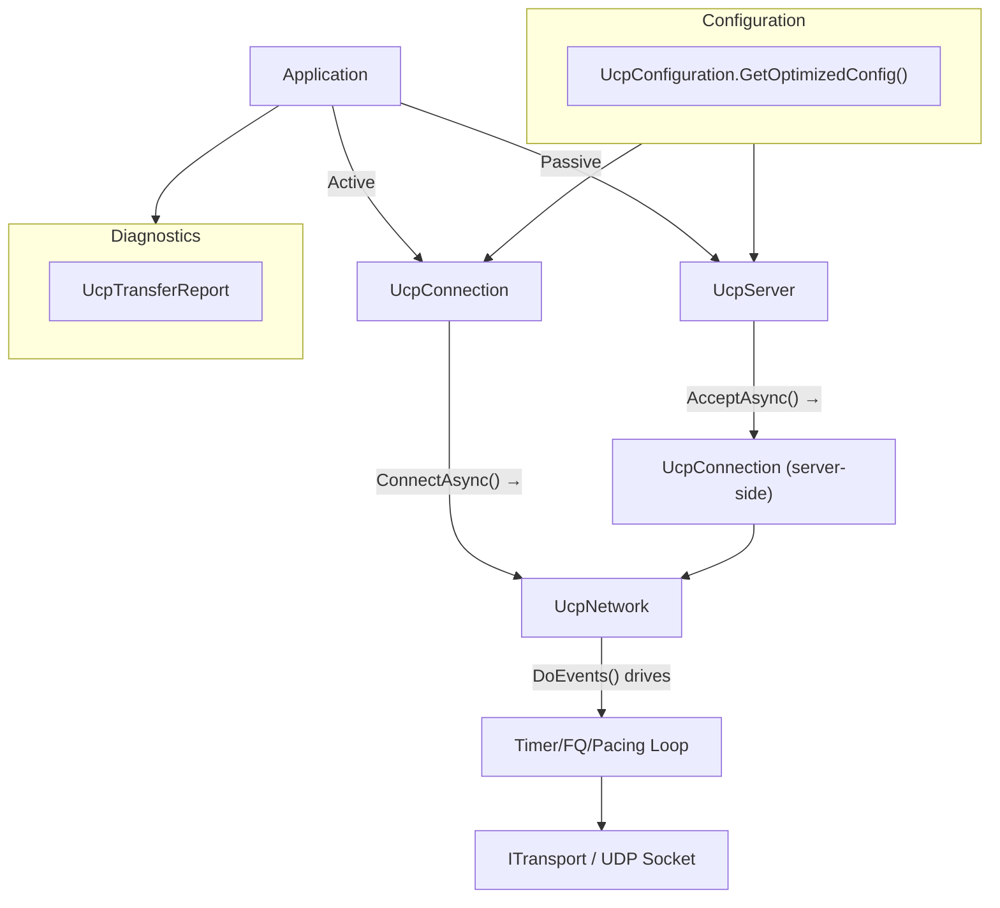
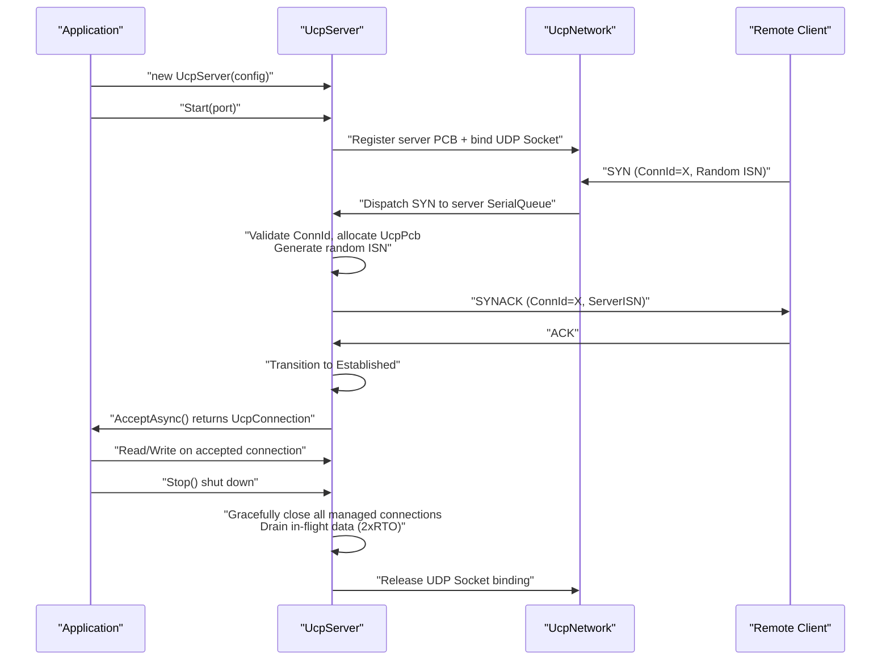
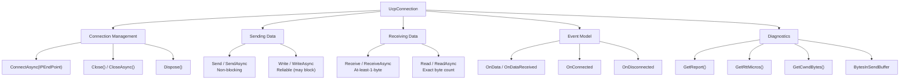
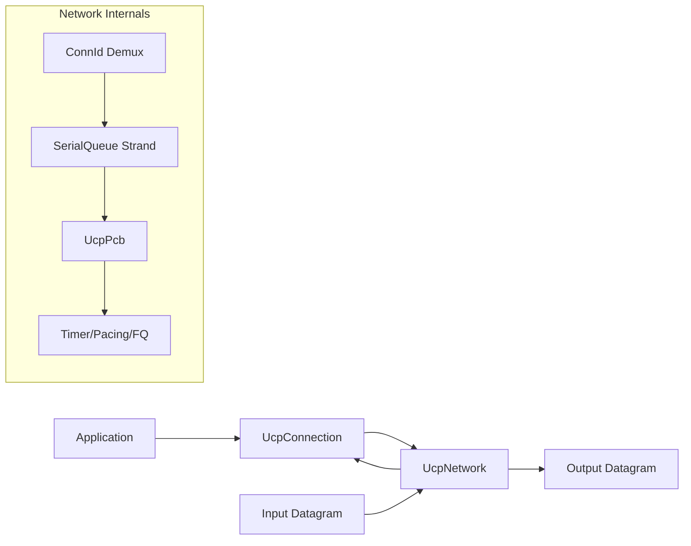

# PPP PRIVATE NETWORK™ X — Universal Communication Protocol (UCP) — API Reference

[中文](api_CN.md) | [Documentation Index](index.md)

**Protocol designation: `ppp+ucp`** — This document provides the complete public API reference for the UCP library, covering UcpConfiguration (all configurable parameters in 6 groups, 40+ parameters), UcpServer passive connection lifecycle, UcpConnection bidirectional data transfer and diagnostics, UcpNetwork event loop driver, ITransport custom transport integration, a complete end-to-end example, and error handling strategies.

---

## API Architecture Overview

UCP exposes three main API entry points and a configuration factory. Components collaborate through the `UcpNetwork` unified event loop:



---

## UcpConfiguration — Configuration Factory

Static method `UcpConfiguration.GetOptimizedConfig()` returns a recommended default configuration instance calibrated against the benchmark matrix. All parameters can be overridden on the returned instance.

### 1. Protocol Parameters

| Parameter | Type | Default | Range | Description |
|---|---|---|---|---|
| `Mss` | `int` | 1220 | 200–9000 | Maximum segment size in bytes. Controls fragmentation threshold. High-bandwidth (≥1Gbps) use 9000 for jumbo frames. Affects SACK block capacity. |
| `MaxRetransmissions` | `int` | 10 | 3–100 | Max retransmission attempts per outbound segment before declaring the connection dead. Higher for satellite paths. |
| `SendBufferSize` | `long` | 32 MB | 1–256 MB | Outbound buffer capacity. `WriteAsync` blocks when full, providing natural backpressure. Should be ≥ BDP. |
| `ReceiveBufferSize` | `long` | ~20 MB | auto-derived | Derived from `RecvWindowPackets × Mss`. Guards against memory exhaustion from fast senders. |
| `InitialCwndPackets` | `int` | 20 | 4–200 | BBRv2 initial congestion window in packets. BBRv2 Startup grows rapidly beyond this. Increase for high-BDP paths. |
| `InitialCwndBytes` | `long` | auto-derived | — | Convenience setter: specify initial CWND in bytes, internally converts to packets using current MSS. |
| `MaxCongestionWindowBytes` | `long` | 64 MB | 64 KB–256 MB | Hard cap for BBRv2 CWND. Increase for paths where BDP exceeds 64 MB (e.g., 10 Gbps × 300ms ≈ 375 MB). |
| `SendQuantumBytes` | `int` | `Mss` | MSS–MSS×4 | Pacing token consumption granularity. Each send attempt consumes this many tokens. |
| `AckSackBlockLimit` | `int` | 149 | 1–255 | Max SACK blocks per ACK. Bounded by MSS to ensure ACK fits in a single datagram. |

### 2. RTO and Timers

| Parameter | Type | Default | Range | Description |
|---|---|---|---|---|
| `MinRtoMicros` | `long` | 200,000 µs (200ms) | 50,000–1,000,000 | Minimum retransmission timeout. Balances fast recovery on lossy LAN against premature timeout on jittery paths. |
| `MaxRtoMicros` | `long` | 15,000,000 µs (15s) | 1,000,000–60,000,000 | Maximum RTO. Connection declared dead if no ACK progress within this period. |
| `RetransmitBackoffFactor` | `double` | 1.2 | 1.1–2.0 | RTO multiplier per consecutive timeout. Milder than TCP's 2.0 for faster dead-path detection. |
| `ProbeRttIntervalMicros` | `long` | 30,000,000 µs (30s) | 5,000,000–120,000,000 | BBRv2 ProbeRTT triggering interval. Periodically drops CWND to 4 packets to refresh MinRTT. |
| `ProbeRttDurationMicros` | `long` | 100,000 µs (100ms) | 50,000–500,000 | Minimum ProbeRTT duration. Keeps CWND at 4 packets for this period. |
| `KeepAliveIntervalMicros` | `long` | 1,000,000 µs (1s) | 100,000–30,000,000 | Idle keep-alive interval. Prevents NAT/firewall timeout on idle connections. |
| `DisconnectTimeoutMicros` | `long` | 4,000,000 µs (4s) | 500,000–60,000,000 | Idle disconnect timeout. Connection auto-closed if no data exchanged within this period. Increase for mobile. |
| `TimerIntervalMilliseconds` | `int` | 20 | 1–100 | Internal timer tick interval driving `DoEvents()` rounds. |
| `DelayedAckTimeoutMicros` | `long` | 2,000 µs (2ms) | 0–10,000 | Delayed ACK coalescing timeout. Set `0` to disable for minimal sender latency. |

### 3. Pacing and BBRv2 Gains

| Parameter | Type | Default | Range | Description |
|---|---|---|---|---|
| `MinPacingIntervalMicros` | `long` | 0 | 0–10,000 | No artificial minimum inter-packet gap. Token bucket fully controls pacing timing. |
| `PacingBucketDurationMicros` | `long` | 10,000 µs (10ms) | 1,000–100,000 | Token bucket capacity window. Larger allows bigger bursts. |
| `StartupPacingGain` | `double` | 2.5 | 1.5–4.0 | BBRv2 Startup pacing gain multiplier. High gain for aggressive bottleneck probing. |
| `StartupCwndGain` | `double` | 2.0 | 1.5–4.0 | BBRv2 Startup CWND gain multiplier. |
| `DrainPacingGain` | `double` | 0.75 | 0.3–1.0 | BBRv2 Drain pacing gain. Below 1.0 to drain the Startup-accumulated queue. |
| `ProbeBwHighGain` | `double` | 1.25 | 1.1–1.5 | ProbeBW up-phase gain to probe for more bandwidth. |
| `ProbeBwLowGain` | `double` | 0.85 | 0.5–0.95 | ProbeBW down-phase gain to drain queues. |
| `ProbeBwCwndGain` | `double` | 2.0 | 1.5–3.0 | ProbeBW steady-state CWND gain. |
| `BbrWindowRtRounds` | `int` | 10 | 6–20 | BtlBw delivery-rate filter window in RTT rounds. |

### 4. Bandwidth and Loss Control

| Parameter | Type | Default | Range | Description |
|---|---|---|---|---|
| `InitialBandwidthBytesPerSecond` | `long` | 12,500,000 (100 Mbps) | 125,000–1,250,000,000 | Initial bottleneck bandwidth estimate before delivery-rate samples are available. |
| `MaxPacingRateBytesPerSecond` | `long` | 12,500,000 | 0–∞ | Pacing rate ceiling. Set to `0` to disable the ceiling entirely. |
| `ServerBandwidthBytesPerSecond` | `long` | 12,500,000 | 125,000–1,250,000,000 | Server egress bandwidth for fair-queue credit distribution. |
| `LossControlEnable` | `bool` | `true` | — | Enable loss-aware pacing/CWND adaptation after congestion classification. |
| `MaxBandwidthLossPercent` | `int` | 25 | 15–35 | Loss budget percentage ceiling after congestion evidence. |

### 5. FEC Parameters

| Parameter | Type | Default | Range | Description |
|---|---|---|---|---|
| `FecRedundancy` | `double` | 0.0 | 0.0–1.0 | Base RS-GF(256) redundancy. `0.125` = 1 repair per 8 data; `0.25` = 2 repairs per 8; `0.0` = FEC disabled. |
| `FecGroupSize` | `int` | 8 | 2–64 | DATA packets per FEC group. Smaller = lower latency but higher overhead. Max 64. |
| `FecAdaptiveEnable` | `bool` | `true` | — | Enable adaptive FEC: automatic redundancy adjustment based on observed loss rate (five tiers). |

### 6. Connection and Session

| Parameter | Type | Default | Description |
|---|---|---|---|
| `UseConnectionIdTracking` | `bool` | `true` | When enabled, connections tracked by random 32-bit ConnId. Enables NAT rebinding resilience and IP mobility. |
| `DynamicIpBindingEnable` | `bool` | `true` | Server binds `IPAddress.Any`, accepting connections on any acquired address. |

---

## UcpServer — Server API

```csharp
public class UcpServer : IUcpObject, IDisposable
```

### Server Lifecycle



### Methods

| Method | Return | Description |
|---|---|---|
| `Start(int port)` | `void` | Start listening on specified UDP port. `port=0` for OS-assigned ephemeral port. |
| `Start(IPEndPoint endpoint)` | `void` | Start listening on specific IP endpoint for static addressing. |
| `AcceptAsync()` | `Task<UcpConnection>` | Wait for new client connection, return fully established `UcpConnection`. |
| `Stop()` | `void` | Stop listening and gracefully close all managed connections. |

---

## UcpConnection — Connection API

```csharp
public class UcpConnection : IUcpObject, IDisposable
```



### Connection Management

| Method | Description |
|---|---|
| `ConnectAsync(IPEndPoint remote)` | Initiate connection. Generates random ISN (crypto PRNG) and random ConnId. Returns when three-way handshake completes. |
| `Close()` | Synchronously initiate FIN graceful close. |
| `CloseAsync()` | Asynchronously initiate graceful close. Returns when FIN is acknowledged. |
| `Dispose()` | Release all resources. Force-closes if still active. |

### Sending Data

| Method | Blocks? | Description |
|---|---|---|
| `Send` / `SendAsync` | Never | Write to send buffer immediately. Does not wait for remote ACK or pacing token. |
| `Write` / `WriteAsync` | When buffer full | Reliable write. Blocks/awaits when send buffer is full (>SendBufferSize). **Recommended for production** — provides backpressure. |

### Receiving Data

| Method | Waits? | Description |
|---|---|---|
| `Receive` / `ReceiveAsync` | Until ≥1 byte available | Read from ordered delivery queue. Returns actual bytes read (may be < count). |
| `Read` / `ReadAsync` | Until exactly `count` bytes | Exact-byte-count read. Internally loops until all requested bytes arrive. **Recommended for fixed-length protocols.** |

### Events

| Event | Triggers When |
|---|---|
| `OnData` / `OnDataReceived` | Ordered payload bytes reach application layer. Called on SerialQueue strand. |
| `OnConnected` | Three-way handshake completes. `IsConnected` becomes `true`. |
| `OnDisconnected` | Connection closes (FIN exchange complete or timeout/RST). |

### Diagnostics

| Method/Property | Return Type | Description |
|---|---|---|
| `GetReport()` | `UcpTransferReport` | Full transfer statistics snapshot: throughput, RTT stats, retrans ratio, CWND, pacing rate, convergence time. |
| `GetRttMicros()` | `long` | Current smoothed RTT estimate in microseconds. |
| `GetCwndBytes()` | `long` | Current BBRv2 congestion window in bytes. |
| `BytesInSendBuffer` | `long` (property) | Bytes currently buffered awaiting initial transmission. |

### Connection State Properties

| Property | Type | Description |
|---|---|---|
| `IsConnected` | `bool` | `true` when handshake complete and in Established state |
| `IsDisconnected` | `bool` | `true` when connection closed or timed out |
| `ConnectionId` | `uint` | Random 32-bit connection identifier for this session |
| `RemoteEndPoint` | `IPEndPoint` | Remote peer's current IP endpoint (may change on NAT rebinding) |

---

## UcpNetwork — Network Driver API



### DoEvents

```csharp
public void DoEvents()
```

`DoEvents()` is the heartbeat of the UCP network layer. Must be called periodically (recommended every `TimerIntervalMilliseconds`=20ms) to:
- Process inbound datagrams from the transport socket
- Dispatch timer ticks for RTO checking, keep-alive, disconnect timeout
- Execute fair-queue credit rounds (server side)
- Flush outbound datagrams queued by pacing and fair-queue logic
- Update BBRv2 delivery-rate samples

### ITransport

```csharp
public interface ITransport
{
    void Send(byte[] data, int length);
    int Receive(byte[] buffer);
    IPEndPoint RemoteEndPoint { get; }
}
```

Implement `ITransport` to integrate UCP with non-UDP transports (WebRTC DataChannel, in-process simulation, encrypted tunnels, shared memory IPC). The built-in `UdpTransport` wraps a standard .NET `UdpClient`.

---

## Complete End-to-End Example

```csharp
using Ucp;
using System.Net;
using System.Text;

var config = UcpConfiguration.GetOptimizedConfig();
config.ServerBandwidthBytesPerSecond = 100_000_000 / 8; // 100 Mbps
config.FecRedundancy = 0.125;                            // 1 repair per 8 data
config.Mss = 9000;                                       // Jumbo frames
config.StartupPacingGain = 2.0;                          // Conservative startup

// ========== Server ==========
using var server = new UcpServer(config);
server.Start(9000);
Console.WriteLine($"Server listening on port {((IPEndPoint)server.LocalEndPoint).Port}");
Task<UcpConnection> acceptTask = server.AcceptAsync();

// ========== Client ==========
using var client = new UcpConnection(config);

client.OnConnected += () => Console.WriteLine("[Client] Connected!");
client.OnDataReceived += (data, offset, count) =>
{
    string msg = Encoding.UTF8.GetString(data, offset, count);
    Console.WriteLine($"[Client] Received: {msg}");
};
client.OnDisconnected += () => Console.WriteLine("[Client] Disconnected");

await client.ConnectAsync(new IPEndPoint(IPAddress.Loopback, 9000));
UcpConnection serverConnection = await acceptTask;

// ========== Bidirectional Exchange ==========
byte[] request = Encoding.UTF8.GetBytes("Hello from PPP PRIVATE NETWORK™ X — UCP (ppp+ucp)!");
await client.WriteAsync(request, 0, request.Length);
Console.WriteLine($"Client sent {request.Length} bytes");

byte[] response = new byte[request.Length];
int bytesRead = await serverConnection.ReadAsync(response, 0, response.Length);
string received = Encoding.UTF8.GetString(response, 0, bytesRead);
Console.WriteLine($"Server received: {received}");

// Server reply
byte[] reply = Encoding.UTF8.GetBytes("Server ACK: message received!");
await serverConnection.WriteAsync(reply, 0, reply.Length);
byte[] replyBuf = new byte[reply.Length];
await client.ReadAsync(replyBuf, 0, replyBuf.Length);
Console.WriteLine($"Client received reply: {Encoding.UTF8.GetString(replyBuf)}");

// ========== Diagnostics ==========
var report = client.GetReport();
Console.WriteLine($"\n=== Transfer Report ===");
Console.WriteLine($"Throughput:   {report.ThroughputMbps:F2} Mbps");
Console.WriteLine($"Avg RTT:      {report.AverageRttMs:F2} ms");
Console.WriteLine($"Retrans Ratio:{report.RetransmissionRatio:P1}");
Console.WriteLine($"CWND:         {report.CwndBytes / 1024} KB");
Console.WriteLine($"Pacing Rate:  {report.CurrentPacingRateMbps:F2} Mbps");
Console.WriteLine($"Convergence:  {report.ConvergenceTime}");

// ========== Cleanup ==========
await client.CloseAsync();
await serverConnection.CloseAsync();
server.Stop();
Console.WriteLine("Clean shutdown complete");
```

---

## Error Handling

| Exception Type | When | Recovery Suggestion |
|---|---|---|
| `UcpException` | Protocol-level failure: handshake timeout, max retransmissions exceeded, connection refused | Retry with reasonable backoff, check reachability and config compatibility |
| `ObjectDisposedException` | Operations on a disposed `UcpConnection`/`UcpServer` | Check object lifecycle before calling; use `using` statements |
| `InvalidOperationException` | `Write`/`WriteAsync` after `Close()`, sending before connection established | Ensure `IsConnected==true` before sending |
| `SocketException` | Underlying UDP socket errors (port conflict, network unreachable) | Change port on conflict, check network config |

`OnDisconnected` fires for both graceful and error closures. Check `IsConnected` and `IsDisconnected` to determine terminal state. The event fires on the SerialQueue strand, so calling connection methods from within the handler is safe (but avoid synchronous blocking waits inside handlers).
