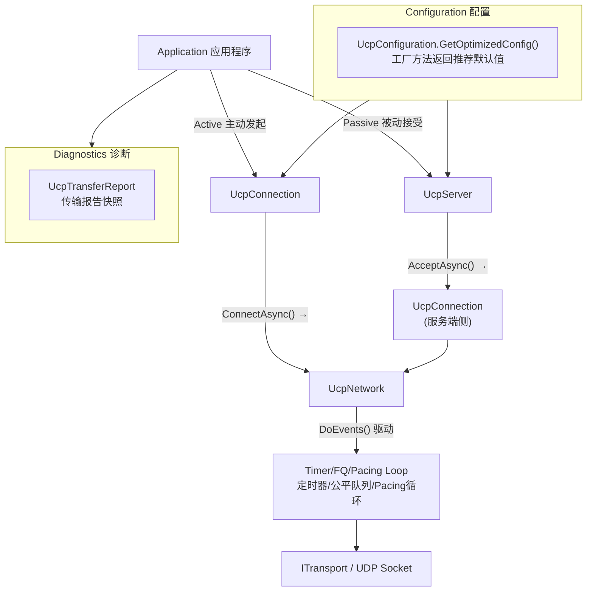
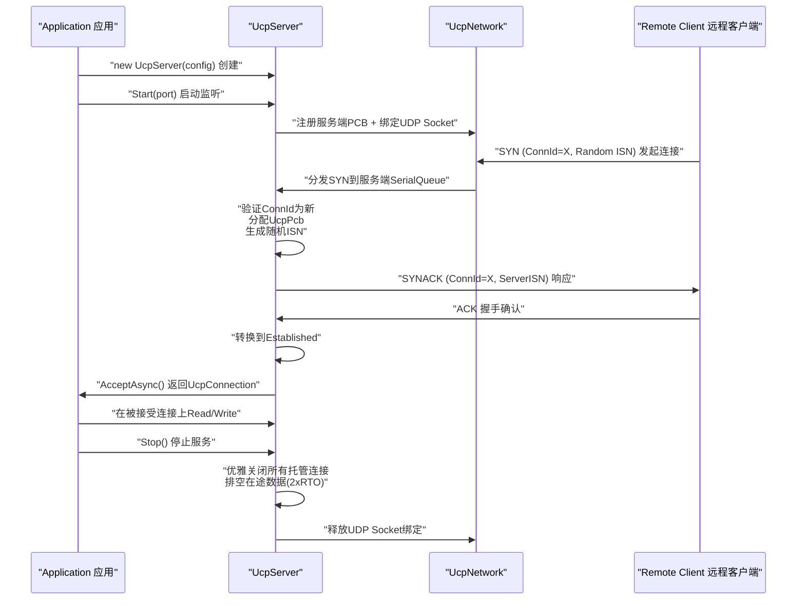
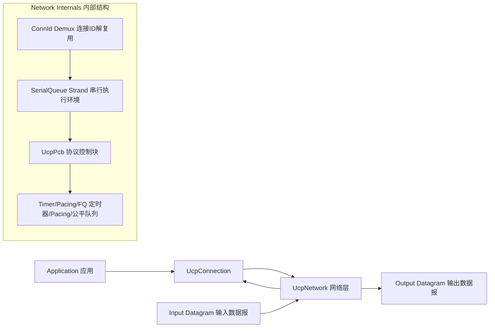

# PPP PRIVATE NETWORK™ X — 通用通信协议 (UCP) — API 参考

[English](api.md) | [文档索引](index_CN.md)

**协议标识: `ppp+ucp`** — 本文档详尽描述 UCP 库的公开 API 接口，覆盖 UcpConfiguration 全部可配参数（6个分类共40+参数）、UcpServer 被动连接生命周期、UcpConnection 双向数据传输与诊断、UcpNetwork 事件循环驱动、ITransport 自定义传输集成、完整端到端示例及错误处理策略。

---

## API 架构总览

UCP 暴露三大 API 入口和一组配置工厂。各组件通过 `UcpNetwork` 统一事件循环协作：



---

## UcpConfiguration — 配置工厂

静态方法 `UcpConfiguration.GetOptimizedConfig()` 返回面向广泛网络条件基准调优的推荐默认配置实例。所有参数均可在此实例上按需覆盖。

### 1. 协议参数组

| 参数 | 类型 | 默认值 | 取值范围 | 详细说明 |
|---|---|---|---|---|
| `Mss` | `int` | 1220 | 200–9000 | 最大分段大小（字节）。控制分片阈值：超过此值的 WriteAsync 调用自动分片为多个 DATA 包。高带宽基准（>1Gbps）设为 9000 以显著降低头部开销（巨型帧模式）。影响 SACK 块容量（ACK 包必须适应一个数据报且包含所有 SACK 块，较大的 MSS 允许更多 SACK 块）。 |
| `MaxRetransmissions` | `int` | 10 | 3–100 | 每个出站分段的最大重传尝试次数。超过此次数后连接判定死亡并触发断开（RST 可选发送）。较高值适用于极高 RTT 路径（卫星），较低值适合快速失败检测。 |
| `SendBufferSize` | `long` | 32 MB | 1 MB–256 MB | 出站发送缓冲上限（字节）。`WriteAsync` 在缓冲满时阻塞（await），为应用层提供天然背压。应 ≥ BDP（BtlBw × RTT）以确保链路填满。 |
| `ReceiveBufferSize` | `long` | ~20 MB | 自动推导 | 派生自 `RecvWindowPackets × Mss`，防止快速发送方导致内存耗尽。通过接收窗口（WindowSize 字段）通告给对端进行流控。 |
| `InitialCwndPackets` | `int` | 20 | 4–200 | BBRv2 初始拥塞窗口（包数）。BBRv2 Startup 模式会从此值迅速增长至瓶颈带宽，但此初始值影响最初几 RTT 的吞吐。高 BDP 路径应适当增大。 |
| `InitialCwndBytes` | `long` | 自动推导 | — | 便捷设置器：以字节指定初始 CWND，内部使用当前 MSS 换算为包数。与 `InitialCwndPackets` 互斥。 |
| `MaxCongestionWindowBytes` | `long` | 64 MB | 64 KB–256 MB | BBRv2 拥塞窗口硬上限。防止在极高 BDP 路径上内存失控增长。10 Gbps × 300ms RTT ≈ 375 MB BDP，需相应调大此值。 |
| `SendQuantumBytes` | `int` | `Mss` | MSS–MSS×4 | Pacing Token 单次消费的最小粒度。每次发送尝试从 Token Bucket 消费此数量的 Token。较大值减少 Token 检查频率但增加突发大小。 |
| `AckSackBlockLimit` | `int` | 149 | 1–255 | 每个 ACK 包最大 SACK 块数。在默认 MSS(1220) 下 149 块恰好填满一个数据报。较小 MSS 自动缩小此限制以确保 ACK 适应单个数据报。 |

### 2. RTO 与定时器组

| 参数 | 类型 | 默认值 | 取值范围 | 详细说明 |
|---|---|---|---|---|
| `MinRtoMicros` | `long` | 200,000 µs (200ms) | 50,000–1,000,000 | 最小重传超时。低延迟路径上防止过早 RTO 触发。200ms 在丢包 LAN（快速检测）和高抖动路径（防止过早超时）间取得平衡。 |
| `MaxRtoMicros` | `long` | 15,000,000 µs (15s) | 1,000,000–60,000,000 | 最大重传超时。为 1.2× 退避提供上限。连接在此时间无 ACK 进展后判定死亡。 |
| `RetransmitBackoffFactor` | `double` | 1.2 | 1.1–2.0 | 连续超时的 RTO 乘数。1.2× 下逐次为：200→240→288→346→415→...→15s。TCP 用 2.0×（200→400→800→...），UCP 更温和的设计更快检测死路径。 |
| `ProbeRttIntervalMicros` | `long` | 30,000,000 µs (30s) | 5,000,000–120,000,000 | BBRv2 ProbeRTT 触发间隔。定期将 CWND 降至 4 包以刷新 MinRTT 估计。丢包长肥管路径的 BBRv2 自动跳过 ProbeRTT。 |
| `ProbeRttDurationMicros` | `long` | 100,000 µs (100ms) | 50,000–500,000 | ProbeRTT 最短持续时间。在此期间 CWND 保持 4 包让路径队列完全排空以获取准确 MinRTT。 |
| `KeepAliveIntervalMicros` | `long` | 1,000,000 µs (1s) | 100,000–30,000,000 | 空闲连接保活间隔。UCP 在空闲时发送最小保活包（ACK 包或空 DATA 包）防止 NAT/防火墙超时清除会话。 |
| `DisconnectTimeoutMicros` | `long` | 4,000,000 µs (4s) | 500,000–60,000,000 | 空闲断连超时：此期间无数据交换则连接被自动关闭。移动网络建议增大（≥15s）以容忍临时信号丢失。 |
| `TimerIntervalMilliseconds` | `int` | 20 | 1–100 | 内部定时器刻度间隔，驱动 `DoEvents()` 轮次。较小值提升响应性（更及时处理入站包/timer）但增加 CPU 开销。 |
| `DelayedAckTimeoutMicros` | `long` | 2,000 µs (2ms) | 0–10,000 | 延迟 ACK 聚合超时。无可捎带数据时，ACK 在此时间内等待可能捎带的机会。设为 `0` 禁用延迟以最小化发送端等待。 |

### 3. Pacing 与 BBRv2 增益组

| 参数 | 类型 | 默认值 | 取值范围 | 详细说明 |
|---|---|---|---|---|
| `MinPacingIntervalMicros` | `long` | 0 | 0–10,000 | 无人工最小包间隔。Token Bucket 全权控制 Pacing 时序。设为非零值可限制最大包速率。 |
| `PacingBucketDurationMicros` | `long` | 10,000 µs (10ms) | 1,000–100,000 | Token Bucket 容量窗口。更大值允许更大突发（≤ PacingRate × 时长），但可能造成更不均匀的发送模式。 |
| `StartupPacingGain` | `double` | 2.5 | 1.5–4.0 | BBRv2 Startup 阶段 Pacing 增益乘数。高增益快速探测瓶颈容量。已知狭窄瓶颈可降低以避免过度排队。 |
| `StartupCwndGain` | `double` | 2.0 | 1.5–4.0 | BBRv2 Startup 阶段 CWND 增益乘数。与 Pacing 增益配合，确保在途数据足以探测瓶颈。 |
| `DrainPacingGain` | `double` | 0.75 | 0.3–1.0 | BBRv2 Drain 阶段 Pacing 增益。低于 1.0 将 Startup 期间累积的队列排空回瓶颈容量以下。 |
| `ProbeBwHighGain` | `double` | 1.25 | 1.1–1.5 | ProbeBW 上探阶段 Pacing 增益。暂短提高速率以探测是否有更多带宽可用。发现则提高 BtlBw 估计。 |
| `ProbeBwLowGain` | `double` | 0.85 | 0.5–0.95 | ProbeBW 下探阶段 Pacing 增益。暂短降低速率以排空上探阶段累积的队列并刷新 MinRTT 样本。 |
| `ProbeBwCwndGain` | `double` | 2.0 | 1.5–3.0 | ProbeBW 稳态 CWND 增益。保持在途数据为 BDP 的 2 倍以容忍投递率波动。 |
| `BbrWindowRtRounds` | `int` | 10 | 6–20 | BtlBw 最大投递率滤波窗口（RTT 轮数）。较大值提供更平滑的 BtlBw 估计但响应带宽变化更慢。 |

### 4. 带宽与丢包控制组

| 参数 | 类型 | 默认值 | 取值范围 | 详细说明 |
|---|---|---|---|---|
| `InitialBandwidthBytesPerSecond` | `long` | 12,500,000 (100 Mbps) | 125,000–1,250,000,000 | 有投递率样本前的初始瓶颈带宽估计。接近实际瓶颈的值可加速 BBRv2 收敛。 |
| `MaxPacingRateBytesPerSecond` | `long` | 12,500,000 | 0–∞ | Pacing 速率天花板。设为 `0` 完全关闭上限，让 BBRv2 自由驱动 Pacing 速率至瓶颈容量。有带宽限制需求时设置此值。 |
| `ServerBandwidthBytesPerSecond` | `long` | 12,500,000 | 125,000–1,250,000,000 | 服务端出口带宽，供公平队列调度器按此值分配每连接 credit。应与服务端实际上行带宽匹配。 |
| `LossControlEnable` | `bool` | `true` | — | BBRv2 拥塞分类确认后启用丢包感知的 Pacing 速率/CWND 自适应调整。禁用后 BBRv2 使用标准增益循环忽略丢包信号。 |
| `MaxBandwidthLossPercent` | `int` | 25 | 15–35 | 拥塞证据成立后的丢包预算百分比。内部限制 15-35% 范围。实际丢包率超此值时 BBRv2 可能额外降速。 |
| `MaxBandwidthWastePercent` | `int` | 25 | — | 带宽浪费预算百分比，用于 Pacing 债务管理。限制紧急重传和 RTO 恢复带来的额外带宽消耗。 |

### 5. FEC 参数组

| 参数 | 类型 | 默认值 | 取值范围 | 详细说明 |
|---|---|---|---|---|
| `FecRedundancy` | `double` | 0.0 | 0.0–1.0 | 基础 RS-GF(256) 冗余比例。关键取值：`0.125` = 每8个数据包1个修复包、`0.25` = 每8个2个修复包、`0.0` = FEC 完全禁用。自适应模式下此值为基础，实际冗余按观测丢包率动态调整。 |
| `FecGroupSize` | `int` | 8 | 2–64 | 每 FEC 组的 DATA 包数量。更小组（如 4）延迟更低（更快编解码）但开销更大（修复包占比高）。更大组（如 32）编码效率更高但需等更多包才能开始编码。最大 64 受限于编解码器内部缓冲区。 |
| `FecAdaptiveEnable` | `bool` | `true` | — | 启用自适应 FEC：基于观测丢包率五级阈值自动调整有效冗余。关闭后始终使用基础 `FecRedundancy` 不变。 |

### 6. 连接与会话组

| 参数 | 类型 | 默认值 | 详细说明 |
|---|---|---|---|
| `UseConnectionIdTracking` | `bool` | `true` | 启用时连接由随机 32 位 ConnId（而非 IP:port）追踪。关闭后回退到传统 IP:port 追踪模型。启用可获得 NAT 重绑定韧性和 IP 移动性。 |
| `DynamicIpBindingEnable` | `bool` | `true` | 服务端绑定 `IPAddress.Any`（而非特定 IP），接受任意获取地址上的连接。在容器和多 IP 环境中至关重要。 |

---

## UcpServer — 服务端 API

```csharp
public class UcpServer : IUcpObject, IDisposable
```

`UcpServer` 管理被动连接接受，内置公平队列调度器确保跨连接公平带宽分配。

### 服务端生命周期



### 方法列表

| 方法 | 返回值 | 说明 |
|---|---|---|
| `Start(int port)` | `void` | 在指定 UDP 端口开始监听。`DynamicIpBindingEnable=true` 时绑定 `IPAddress.Any`；否则绑定默认接口地址。`port=0` 让 OS 分配临时端口。 |
| `Start(IPEndPoint endpoint)` | `void` | 在特定 IP 端点上监听，用于静态地址/多宿主环境。可绑定特定接口 IP 以限制接收范围。 |
| `AcceptAsync()` | `Task<UcpConnection>` | 等待新客户端连接并返回已完全握手的 `UcpConnection`。任务完成时连接的握手已完成并可立即通信。若无挂起连接则等待。 |
| `Stop()` | `void` | 停止监听并优雅关闭所有托管连接。每个连接在 2xRTO 期间排空在途数据后关闭。释放 UDP Socket 绑定。 |

---

## UcpConnection — 连接 API

```csharp
public class UcpConnection : IUcpObject, IDisposable
```

`UcpConnection` 代表单个 UCP 会话端点。所有操作在 `SerialQueue` 串行执行环境上执行，提供无锁线程安全。

```mermaid
flowchart TD
    Conn["UcpConnection 连接对象"] --> Mgmt["Connection Management 连接管理"]
    Conn --> Send["Sending Data 发送数据"]
    Conn --> Recv["Receiving Data 接收数据"]
    Conn --> Events["Event Model 事件模型"]
    Conn --> Diag["Diagnostics 诊断"]
    
    Mgmt --> Connect["ConnectAsync(IPEndPoint)"]
    Mgmt --> Close["Close() / CloseAsync()"]
    Mgmt --> Dispose["Dispose()"]
    
    Send --> SendM["Send / SendAsync<br/>非阻塞发送"]
    Send --> WriteM["Write / WriteAsync<br/>可靠写(可阻塞)"]
    
    Recv --> RecvM["Receive / ReceiveAsync<br/>至少1字节读取"]
    Recv --> ReadM["Read / ReadAsync<br/>精确字节数读取"]
    
    Events --> OnData["OnData / OnDataReceived<br/>有序数据到达"]
    Events --> OnConn["OnConnected<br/>握手完成"]
    Events --> OnDisc["OnDisconnected<br/>连接关闭"]
    
    Diag --> Report["GetReport()<br/>UcpTransferReport"]
    Diag --> RTT["GetRttMicros()<br/>当前平滑RTT"]
    Diag --> CWND["GetCwndBytes()<br/>当前拥塞窗口"]
    Diag --> Buf["BytesInSendBuffer<br/>待发送字节数"]
```



### 连接管理方法

| 方法 | 返回值/签名 | 说明 |
|---|---|---|
| `ConnectAsync(IPEndPoint remote)` | `Task` | 发起与远端端点的连接。生成随机 ISN（加密级 PRNG）和随机 ConnId（32 位防碰撞）。返回 Task 在三次握手完成后完成。超时或超过最大重试时抛 `UcpException`。 |
| `Close()` | `void` | 同步发起 FIN 优雅关闭。将 FIN 包排入发送队列，启动 disconnectTimer。不等待对端 ACK。 |
| `CloseAsync()` | `Task` | 异步发起优雅关闭。发送 FIN 后等待对端确认（或超时）。返回时连接已清理。 |
| `Dispose()` | `void` | 释放所有资源。若连接仍活跃则强制关闭（跳过优雅 FIN 交换）。必须调用以避免资源泄漏。 |

### 发送数据方法

| 方法 | 签名 | 阻塞行为 | 说明 |
|---|---|---|---|
| `Send` | `Send(byte[] buffer, int offset, int count)` | 从不阻塞 | 同步写入发送缓冲。数据立即排队以在下次 Pacing 许可时发送。不等待远端确认也不等待 Pacing Token。 |
| `SendAsync` | `SendAsync(byte[] buffer, int offset, int count)` | 从不阻塞 | `Send` 的异步版本。立即返回到发送缓冲的入列。 |
| `Write` | `Write(byte[] buffer, int offset, int count)` | 缓冲满时阻塞 | 同步可靠写入。若发送缓冲满（>SendBufferSize）则阻塞直到缓冲释放空间。保证数据被发送缓冲接受。 |
| `WriteAsync` | `WriteAsync(byte[] buffer, int offset, int count)` | 缓冲满时可 await | 异步可靠写入。缓冲满时 await 直到空间可用。**推荐用于生产代码**以提供背压而不阻塞线程。 |

重要说明：`Write`/`WriteAsync` 仅保证数据被**发送缓冲**接受，不保证远端已消费或已确认。若需端到端确认，请在应用层实现应用级 ACK 或使用 `ReadAsync` 在远端匹配消费。

### 接收数据方法

| 方法 | 签名 | 等待行为 | 说明 |
|---|---|---|---|
| `Receive` | `Receive(byte[] buffer, int offset, int count)` | 有数据前阻塞 | 同步从有序交付队列读取。返回实际读取的字节数（可能 < count）。无可读数据时阻塞等待。 |
| `ReceiveAsync` | `ReceiveAsync(byte[] buffer, int offset, int count)` | 有数据前 await | 异步读取。至少 1 字节可用时完成。返回实际读取字节数。读取位置在 offset，最多填 count 字节。 |
| `Read` | `Read(byte[] buffer, int offset, int count)` | 循环至读满 | 同步精读。内部循环调用 Receive 直到 count 字节全部读取。适用于固定长度消息协议。 |
| `ReadAsync` | `ReadAsync(byte[] buffer, int offset, int count)` | 满字节前 await | 异步精读。所有 count 字节到达有序队列后完成。**推荐用于固定长度协议**以实现简洁的接收端逻辑。 |

### 事件模型

| 事件 | 委托签名 | 触发时机 |
|---|---|---|
| `OnData` / `OnDataReceived` | `Action<byte[], int, int>` | 有序 payload 字节到达应用层。在连接专属 `SerialQueue` 串行执行环境上调用，保证与 Send/Receive 的顺序一致性。参数：(buffer, offset, count)。 |
| `OnConnected` | `Action` | 三次握手成功完成，连接转换到 Established 状态。此事件后 `IsConnected` 为 `true`。 |
| `OnDisconnected` | `Action` | 连接关闭（FIN 交换完成或超时/RST）。无论优雅关闭还是错误关闭均触发。事件触发后 `IsDisconnected` 为 `true`。 |

### 诊断 API

| 方法/属性 | 返回类型 | 说明 |
|---|---|---|
| `GetReport()` | `UcpTransferReport` | 当前传输统计完整快照，包含：`ThroughputMbps`、`AverageRttMs`、`RetransmissionRatio`、`CwndBytes`、`CurrentPacingRateMbps`、`ConvergenceTime` 等全 16 列指标。见性能文档了解各列详细语义。 |
| `GetRttMicros()` | `long` | 当前平滑 RTT 估计（UcpRtoEstimator 输出，微秒）。反映 SRTT 平滑值，非瞬时样本。 |
| `GetCwndBytes()` | `long` | 当前 BBRv2 拥塞窗口（字节）。反映允许同时在途的最大数据量。 |
| `BytesInSendBuffer` | `long`（属性） | 当前缓冲待首次传输的字节数。不含已发送待确认的重传数据。用于应用层背压监控。 |

### 连接状态属性

| 属性 | 类型 | 说明 |
|---|---|---|
| `IsConnected` | `bool` | 握手完成且连接处于 Established 状态时为 `true`。`false` 在握手前或关闭后。 |
| `IsDisconnected` | `bool` | 连接已关闭或超时时为 `true`。与 `IsConnected` 互斥。 |
| `ConnectionId` | `uint` | 本会话的 32 位随机连接标识。可用于日志和调试追踪。NAT 穿越后不变。 |
| `RemoteEndPoint` | `IPEndPoint` | 远端对等体的当前 IP 端点。NAT 重绑定时可能变化（新 IP:port 被 `ValidateRemoteEndPoint()` 透明接受）。 |

---

## UcpNetwork — 网络驱动 API

`UcpNetwork` 将协议引擎从具体 Socket 实现解耦，支持自定义传输层集成。



### DoEvents — 事件循环心跳

```csharp
public void DoEvents()
```

`DoEvents()` 是 UCP 网络层的心跳，必须周期性调用（推荐每 `TimerIntervalMilliseconds`=20ms）以执行以下操作：
- 从传输 Socket 接收并处理入站数据报
- 分发定时器刻度触发 RTO 检查、保活和断连超时
- 执行服务端公平队列 credit 轮次
- 刷新由 Pacing 和公平队列排队的出站数据报
- 更新 BBRv2 投递率样本

直接使用 `UcpNetwork` 的应用（而非 `UcpServer` 高层封装）需在循环或定时器中调用此方法。

### ITransport — 自定义传输接口

```csharp
public interface ITransport
{
    void Send(byte[] data, int length);
    int Receive(byte[] buffer);
    IPEndPoint RemoteEndPoint { get; }
}
```

实现 `ITransport` 可将 UCP 集成到非 UDP 传输层（如 WebRTC DataChannel、进程内模拟、加密隧道、共享内存 IPC）。内置 `UdpTransport` 封装标准 .NET `UdpClient`，处理 Socket 绑定、发送和接收。

---

## 完整端到端示例

```csharp
using Ucp;
using System.Net;
using System.Text;

// 初始化配置
var config = UcpConfiguration.GetOptimizedConfig();
config.ServerBandwidthBytesPerSecond = 100_000_000 / 8; // 100 Mbps
config.FecRedundancy = 0.125;                            // 每8包1修复
config.Mss = 9000;                                       // 巨型帧
config.StartupPacingGain = 2.0;                          // 保守启动

// ========== 服务端 ==========
using var server = new UcpServer(config);
server.Start(9000);
Console.WriteLine($"Server listening on port {((IPEndPoint)server.LocalEndPoint).Port}");

Task<UcpConnection> acceptTask = server.AcceptAsync();

// ========== 客户端 ==========
using var client = new UcpConnection(config);

client.OnConnected += () => Console.WriteLine("[Client] Connected!");
client.OnDataReceived += (data, offset, count) =>
{
    string msg = Encoding.UTF8.GetString(data, offset, count);
    Console.WriteLine($"[Client] Received: {msg}");
};
client.OnDisconnected += () => Console.WriteLine("[Client] Disconnected");

await client.ConnectAsync(new IPEndPoint(IPAddress.Loopback, 9000));
UcpConnection serverConnection = await acceptTask;

// ========== 双向数据交换 ==========
byte[] request = Encoding.UTF8.GetBytes("你好 PPP PRIVATE NETWORK™ X — UCP (ppp+ucp) 协议!");
await client.WriteAsync(request, 0, request.Length);
Console.WriteLine($"Client sent {request.Length} bytes");

byte[] response = new byte[request.Length];
int bytesRead = await serverConnection.ReadAsync(response, 0, response.Length);
string received = Encoding.UTF8.GetString(response, 0, bytesRead);
Console.WriteLine($"Server received: {received}");

// 服务端回复
byte[] reply = Encoding.UTF8.GetBytes("服务端确认: 消息已收到!");
await serverConnection.WriteAsync(reply, 0, reply.Length);
byte[] replyBuf = new byte[reply.Length];
await client.ReadAsync(replyBuf, 0, replyBuf.Length);
Console.WriteLine($"Client received reply: {Encoding.UTF8.GetString(replyBuf)}");

// ========== 传输诊断 ==========
var report = client.GetReport();
Console.WriteLine($"\n=== 传输报告 ===");
Console.WriteLine($"吞吐量:     {report.ThroughputMbps:F2} Mbps");
Console.WriteLine($"平均RTT:    {report.AverageRttMs:F2} ms");
Console.WriteLine($"重传率:     {report.RetransmissionRatio:P1}");
Console.WriteLine($"拥塞窗口:   {report.CwndBytes / 1024} KB");
Console.WriteLine($"Pacing速率: {report.CurrentPacingRateMbps:F2} Mbps");
Console.WriteLine($"收敛时间:   {report.ConvergenceTime}");

// ========== 清理 ==========
await client.CloseAsync();
await serverConnection.CloseAsync();
server.Stop();
Console.WriteLine("Clean shutdown complete");
```

---

## 错误处理

UCP 对以下条件抛出异常。所有异常均派生自标准 .NET 异常类以确保与现有错误处理框架兼容：

| 异常类型 | 触发条件 | 恢复建议 |
|---|---|---|
| `UcpException` | 协议级失败：握手超时（connectTimer 超最大 RTO）、重传次数超限（>MaxRetransmissions）、连接被拒绝（服务端资源不足或 ConnId 冲突）。| 重试连接（合理退避）、检查远端可达性和配置兼容性。 |
| `ObjectDisposedException` | 在已 Dispose 的 `UcpConnection` 或 `UcpServer` 上调用任何方法。| 确保在调用前检查对象生命周期。使用 `using` 语句或显式 Dispose 管理。 |
| `InvalidOperationException` | `Write`/`WriteAsync` 在 `Close()` 后调用、在未建立连接前调用发送/接收方法。| 确保在 `IsConnected==true` 时发送、在连接关闭前完成所有发送。 |
| `SocketException` | 底层 UDP Socket 错误（端口被占用、网络不可达、Socket 被关闭）。| 端口冲突时更换端口、检查网络配置。 |

`OnDisconnected` 事件对优雅关闭和错误关闭均触发。处理断开逻辑时检查 `IsConnected` 和 `IsDisconnected` 属性以确定连接的终态。事件在 SerialQueue 上触发，因此事件处理器中调用连接方法是安全的（但需避免在事件处理器中同步等待）。
