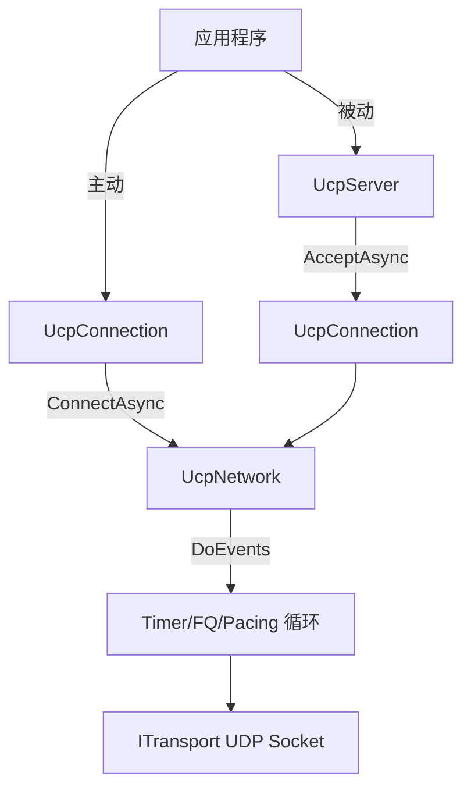
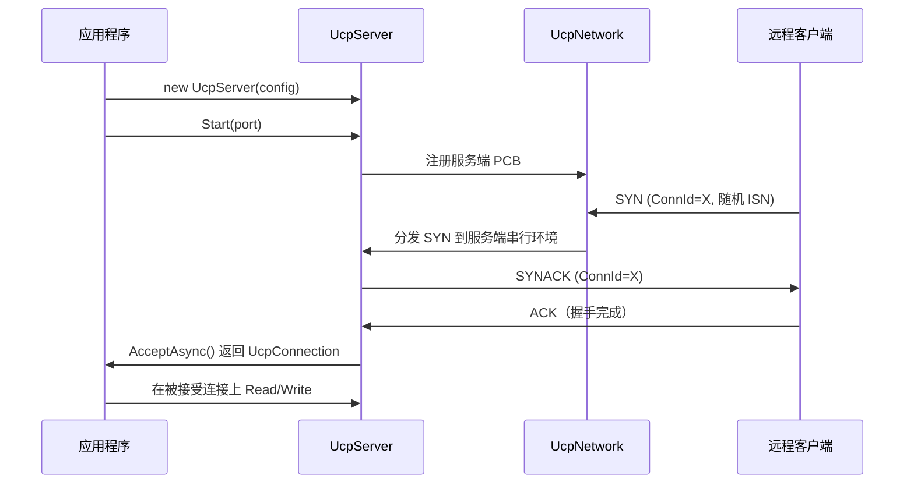
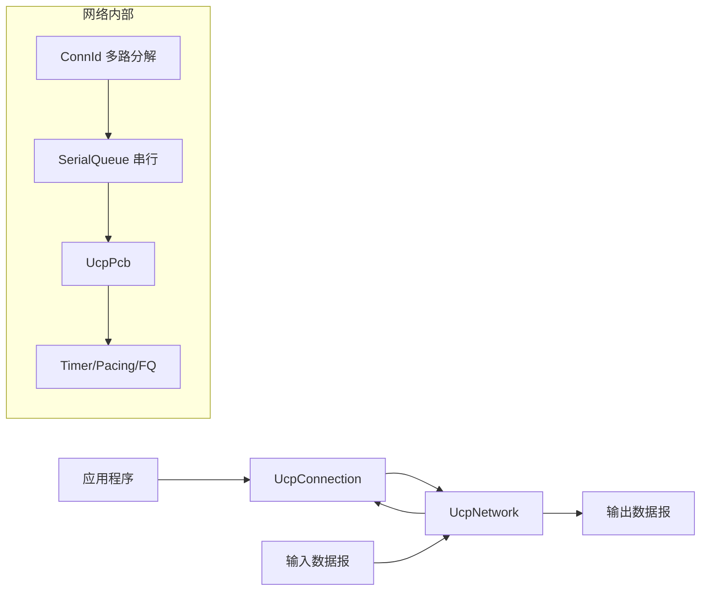

# PPP PRIVATE NETWORK™ X - 通用通信协议 (UCP) — API 参考

[English](api.md) | [文档索引](index_CN.md)

**协议标识: `ppp+ucp`** — 本文档描述 UCP 库的公开 API 接口，包括配置、服务端与连接生命周期、网络驱动集成、事件模型和诊断报告。

## API 概览

UCP 暴露三个主要 API 入口：`UcpServer` 用于被动接受连接，`UcpConnection` 用于主动和被动数据传输，`UcpNetwork` 用于自定义传输层集成。所有协议行为通过 `UcpConfiguration` 配置，实例通过工厂方法 `GetOptimizedConfig()` 创建。



## UcpConfiguration

调用 `UcpConfiguration.GetOptimizedConfig()` 获取面向广泛网络条件调优的推荐默认值。

### 协议参数

| 参数 | 默认值 | 作用 |
|---|---|---:|
| `Mss` | 1220 | 最大分段大小（字节）。高带宽基准使用 9000。控制分片阈值和 SACK 块容量。 |
| `MaxRetransmissions` | 10 | 单个发送分段最大重传次数，超限后连接判定死亡。 |
| `SendBufferSize` | 32 MB | 最大发送缓冲量；满时 `WriteAsync` 阻塞以提供背压。 |
| `ReceiveBufferSize` | ~20 MB | 派生自 `RecvWindowPackets × Mss`，防止快速发送端导致内存耗尽。 |
| `InitialCwndPackets` | 20 | 初始拥塞窗口包数。BBRv2 Startup 会迅速增长超过此值。 |
| `InitialCwndBytes` | 派生 | 便捷设置器，用当前 MSS 将字节换算为包数。 |
| `MaxCongestionWindowBytes` | 64 MB | BBRv2 拥塞窗口硬上限，防止内存失控增长。 |
| `SendQuantumBytes` | `Mss` | pacing token 消费粒度。每次发送尝试消耗此数量的 token。 |
| `AckSackBlockLimit` | 149 | 每 ACK 最多 SACK 块数。受 MSS 限制以确保 ACK 适合单个数据报。 |

### RTO 与定时器

| 参数 | 默认值 | 作用 |
|---|---|---:|
| `MinRtoMicros` | 200,000 (200ms) | 最小重传超时。防止低延迟路径上过早 RTO。 |
| `MaxRtoMicros` | 15,000,000 (15s) | 最大重传超时。1.2× 退避下的上限。 |
| `RetransmitBackoffFactor` | 1.2 | 每次连续超时 RTO 退避乘数。比 TCP 的 2.0 更温和，更快检测死路径。 |
| `ProbeRttIntervalMicros` | 30,000,000 (30s) | BBRv2 ProbeRTT 周期。尝试刷新 MinRTT 的间隔。 |
| `ProbeRttDurationMicros` | 100,000 (100ms) | 最短 ProbeRTT 持续时间。 |
| `KeepAliveIntervalMicros` | 1,000,000 (1s) | 空闲保活间隔。防止空闲连接被 NAT/防火墙超时清除。 |
| `DisconnectTimeoutMicros` | 4,000,000 (4s) | 空闲断连超时。此期间内无数据交换则关闭连接。 |
| `TimerIntervalMilliseconds` | 20 | 驱动 `DoEvents()` 轮次的内部定时器刻度。 |
| `DelayedAckTimeoutMicros` | 2,000 (2ms) | 延迟 ACK 聚合超时。设为 `0` 禁用延迟 ACK，立即发送。 |

### Pacing 与 BBRv2

| 参数 | 默认值 | 作用 |
|---|---|---:|
| `MinPacingIntervalMicros` | 0 | 无人工最小包间隔 — token bucket 控制所有 pacing。 |
| `PacingBucketDurationMicros` | 10,000 (10ms) | Token bucket 容量窗口。更大值允许更大突发。 |
| `StartupPacingGain` | 2.5 | BBRv2 Startup pacing 乘数。激进初始探测。 |
| `StartupCwndGain` | 2.0 | BBRv2 Startup CWND 乘数。 |
| `DrainPacingGain` | 0.75 | BBRv2 Drain pacing 乘数。排空 Startup 队列。 |
| `ProbeBwHighGain` | 1.25 | ProbeBW 上探增益，探测更多带宽。 |
| `ProbeBwLowGain` | 0.85 | ProbeBW 下探增益，排空累积队列。 |
| `ProbeBwCwndGain` | 2.0 | ProbeBW CWND 增益。 |
| `BbrWindowRtRounds` | 10 | 投递率滤波窗口 RTT 轮数。BBRv2 用于估计 `BtlBw`。 |

### 带宽与丢包控制

| 参数 | 默认值 | 作用 |
|---|---|---:|
| `InitialBandwidthBytesPerSecond` | 12.5 MB/s | 有投递率样本前的初始瓶颈带宽估计。 |
| `MaxPacingRateBytesPerSecond` | 12.5 MB/s | pacing 速率上限。设为 `0` 完全关闭上限。 |
| `ServerBandwidthBytesPerSecond` | 12.5 MB/s | 公平队列调度器使用的服务端出口带宽，用于分配每连接 credit。 |
| `LossControlEnable` | `true` | BBRv2 拥塞分类确认真正拥塞后启用丢包感知 pacing/CWND 适应。 |
| `MaxBandwidthLossPercent` | 25% | 拥塞证据成立后的丢包预算百分比，内部限制到 15%-35% 范围。 |
| `MaxBandwidthWastePercent` | 25% | 控制器启发式使用的带宽浪费预算，用于 pacing debt 管理。 |

### FEC（前向纠错）

| 参数 | 默认值 | 作用 |
|---|---|---:|
| `FecRedundancy` | 0.0 | 基础冗余比例。`0.125` = 每 8 个数据包 1 个 RS-GF(256) 修复包。自适应模式下有效冗余随观测丢包率调整。 |
| `FecGroupSize` | 8 | 每 FEC 组 DATA 包数量。更小组延迟更低但开销更高。最大支持组大小 64。 |
| `FecAdaptiveEnable` | `true` | 启用自适应 FEC 冗余。启用时冗余随观测丢包率分级调整（参见架构文档）。 |

### 连接与会话

| 参数 | 默认值 | 作用 |
|---|---|---:|
| `UseConnectionIdTracking` | `true` | 启用时连接由随机 32 位 ConnId 追踪，而非 IP:port 元组。支持 NAT 重绑定韧性和 IP 移动性。 |
| `DynamicIpBindingEnable` | `true` | 服务端绑定 `IPAddress.Any`，接受任意获取地址上的连接。 |

## UcpServer

```csharp
public class UcpServer : IUcpObject, IDisposable
```

`UcpServer` 管理被动连接接受，内置公平队列调度。每个被接受的连接自动参与公平队列 credit 系统。

| 方法 | 作用 |
|---|---|
| `Start(int port)` | 开始在指定 UDP 端口监听。DynamicIpBinding 启用时绑定 `IPAddress.Any`。 |
| `Start(IPEndPoint endpoint)` | 在特定 IP 端点上监听，用于静态地址环境。 |
| `AcceptAsync()` | 等待新客户端连接，返回已完全建立的 `UcpConnection`。任务完成时连接握手已完成。 |
| `Stop()` | 停止监听并优雅关闭所有托管连接。在途数据在 2×RTO 内排空。 |

### 服务端生命周期



## UcpConnection

```csharp
public class UcpConnection : IUcpObject, IDisposable
```

`UcpConnection` 代表一个 UCP 会话。所有操作在专用的 `SerialQueue` 串行执行环境中执行，无需锁即可线程安全访问。

### 连接管理

| 方法 | 作用 |
|---|---|
| `ConnectAsync(IPEndPoint remote)` | 发起与远端端点的连接。生成随机 ISN 和 ConnId。三次握手完成后返回。 |
| `Close()` | 同步发起 FIN 优雅关闭。 |
| `CloseAsync()` | 异步发起优雅关闭。FIN 被确认后返回。 |
| `Dispose()` | 释放所有资源。若仍活跃则强制关闭连接。 |

### 发送数据

| 方法 | 签名 | 作用 |
|---|---|---|
| `Send` | `Send(byte[] buffer, int offset, int count)` | 同步写入发送缓冲，不等待远端确认。 |
| `SendAsync` | `SendAsync(byte[] buffer, int offset, int count)` | 异步写入发送缓冲。 |
| `Write` | `Write(byte[] buffer, int offset, int count)` | 同步可靠写入发送缓冲。 |
| `WriteAsync` | `WriteAsync(byte[] buffer, int offset, int count)` | 异步可靠写入。全部字节进入发送缓冲后返回 `true`。缓冲满时可能等待（阻塞）。 |

`Write` 和 `WriteAsync` 保证进入发送缓冲，不保证远端已消费。若应用需知远端已消费数据，请实现应用层 ACK 或使用远端 `Receive`/`Read` 信号完成。

### 接收数据

| 方法 | 签名 | 作用 |
|---|---|---|
| `Receive` | `Receive(byte[] buffer, int offset, int count)` | 从有序交付队列同步读取。返回实际读取字节数（可能小于 `count`）。 |
| `ReceiveAsync` | `ReceiveAsync(byte[] buffer, int offset, int count)` | 异步读取。至少 1 字节可用时完成。返回读取字节数。 |
| `Read` | `Read(byte[] buffer, int offset, int count)` | 循环直到读取指定字节数到缓冲。 |
| `ReadAsync` | `ReadAsync(byte[] buffer, int offset, int count)` | 异步定长读取。所有请求字节可用后完成。 |

### 事件

| 事件 | 签名 | 触发时机 |
|---|---|---|
| `OnData` / `OnDataReceived` | `Action<byte[], int, int>` | 有序 payload 字节到达应用层。在连接的 SerialQueue 串行环境上调用。 |
| `OnConnected` | `Action` | 三次握手成功完成。 |
| `OnDisconnected` | `Action` | 连接关闭（FIN 交换完成或超时）。 |

### 连接诊断

| 方法 | 返回值 | 作用 |
|---|---|---|
| `GetReport()` | `UcpTransferReport` | 当前传输统计快照：吞吐、重传率、RTT 统计、CWND、pacing 速率、收敛时间。 |
| `GetRttMicros()` | `long` | 当前平滑 RTT 估计值（微秒）。 |
| `GetCwndBytes()` | `long` | 当前拥塞窗口（字节）。 |
| `BytesInSendBuffer` | `long`（属性） | 当前等待首次传输（非重传）的缓冲字节数。 |

### 连接状态

| 属性 | 类型 | 作用 |
|---|---|---|
| `IsConnected` | `bool` | 三次握手完成且连接已建立时为 true。 |
| `IsDisconnected` | `bool` | 连接已关闭或超时时为 true。 |
| `ConnectionId` | `uint` | 本会话的随机 32 位连接标识。 |
| `RemoteEndPoint` | `IPEndPoint` | 远端对端的当前 IP 端点。NAT 重绑定时可能变化。 |

## UcpNetwork

`UcpNetwork` 把协议引擎从 socket 实现解耦，支持自定义传输层（如 WebRTC 数据通道、进程内测试、加密隧道）。



### DoEvents

```csharp
public void DoEvents()
```

`DoEvents()` 是 UCP 网络层的心跳。必须周期性调用（通常每 `TimerIntervalMilliseconds` = 20ms）以：
- 处理来自传输 socket 的入站数据报。
- 分发 RTO 检查、保活和断连超时定时器刻度。
- 在服务端执行公平队列 credit 轮次。
- 刷新由 pacing 和公平队列逻辑排队的出站数据报。
- 更新 BBRv2 投递率样本。

直接使用 `UcpNetwork` 的应用必须通过循环定时器调用 `DoEvents()` 或将其集成到事件循环中。

### 自定义传输

```csharp
public interface ITransport
{
    void Send(byte[] data, int length);
    int Receive(byte[] buffer);
    IPEndPoint RemoteEndPoint { get; }
}
```

实现 `ITransport` 将 UCP 与非 UDP 传输集成。内置的 `UdpTransport` 封装标准 .NET `UdpClient`，处理 socket 绑定、发送和接收。

## 完整示例

```csharp
using Ucp;
using System.Net;
using System.Text;

var config = UcpConfiguration.GetOptimizedConfig();
config.ServerBandwidthBytesPerSecond = 100_000_000 / 8;
config.FecRedundancy = 0.125;
config.Mss = 9000;

// --- 服务端 ---
using var server = new UcpServer(config);
server.Start(9000);
Task<UcpConnection> acceptTask = server.AcceptAsync();

// --- 客户端 ---
using var client = new UcpConnection(config);
await client.ConnectAsync(new IPEndPoint(IPAddress.Loopback, 9000));
UcpConnection serverConnection = await acceptTask;

// --- 数据交换 ---
byte[] request = Encoding.UTF8.GetBytes("Hello from PPP PRIVATE NETWORK™ X — UCP (ppp+ucp)");
await client.WriteAsync(request, 0, request.Length);
Console.WriteLine($"客户端发送 {request.Length} 字节");

byte[] response = new byte[request.Length];
int bytesRead = await serverConnection.ReadAsync(response, 0, response.Length);
Console.WriteLine($"服务端收到: {Encoding.UTF8.GetString(response, 0, bytesRead)}");

// --- 诊断 ---
var report = client.GetReport();
Console.WriteLine($"吞吐: {report.ThroughputMbps} Mbps");
Console.WriteLine($"RTT: {report.AverageRttMs} ms");
Console.WriteLine($"重传率: {report.RetransmissionRatio:P1}");

// --- 清理 ---
await client.CloseAsync();
await serverConnection.CloseAsync();
server.Stop();
```

## 错误处理

UCP 对以下错误条件抛出异常：

| 异常 | 条件 |
|---|---|
| `UcpException` | 协议级失败：握手超时、超最大重传次数、连接拒绝。 |
| `ObjectDisposedException` | 在已 dispose 的 `UcpConnection` 或 `UcpServer` 上操作。 |
| `InvalidOperationException` | `Close()` 后调用 `Write`/`WriteAsync` 或连接建立前调用。 |
| `SocketException` | 传输层传播的底层 UDP socket 错误。 |

`OnDisconnected` 事件对优雅关闭和错误关闭均触发。检查 `IsConnected` 和 `IsDisconnected` 以确定连接的最终状态。
