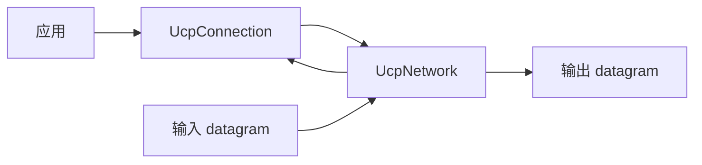

# UCP API 参考

[English](api.md) | [文档索引](index_CN.md)

## 概览

UCP 暴露三个主要 API 入口：`UcpServer`、`UcpConnection` 和 `UcpNetwork`。所有协议行为通过 `UcpConfiguration` 配置。

## UcpConfiguration

调用 `UcpConfiguration.GetOptimizedConfig()` 获取推荐默认值。

### 协议参数

| 参数 | 默认值 | 作用 |
|---|---:|---|
| `Mss` | 1220 | 最大分段大小。高带宽基准使用 9000。 |
| `MaxRetransmissions` | 10 | 单个发送分段最大重传次数。 |
| `SendBufferSize` | 32 MB | 最大发送缓冲量；满时 `WriteAsync` 等待。 |
| `ReceiveBufferSize` | 约 20 MB | 派生自 `RecvWindowPackets * Mss`。 |
| `InitialCwndPackets` | 20 | 初始拥塞窗口包数。 |
| `InitialCwndBytes` | 派生 | 把字节便捷换算为包数。 |
| `MaxCongestionWindowBytes` | 64 MB | BBR 拥塞窗口硬上限。 |
| `SendQuantumBytes` | `Mss` | pacing token 消费使用的发送粒度。 |
| `AckSackBlockLimit` | 149 | 每个 ACK 最多 SACK blocks，仍受 MSS 限制。 |

### RTO 与定时器

| 参数 | 默认值 | 作用 |
|---|---:|---|
| `MinRtoMicros` | 200,000 | 最小重传超时。 |
| `MaxRtoMicros` | 15,000,000 | 最大重传超时。 |
| `RetransmitBackoffFactor` | 1.2 | RTO 退避乘数。 |
| `ProbeRttIntervalMicros` | 30,000,000 | BBR ProbeRTT 周期。 |
| `ProbeRttDurationMicros` | 100,000 | 最短 ProbeRTT 持续时间。 |
| `KeepAliveIntervalMicros` | 1,000,000 | 空闲保活间隔。 |
| `DisconnectTimeoutMicros` | 4,000,000 | 空闲断连超时。 |
| `TimerIntervalMilliseconds` | 20 | 内部 timer tick 间隔。 |
| `DelayedAckTimeoutMicros` | 2,000 | 延迟 ACK 聚合超时；设为 `0` 禁用。 |

### Pacing 与 BBR

| 参数 | 默认值 | 作用 |
|---|---:|---|
| `MinPacingIntervalMicros` | 0 | 默认无额外最小包间隔，由 token bucket 控制。 |
| `PacingBucketDurationMicros` | 10,000 | Token bucket 容量窗口。 |
| `StartupPacingGain` | 2.0 | BBR Startup pacing 乘数。 |
| `StartupCwndGain` | 2.0 | BBR Startup CWND 乘数。 |
| `DrainPacingGain` | 0.75 | BBR Drain pacing 乘数。 |
| `ProbeBwHighGain` | 1.25 | ProbeBW 上探增益。 |
| `ProbeBwLowGain` | 0.85 | ProbeBW 下探增益。 |
| `ProbeBwCwndGain` | 2.0 | ProbeBW CWND 增益。 |
| `BbrWindowRtRounds` | 10 | delivery-rate 过滤窗口 RTT 轮数。 |

### 带宽与丢包控制

| 参数 | 默认值 | 作用 |
|---|---:|---|
| `InitialBandwidthBytesPerSecond` | 12.5 MB/s | 初始瓶颈带宽估计。 |
| `MaxPacingRateBytesPerSecond` | 12.5 MB/s | pacing 上限；设为 `0` 关闭上限。 |
| `ServerBandwidthBytesPerSecond` | 12.5 MB/s | 服务端公平队列使用的出口带宽。 |
| `LossControlEnable` | `true` | 拥塞分类后启用 loss-aware pacing/CWND 响应。 |
| `MaxBandwidthLossPercent` | 25% | 丢包预算，限制到 15%-35%；仅拥塞证据成立后使用。 |
| `MaxBandwidthWastePercent` | 25% | 控制器启发式使用的带宽浪费预算。 |

### FEC

| 参数 | 默认值 | 作用 |
|---|---:|---|
| `FecRedundancy` | 0.0 | `0.125` 表示每 8 包一个 XOR repair。 |
| `FecGroupSize` | 8 | 每个 FEC 组 DATA 包数量。 |

## UcpServer

```csharp
public class UcpServer : IUcpObject, IDisposable
```

| 方法 | 作用 |
|---|---|
| `Start(int port)` | 开始监听 UDP 端口。 |
| `AcceptAsync()` | 等待新客户端连接并返回 `UcpConnection`。 |
| `Stop()` | 停止监听并关闭托管连接。 |

## UcpConnection

```csharp
public class UcpConnection : IUcpObject, IDisposable
```

### 连接管理

| 方法 | 作用 |
|---|---|
| `ConnectAsync(IPEndPoint remote)` | 连接到远端。 |
| `Close()` / `CloseAsync()` | 通过 FIN 优雅关闭。 |

### 发送

| 方法 | 作用 |
|---|---|
| `Send(byte[], offset, count)` | 同步写入发送缓冲，不等待远端 ACK。 |
| `SendAsync(byte[], offset, count)` | 异步写入发送缓冲。 |
| `Write(byte[], offset, count)` | 同步可靠写入发送缓冲。 |
| `WriteAsync(byte[], offset, count)` | 异步可靠写入；全部字节进入发送缓冲后返回 true。 |

`Write` 和 `WriteAsync` 保证进入发送缓冲，不保证远端已消费。需要远端确认时请使用读取或应用层 ACK。

### 接收

| 方法 | 作用 |
|---|---|
| `Receive(byte[], offset, count)` | 从有序交付队列同步读取。 |
| `ReceiveAsync(byte[], offset, count)` | 从有序交付队列异步读取。 |
| `Read(byte[], offset, count)` | 循环直到读取指定字节数。 |
| `ReadAsync(byte[], offset, count)` | 异步定长读取。 |

### 事件

| 事件 | 触发时机 |
|---|---|
| `OnData` / `OnDataReceived` | 有序 payload 到达应用层。 |
| `OnConnected` | 握手完成。 |
| `OnDisconnected` | 连接关闭。 |

### 诊断

`GetReport()` 返回 `UcpTransferReport`。`RetransmissionRatio` 是协议侧发送端修复开销，不是物理网络丢包率。基准 `Loss%` 由 `NetworkSimulator` 测量。

## UcpNetwork

`UcpNetwork` 把协议引擎从 socket 实现解耦。`DoEvents()` 驱动 timer、延迟 flush、RTO 检查和公平队列轮次。



## 示例

```csharp
using Ucp;

var config = UcpConfiguration.GetOptimizedConfig();
config.ServerBandwidthBytesPerSecond = 100_000_000 / 8;

using var server = new UcpServer(config);
server.Start(9000);
Task<UcpConnection> acceptTask = server.AcceptAsync();

using var client = new UcpConnection(config);
await client.ConnectAsync(new IPEndPoint(IPAddress.Loopback, 9000));
UcpConnection serverConnection = await acceptTask;

byte[] data = Encoding.UTF8.GetBytes("Hello UCP");
await client.WriteAsync(data, 0, data.Length);

byte[] received = new byte[data.Length];
await serverConnection.ReadAsync(received, 0, received.Length);
```
