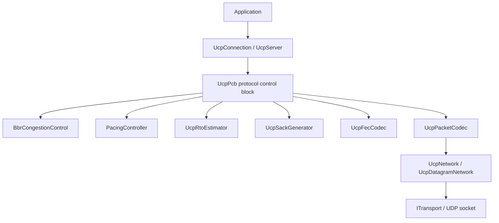
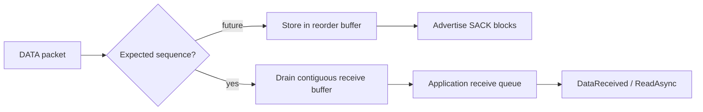
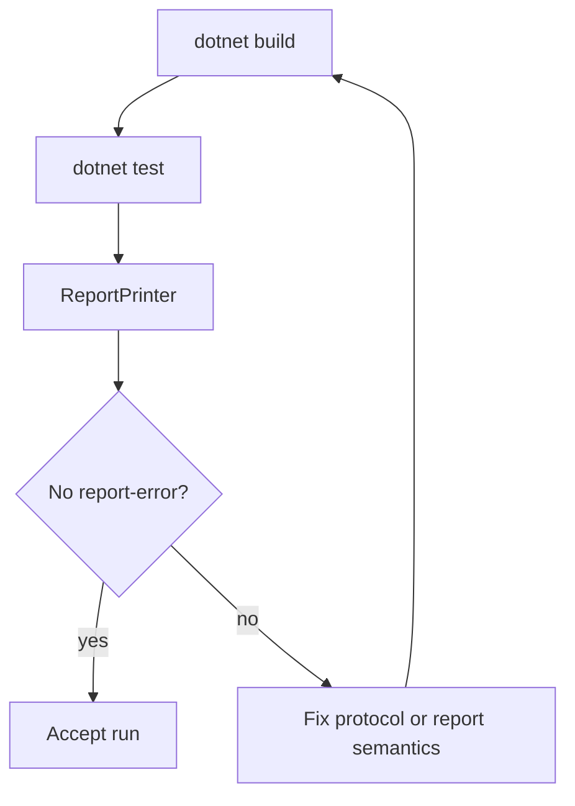

# UCP Architecture Deep Dive

[中文](architecture_CN.md) | [Documentation Index](index.md)

## Runtime Layers

## UcpPcb

`UcpPcb` is the per-connection protocol control block. It owns send state, receive reordering, ACK/SACK/NAK processing, retransmission timers, BBR, pacing, fair-queue credit, and optional FEC.

### Sender State

| Structure | Purpose |
|---|---|
| `_sendBuffer` | Sequence-sorted outbound segments awaiting ACK. |
| `_flightBytes` | Payload bytes currently considered in flight. |
| `_nextSendSequence` | Next 32-bit sequence number with wrap-around comparison. |
| `_sackFastRetransmitNotified` | Deduplicates SACK-triggered fast retransmit decisions. |
| `_urgentRecoveryPacketsInWindow` | Per-RTT limiter for pacing/FQ bypass recovery. |

### Receiver State

| Structure | Purpose |
|---|---|
| `_recvBuffer` | Out-of-order inbound segments sorted by sequence. |
| `_nextExpectedSequence` | Next sequence needed for in-order delivery. |
| `_receiveQueue` | Ordered payload chunks ready for application reads. |
| `_missingSequenceCounts` | Gap observation count used by NAK generation. |
| `_lastNakIssuedMicros` | Repeat suppression for receiver NAKs. |

## Ordered Delivery

`HandleData()` stores new DATA in `_recvBuffer`, drains every contiguous segment starting at `_nextExpectedSequence`, then enqueues ordered payload chunks. Reordering and duplication tests use unique byte patterns so repeated-byte payloads cannot hide corruption.

## Pacing And Fair Queue

`PacingController` is a byte token bucket. Normal sends require both available tokens and, on fair-queue server paths, connection credit. Urgent retransmits may bypass those gates only when marked by recovery logic and allowed by the RTT-window budget.

`ForceConsume()` immediately charges urgent bytes even when the bucket is empty. The resulting negative token balance is capped, so later normal sends repay the burst as pacing debt.

## BBR And Loss Classification

BBR estimates bottleneck bandwidth from delivery-rate samples and computes `PacingRate = BtlBw * PacingGain`. Loss is classified before applying reductions:

| Loss Class | BBR Response | Retransmit Behavior |
|---|---|---|
| Random loss | Preserve or restore pacing/CWND. | Retransmit immediately. |
| Congestion loss | Apply gentle `0.98` gain reduction with CWND floor. | Retransmit immediately. |

The network classifier uses 200ms windows of RTT, jitter, loss, and throughput ratio to distinguish LAN, mobile/unstable, lossy long-fat, congested bottleneck, and VPN-like paths.

## Network Simulator

`NetworkSimulator` is deterministic and in-process. It supports independent forward/reverse delay, per-direction jitter, bandwidth serialization, random/custom loss, duplication, and reordering. High-bandwidth no-loss scenarios use a virtual logical clock so OS scheduling does not inflate reported throughput.

## Test Architecture

| Test Area | Examples |
|---|---|
| Core protocol | sequence wrap, packet codec, RTO estimator, pacing controller. |
| Reliability | lossy transfer, burst loss, SACK/NAK recovery, FEC single-loss recovery. |
| Stream integrity | reordering/duplication, partial reads, full-duplex non-interleaving. |
| Performance | 4 Mbps to 10 Gbps, 0-10% loss, mobile, satellite, VPN, long-fat pipes. |
| Reporting | throughput cap, loss/retransmission separation, route asymmetry validation. |

## Validation Flow

