# PPP PRIVATE NETWORK™ X - Universal Communication Protocol (UCP) — Architecture

[中文](architecture_CN.md) | [Documentation Index](index.md)

**Protocol designation: `ppp+ucp`** — This document describes the internal runtime architecture of the UCP protocol engine, covering layering, per-connection state management, session tracking, strand-based execution, fair-queue scheduling, congestion control internals, FEC codec design, and the deterministic network simulator.

---

## Runtime Layers

UCP is organized in a layered architecture from application-facing APIs down to the transport socket. Each layer encapsulates a well-defined responsibility:

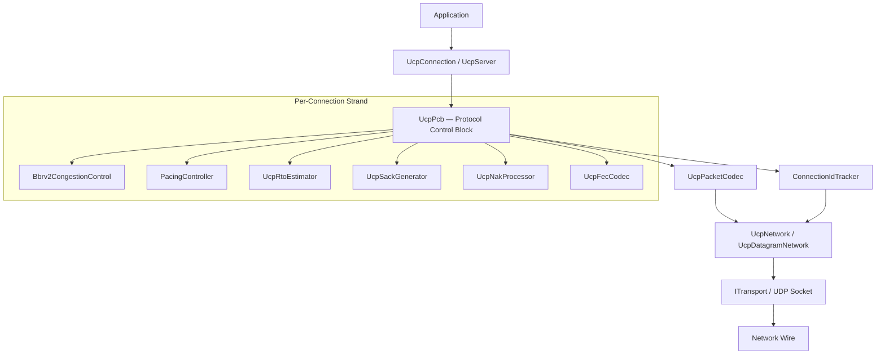

### Layer Responsibilities

| Layer | Component | Purpose |
|---|---|---|
| **Public API** | `UcpServer`, `UcpConnection` | Application-facing connection lifecycle, send/receive, event model. |
| **Protocol Control** | `UcpPcb` | Per-connection state machine, timer management, send/receive buffer coordination. |
| **Congestion Control** | `Bbrv2CongestionControl` | BBRv2 state machine with adaptive pacing gain, delivery-rate estimation, loss classification. |
| **Pacing** | `PacingController` | Byte-level token bucket with bounded negative balance for urgent recovery bursts. |
| **Timer** | `UcpRtoEstimator` | RTT sampling, RTO computation with backoff, PTO guard logic. |
| **Recovery** | `UcpSackGenerator`, `UcpNakProcessor` | SACK block generation with 2-send-per-range limit; tiered-confidence NAK emission and processing. |
| **FEC** | `UcpFecCodec` | Reed-Solomon GF(256) encoding/decoding with adaptive redundancy based on observed loss. |
| **Codec** | `UcpPacketCodec` | Serialization/deserialization including piggybacked ACK field extraction from all packet types. |
| **Session** | `ConnectionIdTracker` | Connection-ID-based demultiplexing, random ISN assignment, IP-agnostic binding. |
| **Network** | `UcpNetwork` | Datagram dispatch, `DoEvents()` driver loop, fair-queue round coordination. |

---

## UcpPcb — Protocol Control Block

`UcpPcb` is the central per-connection state container. Every active connection owns a PCB instance that manages all aspects of the protocol state machine. Unlike traditional socket controls that bind to IP:port tuples, the PCB is keyed by a random 32-bit Connection ID, making it immune to IP address changes during a session.

### Connection State Machine

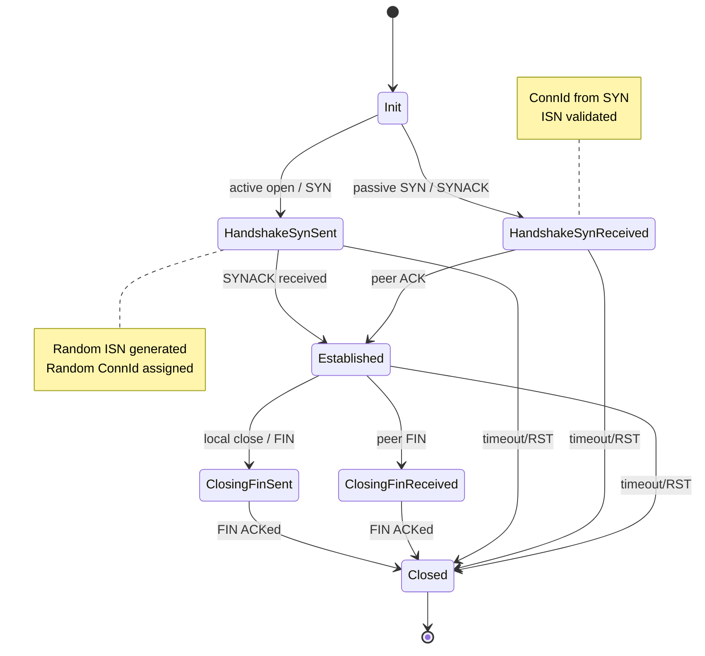

### Connection-ID-Based Session Tracking (IP-Agnostic)

Each UCP connection is identified by a cryptographically random 32-bit Connection ID generated at SYN time. The `ConnectionIdTracker` within `UcpNetwork` maintains a dictionary mapping Connection IDs to PCB instances. When an inbound datagram arrives, the network layer extracts the Connection ID from the common header and dispatches directly to the owning PCB — regardless of the source IP/port.

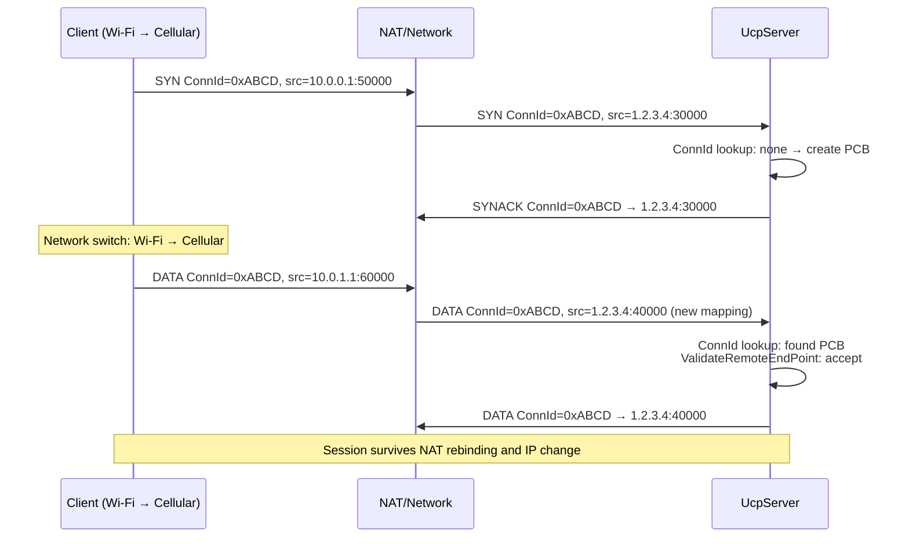

This design enables:
- **NAT rebinding resilience**: If a client's NAT mapping changes mid-session, the server still routes packets to the correct PCB.
- **IP mobility**: A client migrating from Wi-Fi to cellular keeps the same Connection ID and session state.
- **Multipath readiness**: The same Connection ID could route packets from multiple interfaces to a single PCB (future feature).

### Random Initial Sequence Number (ISN)

Each connection's initial sequence number is generated randomly at SYN time using a cryptographic random source, following the same security principle as TCP ISN selection. This prevents blind data injection attacks: an off-path attacker cannot guess the sequence space without observing traffic. The 32-bit sequence space wraps around using standard unsigned comparison with a 2^31 window for unambiguous ordering.

### PCB Component Relationships

```mermaid
flowchart TD
    PCB[UcpPcb] --> Sender[Sender State]
    PCB --> Receiver[Receiver State]
    PCB --> Timers[Timer Management]
    PCB --> Recovery[Recovery System]

    Sender --> SendBuf[_sendBuffer: SortedDictionary]
    Sender --> Flight[_flightBytes counter]
    Sender --> NextSeq[_nextSendSequence]
    Sender --> SackDedup[_sackFastRetransmitNotified]
    Sender --> SackCount[_sackSendCount per-range]
    Sender --> UrgentBudget[_urgentRecoveryPacketsInWindow]
    Sender --> AckPiggy[_ackPiggybackQueue]

    Receiver --> RecvBuf[_recvBuffer: SortedDictionary]
    Receiver --> NextExp[_nextExpectedSequence]
    Receiver --> RecvQueue[_receiveQueue for app reads]
    Receiver --> MissCounts[_missingSequenceCounts]
    Receiver --> NakTier[_nakConfidenceTier]
    Receiver --> LastNak[_lastNakIssuedMicros]
    Receiver --> FecMeta[_fecFragmentMetadata]

    Timers --> RtoTimer[RTO timer]
    Timers --> KeepAlive[Keep-alive timer]
    Timers --> Disconnect[Disconnect timer]
    Timers --> DelayedAck[Delayed ACK timer]
    Timers --> ProbeRTT[ProbeRTT timer]

    Recovery --> BBR[Bbrv2CongestionControl]
    Recovery --> SACK[UcpSackGenerator]
    Recovery --> NAK[UcpNakProcessor]
    Recovery --> FEC[UcpFecCodec]
    Recovery --> RTO[UcpRtoEstimator]
```

### Sender State

| Structure | Purpose |
|---|---|
| `_sendBuffer` | Sequence-sorted outbound segments awaiting ACK. Each segment tracks its original send timestamp, retransmission count, and whether it was urgent-recovered. |
| `_flightBytes` | Payload bytes currently considered in flight. Used by BBRv2 to compute delivery rate and enforce the CWND in-flight cap. |
| `_nextSendSequence` | Next 32-bit sequence number with wrap-around comparison. Incremented monotonically modulo 2^32. |
| `_sackFastRetransmitNotified` | Deduplicates SACK-triggered fast retransmit decisions. Once a gap is repaired via SACK, it is not retransmitted again until new SACK evidence confirms a fresh loss. |
| `_sackSendCount` | Per-block-range counter limiting SACK advertisement to 2 sends per range, preventing redundant SACK amplification under sustained reordering. |
| `_urgentRecoveryPacketsInWindow` | Per-RTT limiter for pacing/FQ bypass recovery. Prevents a single connection from starving others during recovery bursts. |
| `_ackPiggybackQueue` | Pending cumulative ACK number to be carried on the next outbound packet of any type, reducing pure-ACK overhead. |

### Receiver State

| Structure | Purpose |
|---|---|
| `_recvBuffer` | Out-of-order inbound segments sorted by sequence. Uses a red-black-tree-like insertion for O(log n) ordered access. |
| `_nextExpectedSequence` | Next sequence needed for in-order delivery. Advances as contiguous segments are drained. |
| `_receiveQueue` | Ordered payload chunks ready for application reads via `Receive()` / `ReceiveAsync()`. |
| `_missingSequenceCounts` | Per-sequence gap observation counter used by tiered-confidence NAK generation. Each time a gap is observed above but not including the missing sequence, the counter increments. |
| `_nakConfidenceTier` | Current NAK confidence tier: `Low` (1-2 observations, RTTx2 guard), `Medium` (3-4 observations, RTT guard), `High` (5+ observations, 5ms guard). Higher confidence shortens the reorder guard for faster NAK emission. |
| `_lastNakIssuedMicros` | Per-sequence repeat suppression timestamp for receiver NAKs. Prevents NAK storms for the same gap. |
| `_fecFragmentMetadata` | Original fragment metadata for FEC-recovered DATA packets, preserving original sequence numbers and fragment boundaries. |

---

## SerialQueue Per-Connection Strand-Based Execution

Each `UcpConnection` processes all protocol events through a dedicated `SerialQueue` — a single-threaded execution context (strand). This design eliminates lock contention entirely:

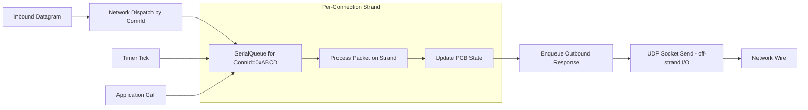

### Threading Model

```mermaid
flowchart TD
    Main[Main Thread / Event Loop] --> DoEvents[UcpNetwork.DoEvents]
    DoEvents -->|Iterate all PCBs| Dispatch[Per-Connection Dispatch]

    Dispatch --> SQ1[SerialQueue #1 (Conn 0x0001)]
    Dispatch --> SQ2[SerialQueue #2 (Conn 0x0002)]
    Dispatch --> SQN[SerialQueue #N (Conn 0xNNNN)]

    subgraph "Strand Processing (per connection)"
        SQ1 --> T1A[Process Timers]
        SQ1 --> T1B[Process Inbound Packets]
        SQ1 --> T1C[Flush Pacing Queue]
        SQ1 --> T1D[Update BBRv2 Samples]
        SQ1 --> T1E[Process Application Calls]
    end

    subgraph "I/O Thread (off-strand)"
        IO[UDP Socket Thread] --> Recv[Receive Datagrams]
        IO --> Send[Send Datagrams]
    end

    Recv --> Dispatch
    Outbound[Outbound Queue] --> Send
```

All mutating operations on a PCB — packet processing, timer callbacks, application send/receive, BBRv2 state updates — execute sequentially on the same strand. This means:

- **No locks**: PCB state is never accessed concurrently from multiple threads.
- **Predictable ordering**: Packets are processed in receipt order; application calls are queued and executed in order.
- **No deadlocks**: The strand model eliminates lock-ordering problems inherent in multi-lock designs.
- **I/O offloading**: Only the actual UDP socket send/receive happens outside the strand; heavy FEC Reed-Solomon decoding runs on the strand itself since GF(256) operations are computationally lightweight.

The `UcpNetwork.DoEvents()` method orchestrates the strand dispatch, iterating over all active PCBs and delivering pending timer events, outbound flush requests, and inbound datagrams to each strand in sequence.

---

## Fair-Queue Server Scheduling

On the server side, `UcpServer` employs a fair-queue scheduler to ensure no single connection monopolizes available egress bandwidth. The scheduler operates at the `UcpNetwork` level:

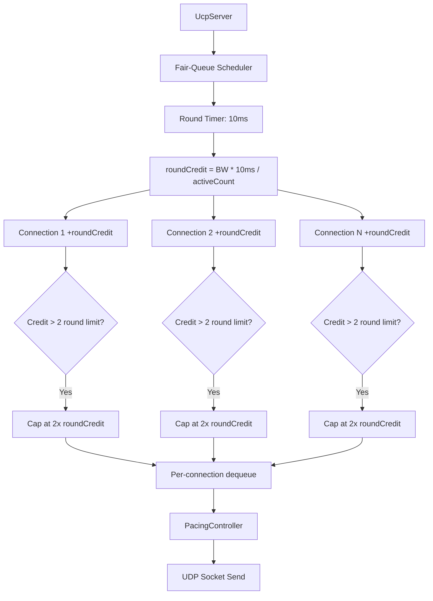

### Fair-Queue Design

| Parameter | Value | Meaning |
|---|---|---|
| `FAIR_QUEUE_ROUND_MILLISECONDS` | 10ms | Each fair-queue round duration. |
| `MAX_BUFFERED_FAIR_QUEUE_ROUNDS` | 2 | Maximum credit accumulation; prevents a starved connection from bursting all at once. |

During each fair-queue round, every active server connection is granted a credit allocation proportional to `ServerBandwidthBytesPerSecond / ActiveConnections / RoundsPerSecond`. A connection may send up to its accumulated credit per round. Unused credit accumulates for up to `MAX_BUFFERED_FAIR_QUEUE_ROUNDS` rounds, after which it is discarded.

Normal data sends must acquire both fair-queue credit and pacing tokens. Urgent retransmissions (marked by SACK, NAK, or RTO recovery) bypass the fair-queue gate but still respect the per-RTT urgent budget cap.

---

## Pacing And Token Bucket

`PacingController` implements a byte-level token bucket with the following semantics:

- **Token fill rate**: `BBRv2.PacingRate` bytes per second.
- **Bucket capacity**: `PacingRate * PacingBucketDurationMicros` — typically 10ms worth of bytes.
- **Normal send**: Consume `SendQuantumBytes` (default = MSS) tokens. If insufficient tokens, the send is deferred to the next timer tick.
- **Urgent send via `ForceConsume()`**: Immediately charges the byte cost to the bucket even if tokens are insufficient. The bucket goes negative, and subsequent normal sends must wait for the debt to be repaid. The negative balance is capped at `-MaxPacingRateBytes * PacingBucketDurationMicros / 2` to prevent unlimited debt accumulation.

```mermaid
sequenceDiagram
    participant S as Sender PCB
    participant P as PacingController
    participant FQ as Fair Queue (Server)
    participant Net as UDP Socket

    S->>P: Request normal send (1400B)
    P->>P: Tokens available?
    alt Tokens >= 1400
        P->>FQ: Acquire fair-queue credit
        FQ-->>P: Credit granted
        P->>Net: Send datagram
        P->>P: Tokens -= 1400
    else Tokens < 1400
        P->>S: Defer; retry next timer tick
    end

    Note over S,P: Urgent retransmit path
    S->>P: ForceConsume(1400)
    P->>P: Tokens -= 1400 (may go negative)
    P->>Net: Send datagram (bypass FQ)
    Note over P: Debt repaid by future normal sends<br/>Negative cap: 50% of bucket capacity
```

---

## BBRv2 Congestion Control With Adaptive Pacing Gain

UCP implements BBRv2, extending BBRv1 with loss-aware adaptation and adaptive pacing gain.

### BBRv2 State Machine

```mermaid
stateDiagram-v2
    [*] --> Startup
    Startup --> Drain: Bandwidth plateau detected
    Drain --> ProbeBW: Inflight drained below BDP
    ProbeBW --> ProbeRTT: MinRTT refresh needed (30s)
    ProbeRTT --> ProbeBW: MinRTT refreshed
    ProbeBW --> ProbeBW: Cycle gains (8 phases)
    ProbeRTT --> ProbeBW: Lossy long-fat — skip ProbeRTT

    note right of Startup: pacing_gain: 2.5<br/>Exponential probing
    note right of Drain: pacing_gain: 0.75<br/>Drain queue
    note right of ProbeBW: 8-phase cycle<br/>[1.35, 0.85, 1.0*6]
    note right of ProbeRTT: CWND: 4 packets<br/>100ms duration
```

### BBRv2 Mode Behavior

| Mode | Pacing Gain | CWND Gain | Duration | Purpose |
|---|---|---|---|---|
| **Startup** | 2.5 | 2.0 | Until bandwidth plateau | Exponentially probe for bottleneck bandwidth. Exit when throughput plateaus for 3 RTT windows. |
| **Drain** | 0.75 | — | 1 BBR cycle (~1 RTT) | Drain the excess queue built during Startup. |
| **ProbeBW** | Cycled | 2.0 | Steady state | Cycle between probing for more bandwidth and draining queues. 8 phases: [1.25, 0.85, 1.0, 1.0, 1.0, 1.0, 1.0, 1.0]. |
| **ProbeRTT** | 1.0 | 4 packets | 100ms | Refresh MinRTT estimate. Skipped on lossy long-fat paths. |

### BBRv2 Core Estimates

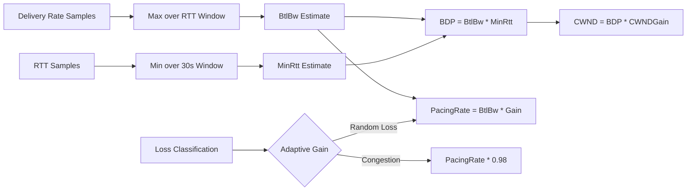

| Estimate | Calculation | Purpose |
|---|---|---|
| `BtlBw` | Max delivery rate over `BbrWindowRtRounds` RTT windows | Pacing-rate base. BBRv2 adds a short-term EWMA filter to smooth rapid bandwidth changes. |
| `MinRtt` | Minimum observed RTT in the ProbeRTT interval (30s default) | BDP denominator. BBRv2 skips ProbeRTT on lossy paths if delivery rate remains high. |
| `BDP` | `BtlBw * MinRtt` | Target in-flight bytes. |
| `AdaptivePacingGain` | Base gain x congestion response factor | Dynamic gain that starts at 2.5 in Startup, drops through Drain, and cycles around 1.0 in ProbeBW. Congestion evidence applies a 0.98x multiplier. |
| `PacingRate` | `BtlBw * AdaptivePacingGain` | Actual send rate enforced by the token bucket. |
| `CWND` | `BDP * CwndGain` with guardrails | In-flight cap. BBRv2 applies a `BBR_MIN_LOSS_CWND_GAIN` floor (0.95) and recovers by `BBR_LOSS_CWND_RECOVERY_STEP` (0.04) per ACK after congestion events. |

### Loss Classification Before Rate Reduction

BBRv2 classifies each loss event before deciding whether to reduce the pacing rate:

| Loss Class | Criteria | BBRv2 Response | Retransmit Behavior |
|---|---|---|---|
| **Random loss** | <=2 isolated drops within a short window; no RTT inflation | Preserve pacing gain and CWND. Apply fast-recovery gain (1.25). | Retransmit immediately; do not reduce rate. |
| **Congestion loss** | >=3 drops or sustained RTT growth to >=1.10x MinRtt | Multiply `AdaptivePacingGain` by 0.98; apply CWND floor (0.95). | Retransmit immediately; reduce pacing proportionally. |

---

## Packet Flow Through the Stack

### Outbound Packet Flow

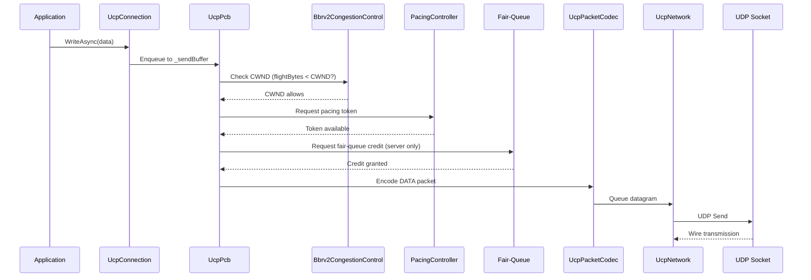

### Inbound Packet Flow

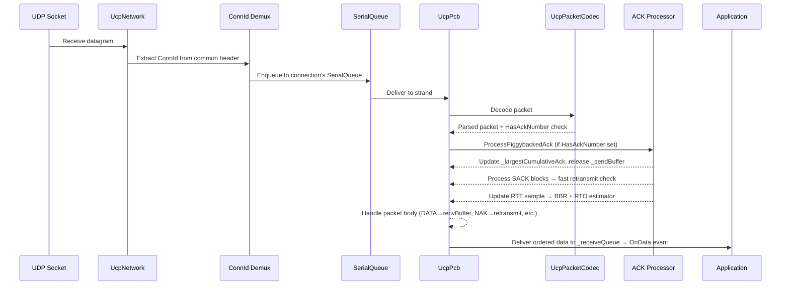

---

## FEC — Reed-Solomon GF(256) With Adaptive Transmission

UCP's forward error correction uses Reed-Solomon encoding over GF(256), which provides the ability to recover from multiple packet losses within a group using a configurable number of repair packets.

### How Reed-Solomon GF(256) Works in UCP

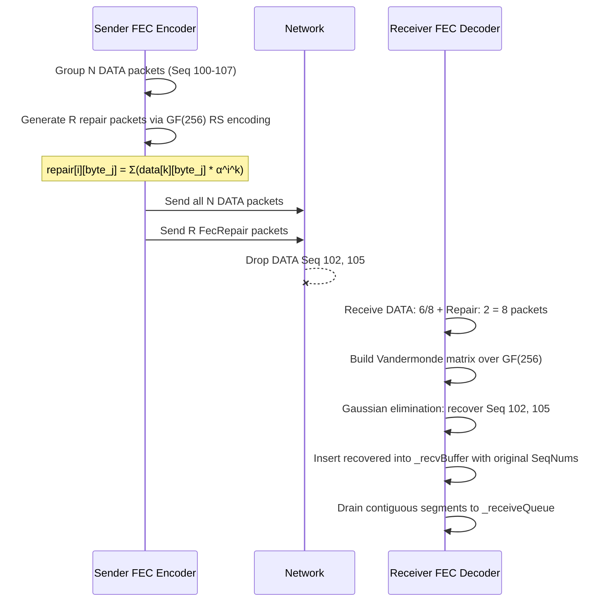

### Adaptive Transmission

The `FecRedundancy` parameter (e.g., 0.125 = one repair per 8 data packets) serves as the base configuration. Under adaptive mode, UCP adjusts the effective redundancy based on observed loss rate:

| Observed Loss Rate | Adaptive Behavior |
|---|---|
| `< 0.5%` | Minimum redundancy (base configuration). |
| `0.5% - 2%` | Increase redundancy by 1.25x. |
| `2% - 5%` | Increase redundancy by 1.5x, reduce group size to improve repair density. |
| `5% - 10%` | Maximum adaptive redundancy 2.0x; minimum group size 4. |
| `> 10%` | FEC alone insufficient; rely primarily on retransmission recovery. |

GF(256) operations use precomputed logarithm (512-entry) and antilogarithm (256-entry) tables for O(1) multiplication and division, making encoding and decoding computationally efficient even for large groups.

---

## Network Simulator

`NetworkSimulator` is a deterministic, in-process network emulator supporting:
- Independent forward/reverse propagation delays with per-direction jitter.
- Bandwidth serialization via a virtual logical clock that avoids OS scheduling jitter in throughput calculations.
- Configurable random or deterministic packet loss, duplication, and reordering.
- Mid-transfer outage simulation (e.g., Weak4G 80ms blackout).
- Asymmetric routing models with explicit forward/backward delay pairs.

The logical clock serializes packets through a bottleneck queue with byte-level precision, ensuring throughput measurements reflect protocol behavior rather than host scheduling noise.

---

## Test Architecture

| Test Area | Examples |
|---|---|
| **Core protocol** | Sequence wrap-around, packet codec round-trip, RTO estimator convergence, pacing controller token accounting. |
| **Connection management** | Connection-ID demux, random ISN uniqueness, server dynamic IP rebinding, serial queue ordering. |
| **Reliability** | Lossy transfer, burst loss, SACK 2-send-per-range limit, NAK tiered confidence levels, FEC multi-loss repair. |
| **Stream integrity** | Reordering/duplication, partial reads, full-duplex non-interleaving, piggybacked ACK correctness. |
| **Performance** | 4 Mbps to 10 Gbps, 0-10% loss, mobile, satellite, VPN, long-fat pipes with BBRv2 convergence validation. |
| **Reporting** | Throughput cap enforcement, loss/retransmission independence, directional asymmetry validation. |

## Validation Flow

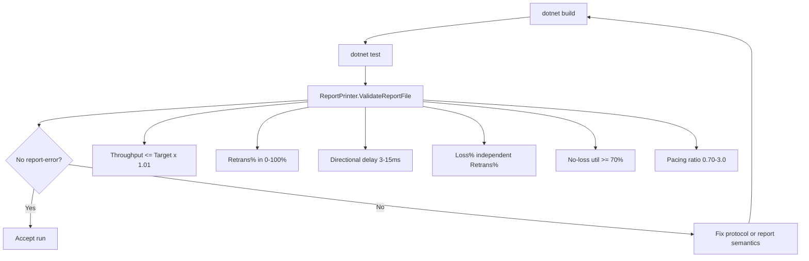
