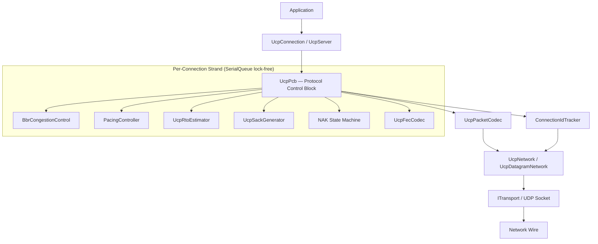
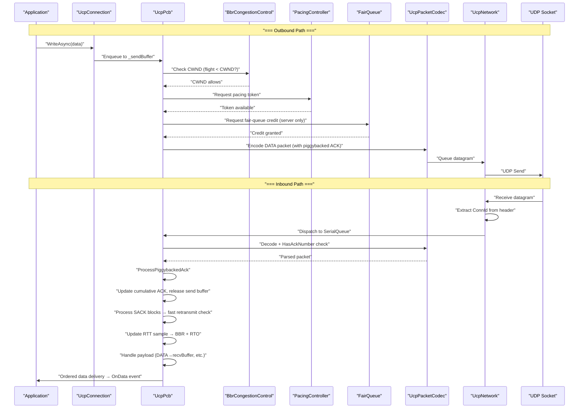
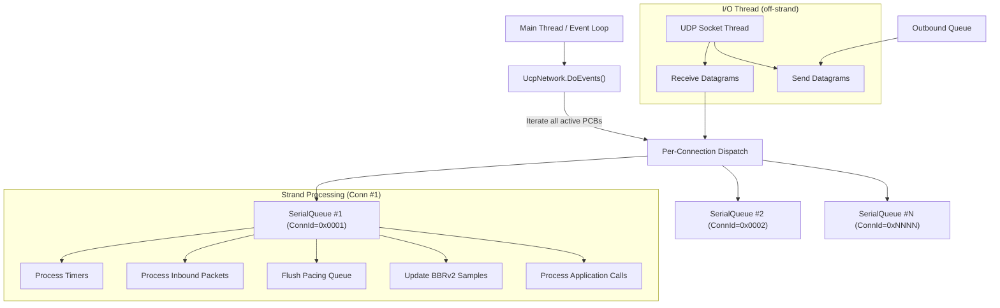
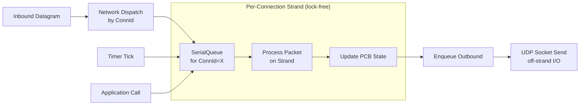
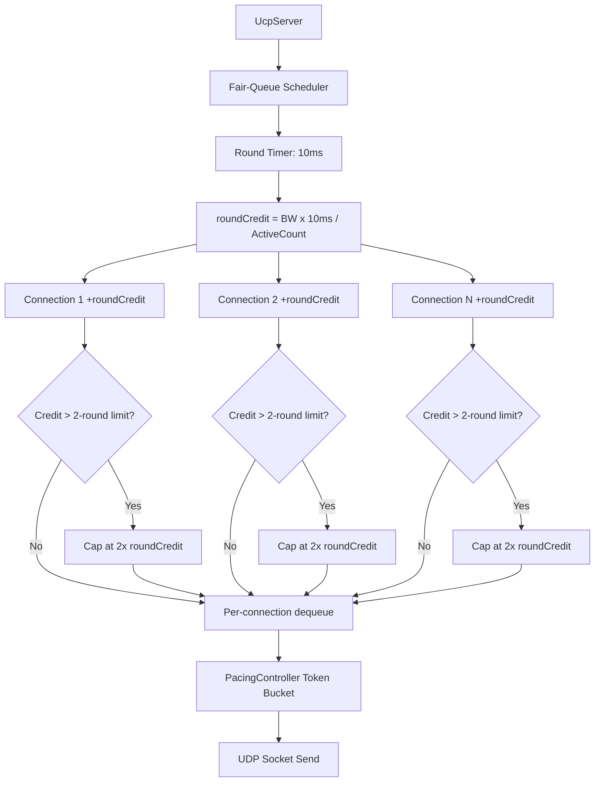
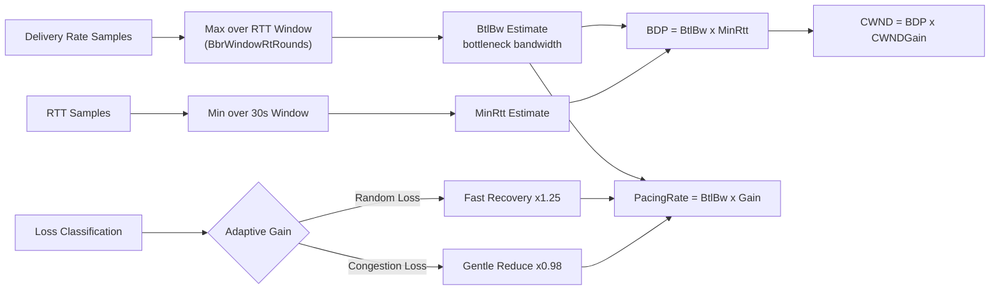
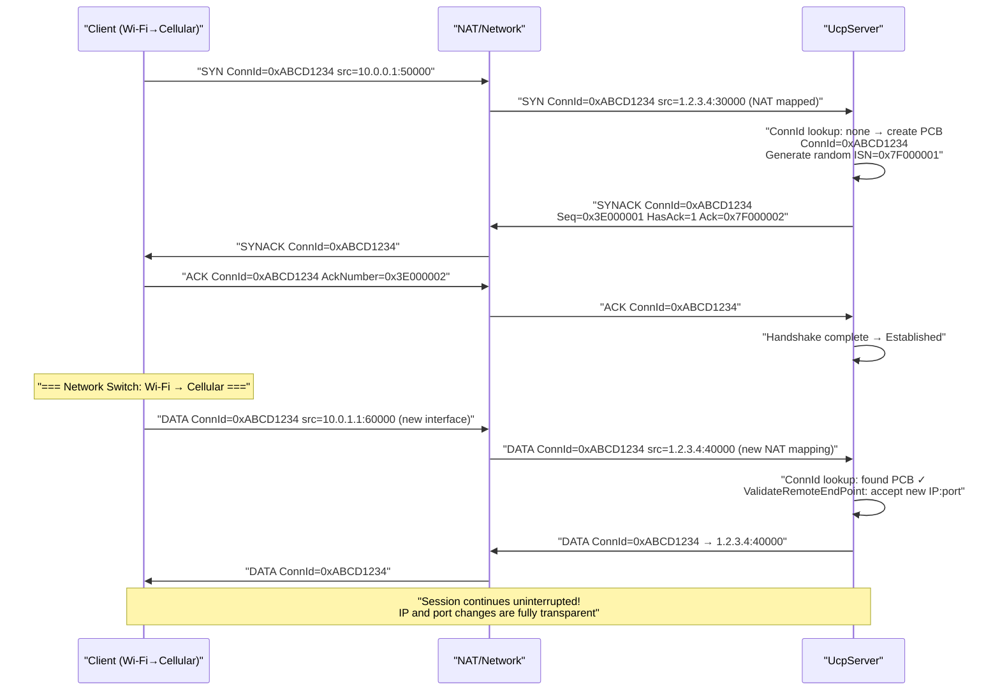
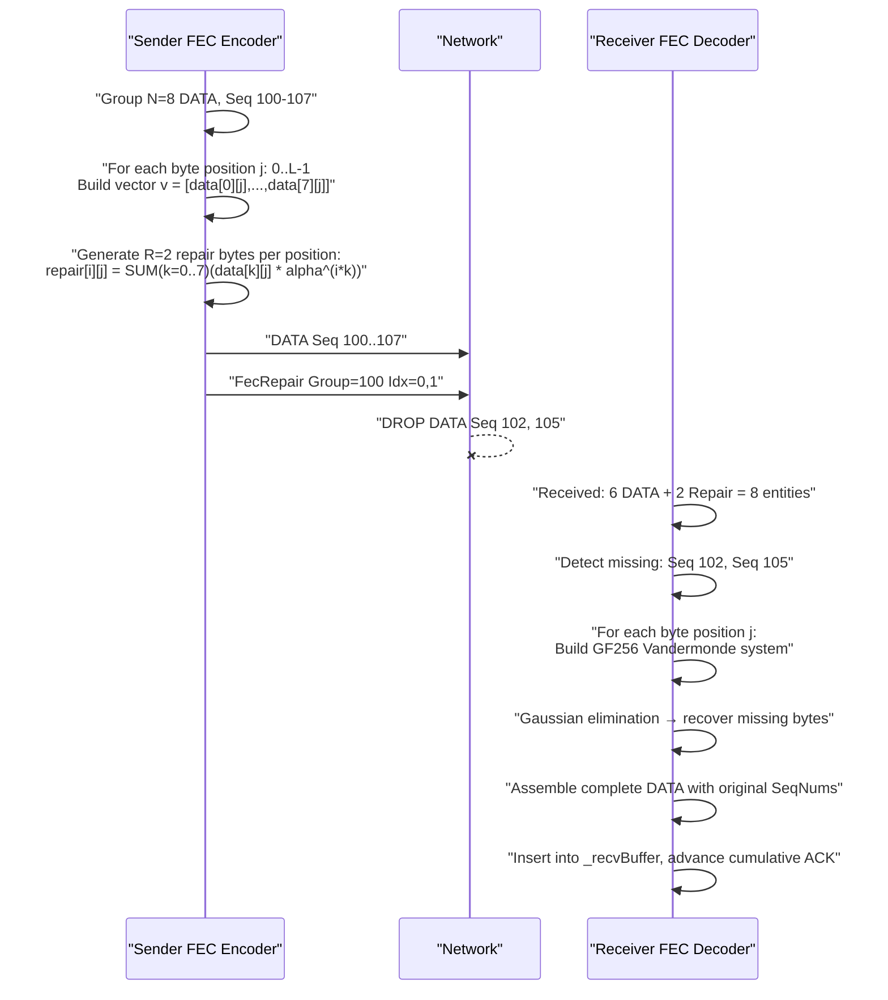
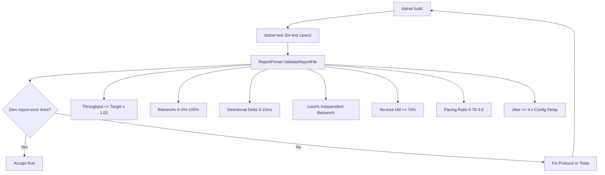

# PPP PRIVATE NETWORK™ X — Universal Communication Protocol (UCP) — Architecture

[中文](architecture_CN.md) | [Documentation Index](index.md)

**Protocol designation: `ppp+ucp`** — This document provides a deep dive into UCP's internal runtime architecture, covering the six-layer design, per-connection UcpPcb state management, Connection-ID-driven IP-agnostic session tracking, SerialQueue strand-based execution, fair-queue server scheduling, PacingController token bucket design, BBRv2 congestion control internals, FEC Reed-Solomon GF(256) codec, complete inbound/outbound packet flow through the protocol stack, deterministic network simulator architecture, and test/validation flow.

---

## Runtime Layered Architecture

UCP is organized in six layers from application-facing APIs down to UDP Socket:



### Layer Responsibilities

| Layer | Key Components | Responsibility |
|---|---|---|
| **Application** | `UcpServer`, `UcpConnection` | Public API. `UcpServer` manages passive accept, fair-queue scheduler, accept queue. `UcpConnection` provides async send/receive with backpressure, event-based data notification, diagnostics. |
| **Protocol Control** | `UcpPcb` (Protocol Control Block) | Complete per-connection state machine: send buffer with retransmit tracking, receive reorder buffer (O(log n) insert), ACK/SACK/NAK pipeline, timers, BBR, pacing, fair-queue credit, optional FEC. All state transitions serialized via SerialQueue. |
| **Congestion & Pacing** | `BbrCongestionControl`, `PacingController`, `UcpRtoEstimator` | BBRv2 computes pacing rate and CWND from delivery-rate samples (circular buffer EWMA). `PacingController` byte token bucket with bounded negative balance. `UcpRtoEstimator` provides smoothed RTT with 95th/99th percentile tracking. |
| **Reliability Engine** | `UcpSackGenerator`, NAK state machine, `UcpFecCodec` | SACK block generation (max 2 sends per range). NAK state machine tracks per-sequence gap observations with three-tier confidence guards. `UcpFecCodec` uses precomputed GF(256) log/antilog tables for O(1) RS encode/decode. |
| **Serialization** | `UcpPacketCodec` | Big-endian wire format for all 8 packet types, including piggybacked ACK field extraction. Validates packet integrity before protocol layer delivery. |
| **Network Driver** | `UcpNetwork`, `UcpDatagramNetwork` | Decouples engine from socket I/O. Connection-ID datagram demultiplexing, `DoEvents()` driver for timer dispatch and fair-queue rounds, SerialQueue strand coordination. |
| **Transport** | `UdpSocketTransport` (implements `IBindableTransport`) | UDP send/receive with dynamic port binding (port=0 for OS-assigned ephemeral). In-process `NetworkSimulator` implements same interface with virtual logical clock. |

### Layered Data Flow



---

## UcpPcb — Protocol Control Block

`UcpPcb` is the central hub of UCP architecture. Each active connection has an independent PCB instance managing all dimensions of the protocol state machine. Unlike traditional kernel control blocks bound to IP:port tuples, UCP's PCB is keyed by a random 32-bit Connection ID, making it immune to IP address changes during a session.

### PCB Component Relationship Diagram

```mermaid
flowchart TD
    PCB["UcpPcb"] --> Sender["Sender State"]
    PCB --> Receiver["Receiver State"]
    PCB --> Timers["Timer Management"]
    PCB --> Recovery["Recovery System"]
    PCB --> Config["Configuration Reference"]
    
    Sender --> SendBuf["_sendBuffer<br/>SortedDictionary"]
    Sender --> Flight["_flightBytes<br/>in-flight counter"]
    Sender --> NextSeq["_nextSendSequence<br/>next sequence"]
    Sender --> SackDedup["_sackFastRetransmitNotified<br/>SACK dedup"]
    Sender --> SackCount["_sackSendCount<br/>per-range count"]
    Sender --> UrgentBudget["_urgentRecoveryPacketsInWindow<br/>urgent budget"]
    Sender --> AckPiggy["_ackPiggybackQueue<br/>pending ACK"]
    
    Receiver --> RecvBuf["_recvBuffer<br/>reorder buffer"]
    Receiver --> NextExp["_nextExpectedSequence<br/>expected next seq"]
    Receiver --> RecvQueue["_receiveQueue<br/>ordered delivery queue"]
    Receiver --> MissCounts["_missingSequenceCounts<br/>gap observation counts"]
    Receiver --> NakTier["_nakConfidenceTier<br/>NAK tier"]
    Receiver --> LastNak["_lastNakIssuedMicros<br/>NAK suppression timestamps"]
    Receiver --> FecMeta["_fecFragmentMetadata<br/>FEC metadata"]
    
    Timers --> RtoTimer["RTO Timer"]
    Timers --> KeepAlive["KeepAlive Timer"]
    Timers --> Disconnect["Disconnect Timer"]
    Timers --> DelayedAck["Delayed ACK Timer"]
    Timers --> ProbeRTT["ProbeRTT Timer"]
    
    Recovery --> BBR["BbrCongestionControl<br/>BBRv2"]
    Recovery --> SACK["UcpSackGenerator<br/>SACK generator"]
    Recovery --> NAK["NAK StateMachine<br/>NAK state machine"]
    Recovery --> FEC["UcpFecCodec<br/>FEC codec"]
    Recovery --> RTO["UcpRtoEstimator<br/>RTO estimator"]
```



### Sender State Details

| Data Structure | Type | Purpose |
|---|---|---|
| `_sendBuffer` | `SortedDictionary<uint, OutboundSegment>` | Sequence-sorted outbound segments awaiting ACK. Each segment tracks original send timestamp, retransmission count, urgent recovery flag, and FEC group affiliation. |
| `_flightBytes` | `long` | Total payload bytes currently in flight. BBRv2 uses this to compute delivery rate and enforce CWND in-flight cap. |
| `_nextSendSequence` | `uint` | Next 32-bit sequence number, incrementing monotonically modulo 2^32. Unsigned comparison with 2^31 window for wrap handling. |
| `_sackFastRetransmitNotified` | `HashSet<uint>` | Deduplicates SACK-triggered fast retransmit decisions per sequence. |
| `_sackSendCount` | `Dictionary<(uint,uint), int>` | Per-block-range send counter. Blocks reaching `SACK_BLOCK_MAX_SENDS`(2) are suppressed. |
| `_urgentRecoveryPacketsInWindow` | `int` | Urgent retransmit packets used in current RTT window (capped at 16). Resets at each new RTT estimate. |
| `_ackPiggybackQueue` | `uint?` | Pending cumulative ACK number to be carried on next outbound packet of any type. |

### Receiver State Details

| Data Structure | Type | Purpose |
|---|---|---|
| `_recvBuffer` | `SortedDictionary<uint, InboundSegment>` | Out-of-order inbound segments sorted by sequence with O(log n) insertion. |
| `_nextExpectedSequence` | `uint` | Next sequence needed for in-order delivery. Advances as contiguous segments drain. |
| `_receiveQueue` | `Queue<byte[]>` | Ordered payload chunks ready for application consumption via `ReadAsync`/`ReceiveAsync`. |
| `_missingSequenceCounts` | `Dictionary<uint, int>` | Per-sequence gap observation counter for NAK tier determination. |
| `_nakConfidenceTier` | `enum {Low, Medium, High}` | Current NAK tier: Low (1-2 obs, RTTx2 guard), Medium (3-4 obs, RTT guard), High (5+ obs, 5ms guard). |
| `_lastNakIssuedMicros` | `Dictionary<uint, long>` | Per-sequence NAK suppression timestamps (250ms repeat interval). |
| `_fecFragmentMetadata` | `Dictionary<uint, FragmentMeta>` | Original fragment metadata for FEC-recovered DATA packets preserving sequence numbers and fragment boundaries. |

---

## SerialQueue Per-Connection Strand Execution

UCP's core concurrency model is the **Strand**. Each `UcpConnection` processes all protocol events through its dedicated `SerialQueue`:



### Strand Model Properties

| Property | Description |
|---|---|
| **Lock-free** | PCB state is never accessed concurrently from multiple threads. All mutations occur sequentially on the same strand. |
| **Predictable ordering** | Packets processed in receipt order; application calls queued and executed sequentially. |
| **Zero deadlock risk** | Strand model eliminates lock-ordering problems and ABBA deadlocks inherent in multi-lock designs. |
| **I/O offloading** | Only actual UDP Socket `Send()` and `Receive()` execute outside the strand. FEC decoding runs on-strand since GF(256) operations are computationally lightweight. |
| **Deterministic testing** | `NetworkSimulator` uses the same strand model with a virtual logical clock, producing fully reproducible results across different CPUs and OSes. |



---

## Fair-Queue Server Scheduling



| Parameter | Value | Meaning |
|---|---|---|
| `FAIR_QUEUE_ROUND_MILLISECONDS` | 10ms | Round duration. Driven by Timer or `UcpNetwork.DoEvents()`. |
| `MAX_BUFFERED_FAIR_QUEUE_ROUNDS` | 2 rounds | Maximum credit accumulation. Long-idle connections cannot burst beyond 2 rounds of credit. |

---

## PacingController Token Bucket

```mermaid
sequenceDiagram
    participant S as "Sender PCB"
    participant P as "PacingController"
    participant FQ as "Fair Queue (server only)"
    participant Net as "UDP Socket"
    
    Note over S,Net: "=== Normal Send Path ==="
    S->>P: "Request normal send (1400B)"
    P->>P: "Check token balance"
    alt "Tokens >= 1400"
        P->>FQ: "Acquire fair-queue credit"
        FQ-->>P: "Credit granted"
        P->>Net: "Send datagram"
        P->>P: "Tokens -= 1400"
    else "Tokens < 1400"
        P->>S: "Defer; retry next timer tick"
    end
    
    Note over S,Net: "=== Urgent Retransmit Path ==="
    S->>P: "ForceConsume(1400)"
    P->>P: "Tokens -= 1400 (may go negative)"
    P->>Net: "Send datagram (bypass FQ)"
    Note over P: "Negative cap: 50% of bucket capacity<br/>Future normal sends repay debt"
```

---

## BBRv2 Congestion Control Internals

### Core Estimate Pipeline



### BBRv2 Mode Behavior

| Mode | Pacing Gain | CWND Gain | Duration | Purpose |
|---|---|---|---|---|
| **Startup** | 2.5 | 2.0 | Until bandwidth plateau (3 RTT rounds w/o growth) | Exponentially probe bottleneck bandwidth |
| **Drain** | 0.75 | — | ~1 BBR cycle (~1 RTT) | Drain excess queue accumulated during Startup |
| **ProbeBW** | Cycled [1.25, 0.85, 1.0*6] | 2.0 | Steady state | Eight-phase gain cycling around BtlBw |
| **ProbeRTT** | 1.0 | 4 packets | 100ms (every 30s) | Refresh MinRTT. Auto-skipped on lossy long-fat paths |

### Network Path Classification

BBRv2 uses 200ms sliding windows of RTT, jitter, loss rate, and throughput ratio:

| Network Type | Characteristics | BBR Adaptive Behavior |
|---|---|---|
| `LowLatencyLAN` | RTT < 1ms, zero loss | Aggressive initial probing, high Startup gain |
| `MobileUnstable` | High jitter, variable RTT | Wider reorder grace, skip ProbeRTT |
| `LossyLongFat` | High BDP, sustained random loss | Preserve CWND, skip ProbeRTT |
| `CongestedBottleneck` | Elevated RTT + delivery-rate drop | Enable loss-aware pacing reduction |
| `SymmetricVPN` | Stable RTT, symmetric bandwidth | Standard BBR probing cycles |

---

## Connection-ID-Driven Session Tracking



This design enables:
- **NAT rebinding resilience**: Server continues routing to the correct PCB
- **IP mobility**: Client migrates Wi-Fi→Cellular retaining the same Connection ID
- **Multipath readiness**: Same Connection ID can route from multiple interfaces to one PCB (future)

---

## FEC — Reed-Solomon GF(256) Codec

### Mathematical Foundation

**Field parameters:**
- Irreducible polynomial: `x^8 + x^4 + x^3 + x + 1` = `0x11B`
- Primitive element α = 0x02
- Addition: XOR (byte-level, hardware native)
- Multiplication: `antilog[(log[a] + log[b]) mod 255]` — O(1) table lookup
- Division: `antilog[(log[a] - log[b] + 255) mod 255]` — O(1) table lookup
- Log table: 256 entries, Antilog table: 512 entries

### Encode/Decode Flow



### Adaptive Redundancy Tiers

| Observed Loss Rate | Adaptive Behavior | Effective Redundancy |
|---|---|---|
| < 0.5% | Minimum (base config, typically 0.0–0.125) | Base value |
| 0.5% – 2% | Slight increase 1.25x | Base × 1.25 |
| 2% – 5% | Moderate increase 1.5x, reduce group size | Base × 1.5, min group 4 |
| 5% – 10% | Maximum adaptive 2.0x | Base × 2.0, min group 4 |
| > 10% | FEC alone insufficient; retransmission primary | FEC auxiliary role |

---

## Deterministic Network Simulator

`NetworkSimulator` provides the infrastructure for reproducible deterministic testing:

- **Virtual logical clock**: Independent of system wall clock, byte-precise serialization through bottleneck queue. Eliminates OS scheduling jitter.
- **Independent bidirectional delays**: Per-direction configurable propagation delay and jitter for asymmetric route modeling.
- **Configurable impairments**: Random or deterministic packet loss, duplication, and reordering (independently controllable).
- **Mid-transfer outage**: Configurable trigger time and duration (e.g., Weak4G: 900ms trigger, 80ms full blackout).
- **Packet integrity tracking**: Per-packet forward/return timestamps for precise one-way delay and convergence measurement.

---

## Test Architecture

| Test Area | Examples | Validates |
|---|---|---|
| **Core Protocol** | SequenceWrapAround, CodecRoundTrip, RtoConvergence, PacingTokenArithmetic | Wire format correctness, sequence arithmetic, RTO convergence, token bucket math |
| **Connection Mgmt** | ConnIdDemux, RandomISNUniqueness, DynamicIPRebind, SerialQueueOrdering | Connection-ID demux, ISN uniqueness, IP rebinding, strand ordering |
| **Reliability** | LossyTransfer, BurstLoss, Sack2SendLimit, NakTieredConfidence, FecRecovery | Recovery correctness under all loss patterns |
| **Stream Integrity** | Reordering, Duplication, PartialRead, FullDuplex, PiggybackedAckAllTypes | Application data integrity under all impairments |
| **Performance** | 14+ scenarios 4Mbps-10Gbps | Throughput, convergence, Retrans%/Loss% independence |
| **Report Validation** | ReportPrinter.ValidateReportFile | Physical plausibility of all metrics |

---

## Validation Flow


