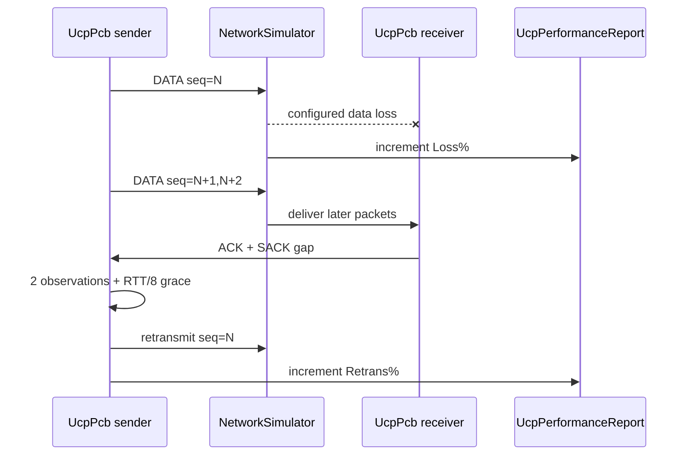

# UCP 架构深度解析 / UCP Architecture Deep Dive

本文件从运行时架构角度解释 UCP。English notes are included so operational behavior, benchmark output, and maintenance responsibilities are explicit for mixed-language teams.

## 1. 总体分层

```
┌─────────────────────────────────────┐
│           应用层 (App)              │
│   UcpServer / UcpConnection         │
├─────────────────────────────────────┤
│           协议核心 (Core)           │
│   UcpPcb (传输控制块)               │
│   ├─ BbrCongestionControl           │
│   ├─ PacingController               │
│   ├─ UcpRtoEstimator                │
│   ├─ UcpSackGenerator               │
│   ├─ UcpFecCodec                    │
│   └─ 接收/发送状态机                │
├─────────────────────────────────────┤
│           序列化层 (Codec)          │
│   UcpPacketCodec (大端序编解码)     │
├─────────────────────────────────────┤
│           执行层 (Execution)        │
│   SerialQueue (每连接串行)          │
├─────────────────────────────────────┤
│           网络驱动层 (Network)      │
│   UcpNetwork (抽象事件循环)         │
│   UcpDatagramNetwork (UDP 实现)     │
├─────────────────────────────────────┤
│           传输层 (Transport)        │
│   UdpSocketTransport / ITransport   │
└─────────────────────────────────────┘
```

---

## 2. UcpPcb — 传输控制块

`UcpPcb` 是每个连接的核心状态机，维护：

### 2.1 发送端状态

| 数据结构 | 类型 | 用途 |
|---|---|---|
| `_sendBuffer` | `SortedDictionary<uint, OutboundSegment>` | 按序号排序的待确认分段 |
| `_flightBytes` | int | 当前在途字节数 |
| `_nextSendSequence` | uint | 下一个发送序号（32 位环绕） |
| `_sentDataPackets` / `_retransmittedPackets` | int | 统计计数器 |

### 2.2 接收端状态

| 数据结构 | 类型 | 用途 |
|---|---|---|
| `_recvBuffer` | `SortedDictionary<uint, InboundSegment>` | 乱序缓冲区 |
| `_nextExpectedSequence` | uint | 期望的下一个有序序号 |
| `_receiveQueue` | `Queue<ReceiveChunk>` | 有序待交付数据 |
| `_missingSequenceCounts` | `Dictionary<uint, int>` | 缺口观测计数（用于 NAK 触发） |
| `_missingFirstSeenMicros` | `Dictionary<uint, long>` | 缺口首次发现时间 |
| `_nakIssued` | `HashSet<uint>` | 已发出的 NAK 序列号（避免重复） |

### 2.3 有序交付

`HandleData()` 收到数据包后：
1. 若包序号 == `_nextExpectedSequence`，直接放入 `_receiveQueue` 并调用 `EnqueuePayload()` 触发 `OnData` 事件
2. 若包序号 > `_nextExpectedSequence`，存入 `_recvBuffer`
3. 然后扫描 `_recvBuffer`，发现连续就绪的包后批量取出并交付
4. 交付后立即触发 `_receiveSignal`，唤醒阻塞的 `ReadAsync`/`ReceiveAsync`

---

## 3. BBR 拥塞控制深度剖析

### 3.1 带宽估计

```
deliveryRate = deliveredBytes / intervalMicros
btl_bw = max(deliveryRate over window of BBR_WINDOW_RTT_ROUNDS × MinRtt)
```

带宽增长受限于 `BBR_STARTUP_BANDWIDTH_GROWTH_PER_ROUND=2.0`（Startup）或 1.25（稳态），防止 ACK 压缩样本导致的虚假飙升。

### 3.2 RTT 追踪

- `MinRtt`: 维护最近 `ProbeRttIntervalMicros`（30s）内的最小值
- RTT 滤波器：`SRTT = 7/8 * SRTT + 1/8 * sample`，`RTTVAR = 3/4 * RTTVAR + 1/4 * |sample - SRTT|`
- Karn 保护：恢复期（RTO 超时后）的过期样本被 `RTT_RECOVERY_SAMPLE_MAX_RTO_MULTIPLIER=1.0` 过滤

### 3.3 Inflight 护栏

```
inflightLow = max(InitialCWND, BDP × BBR_INFLIGHT_LOW_GAIN)  // 1.10
inflightHigh = max(inflightLow, BDP × BBR_INFLIGHT_HIGH_GAIN) // 1.50
```

实际 CWND 会被限制在 `[inflightLow, inflightHigh]` 区间内。拥塞丢包时 CWND gain 不低于 0.95，ACK 到达后以 0.04/ACK 的步长恢复，避免随机丢包长期压低窗口。

English: inflight guardrails are not a loss-based collapse mechanism. They keep enough pipe occupancy for BBR to recover quickly after transient loss, while still bounding queue growth when congestion evidence is real.

### 3.4 Loss-CWND 恢复

每次 ACK 到达时，`lossCwndGain` 以 `BBR_LOSS_CWND_RECOVERY_STEP=0.04` 的步长向 1.0 恢复。这确保了非拥塞丢包后 CWND 不会永久缩小，也让弱网/outage 后恢复更快。

---

## 4. Pacing 控制器

### 4.1 令牌桶机制

```
容量 = PacingRate × BucketDuration / 1s  // 默认 10ms 窗口
速率 = PacingRate bytes/s
```

每微秒按比例补充令牌。发送前必须消耗对应包大小的令牌。

### 4.2 等待时间计算

```
deficit = bytes - tokens
waitMicros = deficit / PacingRate * 1s
waitMicros = max(waitMicros, MinPacingIntervalMicros)  // 默认 1ms 下限
```

---

## 5. 丢包分类器（UcpPcb 端）

### 5.1 滑动窗口

```
窗口长度 = 2 × MinRtt（至少 1ms）
去重方式：HashSet<uint> 记录已分类的序列号
```

### 5.2 分类规则

```
if (去重丢包数 ≤ 2 && 最大连续丢包 < 3) → 随机丢包
else if (去重丢包数 > 3 || 最大连续 ≥ 3) && RTT中位数 > MinRTT × 1.1 → 拥塞丢包
else → 随机丢包
```

### 5.3 动作差异

| 分类 | BBR 响应 | 重传动作 |
|---|---|---|
| 随机丢包 | 不降 pacing/cwnd | 立即重传 |
| 拥塞丢包 | 温和降 pacing × 0.98, cwnd gain 下限 0.95 | 立即重传 |

English: UCP treats loss as a signal that must be classified. Random or route-induced loss repairs data without shrinking the pipe; only classified congestion applies a gentle reduction.

---

## 6. NAK / SACK 快速重传

### 6.1 SACK 快速重传（发送端）

```
条件（任一满足且 EnableAggressiveSackRecovery=true）：
1. 段序号 == firstMissingSequence && MissingAckCount ≥ 2 && age ≥ max(5ms, RTT/8)
2. highestSack - seq ≥ 2 && MissingAckCount ≥ 2 && age ≥ max(5ms, RTT/8)
```

`EnableAggressiveSackRecovery` 仅在 ≥1 Gbps + 有配置丢包的场景开启。

### 6.2 NAK 生成（接收端）

```
条件：
1. missingCount ≥ NAK_MISSING_THRESHOLD (2)
2. now - firstSeenMicros ≥ NAK_REORDER_GRACE_MICROS (60ms)
3. 未在此 RTT 窗口内发出过此序号的 NAK
```

SACK 是快速补洞路径，NAK 是保守兜底路径。English: SACK provides QUIC-style fast retransmit after two observations, while NAK keeps a long reorder guard so high-jitter routes do not create artificial retransmission overhead.

---

## 7. 串行队列（SerialQueue）

### 7.1 实现

```csharp
Queue<Func<Task>> _queue;  // FIFO
bool _processing;           // 防止重复启动处理循环
```

`ProcessLoopAsync()` 在一个 `Task.Run` 中循环消费队列，直到队列为空。

### 7.2 优先级调度

```csharp
PostPriority(Func<Task> action)
```

NAK 包使用 `PostPriority` 插队到队列头部，确保补洞信号不被普通 ACK 阻塞。

---

## 8. 测试架构

### 8.1 NetworkSimulator

- `SortedDictionary<long, List<SimulatedDatagram>>` 按到期时间排序
- 独立调度线程 `SchedulerLoopAsync`
- 带宽模型：`nextTransmitAvailableMicros += serializationMicros`
- 逻辑时钟：无丢包 + ≥10 MB/s 带宽时启用虚拟时钟，排除线程调度噪声
- 吞吐口径：报告吞吐被链路目标速率封顶，避免出现超过 `Target Mbps` 的不可信结果
- 丢包口径：`Loss%` 来自仿真器实际 DATA 包丢弃比例，`Retrans%` 来自发送端重传比例，两者不再混用
- 路由口径：A->B 与 B->A 独立建模，测试矩阵同时覆盖去程高和回程高，方向差保持 3-15ms

### 8.2 测试场景覆盖

| 维度 | 覆盖 |
|---|---|
| 带宽 | 500 KB/s → 10 Gbps |
| 延迟 | 0ms → 300ms |
| 抖动 | 0ms → 30ms |
| 丢包率 | 0% → 10% |
| 网络类型 | LAN, DataCenter, Enterprise, Mobile 3G/4G, Satellite, VPN, LongFat, Asymmetric, Burst, Weak4G, HighJitter |

### 8.3 报告生成

- `summary.txt`：每场景一行 ASCII 表格，包含吞吐/利用率/重传/RTT/CWND/Pacing
- `test_report.txt`：最终格式化的 20+ 行表格
- 报告验证：`UcpPerformanceReport.ValidateReportFile()` 确保所有必选场景存在且指标在合法范围



---

## 9. FQ 公平队列

服务端 `UcpServer` 维护多连接公平调度：

- 每 `FairQueueRoundMilliseconds`（10ms）触发一轮
- 按每连接的 `CurrentPacingRateBytesPerSecond` 占比分配信用
- 信用上限为 `MaxBufferedFairQueueRounds=2` 轮的预算
- 调度按轮询索引 `_fairQueueStartIndex` 保证公平
