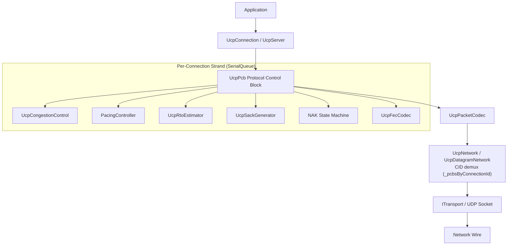
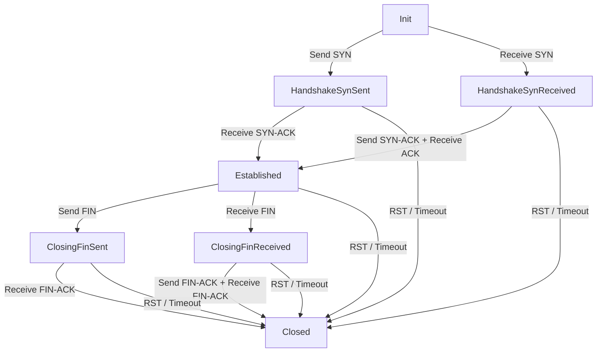
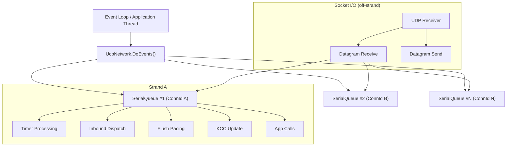
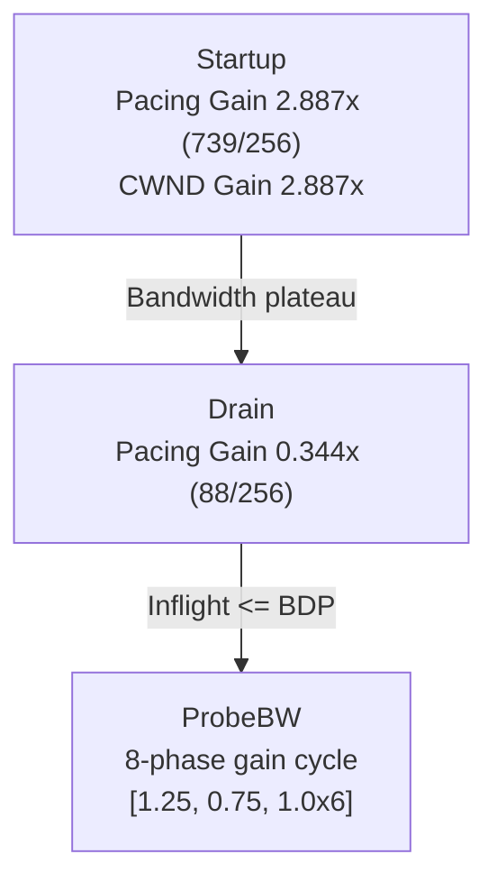
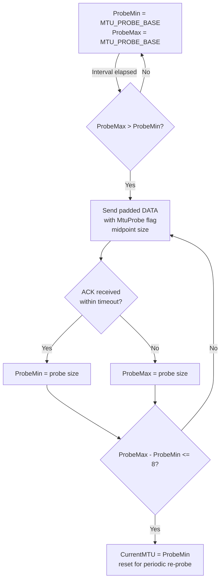
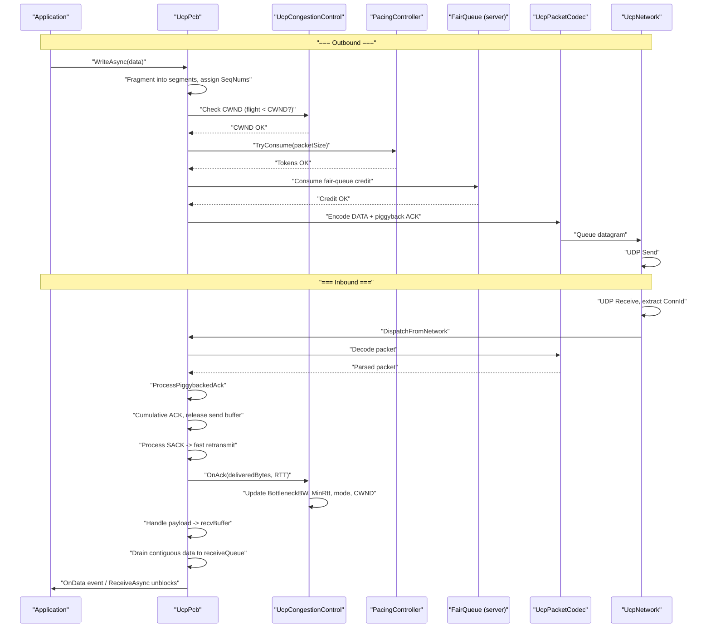

# PPP PRIVATE NETWORK™ X — Universal Communication Protocol (UCP) — Architecture

[Chinese](architecture_CN.md) | [Documentation Index](index.md)

This document describes UCP's internal runtime architecture. UCP is a pure control protocol operating over UDP: CID round-robin switching, FEC forward error correction, piggybacked ACK, and SACK/NAK are independent subsystems that feed high-fidelity delivery samples into the KCC (Geodesic Congestion Control, KF component from tcp_kcc.c v2.0) congestion control for accurate BDP/RTT estimation. The architecture covers the six-layer design, the UcpPcb protocol engine, per-connection SerialQueue strand execution, the KCC congestion control engine with its geodesic propagation delay estimation, the PacingController token bucket, the FEC Reed-Solomon GF(256) codec, dynamic CID migration, and DPLPMTUD.

Source files referenced throughout this document live under `Ucp/` and `Ucp/Internal/`.

## Six-Layer Runtime Architecture

UCP is organized from application-facing APIs down to the UDP socket:

```mermaid
flowchart TD
    App["Application"] --> Conn["UcpConnection / UcpServer"]
    Conn --> Pcb["UcpPcb Protocol Control Block"]
    Pcb --> UCP["UcpCongestionControl"]
    Pcb --> Pacing["PacingController"]
    Pcb --> Rto["UcpRtoEstimator"]
    Pcb --> Sack["UcpSackGenerator"]
    Pcb --> Nak["NAK State Machine"]
    Pcb --> Fec["UcpFecCodec"]
    Pcb --> Codec["UcpPacketCodec"]
    Codec --> Net["UcpNetwork / UcpDatagramNetwork<br/>CID demux (_pcbsByConnectionId)"]
    Net --> Trans["ITransport / UDP Socket"]
    Trans --> Wire["Network Wire"]

    subgraph Strand["Per-Connection Strand (SerialQueue)"]
        Pcb
        UCP
        Pacing
        Rto
        Sack
        Nak
        Fec
    end
```

### Layer Responsibilities

| Layer | Key Components | Responsibility |
| - | - | - |
| Application | `UcpServer`, `UcpConnection` | Public API. Passive accept with fair-queue, async send/receive with backpressure, events, diagnostics `UcpConnection.cs:620` |
| Protocol Control | `UcpPcb` | Complete per-connection state machine: send buffer, receive reorder, ACK/SACK/NAK pipeline, timers, KCC, pacing, FEC. All serialized via SerialQueue `UcpPcb.cs:13` |
| Congestion and Pacing | `UcpCongestionControl`, `PacingController`, `UcpRtoEstimator` | KCC congestion control (KF component from tcp_kcc.c v2.0) computes pacing rate and CWND. PacingController token bucket. RTO estimator `UcpRtoEstimator.cs:6` |
| Reliability Engine | `UcpSackGenerator`, NAK machine, `UcpFecCodec` | SACK blocks (max 2 sends), NAK gap observations with 3-tier confidence, FEC with precomputed GF(256) tables `UcpFecCodec.cs:7` |
| Serialization | `UcpPacketCodec` | Big-endian wire format for all 8 packet types. Integrity validation before delivery |
| Network Driver | `UcpNetwork`, `UcpDatagramNetwork` | Decouples engine from socket I/O. ConnId datagram demux, DoEvents timer dispatch, fair-queue rounds, SerialQueue coordination `UcpNetwork.cs:12` |
| Transport | `UdpSocketTransport` | UDP send/receive with dynamic port binding. `NetworkSimulator` implements same interface with virtual logical clock |

## Protocol Engine (UcpPcb)

`UcpPcb` at `Ucp/Internal/UcpPcb.cs:13` is the central hub. Each active connection has an independent PCB instance keyed by a 32-bit Connection ID.

### UcpPcb State Machine

```mermaid
flowchart TD
    Init["Init"] -->|"Send SYN"| SynSent["HandshakeSynSent"]
    Init -->|"Receive SYN"| SynRcvd["HandshakeSynReceived"]
    SynSent -->|"Receive SYN-ACK"| Established["Established"]
    SynRcvd -->|"Send SYN-ACK + Receive ACK"| Established
    Established -->|"Send FIN"| FinSent["ClosingFinSent"]
    Established -->|"Receive FIN"| FinRcvd["ClosingFinReceived"]
    FinSent -->|"Receive FIN-ACK"| Closed["Closed"]
    FinRcvd -->|"Send FIN-ACK + Receive FIN-ACK"| Closed
    Established -->|"RST / Timeout"| Closed
    SynSent -->|"RST / Timeout"| Closed
    SynRcvd -->|"RST / Timeout"| Closed
    FinSent -->|"RST / Timeout"| Closed
    FinRcvd -->|"RST / Timeout"| Closed
```

### Send Pipeline

| Component | File | Role |
| - | - | - |
| `_sendBuffer` | `UcpPcb.cs:111` | SortedDictionary of outbound segments keyed by sequence number |
| `_flightBytes` | `UcpPcb.cs:179` | Total payload bytes in flight for CWND enforcement |
| `_nextSendSequence` | `UcpPcb.cs:173` | Monotonically increasing 32-bit sequence from random ISN |
| `FlushSendQueueAsync` | `UcpPcb.cs` | Collects segments, checks CWND, pacing, fair-queue, encodes, transmits |
| `_ackDelayed` | `UcpPcb.cs` | Delayed-ACK flag; when set, the next DATA packet carries a piggybacked cumulative ACK |

On each ACK arrival, `ProcessPiggybackedAck` (`UcpPcb.cs:1197`) walks the send buffer, marks segments as acknowledged, decrements `_flightBytes`, records RTT samples, and signals `_sendSpaceSignal` for blocked writers.

### Receive Pipeline

| Component | File | Role |
| - | - | - |
| `_recvBuffer` | `UcpPcb.cs:113` | SortedDictionary for out-of-order inbound segments |
| `_nextExpectedSequence` | `UcpPcb.cs:175` | Next sequence needed for in-order delivery |
| `_receiveQueue` | `UcpPcb.cs:115` | Queue of contiguous data chunks for `ReadAsync` |
| `_nakIssued` | `UcpPcb.cs:117` | Suppresses duplicate NAKs per sequence within RTT window |
| `_missingSequenceCounts` | `UcpPcb.cs:119` | Observation counts for NAK tier escalation |

Inbound dispatch (`HandleInboundAsync` at `UcpPcb.cs:1001`) routes by packet type: SYN, SYN-ACK, ACK, DATA, NAK, FEC-REPAIR, FIN, RST.

### Timer Management

| Timer | Mechanism | Purpose |
| - | - | - |
| RTO | `UcpRtoEstimator` at `UcpRtoEstimator.cs:6` | Retransmission timeout, RFC 6298 style, exponential backoff |
| TLP | `_tailLossProbePending` at `UcpPcb.cs:304` | Tail-loss probe when inflight is low, fires at TLP_TIMEOUT_RTT_RATIO x SRTT |
| Delayed ACK | `_ackDelayed` at `UcpPcb.cs:232` | Coalesces ACKs within a window, piggybacked on next DATA |
| Keep-Alive | `_lastPeerAliveMicros` at `UcpPcb.cs:190` | Periodic probe during idle to detect silent peer death |
| Disconnect | `_config.DisconnectTimeoutMicros` | Maximum idle time before forced close |

In network-managed mode (`UcpNetwork` at `UcpNetwork.cs:12`), all timers share a single sorted timer heap (`_timerHeap` at `UcpNetwork.cs:86`) driven by `DoEvents` (`UcpNetwork.cs:297`). Standalone mode uses a per-PCB `System.Threading.Timer`.

## SerialQueue Per-Connection Strand

`SerialQueue` at `Ucp/Internal/SerialQueue.cs:10` implements a lightweight per-connection strand:

```mermaid
flowchart TD
    Main["Event Loop / Application Thread"] --> DoEvents["UcpNetwork.DoEvents()"]
    DoEvents --> SQ1["SerialQueue #1 (ConnId A)"]
    DoEvents --> SQ2["SerialQueue #2 (ConnId B)"]
    DoEvents --> SQN["SerialQueue #N (ConnId N)"]

    subgraph Strand1["Strand A"]
        SQ1 --> T1["Timer Processing"]
        SQ1 --> T2["Inbound Dispatch"]
        SQ1 --> T3["Flush Pacing"]
        SQ1 --> T4["KCC Update"]
        SQ1 --> T5["App Calls"]
    end

    subgraph IO["Socket I/O (off-strand)"]
        IOThread["UDP Receiver"] --> Recv["Datagram Receive"]
        IOThread --> Send["Datagram Send"]
    end

    Recv --> SQ1
    Recv --> SQ2
    Recv --> SQN
```

| Property | Description |
| - | - |
| Lock-free | PCB state never accessed from multiple threads concurrently |
| Priority queuing | `PostPriority` inserts via `LinkedList.AddFirst` (O(1)) for NAK packets `SerialQueue.cs:85` |
| Exception isolation | Caught exceptions logged via `Trace`; processing loop continues `SerialQueue.cs:260-287` |
| I/O offloading | Only UDP socket Send/Receive execute outside the strand |

## KCC Congestion Control

`UcpCongestionControl` at `Ucp/UcpCongestionControl.cs:52` implements the KCC (Geodesic Congestion Control) controller. The 3-mode state machine (STARTUP/DRAIN/PROBE_BW, KCC 2.0-style) lives in UcpCongestionControl (C#/C++); the geodesic estimator for propagation delay estimation (derived from tcp_kcc.c v2.0). MinRTT tracking is handled automatically by geodesic G1/G3.

### KCC Congestion Control State Machine

```mermaid
flowchart TD
    Startup["Startup<br/>Pacing Gain 2.887x (739/256)<br/>CWND Gain 2.887x"] -->|"Bandwidth plateau"| Drain["Drain<br/>Pacing Gain 0.344x (88/256)"]
    Drain -->|"Inflight <= BDP"| ProbeBW["ProbeBW<br/>8-phase gain cycle<br/>[1.25, 0.75, 1.0x6]"]
```

Note: The 3-mode state machine (KCC 2.0-style, STARTUP/DRAIN/PROBE_BW) with fixed open-loop gains is implemented in UcpCongestionControl (C#/C++) and matches tcp_kcc.c. MinRTT tracking is handled automatically by the geodesic estimator G1/G3. The sendable upper limit is min(cwnd, peer-declared receive window); the initial cwnd is NOT a fixed 10-packet cap.

### KCC Mode Behavior

| Mode | Pacing Gain | CWND Gain | Duration | Trigger |
| - | - | - | - | - |
| Startup | 2.887 (739/256) | 2.887 | Until bandwidth plateaus | Connection start |
| Drain | 0.344 (88/256) | 2.887 | ~1 RTT | Bandwidth growth stalls |
| ProbeBW | 8-phase gain cycle [1.25, 0.75, 1.0x6] | 2.0 | Steady state | Drain completes |
| MinRTT (via G1/G3) | -- | -- | Continuous | Geodesic estimator G1/G3 automatically tracks min RTT |

### Bandwidth Estimation

Bottleneck bandwidth is computed as the max-filtered delivery rate over a sliding window of recent ACK rounds (10-round window, matching tcp_kcc.c KCC_BW_RT_CYCLE_LEN). The max-filter is robust to ACK compression while tracking bandwidth growth. A long-term bandwidth estimate is maintained via EWMA over delivery-rate samples.

### Geodesic Estimator for Propagation Delay Estimation

A geodesic structural estimator (G1/G2/G3) estimates the true propagation delay (RTT base) by separating signal from measurement noise using a three-component behavioral model (T_prop / T_queue / T_noise). The estimator has one state variable (x_est, scaled by 1024) and three structural branches: G1 instant downward absorption, G2 upward bounded growth (12.2% per RTT, capped at the observation), and G3 dual-threshold path-increase detection (fast: 6 consecutive events at >= 1.10 x min_rtt; slow: 7 consecutive events at >= 1.05 x min_rtt). There is no covariance matrix, no process model, and no adaptive gain. The scalar convergence proxy p_est (init 1000, floor 10) tracks estimator confidence. The geodesic-filtered RTT feeds into automatic MinRtt tracking via G1/G3.

### RTT Estimation (Geodesic Estimator)

A geodesic structural estimator (G1/G2/G3) estimates the true propagation delay by separating signal from measurement noise:

- **State x_est**: True propagation delay (us x 1024 scale)
- **G1 (downward)**: x_est = min(x_est, z) -- instant absorption of downward noise
- **G2 (upward)**: x_est = min(x_est + 12.2% per RTT, z) -- bounded growth capped at the observation
- **G3 (path change)**: dual-threshold Wald SPRT -- fast 6 consecutive events at 1.10x, slow 7 consecutive events at 1.05x, with a three-tier min_rtt lock (<5 ms locked, 5-7.5 ms fast-only, >=7.5 ms fast+slow)
- **min_rtt takeover**: x_est >> scale replaces window-min after minimum samples (5)

When the geodesic estimator is converged, the filter provides noise-immune min_rtt estimation.

### ECN-Aware Backoff

When ECN is enabled (opt-in, disabled by default), CE-marked segments are tracked via EWMA of the ECN mark ratio. If ecn_ewma > 0 and qdelay_avg exceeds the congestion threshold (max(25% x min_rtt, 500 us)), cwnd_gain is reduced proportionally by the backoff fraction (default 20%). During probing (pacing_gain > BBR_UNIT), backoff suppression is graduated by `BBR_UNIT² / pacing_gain`. In PROBE_BW mode, cwnd_gain stays at 2.0x (default UcpCongestionControl behavior). Per-ACK idle decay (kcc_ecn_idle_decay_num/den, default 31/32) ensures ECN marks do not persist indefinitely on steady connections.

## PacingController Token Bucket

`PacingController` at `Ucp/PacingController.cs:6` enforces the congestion-control-computed pacing rate:

| Operation | Description |
| - | - |
| `TryConsume(bytes, now)` | Refills bucket, deducts tokens if sufficient, returns bool `PacingController.cs:76` |
| `ForceConsume(bytes, now)` | Drains tokens to zero for urgent retransmit bypass `PacingController.cs:95` |
| `GetWaitTimeMicros(bytes, now)` | Returns microseconds until `bytes` tokens are available `PacingController.cs:105` |
| `SetRate(rate, now)` | Updates pacing rate, recalculates bucket capacity `PacingController.cs:50` |

The bucket capacity is `rate x bucketDuration / 1s`, floored at one MTU. ForceConsume bypasses pacing for urgent retransmits by draining positive tokens to zero; tokens never go negative.

FEC and NAK are independent but complementary mechanisms that feed high-fidelity delivery samples into KCC congestion control. FEC proactively inserts repair packets to recover lost data without waiting for retransmission; recovered bytes are delivered as bandwidth samples to improve throughput/RTT estimation. NAK reactively reports missing sequences when FEC recovery fails or is unavailable; loss samples from NAK observations improve the long-term bandwidth EWMA and geodesic RTT estimation. Together they enable accurate bandwidth and delay estimation even under significant packet loss. FEC-recovered bytes contribute to the delivery-rate sample, maintaining the bandwidth estimate through loss bursts. NAK packets do not carry an echo timestamp; RTT estimation is driven by ACK piggyback/echo on data and ACK packets.

## FEC Reed-Solomon GF(256) Codec

`UcpFecCodec` at `Ucp/UcpFecCodec.cs:7` provides systematic forward error correction.

### Mathematical Foundation

- Irreducible polynomial: x^8 + x^4 + x^3 + x^2 + 1 = 0x11d
- Primitive element alpha = 0x02
- Addition: XOR (byte-level)
- Multiplication: antilog[(log[a] + log[b]) mod 255] via O(1) table lookup
- Log table: 256 entries, Antilog table: 512 entries `UcpFecCodec.cs:20-22, 40-58`

### Encoding

Groups of `FecGroupSize` consecutive data packets generate `ceil(groupSize x redundancy)` repair packets using Vandermonde-weighted XOR. Each repair carries a length table (2 bytes per slot) for variable-length payload support. `EncodeRepairsFromGroup` at `UcpFecCodec.cs:155`.

### Decoding

The decoder builds a Vandermonde coefficient matrix from missing slot indices and available repair indices, then runs Gaussian elimination over GF(256) (`TrySolve` at `UcpFecCodec.cs:516`). Requires at least as many independent repair packets as missing data packets.

### Adaptive Redundancy

Adaptive FEC is a binary switch: when the congestion controller's `EstimatedLossPercent` reaches `ADAPTIVE_FEC_LOSS_THRESHOLD_PERCENT` (2%), the sender emits the configured `ceil(groupSize x redundancy)` repair packets; below the threshold no repair packets are emitted. The redundancy ratio itself (`FecRedundancy`) is a fixed configuration value, not scaled by loss level.

## Dynamic CID Migration

Connection ID rotates every 60 seconds to prevent long-term linkability:

| Mechanism | File | Description |
| - | - | - |
| `_extraCids` | `UcpPcb.cs:310` | Valid alternate CIDs for multi-homing |
| `_pendingNewCid` | `UcpPcb.cs:312` | CID being negotiated during rotation |
| `IsValidCid` | `UcpPcb.cs:599` | Checks primary and extra CIDs for packet routing |
| `AddExtraCid` | `UcpPcb.cs:608` | Registers an additional CID |
| `RemoveExtraCid` | `UcpPcb.cs:617` | Removes a CID after rotation completes |

Both old and new CIDs remain valid for 120 seconds for smooth transitions. PATH_CHALLENGE (`UcpPcb.cs:658-685, 2917`) verifies new endpoints before accepting IP migration, with rate limiting at `PATH_CHALLENGE_RATE_LIMIT_MICROS` and a maximum of `PATH_CHALLENGE_MAX_ATTEMPTS` attempts before unconditional acceptance.

## DPLPMTUD (Path MTU Discovery)

`UcpPcb` implements Datagram Packetization Layer Path MTU Discovery:

```mermaid
flowchart TD
    Idle["ProbeMin = MTU_PROBE_BASE<br/>ProbeMax = MTU_PROBE_BASE"] -->|"Interval elapsed"| Search{"ProbeMax > ProbeMin?"}
    Search -->|"No"| Idle
    Search -->|"Yes"| SendProbe["Send padded DATA<br/>with MtuProbe flag<br/>midpoint size"]
    SendProbe --> AckCheck{"ACK received<br/>within timeout?"}
    AckCheck -->|"Yes"| RaiseMin["ProbeMin = probe size"]
    AckCheck -->|"No"| LowerMax["ProbeMax = probe size"]
    RaiseMin --> Converge{"ProbeMax - ProbeMin <= 8?"}
    LowerMax --> Converge
    Converge -->|"Yes"| SetMtu["CurrentMTU = ProbeMin<br/>reset for periodic re-probe"]
    Converge -->|"No"| SendProbe
```

| Parameter | Value | Description |
| - | - | - |
| MTU_PROBE_BASE | 1200 | Starting lower bound |
| Probe range | 1200 - 1500 | Binary search range |
| Probe method | Padded DATA with MtuProbe flag | Non-probe packets use CurrentMTU |
| Confirmation | ACK of probe packet | Timeout = RTT + safety margin |
| Re-probe | Periodic after convergence | Detects path MTU increases |

## Packet Flow Through the Stack

```mermaid
sequenceDiagram
    participant App as "Application"
    participant PCB as "UcpPcb"
    participant UCP as "UcpCongestionControl"
    participant Pace as "PacingController"
    participant FQ as "FairQueue (server)"
    participant Codec as "UcpPacketCodec"
    participant Net as "UcpNetwork"

    Note over App,Net: "=== Outbound ==="
    App->>PCB: "WriteAsync(data)"
    PCB->>PCB: "Fragment into segments, assign SeqNums"
    PCB->>UCP: "Check CWND (flight < CWND?)"
    UCP-->>PCB: "CWND OK"
    PCB->>Pace: "TryConsume(packetSize)"
    Pace-->>PCB: "Tokens OK"
    PCB->>FQ: "Consume fair-queue credit"
    FQ-->>PCB: "Credit OK"
    PCB->>Codec: "Encode DATA + piggyback ACK"
    Codec->>Net: "Queue datagram"
    Net->>Net: "UDP Send"

    Note over App,Net: "=== Inbound ==="
    Net->>Net: "UDP Receive, extract ConnId"
    Net->>PCB: "DispatchFromNetwork"
    PCB->>Codec: "Decode packet"
    Codec-->>PCB: "Parsed packet"
    PCB->>PCB: "ProcessPiggybackedAck"
    PCB->>PCB: "Cumulative ACK, release send buffer"
    PCB->>PCB: "Process SACK -> fast retransmit"
    PCB->>UCP: "OnAck(deliveredBytes, RTT)"
    UCP->>UCP: "Update BottleneckBW, MinRtt, mode, CWND"
    PCB->>PCB: "Handle payload -> recvBuffer"
    PCB->>PCB: "Drain contiguous data to receiveQueue"
    PCB->>App: "OnData event / ReceiveAsync unblocks"
```

## Cross-Platform Implementations

This architecture is realized in three implementations:

- **C# (.NET 8)**: This project. The six-layer runtime, SerialQueue strand model, and fair-queue scheduler described above are the C# reference implementation.
- **C++ (C++17)**: Native implementation sharing the identical architecture with C++-specific optimizations (move-semantics deletion, shared_ptr, noexcept). See [cpp/docs/architecture_EN.md](../cpp/docs/architecture_EN.md).
- **Linux Kernel Module (KCC)**: Kernel-space adaptation mapping UCP's architecture into the Linux TCP/IP stack. PCB state management, KCC congestion control (KF component from tcp_kcc.c v2.0), and FEC operate in kernel context with zero-copy data paths. See [linux/README.md](../linux/README.md).

---

## License and Trademark

MIT License. See [LICENSE](../LICENSE) for full text.

Copyright (c) 2026 PPP PRIVATE NETWORK™ X

PPP PRIVATE NETWORK™ is a trademark of PPP PRIVATE NETWORK.
