# PPP PRIVATE NETWORK™ X — 通用通信协议 (UCP) — 架构

[English](architecture.md) | [文档索引](index_CN.md)

**协议标识: `ppp+ucp`** — 本文档说明 UCP 协议引擎的内部运行时架构，涵盖六层分层设计、每连接 UcpPcb 状态管理、Connection-ID 驱动的 IP 无关会话追踪、SerialQueue 串行执行模型、公平队列服务端调度、PacingController Token Bucket 设计、BBRv2 拥塞控制内核、FEC Reed-Solomon GF(256) 编解码器、入站/出站数据包流经协议栈的完整路径、确定性网络模拟器架构以及测试与验证流程。

---

## 运行时分层架构

UCP 从应用层 API 到 UDP Socket 组织为六层分层架构。每层封装明确定义的职责，下层对上层透明：

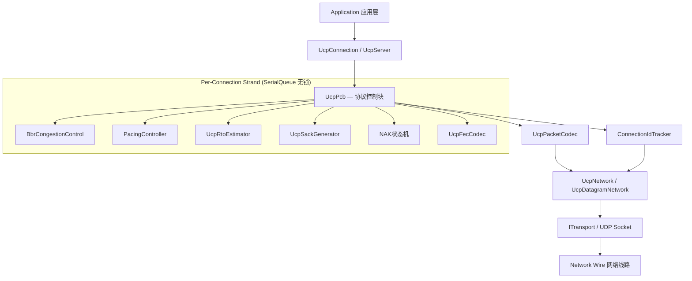

### 各层职责详解

| 层级 | 核心组件 | 职责范围 |
|---|---|---|
| **应用层** | `UcpServer`, `UcpConnection` | 面向应用的公开 API。`UcpServer` 管理被动连接接受、公平队列调度和接受队列。`UcpConnection` 提供带背压的异步发送/接收、基于事件的数据通知和传输诊断报告。 |
| **协议控制** | `UcpPcb` (Protocol Control Block) | 完整每连接状态机：发送缓冲（带重传追踪）、接收乱序缓冲（O(log n)插入）、ACK/SACK/NAK 处理流水线、重传定时器管理、BBR 拥塞控制、Pacing 控制器、公平队列 credit 记账和可选 FEC 编解码。所有状态转换通过 SerialQueue 串行化。 |
| **拥塞与Pacing** | `BbrCongestionControl`, `PacingController`, `UcpRtoEstimator` | BBRv2 从投递率样本（经循环缓冲 EWMA 滤波）计算 pacing 速率和 CWND。`PacingController` 是字节级 Token Bucket，支持有界负余额紧急恢复突发。`UcpRtoEstimator` 提供平滑 RTT 配合 95/99 百分位追踪。 |
| **可靠性引擎** | `UcpSackGenerator`, NAK状态机, `UcpFecCodec` | SACK 块生成（每范围最多2次发送）。NAK 状态机追踪每序号缺口观测计数并配合三级置信度守卫发出保守 NAK。`UcpFecCodec` 使用预计算 GF(256) 对数/反对数表实现 O(1) 乘除法的 RS 编解码。 |
| **序列化** | `UcpPacketCodec` | 处理所有8种包类型（含从 DATA/NAK/控制包中提取捎带 ACK 字段）的大端序线格式编解码。在交付协议层前验证包完整性。 |
| **网络驱动** | `UcpNetwork`, `UcpDatagramNetwork` | 将协议引擎与 Socket I/O 解耦。管理 Connection-ID 数据报多路分解、驱动 `DoEvents()` 定时器分发/公平队列轮次、协调 SerialQueue 串行分发。 |
| **传输层** | `UdpSocketTransport` (实现 `IBindableTransport`) | 提供带动态端口绑定（port=0 由 OS 分配临时端口）的 UDP 发送/接收。进程内 `NetworkSimulator` 实现同一接口配虚拟逻辑时钟用于确定性测试。 |

### 分层数据流

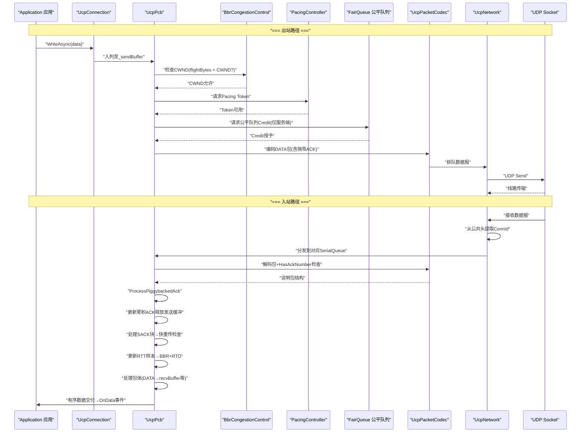

---

## UcpPcb — 协议控制块

`UcpPcb` 是 UCP 架构的中枢。每个活跃连接拥有一个独立的 PCB 实例，管理协议状态机的所有维度。与传统 Socket 基于 IP:port 元组绑定的内核控制块不同，UCP 的 PCB 以随机 32 位 Connection ID 为键，在会话期间完全不受 IP 地址变更的影响。

### PCB 组件关系全景图

```mermaid
flowchart TD
    PCB["UcpPcb 协议控制块"] --> Sender["Sender State 发送端"]
    PCB --> Receiver["Receiver State 接收端"]
    PCB --> Timers["Timer Management 定时器"]
    PCB --> Recovery["Recovery System 恢复系统"]
    PCB --> Config["Configuration 配置引用"]
    
    Sender --> SendBuf["_sendBuffer<br/>SortedDictionary"]
    Sender --> Flight["_flightBytes<br/>在途字节计数"]
    Sender --> NextSeq["_nextSendSequence<br/>下个序号"]
    Sender --> SackDedup["_sackFastRetransmitNotified<br/>SACK去重"]
    Sender --> SackCount["_sackSendCount<br/>每范围发送计数"]
    Sender --> UrgentBudget["_urgentRecoveryPacketsInWindow<br/>紧急预算"]
    Sender --> AckPiggy["_ackPiggybackQueue<br/>待捎带ACK"]
    
    Receiver --> RecvBuf["_recvBuffer<br/>乱序接收缓冲"]
    Receiver --> NextExp["_nextExpectedSequence<br/>期望下个序号"]
    Receiver --> RecvQueue["_receiveQueue<br/>有序交付队列"]
    Receiver --> MissCounts["_missingSequenceCounts<br/>缺口观测计数"]
    Receiver --> NakTier["_nakConfidenceTier<br/>NAK置信层级"]
    Receiver --> LastNak["_lastNakIssuedMicros<br/>NAK抑制时间戳"]
    Receiver --> FecMeta["_fecFragmentMetadata<br/>FEC元数据"]
    
    Timers --> RtoTimer["RTO Timer<br/>重传超时"]
    Timers --> KeepAlive["KeepAlive Timer<br/>保活定时器"]
    Timers --> Disconnect["Disconnect Timer<br/>断连定时器"]
    Timers --> DelayedAck["DelayedACK Timer<br/>延迟确认定时器"]
    Timers --> ProbeRTT["ProbeRTT Timer<br/>MinRTT探测定时器"]
    
    Recovery --> BBR["BbrCongestionControl<br/>BBRv2拥塞控制"]
    Recovery --> SACK["UcpSackGenerator<br/>SACK生成器"]
    Recovery --> NAK["NAK StateMachine<br/>NAK状态机"]
    Recovery --> FEC["UcpFecCodec<br/>FEC编解码"]
    Recovery --> RTO["UcpRtoEstimator<br/>RTO估计器"]
```

### 发送端状态详解

| 数据结构 | 类型 | 作用 |
|---|---|---|
| `_sendBuffer` | `SortedDictionary<uint, OutboundSegment>` | 按序号排序的待确认发送分段。每分段跟踪原始发送时间戳、重传次数、紧急恢复标志和 FEC 组归属。累积 ACK 到达时移除已确认分段释放缓冲。 |
| `_flightBytes` | `long` | 当前在途的 payload 总字节数。BBRv2 用于计算投递率（`delivered_bytes / elapsed_time`）并强制执行 CWND 在途上限（`flightBytes + nextSendSize < CWND`）。 |
| `_nextSendSequence` | `uint` | 下一待发送的 32 位序号，按 2^32 取模单调递增。使用无符号比较配 2^31 比较窗口实现正确环绕。 |
| `_sackFastRetransmitNotified` | `HashSet<uint>` | 去重 SACK 触发的快速重传决策。一旦某序号经 SACK 路径标记重传，在累积 ACK 确认或被新一轮 SACK 证据覆盖前不会再次标记。 |
| `_sackSendCount` | `Dictionary<(uint,uint), int>` | 每 SACK 块范围（StartSequence, EndSequence）的发送次数字典。达到 `SACK_BLOCK_MAX_SENDS`(2) 后该块被抑制，缺口转交 NAK 状态机处理。 |
| `_urgentRecoveryPacketsInWindow` | `int` | 当前 RTT 窗口内已使用的紧急重传包数（上限 `URGENT_RETRANSMIT_BUDGET_PER_RTT`=16）。每个新 RTT 估计时重置清零。 |
| `_ackPiggybackQueue` | `uint?` | 待捎带的累积 ACK 号。任何类型的下一次出站包（DATA/NAK/SYNACK/FIN）将携带此 ACK 号（设置 `HasAckNumber` 标志），无需发送纯 ACK 包。 |

### 接收端状态详解

| 数据结构 | 类型 | 作用 |
|---|---|---|
| `_recvBuffer` | `SortedDictionary<uint, InboundSegment>` | 按序号排序的乱序入站分段缓冲。使用红黑树实现 O(log n) 插入。累积 ACK 号左侧的连续分段被取出移入 `_receiveQueue`。 |
| `_nextExpectedSequence` | `uint` | 下一个有序交付所需的序号。每当 `_recvBuffer` 中存在从 `_nextExpectedSequence` 开始的连续分段时，取出并前移该指针，通知等待的读取者。 |
| `_receiveQueue` | `Queue<byte[]>` | 已有序的就绪 payload chunk 队列，供应用层通过 `ReadAsync`/`ReceiveAsync` 消费。 |
| `_missingSequenceCounts` | `Dictionary<uint, int>` | 每序号缺口的观测次数字典。每次有包在某一缺口之上（不含缺口序号）到达时该计数器递增。用于 NAK 置信层级判定。 |
| `_nakConfidenceTier` | `enum {Low, Medium, High}` | 当前 NAK 置信层级：低（1-2次观测，RTT×2 守卫）、中（3-4次观测，RTT 守卫）、高（5+次观测，5ms 守卫）。更高置信缩短乱序守卫以更快发出 NAK。 |
| `_lastNakIssuedMicros` | `Dictionary<uint, long>` | 每序号最后一次 NAK 发出的时间戳。配合 `NAK_REPEAT_INTERVAL_MICROS`(250ms) 实现重复 NAK 抑制，防止同一缺口的 NAK 风暴。 |
| `_fecFragmentMetadata` | `Dictionary<uint, FragmentMeta>` | FEC 恢复 DATA 包的原始分片元数据字典。恢复的 DATA 包保留原始序号和分片信息（FragTotal, FragIndex），确保后续累积 ACK 处理和有序交付的正确性。 |

---

## SerialQueue 每连接串行执行模型

UCP 的核心并发模型是 **Strand（串行执行环境）**。每个 `UcpConnection` 通过其专用的 `SerialQueue`（单线程执行上下文）处理所有协议事件。此设计从根本上消除了锁竞争：

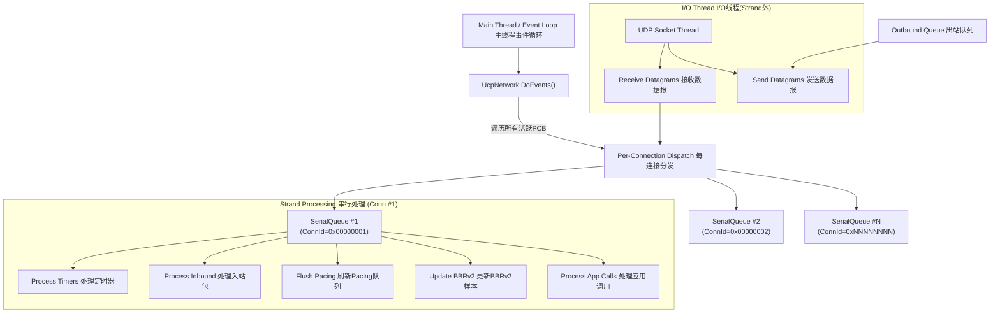

### 串行模型关键属性

| 属性 | 说明 |
|---|---|
| **无锁设计** | PCB 状态不会被多线程并发访问。所有变更在同一串行执行环境上顺序发生。 |
| **可预测顺序** | 包按接收顺序处理；应用级调用（Send/Receive/Close）按入列顺序排队执行。 |
| **零死锁风险** | 串行模型消除了多锁设计中固有的锁顺序问题和 ABBA 死锁。 |
| **I/O 卸载** | 仅实际 UDP Socket 的 `Send()` 和 `Receive()` 在串行执行环境外执行。FEC 解码等计算密集型操作在串行执行环境内执行，因为 GF(256) 运算是计算轻量级的。 |
| **确定性测试支持** | `NetworkSimulator` 使用相同串行模型配虚拟逻辑时钟，产生跨不同 CPU、不同操作系统可完全复现的测试结果。 |

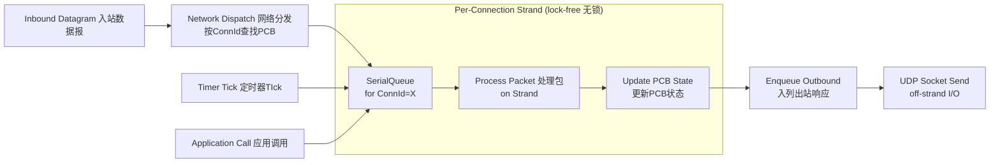

---

## 公平队列服务端调度

服务端 `UcpServer` 采用信用制轮转公平队列调度器，确保各连接公平共享出口带宽：

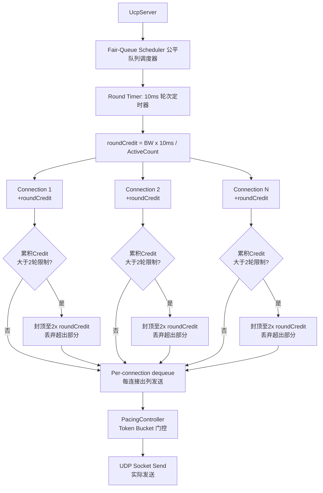

### 公平队列设计参数

| 参数 | 值 | 含义 |
|---|---|---|
| `FAIR_QUEUE_ROUND_MILLISECONDS` | 10ms | 每轮公平队列调度间隔。轮次既可由独立 Timer 驱动（独立服务端模式），也可由 `UcpNetwork.DoEvents()` 驱动（多路复用部署）。 |
| `MAX_BUFFERED_FAIR_QUEUE_ROUNDS` | 2 轮 | 最大 credit 累积轮数。长期空闲连接最多积累 2 轮 credit，超出部分丢弃以防止恢复时巨大突发。 |

普通数据发送需同时获取公平队列 credit 和 Pacing Token。紧急重传（由 SACK/NAK/RTO 标记）绕过公平队列门控，但仍受每 RTT 紧急预算上限（16 包）约束。

---

## PacingController Token Bucket 设计

`PacingController` 实现字节级 Token Bucket，语义如下：

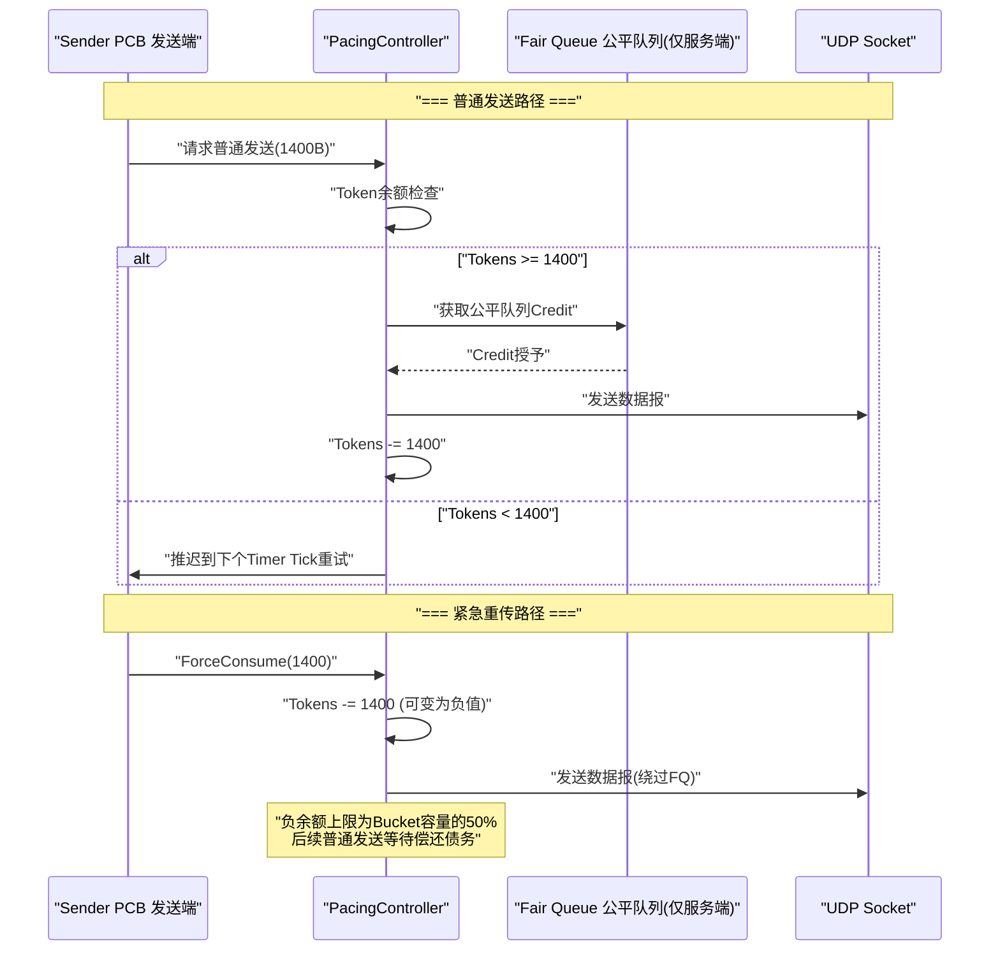

| 参数 | 默认值 | 含义 |
|---|---|---|
| Token 填充速率 | `BBRv2.PacingRate` (字节/秒) | BBRv2 实时计算的瓶颈带宽估计 × 当前增益系数 |
| Bucket 容量 | `PacingRate × PacingBucketDurationMicros` | 通常承载 10ms 的字节量，允许有限突发 |
| 普通发送消耗 | `SendQuantumBytes` (默认 = MSS) | 每次发送尝试消耗的 Token 量 |
| 紧急发送 (`ForceConsume`) | 立即消费 → bucket 可变为负值 | 负余额上限为 `MAX_NEGATIVE_TOKEN_BALANCE_MULTIPLIER(0.5) × Bucket容量` |
| 债务偿还 | 后续普通发送前等待 Token 恢复 | 负余额归零前普通发送被推迟 |

---

## BBRv2 拥塞控制内核

### 核心估计量流水线

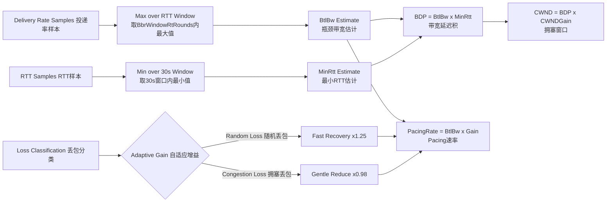

### BBRv2 模式行为表

| 模式 | Pacing 增益 | CWND 增益 | 持续时间 | 目的 |
|---|---|---|---|---|
| **Startup** | 2.5 | 2.0 | 至带宽平台出现（3 RTT 窗口吞吐不增长） | 指数探测瓶颈带宽。快速将 pacing 速率推至接近瓶颈容量。 |
| **Drain** | 0.75 | — | 约 1 BBR 周期（~1 RTT） | 排空 Startup 期间累积在瓶颈处的队列。将在途降至 BDP 以下。 |
| **ProbeBW** | 循环 [1.25, 0.85, 1.0×6] | 2.0 | 稳态运行 | 围绕 BtlBw 进行 8 阶段增益循环：1 阶段上探更多带宽，1 阶段排空队列，6 阶段巡航。 |
| **ProbeRTT** | 1.0 | 4 包 | 100ms（每 30s） | 刷新 MinRTT 估计。丢包长肥管路径自动跳过以避免不必要的吞吐坍缩。 |

### 网络路径分类器

BBRv2 使用 200ms 滑动窗口评估 RTT、抖动、丢包率、吞吐比率等特征，将路径分类为五种类型以调整 BBR 行为：

| 网络类型 | 特征 | BBR 自适应行为 |
|---|---|---|
| `LowLatencyLAN` | RTT < 1ms, 零丢包 | 激进初始探测、高 Startup 增益。适合数据中心内部链路。 |
| `MobileUnstable` | 高抖动、RTT 变化大 | 放宽乱序保护窗口、跳过 ProbeRTT 避免不必要吞吐骤降。 |
| `LossyLongFat` | 高 BDP、持续随机丢包 | 保持 CWND 不因丢包缩减、跳过 ProbeRTT、加重 FEC 依赖。 |
| `CongestedBottleneck` | RTT 升高 + 投递率下降 | 启用丢包感知 pacing 削减、增加 0.98× 乘数响应灵敏度。 |
| `SymmetricVPN` | 稳定 RTT、对称带宽 | 标准 BBR 探测循环。接近理想网络但需考虑隧道开销。 |

---

## Connection-ID 驱动的会话追踪

UCP 的核心创新之一是默认基于 Connection ID（而非 IP:port 元组）的会话模型：

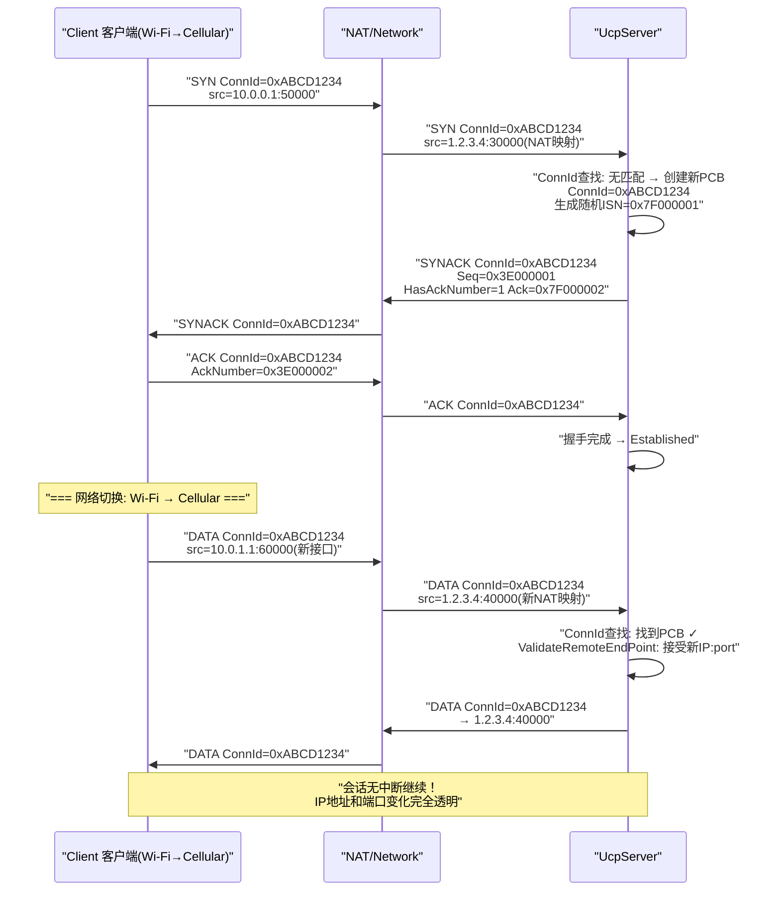

此设计支持：
- **NAT 重绑定韧性**：NAT 网关在会话中途更改外部端口时，服务端继续将包路由到正确 PCB
- **IP 移动性**：客户端在 Wi-Fi 和蜂窝间迁移时保持相同 Connection ID 和会话状态
- **多路径就绪**：同一 Connection ID 可将来自多个网络接口的包路由到同一 PCB（未来扩展功能）

### 随机 ISN

每个连接在 SYN 时刻使用加密级随机源（`UcpSecureRng`）生成 32 位初始序号（ISN）。这遵循与 TCP ISN 选择相同的安全原则：离线攻击者无法在不观测流量的情况下猜测合法序号空间，提供等同于 TCP ISN 的安全性而不需要每包认证开销。32 位序号空间使用标准无符号比较配 2^31 比较窗口实现环绕无歧义排序。

---

## FEC — Reed-Solomon GF(256) 编解码器

### 数学基础

UCP 的 FEC 使用 GF(256) 有限域上的系统 Reed-Solomon 编码。系统码意味着原始 DATA 包原样发送，修复包作为独立的 `FecRepair`（类型 0x08）包发送。

**域参数：**
- 不可约多项式：`x^8 + x^4 + x^3 + x + 1` = `0x11B`
- 本原元 α = 0x02（多项式 x）
- 加法：按位 XOR（字节级）
- 乘法：`a × b = antilog[(log[a] + log[b]) mod 255]` — O(1) 查表
- 除法：`a / b = antilog[(log[a] - log[b] + 255) mod 255]` — O(1) 查表
- 对数表：256 项，反对数表：512 项（支持模 255 加法后的溢出查询）

### 编解码流程

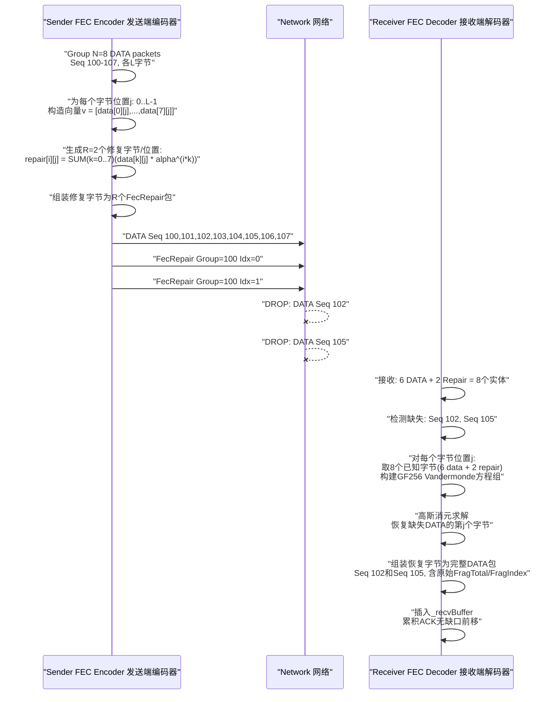

### 自适应冗余五级阈值

| 观测丢包率 | 自适应行为 | 有效冗余 |
|---|---|---|
| < 0.5% | 最小冗余（基础配置，通常 0.0-0.125） | 基础值 |
| 0.5% – 2% | 轻微增加冗余 1.25× | 基础值 × 1.25 |
| 2% – 5% | 中等增加冗余 1.5×，减小分组以提高修复密度 | 基础值 × 1.5, 最小分组 4 |
| 5% – 10% | 最大自适应冗余 2.0× | 基础值 × 2.0, 最小分组 4 |
| > 10% | FEC 单独无法提供足够保护；重传成为主要恢复手段 | FEC 退居辅助角色 |

---

## 确定性网络模拟器

`NetworkSimulator` 是实现可复现确定性测试的关键基础设施：

- **虚拟逻辑时钟**：独立于系统墙钟的虚拟时钟，按字节精确序列化瓶颈队列中的包。消除 OS 调度抖动对吞吐计算的影响。
- **独立双向延迟**：支持每方向独立配置传播延迟和抖动参数，模拟非对称路由（如卫星下行 250ms / 上行 20ms）。
- **可配损伤模型**：随机或确定性丢包率、包复制、包乱序，三者可独立控制也可组合。
- **中段断网模拟**：支持设定断网触发时间和持续时间（如 Weak4G 场景的 900ms 处触发 80ms 全断网）。
- **包完整性追踪**：记录每个包的去程和回程时间戳，用于精确的单向延迟和收敛时间测量。

---

## 测试架构

| 测试领域 | 示例测试 | 验证目标 |
|---|---|---|
| **核心协议** | SequenceWrapAround, CodecRoundTrip, RtoConvergence, PacingTokenArithmetic | 线格式正确性、序号环绕算术、RTO估计器统计收敛、Token Bucket 算术正确 |
| **连接管理** | ConnIdDemux, RandomISNUniqueness, DynamicIPRebind, SerialQueueOrdering | Connection-ID 多路分解正确性、ISN 不碰撞、服务端 IP 重绑定、串行队列顺序保证 |
| **可靠性** | LossyTransfer, BurstLoss, Sack2SendLimit, NakTieredConfidence, FecSingleLoss, FecMultiLoss | 所有丢包模式下恢复正确性。SACK 块最多2次发送、NAK 三级置信度按预期激活、FEC 单丢包和双丢包均正确修复 |
| **流完整性** | Reordering, Duplication, PartialRead, FullDuplex, PiggybackedAckAllTypes, ExactByteRead | 乱序包正确重排、重复包去重、部分读取语义、全双工不交错、捎带 ACK 在所有8种包类型上正确提取、定长精读 ReadAsync |
| **性能** | NoLoss, GigabitIdeal, Lossy1Percent, Lossy5Percent, Satellite, Mobile3G, Mobile4G, Weak4G, BurstLoss, HighJitter, VpnTunnel, Benchmark10G, LongFatPipe, AsymRoute | 全场景吞吐、收敛时间、Retrans% vs Loss%独立性、方向延迟测量、Pacing 收敛比率 |
| **报告验证** | ReportPrinter.ValidateReportFile | 吞吐封顶（≤Target×1.01）、重传合法范围（0-100%）、方向延迟差（3-15ms）、Loss%独立于Retrans%、收敛非零、CWND非零 |

---

## 验证流程

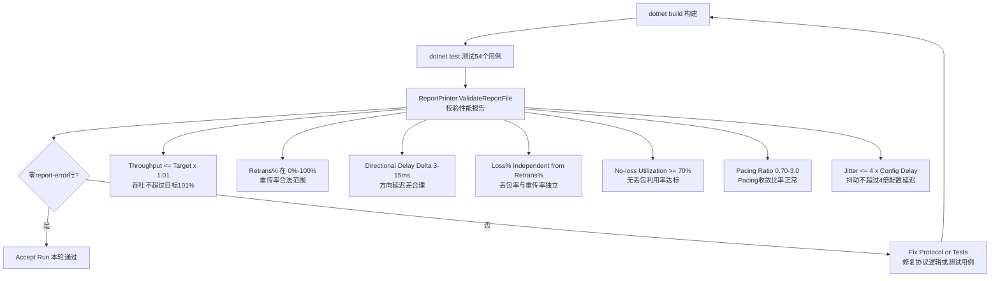
