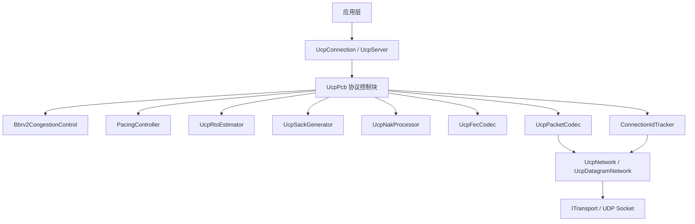
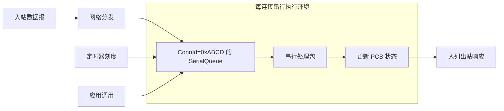
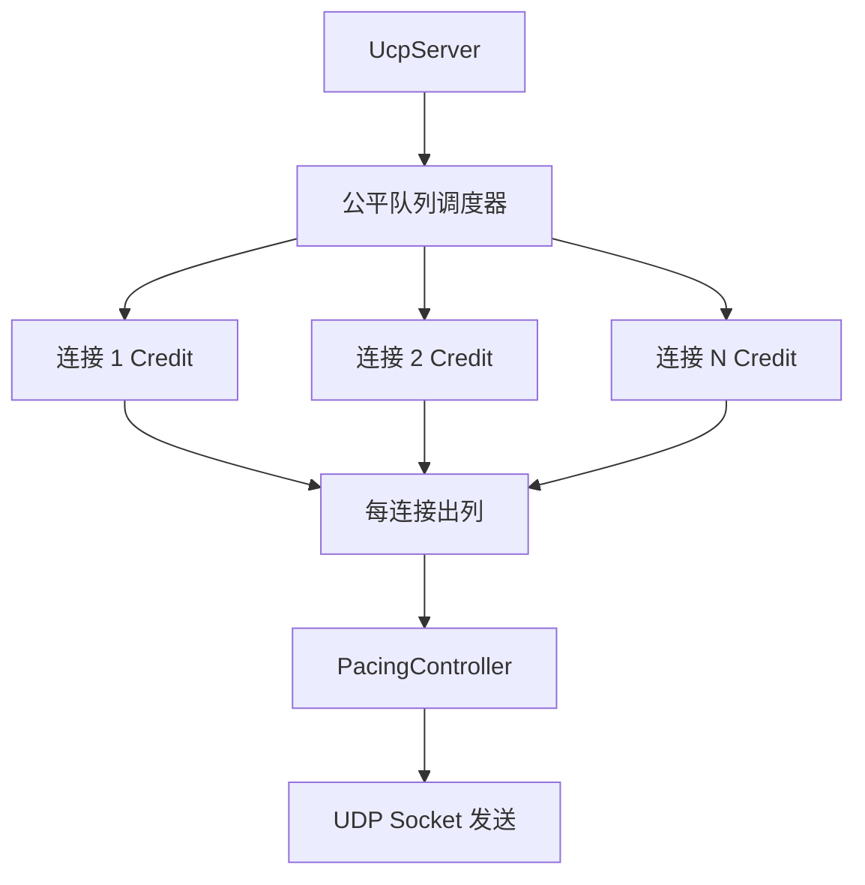
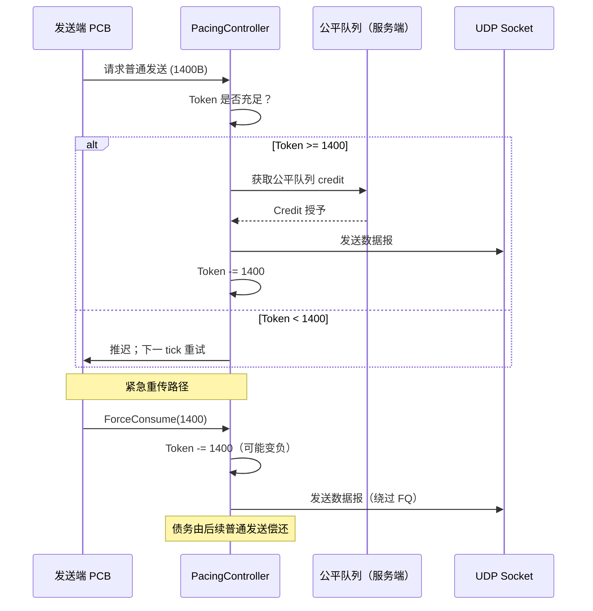
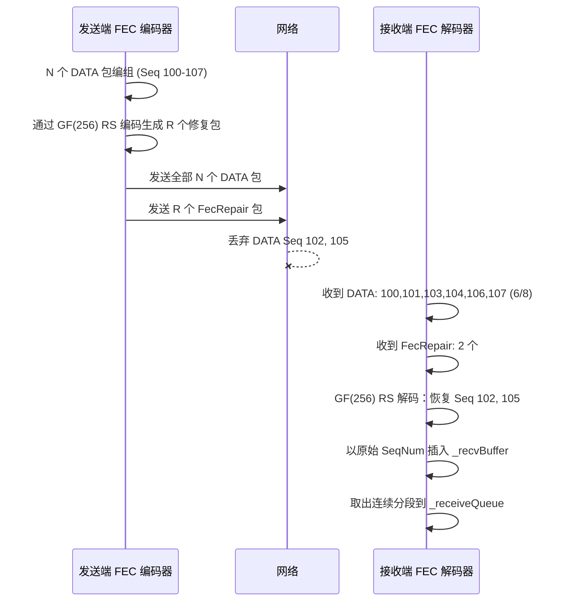
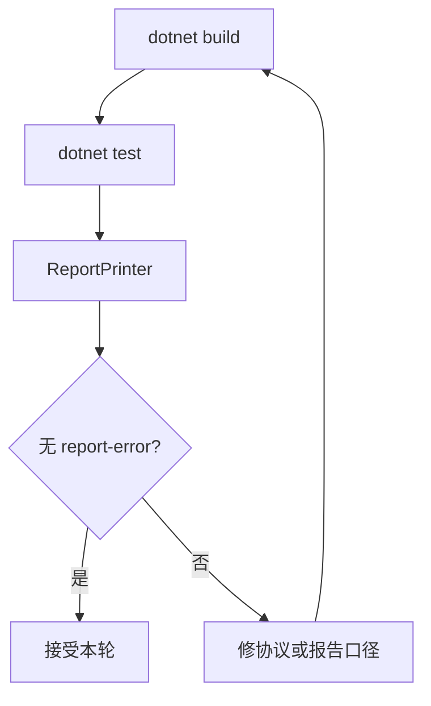

# PPP PRIVATE NETWORK™ X - 通用通信协议 (UCP) — 架构

[English](architecture.md) | [文档索引](index_CN.md)

**协议标识: `ppp+ucp`** — 本文档描述 UCP 协议引擎的内部运行时架构，涵盖分层设计、每连接状态管理、会话追踪、串行执行、公平队列调度、拥塞控制内核、FEC 编解码器设计以及确定性网络模拟器。

## 运行时分层

UCP 按分层架构组织，从面向应用的 API 一直下沉到传输层 socket。每层封装一个明确定义的职责：



### 各层职责

| 层级 | 组件 | 作用 |
|---|---|---|
| **公共 API** | `UcpServer`, `UcpConnection` | 面向应用的连接生命周期、发送/接收、事件模型。 |
| **协议控制** | `UcpPcb` | 每连接状态机、定时器管理、发送/接收缓冲协调。 |
| **拥塞控制** | `Bbrv2CongestionControl` | BBRv2 状态机配自适应 pacing 增益、投递率估计、丢包分类。 |
| **Pacing** | `PacingController` | 字节级 token bucket，支持有界负余额紧急恢复突发。 |
| **定时器** | `UcpRtoEstimator` | RTT 采样、RTO 退避计算、PTO 守卫逻辑。 |
| **恢复** | `UcpSackGenerator`, `UcpNakProcessor` | SACK 块生成（每块范围最多 2 次发送）；分级置信度 NAK 发送与处理。 |
| **FEC** | `UcpFecCodec` | Reed-Solomon GF(256) 编解码，基于观测丢包率自适应冗余。 |
| **编解码** | `UcpPacketCodec` | 序列化/反序列化含捎带 ACK 字段提取（所有包类型）。 |
| **会话** | `ConnectionIdTracker` | 基于连接 ID 的多路分解、随机 ISN 分配、IP 无关绑定。 |
| **网络** | `UcpNetwork` | 数据报分发、`DoEvents()` 驱动循环、公平队列轮次协调。 |

## UcpPcb — 协议控制块

`UcpPcb` 是每连接的核心状态容器。每个活跃连接拥有一个 PCB 实例，管理协议状态机的所有方面。与传统基于 IP:port 元组绑定的 socket 控制不同，PCB 以随机 32 位连接 ID 为键，在会话期间不受 IP 地址变更的影响。

### 基于连接 ID 的会话追踪（IP 无关）

每个 UCP 连接通过 SYN 时生成的加密级随机 32 位连接 ID 进行标识。`UcpNetwork` 中的 `ConnectionIdTracker` 维护从连接 ID 到 PCB 实例的字典映射。当入站数据报到达时，网络层从公共头提取连接 ID 并直接分发到所属 PCB —— 不受源 IP/端口影响。此设计支持：

- **NAT 重绑定韧性**：客户端 NAT 映射在会话中途变化时，服务端仍能将包路由到正确的 PCB。
- **IP 移动性**：客户端从 Wi-Fi 切换到蜂窝时，保持相同的连接 ID 和会话状态。
- **多路径就绪**：同一连接 ID 可将来自多个接口的包路由到同一 PCB。

### 随机初始序列号（ISN）

每个连接的初始序列号在 SYN 时使用加密随机源生成，遵循与 TCP ISN 选择相同的安全原则。这防止了盲数据注入攻击：离线攻击者无法在未观测流量的情况下猜测序列空间。32 位序列空间使用标准无符号比较配合 2^31 窗口进行循环，确保顺序无歧义。

### 服务端动态 IP 绑定

`UcpServer` 默认绑定到 `IPAddress.Any`（0.0.0.0），也可绑定到特定动态获取的地址。服务端不需要静态 IP 配置。当服务端机器 IP 变化时（如 DHCP 租约续约），新入站连接无需重配置即可继续。连接多路分解使用连接 ID 而非目标地址，因此 IP 变化对已建立会话透明。

### 发送端状态

| 结构 | 作用 |
|---|---|
| `_sendBuffer` | 按序号排序、等待 ACK 的发送分段。每分段记录原始发送时间戳、重传次数和是否经紧急恢复。 |
| `_flightBytes` | 当前认为在途的 payload 字节数。BBRv2 用于计算投递率并执行 CWND 在途上限。 |
| `_nextSendSequence` | 支持 32 位环绕比较的下一个序号，按 2^32 取模单调递增。 |
| `_sackFastRetransmitNotified` | 去重 SACK 触发快重传决策。一旦某个缺口经 SACK 修复，不会再次重传直到新 SACK 证据确认新一轮丢包。 |
| `_sackSendCount` | 每个块范围的计数，将 SACK 通告限制在每范围 2 次发送，防止持续乱序下 SACK 放大。 |
| `_urgentRecoveryPacketsInWindow` | 每 RTT 限流器，控制 pacing/FQ 绕过的恢复包数，防止单个连接在恢复突发时饿死其他连接。 |
| `_ackPiggybackQueue` | 待捎带的累积 ACK 号，挂载到下一个任意类型的出站包上，减少纯 ACK 开销。 |

### 接收端状态

| 结构 | 作用 |
|---|---|
| `_recvBuffer` | 按序号排序的乱序入站分段。使用类红黑树插入实现 O(log n) 有序访问。 |
| `_nextExpectedSequence` | 下一个可有序交付的序号。连续分段被取出时前移。 |
| `_receiveQueue` | 已有序、可供应用通过 `Receive()` / `ReceiveAsync()` 读取的 payload chunk。 |
| `_missingSequenceCounts` | 每序号缺口观测计数，用于分级置信度 NAK 生成。每次缺口上方（但不含）到达即递增。 |
| `_nakConfidenceTier` | 当前 NAK 置信层级：`低`（1-2 次观测，RTT×2 守卫）、`中`（3-4 次观测，RTT 守卫）、`高`（5+ 次观测，5ms 守卫）。更高置信度缩短乱序守卫，更快发出 NAK。 |
| `_lastNakIssuedMicros` | 每序号 NAK 重复抑制时间戳。 |
| `_fecFragmentMetadata` | FEC 恢复 DATA 包的原始分片元数据，保留原始序号和分片边界。 |

## SerialQueue 每连接串行执行

每个 `UcpConnection` 通过专用的 `SerialQueue` 处理所有协议事件 —— 单线程执行上下文（strand）。此设计完全消除锁竞争：



所有对 PCB 的变更操作 —— 包处理、定时器回调、应用发送/接收、BBRv2 状态更新 —— 在同一串行环境中顺序执行。这意味着：

- **无锁**：PCB 状态永远不会被多线程并发访问。
- **可预测的顺序**：包按接收顺序处理；应用调用按序排队执行。
- **无死锁**：串行模型消除了多锁设计中固有的锁顺序问题。
- **I/O 卸载**：仅实际 UDP socket 发送/接收在串行环境外执行；繁重的 FEC Reed-Solomon 解码在串行环境内运行，因为 GF(256) 操作计算量较轻。

`UcpNetwork.DoEvents()` 方法编排串行分发，遍历所有活跃 PCB 并将待处理定时器事件、出站刷新请求和入站数据报顺序投递到每个串行执行环境。

## 服务端公平队列调度

在服务端，`UcpServer` 使用公平队列调度器确保没有任何连接独占可用出口带宽。调度器在 `UcpNetwork` 层操作：



### 公平队列设计

| 参数 | 值 | 含义 |
|---|---|---|
| `FAIR_QUEUE_ROUND_MILLISECONDS` | 10 ms | 每轮公平队列时长。 |
| `MAX_BUFFERED_FAIR_QUEUE_ROUNDS` | 2 | 最大 credit 累积量；防止饥饿连接一次性突发。 |

每轮公平队列中，每个活跃服务端连接获得与 `ServerBandwidthBytesPerSecond / 活跃连接数 / 每秒轮次` 成正比的 credit 配额。连接可按累积 credit 发送，未用 credit 最多累积 `MAX_BUFFERED_FAIR_QUEUE_ROUNDS` 轮，超出则丢弃 —— 防止长空闲连接突然抢占过多带宽。

普通 DATA 发送需同时获取公平队列 credit 和 pacing token。紧急重传（由 SACK、NAK 或 RTO 恢复标记）绕过公平队列门控，但仍受每 RTT 紧急预算上限约束。

## Pacing 与 Token Bucket

`PacingController` 实现字节级 token bucket，语义如下：

- **Token 填充速率**：`BBRv2.PacingRate` 字节/秒。
- **Bucket 容量**：`PacingRate * PacingBucketDurationMicros` —— 通常为 10ms 字节量。
- **普通发送**：消耗 `SendQuantumBytes`（默认 = MSS）个 token。若不足则推迟到下一 tick。
- **紧急发送（`ForceConsume()`）**：即使 token 不足也立即记账字节开销，bucket 可变为负值，后续普通发送需等待偿还债务。负余额上限为 `-MaxPacingRateBytes * PacingBucketDurationMicros / 2`，防止无限债务积累。



## BBRv2 拥塞控制与自适应 Pacing 增益

UCP 实现 BBRv2，在 BBRv1 基础上扩展了丢包感知适应和自适应 pacing 增益。不同于将 pacing 增益作为固定周期乘数的 BBRv1，BBRv2 根据持续网络状况评估调整 pacing 增益。

### BBRv2 状态机

```mermaid
stateDiagram-v2
    [*] --> Startup
    Startup --> Drain: Startup 退出条件满足
    Drain --> ProbeBW: Drain 完成
    ProbeBW --> ProbeRTT: 需要刷新 MinRTT
    ProbeRTT --> ProbeBW: MinRTT 已刷新
    ProbeBW --> ProbeBW: 循环增益

    note right of Startup: 自适应 pacing_gain: 初始 2.5<br/>检测到丢包时降低
    note right of ProbeBW: 动态增益循环<br/>高: 1.25, 低: 0.85<br/>拥塞证据成立后降低
```

### BBRv2 核心估计量

| 估计量 | 计算 | 作用 |
|---|---|---|
| `BtlBw` | 最近 `BbrWindowRtRounds` 个 RTT 窗口内最大投递率 | pacing rate 基准。BBRv2 增加了短周期 EWMA 滤波以平滑快速带宽变化。 |
| `MinRtt` | ProbeRTT 区间内（默认 30s）最小 RTT | BDP 分母。BBRv2 在丢包路径上若投递率仍高则跳过 ProbeRTT。 |
| `BDP` | `BtlBw * MinRtt` | 目标在途字节数。 |
| `AdaptivePacingGain` | 基础增益 × 拥塞响应因子 | 动态增益：Startup 从 2.5 起步，经 Drain 下降，ProbeBW 围绕 1.0 循环。拥塞证据施加 0.98x 乘数。 |
| `PacingRate` | `BtlBw * AdaptivePacingGain` | token bucket 执行的实际发送速率。 |
| `CWND` | `BDP * CwndGain` 加护栏 | 在途上限。BBRv2 拥塞事件后施加 `BBR_MIN_LOSS_CWND_GAIN` 下限 (0.95)，并以每 ACK `BBR_LOSS_CWND_RECOVERY_STEP` (0.04) 逐步恢复。 |

### 丢包先分类再降速

BBRv2 在决定是否降低 pacing rate 之前先对每个丢包事件进行分类：

| 丢包类别 | 判定标准 | BBRv2 响应 | 重传行为 |
|---|---|---|---|
| **随机丢包** | 短窗口内 ≤2 次孤立丢包，无 RTT 膨胀 | 保持 pacing gain 和 CWND。 | 立即重传；不降速。 |
| **拥塞丢包** | ≥3 次丢包或 RTT 持续增长至 MinRtt 的 1.10× 以上 | `AdaptivePacingGain` 乘 0.98；施加 CWND 下限。 | 立即重传；成比例降速。 |

网络分类器使用 200ms 滑动窗口统计 RTT、抖动、丢包数和吞吐比例，区分 LAN、移动/不稳定、丢包长肥管、拥塞瓶颈和 VPN 类路径。此分类馈入 BBRv2 的自适应增益选择。

## FEC — Reed-Solomon GF(256) 自适应传输

UCP 的前向纠错使用 GF(256) 上的 Reed-Solomon 编码，可利用可配数量的修复包从一组内的多个丢包中恢复。

### RS GF(256) 在 UCP 中的工作原理



### 自适应传输

`FecRedundancy` 参数（如 0.125 = 每 8 个数据包 1 个修复包）作为基础配置。在自适应模式下，UCP 根据观测丢包率调整有效冗余：

| 观测丢包率 | 自适应行为 |
|---|---|
| < 0.5% | 最小冗余（基础配置）。 |
| 0.5% - 2% | 冗余提高 1.25×。 |
| 2% - 5% | 冗余提高 1.5×，减小分组以提高修复密度。 |
| 5% - 10% | 最大自适应冗余 2.0×；最小组大小 4。 |
| > 10% | FEC 单独不够；主要依赖重传恢复。 |

GF(256) 运算使用预计算对数/反对数表，乘法和除法为 O(1)，即使大组也不影响编码解码性能。

## 网络模拟器

`NetworkSimulator` 是确定性进程内网络仿真器，支持：
- 独立去程/回程传播延迟及每方向抖动。
- 通过虚拟逻辑时钟进行带宽序列化，避免 OS 调度在吞吐计算中引入抖动。
- 可配的随机或确定性丢包、重复和乱序。
- 中途 outage 模拟（如 Weak4G 80ms 断网）。
- 显式去程/回程延迟对的非对称路由模型。

逻辑时钟以字节精度将包通过瓶颈队列序列化，确保吞吐测量反映协议行为而非主机调度噪声。

## 测试架构

| 测试领域 | 示例 |
|---|---|
| **核心协议** | 序号环绕、包编解码往返、RTO 估计器收敛、pacing controller token 记账。 |
| **连接管理** | 连接 ID 多路分解、随机 ISN 唯一性、服务端动态 IP 重绑定、串行队列顺序性。 |
| **可靠性** | 丢包传输、突发丢包、SACK 每范围 2 次发送限制、NAK 分级置信度、FEC 多丢包修复。 |
| **流完整性** | 乱序/重复、部分读取、全双工不交错、捎带 ACK 正确性。 |
| **性能** | 4 Mbps 到 10 Gbps、0-10% 丢包、移动、卫星、VPN、长肥管 BBRv2 收敛验证。 |
| **报告** | 吞吐封顶强制、丢包/重传独立性、方向不对称校验。 |

## 验证流程


