# PPP PRIVATE NETWORK™ X — 通用通信协议 (UCP) — 架构

[English](architecture.md) | [文档索引](index_CN.md)

**协议标识: `ppp+ucp`** — 本文档描述 UCP 协议引擎的内部运行时架构，涵盖分层设计、每连接状态管理、会话追踪、串行执行、公平队列调度、拥塞控制内核、FEC 编解码器设计以及确定性网络模拟器。

---

## 运行时分层

UCP 按分层架构组织，从面向应用的 API 一直下沉到传输层 socket。每层封装一个明确定义的职责：

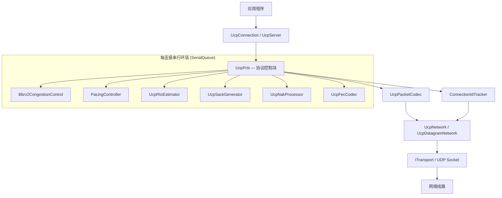

### 各层职责

| 层级 | 组件 | 作用 |
|---|---|---|
| **公共 API** | `UcpServer`, `UcpConnection` | 面向应用的连接生命周期、发送/接收、事件模型。 |
| **协议控制** | `UcpPcb` | 每连接状态机、定时器管理、发送/接收缓冲协调。 |
| **拥塞控制** | `Bbrv2CongestionControl` | BBRv2 状态机配自适应 pacing 增益、投递率估计、丢包分类。 |
| **Pacing** | `PacingController` | 字节级 token bucket，支持有界负余额紧急恢复突发。 |
| **定时器** | `UcpRtoEstimator` | RTT 采样、RTO 退避计算、PTO 守卫逻辑。 |
| **恢复** | `UcpSackGenerator`, `UcpNakProcessor` | SACK 块生成（每块范围最多 2 次发送）；分级置信度 NAK 发送与处理。 |
| **FEC** | `UcpFecCodec` | Reed-Solomon GF(256) 编解码，基于观测丢包率自适应冗余。 |
| **编解码** | `UcpPacketCodec` | 序列化/反序列化含捎带 ACK 字段提取（所有包类型）。 |
| **会话** | `ConnectionIdTracker` | 基于连接 ID 的多路分解、随机 ISN 分配、IP 无关绑定。 |
| **网络** | `UcpNetwork` | 数据报分发、`DoEvents()` 驱动循环、公平队列轮次协调。 |

---

## UcpPcb — 协议控制块

`UcpPcb` 是每连接的核心状态容器。每个活跃连接拥有一个 PCB 实例，管理协议状态机的所有方面。与传统基于 IP:port 元组绑定的 socket 控制不同，PCB 以随机 32 位连接 ID 为键，在会话期间不受 IP 地址变更的影响。

### 连接状态机

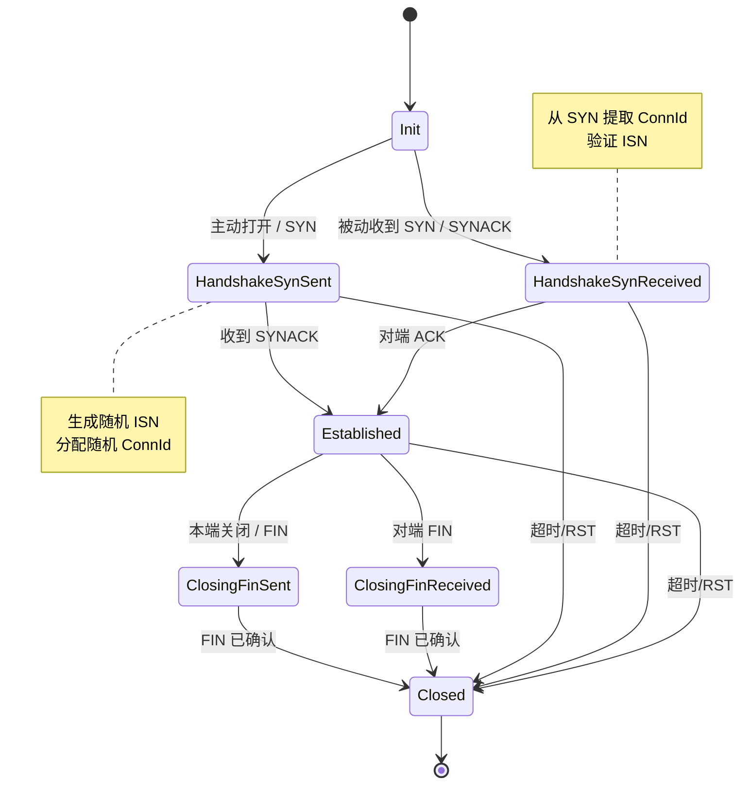

### 基于连接 ID 的会话追踪（IP 无关）

每个 UCP 连接通过 SYN 时生成的加密级随机 32 位连接 ID 进行标识。`UcpNetwork` 中的 `ConnectionIdTracker` 维护从连接 ID 到 PCB 实例的字典映射。

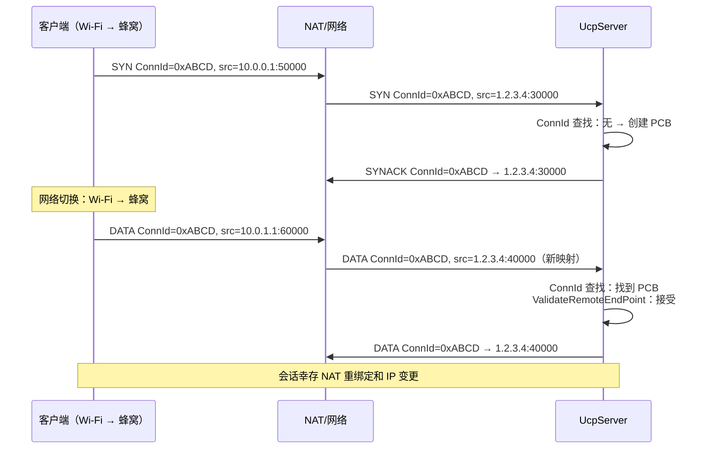

此设计支持：
- **NAT 重绑定韧性**：客户端 NAT 映射在会话中途变化时，服务端仍能将包路由到正确的 PCB。
- **IP 移动性**：客户端从 Wi-Fi 切换到蜂窝时，保持相同的连接 ID 和会话状态。
- **多路径就绪**：同一连接 ID 可将来自多个接口的包路由到同一 PCB（未来功能）。

### PCB 组件关系

```mermaid
flowchart TD
    PCB[UcpPcb] --> Sender[发送端状态]
    PCB --> Receiver[接收端状态]
    PCB --> Timers[定时器管理]
    PCB --> Recovery[恢复系统]

    Sender --> SendBuf[_sendBuffer: SortedDictionary]
    Sender --> Flight[_flightBytes 计数器]
    Sender --> NextSeq[_nextSendSequence]
    Sender --> SackDedup[_sackFastRetransmitNotified]
    Sender --> SackCount[_sackSendCount 每范围]
    Sender --> UrgentBudget[_urgentRecoveryPacketsInWindow]
    Sender --> AckPiggy[_ackPiggybackQueue]

    Receiver --> RecvBuf[_recvBuffer: SortedDictionary]
    Receiver --> NextExp[_nextExpectedSequence]
    Receiver --> RecvQueue[_receiveQueue 供应用读取]
    Receiver --> MissCounts[_missingSequenceCounts]
    Receiver --> NakTier[_nakConfidenceTier]
    Receiver --> LastNak[_lastNakIssuedMicros]
    Receiver --> FecMeta[_fecFragmentMetadata]

    Timers --> RtoTimer[RTO 定时器]
    Timers --> KeepAlive[保活定时器]
    Timers --> Disconnect[断连定时器]
    Timers --> DelayedAck[延迟 ACK 定时器]
    Timers --> ProbeRTT[ProbeRTT 定时器]

    Recovery --> BBR[Bbrv2CongestionControl]
    Recovery --> SACK[UcpSackGenerator]
    Recovery --> NAK[UcpNakProcessor]
    Recovery --> FEC[UcpFecCodec]
    Recovery --> RTO[UcpRtoEstimator]
```

### 发送端状态

| 结构 | 作用 |
|---|---|
| `_sendBuffer` | 按序号排序、等待 ACK 的发送分段。每分段记录原始发送时间戳、重传次数和紧急恢复状态。 |
| `_flightBytes` | 当前在途 payload 字节数。BBRv2 用于计算投递率并执行 CWND 在途上限。 |
| `_nextSendSequence` | 支持 32 位环绕比较的下一个序号，按 2^32 取模单调递增。 |
| `_sackFastRetransmitNotified` | 去重 SACK 触发快重传决策。一旦缺口经 SACK 修复，不会再次重传直到新 SACK 证据确认新一轮丢包。 |
| `_sackSendCount` | 每个块范围的计数，将 SACK 通告限制在每范围 2 次发送。 |
| `_urgentRecoveryPacketsInWindow` | 每 RTT 限流器，控制 pacing/FQ 绕过的恢复包数。 |
| `_ackPiggybackQueue` | 待捎带的累积 ACK 号，挂载到下一个任意类型的出站包上。 |

### 接收端状态

| 结构 | 作用 |
|---|---|
| `_recvBuffer` | 按序号排序的乱序入站分段。使用类红黑树插入实现 O(log n) 有序访问。 |
| `_nextExpectedSequence` | 下一个可有序交付的序号。连续分段被取出时前移。 |
| `_receiveQueue` | 已有序、可供应用通过 `Receive()` / `ReceiveAsync()` 读取的 payload chunk。 |
| `_missingSequenceCounts` | 每序号缺口观测计数，用于分级置信度 NAK 生成。 |
| `_nakConfidenceTier` | 当前 NAK 置信层级：`低`（1-2 次观测，RTT×2 守卫）、`中`（3-4 次观测，RTT 守卫）、`高`（5+ 次观测，5ms 守卫）。 |
| `_lastNakIssuedMicros` | 每序号 NAK 重复抑制时间戳。 |
| `_fecFragmentMetadata` | FEC 恢复 DATA 包的原始分片元数据。 |

---

## SerialQueue 每连接串行执行

每个 `UcpConnection` 通过专用的 `SerialQueue` 处理所有协议事件 —— 单线程执行上下文（strand）。此设计完全消除锁竞争：

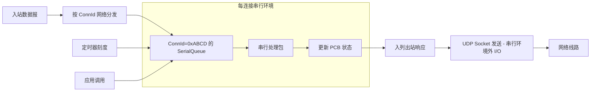

### 线程模型

```mermaid
flowchart TD
    Main[主线程 / 事件循环] --> DoEvents[UcpNetwork.DoEvents]
    DoEvents -->|遍历所有 PCB| Dispatch[每连接分发]

    Dispatch --> SQ1[SerialQueue #1 (Conn 0x0001)]
    Dispatch --> SQ2[SerialQueue #2 (Conn 0x0002)]
    Dispatch --> SQN[SerialQueue #N (Conn 0xNNNN)]

    subgraph "串行处理（每连接）"
        SQ1 --> T1A[处理定时器]
        SQ1 --> T1B[处理入站包]
        SQ1 --> T1C[刷新 Pacing 队列]
        SQ1 --> T1D[更新 BBRv2 样本]
        SQ1 --> T1E[处理应用调用]
    end

    subgraph "I/O 线程（串行环境外）"
        IO[UDP Socket 线程] --> Recv[接收数据报]
        IO --> Send[发送数据报]
    end

    Recv --> Dispatch
    Outbound[出站队列] --> Send
```

关键属性：
- **无锁**：PCB 状态永远不会被多线程并发访问。
- **可预测的顺序**：包按接收顺序处理；应用调用按序排队执行。
- **无死锁**：串行模型消除了多锁设计中固有的锁顺序问题。
- **I/O 卸载**：仅实际 UDP socket 发送/接收在串行环境外执行。

---

## 服务端公平队列调度

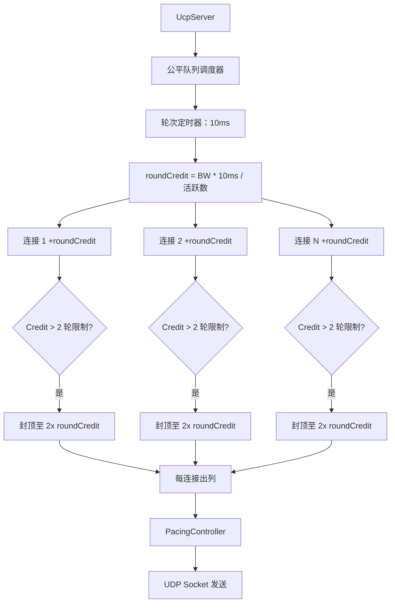

---

## Pacing 与 Token Bucket

`PacingController` 实现字节级 token bucket，语义如下：

- **Token 填充速率**：`BBRv2.PacingRate` 字节/秒。
- **Bucket 容量**：`PacingRate * PacingBucketDurationMicros` —— 通常为 10ms 字节量。
- **普通发送**：消耗 `SendQuantumBytes`（默认 = MSS）个 token。若不足则推迟到下一 tick。
- **紧急发送（`ForceConsume()`）**：即使 token 不足也立即记账字节开销，bucket 可变为负值，负余额上限为 bucket 容量 50%。

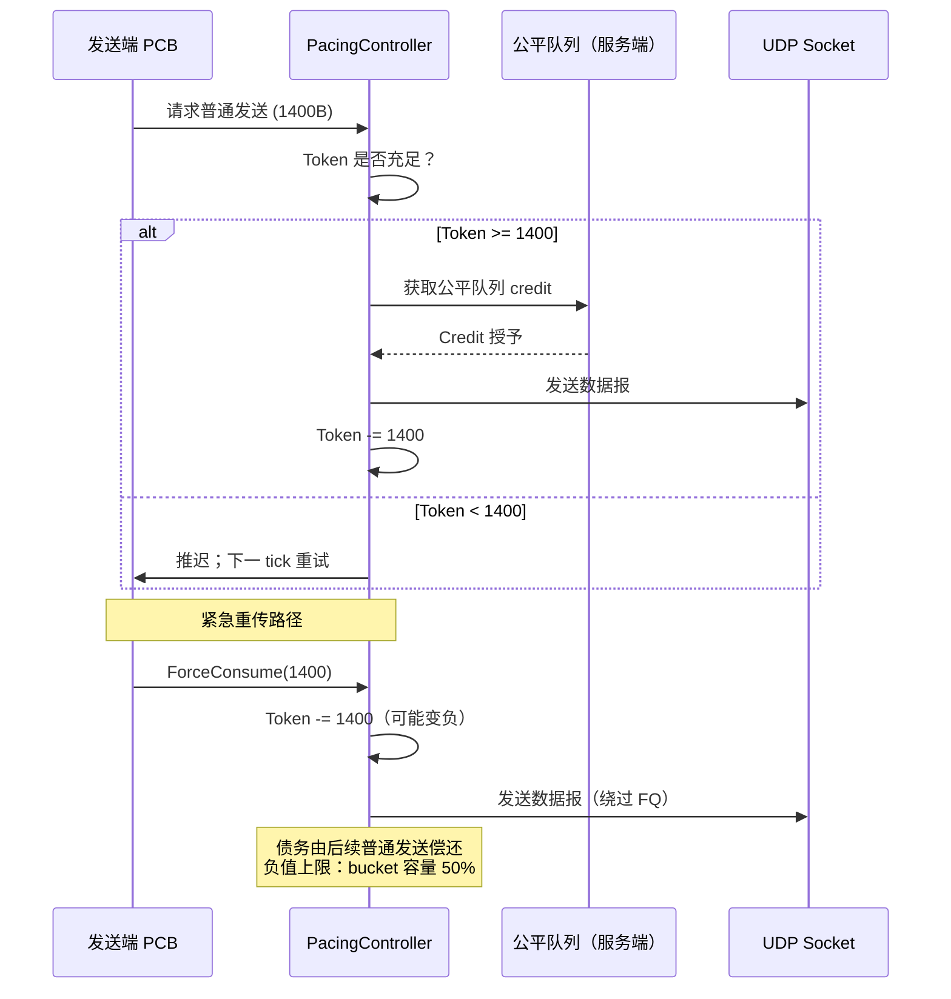

---

## BBRv2 拥塞控制与自适应 Pacing 增益

### BBRv2 状态机

```mermaid
stateDiagram-v2
    [*] --> Startup
    Startup --> Drain: 检测带宽平台
    Drain --> ProbeBW: 在途排空至 BDP 以下
    ProbeBW --> ProbeRTT: 需刷新 MinRTT（30s）
    ProbeRTT --> ProbeBW: MinRTT 已刷新
    ProbeBW --> ProbeBW: 循环增益（8 阶段）
    ProbeRTT --> ProbeBW: 丢包长肥路径 — 跳过 ProbeRTT

    note right of Startup: pacing_gain: 2.5<br>指数探测
    note right of Drain: pacing_gain: 0.75<br>排空队列
    note right of ProbeBW: 8 阶段循环<br>[1.35, 0.85, 1.0*6]
    note right of ProbeRTT: CWND: 4 包<br>100ms 持续时间
```

### 核心估计量

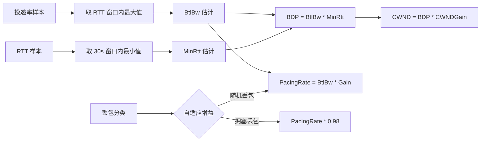

---

## 协议栈数据包流

### 出站数据包流

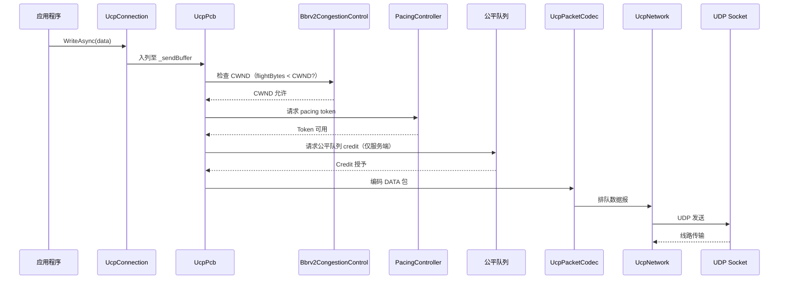

### 入站数据包流

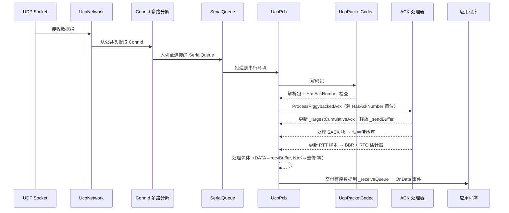

---

## FEC — Reed-Solomon GF(256) 自适应传输

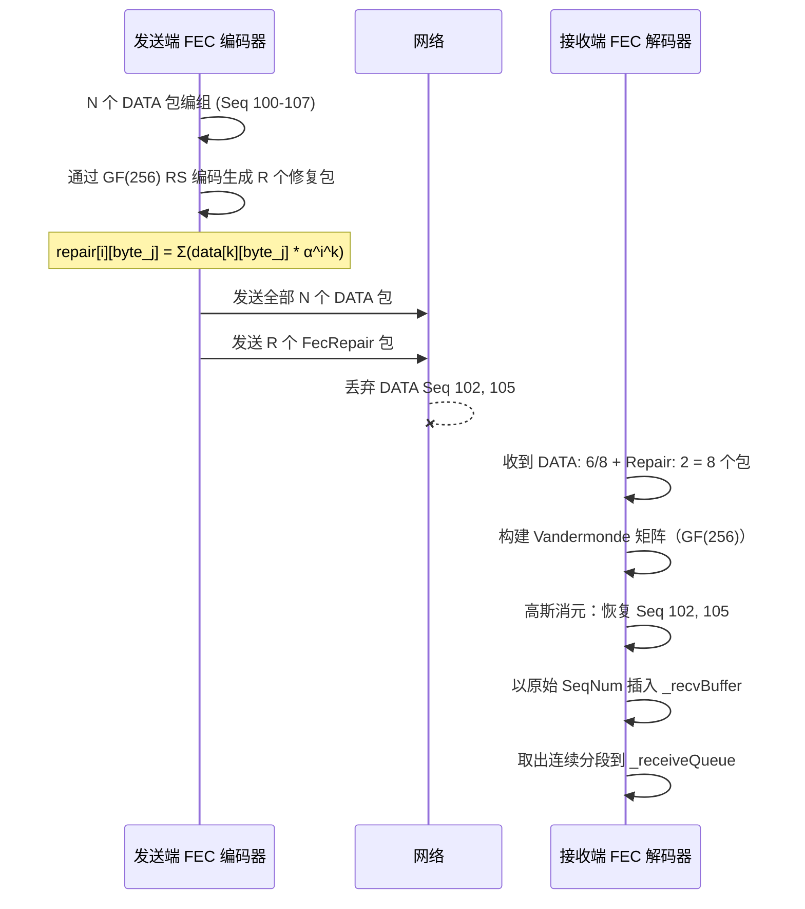

---

## 网络模拟器

`NetworkSimulator` 是确定性进程内网络仿真器，支持：
- 独立去程/回程传播延迟及每方向抖动。
- 通过虚拟逻辑时钟进行带宽序列化，避免 OS 调度在吞吐计算中引入抖动。
- 可配的随机或确定性丢包、重复和乱序。
- 中途 outage 模拟（如 Weak4G 80ms 断网）。
- 显式去程/回程延迟对的非对称路由模型。

---

## 测试架构

| 测试领域 | 示例 |
|---|---|
| **核心协议** | 序号环绕、包编解码往返、RTO 估计器收敛、pacing controller token 记账。 |
| **连接管理** | 连接 ID 多路分解、随机 ISN 唯一性、服务端动态 IP 重绑定、串行队列顺序性。 |
| **可靠性** | 丢包传输、突发丢包、SACK 每范围 2 次发送限制、NAK 分级置信度、FEC 多丢包修复。 |
| **流完整性** | 乱序/重复、部分读取、全双工不交错、捎带 ACK 正确性。 |
| **性能** | 4 Mbps 到 10 Gbps、0-10% 丢包、移动、卫星、VPN、长肥管 BBRv2 收敛验证。 |
| **报告** | 吞吐封顶强制、丢包/重传独立性、方向不对称校验。 |

## 验证流程

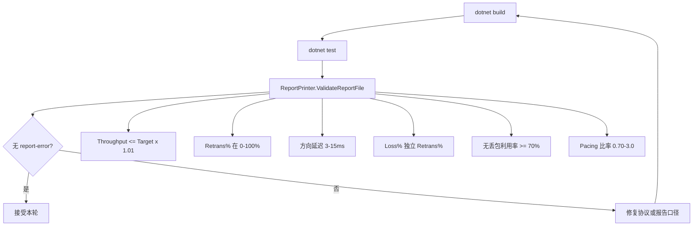
