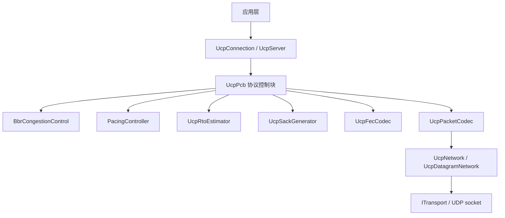
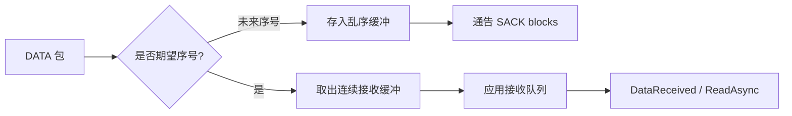
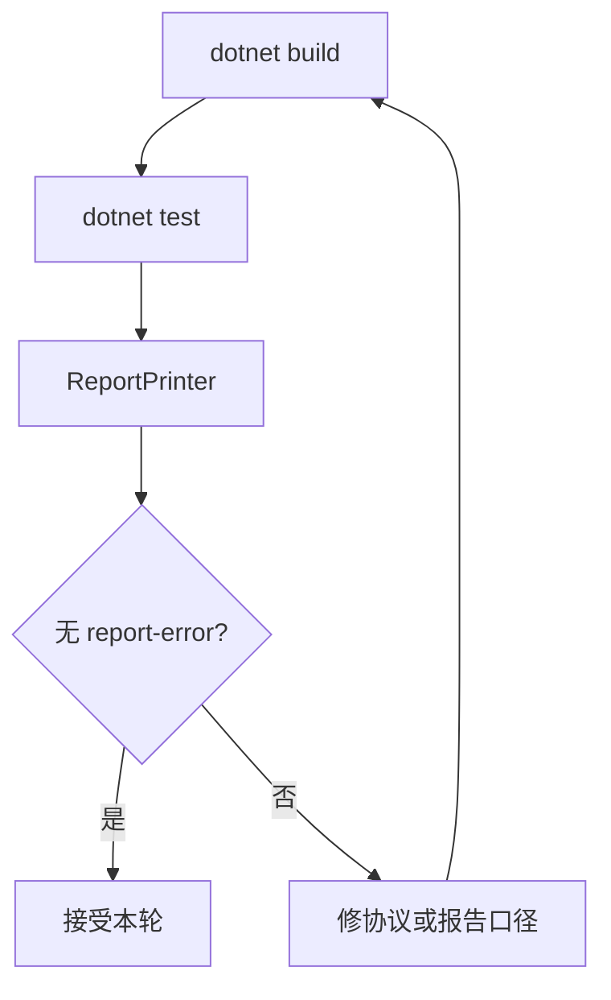

# UCP 架构深度解析

[English](architecture.md) | [文档索引](index_CN.md)

## 运行时分层

## UcpPcb

`UcpPcb` 是每连接协议控制块，负责发送状态、接收乱序、ACK/SACK/NAK 处理、重传定时器、BBR、pacing、公平队列 credit 和可选 FEC。

### 发送端状态

| 结构 | 作用 |
|---|---|
| `_sendBuffer` | 按序号排序、等待 ACK 的发送分段。 |
| `_flightBytes` | 当前认为在途的 payload 字节数。 |
| `_nextSendSequence` | 支持 32 位环绕比较的下一个序号。 |
| `_sackFastRetransmitNotified` | 去重 SACK 触发的快重传决策。 |
| `_urgentRecoveryPacketsInWindow` | pacing/FQ 绕过恢复的每 RTT 限流器。 |

### 接收端状态

| 结构 | 作用 |
|---|---|
| `_recvBuffer` | 按序号排序的乱序入站分段。 |
| `_nextExpectedSequence` | 下一个可有序交付的序号。 |
| `_receiveQueue` | 已有序、可供应用读取的 payload chunk。 |
| `_missingSequenceCounts` | NAK 生成使用的缺口观测计数。 |
| `_lastNakIssuedMicros` | 接收端 NAK 重复抑制。 |

## 有序交付

`HandleData()` 会把新 DATA 存入 `_recvBuffer`，从 `_nextExpectedSequence` 开始批量取出连续分段，然后把有序 payload 放入应用接收队列。流一致性测试使用唯一字节模式，避免 repeated-byte payload 掩盖乱序或错位。

## Pacing 与公平队列

`PacingController` 是字节级 token bucket。普通发送需要同时具备 token，以及服务端公平队列路径上的连接 credit。紧急重传只有在恢复逻辑标记且 RTT 窗口预算允许时，才能绕过这些 gate。

`ForceConsume()` 会在 bucket 为空时立即记账紧急字节。负 token balance 有上限，后续普通发送会等待偿还这部分 pacing debt。

## BBR 与丢包分类

BBR 从 delivery-rate 样本估计瓶颈带宽，并计算 `PacingRate = BtlBw * PacingGain`。丢包先分类再降速：

| 丢包类别 | BBR 响应 | 重传行为 |
|---|---|---|
| 随机丢包 | 保持或恢复 pacing/CWND。 | 立即重传。 |
| 拥塞丢包 | 温和应用 `0.98` gain 削减并保留 CWND 下限。 | 立即重传。 |

网络分类器使用 200ms 窗口统计 RTT、抖动、丢包和吞吐比例，区分 LAN、移动/不稳定、丢包长肥管、拥塞瓶颈和 VPN 类路径。

## 网络模拟器

`NetworkSimulator` 是确定性的进程内模拟器，支持独立去程/回程延迟、每方向抖动、带宽序列化、随机/自定义丢包、重复和乱序。高带宽无丢包场景使用虚拟逻辑时钟，避免 OS 调度夸大报告吞吐。

## 测试架构

| 测试领域 | 示例 |
|---|---|
| 核心协议 | 序号环绕、包编解码、RTO 估计器、pacing controller。 |
| 可靠性 | 丢包传输、突发丢包、SACK/NAK 恢复、FEC 单丢包恢复。 |
| 流完整性 | 乱序/重复、部分读取、全双工不交错。 |
| 性能 | 4 Mbps 到 10 Gbps、0-10% 丢包、移动、卫星、VPN、长肥管。 |
| 报告 | 吞吐封顶、Loss/Retrans 拆分、路由不对称校验。 |

## 验证流程

