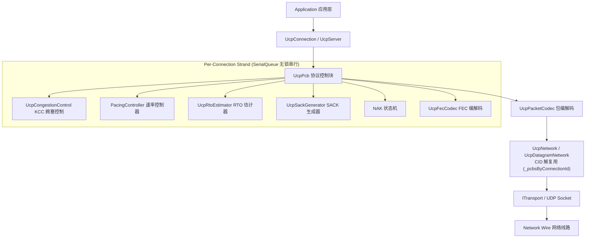
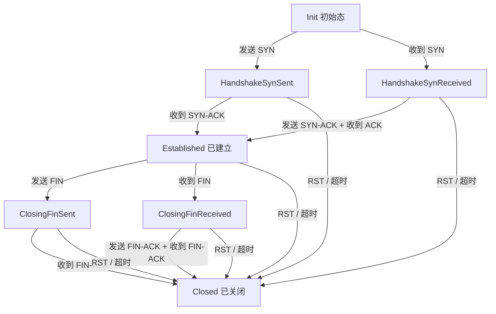
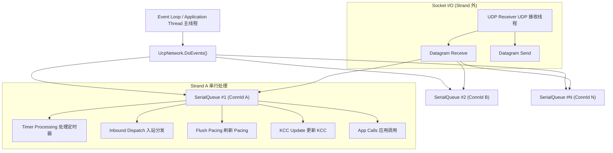
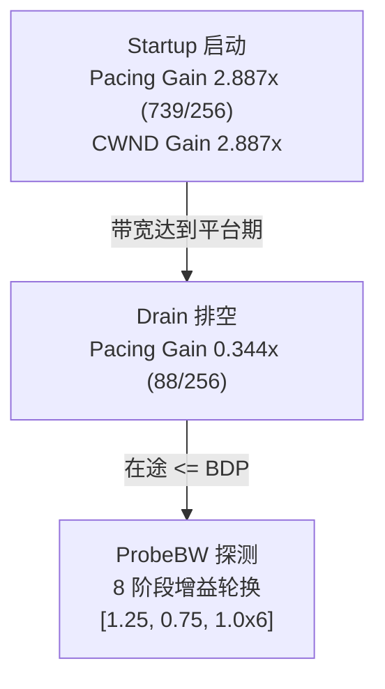
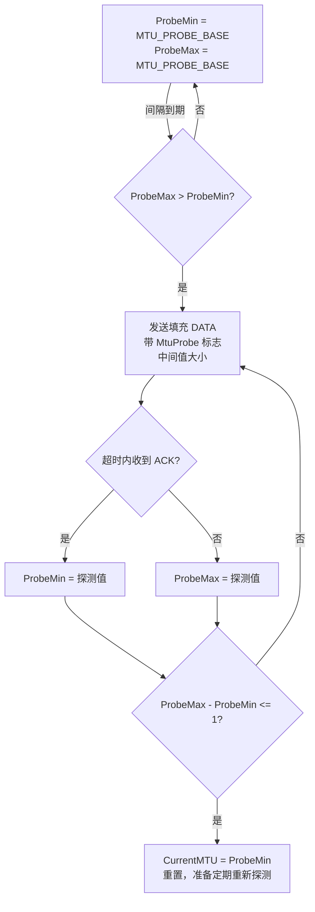
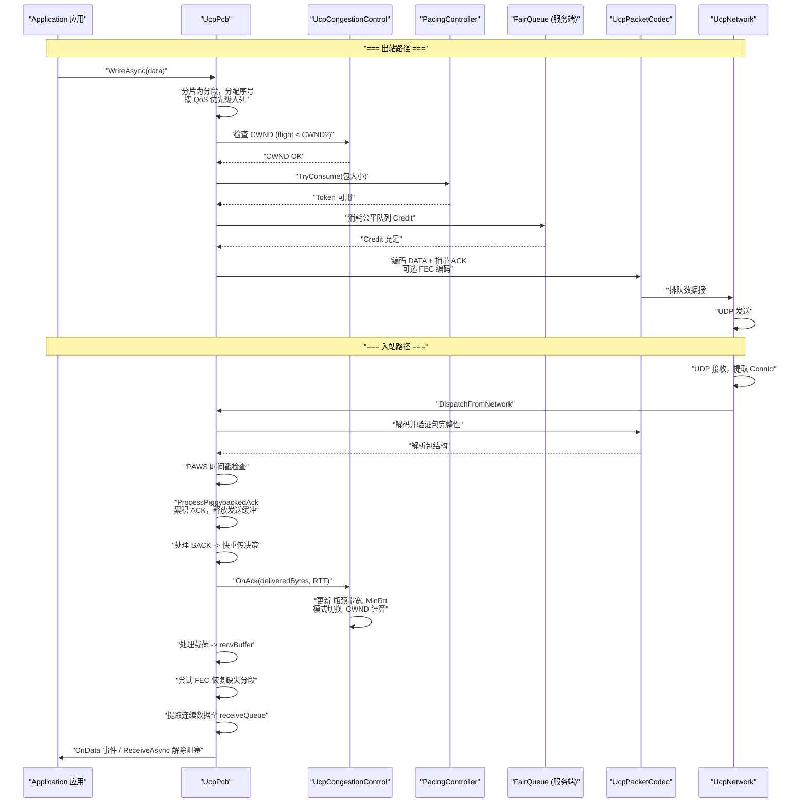

# PPP PRIVATE NETWORK™ X — 通用通信协议 (UCP) — 总体方案

[English](architecture.md) | [文档索引](index_CN.md)

本文档完整说明 UCP 协议引擎的内部运行时体系。UCP 是运行于 UDP 之上的纯控制协议：CID 轮换、FEC、捎带 ACK 和 SACK/NAK 恢复作为独立子系统，为 KCC（Geodesic Congestion Control，KF 组件源于 tcp_kcc.c v2.0）拥塞控制提供高保真投递率样本，实现精确的 BDP/RTT 估计。体系涵盖六层分层设计、UcpPcb 协议控制块状态机、每连接 SerialQueue 串行执行模型、KCC（Geodesic Congestion Control）拥塞控制引擎（KF 组件源于 tcp_kcc.c v2.0，结合 KCC 状态机与 Geodesic 估计器进行传播延迟估计，含 ECN 退避）、PacingController 令牌桶、FEC Reed-Solomon GF(256) 编解码器、动态 CID 迁移机制以及 DPLPMTUD 路径 MTU 发现。文中包含具体文件路径和代码行号引用，所有源文件位于 `Ucp/` 和 `Ucp/Internal/` 目录下。

## 六层运行时体系

UCP 从应用层 API 到 UDP Socket 组织为六层分层结构，每一层都有明确的职责边界。这种设计使得各层可以独立演化和测试——例如，可以用 NetworkSimulator 替代真实 UDP 传输层进行确定性测试，或者在不影响上层协议逻辑的前提下更换拥塞控制算法。

```mermaid
flowchart TD
    App["Application 应用层"] --> Conn["UcpConnection / UcpServer"]
    Conn --> Pcb["UcpPcb 协议控制块"]
    Pcb --> UCP["UcpCongestionControl KCC 拥塞控制"]
    Pcb --> Pacing["PacingController 速率控制器"]
    Pcb --> Rto["UcpRtoEstimator RTO 估计器"]
    Pcb --> Sack["UcpSackGenerator SACK 生成器"]
    Pcb --> Nak["NAK 状态机"]
    Pcb --> Fec["UcpFecCodec FEC 编解码"]
    Pcb --> Codec["UcpPacketCodec 包编解码"]
    Codec --> Net["UcpNetwork / UcpDatagramNetwork<br/>CID 解复用 (_pcbsByConnectionId)"]
    Net --> Trans["ITransport / UDP Socket"]
    Trans --> Wire["Network Wire 网络线路"]

    subgraph Strand["Per-Connection Strand (SerialQueue 无锁串行)"]
        Pcb
        UCP
        Pacing
        Rto
        Sack
        Nak
        Fec
    end
```

### 各层职责

| 层级 | 核心组件 | 职责范围 |
| - | - | - |
| 应用层 | `UcpServer`, `UcpConnection` | 公开 API；被动连接接受和基于信用制的公平队列调度；带背压的异步收发、事件通知和诊断报告 (`UcpConnection.cs:620`) |
| 协议控制 | `UcpPcb` | 完整每连接状态机；发送缓冲（重传追踪）、接收乱序缓冲、ACK/SACK/NAK 管线、定时器管理、KCC 拥塞控制、Pacing、公平队列 credit、可选 FEC；全部状态转换通过 SerialQueue 串行化 (`UcpPcb.cs:13`) |
| 拥塞与 Pacing | `UcpCongestionControl`, `PacingController`, `UcpRtoEstimator` | KCC（Geodesic Congestion Control）拥塞控制（KF 组件源于 tcp_kcc.c v2.0）从投递率样本计算 Pacing 速率和 CWND；PacingController 是字节级 Token Bucket，确保平滑发送；RTO 估计器提供平滑 RTT 值 (`UcpRtoEstimator.cs:6`) |
| 可靠性引擎 | `UcpSackGenerator`, NAK 状态机, `UcpFecCodec` | SACK 块生成（每范围最多 2 次发送，防止陈旧信息阻塞）；NAK 状态机追踪缺口观测计数配合三级置信度守卫；FEC 编解码使用预计算 GF(256) 表进行高速有限域运算 (`UcpFecCodec.cs:7`) |
| 序列化 | `UcpPacketCodec` | 全部 8 种包类型的大端序线格式编解码；交付前验证包完整性，拒绝截断或损坏的数据报 |
| 网络驱动 | `UcpNetwork`, `UcpDatagramNetwork` | 解耦引擎与 Socket I/O；ConnId 数据报多路分解、DoEvents 定时器分发、公平队列轮次、SerialQueue 分发；提供一致的虚拟时钟 (`UcpNetwork.cs:12`) |
| 传输 | `UdpSocketTransport` | UDP 收发与动态端口绑定；NetworkSimulator 实现同一接口配虚拟逻辑时钟用于确定性测试和复现 |

UCP 的三次握手采用 TCP 风格的随机初始序列号机制（RFC 6528）。客户端生成加密随机 ISN 并通过 SYN 包发送，服务端以自己的随机 ISN 回复 SYN-ACK，客户端最终发送 ACK 确认。这种机制可以有效防止盲注入攻击——攻击者无法观测 ISN 就无法注入合法数据包。连接建立后，所有数据包都携带捎带 ACK（piggybacked ACK），即每个出站数据包和控制包都包含接收方的累积 ACK 号、SACK 块和窗口通告，从而消除单独的 ACK 包开销。

服务端 `UcpServer` 使用信用制轮转公平队列调度器，每 10ms 为一个轮次。每个轮次中，根据各连接的有效 Pacing 速率按比例分配带宽信用，然后以轮转顺序刷新各连接的发送队列。信用累积上限为 2 个轮次，防止长时间空闲后突然爆发（睡狮效应）。紧急重传（urgent retransmit）可以绕过公平队列限制，但每 RTT 窗口内最多 16 个包，以防止滥用。

## 协议控制块 (UcpPcb)

`UcpPcb` 位于 `Ucp/Internal/UcpPcb.cs:13`，是 UCP 架构的中枢。每个活跃连接拥有独立 PCB 实例，以 32 位加密随机 Connection ID 为键。PCB 通过 Connection ID 而非 IP 地址来标识会话，因此支持 IP 无关的会话追踪——即使客户端 IP 地址或 UDP 端口发生变化（如手机从 Wi-Fi 切换到蜂窝网络），连接仍能持续。这是通过 `ValidateRemoteEndPoint` 方法（`UcpPcb.cs:623`）实现的，它在连接建立后会自动接受新端点，并使用 PATH_CHALLENGE 机制验证新路径归属权。

PCB 内部包含五大子系统：发送端（发送缓冲、在途字节追踪、序号分配）、接收端（乱序缓冲、有序交付队列、NAK 缺口追踪）、定时器管理（RTO、TLP、延迟 ACK、保活、断连）、恢复系统（KCC、SACK、NAK、FEC、RTO 估计器）、配置引用。所有子系统通过 SerialQueue 串行化访问，无需锁竞争。

### UcpPcb 状态机

```mermaid
flowchart TD
    Init["Init 初始态"] -->|"发送 SYN"| SynSent["HandshakeSynSent"]
    Init -->|"收到 SYN"| SynRcvd["HandshakeSynReceived"]
    SynSent -->|"收到 SYN-ACK"| Established["Established 已建立"]
    SynRcvd -->|"发送 SYN-ACK + 收到 ACK"| Established
    Established -->|"发送 FIN"| FinSent["ClosingFinSent"]
    Established -->|"收到 FIN"| FinRcvd["ClosingFinReceived"]
    FinSent -->|"收到 FIN-ACK"| Closed["Closed 已关闭"]
    FinRcvd -->|"发送 FIN-ACK + 收到 FIN-ACK"| Closed
    Established -->|"RST / 超时"| Closed
    SynSent -->|"RST / 超时"| Closed
    SynRcvd -->|"RST / 超时"| Closed
    FinSent -->|"RST / 超时"| Closed
    FinRcvd -->|"RST / 超时"| Closed
```

UCP 的优雅关闭使用两次 FIN 握手（比 TCP 的四次挥手更简洁）：一端发送 FIN，另一端回复 FIN-ACK。当双方的 FIN 都得到确认后，连接进入 Closed 状态。如果关闭过程中发生超时，则强制转换到 Closed。

### 发送管线

| 组件 | 文件位置 | 作用 |
| - | - | - |
| `_sendBuffer` | `UcpPcb.cs:111` | SortedDictionary 按序号排序的待确认分段；累积 ACK 到达时移除已确认分段 |
| `_flightBytes` | `UcpPcb.cs:179` | 当前在途 payload 总字节；用于 CWND 强制和 UCP 投递率计算 |
| `_nextSendSequence` | `UcpPcb.cs:173` | 下一个 32 位发送序号，从加密随机 ISN 开始单调递增（模 2^32） |
| `FlushSendQueueAsync` | `UcpPcb.cs` | 收集待发分段，依次检查 CWND、Pacing Token、公平队列 credit，编码后发送 |
| `_ackDelayed` | `UcpPcb.cs` | 延迟 ACK 标志；置位时下一个 DATA 包捎带累积 ACK |

每次 ACK 到达时，`ProcessPiggybackedAck`（`UcpPcb.cs:1197`）遍历发送缓冲，将序号小于等于 ACK 号的分段标记为已确认，减少 `_flightBytes`，记录 RTT 样本（仅首次发送包，遵循 Karn 算法避免重传歧义），并通过 `_sendSpaceSignal` 通知阻塞的写入方。该过程是累积确认——一个 ACK 可以一次确认多个分段。

### 接收管线

| 组件 | 文件位置 | 作用 |
| - | - | - |
| `_recvBuffer` | `UcpPcb.cs:113` | SortedDictionary 用于乱序入站分段缓冲，O(log n) 插入 |
| `_nextExpectedSequence` | `UcpPcb.cs:175` | 下个有序交付所需序号 |
| `_receiveQueue` | `UcpPcb.cs:115` | 连续数据块队列，供 `ReadAsync` 消费，支持部分读取 |
| `_nakIssued` | `UcpPcb.cs:117` | 同一 RTT 窗口内抑制重复 NAK |
| `_missingSequenceCounts` | `UcpPcb.cs:119` | 每个序号缺口观测计数，用于 NAK 置信层级从 Low 升级到 Medium 再到 High |

入站分发（`HandleInboundAsync` 位于 `UcpPcb.cs:1001`）按包类型路由。PAWS（Protection Against Wrapped Sequences）机制通过检查时间戳防止序列号回绕后的陈旧重复包——如果入站包的时间戳比最大已见时间戳落后超过 60 秒，则拒绝处理。

### 定时器管理

| 定时器 | 实现机制 | 用途 |
| - | - | - |
| RTO | `UcpRtoEstimator` (`UcpRtoEstimator.cs:6`) | 重传超时，RFC 6298 风格（SRTT + 4xRTTVAR），指数退避 |
| TLP | `_tailLossProbePending` (`UcpPcb.cs:304`) | 尾丢失探测，在途包很少时触发，比 RTO 更快检测静默丢包 |
| 延迟 ACK | `_ackDelayed` (`UcpPcb.cs:232`) | 窗口内合并 ACK，随下个 DATA 包捎带发送，减少单独 ACK 包数量 |
| 保活 | `_lastPeerAliveMicros` (`UcpPcb.cs:190`) | 空闲时周期性探测，检测对端无声死亡 |
| 断连 | `_config.DisconnectTimeoutMicros` | 最大空闲时间后强制关闭连接 |

网络管理模式（`UcpNetwork` 位于 `UcpNetwork.cs:12`）下，所有定时器共享一个按到期时间排序的定时器堆（`_timerHeap` 位于 `UcpNetwork.cs:86`），由 `DoEvents`（`UcpNetwork.cs:297`）驱动。`DoEvents` 在每次调用时刷新缓存时钟、触发到期定时器、遍历所有 PCB 执行 OnTick。独立模式使用每个 PCB 独立的 `System.Threading.Timer`。

## SerialQueue 每连接串行执行模型

`SerialQueue` 位于 `Ucp/Internal/SerialQueue.cs:10`，实现轻量级每连接串行执行环境（strand）：

```mermaid
flowchart TD
    Main["Event Loop / Application Thread 主线程"] --> DoEvents["UcpNetwork.DoEvents()"]
    DoEvents --> SQ1["SerialQueue #1 (ConnId A)"]
    DoEvents --> SQ2["SerialQueue #2 (ConnId B)"]
    DoEvents --> SQN["SerialQueue #N (ConnId N)"]

    subgraph Strand1["Strand A 串行处理"]
        SQ1 --> T1["Timer Processing 处理定时器"]
        SQ1 --> T2["Inbound Dispatch 入站分发"]
        SQ1 --> T3["Flush Pacing 刷新 Pacing"]
        SQ1 --> T4["KCC Update 更新 KCC"]
        SQ1 --> T5["App Calls 应用调用"]
    end

    subgraph IO["Socket I/O (Strand 外)"]
        IOThread["UDP Receiver UDP 接收线程"] --> Recv["Datagram Receive"]
        IOThread --> Send["Datagram Send"]
    end

    Recv --> SQ1
    Recv --> SQ2
    Recv --> SQN
```

| 属性 | 说明 |
| - | - |
| 无锁结构 | PCB 状态不会被多线程并发访问，全部变更在同一串行环境顺序发生 |
| 优先级入列 | `PostPriority` 通过 `LinkedList.AddFirst` 实现 O(1) 前端插入，用于 NAK 包绕过正常 FIFO 顺序 (`SerialQueue.cs:85`) |
| 异常隔离 | 捕获异常后通过 `Trace` 日志记录，处理循环继续运行，不会因为单个工作项的失败而崩溃 (`SerialQueue.cs:260-287`) |
| I/O 卸载 | 仅 UDP Socket Send/Receive 在串行环境外执行，避免 I/O 延迟阻塞协议处理 |

SerialQueue 内部使用 `LinkedList<Func<Task>>` 作为底层队列。普通项目通过 `AddLast` 追加到尾部，优先级项目（NAK 包）通过 `AddFirst` 插入到头部。当队列为空时，处理循环自动退出；下一个 `Enqueue` 调用会重新启动循环。这种设计避免了不必要的线程占用。

## KCC 拥塞控制

`UcpCongestionControl` 位于 `Ucp/UcpCongestionControl.cs:52`，实现了 KCC（Geodesic Congestion Control）拥塞控制器。3 模式状态机（STARTUP/DRAIN/PROBE_BW）位于 UcpCongestionControl（C#/C++）中；Geodesic 估计器传播延迟估计组件源于 tcp_kcc.c v2.0。MinRTT 跟踪由 Geodesic G1/G3 自动处理。

### KCC 拥塞控制状态机

```mermaid
flowchart TD
    Startup["Startup 启动<br/>Pacing Gain 2.887x (739/256)<br/>CWND Gain 2.887x"] -->|"带宽达到平台期"| Drain["Drain 排空<br/>Pacing Gain 0.344x (88/256)"]
    Drain -->|"在途 <= BDP"| ProbeBW["ProbeBW 探测<br/>8 阶段增益轮换<br/>[1.25, 0.75, 1.0x6]"]
```

注：3 模式状态机（KCC 2.0 风格，STARTUP/DRAIN/PROBE_BW）及固定开环增益在 UcpCongestionControl（C#/C++）中实现，并与 tcp_kcc.c 保持一致。MinRTT 跟踪由 Geodesic 估计器 G1/G3 自动处理。可发送上限为 min(cwnd, 对端宣告的接收窗口)；初始 cwnd 并非固定的 10 包上限。

### 各模式行为

| 模式 | Pacing 增益 | CWND 增益 | 持续时间 | 触发条件 |
| - | - | - | - | - |
| Startup | 2.887 (739/256, 内核 KCC_HIGH_GAIN) | 2.887 | 至带宽平台出现 | 连接启动，指数探测瓶颈带宽 |
| Drain | 0.344 (88/256, 内核 KCC_DRAIN_GAIN) | 2.887 | ~1 RTT | 带宽增长停止（连续 N 轮增长 < 1.25 倍） |
| ProbeBW | 8 阶段增益循环 [1.25, 0.75, 1.0x6] | 2.0 | 稳态运行（每轮 1 RTT） | Drain 完成，进入稳态探测 |
| MinRTT（G1/G3） | -- | -- | 持续运行 | Geodesic 估计器 G1/G3 自动跟踪 min RTT；无需独立模式 |

### 带宽估计

瓶颈带宽通过滑动窗口最大值过滤器计算（`UcpCongestionControl.cs:591`），基于近期 ACK 轮次的投递率样本。最大值过滤器对 ACK 压缩具有鲁棒性（ACK 压缩时产生的瞬时高投递率反映了管道的真实容量），同时能跟踪带宽增长。长期带宽估计通过 EWMA 滤波器对投递率样本进行平滑，补充最大值滤波器以实现更稳定的带宽预测。

### Geodesic 估计器传播延迟估计

Geodesic 估计器（G1/G2/G3）通过三分量行为模型（T_prop / T_queue / T_noise）将真实信号从测量噪声中分离来估计准确的传播延迟（RTT 基值）。估计器只有一个状态变量（x_est，1024 定点缩放）和三个结构分支：G1 瞬时向下吸收、G2 向上有界增长（每 RTT 12.2%，以观测值为上限）、G3 双阈值路径增长检测（快路径：6 次连续事件 ≥ 1.10×min_rtt；慢路径：7 次连续事件 ≥ 1.05×min_rtt）。固定结构参数：p_est_init=1000, p_est_floor=10, p_est_max=1,000,000, scale=1024。p_est 是标量置信代理；不存在协方差矩阵、过程模型或自适应增益。估计后的 RTT 输入自动 MinRtt 跟踪（通过 G1/G3）。

### RTT 估计（Geodesic 估计器）

Geodesic 估计器（G1/G2/G3）通过将真实信号从测量噪声中分离来估计准确的传播延迟：

- **状态 x_est**：真实传播延迟（us × 1024 缩放）
- **G1（向下）**：x_est = min(x_est, z)——瞬时吸收向下噪声
- **G2（向上）**：x_est = min(x_est + 每 RTT 12.2%, z)——有界增长，以观测值为上限
- **G3（路径变化）**：双阈值 Wald SPRT——快路径 6 次连续事件 ≥1.10×，慢路径 7 次连续事件 ≥1.05×，三档 min_rtt 锁（<5ms 锁定、5-7.5ms 仅快路径、≥7.5ms 双路径）
- **置信度 p_est**：标量置信代理，有界 [floor=10, max=1,000,000]
- **min_rtt 接管**：x_est >> scale 在最小样本数（5）后替代窗口最小值法

Geodesic 估计器收敛后提供抗噪声的 min_rtt 估计。

### ECN 感知退避

ECN 启用时（默认禁用，需 opt-in），CE 标记段通过 ECN 标记比例 EWMA 跟踪。当 ecn_ewma > 0 且 qdelay_avg 超过拥塞阈值（max(25% × min_rtt, 500us)）时，cwnd_gain 按退避比例（默认 20%）降低。探测期间（pacing_gain > BBR_UNIT）退避抑制为渐进的（`BBR_UNIT² / pacing_gain`）。PROBE_BW 模式下 cwnd_gain 保持 2.0x（默认 UcpCongestionControl 行为）。每 ACK 空闲衰减（kcc_ecn_idle_decay_num/den，默认 31/32）确保 ECN 标记不会在稳定连接上无限期持续。

## FEC/NAK 与拥塞控制的集成

FEC 和 NAK 为拥塞控制引擎提供高保真投递率样本。FEC 主动通过修复包恢复丢失数据，恢复的字节作为带宽样本投递，提升吞吐/RTT 估计精度。NAK 被动报告缺失序列，NAK 观测的丢包样本改善长期带宽 EWMA 估计。两者共同形成独立但互补的投递率样本源，即使在严重丢包下也能实现精确的带宽和延迟估计。

## PacingController 令牌桶

`PacingController` 位于 `Ucp/PacingController.cs:6`，强制执行拥塞控制计算的 Pacing 速率。令牌以字节为单位，按经过时间和当前速率比例补充。

| 操作 | 说明 |
| - | - |
| `TryConsume(bytes, now)` | 补充令牌，余额足够则扣除并返回 true，否则返回 false (`PacingController.cs:76`) |
| `ForceConsume(bytes, now)` | 紧急重传时清空令牌至零，绕过公平队列；令牌不会为负 (`PacingController.cs:95`) |
| `GetWaitTimeMicros(bytes, now)` | 返回获得 `bytes` 令牌所需的微秒数，用于延迟刷新调度 (`PacingController.cs:105`) |
| `SetRate(rate, now)` | 更新 Pacing 速率，重新计算桶容量 (`PacingController.cs:50`) |

桶容量为 `rate x bucketDuration / 1s`，下限为一个 MTU。`ForceConsume` 将令牌清至零，令牌永远不会为负；紧急重传后 pacing 通过后续补充正常恢复。

## FEC Reed-Solomon GF(256) 编解码器

`UcpFecCodec` 位于 `Ucp/UcpFecCodec.cs:7`，提供系统化前向纠错。系统化意味着数据包以原始形式传输，修复包是额外的校验数据——接收方可以组合原始数据包和修复包来恢复丢失的数据包。

### 数学基础

- 不可约多项式：x^8 + x^4 + x^3 + x^2 + 1 = 0x11d
- 本原元 alpha = 0x02
- 加法：XOR（字节级）
- 乘法：antilog[(log[a] + log[b]) mod 255] 通过 O(1) 预计算表实现
- 对数表：256 条目，反对数表：512 条目（`UcpFecCodec.cs:20-22, 40-58`，索引 255..511 为前 255 个条目的副本，实现无环绕查找）

### 编码

`FecGroupSize` 个连续数据包为一组，生成 `ceil(组大小 x 冗余度)` 个修复包。每个修复包使用 Vandermonde 加权 XOR 将所有数据包混合在一起：`repair[j] = sum(coefficient_i x data_i[j])`，系数为 `(repairIndex+1)^slot` 在 GF(256) 中的值。每个修复包头部包含长度表（每 slot 2 字节），支持变长载荷。`EncodeRepairsFromGroup` 位于 `UcpFecCodec.cs:155`。

### 解码

解码器从缺失 slot 索引和可用修复包索引构建 Vandermonde 系数矩阵，然后在 GF(256) 域上执行高斯消元（`TrySolve` 位于 `UcpFecCodec.cs:516`）。算法包括前向消元、部分主元选取、归一化和回代。需要至少与缺失数据包数量相等的独立修复包。如果矩阵奇异（例如两个修复包线性相关），则放弃恢复。

### 自适应冗余

| 观测丢包率 | 冗余倍数 |
| - | - |
| < 0.5% | 基础值（配置） |
| 0.5% - 2% | 基础 x 1.25 |
| 2% - 5% | 基础 x 1.5，减小分组大小 |
| 5% - 10% | 基础 x 2.0 最大自适应 |
| > 10% | FEC 辅助角色，以重传为主要恢复手段 |

## 动态 CID 迁移

Connection ID 每 60 秒轮换一次，防止长期可链接性以增强隐私保护：

| 机制 | 文件位置 | 说明 |
| - | - | - |
| `_extraCids` | `UcpPcb.cs:310` | 多宿主的有效备用 CID 集合 |
| `_pendingNewCid` | `UcpPcb.cs:312` | 正在轮换协商中的 CID |
| `IsValidCid` | `UcpPcb.cs:599` | 检查主 CID 和备用 CID 用于入站包路由 |
| `AddExtraCid` | `UcpPcb.cs:608` | 注册额外 CID |
| `RemoveExtraCid` | `UcpPcb.cs:617` | 轮换完成后移除旧 CID |

新旧 CID 在 120 秒内同时有效，确保平滑过渡。此机制借鉴 QUIC 的 CID 轮换设计。PATH_CHALLENGE（`UcpPcb.cs:640-684, 2783`）在迁移前验证新端点路径归属权：发送 8 字节随机挑战到候选端点，等待对端将其包含在响应中。具有 `PATH_CHALLENGE_RATE_LIMIT_MICROS` 速率限制和 `PATH_CHALLENGE_MAX_ATTEMPTS` 最大尝试次数（超过后无条件接受）。

## DPLPMTUD 路径 MTU 发现

`UcpPcb` 实现 Datagram Packetization Layer Path MTU Discovery（RFC 8899）：

| 参数 | 值 | 说明 |
| - | - | - |
| MTU_PROBE_BASE | 1200 | 起始搜索下限，确认可用 |
| 探测范围 | 1200 - 1500 | 二分搜索范围 |
| 探测方法 | 填充 DATA 包 + MtuProbe 标志 | 非探测包使用 CurrentMTU，不受探测影响 |
| 确认方式 | 探测包 ACK 确认 | 超时 = RTT + 安全边距 |
| 重新探测 | 收敛后定期重新探测 | 检测路径 MTU 增长 |

```mermaid
flowchart TD
    Idle["ProbeMin = MTU_PROBE_BASE<br/>ProbeMax = MTU_PROBE_BASE"] -->|"间隔到期"| Search{"ProbeMax > ProbeMin?"}
    Search -->|"否"| Idle
    Search -->|"是"| SendProbe["发送填充 DATA<br/>带 MtuProbe 标志<br/>中间值大小"]
    SendProbe --> AckCheck{"超时内收到 ACK?"}
    AckCheck -->|"是"| RaiseMin["ProbeMin = 探测值"]
    AckCheck -->|"否"| LowerMax["ProbeMax = 探测值"]
    RaiseMin --> Converge{"ProbeMax - ProbeMin <= 1?"}
    LowerMax --> Converge
    Converge -->|"是"| SetMtu["CurrentMTU = ProbeMin<br/>重置，准备定期重新探测"]
    Converge -->|"否"| SendProbe
```

## 穿越协议栈的数据包流

```mermaid
sequenceDiagram
    participant App as "Application 应用"
    participant PCB as "UcpPcb"
    participant UCP as "UcpCongestionControl"
    participant Pace as "PacingController"
    participant FQ as "FairQueue (服务端)"
    participant Codec as "UcpPacketCodec"
    participant Net as "UcpNetwork"

    Note over App,Net: "=== 出站路径 ==="
    App->>PCB: "WriteAsync(data)"
    PCB->>PCB: "分片为分段，分配序号<br/>按 QoS 优先级入列"
    PCB->>UCP: "检查 CWND (flight < CWND?)"
    UCP-->>PCB: "CWND OK"
    PCB->>Pace: "TryConsume(包大小)"
    Pace-->>PCB: "Token 可用"
    PCB->>FQ: "消耗公平队列 Credit"
    FQ-->>PCB: "Credit 充足"
    PCB->>Codec: "编码 DATA + 捎带 ACK<br/>可选 FEC 编码"
    Codec->>Net: "排队数据报"
    Net->>Net: "UDP 发送"

    Note over App,Net: "=== 入站路径 ==="
    Net->>Net: "UDP 接收，提取 ConnId"
    Net->>PCB: "DispatchFromNetwork"
    PCB->>Codec: "解码并验证包完整性"
    Codec-->>PCB: "解析包结构"
    PCB->>PCB: "PAWS 时间戳检查"
    PCB->>PCB: "ProcessPiggybackedAck<br/>累积 ACK，释放发送缓冲"
    PCB->>PCB: "处理 SACK -> 快重传决策"
    PCB->>UCP: "OnAck(deliveredBytes, RTT)"
    UCP->>UCP: "更新 瓶颈带宽, MinRtt<br/>模式切换, CWND 计算"
    PCB->>PCB: "处理载荷 -> recvBuffer"
    PCB->>PCB: "尝试 FEC 恢复缺失分段"
    PCB->>PCB: "提取连续数据至 receiveQueue"
    PCB->>App: "OnData 事件 / ReceiveAsync 解除阻塞"
```

## 跨平台实现

本总体方案在三个实现中得以实现：

- **C# (.NET 8)**：此项目。上述六层运行时、SerialQueue 串行模型和公平队列调度器即为 C# 参考实现。
- **C++ (C++17)**：原生实现，共享完全相同的架构和线路格式，支持跨语言互操作。C++ 特有优化包括移动语义删除、shared_ptr 内存管理和 Boost.Asio 回调的 noexcept 标注。详见 [cpp/docs/architecture_CN.md](../cpp/docs/architecture_CN.md)。
- **Linux 内核模块 (KCC)**：内核态适配，将 UCP 架构映射到 Linux TCP/IP 协议栈。PCB 状态管理、KCC 拥塞控制（KF 组件源于 tcp_kcc.c v2.0）和 FEC 在内核上下文中运行，支持零拷贝数据路径和标准 socket API。详见 [linux/README.md](../linux/README.md)。

---

## 许可证与商标

MIT 许可证。完整文本见 [LICENSE](../LICENSE)。

版权所有 (c) 2026 PPP PRIVATE NETWORK™ X

PPP PRIVATE NETWORK™ 是 PPP PRIVATE NETWORK 的商标。
