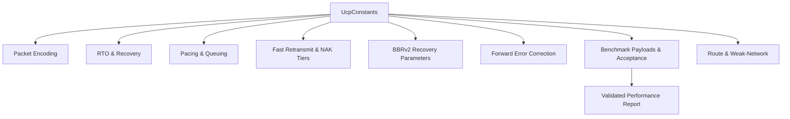
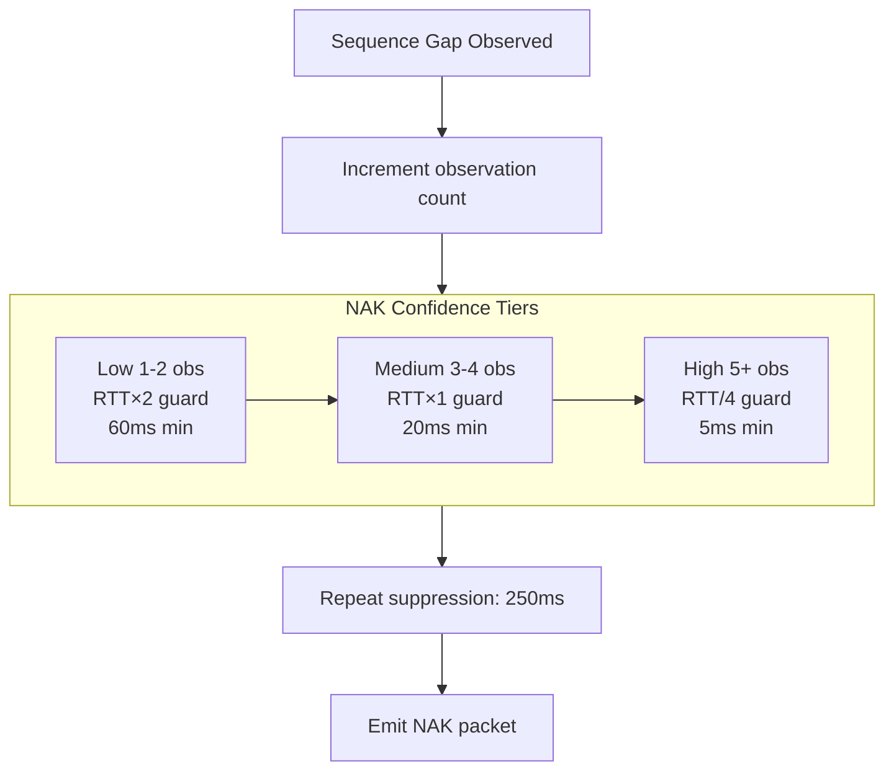

# PPP PRIVATE NETWORK™ X - Universal Communication Protocol (UCP) — Constants Reference

[中文](constants_CN.md) | [Documentation Index](index.md)

**Protocol designation: `ppp+ucp`** — This document catalogs every tunable and fixed constant in the UCP protocol implementation, organized by subsystem. All constants are defined in `UcpConstants` and accessible through `UcpConfiguration`. Time values are in microseconds unless explicitly named otherwise (e.g., `*Milliseconds`).

## Navigation

## Packet Encoding

These constants define the wire-format sizes and limits. All sizes are in bytes.

| Constant | Value | Meaning |
|---|---|---:|
| `MSS` | 1220 | Default maximum segment size including all headers. Increased to 9000 for high-bandwidth benchmarks. |
| `COMMON_HEADER_SIZE` | 12 | Size of the mandatory common header: Type(1) + Flags(1) + ConnId(4) + Timestamp(6). |
| `DATA_HEADER_SIZE` | 20 | Common header plus DATA-specific fields: SeqNum(4) + FragTotal(2) + FragIndex(2). |
| `MAX_PAYLOAD_SIZE` | 1200 | Maximum application payload bytes per DATA packet at default MSS. |
| `ACK_FIXED_SIZE` | 26 | ACK bytes before variable-length SACK blocks: AckNumber(4) + SackCount(2) + reserved(0). Does not include WindowSize and EchoTimestamp which follow SACK blocks. |
| `SACK_BLOCK_SIZE` | 8 | Encoded size of one SACK range: StartSequence(4) + EndSequence(4). |
| `DEFAULT_ACK_SACK_BLOCK_LIMIT` | 149 | Maximum SACK blocks per ACK at default MSS. Automatically reduced for smaller MSS to ensure the ACK fits in one datagram. |
| `HAS_ACK_FLAG` | 0x01 | Bit in the Flags byte indicating the HasAckNumber field is present. Set on all packet types that carry piggybacked ACK. |
| `PIGGYBACK_ACK_SIZE` | 4 | Size of the optional AckNumber field when HasAckNumber flag is set. |

## RTO And Recovery Timers

| Constant | Value | Meaning |
|---|---|---:|
| `DEFAULT_RTO_MICROS` | 200,000 | Optimized minimum RTO. Balances fast recovery on lossy LAN (200ms is short enough) against premature timeout on high-jitter paths. |
| `INITIAL_RTO_MICROS` | 250,000 | Initial RTO before any RTT samples are collected. Slightly higher than the minimum to provide margin during handshake. |
| `DEFAULT_MAX_RTO_MICROS` | 15,000,000 | Absolute maximum RTO. After this, the connection is declared dead unless ACK progress is observed. |
| `RTO_BACKOFF_FACTOR` | 1.2 | Multiplier applied per consecutive RTO. At 1.2×, the RTO escalates as: 200ms → 240ms → 288ms → 346ms → ... → 15s. Milder than TCP's 2.0× for faster dead-path detection. |
| `RTO_RETRANSMIT_BUDGET_PER_TICK` | 4 | Maximum number of RTO-triggered retransmissions armed by a single timer tick. Prevents a massive RTO from bursting 1000 packets all at once. |
| `RTO_ACK_PROGRESS_SUPPRESSION_MICROS` | 2,000 | If ACK progress (cumulative ACK advance) occurred within this window, suppress bulk RTO scanning. Lets SACK and NAK handle recovery first — mirrors QUIC PTO behavior. |
| `URGENT_RETRANSMIT_BUDGET_PER_RTT` | 16 | Maximum urgent retransmissions allowed to bypass pacing and fair-queue gates per RTT window. Resets at each new RTT estimate. |
| `URGENT_RETRANSMIT_DISCONNECT_THRESHOLD_PERCENT` | 75 | When elapsed idle time reaches this percentage of `DisconnectTimeoutMicros`, tail-loss probes become eligible for urgent marking. |

## Pacing And Queuing

| Constant | Value | Meaning |
|---|---|---:|
| `DEFAULT_MIN_PACING_INTERVAL_MICROS` | 0 | No artificial minimum inter-packet gap. The token bucket alone controls pacing timing. |
| `DEFAULT_PACING_BUCKET_DURATION_MICROS` | 10,000 | Token bucket capacity window in microseconds. A larger window allows bigger bursts (up to PacingRate × 10ms). |
| `MAX_NEGATIVE_TOKEN_BALANCE_MULTIPLIER` | 0.5 | Maximum negative token balance as a fraction of bucket capacity. Prevents unlimited pacing debt from urgent retransmits. |
| `FAIR_QUEUE_ROUND_MILLISECONDS` | 10 | Duration of each fair-queue scheduling round on the server side. |
| `MAX_BUFFERED_FAIR_QUEUE_ROUNDS` | 2 | Maximum number of fair-queue rounds for which unused credit accumulates. A connection that was idle for 10 rounds cannot burst 10 rounds worth of credit. |

## Fast Retransmit And NAK Tiers

These constants define the multi-tier recovery architecture.

### SACK-Based Recovery

| Constant | Value | Meaning |
|---|---|---:|
| `DUPLICATE_ACK_THRESHOLD` | 2 | Number of duplicate ACKs (same cumulative ACK value) needed to trigger fast retransmit. |
| `SACK_FAST_RETRANSMIT_THRESHOLD` | 2 | Number of SACK observations needed before the first missing hole is eligible for repair. |
| `SACK_FAST_RETRANSMIT_DISTANCE_THRESHOLD` | 32 | Additional holes below the highest SACKed sequence become eligible when the distance from the highest observed sequence exceeds this threshold. Enables parallel multi-hole repair. |
| `SACK_FAST_RETRANSMIT_MIN_REORDER_GRACE_MICROS` | 3,000 | Minimum sender-side reorder grace period for SACK-triggered repair. Actual grace is `max(3ms, RTT / 8)`. |
| `SACK_BLOCK_MAX_SENDS` | 2 | Maximum number of times a single SACK block range is advertised. After 2 sends, the block is suppressed to prevent SACK amplification. |

### NAK Tiered Confidence

| Constant | Value | Meaning |
|---|---|---:|
| `NAK_MISSING_THRESHOLD` | 2 | Minimum receiver observations before a gap becomes NAK-eligible. |
| `NAK_LOW_CONFIDENCE_GUARD_MULTIPLIER` | 2.0 | Reorder guard multiplier for Low confidence tier (1-2 observations): `max(RTT × 2, 60ms)`. |
| `NAK_MEDIUM_CONFIDENCE_GUARD_MULTIPLIER` | 1.0 | Reorder guard multiplier for Medium confidence tier (3-4 observations): `max(RTT, 20ms)`. |
| `NAK_HIGH_CONFIDENCE_GUARD_MULTIPLIER` | 0.25 | Reorder guard multiplier for High confidence tier (5+ observations): `max(5ms, RTT / 4)`. |
| `NAK_LOW_CONFIDENCE_MIN_GUARD_MICROS` | 60,000 | Absolute minimum reorder guard for Low confidence. |
| `NAK_MEDIUM_CONFIDENCE_MIN_GUARD_MICROS` | 20,000 | Absolute minimum reorder guard for Medium confidence. |
| `NAK_HIGH_CONFIDENCE_MIN_GUARD_MICROS` | 5,000 | Absolute minimum reorder guard for High confidence. |
| `NAK_REPEAT_INTERVAL_MICROS` | 250,000 | Minimum interval between successive NAKs for the same missing sequence number. Prevents NAK storms. |
| `MAX_NAK_SEQUENCES_PER_PACKET` | 256 | Maximum number of missing sequence entries in a single NAK packet. |

## BBRv2 Recovery Constants

These constants govern how BBRv2 responds to loss events after classification.

| Constant | Value | Meaning |
|---|---|---:|
| `BBR_FAST_RECOVERY_PACING_GAIN` | 1.25 | Pacing gain multiplier for non-congestion fast recovery. Quickly refills holes without reducing throughput. |
| `BBR_CONGESTION_LOSS_REDUCTION` | 0.98 | Gentle congestion-loss reduction multiplier applied to `AdaptivePacingGain`. A 2% reduction per congestion event. |
| `BBR_MIN_LOSS_CWND_GAIN` | 0.95 | Lower bound for CWND gain after a congestion loss event. Prevents CWND from collapsing below 95% of BDP. |
| `BBR_LOSS_CWND_RECOVERY_STEP` | 0.04 | Per-ACK recovery step that incrementally restores CWND gain toward 1.0 after a congestion reduction. |
| `BBR_RANDOM_LOSS_MAX_DEDUPED_EVENTS` | 2 | Maximum number of isolated loss events within a short window that are classified as random (not congestion). |
| `BBR_CONGESTION_LOSS_WINDOW_THRESHOLD` | 3 | If loss events in a window exceed this count, congestion classification requires additional RTT evidence. |
| `BBR_CONGESTION_LOSS_RTT_MULTIPLIER` | 1.10 | RTT inflation threshold: current RTT must exceed `MinRtt × 1.10` for the congestion classifier to confirm congestion alongside loss count. |

## Forward Error Correction

| Constant | Value | Meaning |
|---|---|---:|
| `FEC_GROUP_SIZE` | 8 (default) | Default number of DATA packets per FEC group. Configurable via `UcpConfiguration.FecGroupSize`. |
| `FEC_MAX_GROUP_SIZE` | 64 | Maximum group size supported by `UcpFecCodec`. Larger groups have better coding efficiency but higher latency (must wait for all group members to encode/decode). |
| `FEC_REPAIR_PACKET_TYPE` | 0x08 | Wire type identifier for FEC repair packets. |
| `FEC_MAX_REPAIR_PACKETS` | GroupSize | Maximum repair packets per group equals the group size (full redundancy). In practice, adaptive mode caps redundancy at 50% of data packets. |
| `FEC_GF256_FIELD_POLYNOMIAL` | 0x11B | Irreducible polynomial for GF(256): `x^8 + x^4 + x^3 + x + 1`. |
| `FEC_ADAPTIVE_MIN_LOSS_PERCENT` | 0.5 | Loss rate below which adaptive FEC uses minimum base redundancy. |
| `FEC_ADAPTIVE_LOW_LOSS_PERCENT` | 2.0 | Loss rate at which adaptive FEC increases redundancy by 1.25×. |
| `FEC_ADAPTIVE_MEDIUM_LOSS_PERCENT` | 5.0 | Loss rate at which adaptive FEC increases redundancy by 1.5× and reduces group size. |
| `FEC_ADAPTIVE_HIGH_LOSS_PERCENT` | 10.0 | Loss rate above which FEC maximally engages (2.0× redundancy). Above this, retransmission becomes primary recovery. |

## Benchmark Payloads

Payload sizes are chosen to provide meaningful sustained-transfer measurements rather than short bursts dominated by startup transients.

| Scenario | Payload | Rationale |
|---|---|---:|
| `BENCHMARK_100M_PAYLOAD_BYTES` | 16 MB | Sufficient for meaningful throughput measurement at 100 Mbps. |
| `BENCHMARK_100M_LOSS_PAYLOAD_BYTES` | 32 MB | Larger payload for lossy paths to measure sustained recovery throughput over many RTTs. |
| `BENCHMARK_HIGH_LOSS_HIGH_RTT_PAYLOAD_BYTES` | 16 MB | Balances test duration against recovery measurement on high-RTT paths. |
| `BENCHMARK_MOBILE_3G_PAYLOAD_BYTES` | 16 MB | 3G paths are slow enough that 16 MB provides adequate measurement. |
| `BENCHMARK_MOBILE_4G_PAYLOAD_BYTES` | 32 MB | Higher bandwidth 4G paths need larger payloads for reliable throughput measurement. |
| `BENCHMARK_WEAK_4G_PAYLOAD_BYTES` | 16 MB | Covers the mid-transfer 80ms outage plus recovery. |
| `BENCHMARK_SATELLITE_PAYLOAD_BYTES` | 16 MB | High RTT paths; payload sized to measure steady-state BBRv2 behavior. |
| `BENCHMARK_VPN_PAYLOAD_BYTES` | 16 MB | VPN paths with asymmetric routing characteristics. |
| `BENCHMARK_1G_PAYLOAD_BYTES` | 16 MB | Gigabit no-loss measurement. |
| `BENCHMARK_1G_LOSS_PAYLOAD_BYTES` | 64 MB | Large payload for gigabit lossy measurement — shorter payloads complete too quickly to characterize recovery. |
| `BENCHMARK_10G_PAYLOAD_BYTES` | 32 MB | 10 Gbps test. The logical clock serialization ensures accurate throughput despite in-process speed. |
| `BENCHMARK_LONG_FAT_100M_PAYLOAD_BYTES` | 16 MB | Long-fat pipe measurement with high BDP requiring sustained CWND growth. |

## Benchmark Acceptance Criteria

These thresholds define the minimum acceptable performance for benchmark scenarios.

| Constant | Value | Meaning |
|---|---|---:|
| `BENCHMARK_MIN_NO_LOSS_UTILIZATION_PERCENT` | 70% | Minimum accepted no-loss bottleneck utilization. A no-loss path must achieve at least 70% of target bandwidth. |
| `BENCHMARK_MIN_LOSS_UTILIZATION_PERCENT` | 45% | Minimum accepted utilization on controlled-loss paths. Accounts for the overhead of loss recovery. |
| `BENCHMARK_MIN_CONVERGED_PACING_RATIO` | 0.70 | Lower bound for converged pacing ratio (actual pacing rate / target rate). Below this, the protocol is under-utilizing the link. |
| `BENCHMARK_MAX_CONVERGED_PACING_RATIO` | 3.0 | Upper bound for converged pacing ratio. Above this, the protocol may be over-shooting the link. |
| `BENCHMARK_MAX_JITTER_DELAY_MULTIPLIER` | 4 | Maximum acceptable jitter relative to the configured propagation delay. Jitter exceeding 4× the base delay indicates path instability. |

## Report Convergence Parser

The benchmark report table writes convergence time with adaptive units (`ns`, `us`, `ms`, `s`). The parser function `ParseTimeDisplay` in `UcpPerformanceReport` correctly interprets any format and converts to milliseconds for validation.

| Format | Example | Parsed Value |
|---|---|---|
| Nanoseconds | `843ns` | 0ms (sub-millisecond) |
| Microseconds | `127us` | 0ms (sub-millisecond) |
| Milliseconds | `193.0ms` | 193ms |
| Seconds (1 digit) | `1.76s` | 1760ms |
| Seconds (2+ digits) | `28.71s` | 28710ms |

This adaptive formatting ensures both sub-millisecond local transfers and multi-second satellite transfers display meaningful convergence values.

## Route And Weak-Network Constants

| Constant | Value | Meaning |
|---|---|---:|
| `BENCHMARK_ASYM_FORWARD_DELAY_MILLISECONDS` | 25 | Explicit A→B propagation delay for `AsymRoute` scenarios. |
| `BENCHMARK_ASYM_BACKWARD_DELAY_MILLISECONDS` | 15 | Explicit B→A propagation delay for `AsymRoute` scenarios. |
| `BENCHMARK_WEAK_4G_OUTAGE_PERIOD_MILLISECONDS` | 900 | Elapsed time before the single mid-transfer blackout in the `Weak4G` scenario. |
| `BENCHMARK_WEAK_4G_OUTAGE_DURATION_MILLISECONDS` | 80 | Duration of the complete blackout (no packets delivered in either direction). |
| `BENCHMARK_DIRECTIONAL_DELAY_MAX_MS` | 15 | Maximum allowed one-way delay difference between A→B and B→A for auto-generated route models. |
| `BENCHMARK_DIRECTIONAL_DELAY_MIN_MS` | 3 | Minimum one-way delay difference to ensure measurable asymmetry. |

## Connection And Session Constants

| Constant | Value | Meaning |
|---|---|---:|
| `CONNECTION_ID_BITS` | 32 | Size of the random connection identifier in bits. Provides 4 billion unique IDs per server instance. |
| `SEQUENCE_NUMBER_BITS` | 32 | Size of the sequence number space. Wraps around using unsigned comparison with a 2^31 comparison window. |
| `MAX_CONNECTION_ID_COLLISION_RETRIES` | 3 | Maximum attempts to generate a non-colliding random ConnId before falling back to sequential assignment. |
| `DEFAULT_SERVER_RECV_WINDOW_PACKETS` | 16,384 | Default receive window in packets. At default MSS, this is approximately 20 MB. |
