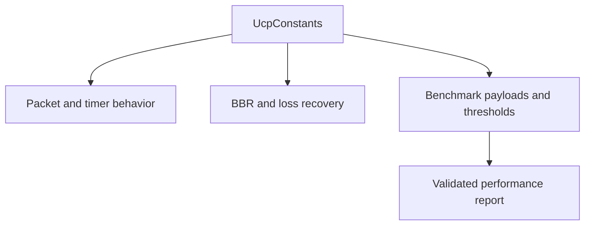

# UCP Constants Reference

[中文](constants_CN.md) | [Documentation Index](index.md)

All protocol constants live in `UcpConstants`. Time values are microseconds unless the name says otherwise.

## Packet Encoding

| Constant | Value | Meaning |
|---|---:|---|
| `MSS` | 1220 | Default maximum segment size including headers. |
| `DATA_HEADER_SIZE` | 20 | Common header plus DATA sequence/fragment fields. |
| `MAX_PAYLOAD_SIZE` | 1200 | Maximum DATA payload for default MSS. |
| `ACK_FIXED_SIZE` | 26 | ACK bytes before variable SACK blocks. |
| `SACK_BLOCK_SIZE` | 8 | Encoded SACK range size. |
| `DEFAULT_ACK_SACK_BLOCK_LIMIT` | 149 | Default SACK block cap for default MSS. |

## RTO And Recovery

| Constant | Value | Meaning |
|---|---:|---|
| `DEFAULT_RTO_MICROS` | 200,000 | Optimized minimum RTO. |
| `INITIAL_RTO_MICROS` | 250,000 | Initial RTO before RTT samples. |
| `DEFAULT_MAX_RTO_MICROS` | 15,000,000 | Optimized maximum RTO. |
| `RTO_BACKOFF_FACTOR` | 1.2 | Timeout backoff multiplier. |
| `RTO_RETRANSMIT_BUDGET_PER_TICK` | 4 | Timeout retransmits armed by one timer tick. |
| `URGENT_RETRANSMIT_BUDGET_PER_RTT` | 16 | Urgent retransmits allowed to bypass pacing/FQ per RTT window. |
| `URGENT_RETRANSMIT_DISCONNECT_THRESHOLD_PERCENT` | 75 | Tail-loss probe may become urgent after this idle percentage of disconnect timeout. |

## Pacing And Queuing

| Constant | Value | Meaning |
|---|---:|---|
| `DEFAULT_MIN_PACING_INTERVAL_MICROS` | 0 | No artificial minimum gap by default; token bucket controls pacing. |
| `DEFAULT_PACING_BUCKET_DURATION_MICROS` | 10,000 | Token bucket capacity duration. |
| `FAIR_QUEUE_ROUND_MILLISECONDS` | 10 | Server fair-queue credit round. |
| `MAX_BUFFERED_FAIR_QUEUE_ROUNDS` | 2 | Maximum retained FQ credit. |

## Fast Retransmit And NAK

| Constant | Value | Meaning |
|---|---:|---|
| `DUPLICATE_ACK_THRESHOLD` | 2 | Duplicate ACKs needed for fast retransmit. |
| `SACK_FAST_RETRANSMIT_THRESHOLD` | 2 | SACK observations needed for the first missing hole. |
| `SACK_FAST_RETRANSMIT_DISTANCE_THRESHOLD` | 2 | Later SACK distance needed to confirm a hole. |
| `SACK_FAST_RETRANSMIT_MIN_REORDER_GRACE_MICROS` | 5,000 | Minimum sender-side reorder grace for SACK repair. |
| `NAK_MISSING_THRESHOLD` | 2 | Receiver observations before NAK. |
| `NAK_REORDER_GRACE_MICROS` | 60,000 | Receiver-side reorder guard before NAK. |
| `NAK_REPEAT_INTERVAL_MICROS` | 250,000 | Per-sequence NAK repeat suppression. |
| `MAX_NAK_SEQUENCES_PER_PACKET` | 64 | Maximum missing sequences in one NAK. |

## BBR Recovery Constants

| Constant | Value | Meaning |
|---|---:|---|
| `BBR_FAST_RECOVERY_PACING_GAIN` | 1.25 | Pacing gain for non-congestion fast recovery. |
| `BBR_CONGESTION_LOSS_REDUCTION` | 0.98 | Gentle congestion-loss multiplier. |
| `BBR_MIN_LOSS_CWND_GAIN` | 0.95 | Lower bound for CWND gain after congestion loss. |
| `BBR_LOSS_CWND_RECOVERY_STEP` | 0.04 | Per-ACK recovery step back toward full CWND gain. |
| `BBR_RANDOM_LOSS_MAX_DEDUPED_EVENTS` | 2 | Small isolated loss count treated as random. |
| `BBR_CONGESTION_LOSS_WINDOW_THRESHOLD` | 3 | Larger loss windows need RTT evidence before congestion response. |
| `BBR_CONGESTION_LOSS_RTT_MULTIPLIER` | 1.10 | RTT inflation threshold for congestion classification. |

## Benchmark Payloads

| Scenario | Payload |
|---|---:|
| `BENCHMARK_100M_PAYLOAD_BYTES` | 4 MB |
| `BENCHMARK_100M_LOSS_PAYLOAD_BYTES` | 16 MB |
| `BENCHMARK_HIGH_LOSS_HIGH_RTT_PAYLOAD_BYTES` | 4 MB |
| `BENCHMARK_MOBILE_3G_PAYLOAD_BYTES` | 4 MB |
| `BENCHMARK_MOBILE_4G_PAYLOAD_BYTES` | 8 MB |
| `BENCHMARK_WEAK_4G_PAYLOAD_BYTES` | 4 MB |
| `BENCHMARK_SATELLITE_PAYLOAD_BYTES` | 8 MB |
| `BENCHMARK_VPN_PAYLOAD_BYTES` | 32 MB |
| `BENCHMARK_1G_PAYLOAD_BYTES` | 4 MB |
| `BENCHMARK_1G_LOSS_PAYLOAD_BYTES` | 64 MB |
| `BENCHMARK_10G_PAYLOAD_BYTES` | 8 MB |
| `BENCHMARK_LONG_FAT_100M_PAYLOAD_BYTES` | 16 MB |

Lossy payloads are intentionally larger than smoke-test payloads so the report measures sustained recovery instead of mostly startup and one or two RTTs of repair delay.

## Benchmark Acceptance

| Constant | Value | Meaning |
|---|---:|---|
| `BENCHMARK_MIN_NO_LOSS_UTILIZATION_PERCENT` | 70% | Minimum accepted no-loss utilization. |
| `BENCHMARK_MIN_LOSS_UTILIZATION_PERCENT` | 45% | Minimum controlled-loss utilization target. |
| `BENCHMARK_MIN_CONVERGED_PACING_RATIO` | 0.70 | Lower pacing convergence bound. |
| `BENCHMARK_MAX_CONVERGED_PACING_RATIO` | 1.35 | Upper pacing convergence bound. |
| `BENCHMARK_MAX_JITTER_DELAY_MULTIPLIER` | 4 | Maximum accepted jitter relative to configured delay. |

## Route And Weak-Network Constants

| Constant | Value | Meaning |
|---|---:|---|
| `BENCHMARK_ASYM_FORWARD_DELAY_MILLISECONDS` | 25 | Explicit A->B delay for `AsymRoute`. |
| `BENCHMARK_ASYM_BACKWARD_DELAY_MILLISECONDS` | 15 | Explicit B->A delay for `AsymRoute`. |
| `BENCHMARK_WEAK_4G_OUTAGE_PERIOD_MILLISECONDS` | 900 | Time before the single mid-transfer Weak4G outage. |
| `BENCHMARK_WEAK_4G_OUTAGE_DURATION_MILLISECONDS` | 80 | Weak4G blackout duration. |

